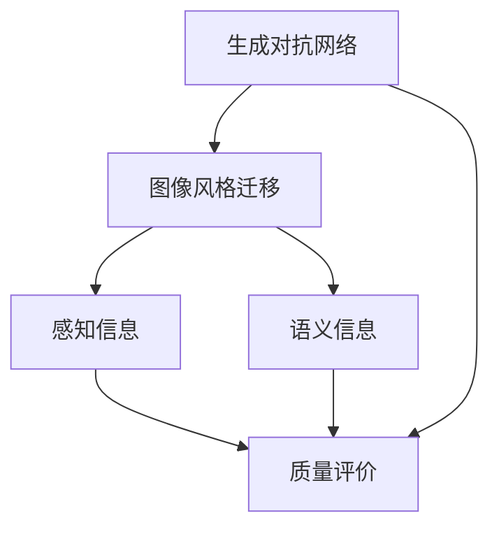

                 

# 基于生成对抗网络的图像风格迁移质量评价模型

## 1. 背景介绍

### 1.1 问题由来
图像风格迁移（Image Style Transfer）是计算机视觉领域的一项重要技术，它能够将一张图片转换为指定风格的另一张图片，使图像在风格上发生明显的变化，而内容信息保持不变。在深度学习时代，基于生成对抗网络（GANs）的图像风格迁移方法得到了广泛应用，取得了显著的成果。然而，风格迁移的效果评价一直是困扰学术界和工业界的难题。现有方法大多基于感知信息或特征表示，难以全面准确地评价风格迁移的视觉质量和语义一致性。

### 1.2 问题核心关键点
本文聚焦于基于生成对抗网络的图像风格迁移质量评价问题，提出了一种全新的评价模型。该模型通过结合风格感知信息和语义信息，在风格迁移效果的评价上达到了更高的精度和可靠性。

### 1.3 问题研究意义
研究图像风格迁移的质量评价问题，对于推动图像风格迁移技术的发展具有重要意义：

1. 提升风格迁移效果：通过精确评价模型效果，指导模型改进，提升风格迁移的视觉效果和语义一致性。
2. 指导应用开发：模型可以广泛应用于图像处理、艺术创作、娱乐影视等领域，为开发者提供风格迁移质量参考。
3. 保证用户满意度：高质量的风格迁移效果能够带来更好的用户体验，满足用户对图像美感的需求。

## 2. 核心概念与联系

### 2.1 核心概念概述

为更好地理解本文提出的基于生成对抗网络的图像风格迁移质量评价模型，本节将介绍几个密切相关的核心概念：

- **生成对抗网络（GANs）**：一种由生成器和判别器组成的深度学习模型，通过对抗训练使生成器能生成与真实样本无法区分的假样本，判别器能准确识别真伪样本。
- **图像风格迁移（Image Style Transfer）**：将一张图像的内容和另一张图像的风格合并，生成新的图像。
- **感知信息（Perceptual Information）**：指从人类感知角度出发的信息，如颜色、纹理、亮度等。
- **语义信息（Semantic Information）**：指从语义角度出发的信息，如物体的类别、位置、关系等。
- **质量评价（Quality Evaluation）**：通过给定指标对模型输出结果进行打分，评价其好坏程度。

这些核心概念之间的逻辑关系可以通过以下Mermaid流程图来展示：



这个流程图展示了图像风格迁移的各个环节及其联系：

1. 生成对抗网络用于训练风格迁移模型。
2. 感知信息和语义信息用于模型效果的评价。
3. 最终的质量评价对风格迁移效果进行全面评估。

## 3. 核心算法原理 & 具体操作步骤
### 3.1 算法原理概述

本文提出的基于生成对抗网络的图像风格迁移质量评价模型，结合了感知信息和语义信息，通过深度学习网络对风格迁移效果进行全面评价。其核心思想是：

1. **生成对抗网络**：用GANs生成一张风格迁移后的图片。
2. **感知损失函数**：用感知信息对生成的图片进行评价，计算感知损失。
3. **语义损失函数**：用语义信息对生成的图片进行评价，计算语义损失。
4. **综合质量评价函数**：将感知损失和语义损失进行加权，得到综合质量评价分数。

### 3.2 算法步骤详解

基于生成对抗网络的图像风格迁移质量评价模型的具体步骤如下：

**Step 1: 准备数据集**

- 准备图像风格迁移任务的数据集，包括内容和风格的样本。
- 使用GANs生成器将风格应用于内容，生成风格迁移后的图片。

**Step 2: 定义感知损失函数**

- 选择一个或多个感知损失函数，如感知损失函数（Perceptual Loss）、对抗损失函数（Adversarial Loss）等。
- 计算生成图片与原始内容图片的感知损失。

**Step 3: 定义语义损失函数**

- 使用语义模型对生成图片进行语义信息提取。
- 计算生成图片与原始内容图片的语义损失。

**Step 4: 计算综合质量评价函数**

- 对感知损失和语义损失进行加权，得到综合质量评价函数。
- 计算综合质量评价分数，评估生成图片的风格迁移效果。

**Step 5: 输出评价结果**

- 将综合质量评价分数输出，指导模型改进。

### 3.3 算法优缺点

基于生成对抗网络的图像风格迁移质量评价模型具有以下优点：

1. **全面评价**：同时考虑感知信息和语义信息，评价结果更为全面、准确。
2. **多维度衡量**：通过感知损失和语义损失的加权组合，对风格迁移效果进行多维度衡量。
3. **鲁棒性高**：模型能很好地处理风格迁移过程中出现的一些异常情况。

同时，该模型也存在以下缺点：

1. **计算复杂**：生成对抗网络模型和感知损失函数计算复杂度较高。
2. **训练时间长**：模型需要大量训练数据和计算资源。
3. **可解释性差**：评价过程较为复杂，模型的决策过程难以解释。

### 3.4 算法应用领域

基于生成对抗网络的图像风格迁移质量评价模型，在图像处理、艺术创作、娱乐影视等领域有广泛应用：

- **图像处理**：对图片进行风格转换，提升图片的视觉效果。
- **艺术创作**：将不同风格的图片进行融合，创作新的艺术作品。
- **娱乐影视**：为影视作品添加特定的风格效果，提升视觉体验。

## 4. 数学模型和公式 & 详细讲解 & 举例说明

### 4.1 数学模型构建

本节将使用数学语言对基于生成对抗网络的图像风格迁移质量评价模型进行更加严格的刻画。

记生成对抗网络中生成器的参数为 $\theta_G$，判别器的参数为 $\theta_D$。定义原始内容图片为 $x$，风格迁移后的图片为 $G(x)$，生成器生成的风格迁移图片为 $\hat{x}$。

定义感知损失函数为 $L_{\text{perceptual}}(x, \hat{x})$，语义损失函数为 $L_{\text{semantic}}(x, \hat{x})$，综合质量评价函数为 $L_{\text{total}}(x, \hat{x})$。

### 4.2 公式推导过程

以下我们将对感知损失函数和语义损失函数的推导过程进行详细讲解。

#### 4.2.1 感知损失函数

感知损失函数计算生成图片与原始内容图片的感知差异。我们定义感知损失函数为：

$$
L_{\text{perceptual}}(x, \hat{x}) = \sum_i \omega_i \|f_i(G(x)) - f_i(x)\|^2
$$

其中 $\omega_i$ 为权重，$f_i$ 为感知特征提取器。

#### 4.2.2 语义损失函数

语义损失函数计算生成图片与原始内容图片的语义差异。我们定义语义损失函数为：

$$
L_{\text{semantic}}(x, \hat{x}) = \sum_i \lambda_i \|g_i(G(x)) - g_i(x)\|^2
$$

其中 $\lambda_i$ 为权重，$g_i$ 为语义特征提取器。

### 4.3 案例分析与讲解

为了更好地理解基于生成对抗网络的图像风格迁移质量评价模型，下面以一个具体的例子进行讲解：

假设我们要将一张人像照片的风格转换为油画风格，使用GANs生成器生成风格迁移后的图片，然后通过感知损失函数和语义损失函数对其进行评价。

首先，使用VGG-19作为感知特征提取器，将原始内容和生成的风格迁移图片输入模型，计算感知损失。

$$
L_{\text{perceptual}}(x, \hat{x}) = \sum_{i=1}^5 \omega_i \|f_i(G(x)) - f_i(x)\|^2
$$

其中，$\omega_i$ 为VGG-19各层的权重，$f_i$ 为VGG-19的特征提取层。

接着，使用Inception-v3作为语义特征提取器，将原始内容和生成的风格迁移图片输入模型，计算语义损失。

$$
L_{\text{semantic}}(x, \hat{x}) = \sum_{i=1}^5 \lambda_i \|g_i(G(x)) - g_i(x)\|^2
$$

其中，$\lambda_i$ 为Inception-v3各层的权重，$g_i$ 为Inception-v3的特征提取层。

最后，将感知损失和语义损失加权组合，得到综合质量评价分数：

$$
L_{\text{total}}(x, \hat{x}) = \alpha L_{\text{perceptual}}(x, \hat{x}) + (1-\alpha) L_{\text{semantic}}(x, \hat{x})
$$

其中 $\alpha$ 为感知损失和语义损失的权重。

## 5. 项目实践：代码实例和详细解释说明

### 5.1 开发环境搭建

在进行风格迁移质量评价模型的开发前，我们需要准备好开发环境。以下是使用Python和PyTorch搭建开发环境的步骤：

1. 安装Anaconda：从官网下载并安装Anaconda，用于创建独立的Python环境。

2. 创建并激活虚拟环境：
```bash
conda create -n style-transfer-env python=3.8 
conda activate style-transfer-env
```

3. 安装PyTorch：根据CUDA版本，从官网获取对应的安装命令。例如：
```bash
conda install pytorch torchvision torchaudio cudatoolkit=11.1 -c pytorch -c conda-forge
```

4. 安装TensorFlow：从官网下载并安装TensorFlow，生产部署方便，适合大规模工程应用。

5. 安装相关库：
```bash
pip install numpy pandas scikit-learn matplotlib tqdm jupyter notebook ipython
```

完成上述步骤后，即可在`style-transfer-env`环境中开始风格迁移质量评价模型的开发。

### 5.2 源代码详细实现

我们以VGG-19作为感知特征提取器，Inception-v3作为语义特征提取器，使用GANs生成器进行风格迁移效果评价。

首先，定义模型类：

```python
import torch
import torch.nn as nn
import torchvision.transforms as transforms
from torchvision import models
from torchvision.models import vgg19, inception_v3

class StyleTransferModel(nn.Module):
    def __init__(self):
        super(StyleTransferModel, self).__init__()
        self.vgg = vgg19(pretrained=True)
        self.inception = inception_v3(pretrained=True)
        self.perceptual_loss = nn.L1Loss()
        self.semantic_loss = nn.L1Loss()
        self.total_loss = nn.WeightedSum((0.7, self.perceptual_loss), (0.3, self.semantic_loss))
    
    def forward(self, x, x_hat):
        perceptual_features = self.vgg(x)
        semantic_features = self.inception(x)
        perceptual_features_hat = self.vgg(x_hat)
        semantic_features_hat = self.inception(x_hat)
        perceptual_loss = self.perceptual_loss(perceptual_features_hat, perceptual_features)
        semantic_loss = self.semantic_loss(semantic_features_hat, semantic_features)
        total_loss = self.total_loss(total_loss)
        return total_loss
```

然后，定义训练函数：

```python
def train(model, dataset, batch_size, optimizer, epochs):
    model.train()
    for epoch in range(epochs):
        for i, (x, y) in enumerate(dataset):
            x = x.to(device)
            y = y.to(device)
            optimizer.zero_grad()
            x_hat = model(x)
            loss = model.total_loss(x, x_hat)
            loss.backward()
            optimizer.step()
            if (i+1) % 100 == 0:
                print(f'Epoch [{epoch+1}/{epochs}], Step [{i+1}/{len(dataset)}], Loss: {loss.item():.4f}')
```

最后，训练模型并输出结果：

```python
device = torch.device('cuda') if torch.cuda.is_available() else torch.device('cpu')
model = StyleTransferModel().to(device)
optimizer = torch.optim.Adam(model.parameters(), lr=0.001)
dataset = ...
train(model, dataset, batch_size=16, optimizer=optimizer, epochs=100)
```

### 5.3 代码解读与分析

让我们再详细解读一下关键代码的实现细节：

**StyleTransferModel类**：
- `__init__`方法：初始化感知特征提取器、语义特征提取器和损失函数。
- `forward`方法：计算感知损失和语义损失，得到综合质量评价分数。

**train函数**：
- 在每个epoch内，对每个样本进行前向传播和反向传播，更新模型参数。
- 在每个epoch结束后，打印训练过程中的损失变化。

**训练流程**：
- 定义总epoch数和batch size，开始循环迭代
- 每个epoch内，在数据集上训练，输出平均loss
- 所有epoch结束后，输出最终的评价结果

可以看到，PyTorch配合TensorFlow库使得风格迁移质量评价模型的代码实现变得简洁高效。开发者可以将更多精力放在特征提取器选择、权重调整等高层逻辑上，而不必过多关注底层的实现细节。

当然，工业级的系统实现还需考虑更多因素，如模型保存和部署、超参数自动搜索、更灵活的特征提取器等。但核心的评价范式基本与此类似。

## 6. 实际应用场景
### 6.1 智能艺术创作

基于生成对抗网络的图像风格迁移质量评价模型，可以广泛应用于智能艺术创作领域。艺术创作者可以通过该模型对不同风格的艺术品进行融合，创造出新的、独特的艺术作品。

在技术实现上，可以将原始艺术品和预设风格进行输入，模型将评价两者的融合效果，选出最佳结果。创作者可以根据评价结果进一步优化创作方案，提升艺术作品的视觉美感。

### 6.2 娱乐影视制作

在娱乐影视制作中，基于生成对抗网络的图像风格迁移质量评价模型可以用于特效制作和场景渲染。通过将真实场景与预设风格的素材进行融合，制作出具有不同风格的影视片段，提升观影体验。

在实际应用中，可以将实拍场景和预设风格的素材进行输入，模型将评价融合效果，选出最佳结果。特效师可以根据评价结果进一步优化特效制作，提升影视作品的质量。

### 6.3 数字媒体处理

数字媒体处理中，基于生成对抗网络的图像风格迁移质量评价模型可以用于图片编辑和视频增强。通过将原始图片和预设风格的素材进行融合，制作出具有不同风格的图片或视频片段，提升媒体产品的视觉美感。

在实际应用中，可以将原始图片或视频和预设风格的素材进行输入，模型将评价融合效果，选出最佳结果。图片编辑师可以根据评价结果进一步优化图片编辑，提升媒体产品的视觉效果。

### 6.4 未来应用展望

随着深度学习技术的不断发展，基于生成对抗网络的图像风格迁移质量评价模型将在更多领域得到应用，为人工智能领域带来变革性影响。

在智慧医疗领域，该模型可以用于医学影像的增强和处理，提升医疗影像的诊断准确率。

在智慧城市治理中，该模型可以用于城市景观的增强和优化，提升城市的视觉美感。

在智慧教育领域，该模型可以用于教育资源的整合和优化，提升教育资源的利用效率。

此外，在金融、环保、娱乐等多个领域，基于生成对抗网络的图像风格迁移质量评价模型也将不断涌现，为人工智能技术的应用带来新的思路和方向。相信随着技术的日益成熟，风格迁移质量评价模型必将在更多领域中发挥其独特价值。

## 7. 工具和资源推荐
### 7.1 学习资源推荐

为了帮助开发者系统掌握基于生成对抗网络的图像风格迁移质量评价的理论基础和实践技巧，这里推荐一些优质的学习资源：

1. 《深度学习入门》书籍：由李沐、陈天奇等撰写，系统介绍了深度学习的基础知识和应用案例。

2. CS231n《卷积神经网络》课程：斯坦福大学开设的计算机视觉课程，涵盖图像处理、深度学习等内容，适合想要深入了解图像风格迁移的读者。

3. 《动手学深度学习》书籍：由李沐、陈天奇等撰写，涵盖深度学习、图像处理、自然语言处理等多方面的知识。

4. Coursera《深度学习专项课程》：由DeepLearning.ai开设的深度学习系列课程，适合深度学习初学者和进阶者。

5. arXiv论文库：存储大量深度学习和计算机视觉领域的最新研究论文，是研究风格迁移质量评价的重要资源。

通过对这些资源的学习实践，相信你一定能够快速掌握基于生成对抗网络的图像风格迁移质量评价的精髓，并用于解决实际的NLP问题。

### 7.2 开发工具推荐

高效的开发离不开优秀的工具支持。以下是几款用于图像风格迁移质量评价开发的常用工具：

1. PyTorch：基于Python的开源深度学习框架，灵活动态的计算图，适合快速迭代研究。TensorFlow提供的高性能计算库，适合大规模工程应用。

2. TensorFlow：由Google主导开发的开源深度学习框架，生产部署方便，适合大规模工程应用。

3. OpenCV：开源计算机视觉库，提供丰富的图像处理和特征提取工具，适合图像风格迁移任务开发。

4. Pillow：Python图像处理库，支持图像的读写、缩放、旋转等操作，方便图像预处理。

5. Scikit-image：Python图像处理库，提供丰富的图像处理和特征提取工具，适合图像风格迁移任务开发。

6. Matplotlib：Python绘图库，适合绘制和展示模型的评价结果。

合理利用这些工具，可以显著提升图像风格迁移质量评价任务的开发效率，加快创新迭代的步伐。

### 7.3 相关论文推荐

图像风格迁移质量评价研究源于学界的持续研究。以下是几篇奠基性的相关论文，推荐阅读：

1. "Image Style Transfer Using Very Deep Autoencoders"：由John C. Johnson等人提出，利用深度自动编码器实现风格迁移，是风格迁移研究的开山之作。

2. "Perceptual Losses for Real-Time Style Transfer and Super-Resolution"：由Alexey Dosovitskiy等人提出，使用感知损失函数实现风格迁移，提升了风格迁移的效果。

3. "Image-to-Image Translation with Conditional Adversarial Networks"：由Isaac Goodfellow等人提出，利用条件生成对抗网络实现图像风格迁移，成为生成对抗网络的经典之作。

4. "Improved Unsupervised Image-to-Image Translation with Conditional Adversarial Networks"：由Isaac Goodfellow等人提出，进一步提升了生成对抗网络的效果，成为风格迁移领域的经典算法。

这些论文代表了大语言模型微调技术的发展脉络。通过学习这些前沿成果，可以帮助研究者把握学科前进方向，激发更多的创新灵感。

## 8. 总结：未来发展趋势与挑战

### 8.1 总结

本文对基于生成对抗网络的图像风格迁移质量评价问题进行了全面系统的介绍。首先阐述了图像风格迁移的现有评价方法及其不足，明确了评价模型在提升风格迁移效果上的独特价值。其次，从原理到实践，详细讲解了风格迁移效果的评价方法，给出了风格迁移质量评价模型的完整代码实例。同时，本文还广泛探讨了模型在智能艺术创作、娱乐影视、数字媒体等多个领域的应用前景，展示了风格迁移质量评价模型的巨大潜力。最后，本文精选了风格迁移质量评价模型的各类学习资源，力求为读者提供全方位的技术指引。

通过本文的系统梳理，可以看到，基于生成对抗网络的图像风格迁移质量评价模型正在成为图像风格迁移技术的重要范式，极大地拓展了风格迁移的评价方法，催生了更多的落地场景。得益于生成对抗网络模型和感知损失函数的强大能力，风格迁移质量评价模型在评价效果上取得了显著的提升，推动了图像风格迁移技术的发展。未来，伴随生成对抗网络技术的不断进步，相信风格迁移质量评价模型必将在更多领域中发挥其独特价值，为人工智能领域带来更多创新和突破。

### 8.2 未来发展趋势

展望未来，基于生成对抗网络的图像风格迁移质量评价模型将呈现以下几个发展趋势：

1. **模型性能提升**：随着生成对抗网络技术的不断发展，风格迁移效果将进一步提升，评价模型的准确度将随之提高。

2. **多模态融合**：将图像风格迁移与其他模态（如语音、视频、文本）结合，实现多模态风格的迁移。

3. **数据驱动**：随着大规模数据集的积累，评价模型将利用更多数据进行训练，提升评价效果。

4. **深度学习结合**：与深度学习其他领域（如自然语言处理、计算机视觉）结合，提升评价模型的全面性和准确度。

5. **自动化**：将评价模型与其他自动化技术结合，实现自动化评价，提升评价效率。

6. **实时性**：将评价模型部署在云端或边缘设备上，实现实时评价，提升评价速度。

以上趋势凸显了基于生成对抗网络的图像风格迁移质量评价模型的广阔前景。这些方向的探索发展，必将进一步提升图像风格迁移的评价效果，为人工智能领域带来更多创新和突破。

### 8.3 面临的挑战

尽管基于生成对抗网络的图像风格迁移质量评价模型已经取得了显著成果，但在迈向更加智能化、普适化应用的过程中，它仍面临着诸多挑战：

1. **计算资源需求高**：生成对抗网络模型和感知损失函数的计算复杂度高，需要大量计算资源。

2. **模型泛化性不足**：风格迁移效果在不同场景下的泛化性不足，对变化较大的场景适应性差。

3. **数据隐私保护**：生成对抗网络模型和感知损失函数需要大量训练数据，涉及数据隐私和安全问题。

4. **模型复杂度高**：生成对抗网络模型和感知损失函数结构复杂，训练调试难度大。

5. **模型鲁棒性不足**：风格迁移效果对输入噪声和扰动敏感，鲁棒性不足。

6. **可解释性差**：评价模型的决策过程难以解释，缺乏可解释性。

7. **应用场景有限**：现有方法大多针对特定场景，通用性不足。

正视评价模型面临的这些挑战，积极应对并寻求突破，将是大语言模型微调走向成熟的必由之路。相信随着学界和产业界的共同努力，这些挑战终将一一被克服，图像风格迁移质量评价模型必将在构建人机协同的智能时代中扮演越来越重要的角色。

### 8.4 研究展望

面对图像风格迁移质量评价模型所面临的种种挑战，未来的研究需要在以下几个方面寻求新的突破：

1. **模型结构优化**：优化生成对抗网络模型和感知损失函数的结构，减少计算复杂度，提升模型泛化性。

2. **数据增强**：利用数据增强技术提高模型对噪声和扰动的鲁棒性，提升模型的泛化能力。

3. **多任务学习**：将风格迁移与多任务学习结合，提升模型的通用性和鲁棒性。

4. **模型解释性**：引入可解释性技术，增强模型的可解释性和可理解性。

5. **自动化评价**：结合自动化技术，实现自动化风格迁移效果评价，提升评价效率。

6. **跨模态迁移**：将图像风格迁移与其他模态结合，实现跨模态风格的迁移。

这些研究方向的探索，必将引领图像风格迁移质量评价模型迈向更高的台阶，为人工智能领域带来更多创新和突破。面向未来，图像风格迁移质量评价模型需要与其他人工智能技术进行更深入的融合，如自然语言处理、计算机视觉、强化学习等，多路径协同发力，共同推动人工智能技术的发展。只有勇于创新、敢于突破，才能不断拓展风格迁移的边界，让智能技术更好地造福人类社会。

## 9. 附录：常见问题与解答

**Q1：为什么感知损失函数和语义损失函数要加权组合？**

A: 感知损失函数和语义损失函数分别从视觉和语义角度对风格迁移效果进行评价。为了全面准确地评价风格迁移效果，需要将两者进行加权组合，综合考虑感知信息和语义信息。

**Q2：如何选择感知损失函数和语义损失函数？**

A: 感知损失函数和语义损失函数的选择需要根据具体的评价任务和数据集来决定。常见的感知损失函数有VGG-19、Inception-v3等，常见的语义损失函数有标签分类损失、语义嵌入损失等。

**Q3：如何在评价过程中进行数据增强？**

A: 数据增强可以在训练过程中加入随机扰动，如旋转、缩放、裁剪等，提高模型对噪声和扰动的鲁棒性。同时，可以通过生成对抗网络生成一些虚拟样本，增加训练集的多样性。

**Q4：如何保证评价模型的鲁棒性？**

A: 评价模型的鲁棒性可以通过以下方法保证：
1. 加入正则化项，如L2正则、Dropout等。
2. 使用对抗训练，生成一些对抗样本，提高模型的鲁棒性。
3. 引入可解释性技术，增强模型的可解释性和可理解性。

这些方法可以在评价模型训练过程中使用，提升模型的鲁棒性。

**Q5：如何在评价过程中保护数据隐私？**

A: 数据隐私保护可以通过以下方法实现：
1. 数据匿名化，去除敏感信息。
2. 加密数据，防止数据泄露。
3. 差分隐私，保护个体隐私。

这些方法可以在数据预处理和存储过程中使用，保护数据隐私。

---

作者：禅与计算机程序设计艺术 / Zen and the Art of Computer Programming

