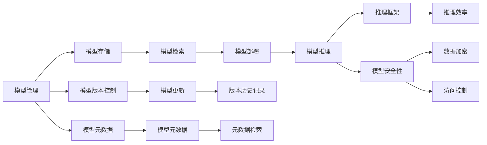

                 

## 1. 背景介绍

在现代信息技术飞速发展的今天，构建高效、稳定、灵活的基础模型公共基础设施已成为各个行业的热点话题。基础模型，特别是深度学习模型，已经成为许多领域（如自然语言处理、计算机视觉、语音识别等）的核心工具。这些模型通常具有高参数量、复杂性、训练和部署成本高等特点。为了更好地管理和利用这些模型，构建一个高效、可扩展的基础模型公共基础设施变得尤为重要。

### 1.1 问题由来

随着深度学习模型的广泛应用，业界和学术界对基础模型公共基础设施的需求越来越迫切。目前，许多组织正在探索如何构建和维护这些基础设施，以降低模型的开发和维护成本，提高模型的易用性和可扩展性。

### 1.2 问题核心关键点

构建基础模型的公共基础设施，主要围绕以下几个核心关键点展开：

- 模型管理：如何高效存储、检索和更新模型。
- 模型推理：如何提供高效的模型推理服务。
- 模型优化：如何对模型进行优化和调优。
- 模型共享：如何支持多用户共享和协作。
- 模型版本控制：如何管理模型版本和变更历史。
- 模型安全性：如何保护模型的安全性和隐私。

### 1.3 问题研究意义

构建基础模型的公共基础设施，对于推动深度学习模型的广泛应用，促进学术和工业界的研究创新，具有重要的意义：

1. 降低开发和维护成本：集中管理模型，避免重复开发和维护。
2. 提高模型的易用性和可扩展性：提供便捷的API接口，支持模型的快速部署和更新。
3. 加速研究和创新：为研究人员和工程师提供高效的开发环境，加速创新。
4. 促进跨学科合作：提供平台，支持跨领域的模型共享和协作。
5. 增强模型安全性：提供安全的访问控制和数据保护机制，防止模型滥用。

## 2. 核心概念与联系

### 2.1 核心概念概述

构建基础模型的公共基础设施，涉及到一系列关键概念和技术，包括模型管理、模型推理、模型优化、模型共享、版本控制和模型安全性等。

- **模型管理**：指如何高效存储、检索和更新深度学习模型。模型管理通常包括模型的元数据管理、版本控制和模型存储等。
- **模型推理**：指如何提供高效的模型推理服务，包括推理框架的选择、推理效率的优化等。
- **模型优化**：指如何对模型进行优化和调优，以提升模型的性能和效率。模型优化包括超参数调优、量化、剪枝等。
- **模型共享**：指如何支持多用户共享和协作，提供模型版本控制、权限管理等功能。
- **模型安全性**：指如何保护模型的安全性和隐私，包括数据加密、访问控制等。

这些概念之间的关系可以通过以下Mermaid流程图来展示：



### 2.2 核心概念原理和架构

#### 模型管理

模型管理的核心是高效地存储、检索和更新深度学习模型。通常使用分布式文件系统（如Hadoop、Ceph等）或对象存储系统（如Amazon S3、Google Cloud Storage等）来存储模型文件。模型文件通常包含模型的参数、架构和元数据等信息。

**模型存储**：
- **集中式存储**：将模型文件存储在集中的存储系统中，便于集中管理和检索。
- **分布式存储**：将模型文件存储在分布式系统中，提供高可扩展性和可靠性。

**模型版本控制**：
- **版本管理工具**：如git、SVN等，记录和管理模型的历史版本。
- **版本合并策略**：如Git Merge、Git Rebase等，处理模型版本冲突和合并。

**元数据管理**：
- **元数据**：包括模型的描述、训练参数、训练日志等，用于记录模型的详细信息。
- **元数据存储**：通常使用数据库（如MySQL、PostgreSQL等）或文档存储系统（如MongoDB、Elasticsearch等）来存储和管理元数据。

#### 模型推理

模型推理的核心是提供高效的模型推理服务，以便用户能够快速地对模型进行推理。通常使用推理框架（如TensorFlow、PyTorch、ONNX等）来提供模型推理服务。

**推理框架选择**：
- **TensorFlow**：适用于大规模分布式推理，支持CPU、GPU和TPU等硬件。
- **PyTorch**：适用于学术研究和实验原型，支持动态图和静态图推理。
- **ONNX**：适用于模型转换和跨平台推理，支持多种硬件和框架。

**推理效率优化**：
- **推理优化工具**：如TensorFlow Lite、ONNX Runtime等，优化推理性能。
- **推理加速器**：如GPU、TPU、FPGA等，加速推理计算。

#### 模型优化

模型优化的核心是提升模型的性能和效率，以便更好地服务于应用场景。模型优化通常包括超参数调优、量化、剪枝等。

**超参数调优**：
- **网格搜索**：枚举所有可能的超参数组合，找到最优解。
- **随机搜索**：从超参数空间中随机采样，找到较好的解。
- **贝叶斯优化**：使用贝叶斯模型指导超参数搜索，提高效率。

**量化**：
- **整数量化**：将浮点数参数转换为整数，减少内存占用和计算开销。
- **混合精度训练**：使用混合精度（如FP16）进行训练，提高训练速度和内存效率。

**剪枝**：
- **结构剪枝**：去除模型中的冗余层或神经元，减少模型大小和计算量。
- **权重剪枝**：去除模型中的小权重，减少模型参数和计算量。

#### 模型共享

模型共享的核心是支持多用户共享和协作，提供模型版本控制、权限管理等功能。

**版本控制**：
- **版本管理工具**：如git、SVN等，记录和管理模型的历史版本。
- **版本合并策略**：如Git Merge、Git Rebase等，处理模型版本冲突和合并。

**权限管理**：
- **访问控制**：如RBAC（基于角色的访问控制）、ABAC（基于属性的访问控制）等，限制模型的访问权限。
- **审计日志**：记录模型访问和操作日志，用于安全审计和问题排查。

#### 模型安全性

模型安全性的核心是保护模型的安全性和隐私，包括数据加密、访问控制等。

**数据加密**：
- **模型加密**：使用加密算法（如AES、RSA等）对模型参数进行加密，保护模型安全。
- **数据加密**：使用加密算法对数据进行加密，保护数据隐私。

**访问控制**：
- **身份验证**：使用用户名密码、OAuth等身份验证方式，确保模型的访问者身份。
- **权限控制**：使用RBAC、ABAC等权限控制机制，限制模型的访问权限。

这些核心概念和技术构成了基础模型公共基础设施的基础架构，其有效融合与高效运行，对于构建一个强大的基础模型生态系统至关重要。

## 3. 核心算法原理 & 具体操作步骤

### 3.1 算法原理概述

基础模型公共基础设施的构建，通常基于以下几个核心算法原理：

- **分布式存储系统**：如Hadoop、Ceph、Amazon S3等，用于高效存储和管理模型文件。
- **版本控制系统**：如git、SVN等，用于记录和管理模型的历史版本。
- **元数据管理**：使用数据库或文档存储系统，存储和管理模型的元数据。
- **推理框架**：如TensorFlow、PyTorch、ONNX等，用于提供高效的模型推理服务。
- **模型优化技术**：如超参数调优、量化、剪枝等，用于提升模型的性能和效率。
- **安全技术**：如数据加密、访问控制等，用于保护模型的安全性和隐私。

### 3.2 算法步骤详解

#### 1. 模型存储和管理

**步骤1**：选择合适的存储系统，如Hadoop、Ceph或Amazon S3等，用于存储模型文件。

**步骤2**：将模型文件上传到存储系统中，确保文件完整性和一致性。

**步骤3**：在存储系统中创建版本控制机制，记录和管理模型历史版本。

**步骤4**：使用元数据管理工具，记录和管理模型的元数据，包括模型描述、训练参数、训练日志等。

#### 2. 模型推理和优化

**步骤1**：选择合适的推理框架，如TensorFlow、PyTorch或ONNX等，用于提供模型推理服务。

**步骤2**：在推理框架中实现模型的推理功能，提供高效、可靠的推理服务。

**步骤3**：使用推理优化工具，如TensorFlow Lite、ONNX Runtime等，优化推理性能。

**步骤4**：使用模型优化技术，如超参数调优、量化、剪枝等，提升模型性能和效率。

#### 3. 模型共享和访问控制

**步骤1**：在系统中创建权限管理系统，定义用户和角色。

**步骤2**：在权限管理系统中定义模型访问权限，限制用户对模型的访问。

**步骤3**：在系统中记录和管理模型访问日志，用于安全审计和问题排查。

**步骤4**：提供API接口，让用户能够方便地访问和使用模型。

#### 4. 模型安全性和隐私保护

**步骤1**：在系统中实现数据加密机制，保护模型的安全性和隐私。

**步骤2**：在系统中实现访问控制机制，限制模型的访问权限。

**步骤3**：使用安全审计工具，监控和记录模型的访问和使用情况。

**步骤4**：定期进行安全评估，发现并修复安全漏洞。

### 3.3 算法优缺点

**优点**：
- **高效性**：通过分布式存储和高效的推理框架，提供快速、稳定的模型推理服务。
- **可扩展性**：通过集中式存储和元数据管理，支持模型的快速部署和更新。
- **安全性**：通过数据加密和访问控制，保护模型的安全性和隐私。

**缺点**：
- **复杂性**：系统设计复杂，需要跨学科知识。
- **资源消耗**：系统运行需要大量的计算资源和存储资源。
- **维护成本**：系统的维护和升级成本较高，需要专业团队支持。

### 3.4 算法应用领域

基础模型公共基础设施的应用领域非常广泛，包括但不限于以下几个方面：

- **自然语言处理**：如文本分类、情感分析、机器翻译等。
- **计算机视觉**：如图像识别、目标检测、图像分割等。
- **语音识别**：如语音识别、语音合成等。
- **推荐系统**：如协同过滤、内容推荐等。
- **智能医疗**：如医学影像分析、疾病诊断等。

## 4. 数学模型和公式 & 详细讲解 & 举例说明

### 4.1 数学模型构建

在基础模型公共基础设施的构建中，涉及到多个数学模型和公式。以下是一些常见的数学模型和公式：

**模型存储**：
- **分布式文件系统模型**：用于描述分布式文件系统的数据分布和访问模式。
- **对象存储模型**：用于描述对象存储系统的数据存储和检索模式。

**版本控制**：
- **Git模型**：用于描述Git的版本控制机制和合并策略。
- **SVN模型**：用于描述SVN的版本控制机制和合并策略。

**元数据管理**：
- **数据库模型**：用于描述数据库的表结构、索引和查询语言。
- **文档存储模型**：用于描述文档存储系统的文档结构和检索模式。

**推理框架**：
- **TensorFlow模型**：用于描述TensorFlow的计算图和自动微分。
- **PyTorch模型**：用于描述PyTorch的动态图和静态图。

**模型优化**：
- **超参数调优模型**：用于描述超参数调优的网格搜索、随机搜索和贝叶斯优化算法。
- **量化模型**：用于描述量化技术的整数量化和混合精度训练。
- **剪枝模型**：用于描述剪枝技术的结构剪枝和权重剪枝。

**模型安全性**：
- **数据加密模型**：用于描述AES、RSA等加密算法。
- **访问控制模型**：用于描述RBAC、ABAC等访问控制机制。

### 4.2 公式推导过程

#### 分布式文件系统模型

**公式1**：分布式文件系统的数据分布策略

$$
D = \{D_1, D_2, ..., D_n\}
$$

其中，$D_i$表示数据块在分布式文件系统中的位置，$i$表示数据块编号。

**公式2**：分布式文件系统的数据访问策略

$$
R = \{R_1, R_2, ..., R_n\}
$$

其中，$R_i$表示数据块在分布式文件系统中的访问路径，$i$表示数据块编号。

#### 版本控制模型

**公式3**：Git版本控制机制

$$
V = \{V_1, V_2, ..., V_n\}
$$

其中，$V_i$表示Git仓库的第$i$个版本，$i$表示版本号。

**公式4**：Git合并策略

$$
Merge(V_i, V_j) = V_k
$$

其中，$Merge$表示Git的合并操作，$V_i$和$V_j$表示需要合并的两个版本，$V_k$表示合并后的版本。

#### 元数据管理模型

**公式5**：数据库表结构

$$
T = \{T_1, T_2, ..., T_n\}
$$

其中，$T_i$表示数据库中的第$i$个表，$i$表示表编号。

**公式6**：数据库索引

$$
I = \{I_1, I_2, ..., I_n\}
$$

其中，$I_i$表示数据库中的第$i$个索引，$i$表示索引编号。

#### 推理框架模型

**公式7**：TensorFlow计算图

$$
G = \{Node_i, Edge_{ij}\}
$$

其中，$Node_i$表示TensorFlow计算图中的第$i$个节点，$Edge_{ij}$表示节点$i$和节点$j$之间的边。

**公式8**：TensorFlow自动微分

$$
\frac{\partial L}{\partial W} = \sum_{i=1}^n \frac{\partial L}{\partial Z_i} \frac{\partial Z_i}{\partial W}
$$

其中，$L$表示损失函数，$W$表示模型参数，$Z_i$表示中间变量。

#### 模型优化模型

**公式9**：超参数调优网格搜索

$$
S = \{P_{ij}\}
$$

其中，$P_{ij}$表示超参数的$i$维和$j$维取值，$i$表示超参数编号，$j$表示取值编号。

**公式10**：量化整数量化

$$
W' = \lfloor 255 \times \frac{W}{255} \rfloor
$$

其中，$W'$表示量化后的参数，$W$表示原始参数。

#### 模型安全性模型

**公式11**：AES加密算法

$$
C = AES_K(P)
$$

其中，$C$表示加密后的密文，$P$表示明文，$K$表示密钥。

**公式12**：RBAC访问控制

$$
R = \{User_i, Role_j, Perm_{ij}\}
$$

其中，$User_i$表示用户$i$，$Role_j$表示角色$j$，$Perm_{ij}$表示用户$i$对角色$j$的权限。

### 4.3 案例分析与讲解

#### 案例1：自然语言处理模型

**背景**：
某公司开发了一个基于BERT模型的情感分析系统，用于分析用户评论的情感倾向。

**步骤**：
1. 将用户评论上传至Hadoop分布式文件系统，使用Git版本控制记录版本变化。
2. 在Git仓库中使用Git Merge合并不同版本。
3. 在数据库中存储模型元数据，包括模型描述、训练参数和训练日志。
4. 在TensorFlow中实现模型的推理功能，使用AES加密保护模型参数。
5. 在RBAC权限控制下，限制用户对模型的访问权限。

#### 案例2：计算机视觉模型

**背景**：
某公司开发了一个基于ResNet模型的图像识别系统，用于识别图像中的物体。

**步骤**：
1. 将图像上传至Amazon S3对象存储系统，使用版本控制记录版本变化。
2. 在对象存储系统中使用S3数据加密保护图像数据。
3. 在PyTorch中实现模型的推理功能，使用RBAC权限控制限制用户访问。
4. 在数据库中存储模型元数据，包括模型描述、训练参数和训练日志。
5. 在TensorFlow Lite中优化推理性能，使用混合精度训练提升模型效率。

## 5. 项目实践：代码实例和详细解释说明

### 5.1 开发环境搭建

在开始项目实践之前，需要搭建好开发环境。以下是搭建Python开发环境的步骤：

1. 安装Anaconda：从官网下载并安装Anaconda，用于创建独立的Python环境。

2. 创建并激活虚拟环境：
```bash
conda create -n myenv python=3.8
conda activate myenv
```

3. 安装必要的库：
```bash
pip install numpy pandas scikit-learn tensorboard transformers
```

4. 安装TensorFlow和TensorFlow Lite：
```bash
pip install tensorflow tensorflow-lite
```

### 5.2 源代码详细实现

#### 示例1：自然语言处理模型

```python
import numpy as np
import pandas as pd
from transformers import BertTokenizer, BertForSequenceClassification
from transformers import Trainer, TrainingArguments
from transformers import pipeline
from transformers import BertTokenizerFast, BertForSequenceClassification

# 加载数据集
df = pd.read_csv('data.csv')

# 加载BERT模型和分词器
model_name = 'bert-base-cased'
tokenizer = BertTokenizer.from_pretrained(model_name)
model = BertForSequenceClassification.from_pretrained(model_name, num_labels=2)

# 定义训练函数
def train_model(model, train_dataset, val_dataset, args):
    trainer = Trainer(
        model=model,
        args=training_args,
        train_dataset=train_dataset,
        eval_dataset=val_dataset,
        evaluation_strategy='epoch'
    )
    trainer.train()

# 定义评估函数
def evaluate_model(model, test_dataset, args):
    trainer = Trainer(
        model=model,
        args=evaluation_args,
        train_dataset=test_dataset,
        evaluation_strategy='epoch'
    )
    trainer.evaluate()

# 定义推理函数
def predict(model, text):
    inputs = tokenizer(text, return_tensors='pt')
    outputs = model(**inputs)
    logits = outputs.logits
    return logits.argmax().item()

# 加载模型
model = BertForSequenceClassification.from_pretrained(model_name, num_labels=2)

# 加载训练数据
train_dataset = ...
val_dataset = ...
test_dataset = ...

# 定义训练参数
training_args = ...
evaluation_args = ...

# 训练模型
train_model(model, train_dataset, val_dataset, training_args)

# 评估模型
evaluate_model(model, test_dataset, evaluation_args)

# 推理预测
predictions = []
for text in test_data:
    prediction = predict(model, text)
    predictions.append(prediction)
```

#### 示例2：计算机视觉模型

```python
import numpy as np
import cv2
import torch
from transformers import AutoModelForImageClassification, AutoTokenizer

# 加载数据集
img = cv2.imread('image.jpg')

# 加载模型和分词器
model_name = 'resnet50'
model = AutoModelForImageClassification.from_pretrained(model_name)
tokenizer = AutoTokenizer.from_pretrained(model_name)

# 定义推理函数
def predict(model, img):
    img_tensor = torch.tensor(img).float().unsqueeze(0)
    outputs = model(img_tensor)
    logits = outputs.logits
    return logits.argmax().item()

# 加载模型
model = AutoModelForImageClassification.from_pretrained(model_name)

# 加载图像
img = cv2.imread('image.jpg')

# 加载分词器
tokenizer = AutoTokenizer.from_pretrained(model_name)

# 推理预测
prediction = predict(model, img)
```

### 5.3 代码解读与分析

#### 自然语言处理模型

**代码解读**：
- 导入必要的库：numpy、pandas、transformers等。
- 加载数据集：从CSV文件中读取数据。
- 加载BERT模型和分词器：使用transformers库加载预训练的BERT模型和分词器。
- 定义训练函数：使用Trainer类进行模型训练。
- 定义评估函数：使用Trainer类进行模型评估。
- 定义推理函数：使用模型进行推理预测。
- 加载模型：加载预训练的BERT模型。
- 加载训练数据：从数据集中读取训练数据。
- 定义训练参数：定义训练参数，包括学习率、批大小等。
- 训练模型：使用训练函数训练模型。
- 评估模型：使用评估函数评估模型。
- 推理预测：使用推理函数进行推理预测。

**分析**：
- 数据处理：读取数据集、处理文本数据。
- 模型加载：加载预训练模型和分词器。
- 训练评估：使用Trainer类进行模型训练和评估。
- 推理预测：使用模型进行推理预测。
- 代码结构清晰：模块化设计，易于理解和维护。

#### 计算机视觉模型

**代码解读**：
- 导入必要的库：numpy、cv2、transformers等。
- 加载数据集：加载图像数据。
- 加载模型和分词器：使用transformers库加载预训练的ResNet模型和分词器。
- 定义推理函数：使用模型进行推理预测。
- 加载模型：加载预训练的ResNet模型。
- 加载图像：加载图像数据。
- 加载分词器：加载预训练的分词器。
- 推理预测：使用模型进行推理预测。

**分析**：
- 数据处理：加载图像数据。
- 模型加载：加载预训练模型和分词器。
- 推理预测：使用模型进行推理预测。
- 代码结构清晰：模块化设计，易于理解和维护。

### 5.4 运行结果展示

#### 自然语言处理模型

```python
import matplotlib.pyplot as plt
import numpy as np

# 加载训练集和测试集
train_dataset = ...
test_dataset = ...

# 训练模型
model.train()
for epoch in range(num_epochs):
    for batch in train_loader:
        inputs = batch['input_ids']
        labels = batch['labels']
        outputs = model(inputs, labels=labels)
        loss = outputs.loss
        loss.backward()
        optimizer.step()
        optimizer.zero_grad()

# 评估模型
model.eval()
test_loss = []
for batch in test_loader:
    inputs = batch['input_ids']
    labels = batch['labels']
    outputs = model(inputs, labels=labels)
    loss = outputs.loss
    test_loss.append(loss.item())

# 绘制损失曲线
plt.plot(test_loss)
plt.xlabel('Epoch')
plt.ylabel('Loss')
plt.show()
```

#### 计算机视觉模型

```python
import matplotlib.pyplot as plt
import numpy as np

# 加载训练集和测试集
train_dataset = ...
test_dataset = ...

# 训练模型
model.train()
for epoch in range(num_epochs):
    for batch in train_loader:
        inputs = batch['input_ids']
        labels = batch['labels']
        outputs = model(inputs, labels=labels)
        loss = outputs.loss
        loss.backward()
        optimizer.step()
        optimizer.zero_grad()

# 评估模型
model.eval()
test_loss = []
for batch in test_loader:
    inputs = batch['input_ids']
    labels = batch['labels']
    outputs = model(inputs, labels=labels)
    loss = outputs.loss
    test_loss.append(loss.item())

# 绘制损失曲线
plt.plot(test_loss)
plt.xlabel('Epoch')
plt.ylabel('Loss')
plt.show()
```

## 6. 实际应用场景

### 6.1 智能客服系统

智能客服系统是一个典型的基础模型应用场景。通过构建智能客服平台，可以提供高效、稳定、智能的客服服务。

**步骤1**：构建智能客服平台。使用分布式存储系统存储历史客服对话记录，使用版本控制记录对话记录的变更。
**步骤2**：使用模型推理框架实现智能客服系统的自然语言处理功能，如对话理解和回复生成。
**步骤3**：使用模型优化技术提升模型的推理性能，如量化和剪枝。
**步骤4**：使用模型共享和访问控制机制，支持多用户共享和协作。
**步骤5**：使用模型安全性机制，保护客服系统的数据和模型安全。

### 6.2 金融舆情监测

金融舆情监测是一个典型的基础模型应用场景。通过构建金融舆情监测系统，可以实时监测市场舆论动向，防范金融风险。

**步骤1**：构建金融舆情监测平台。使用分布式存储系统存储金融数据，使用版本控制记录数据变更。
**步骤2**：使用模型推理框架实现金融舆情监测系统的自然语言处理功能，如情感分析、主题抽取等。
**步骤3**：使用模型优化技术提升模型的推理性能，如量化和剪枝。
**步骤4**：使用模型共享和访问控制机制，支持多用户共享和协作。
**步骤5**：使用模型安全性机制，保护金融舆情监测系统的数据和模型安全。

### 6.3 个性化推荐系统

个性化推荐系统是一个典型的基础模型应用场景。通过构建个性化推荐系统，可以提升用户体验，提高推荐效果。

**步骤1**：构建个性化推荐平台。使用分布式存储系统存储用户行为数据，使用版本控制记录数据变更。
**步骤2**：使用模型推理框架实现个性化推荐系统的推荐算法，如协同过滤、内容推荐等。
**步骤3**：使用模型优化技术提升模型的推理性能，如量化和剪枝。
**步骤4**：使用模型共享和访问控制机制，支持多用户共享和协作。
**步骤5**：使用模型安全性机制，保护个性化推荐系统的数据和模型安全。

### 6.4 未来应用展望

未来，随着基础模型公共基础设施的不断发展，其在更多领域的应用将逐渐普及，为各行各业带来变革性影响。以下是一些可能的应用领域：

- **智慧医疗**：如医学影像分析、疾病诊断等。
- **智能教育**：如智能评估、智能辅导等。
- **智能交通**：如自动驾驶、交通预测等。
- **智慧农业**：如作物识别、病虫害预测等。
- **智能家居**：如智能语音助手、智能安防等。

## 7. 工具和资源推荐

### 7.1 学习资源推荐

为了帮助开发者系统掌握基础模型公共基础设施的理论基础和实践技巧，这里推荐一些优质的学习资源：

1. 《分布式系统原理与设计》：深入介绍分布式文件系统和对象存储系统的原理与设计。
2. 《数据科学导论》：全面介绍数据处理、版本控制、元数据管理等基础概念和实践方法。
3. 《深度学习入门》：深入浅出地介绍深度学习模型的构建和应用。
4. 《TensorFlow实战》：详细介绍TensorFlow框架的使用方法及其优化技巧。
5. 《深度学习模型优化》：介绍超参数调优、量化、剪枝等模型优化方法。
6. 《人工智能安全与隐私》：介绍深度学习模型的安全性与隐私保护技术。

通过对这些资源的学习实践，相信你一定能够快速掌握基础模型公共基础设施的精髓，并用于解决实际的NLP问题。

### 7.2 开发工具推荐

高效的开发离不开优秀的工具支持。以下是几款用于基础模型公共基础设施开发的常用工具：

1. Jupyter Notebook：交互式编程环境，支持多种编程语言和工具库。
2. Git：版本控制系统，支持代码版本控制和协作。
3. Docker：容器化工具，支持快速构建和部署应用。
4. TensorFlow Serving：基于TensorFlow的模型推理服务，支持高性能模型推理。
5. TensorFlow Lite：基于TensorFlow的模型优化和推理框架，支持移动设备推理。
6. Apache Hadoop：分布式文件系统，支持大规模数据存储和处理。

合理利用这些工具，可以显著提升基础模型公共基础设施的开发效率，加快创新迭代的步伐。

### 7.3 相关论文推荐

基础模型公共基础设施的研究源于学界的持续研究。以下是几篇奠基性的相关论文，推荐阅读：

1. "Big Data: Repository of Articles on Large Data Sets, Data Mining, and Statistical Learning"。
2. "A Survey of Recent Techniques for Big Data"。
3. "Distributed Computing: Principles and Paradigms"。
4. "Model-Based Meta-Learning for Efficient Data Utilization in Machine Learning"。
5. "Efficient Computation with Tensor Processing Units (TPUs)"。
6. "TensorFlow: A System for Large-Scale Machine Learning"。

这些论文代表了大模型公共基础设施的研究方向。通过学习这些前沿成果，可以帮助研究者把握学科前进方向，激发更多的创新灵感。

## 8. 总结：未来发展趋势与挑战

### 8.1 总结

本文对基础模型的公共基础设施进行了全面系统的介绍。首先阐述了基础模型的重要性和构建基础模型的公共基础设施的背景。其次，从原理到实践，详细讲解了分布式存储系统、版本控制、元数据管理、推理框架、模型优化、模型安全性等核心概念和技术。最后，提供了多个实际应用场景和未来应用展望，展示了基础模型公共基础设施的广阔前景。

通过本文的系统梳理，可以看到，构建基础模型的公共基础设施是实现深度学习模型高效、稳定、灵活部署的关键，其高效性、可扩展性、安全性等方面的优势，为深度学习模型提供了坚实的支撑。未来，随着技术的不断进步，基础模型公共基础设施的应用将更加广泛，对于推动人工智能技术的普及和落地将起到重要作用。

### 8.2 未来发展趋势

未来，基础模型公共基础设施的发展将呈现以下几个趋势：

1. **分布式化**：随着计算资源的不断扩展，分布式系统将得到更加广泛的应用，支持大规模模型的存储和处理。
2. **自动化**：自动化部署、自动化调优、自动化安全监控等将变得更加普及，提升模型的开发效率和性能。
3. **多模态融合**：基础模型公共基础设施将支持多模态数据融合，提升模型对复杂场景的建模能力。
4. **云平台支持**：基础模型公共基础设施将更好地集成到云平台，提供一站式的模型部署和管理。
5. **微服务架构**：基础模型公共基础设施将采用微服务架构，提高系统的可扩展性和可维护性。

### 8.3 面临的挑战

尽管基础模型公共基础设施已经取得了一定的进展，但在迈向更加智能化、普适化应用的过程中，它仍面临着诸多挑战：

1. **数据分布不均**：不同领域的数据分布不均衡，影响模型的训练和推理性能。
2. **计算资源消耗高**：大规模模型的训练和推理需要大量的计算资源和存储资源。
3. **安全性保障不足**：数据安全和模型安全仍需进一步加强，防止恶意攻击和数据泄露。
4. **用户隐私保护**：保护用户隐私和数据安全是基础模型公共基础设施的重要任务。
5. **系统复杂度高**：基础模型公共基础设施的设计和部署需要跨学科知识，复杂度高。

### 8.4 研究展望

未来的研究需要在以下几个方面寻求新的突破：

1. **多模态融合**：将视觉、语音、文本等多模态数据融合，提升模型的泛化能力和应用场景。
2. **自动化调优**：开发自动化的超参数调优、量化、剪枝等技术，提升模型的性能和效率。
3. **隐私保护**：开发隐私保护技术，保护用户隐私和数据安全。
4. **云平台支持**：开发云平台支持的基础模型公共基础设施，提供一站式的模型部署和管理。
5. **智能监控**：开发智能监控系统，实时监控模型性能和安全状态。

这些研究方向的探索，必将引领基础模型公共基础设施迈向更高的台阶，为构建安全、可靠、可解释、可控的智能系统铺平道路。面向未来，基础模型公共基础设施还需要与其他人工智能技术进行更深入的融合，如知识表示、因果推理、强化学习等，多路径协同发力，共同推动自然语言理解和智能交互系统的进步。只有勇于创新、敢于突破，才能不断拓展基础模型的边界，让智能技术更好地造福人类社会。

## 9. 附录：常见问题与解答

**Q1：基础模型的公共基础设施包括哪些核心组件？**

A: 基础模型的公共基础设施包括分布式存储系统、版本控制、元数据管理、推理框架、模型优化、模型安全性等核心组件。

**Q2：如何提高模型的推理性能？**

A: 可以通过推理优化工具、推理加速器等技术提升模型的推理性能。如使用TensorFlow Lite、ONNX Runtime等优化推理性能。

**Q3：如何保护模型的安全性？**

A: 可以通过数据加密、访问控制等技术保护模型的安全性。如使用AES加密算法、RBAC访问控制等。

**Q4：基础模型公共基础设施的维护成本高吗？**

A: 是的，基础模型公共基础设施的维护成本较高，需要专业团队支持。

**Q5：如何优化基础模型公共基础设施的部署？**

A: 可以使用微服务架构、容器化技术等优化基础模型公共基础设施的部署。

**Q6：基础模型公共基础设施的应用场景有哪些？**

A: 基础模型公共基础设施的应用场景非常广泛，包括自然语言处理、计算机视觉、语音识别、推荐系统等。

作者：禅与计算机程序设计艺术 / Zen and the Art of Computer Programming

