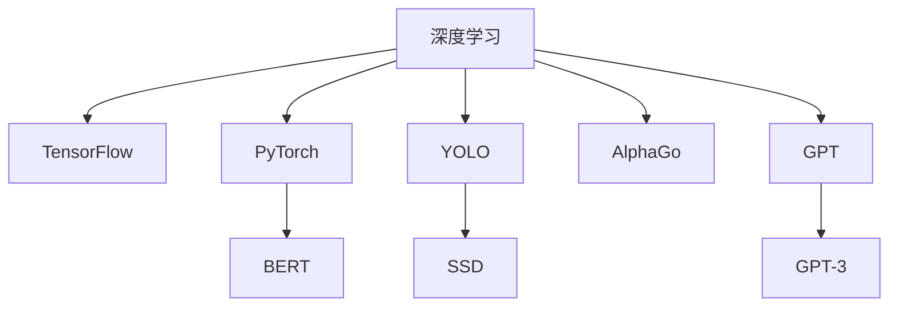

                 

# 基础模型的命名与范式转变

在AI技术领域，基础模型的命名及其演进方式不仅反映了技术发展的脉络，也是理解当前和未来AI范式转变的重要线索。本文将详细探讨这些模型名称背后的原理与联系，并深入分析其算法原理与操作步骤，指出其优缺点及应用领域，并通过数学模型与案例分析进一步深入解析。

## 1. 背景介绍

随着深度学习技术的发展，AI领域涌现出诸多基础模型，如TensorFlow、PyTorch、BERT等。这些模型的成功不仅归功于其算法创新，更在于其名称与范式设计上的深思熟虑。本文旨在通过回顾这些模型的命名与范式演变，为读者揭示其核心思想与技术创新，并探讨未来的发展方向。

## 2. 核心概念与联系

### 2.1 核心概念概述

在深度学习领域，基础模型的命名通常反映其核心思想与技术特点。例如，TensorFlow被设计为"tensor flow"，强调了其以张量为基础的计算流设计。BERT则代表"Bidirectional Encoder Representations from Transformers"，指其双向编码器Transformer架构。这些名称不仅易于记忆，还体现了模型的核心设计理念。

### 2.2 核心概念原理和架构的 Mermaid 流程图

以下是Mermaid流程图的示例，展示了基础模型核心概念及其联系：



此图展示了深度学习在不同领域的具体应用，每个模型都有其独特的特点与创新之处。

## 3. 核心算法原理 & 具体操作步骤

### 3.1 算法原理概述

基础模型的算法原理是其名称与范式设计的基础。以TensorFlow为例，其核心思想在于数据流图中的计算图，允许高效的并行计算与优化。在TensorFlow中，数据被表示为张量，操作被构建为节点，形成一个有向无环图(DAG)。通过这种方式，TensorFlow能够高效地进行反向传播和优化计算。

### 3.2 算法步骤详解

基础模型的操作步骤通常分为以下几个关键步骤：

1. **模型构建**：根据任务需求设计模型架构，选择合适的层与激活函数。
2. **数据准备**：将输入数据转化为模型所需的格式，如张量、批次等。
3. **模型训练**：使用反向传播算法更新模型参数，最小化损失函数。
4. **模型评估**：使用验证集或测试集评估模型性能。
5. **模型应用**：将训练好的模型应用于实际问题，进行推理或预测。

### 3.3 算法优缺点

基础模型的优点在于其广泛的适用性与高效性。TensorFlow的计算流设计使其能够在多种硬件上高效运行，而PyTorch的动态计算图则允许更加灵活的模型构建与调试。BERT的双向编码器设计显著提升了语言模型的理解能力。然而，这些模型也存在一些缺点，如TensorFlow的静态计算图限制了某些动态操作的实现，PyTorch的动态计算图则在性能上有所牺牲。

### 3.4 算法应用领域

基础模型在多个领域中得到了广泛应用。TensorFlow广泛应用于科学计算、图像处理、自然语言处理等领域，而PyTorch则在计算机视觉、自然语言处理、强化学习等领域表现出色。BERT则在语言模型与自然语言理解任务中取得了巨大成功，成为了自然语言处理领域的标准。

## 4. 数学模型和公式 & 详细讲解 & 举例说明

### 4.1 数学模型构建

基础模型的数学模型通常基于其核心算法设计。以TensorFlow为例，其核心算法为反向传播算法，其数学模型为：

$$
\frac{\partial L}{\partial \theta} = \frac{\partial L}{\partial z} \cdot \frac{\partial z}{\partial h} \cdot \frac{\partial h}{\partial \theta}
$$

其中 $L$ 为损失函数，$\theta$ 为模型参数，$z$ 为输出层的激活函数，$h$ 为前一层的输出。

### 4.2 公式推导过程

以TensorFlow为例，其反向传播算法的推导过程如下：

1. 计算误差：$E = L(F(x, \theta))$，其中 $F(x, \theta)$ 为模型前向传播计算。
2. 计算梯度：$\nabla_{\theta} E = \nabla_{\theta} L(F(x, \theta))$。
3. 反向传播：$\nabla_{\theta} E = \nabla_{\theta} L(F(x, \theta)) = \nabla_{\theta} z \cdot \nabla_{z} L(F(x, \theta))$，其中 $\nabla_{\theta} z = \frac{\partial z}{\partial h} \cdot \frac{\partial h}{\partial \theta}$。

### 4.3 案例分析与讲解

以TensorFlow的图像分类任务为例，假设模型为全连接神经网络，其输出层使用Softmax函数。假设训练数据集为 $D$，模型参数为 $\theta$，损失函数为交叉熵损失。则模型训练过程如下：

1. 前向传播：计算 $z = \sigma(Wx + b)$，其中 $\sigma$ 为激活函数。
2. 计算损失：$L = -\frac{1}{N} \sum_{i=1}^N \log \left(\frac{\exp(z_i^y)}{\sum_k \exp(z_k^y)}\right)$，其中 $y$ 为真实标签。
3. 反向传播：计算 $\frac{\partial L}{\partial \theta} = \frac{\partial L}{\partial z} \cdot \frac{\partial z}{\partial h} \cdot \frac{\partial h}{\partial \theta}$。
4. 更新参数：使用梯度下降算法 $\theta \leftarrow \theta - \eta \nabla_{\theta} L$。

## 5. 项目实践：代码实例和详细解释说明

### 5.1 开发环境搭建

在实际项目中，开发环境搭建是基础模型应用的关键步骤。以下是一个简单的Python环境搭建示例：

1. 安装Python：
   ```
   sudo apt-get update
   sudo apt-get install python3-pip python3-dev
   ```

2. 安装TensorFlow：
   ```
   pip install tensorflow
   ```

3. 安装PyTorch：
   ```
   pip install torch torchvision torchaudio
   ```

### 5.2 源代码详细实现

以下是一个简单的TensorFlow图像分类模型的代码实现：

```python
import tensorflow as tf
from tensorflow import keras

# 加载数据集
(x_train, y_train), (x_test, y_test) = keras.datasets.cifar10.load_data()

# 数据预处理
x_train = x_train / 255.0
x_test = x_test / 255.0

# 定义模型
model = keras.Sequential([
    keras.layers.Conv2D(32, (3, 3), activation='relu', input_shape=(32, 32, 3)),
    keras.layers.MaxPooling2D((2, 2)),
    keras.layers.Flatten(),
    keras.layers.Dense(10, activation='softmax')
])

# 编译模型
model.compile(optimizer='adam',
              loss='sparse_categorical_crossentropy',
              metrics=['accuracy'])

# 训练模型
model.fit(x_train, y_train, epochs=10, validation_data=(x_test, y_test))
```

### 5.3 代码解读与分析

在上述代码中，我们首先加载了CIFAR-10数据集，并对数据进行了归一化处理。然后定义了一个简单的卷积神经网络模型，并使用交叉熵损失和准确率作为评价指标。最后，我们使用了Adam优化器对模型进行训练。

### 5.4 运行结果展示

训练结束后，我们可以使用以下代码评估模型性能：

```python
test_loss, test_acc = model.evaluate(x_test, y_test)
print('Test accuracy:', test_acc)
```

## 6. 实际应用场景

基础模型的实际应用场景非常广泛。TensorFlow在自动驾驶、自然语言处理、医疗诊断等领域都有重要应用。PyTorch则在计算机视觉、自然语言处理、强化学习等领域表现出色。BERT在自然语言理解、情感分析、机器翻译等任务中取得了优异性能。

### 6.1 自动驾驶

在自动驾驶领域，基础模型主要用于环境感知、决策规划等环节。TensorFlow与PyTorch都可以用来构建实时感知的深度神经网络，实现对车辆周围环境的准确感知与行为决策。

### 6.2 医疗诊断

在医疗诊断领域，基础模型可用于图像识别、疾病预测等任务。如使用TensorFlow构建的卷积神经网络可以用于医学影像分析，快速识别肿瘤、病变等。

### 6.3 自然语言处理

在自然语言处理领域，基础模型可用于文本分类、情感分析、机器翻译等任务。如使用BERT构建的模型可以显著提升文本理解与分类性能，显著减少手动标注的工作量。

### 6.4 未来应用展望

未来，基础模型的应用将更加广泛，更多领域将受益于其强大的计算能力与数据处理能力。同时，模型融合、跨领域应用等技术的发展也将拓展基础模型的应用边界。

## 7. 工具和资源推荐

### 7.1 学习资源推荐

1. TensorFlow官方文档：
   [https://www.tensorflow.org/](https://www.tensorflow.org/)

2. PyTorch官方文档：
   [https://pytorch.org/docs/stable/](https://pytorch.org/docs/stable/)

3. BERT论文与代码：
   [https://arxiv.org/abs/1810.04805](https://arxiv.org/abs/1810.04805)

### 7.2 开发工具推荐

1. TensorFlow：
   [https://www.tensorflow.org/](https://www.tensorflow.org/)

2. PyTorch：
   [https://pytorch.org/](https://pytorch.org/)

3. Keras：
   [https://keras.io/](https://keras.io/)

### 7.3 相关论文推荐

1. Deep Learning:
   [https://www.deeplearningbook.org/](https://www.deeplearningbook.org/)

2. TensorFlow 2.0: An Introduction:
   [https://www.deeplearning.ai/ai-education/training/](https://www.deeplearning.ai/ai-education/training/)

3. Understanding Deep Learning:
   [https://www.coursera.org/learn/understanding-deep-learning](https://www.coursera.org/learn/understanding-deep-learning)

## 8. 总结：未来发展趋势与挑战

### 8.1 研究成果总结

基础模型在深度学习领域取得了显著进展，其应用范围不断扩大，技术也在不断进步。TensorFlow与PyTorch在学术界与工业界都有重要影响。BERT等模型的出现，推动了自然语言处理领域的飞速发展。

### 8.2 未来发展趋势

未来，基础模型的发展将更加注重模型融合、跨领域应用、高效优化等方面。深度学习框架将更加灵活，更容易集成多种模型与算法。同时，模型性能的提升将更加依赖于更好的数据处理与计算优化。

### 8.3 面临的挑战

基础模型虽然取得了巨大成功，但在实际应用中仍面临一些挑战。数据隐私、模型解释性、鲁棒性等问题仍需进一步解决。同时，模型的训练与优化也需要更多的计算资源与技术支持。

### 8.4 研究展望

未来，基础模型的研究将更加注重模型可解释性、鲁棒性与计算效率的提升。同时，模型融合、跨领域应用等技术也将成为新的研究方向。

## 9. 附录：常见问题与解答

### Q1: 如何选择合适的深度学习框架？

A: 选择合适的深度学习框架需要考虑多个因素，如模型复杂度、任务需求、计算资源等。TensorFlow适合大模型与分布式训练，PyTorch则更加灵活，易于调试与模型构建。

### Q2: 基础模型在实际应用中如何优化？

A: 基础模型优化主要集中在数据预处理、模型架构设计、超参数调优等方面。使用数据增强、正则化等技术可以提升模型的鲁棒性与泛化能力。同时，选择合适的优化器与学习率调度策略也是优化模型性能的重要手段。

### Q3: 如何评估基础模型的性能？

A: 基础模型的性能评估通常使用准确率、精确率、召回率等指标。同时，使用交叉验证、混淆矩阵等工具可以帮助更全面地评估模型性能。

### Q4: 基础模型在实际应用中存在哪些限制？

A: 基础模型在实际应用中存在计算资源需求高、模型复杂度高、模型解释性不足等限制。如何降低计算成本、提升模型解释性，是未来研究的重要方向。

### Q5: 基础模型在深度学习中的地位如何？

A: 基础模型在深度学习中具有重要地位，其设计理念与实现方式影响了整个深度学习领域的发展。未来的深度学习研究仍将基于这些基础模型进行创新与优化。

---

作者：禅与计算机程序设计艺术 / Zen and the Art of Computer Programming

