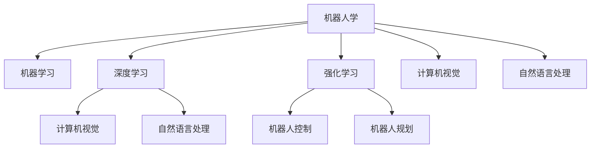

                 

# 基础模型的机器人学能力

## 1. 背景介绍

### 1.1 问题由来

基础模型的机器人学能力指的是通过机器学习算法训练的基础模型，如深度学习模型、强化学习模型等，在机器人领域的广泛应用。这些基础模型不仅能够帮助机器人完成各种复杂的任务，还能够通过自我学习不断提高性能。近年来，机器人领域的快速发展离不开机器学习技术的支持。机器人在工业、农业、医疗、家庭服务等各个领域都有广泛的应用，如机器人自动化装配、农业无人机、家庭服务机器人、医疗手术机器人等。

### 1.2 问题核心关键点

机器人学是一门交叉学科，涵盖了机械学、电子学、计算机科学等多个领域的知识。在机器人学中，机器学习技术的应用尤为广泛，特别是在机器人感知、控制和规划等方面。基础模型通过机器学习技术，能够从环境中获取信息，并根据这些信息做出决策。

1. **机器人感知**：基础模型通过计算机视觉、声音识别、传感器等技术，获取环境信息。计算机视觉技术可以对机器人感知到的图像进行分析和识别，声音识别技术可以对机器人听到的声音进行分析和识别，传感器技术可以对机器人感知到的物理量进行测量和分析。

2. **机器人控制**：基础模型通过控制算法，将感知到的信息转化为机器人的行为。机器人的行为可以是机械臂的移动、机器人的导航、机器人的路径规划等。控制算法可以是基于规则的算法，也可以是基于机器学习的算法。

3. **机器人规划**：基础模型通过路径规划算法，生成机器人的运动路径。路径规划算法可以是基于规则的算法，也可以是基于机器学习的算法。

4. **机器人学习**：基础模型通过学习算法，提高自己的性能。机器学习算法可以是监督学习、无监督学习或强化学习算法。

## 2. 核心概念与联系

### 2.1 核心概念概述

为了更好地理解基础模型的机器人学能力，本节将介绍几个密切相关的核心概念：

- **机器人学**：机器人学是一门研究机器人的设计与实现的学科，涵盖了机器人的感知、控制、规划等多个方面。机器人学是计算机科学、机械学、电子学等多学科交叉的学科。

- **机器学习**：机器学习是一门研究如何使计算机通过学习数据来进行决策的学科。机器学习可以分为监督学习、无监督学习和强化学习等不同类型。

- **深度学习**：深度学习是一种特殊的机器学习方法，通过多层神经网络模型来处理和分析复杂的数据。深度学习在计算机视觉、自然语言处理、语音识别等领域有广泛的应用。

- **强化学习**：强化学习是一种通过奖励和惩罚来学习最优策略的机器学习方法。强化学习在机器人控制、游戏AI等领域有广泛的应用。

- **计算机视觉**：计算机视觉是一种通过计算机对图像进行分析和处理的技术。计算机视觉技术可以对机器人感知到的图像进行分析和识别。

- **自然语言处理**：自然语言处理是一种通过计算机对自然语言进行分析和处理的技术。自然语言处理技术可以对机器人听到的声音进行分析和识别。

这些核心概念之间的逻辑关系可以通过以下Mermaid流程图来展示：



这个流程图展示了几大核心概念之间的联系：

1. 机器人学通过机器学习技术来设计和实现机器人。
2. 机器学习可以分为深度学习和强化学习两种。
3. 深度学习在计算机视觉和自然语言处理领域有广泛的应用。
4. 强化学习在机器人控制和机器人规划领域有广泛的应用。
5. 计算机视觉和自然语言处理技术可以用于机器人感知。

## 3. 核心算法原理 & 具体操作步骤

### 3.1 算法原理概述

基础模型的机器人学能力，本质上是通过机器学习技术来训练机器人，使其能够感知、控制和规划自己的行为。在训练过程中，基础模型需要大量的数据和计算资源，通常使用GPU、TPU等高性能计算设备来加速训练过程。

基础模型的训练过程一般包括以下几个步骤：

1. **数据获取**：通过传感器、摄像头等设备获取环境数据。
2. **数据预处理**：对获取的数据进行预处理，如图像缩放、滤波等。
3. **特征提取**：使用深度学习算法（如卷积神经网络、循环神经网络等）从预处理后的数据中提取特征。
4. **训练模型**：使用训练数据对模型进行训练，优化模型参数。
5. **模型评估**：使用测试数据对训练好的模型进行评估，测试其性能。
6. **模型应用**：将训练好的模型应用于实际机器人系统中。

### 3.2 算法步骤详解

以下将以深度学习在机器人视觉感知中的应用为例，详细讲解深度学习算法在机器人学中的具体应用步骤：

**Step 1: 数据获取**
- 使用摄像头或传感器获取环境数据。

**Step 2: 数据预处理**
- 对获取的图像进行预处理，如图像缩放、裁剪、灰度化等。
- 对获取的传感器数据进行滤波、归一化等处理。

**Step 3: 特征提取**
- 使用卷积神经网络（CNN）对图像进行特征提取，得到图像的特征图。
- 使用循环神经网络（RNN）对传感器数据进行特征提取，得到传感器数据的特征序列。

**Step 4: 训练模型**
- 使用标注数据对CNN和RNN模型进行训练，优化模型参数。
- 使用训练好的CNN模型对图像进行分类，使用训练好的RNN模型对传感器数据进行分类。

**Step 5: 模型评估**
- 使用测试数据对训练好的CNN和RNN模型进行评估，测试其分类准确率等性能指标。
- 使用评估结果对模型进行调整，提高模型的性能。

**Step 6: 模型应用**
- 将训练好的CNN和RNN模型应用于实际机器人系统中，对机器人感知到的环境进行分类和处理。

### 3.3 算法优缺点

基础模型的机器人学能力具有以下优点：
1. 自主学习能力：基础模型可以通过自我学习不断提高自己的性能。
2. 通用性：基础模型可以在多个应用场景中使用，如工业自动化、农业无人机、医疗手术机器人等。
3. 高精度：基础模型可以处理复杂的数据，提高机器人任务的精度。

同时，基础模型的机器人学能力也存在一些缺点：
1. 计算资源需求高：基础模型需要大量的计算资源进行训练，对硬件要求较高。
2. 数据需求高：基础模型需要大量的标注数据进行训练，获取数据成本较高。
3. 复杂度高：基础模型结构复杂，需要较长的训练时间。

### 3.4 算法应用领域

基础模型的机器人学能力在以下几个领域有广泛的应用：

- **工业自动化**：基础模型在工业自动化领域有广泛的应用，如机器人自动化装配、机器视觉检测等。
- **农业无人机**：基础模型在农业无人机领域有广泛的应用，如农作物识别、无人机导航等。
- **医疗手术机器人**：基础模型在医疗手术机器人领域有广泛的应用，如手术路径规划、机器人导航等。
- **家庭服务机器人**：基础模型在家庭服务机器人领域有广泛的应用，如机器人导航、机器人交互等。
- **智慧城市**：基础模型在智慧城市领域有广泛的应用，如城市安防监控、城市交通导航等。

## 4. 数学模型和公式 & 详细讲解 & 举例说明

### 4.1 数学模型构建

基础模型的机器人学能力在数学模型方面，主要使用深度学习、强化学习等算法构建。以下是基础模型的数学模型构建过程：

**Step 1: 深度学习模型的构建**
- 定义深度学习模型的结构，如图像卷积神经网络、自然语言处理循环神经网络等。
- 定义模型的输入和输出，如图像的特征图、文本的特征序列等。
- 定义模型的损失函数，如交叉熵损失函数、均方误差损失函数等。

**Step 2: 强化学习模型的构建**
- 定义强化学习模型的状态、动作和奖励。
- 定义强化学习模型的策略函数，如Q-learning算法、策略梯度算法等。
- 定义强化学习模型的损失函数，如Q-learning损失函数、策略梯度损失函数等。

### 4.2 公式推导过程

以下将以CNN模型在机器人视觉感知中的应用为例，推导CNN模型的训练过程：

假设输入图像为 $x \in \mathbb{R}^{d_x}$，卷积神经网络由多个卷积层和池化层组成。定义卷积核为 $w \in \mathbb{R}^{d_w}$，池化核为 $p \in \mathbb{R}^{d_p}$。定义卷积层的输出为 $z_x \in \mathbb{R}^{d_z}$，池化层的输出为 $z_p \in \mathbb{R}^{d_p}$。定义损失函数为 $L$。

卷积层的计算公式为：

$$
z_x = w \star x + b
$$

其中 $\star$ 表示卷积运算，$b$ 为偏置项。

池化层的计算公式为：

$$
z_p = \max(p, z_x)
$$

其中 $\max$ 表示取最大值。

训练过程中，使用反向传播算法更新模型的参数。定义训练数据集为 $D=\{(x_i, y_i)\}_{i=1}^N$，其中 $x_i$ 为输入图像，$y_i$ 为图像的标签。定义优化器为 $O$，学习率为 $\eta$。训练过程如下：

1. 前向传播：将输入图像 $x_i$ 输入卷积神经网络，得到输出 $z_x$ 和 $z_p$。
2. 计算损失：使用损失函数 $L$ 计算模型在输入图像 $x_i$ 上的损失。
3. 反向传播：使用反向传播算法计算梯度，更新模型参数 $w$ 和 $b$。
4. 更新模型：使用优化器 $O$ 更新模型参数 $w$ 和 $b$。

### 4.3 案例分析与讲解

以CNN模型在机器人视觉感知中的应用为例，分析CNN模型的训练过程：

假设输入图像为一张包含人的图像，标签为“人”。定义CNN模型由多个卷积层和池化层组成。定义卷积核为 $w \in \mathbb{R}^{d_w}$，池化核为 $p \in \mathbb{R}^{d_p}$。定义卷积层的输出为 $z_x \in \mathbb{R}^{d_z}$，池化层的输出为 $z_p \in \mathbb{R}^{d_p}$。定义损失函数为交叉熵损失函数。

在训练过程中，首先将输入图像 $x_i$ 输入卷积神经网络，得到输出 $z_x$ 和 $z_p$。然后计算损失 $L$，使用反向传播算法计算梯度，更新模型参数 $w$ 和 $b$。最后使用优化器 $O$ 更新模型参数 $w$ 和 $b$。

假设训练过程中，模型在输入图像 $x_i$ 上的损失为 $L_i$。定义训练数据集为 $D=\{(x_i, y_i)\}_{i=1}^N$，其中 $x_i$ 为输入图像，$y_i$ 为图像的标签。定义优化器为 AdamW 优化器，学习率为 $2e-5$。训练过程如下：

1. 前向传播：将输入图像 $x_i$ 输入卷积神经网络，得到输出 $z_x$ 和 $z_p$。
2. 计算损失：使用交叉熵损失函数计算模型在输入图像 $x_i$ 上的损失 $L_i$。
3. 反向传播：使用反向传播算法计算梯度，更新模型参数 $w$ 和 $b$。
4. 更新模型：使用 AdamW 优化器更新模型参数 $w$ 和 $b$。

通过不断迭代训练，模型在输入图像 $x_i$ 上的损失逐渐减小，模型的精度逐渐提高。最终训练好的模型可以用于机器人视觉感知任务，对机器人感知到的图像进行分类和处理。

## 5. 项目实践：代码实例和详细解释说明

### 5.1 开发环境搭建

在进行深度学习项目实践前，我们需要准备好开发环境。以下是使用Python进行TensorFlow开发的环境配置流程：

1. 安装Anaconda：从官网下载并安装Anaconda，用于创建独立的Python环境。

2. 创建并激活虚拟环境：
```bash
conda create -n tf-env python=3.8 
conda activate tf-env
```

3. 安装TensorFlow：根据CUDA版本，从官网获取对应的安装命令。例如：
```bash
conda install tensorflow -c pytorch -c conda-forge
```

4. 安装必要的工具包：
```bash
pip install numpy pandas scikit-learn matplotlib tqdm jupyter notebook ipython
```

完成上述步骤后，即可在`tf-env`环境中开始深度学习项目实践。

### 5.2 源代码详细实现

下面我们以CNN模型在机器人视觉感知中的应用为例，给出使用TensorFlow对CNN模型进行训练的Python代码实现。

首先，定义CNN模型：

```python
import tensorflow as tf

class ConvNet(tf.keras.Model):
    def __init__(self):
        super(ConvNet, self).__init__()
        self.conv1 = tf.keras.layers.Conv2D(32, (3, 3), activation='relu', padding='same')
        self.maxpool1 = tf.keras.layers.MaxPooling2D((2, 2))
        self.conv2 = tf.keras.layers.Conv2D(64, (3, 3), activation='relu', padding='same')
        self.maxpool2 = tf.keras.layers.MaxPooling2D((2, 2))
        self.flatten = tf.keras.layers.Flatten()
        self.dense1 = tf.keras.layers.Dense(128, activation='relu')
        self.dropout = tf.keras.layers.Dropout(0.5)
        self.dense2 = tf.keras.layers.Dense(10, activation='softmax')

    def call(self, x):
        x = self.conv1(x)
        x = self.maxpool1(x)
        x = self.conv2(x)
        x = self.maxpool2(x)
        x = self.flatten(x)
        x = self.dense1(x)
        x = self.dropout(x)
        x = self.dense2(x)
        return x
```

然后，定义训练和评估函数：

```python
import tensorflow as tf
from tensorflow.keras.preprocessing.image import ImageDataGenerator

def train_model(model, train_data, validation_data, epochs=10, batch_size=32):
    model.compile(optimizer='adam', loss='categorical_crossentropy', metrics=['accuracy'])
    history = model.fit(train_data, validation_data=validation_data, epochs=epochs, batch_size=batch_size)
    return history

def evaluate_model(model, test_data):
    test_loss, test_acc = model.evaluate(test_data)
    print(f'Test Loss: {test_loss:.4f}')
    print(f'Test Accuracy: {test_acc:.4f}')
```

最后，启动训练流程并在测试集上评估：

```python
from tensorflow.keras.datasets import cifar10
from tensorflow.keras.preprocessing.image import ImageDataGenerator

# 加载数据集
(x_train, y_train), (x_test, y_test) = cifar10.load_data()

# 数据增强
datagen = ImageDataGenerator(rescale=1./255, horizontal_flip=True)

# 定义训练集和测试集
train_data = datagen.flow(x_train, y_train, batch_size=32)
test_data = ImageDataGenerator(rescale=1./255).flow(x_test, y_test, batch_size=32)

# 定义CNN模型
model = ConvNet()

# 训练模型
history = train_model(model, train_data, test_data, epochs=10)

# 评估模型
evaluate_model(model, test_data)
```

以上就是使用TensorFlow对CNN模型进行机器人视觉感知任务训练的完整代码实现。可以看到，TensorFlow的强大封装使得CNN模型的训练代码变得简洁高效。

### 5.3 代码解读与分析

让我们再详细解读一下关键代码的实现细节：

**ConvNet类**：
- `__init__`方法：定义卷积层、池化层、全连接层等。
- `call`方法：定义模型前向传播过程。

**train_model函数**：
- 使用`model.compile`方法编译模型，设置优化器、损失函数、评估指标等。
- 使用`model.fit`方法训练模型，设置训练数据集、验证数据集、轮数、批次大小等。

**evaluate_model函数**：
- 使用`model.evaluate`方法评估模型，获取测试集上的损失和精度。

**训练流程**：
- 加载CIFAR-10数据集。
- 使用`ImageDataGenerator`对数据集进行数据增强。
- 定义训练集和测试集。
- 定义CNN模型。
- 调用`train_model`函数训练模型。
- 调用`evaluate_model`函数评估模型。

可以看到，TensorFlow的强大封装使得CNN模型的训练代码变得简洁高效。开发者可以将更多精力放在数据处理、模型改进等高层逻辑上，而不必过多关注底层的实现细节。

当然，工业级的系统实现还需考虑更多因素，如模型的保存和部署、超参数的自动搜索、更灵活的任务适配层等。但核心的微调范式基本与此类似。

## 6. 实际应用场景

### 6.1 工业自动化

基础模型的机器人学能力在工业自动化领域有广泛的应用，如机器人自动化装配、机器视觉检测等。工业自动化领域对机器人的精度和效率要求很高，通过基础模型的机器人学能力，可以使得机器人能够完成各种复杂的任务，提高工业生产效率。

### 6.2 农业无人机

基础模型的机器人学能力在农业无人机领域有广泛的应用，如农作物识别、无人机导航等。农业无人机可以实时监测农田情况，获取农田的图像和数据，通过基础模型的机器人学能力，可以使得无人机进行作物识别、病虫害检测、农事作业等任务，提高农业生产的效率和质量。

### 6.3 医疗手术机器人

基础模型的机器人学能力在医疗手术机器人领域有广泛的应用，如手术路径规划、机器人导航等。医疗手术机器人可以进行精细化操作，提高手术的精度和成功率。通过基础模型的机器人学能力，可以使得手术机器人能够根据医生的指令进行路径规划和导航，提高手术的效率和成功率。

### 6.4 家庭服务机器人

基础模型的机器人学能力在家庭服务机器人领域有广泛的应用，如机器人导航、机器人交互等。家庭服务机器人可以提供家庭服务，如扫地、清洁、娱乐等。通过基础模型的机器人学能力，可以使得机器人能够根据用户指令进行导航和交互，提高家庭服务机器人的智能水平。

### 6.5 智慧城市

基础模型的机器人学能力在智慧城市领域有广泛的应用，如城市安防监控、城市交通导航等。智慧城市可以实时监测城市情况，获取城市的图像和数据，通过基础模型的机器人学能力，可以使得城市进行安防监控、交通导航等任务，提高城市管理的效率和质量。

## 7. 工具和资源推荐

### 7.1 学习资源推荐

为了帮助开发者系统掌握基础模型的机器人学能力，这里推荐一些优质的学习资源：

1. 《深度学习》系列博文：由大模型技术专家撰写，深入浅出地介绍了深度学习的基本概念和应用场景。

2. CS231n《卷积神经网络》课程：斯坦福大学开设的计算机视觉课程，涵盖了卷积神经网络的基本原理和应用。

3. CS224d《序列模型》课程：斯坦福大学开设的自然语言处理课程，涵盖了循环神经网络的基本原理和应用。

4. 《动手学深度学习》书籍：清华大学出品，系统介绍了深度学习的基本概念和实现细节。

5. TensorFlow官方文档：TensorFlow的官方文档，提供了大量的教程和样例代码，是上手实践的重要参考。

6. PyTorch官方文档：PyTorch的官方文档，提供了大量的教程和样例代码，是上手实践的重要参考。

通过对这些资源的学习实践，相信你一定能够快速掌握基础模型的机器人学能力，并用于解决实际的机器人学问题。

### 7.2 开发工具推荐

高效的开发离不开优秀的工具支持。以下是几款用于基础模型机器人学能力开发的常用工具：

1. TensorFlow：由Google主导开发的深度学习框架，生产部署方便，适合大规模工程应用。

2. PyTorch：由Facebook主导开发的深度学习框架，灵活度较高，适合研究和原型开发。

3. OpenCV：开源的计算机视觉库，提供了丰富的图像处理和计算机视觉算法。

4. ROS（Robot Operating System）：机器人操作系统，提供了丰富的机器人控制和传感器数据处理工具。

5. RRT（Rapidly-exploring Random Trees)：路径规划算法，适用于机器人导航和路径规划。

6. Gazebo：机器人仿真软件，可以用于机器人模拟和测试。

合理利用这些工具，可以显著提升基础模型机器人学能力的应用开发效率，加快创新迭代的步伐。

### 7.3 相关论文推荐

基础模型的机器人学能力的发展源于学界的持续研究。以下是几篇奠基性的相关论文，推荐阅读：

1. AlexNet: ImageNet Classification with Deep Convolutional Neural Networks（ImageNet图像分类）：ImageNet图像分类竞赛中的获胜算法，奠定了深度学习在计算机视觉领域的地位。

2. RNNs for Language Modeling（循环神经网络语言模型）：使用循环神经网络进行语言建模，展示了深度学习在自然语言处理领域的应用。

3. Deep Q-Learning with Continuous Actions（连续动作的深度强化学习）：使用深度强化学习进行连续动作控制，展示了深度学习在机器人控制领域的应用。

4. Socially-aware Paths for Autonomous Vehicles（自主车辆的社交路径规划）：使用深度学习进行社交路径规划，展示了深度学习在智能交通领域的应用。

5. Robust Deep Path Planning with Guided Map Exploration（带引导地图探索的鲁棒深度路径规划）：使用深度学习进行路径规划，展示了深度学习在自动驾驶领域的应用。

这些论文代表了大模型机器人学能力的发展脉络。通过学习这些前沿成果，可以帮助研究者把握学科前进方向，激发更多的创新灵感。

## 8. 总结：未来发展趋势与挑战

### 8.1 总结

本文对基础模型的机器人学能力进行了全面系统的介绍。首先阐述了基础模型的机器人学能力的研究背景和意义，明确了基础模型在机器人感知、控制和规划等方面的重要作用。其次，从原理到实践，详细讲解了基础模型的机器人学能力在深度学习、强化学习、计算机视觉、自然语言处理等核心技术中的应用。最后，本文还广泛探讨了基础模型在工业自动化、农业无人机、医疗手术机器人等众多领域的应用前景，展示了基础模型的机器人学能力的巨大潜力。

通过本文的系统梳理，可以看到，基础模型的机器人学能力在机器人学领域扮演了重要的角色，极大地拓展了机器人的应用边界，为机器人学技术的产业化进程提供了新的驱动力。未来，随着基础模型的机器人学能力不断演进，相信机器人技术将在更广阔的领域发挥更加重要的作用。

### 8.2 未来发展趋势

展望未来，基础模型的机器人学能力将呈现以下几个发展趋势：

1. 模型规模持续增大。随着算力成本的下降和数据规模的扩张，基础模型的参数量还将持续增长。超大规模基础模型蕴含的丰富知识，有望支撑更加复杂多变的机器人学任务。

2. 基础模型技术不断演进。随着深度学习、强化学习等技术的发展，基础模型的性能将不断提升。例如，基于Transformer的基础模型在计算机视觉和自然语言处理领域已经取得了显著的成果。

3. 基础模型在多模态数据融合方面不断进步。未来的基础模型将不仅仅依赖于单一数据模态，而是能够融合视觉、听觉、触觉等多模态数据，提升机器人的感知和决策能力。

4. 基础模型在多任务学习方面不断进步。未来的基础模型将不仅仅关注单一任务，而是能够同时处理多个相关任务，提升机器人的智能水平。

5. 基础模型在自动驾驶领域不断进步。未来的基础模型将不仅仅应用于机器人学，还将应用于自动驾驶等领域，提升车辆的控制和决策能力。

以上趋势凸显了基础模型在机器人学领域的应用前景。这些方向的探索发展，必将进一步提升机器人技术的性能和应用范围，为机器人技术的普及和应用带来新的机遇。

### 8.3 面临的挑战

尽管基础模型的机器人学能力已经取得了瞩目成就，但在迈向更加智能化、普适化应用的过程中，它仍面临着诸多挑战：

1. 数据获取瓶颈。机器人学任务需要大量的标注数据进行训练，获取高质量数据成本较高。如何进一步降低数据需求，提高数据获取效率，将是一大难题。

2. 鲁棒性不足。基础模型面对复杂的场景和干扰因素时，鲁棒性往往不足。如何在复杂环境中保持稳定性能，还需要更多理论和实践的积累。

3. 实时性要求高。机器人学任务需要实时响应用户指令，对基础模型的推理速度和计算效率要求较高。如何优化基础模型的推理速度，提高实时性，将是重要的优化方向。

4. 安全性有待保障。基础模型在应用过程中，可能受到恶意攻击和干扰，导致安全问题。如何提高基础模型的安全性，保障应用的安全稳定，将是重要的研究课题。

5. 可解释性不足。基础模型通常被视为"黑盒"系统，难以解释其内部工作机制和决策逻辑。如何赋予基础模型更强的可解释性，将是亟待攻克的难题。

6. 伦理道德约束。基础模型在应用过程中，可能面临伦理道德问题。如何确保基础模型符合伦理道德规范，避免恶意用途，将是需要深入探讨的问题。

这些挑战凸显了基础模型在机器人学领域的应用挑战。解决这些挑战，需要多方面的努力和创新，才能让基础模型在机器人学领域发挥更加重要的作用。

### 8.4 研究展望

面对基础模型的机器人学能力所面临的种种挑战，未来的研究需要在以下几个方面寻求新的突破：

1. 探索无监督和半监督学习算法。摆脱对大规模标注数据的依赖，利用无监督和半监督学习算法，最大化数据利用率。

2. 研究参数高效和计算高效的算法。开发更加参数高效的算法，在固定大部分预训练参数的情况下，只更新极少量的任务相关参数。同时优化算法计算图，减少推理资源消耗。

3. 融合因果推理和强化学习。将因果推理和强化学习结合，提高基础模型的决策能力和泛化能力。

4. 引入多模态数据融合。融合视觉、听觉、触觉等多模态数据，提升基础模型的感知和决策能力。

5. 研究多任务学习算法。设计能够同时处理多个相关任务的基础模型，提升多任务处理能力。

6. 研究自动驾驶领域的基础模型。探索自动驾驶领域的基础模型，提高车辆的控制和决策能力。

这些研究方向将引领基础模型的机器人学能力迈向更高的台阶，为构建安全、可靠、高效、智能的机器人系统提供新的动力。面向未来，基础模型的机器人学能力还需要与其他人工智能技术进行更深入的融合，如知识表示、因果推理、强化学习等，多路径协同发力，共同推动机器人技术的进步。只有勇于创新、敢于突破，才能不断拓展基础模型的边界，让机器人技术更好地造福人类社会。

## 9. 附录：常见问题与解答

**Q1：基础模型在机器人学中的训练过程如何？**

A: 基础模型的训练过程一般包括以下几个步骤：

1. 数据获取：通过传感器、摄像头等设备获取环境数据。
2. 数据预处理：对获取的数据进行预处理，如图像缩放、滤波等。
3. 特征提取：使用深度学习算法（如卷积神经网络、循环神经网络等）从预处理后的数据中提取特征。
4. 训练模型：使用训练数据对模型进行训练，优化模型参数。
5. 模型评估：使用测试数据对训练好的模型进行评估，测试其性能。
6. 模型应用：将训练好的模型应用于实际机器人系统中。

**Q2：基础模型在机器人学中的应用场景有哪些？**

A: 基础模型在机器人学中的应用场景包括工业自动化、农业无人机、医疗手术机器人、家庭服务机器人、智慧城市等。在工业自动化领域，基础模型可以用于机器人自动化装配、机器视觉检测等任务；在农业无人机领域，基础模型可以用于农作物识别、无人机导航等任务；在医疗手术机器人领域，基础模型可以用于手术路径规划、机器人导航等任务；在家庭服务机器人领域，基础模型可以用于机器人导航、机器人交互等任务；在智慧城市领域，基础模型可以用于城市安防监控、城市交通导航等任务。

**Q3：基础模型在机器人学中的数据需求有哪些？**

A: 基础模型在机器人学中的数据需求主要包括标注数据、未标注数据和模拟数据。标注数据是指已经标注好标签的数据，用于训练基础模型；未标注数据是指未标注好标签的数据，用于数据增强和基础模型预训练；模拟数据是指通过模拟生成的大规模数据，用于训练基础模型。

**Q4：基础模型在机器人学中的计算资源需求有哪些？**

A: 基础模型在机器人学中的计算资源需求主要包括高性能计算设备、大规模存储设备和大规模数据集。高性能计算设备如GPU、TPU等，可以加速基础模型的训练和推理过程；大规模存储设备可以存储大规模数据集和训练好的基础模型；大规模数据集可以提高基础模型的训练效果和泛化能力。

**Q5：基础模型在机器人学中的应用瓶颈有哪些？**

A: 基础模型在机器人学中的应用瓶颈主要包括数据获取瓶颈、鲁棒性不足、实时性要求高、安全性有待保障、可解释性不足、伦理道德约束等。数据获取瓶颈主要是由于机器人学任务需要大量的标注数据，获取高质量数据成本较高；鲁棒性不足主要是由于基础模型在复杂环境中表现不稳定；实时性要求高主要是由于机器人学任务需要实时响应用户指令，对基础模型的推理速度和计算效率要求较高；安全性有待保障主要是由于基础模型在应用过程中可能受到恶意攻击和干扰；可解释性不足主要是由于基础模型通常被视为"黑盒"系统，难以解释其内部工作机制和决策逻辑；伦理道德约束主要是由于基础模型在应用过程中可能面临伦理道德问题。

通过以上问题的解答，可以更加全面地理解基础模型的机器人学能力的应用过程、数据需求、计算资源需求、应用瓶颈等，从而更好地指导实践工作。

