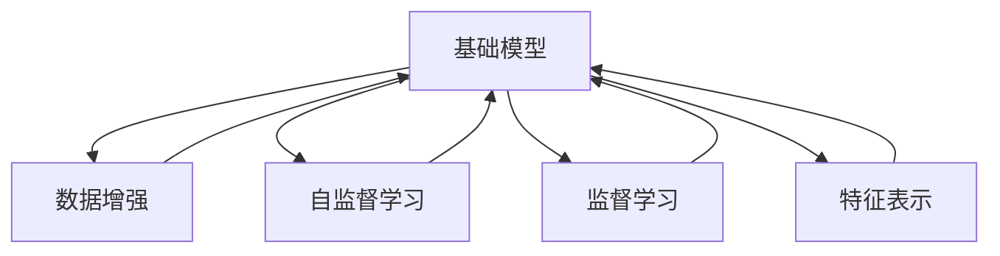

                 

# 基础模型的能力与技术原理

## 1. 背景介绍

### 1.1 问题由来

近年来，随着深度学习技术的飞速发展，基础模型（Base Model）在各种计算机视觉、自然语言处理（NLP）、语音识别等领域取得了显著的成果。这些基础模型通常具有大容量、强泛化能力和自监督学习能力，能够在各种大规模数据上获得良好的性能。例如，ImageNet大规模视觉识别竞赛中的胜者通常也是参数量极大的深度神经网络模型，如ResNet、DenseNet、VGGNet等。在NLP领域，语言模型（如BERT、GPT等）也通过大规模预训练取得了前所未有的进展。

基础模型的成功在于其强大的学习能力和大规模数据训练的潜力，能够在数据量巨大且多样化的环境下提升模型性能。然而，这些基础模型也面临着一些挑战，如计算资源的消耗、模型的复杂性、模型的可解释性等。本文将深入探讨基础模型的能力与技术原理，分析其在实际应用中的优缺点，并展望未来的发展趋势。

### 1.2 问题核心关键点

基础模型的能力与技术原理涉及多个关键点：
- 基础模型的定义与特点：包括基础模型的结构、训练方法、性能评估等。
- 基础模型的学习原理：探讨基础模型如何通过数据学习到特征表示，并提升模型的泛化能力。
- 基础模型的计算与优化：涉及基础模型的计算复杂性、优化策略等，如何高效利用计算资源。
- 基础模型的实际应用：分析基础模型在实际应用中的优势与挑战，以及如何优化其性能。

通过理解这些关键点，我们可以更好地把握基础模型的能力与技术原理，指导其在实际应用中的使用。

## 2. 核心概念与联系

### 2.1 核心概念概述

为了更好地理解基础模型，首先需要明确几个核心概念：

- 基础模型（Base Model）：指在特定任务或领域中，通过大规模数据预训练或监督学习得到的通用模型。基础模型通常具有高参数量和强大的特征提取能力。
- 数据增强（Data Augmentation）：指通过一系列操作扩充训练数据集，如旋转、平移、缩放等，以提升模型的泛化能力。
- 自监督学习（Self-supervised Learning）：指在没有标签的情况下，利用数据的结构信息进行模型训练，如掩码语言模型（Masked Language Model）。
- 监督学习（Supervised Learning）：指在标注数据集上进行有标签的模型训练，通过损失函数最小化优化模型。
- 特征表示（Feature Representation）：指基础模型学习得到的特征表示能力，能够将输入数据映射到高维特征空间，提升模型的理解能力。
- 计算复杂性（Computational Complexity）：指基础模型的计算资源消耗，涉及模型的参数量、计算速度、内存占用等。

这些核心概念之间存在紧密联系，构成了基础模型的基本框架。通过理解这些概念，我们可以更全面地掌握基础模型的能力与技术原理。

### 2.2 核心概念原理和架构的 Mermaid 流程图



这个流程图展示了基础模型学习能力的全链条，从数据增强到自监督学习，再到监督学习，最后得到特征表示。基础模型通过这串学习过程，逐步提升其泛化能力和特征表示能力，进而应用于实际任务中。

## 3. 核心算法原理 & 具体操作步骤

### 3.1 算法原理概述

基础模型的核心算法原理主要包括特征提取、参数初始化、优化和损失函数设计等。其基本流程如下：

1. **特征提取**：基础模型通过网络结构将输入数据映射到高维特征空间，学习到数据的高级特征表示。
2. **参数初始化**：初始化模型的参数，通常使用Xavier、He等初始化方法。
3. **优化**：使用梯度下降等优化算法更新模型参数，最小化损失函数。
4. **损失函数设计**：选择合适的损失函数，如交叉熵、均方误差等，衡量模型预测结果与真实标签之间的差异。

### 3.2 算法步骤详解

以下是一个基础模型在图像分类任务中的训练步骤：

1. **数据预处理**：将原始图像数据转化为模型所需的输入格式，如将图像缩放到固定尺寸，进行标准化等。

```python
import numpy as np
import torch
import torchvision.transforms as transforms
from torchvision.datasets import CIFAR10

transform = transforms.Compose([
    transforms.Resize((32, 32)),
    transforms.ToTensor(),
    transforms.Normalize((0.5, 0.5, 0.5), (0.5, 0.5, 0.5))
])

train_set = CIFAR10(root='./data', train=True, download=True, transform=transform)
test_set = CIFAR10(root='./data', train=False, download=True, transform=transform)
```

2. **模型定义**：定义基础模型，如VGGNet、ResNet等。

```python
import torchvision.models as models

model = models.resnet18(pretrained=True)
model.eval()
```

3. **模型评估**：使用测试集评估模型性能。

```python
with torch.no_grad():
    correct = 0
    total = 0
    for images, labels in test_loader:
        outputs = model(images)
        _, predicted = torch.max(outputs.data, 1)
        total += labels.size(0)
        correct += (predicted == labels).sum().item()

    print('Accuracy of the network on the test images: {} %'.format(100 * correct / total))
```

4. **模型微调**：在特定数据集上进行微调，更新模型参数。

```python
model.train()
criterion = torch.nn.CrossEntropyLoss()
optimizer = torch.optim.SGD(model.parameters(), lr=0.001, momentum=0.9)

for epoch in range(10):
    running_loss = 0.0
    for i, data in enumerate(train_loader, 0):
        inputs, labels = data
        optimizer.zero_grad()
        outputs = model(inputs)
        loss = criterion(outputs, labels)
        loss.backward()
        optimizer.step()
        running_loss += loss.item()
        if i % 100 == 99:
            print('[%d, %5d] loss: %.3f' %
                  (epoch + 1, i + 1, running_loss / 100))
            running_loss = 0.0

print('Finished Training')
```

### 3.3 算法优缺点

基础模型具有以下优点：
- **强大的泛化能力**：通过大规模数据训练，基础模型能够在各类复杂场景下获得良好性能。
- **高效特征提取**：基础模型能够学习到数据的高级特征表示，提升任务性能。
- **参数量大**：基础模型通常具有大量参数，适合处理复杂任务。

同时，基础模型也存在一些缺点：
- **计算资源消耗大**：基础模型的参数量和计算复杂度较高，需要大量计算资源。
- **可解释性差**：基础模型通常是一个黑盒系统，难以解释其内部决策过程。
- **模型过拟合**：在特定任务上，基础模型可能过拟合训练集，泛化能力下降。

### 3.4 算法应用领域

基础模型在图像分类、物体检测、自然语言处理、语音识别等领域有着广泛的应用。例如，在图像分类任务中，ResNet、Inception等基础模型取得了优异性能；在NLP任务中，BERT、GPT等语言模型也在多项任务中刷新了性能记录。此外，基础模型还应用于医疗影像分析、金融市场预测、智能客服等多个领域，为各行各业带来了新的解决方案。

## 4. 数学模型和公式 & 详细讲解 & 举例说明

### 4.1 数学模型构建

以图像分类任务为例，构建基础模型（如VGGNet）的数学模型。

假设输入图像为 $x$，输出标签为 $y$，基础模型为 $f(x; \theta)$，其中 $\theta$ 为模型的参数。定义交叉熵损失函数为：

$$
L(f(x; \theta), y) = -\log \frac{\exp(f(x; \theta)^T y)}{\sum_{k=1}^K \exp(f(x; \theta)^T k)}
$$

其中 $K$ 为类别数，$f(x; \theta)$ 为模型的输出，$y$ 为真实标签。

### 4.2 公式推导过程

将输入图像 $x$ 通过基础模型 $f(x; \theta)$ 进行特征提取，得到高维特征表示 $h(x; \theta)$，定义损失函数为：

$$
L(h(x; \theta), y) = -\log \frac{\exp(h(x; \theta)^T y)}{\sum_{k=1}^K \exp(h(x; \theta)^T k)}
$$

其中 $h(x; \theta)$ 为特征表示，$y$ 为真实标签。

### 4.3 案例分析与讲解

以图像分类为例，分析基础模型在分类任务中的性能提升。

假设原始分类模型为简单全连接网络，特征提取能力较弱，无法有效区分不同类别。通过替换为更复杂的VGGNet基础模型，引入多个卷积层、池化层等，模型能够学习到更高级的特征表示，提升分类精度。具体来说，VGGNet模型引入多个卷积核和池化层，通过多层非线性变换，逐步提取图像中的高级特征，最终得到更准确的分类结果。

## 5. 项目实践：代码实例和详细解释说明

### 5.1 开发环境搭建

在进行基础模型实践前，我们需要准备好开发环境。以下是使用Python进行PyTorch开发的环境配置流程：

1. 安装Anaconda：从官网下载并安装Anaconda，用于创建独立的Python环境。

2. 创建并激活虚拟环境：
```bash
conda create -n pytorch-env python=3.8 
conda activate pytorch-env
```

3. 安装PyTorch：根据CUDA版本，从官网获取对应的安装命令。例如：
```bash
conda install pytorch torchvision torchaudio cudatoolkit=11.1 -c pytorch -c conda-forge
```

4. 安装各类工具包：
```bash
pip install numpy pandas scikit-learn matplotlib tqdm jupyter notebook ipython
```

完成上述步骤后，即可在`pytorch-env`环境中开始基础模型实践。

### 5.2 源代码详细实现

下面以VGGNet模型为例，给出使用PyTorch实现基础模型在图像分类任务中的代码实现。

```python
import torch
import torch.nn as nn
import torch.nn.functional as F
import torchvision.transforms as transforms
from torchvision.datasets import CIFAR10
from torch.utils.data import DataLoader

# 定义VGGNet模型
class VGGNet(nn.Module):
    def __init__(self):
        super(VGGNet, self).__init__()
        self.conv1 = nn.Conv2d(3, 64, 3, 1, 1)
        self.conv2 = nn.Conv2d(64, 64, 3, 1, 1)
        self.conv3 = nn.Conv2d(64, 128, 3, 1, 1)
        self.conv4 = nn.Conv2d(128, 128, 3, 1, 1)
        self.conv5 = nn.Conv2d(128, 256, 3, 1, 1)
        self.pool = nn.MaxPool2d(2, 2)
        self.fc1 = nn.Linear(256, 4096)
        self.fc2 = nn.Linear(4096, 4096)
        self.fc3 = nn.Linear(4096, 10)

    def forward(self, x):
        x = self.pool(F.relu(self.conv1(x)))
        x = self.pool(F.relu(self.conv2(x)))
        x = self.pool(F.relu(self.conv3(x)))
        x = self.pool(F.relu(self.conv4(x)))
        x = self.pool(F.relu(self.conv5(x)))
        x = x.view(-1, 256)
        x = F.relu(self.fc1(x))
        x = F.relu(self.fc2(x))
        x = self.fc3(x)
        return x

# 加载数据集
transform = transforms.Compose([
    transforms.Resize((32, 32)),
    transforms.ToTensor(),
    transforms.Normalize((0.5, 0.5, 0.5), (0.5, 0.5, 0.5))
])

train_set = CIFAR10(root='./data', train=True, download=True, transform=transform)
test_set = CIFAR10(root='./data', train=False, download=True, transform=transform)

# 定义训练集和测试集的数据加载器
train_loader = DataLoader(train_set, batch_size=64, shuffle=True)
test_loader = DataLoader(test_set, batch_size=64, shuffle=False)

# 定义基础模型
model = VGGNet()

# 定义优化器和损失函数
optimizer = torch.optim.SGD(model.parameters(), lr=0.001, momentum=0.9)
criterion = torch.nn.CrossEntropyLoss()

# 定义训练和评估函数
def train_epoch(model, data_loader, optimizer):
    model.train()
    running_loss = 0.0
    for i, data in enumerate(data_loader, 0):
        inputs, labels = data
        optimizer.zero_grad()
        outputs = model(inputs)
        loss = criterion(outputs, labels)
        loss.backward()
        optimizer.step()
        running_loss += loss.item()
        if i % 100 == 99:
            print('[%d, %5d] loss: %.3f' %
                  (epoch + 1, i + 1, running_loss / 100))
            running_loss = 0.0

def evaluate(model, data_loader):
    model.eval()
    correct = 0
    total = 0
    with torch.no_grad():
        for images, labels in data_loader:
            outputs = model(images)
            _, predicted = torch.max(outputs.data, 1)
            total += labels.size(0)
            correct += (predicted == labels).sum().item()
    print('Accuracy of the network on the test images: {} %'.format(100 * correct / total))

# 训练基础模型
for epoch in range(10):
    train_epoch(model, train_loader, optimizer)
    evaluate(model, test_loader)
```

### 5.3 代码解读与分析

让我们再详细解读一下关键代码的实现细节：

**VGGNet模型定义**：
- 定义VGGNet模型结构，包括多个卷积层和全连接层。
- 通过卷积层和池化层对输入图像进行特征提取。
- 通过全连接层将特征表示映射到类别空间。

**数据加载器定义**：
- 定义训练集和测试集的数据加载器，使用DataLoader类进行批量加载。
- 使用`transforms`库对图像数据进行预处理，如缩放到固定尺寸、标准化等。

**模型训练和评估**：
- 在训练函数中，通过循环迭代更新模型参数，最小化损失函数。
- 在评估函数中，使用测试集数据评估模型性能。

**训练流程**：
- 定义训练轮数，循环迭代训练函数。
- 在每个epoch中，调用训练函数和评估函数。
- 最终输出模型在测试集上的性能指标。

可以看到，PyTorch提供了丰富的工具和API，使得基础模型训练和评估变得简单高效。开发者可以将更多精力放在模型设计和数据处理上，而不必过多关注底层的实现细节。

## 6. 实际应用场景

### 6.1 智能视频监控

在智能视频监控领域，基础模型可以应用于人脸识别、行为分析等任务。通过训练基础模型，能够从视频帧中识别出人脸、检测异常行为，提升监控系统的智能性。例如，在安防监控中，基础模型可以学习到人脸特征和行为模式，实时检测异常行为，及时报警。

### 6.2 智能推荐系统

在智能推荐系统中，基础模型可以应用于用户行为分析、商品推荐等任务。通过训练基础模型，能够分析用户的历史行为数据，推荐用户可能感兴趣的商品。例如，在电商平台中，基础模型可以学习到用户的历史浏览、购买记录，生成个性化推荐列表，提升用户体验。

### 6.3 智能语音助手

在智能语音助手领域，基础模型可以应用于语音识别、自然语言理解等任务。通过训练基础模型，能够实现语音指令的智能理解，生成自然流畅的回复。例如，在智能家居中，基础模型可以学习到用户的语音指令，控制家居设备，提升生活便利性。

### 6.4 未来应用展望

随着基础模型的不断演进，其在各类场景中的应用前景将更加广阔。未来，基础模型有望在更多领域取得突破，如医疗影像分析、金融市场预测、智能客服等。这些应用将进一步推动人工智能技术的发展，为各行各业带来新的变革。

## 7. 工具和资源推荐

### 7.1 学习资源推荐

为了帮助开发者系统掌握基础模型的理论基础和实践技巧，这里推荐一些优质的学习资源：

1. 《Deep Learning》书籍：Ian Goodfellow等著，全面介绍了深度学习的基本概念和算法，是深度学习领域的经典教材。

2. 《Convolutional Neural Networks for Visual Recognition》书籍：Fei-Fei Li等著，详细介绍了卷积神经网络在视觉识别中的应用，是计算机视觉领域的经典教材。

3. 《Natural Language Processing with Transformers》书籍：Jurafsky等著，介绍了Transformer模型在自然语言处理中的应用，是NLP领域的经典教材。

4. Coursera《Deep Learning Specialization》课程：由Andrew Ng开设的深度学习课程，系统讲解了深度学习的基本概念和应用。

5. Udacity《Deep Learning Nanodegree》课程：由Google等公司开设的深度学习课程，涵盖深度学习的理论、实践和应用。

通过对这些资源的学习实践，相信你一定能够快速掌握基础模型的核心能力与技术原理，并用于解决实际的NLP问题。

### 7.2 开发工具推荐

高效的开发离不开优秀的工具支持。以下是几款用于基础模型开发常用的工具：

1. PyTorch：基于Python的开源深度学习框架，灵活动态的计算图，适合快速迭代研究。大多数预训练语言模型都有PyTorch版本的实现。

2. TensorFlow：由Google主导开发的开源深度学习框架，生产部署方便，适合大规模工程应用。同样有丰富的预训练语言模型资源。

3. Transformers库：HuggingFace开发的NLP工具库，集成了众多SOTA语言模型，支持PyTorch和TensorFlow，是进行基础模型微调任务开发的利器。

4. Weights & Biases：模型训练的实验跟踪工具，可以记录和可视化模型训练过程中的各项指标，方便对比和调优。与主流深度学习框架无缝集成。

5. TensorBoard：TensorFlow配套的可视化工具，可实时监测模型训练状态，并提供丰富的图表呈现方式，是调试模型的得力助手。

6. Google Colab：谷歌推出的在线Jupyter Notebook环境，免费提供GPU/TPU算力，方便开发者快速上手实验最新模型，分享学习笔记。

合理利用这些工具，可以显著提升基础模型微调任务的开发效率，加快创新迭代的步伐。

### 7.3 相关论文推荐

基础模型和微调技术的发展源于学界的持续研究。以下是几篇奠基性的相关论文，推荐阅读：

1. AlexNet: One weird trick for parallel learning (2012)：提出AlexNet模型，开启了深度学习在视觉识别领域的革命。

2. ImageNet Large Scale Visual Recognition Challenge (ILSVRC)：ImageNet大规模视觉识别竞赛，推动了深度学习在计算机视觉领域的应用。

3. Inception-v3: Going Deeper with Convolutions (2015)：提出Inception模型，通过多尺度卷积显著提升了视觉识别的性能。

4. BERT: Pre-training of Deep Bidirectional Transformers for Language Understanding (2018)：提出BERT模型，通过掩码语言模型实现大规模预训练，提升了自然语言处理的性能。

5. ResNet: Deep Residual Learning for Image Recognition (2015)：提出ResNet模型，通过残差连接解决了深度神经网络的退化问题，提升了模型的训练和泛化能力。

这些论文代表了大模型和微调技术的发展脉络。通过学习这些前沿成果，可以帮助研究者把握学科前进方向，激发更多的创新灵感。

## 8. 总结：未来发展趋势与挑战

### 8.1 总结

本文对基础模型的能力与技术原理进行了全面系统的介绍。首先阐述了基础模型的定义与特点、学习原理、计算与优化等核心概念，详细讲解了基础模型在实际应用中的优缺点。其次，通过图像分类任务，分析了基础模型在特定任务上的性能提升。最后，展望了基础模型在未来各类应用场景中的前景，并推荐了相关的学习资源、开发工具和论文。

通过本文的系统梳理，可以看到，基础模型在计算机视觉、自然语言处理、语音识别等多个领域具有强大的泛化能力和特征提取能力，为各类任务提供了可靠的基础框架。未来，随着基础模型的不断演进，其在实际应用中的性能和效果将进一步提升，推动人工智能技术的持续发展。

### 8.2 未来发展趋势

展望未来，基础模型的发展趋势包括：

1. 更大规模和更复杂的网络结构：随着算力成本的下降，未来基础模型将具备更大参数量和更复杂的网络结构，提升特征提取能力。

2. 更高效的计算方法：未来的基础模型将探索更高效的计算方法，如模型压缩、剪枝等，减少计算资源消耗，提升推理速度。

3. 更多领域的应用：基础模型将在更多领域获得应用，如医疗影像分析、金融市场预测等，拓展其应用边界。

4. 更强的自监督学习能力：未来基础模型将进一步增强自监督学习能力，减少对标注数据的依赖，提升模型泛化能力。

5. 更强的泛化能力：未来基础模型将进一步提升泛化能力，能够在更复杂和多样的场景下获得优异性能。

6. 更高的可解释性：未来基础模型将增强可解释性，使得模型的决策过程透明化，便于用户理解和调试。

以上趋势凸显了基础模型的广阔前景，预示着其在更多领域的发展潜力。这些方向的探索发展，将推动基础模型向更高层次的智能化迈进。

### 8.3 面临的挑战

尽管基础模型在各类领域取得了显著成就，但仍面临一些挑战：

1. 计算资源消耗大：基础模型通常具有大量参数，计算资源消耗大，需要高性能的GPU/TPU等硬件支持。

2. 模型过拟合问题：基础模型在特定任务上容易过拟合训练集，泛化能力下降。

3. 模型复杂性高：基础模型结构复杂，难以调试和维护，需要更多的工程实践经验。

4. 模型可解释性差：基础模型通常是一个黑盒系统，难以解释其内部决策过程。

5. 数据依赖性强：基础模型需要大量的标注数据进行训练，数据获取和标注成本高。

6. 算法优化困难：基础模型的优化算法需要不断改进，以适应大规模数据的训练需求。

以上挑战需要开发者和研究者共同努力，通过不断优化算法和改进模型结构，克服这些难题，实现基础模型的更大应用潜力。

### 8.4 研究展望

面对基础模型面临的挑战，未来的研究需要在以下几个方面寻求新的突破：

1. 更高效的计算方法：开发更高效的计算方法，如模型压缩、剪枝等，减少计算资源消耗。

2. 模型优化算法：研究更有效的优化算法，如自适应学习率、混合精度训练等，提升模型训练效率。

3. 模型可解释性：探索更强的可解释性方法，如可视化、可解释神经网络等，增强模型透明性。

4. 数据获取和标注：探索更高效的数据获取和标注方法，如主动学习、弱监督学习等，减少数据获取成本。

5. 算法融合：将不同算法进行融合，如模型压缩与自监督学习结合，提升模型性能。

6. 多模态融合：将视觉、语音、文本等多种模态进行融合，提升模型的理解能力和泛化能力。

这些研究方向的探索，将推动基础模型向更高层次的智能化迈进，为各行各业带来更多的应用前景。总之，基础模型在未来将继续发挥重要作用，推动人工智能技术的不断进步。

## 9. 附录：常见问题与解答

**Q1：基础模型是否适用于所有任务？**

A: 基础模型通常具有较强的泛化能力，适用于多种复杂任务，如图像分类、目标检测、自然语言处理等。然而，对于特定领域的任务，可能需要针对该领域进行微调或进一步预训练，以提升模型性能。

**Q2：如何选择合适的学习率？**

A: 学习率的选择应考虑模型的复杂度和数据规模。通常从一个小值开始，逐步减小学习率。对于大规模数据和复杂模型，可以选择更小的学习率，如0.001、0.0001等。

**Q3：基础模型在实际应用中面临哪些挑战？**

A: 基础模型在实际应用中面临计算资源消耗大、模型复杂性高、可解释性差等问题。需要选择合适的硬件设备和优化算法，同时通过工程实践提升模型透明性和可解释性。

**Q4：如何提高基础模型的泛化能力？**

A: 通过数据增强、自监督学习、模型压缩等方法，提升基础模型的泛化能力。同时，选择合适的优化算法和损失函数，避免模型过拟合训练集。

**Q5：基础模型在开发过程中需要注意哪些问题？**

A: 在开发过程中，需要注意模型评估、参数初始化、优化器选择等问题。同时，通过合适的数据预处理和后处理，提升模型性能和鲁棒性。

这些问题的解答，希望能够帮助开发者更好地理解基础模型的能力与技术原理，指导其在实际应用中的使用和优化。

---

作者：禅与计算机程序设计艺术 / Zen and the Art of Computer Programming

