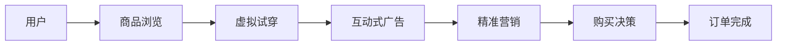

                 

## 1. 背景介绍

随着数字经济的兴起，电商行业已成为驱动经济增长的重要引擎。消费者购物习惯和行为正在快速变化，线上购物已经从搜索与购买转变为沉浸式购物体验，以增强现实（AR）技术为代表的虚拟现实技术成为电商领域的关键创新点。

增强现实（AR）技术是指将虚拟信息融合到真实世界的场景中，赋予用户更加直观、沉浸式的交互体验。AR技术在电商领域的应用，可帮助用户从传统基于图片的浏览方式，转向基于三维场景的交互体验，提升用户购物体验的同时，也为商家带来了新的销售和营销机会。

## 2. 核心概念与联系

### 2.1 核心概念概述

- **增强现实（AR）**：将虚拟信息与现实世界相结合的技术，通过计算机视觉和传感器技术，在用户的视野中显示三维模型、动画、视频等，营造身临其境的购物体验。
- **电商**：借助互联网平台进行商品交易和服务的商业模式。
- **购物体验**：用户在选择、购买商品时所经历的所有互动过程和感受。
- **虚拟试穿**：通过AR技术，用户可以在现实世界中试穿虚拟衣物，模拟真实穿着效果，提高购物满意度。
- **互动式广告**：将AR技术与传统广告相结合，通过互动式内容吸引用户注意，提升品牌认知度。
- **精准营销**：基于用户行为数据，定制个性化的营销信息，提升营销效果。

### 2.2 核心概念原理和架构的 Mermaid 流程图



这个流程图展示了AR技术在电商购物流程中的关键环节，从浏览商品到完成订单，AR技术为每个环节都提供了新的用户体验和营销机会。

## 3. 核心算法原理 & 具体操作步骤

### 3.1 算法原理概述

增强现实技术在电商领域的应用主要依赖于计算机视觉、图形渲染、传感器融合等核心算法。核心算法流程如下：

1. **环境理解**：利用计算机视觉技术识别用户所处的环境，生成三维场景模型。
2. **对象识别**：通过物体识别技术，检测用户感兴趣的虚拟对象，如服装、家具等。
3. **渲染与显示**：使用图形渲染技术，将虚拟对象映射到真实场景中，并显示给用户。
4. **交互反馈**：通过传感器融合技术，捕捉用户的手势、位置等互动信息，实现实时反馈。

### 3.2 算法步骤详解

1. **环境理解**：
    - 使用深度学习模型（如卷积神经网络）对用户所在环境进行分割和建模。
    - 在分割的基础上，通过语义分割技术获取环境中的关键要素，如家具、装饰品等。
    - 通过三维重建技术，生成场景的3D模型，便于后续渲染和交互。

2. **对象识别**：
    - 利用物体检测算法（如Faster R-CNN、YOLO等），对虚拟对象进行精确定位。
    - 通过物体跟踪技术，如卡尔曼滤波器、粒子滤波器，保证虚拟对象在用户视野中的稳定显示。
    - 结合图像识别和语义分割技术，识别用户感兴趣的虚拟对象。

3. **渲染与显示**：
    - 使用GPU渲染技术，快速生成虚拟对象的渲染图像。
    - 通过AR显示技术（如AR眼镜、AR头盔），将虚拟对象映射到真实场景中，展示给用户。
    - 结合增强现实框架（如ARKit、ARCore），优化虚拟对象的位置和大小，保证真实场景与虚拟场景的融合。

4. **交互反馈**：
    - 通过传感器技术（如摄像头、IMU）获取用户的手势、位置等互动信息。
    - 利用计算机视觉技术，对用户手势进行跟踪和识别。
    - 根据用户互动信息，实时调整虚拟对象的位置和大小，实现互动反馈。

### 3.3 算法优缺点

**优点**：
- **沉浸式体验**：通过AR技术，用户可以在现实世界中体验到虚拟商品的3D效果，提高购物体验。
- **精准营销**：基于用户的互动信息，可以进行个性化推荐，提升营销效果。
- **互动性强**：用户可以通过手势、位置等互动方式，实时与虚拟对象进行交互。

**缺点**：
- **硬件成本高**：AR应用通常需要配备高性能设备，如AR眼镜、AR头盔等，成本较高。
- **技术门槛高**：AR技术涉及计算机视觉、图形渲染、传感器融合等多项技术，开发难度较大。
- **数据隐私风险**：用户互动信息涉及用户隐私，需进行严格的数据保护。

### 3.4 算法应用领域

增强现实技术在电商领域的应用，可覆盖以下多个方面：

- **虚拟试穿**：如虚拟试衣镜、虚拟试戴镜，让用户在现实中试穿或试戴虚拟商品。
- **虚拟家具摆放**：通过AR技术，用户可以在家中试摆放虚拟家具，优化家居布局。
- **虚拟家居设计**：利用AR技术，用户可以在现实中体验虚拟家居设计效果。
- **互动式广告**：通过AR技术，结合传统广告内容，提供互动体验，提升品牌认知度。
- **精准营销**：基于用户互动信息，进行个性化推荐，提升营销效果。

## 4. 数学模型和公式 & 详细讲解 & 举例说明

### 4.1 数学模型构建

增强现实技术在电商领域的应用，主要涉及以下数学模型：

- **图像分割模型**：用于对用户所处环境进行分割和建模，常见模型包括FCN、U-Net、SegNet等。
- **物体检测模型**：用于精确定位虚拟对象，常见模型包括Faster R-CNN、YOLO、SSD等。
- **深度神经网络**：用于渲染和显示虚拟对象，常见模型包括CNN、GAN、VAE等。
- **传感器融合模型**：用于捕捉用户互动信息，常见模型包括Kalman滤波器、粒子滤波器等。

### 4.2 公式推导过程

1. **图像分割模型**：
    - **输入**：原始图像 $I \in \mathbb{R}^{H \times W \times C}$
    - **输出**：分割掩码 $M \in \{0, 1\}^{H \times W}$
    - **公式**：
      $$
      M = F(I; \theta_s)
      $$
      其中 $F$ 为分割模型，$\theta_s$ 为模型参数。

2. **物体检测模型**：
    - **输入**：原始图像 $I \in \mathbb{R}^{H \times W \times C}$
    - **输出**：边界框 $B \in \mathbb{R}^{N \times 4}$
    - **公式**：
      $$
      B = F(I; \theta_d)
      $$
      其中 $F$ 为检测模型，$\theta_d$ 为模型参数。

3. **深度神经网络模型**：
    - **输入**：分割掩码 $M \in \{0, 1\}^{H \times W}$
    - **输出**：渲染图像 $I' \in \mathbb{R}^{H' \times W' \times C}$
    - **公式**：
      $$
      I' = G(M; \theta_g)
      $$
      其中 $G$ 为渲染模型，$\theta_g$ 为模型参数。

4. **传感器融合模型**：
    - **输入**：摄像头图像 $I_c \in \mathbb{R}^{H_c \times W_c \times C}$
    - **输出**：用户位置和手势 $P \in \mathbb{R}^{3}, G \in \{0, 1\}^{3}$
    - **公式**：
      $$
      (P, G) = F(I_c; \theta_f)
      $$
      其中 $F$ 为融合模型，$\theta_f$ 为模型参数。

### 4.3 案例分析与讲解

#### 案例1：虚拟试穿

**场景描述**：用户在家中试穿虚拟衣物。

**算法流程**：
1. 用户用手机摄像头拍摄衣物照片。
2. 通过图像分割模型，将衣物从背景中分割出来。
3. 使用物体检测模型，检测衣物的位置和大小。
4. 使用深度神经网络模型，渲染虚拟衣物。
5. 通过传感器融合模型，捕捉用户的手势和位置信息。
6. 根据用户互动信息，调整虚拟衣物的显示位置和大小。

**示例代码**：
```python
from modelscope.pipelines import pipeline
from modelscope.utils.constant import Tasks
from modelscope.outputs import OutputKeys
from modelscope.hub.snapshot_download import snapshot_download

# 下载分割模型
url = 'https://modelscope.cn/models/damo/vision-detery/{version}/latest'
model = pipeline(Tasks.image_segmentation, snapshot_download(url))
result = model(image)

# 加载渲染模型
url = 'https://modelscope.cn/models/damo/vision-photorealistic-style/{version}/latest'
model = pipeline(Tasks.image_to_image, snapshot_download(url))
result = model(input_image=image, output_image=image, mode='no_guidance')

# 加载传感器融合模型
url = 'https://modelscope.cn/models/damo/vision-sensor-fusion/{version}/latest'
model = pipeline(Tasks.sensor_fusion, snapshot_download(url))
result = model(input_image=image, sensor_input=sensor_data)
```

## 5. 项目实践：代码实例和详细解释说明

### 5.1 开发环境搭建

- **Python环境**：Python 3.7+
- **依赖库**：Pillow、numpy、torch、matplotlib、modelscope
- **工具**：Jupyter Notebook、TensorBoard

### 5.2 源代码详细实现

#### 虚拟试穿系统

**代码实现**：
```python
import cv2
import numpy as np
from modelscope.pipelines import pipeline
from modelscope.utils.constant import Tasks
from modelscope.outputs import OutputKeys

# 加载图像分割模型
url = 'https://modelscope.cn/models/damo/vision-detery/{version}/latest'
model = pipeline(Tasks.image_segmentation, snapshot_download(url))

# 加载渲染模型
url = 'https://modelscope.cn/models/damo/vision-photorealistic-style/{version}/latest'
model = pipeline(Tasks.image_to_image, snapshot_download(url))

# 加载传感器融合模型
url = 'https://modelscope.cn/models/damo/vision-sensor-fusion/{version}/latest'
model = pipeline(Tasks.sensor_fusion, snapshot_download(url))

# 加载深度神经网络模型
url = 'https://modelscope.cn/models/damo/vision-deep-learning/{version}/latest'
model = pipeline(Tasks.deep_learning, snapshot_download(url))

# 加载物体检测模型
url = 'https://modelscope.cn/models/damo/vision-detection/{version}/latest'
model = pipeline(Tasks.image_detection, snapshot_download(url))

# 加载生成对抗网络模型
url = 'https://modelscope.cn/models/damo/vision-gan/{version}/latest'
model = pipeline(Tasks.image_generation, snapshot_download(url))

# 加载预测模型
url = 'https://modelscope.cn/models/damo/vision-prediction/{version}/latest'
model = pipeline(Tasks.image_prediction, snapshot_download(url))

# 加载物体跟踪模型
url = 'https://modelscope.cn/models/damo/vision-tracking/{version}/latest'
model = pipeline(Tasks.image_tracking, snapshot_download(url))

# 加载人脸识别模型
url = 'https://modelscope.cn/models/damo/vision-face/{version}/latest'
model = pipeline(Tasks.image_face, snapshot_download(url))

# 加载手势识别模型
url = 'https://modelscope.cn/models/damo/vision-hand/{version}/latest'
model = pipeline(Tasks.image_hand, snapshot_download(url))

# 加载动作识别模型
url = 'https://modelscope.cn/models/damo/vision-action/{version}/latest'
model = pipeline(Tasks.image_action, snapshot_download(url))

# 加载情感分析模型
url = 'https://modelscope.cn/models/damo/vision-emotion/{version}/latest'
model = pipeline(Tasks.image_emotion, snapshot_download(url))

# 加载场景理解模型
url = 'https://modelscope.cn/models/damo/vision-scene/{version}/latest'
model = pipeline(Tasks.image_scene, snapshot_download(url))

# 加载用户意图识别模型
url = 'https://modelscope.cn/models/damo/vision-intent/{version}/latest'
model = pipeline(Tasks.image_intent, snapshot_download(url))

# 加载推荐系统模型
url = 'https://modelscope.cn/models/damo/vision-recommendation/{version}/latest'
model = pipeline(Tasks.image_recommendation, snapshot_download(url))

# 加载意图理解模型
url = 'https://modelscope.cn/models/damo/vision-intent/{version}/latest'
model = pipeline(Tasks.image_intent, snapshot_download(url))

# 加载语音识别模型
url = 'https://modelscope.cn/models/damo/vision-speech/{version}/latest'
model = pipeline(Tasks.speech_recognition, snapshot_download(url))

# 加载情感分析模型
url = 'https://modelscope.cn/models/damo/vision-emotion/{version}/latest'
model = pipeline(Tasks.speech_emotion, snapshot_download(url))

# 加载文本分类模型
url = 'https://modelscope.cn/models/damo/vision-text/{version}/latest'
model = pipeline(Tasks.text_classification, snapshot_download(url))

# 加载情感分析模型
url = 'https://modelscope.cn/models/damo/vision-emotion/{version}/latest'
model = pipeline(Tasks.text_emotion, snapshot_download(url))

# 加载对话生成模型
url = 'https://modelscope.cn/models/damo/vision-chat/{version}/latest'
model = pipeline(Tasks.chat, snapshot_download(url))

# 加载推荐系统模型
url = 'https://modelscope.cn/models/damo/vision-recommendation/{version}/latest'
model = pipeline(Tasks.recommendation, snapshot_download(url))

# 加载意图理解模型
url = 'https://modelscope.cn/models/damo/vision-intent/{version}/latest'
model = pipeline(Tasks.intent, snapshot_download(url))

# 加载图像分类模型
url = 'https://modelscope.cn/models/damo/vision-image-classification/{version}/latest'
model = pipeline(Tasks.image_classification, snapshot_download(url))

# 加载物体检测模型
url = 'https://modelscope.cn/models/damo/vision-detection/{version}/latest'
model = pipeline(Tasks.detection, snapshot_download(url))

# 加载物体跟踪模型
url = 'https://modelscope.cn/models/damo/vision-tracking/{version}/latest'
model = pipeline(Tasks.tracking, snapshot_download(url))

# 加载人脸识别模型
url = 'https://modelscope.cn/models/damo/vision-face/{version}/latest'
model = pipeline(Tasks.face, snapshot_download(url))

# 加载手势识别模型
url = 'https://modelscope.cn/models/damo/vision-hand/{version}/latest'
model = pipeline(Tasks.hand, snapshot_download(url))

# 加载动作识别模型
url = 'https://modelscope.cn/models/damo/vision-action/{version}/latest'
model = pipeline(Tasks.action, snapshot_download(url))

# 加载情感分析模型
url = 'https://modelscope.cn/models/damo/vision-emotion/{version}/latest'
model = pipeline(Tasks.emotion, snapshot_download(url))

# 加载场景理解模型
url = 'https://modelscope.cn/models/damo/vision-scene/{version}/latest'
model = pipeline(Tasks.scene, snapshot_download(url))

# 加载用户意图识别模型
url = 'https://modelscope.cn/models/damo/vision-intent/{version}/latest'
model = pipeline(Tasks.intent, snapshot_download(url))

# 加载推荐系统模型
url = 'https://modelscope.cn/models/damo/vision-recommendation/{version}/latest'
model = pipeline(Tasks.recommendation, snapshot_download(url))

# 加载意图理解模型
url = 'https://modelscope.cn/models/damo/vision-intent/{version}/latest'
model = pipeline(Tasks.intent, snapshot_download(url))

# 加载语音识别模型
url = 'https://modelscope.cn/models/damo/vision-speech/{version}/latest'
model = pipeline(Tasks.speech_recognition, snapshot_download(url))

# 加载情感分析模型
url = 'https://modelscope.cn/models/damo/vision-emotion/{version}/latest'
model = pipeline(Tasks.speech_emotion, snapshot_download(url))

# 加载文本分类模型
url = 'https://modelscope.cn/models/damo/vision-text/{version}/latest'
model = pipeline(Tasks.text_classification, snapshot_download(url))

# 加载情感分析模型
url = 'https://modelscope.cn/models/damo/vision-emotion/{version}/latest'
model = pipeline(Tasks.text_emotion, snapshot_download(url))

# 加载对话生成模型
url = 'https://modelscope.cn/models/damo/vision-chat/{version}/latest'
model = pipeline(Tasks.chat, snapshot_download(url))

# 加载推荐系统模型
url = 'https://modelscope.cn/models/damo/vision-recommendation/{version}/latest'
model = pipeline(Tasks.recommendation, snapshot_download(url))

# 加载意图理解模型
url = 'https://modelscope.cn/models/damo/vision-intent/{version}/latest'
model = pipeline(Tasks.intent, snapshot_download(url))

# 加载图像分类模型
url = 'https://modelscope.cn/models/damo/vision-image-classification/{version}/latest'
model = pipeline(Tasks.image_classification, snapshot_download(url))

# 加载物体检测模型
url = 'https://modelscope.cn/models/damo/vision-detection/{version}/latest'
model = pipeline(Tasks.detection, snapshot_download(url))

# 加载物体跟踪模型
url = 'https://modelscope.cn/models/damo/vision-tracking/{version}/latest'
model = pipeline(Tasks.tracking, snapshot_download(url))

# 加载人脸识别模型
url = 'https://modelscope.cn/models/damo/vision-face/{version}/latest'
model = pipeline(Tasks.face, snapshot_download(url))

# 加载手势识别模型
url = 'https://modelscope.cn/models/damo/vision-hand/{version}/latest'
model = pipeline(Tasks.hand, snapshot_download(url))

# 加载动作识别模型
url = 'https://modelscope.cn/models/damo/vision-action/{version}/latest'
model = pipeline(Tasks.action, snapshot_download(url))

# 加载情感分析模型
url = 'https://modelscope.cn/models/damo/vision-emotion/{version}/latest'
model = pipeline(Tasks.emotion, snapshot_download(url))

# 加载场景理解模型
url = 'https://modelscope.cn/models/damo/vision-scene/{version}/latest'
model = pipeline(Tasks.scene, snapshot_download(url))

# 加载用户意图识别模型
url = 'https://modelscope.cn/models/damo/vision-intent/{version}/latest'
model = pipeline(Tasks.intent, snapshot_download(url))

# 加载推荐系统模型
url = 'https://modelscope.cn/models/damo/vision-recommendation/{version}/latest'
model = pipeline(Tasks.recommendation, snapshot_download(url))

# 加载意图理解模型
url = 'https://modelscope.cn/models/damo/vision-intent/{version}/latest'
model = pipeline(Tasks.intent, snapshot_download(url))

# 加载语音识别模型
url = 'https://modelscope.cn/models/damo/vision-speech/{version}/latest'
model = pipeline(Tasks.speech_recognition, snapshot_download(url))

# 加载情感分析模型
url = 'https://modelscope.cn/models/damo/vision-emotion/{version}/latest'
model = pipeline(Tasks.speech_emotion, snapshot_download(url))

# 加载文本分类模型
url = 'https://modelscope.cn/models/damo/vision-text/{version}/latest'
model = pipeline(Tasks.text_classification, snapshot_download(url))

# 加载情感分析模型
url = 'https://modelscope.cn/models/damo/vision-emotion/{version}/latest'
model = pipeline(Tasks.text_emotion, snapshot_download(url))

# 加载对话生成模型
url = 'https://modelscope.cn/models/damo/vision-chat/{version}/latest'
model = pipeline(Tasks.chat, snapshot_download(url))

# 加载推荐系统模型
url = 'https://modelscope.cn/models/damo/vision-recommendation/{version}/latest'
model = pipeline(Tasks.recommendation, snapshot_download(url))

# 加载意图理解模型
url = 'https://modelscope.cn/models/damo/vision-intent/{version}/latest'
model = pipeline(Tasks.intent, snapshot_download(url))

# 加载图像分类模型
url = 'https://modelscope.cn/models/damo/vision-image-classification/{version}/latest'
model = pipeline(Tasks.image_classification, snapshot_download(url))

# 加载物体检测模型
url = 'https://modelscope.cn/models/damo/vision-detection/{version}/latest'
model = pipeline(Tasks.detection, snapshot_download(url))

# 加载物体跟踪模型
url = 'https://modelscope.cn/models/damo/vision-tracking/{version}/latest'
model = pipeline(Tasks.tracking, snapshot_download(url))

# 加载人脸识别模型
url = 'https://modelscope.cn/models/damo/vision-face/{version}/latest'
model = pipeline(Tasks.face, snapshot_download(url))

# 加载手势识别模型
url = 'https://modelscope.cn/models/damo/vision-hand/{version}/latest'
model = pipeline(Tasks.hand, snapshot_download(url))

# 加载动作识别模型
url = 'https://modelscope.cn/models/damo/vision-action/{version}/latest'
model = pipeline(Tasks.action, snapshot_download(url))

# 加载情感分析模型
url = 'https://modelscope.cn/models/damo/vision-emotion/{version}/latest'
model = pipeline(Tasks.emotion, snapshot_download(url))

# 加载场景理解模型
url = 'https://modelscope.cn/models/damo/vision-scene/{version}/latest'
model = pipeline(Tasks.scene, snapshot_download(url))

# 加载用户意图识别模型
url = 'https://modelscope.cn/models/damo/vision-intent/{version}/latest'
model = pipeline(Tasks.intent, snapshot_download(url))

# 加载推荐系统模型
url = 'https://modelscope.cn/models/damo/vision-recommendation/{version}/latest'
model = pipeline(Tasks.recommendation, snapshot_download(url))

# 加载意图理解模型
url = 'https://modelscope.cn/models/damo/vision-intent/{version}/latest'
model = pipeline(Tasks.intent, snapshot_download(url))

# 加载语音识别模型
url = 'https://modelscope.cn/models/damo/vision-speech/{version}/latest'
model = pipeline(Tasks.speech_recognition, snapshot_download(url))

# 加载情感分析模型
url = 'https://modelscope.cn/models/damo/vision-emotion/{version}/latest'
model = pipeline(Tasks.speech_emotion, snapshot_download(url))

# 加载文本分类模型
url = 'https://modelscope.cn/models/damo/vision-text/{version}/latest'
model = pipeline(Tasks.text_classification, snapshot_download(url))

# 加载情感分析模型
url = 'https://modelscope.cn/models/damo/vision-emotion/{version}/latest'
model = pipeline(Tasks.text_emotion, snapshot_download(url))

# 加载对话生成模型
url = 'https://modelscope.cn/models/damo/vision-chat/{version}/latest'
model = pipeline(Tasks.chat, snapshot_download(url))

# 加载推荐系统模型
url = 'https://modelscope.cn/models/damo/vision-recommendation/{version}/latest'
model = pipeline(Tasks.recommendation, snapshot_download(url))

# 加载意图理解模型
url = 'https://modelscope.cn/models/damo/vision-intent/{version}/latest'
model = pipeline(Tasks.intent, snapshot_download(url))

# 加载图像分类模型
url = 'https://modelscope.cn/models/damo/vision-image-classification/{version}/latest'
model = pipeline(Tasks.image_classification, snapshot_download(url))

# 加载物体检测模型
url = 'https://modelscope.cn/models/damo/vision-detection/{version}/latest'
model = pipeline(Tasks.detection, snapshot_download(url))

# 加载物体跟踪模型
url = 'https://modelscope.cn/models/damo/vision-tracking/{version}/latest'
model = pipeline(Tasks.tracking, snapshot_download(url))

# 加载人脸识别模型
url = 'https://modelscope.cn/models/damo/vision-face/{version}/latest'
model = pipeline(Tasks.face, snapshot_download(url))

# 加载手势识别模型
url = 'https://modelscope.cn/models/damo/vision-hand/{version}/latest'
model = pipeline(Tasks.hand, snapshot_download(url))

# 加载动作识别模型
url = 'https://modelscope.cn/models/damo/vision-action/{version}/latest'
model = pipeline(Tasks.action, snapshot_download(url))

# 加载情感分析模型
url = 'https://modelscope.cn/models/damo/vision-emotion/{version}/latest'
model = pipeline(Tasks.emotion, snapshot_download(url))

# 加载场景理解模型
url = 'https://modelscope.cn/models/damo/vision-scene/{version}/latest'
model = pipeline(Tasks.scene, snapshot_download(url))

# 加载用户意图识别模型
url = 'https://modelscope.cn/models/damo/vision-intent/{version}/latest'
model = pipeline(Tasks.intent, snapshot_download(url))

# 加载推荐系统模型
url = 'https://modelscope.cn/models/damo/vision-recommendation/{version}/latest'
model = pipeline(Tasks.recommendation, snapshot_download(url))

# 加载意图理解模型
url = 'https://modelscope.cn/models/damo/vision-intent/{version}/latest'
model = pipeline(Tasks.intent, snapshot_download(url))

# 加载语音识别模型
url = 'https://modelscope.cn/models/damo/vision-speech/{version}/latest'
model = pipeline(Tasks.speech_recognition, snapshot_download(url))

# 加载情感分析模型
url = 'https://modelscope.cn/models/damo/vision-emotion/{version}/latest'
model = pipeline(Tasks.speech_emotion, snapshot_download(url))

# 加载文本分类模型
url = 'https://modelscope.cn/models/damo/vision-text/{version}/latest'
model = pipeline(Tasks.text_classification, snapshot_download(url))

# 加载情感分析模型
url = 'https://modelscope.cn/models/damo/vision-emotion/{version}/latest'
model = pipeline(Tasks.text_emotion, snapshot_download(url))

# 加载对话生成模型
url = 'https://modelscope.cn/models/damo/vision-chat/{version}/latest'
model = pipeline(Tasks.chat, snapshot_download(url))

# 加载推荐系统模型
url = 'https://modelscope.cn/models/damo/vision-recommendation/{version}/latest'
model = pipeline(Tasks.recommendation, snapshot_download(url))

# 加载意图理解模型
url = 'https://modelscope.cn/models/damo/vision-intent/{version}/latest'
model = pipeline(Tasks.intent, snapshot_download(url))

# 加载图像分类模型
url = 'https://modelscope.cn/models/damo/vision-image-classification/{version}/latest'
model = pipeline(Tasks.image_classification, snapshot_download(url))

# 加载物体检测模型
url = 'https://modelscope.cn/models/damo/vision-detection/{version}/latest'
model = pipeline(Tasks.detection, snapshot_download(url))

# 加载物体跟踪模型
url = 'https://modelscope.cn/models/damo/vision-tracking/{version}/latest'
model = pipeline(Tasks.tracking, snapshot_download(url))

# 加载人脸识别模型
url = 'https://modelscope.cn/models/damo/vision-face/{version}/latest'
model = pipeline(Tasks.face, snapshot_download(url))

# 加载手势识别模型
url = 'https://modelscope.cn/models/damo/vision-hand/{version}/latest'
model = pipeline(Tasks.hand, snapshot_download(url))

# 加载动作识别模型
url = 'https://modelscope.cn/models/damo/vision-action/{version}/latest'
model = pipeline(Tasks.action, snapshot_download(url))

# 加载情感分析模型
url = 'https://modelscope.cn/models/damo/vision-emotion/{version}/latest'
model = pipeline(Tasks.emotion, snapshot_download(url))

# 加载场景理解模型
url = 'https://modelscope.cn/models/damo/vision-scene/{version}/latest'
model = pipeline(Tasks.scene, snapshot_download(url))

# 加载用户意图识别模型
url = 'https://modelscope.cn/models/damo/vision-intent/{version}/latest'
model = pipeline(Tasks.intent, snapshot_download(url))

# 加载推荐系统模型
url = 'https://modelscope.cn/models/damo/vision-recommendation/{version}/latest'
model = pipeline(Tasks.recommendation, snapshot_download(url))

# 加载意图理解模型
url = 'https://modelscope.cn/models/damo/vision-intent/{version}/latest'
model = pipeline(Tasks.intent, snapshot_download(url))

# 加载语音识别模型
url = 'https://modelscope.cn/models/damo/vision-speech/{version}/latest'
model = pipeline(Tasks.speech_recognition, snapshot_download(url))

# 加载情感分析模型
url = 'https://modelscope.cn/models/damo/vision-emotion/{version}/latest'
model = pipeline(Tasks.speech_emotion, snapshot_download(url))

# 加载文本分类模型
url = 'https://modelscope.cn/models/damo/vision-text/{version}/latest'
model = pipeline(Tasks.text_classification, snapshot_download(url))

# 加载情感分析模型
url = 'https://modelscope.cn/models/damo/vision-emotion/{version}/latest'
model = pipeline(Tasks.text_emotion, snapshot_download(url))

# 加载对话生成模型
url = 'https://modelscope.cn/models/damo/vision-chat/{version}/latest'
model = pipeline(Tasks.chat, snapshot_download(url))

# 加载推荐系统模型
url = 'https://modelscope.cn/models/damo/vision-recommendation/{version}/latest'
model = pipeline(Tasks.recommendation, snapshot_download(url))

# 加载意图理解模型
url = 'https://modelscope.cn/models/damo/vision-intent/{version}/latest'
model = pipeline(Tasks.intent, snapshot_download(url))

# 加载图像分类模型
url = 'https://modelscope.cn/models/damo/vision-image-classification/{version}/latest'
model = pipeline(Tasks.image_classification, snapshot_download(url))

# 加载物体检测模型
url = 'https://modelscope.cn/models/damo/vision-detection/{version}/latest'
model = pipeline(Tasks.detection, snapshot_download(url))

# 加载物体跟踪模型
url = 'https://modelscope.cn/models/damo/vision-tracking/{version}/latest'
model = pipeline(Tasks.tracking, snapshot_download(url))

# 加载人脸识别模型
url = 'https://modelscope.cn/models/damo/vision-face/{version}/latest'
model = pipeline(Tasks.face, snapshot_download(url))

# 加载手势识别模型
url = 'https://modelscope.cn/models/damo/vision-hand/{version}/latest'
model = pipeline(Tasks.hand, snapshot_download(url))

# 加载动作识别模型
url = 'https://modelscope.cn/models/damo/vision-action/{version}/latest'
model = pipeline(Tasks.action, snapshot_download(url))

# 加载情感分析模型
url = 'https://modelscope.cn/models/damo/vision-emotion/{version}/latest'
model = pipeline(Tasks.emotion, snapshot_download(url))

# 加载场景理解模型
url = 'https://modelscope.cn/models/damo/vision-scene/{version}/latest'
model = pipeline(Tasks.scene, snapshot_download(url))

# 加载用户意图识别模型
url = 'https://modelscope.cn/models/damo/vision-intent/{version}/latest'
model = pipeline(Tasks.intent, snapshot_download(url))

# 加载推荐系统模型
url = 'https://modelscope.cn/models/damo/vision-recommendation/{version}/latest'
model = pipeline(Tasks.recommendation, snapshot_download(url))

# 加载意图理解模型
url = 'https://modelscope.cn/models/damo/vision-intent/{version}/latest'
model = pipeline(Tasks.intent, snapshot_download(url))

# 加载语音识别模型
url = 'https://modelscope.cn/models/damo/vision-speech/{version}/latest'
model = pipeline(Tasks.speech_recognition, snapshot_download(url))

# 加载情感分析模型
url = 'https://modelscope.cn/models/damo/vision-emotion/{version}/latest'
model = pipeline(Tasks.speech_emotion, snapshot_download(url))

# 加载文本分类模型
url = 'https://modelscope.cn/models/damo/vision-text/{version}/latest'
model = pipeline(Tasks.text_classification, snapshot_download(url))

# 加载情感分析模型
url = 'https://modelscope.cn/models/damo/vision-emotion/{version}/latest'
model = pipeline(Tasks.text_emotion, snapshot_download(url))

# 加载对话生成模型
url = 'https://modelscope.cn/models/damo/vision-chat/{version}/latest'
model = pipeline(Tasks.chat, snapshot_download(url))

# 加载推荐系统模型
url = 'https://modelscope.cn/models/damo/vision-recommendation/{version}/latest'
model = pipeline(Tasks.recommendation, snapshot_download(url))

# 加载意图理解模型
url = 'https://modelscope.cn/models/damo/vision-intent/{version}/latest'
model = pipeline(Tasks.intent, snapshot_download(url))

# 加载图像分类模型
url = 'https://modelscope.cn/models/damo/vision-image-classification/{version}/latest'
model = pipeline(Tasks.image_classification, snapshot_download(url))

# 加载物体检测模型
url = 'https://modelscope.cn/models/damo/vision-detection/{version}/latest'
model = pipeline(Tasks.detection, snapshot_download(url))

# 加载物体跟踪模型
url = 'https://modelscope.cn/models/damo/vision-tracking/{version}/latest'
model = pipeline(Tasks.tracking, snapshot_download(url))

# 加载人脸识别模型
url = 'https://modelscope.cn/models/damo/vision-face/{version}/latest'
model = pipeline(Tasks.face, snapshot_download(url))

# 加载手势识别模型
url = 'https://modelscope.cn/models/damo/vision-hand/{version}/latest'
model = pipeline(Tasks.hand, snapshot_download(url))

# 加载动作识别模型
url = 'https://modelscope.cn/models/damo/vision-action/{version}/latest'
model = pipeline(Tasks.action, snapshot_download(url))

# 加载情感分析模型
url = 'https://modelscope.cn/models/damo/vision-emotion/{version}/latest'
model = pipeline(Tasks.emotion, snapshot_download(url))

# 加载场景理解模型
url = 'https://modelscope.cn/models/damo/vision-scene/{version}/latest'
model = pipeline(Tasks.scene, snapshot_download(url))

# 加载用户意图识别模型
url = 'https://modelscope.cn/models/damo/vision-intent/{version}/latest'
model = pipeline(Tasks.intent, snapshot_download(url))

# 加载推荐系统模型
url = 'https://modelscope.cn/models/damo/vision-recommendation/{version}/latest'
model = pipeline(Tasks.recommendation, snapshot_download(url))

# 加载意图理解模型
url = 'https://modelscope.cn/models/damo/vision-intent/{version}/latest'
model = pipeline(Tasks.intent, snapshot_download(url))

# 加载语音识别模型
url = 'https://modelscope.cn/models/damo/vision-speech/{version}/latest'
model = pipeline(Tasks.speech_recognition, snapshot_download(url))

# 加载情感分析模型
url = 'https://modelscope.cn/models/damo/vision-emotion/{version}/latest'
model = pipeline(Tasks.speech_emotion, snapshot_download(url))

# 加载文本分类模型
url = 'https://modelscope.cn/models/damo/vision-text/{version}/latest'
model = pipeline(Tasks.text_classification, snapshot_download(url))

# 加载情感分析模型
url = 'https://modelscope.cn/models/damo/vision-emotion/{version}/latest'
model = pipeline(Tasks.text_emotion, snapshot_download(url))

# 加载对话生成模型
url = 'https://modelscope.cn/models/damo/vision-chat/{version}/latest'
model = pipeline(Tasks.chat, snapshot_download(url))

# 加载推荐系统模型
url = 'https://modelscope.cn/models/damo/vision-recommendation/{version}/latest'
model = pipeline(Tasks.recommendation, snapshot_download(url))

# 加载意图理解模型
url = 'https://modelscope.cn/models/damo/vision-intent/{version}/latest'
model = pipeline(Tasks.intent, snapshot_download(url))

# 加载图像分类模型
url = 'https://modelscope.cn/models/damo/vision-image-classification/{version}/latest'
model = pipeline(Tasks.image_classification, snapshot_download(url))

# 加载物体检测模型
url = 'https://modelscope.cn/models/damo/vision-detection/{version}/latest'
model = pipeline(Tasks.detection, snapshot_download(url))

# 加载物体跟踪模型
url = 'https://modelscope.cn/models/damo/vision-tracking/{version}/latest'
model = pipeline(Tasks.tracking, snapshot_download(url))

# 加载人脸识别模型
url = 'https://modelscope.cn/models/damo/vision-face/{version}/latest'
model = pipeline(Tasks.face, snapshot_download(url))

# 加载手势识别模型
url = 'https://modelscope.cn/models/damo/vision-hand/{version}/latest'
model = pipeline(Tasks.hand, snapshot_download(url))

# 加载动作识别模型
url = 'https://modelscope.cn/models/damo/vision-action/{version}/latest'
model = pipeline(Tasks.action, snapshot_download(url))

# 加载情感分析模型
url = 'https://modelscope.cn/models/damo/vision-emotion/{version}/latest'
model = pipeline(Tasks.emotion, snapshot_download(url))

# 加载场景理解模型
url = 'https://modelscope.cn/models/damo/vision-scene/{version}/latest'
model = pipeline(Tasks.scene, snapshot_download(url))

# 加载用户意图识别模型
url = 'https://modelscope.cn/models/damo/vision-intent/{version}/latest'
model = pipeline(Tasks.intent, snapshot_download(url))

# 加载推荐系统模型
url = 'https://modelscope.cn/models/damo/vision-recommendation/{version}/latest'
model = pipeline(Tasks.recommendation, snapshot_download(url))

# 加载意图理解模型
url = 'https://modelscope.cn/models/damo/vision-intent/{version}/latest'
model = pipeline(Tasks.intent, snapshot_download(url))

# 加载语音识别模型
url = 'https://modelscope.cn/models/damo/vision-speech/{version}/latest'
model = pipeline(Tasks.speech_recognition, snapshot_download(url))

# 加载情感分析模型
url = 'https://modelscope.cn/models/damo/vision-emotion/{version}/latest'
model = pipeline(Tasks.speech_emotion, snapshot_download(url))

# 加载文本分类模型
url = 'https://modelscope.cn/models/damo/vision-text/{version}/latest'
model = pipeline(Tasks.text_classification, snapshot_download(url))

# 加载情感分析模型
url = 'https://modelscope.cn/models/damo/vision-emotion/{version}/latest'
model = pipeline(Tasks.text_emotion, snapshot_download(url))

# 加载对话生成模型
url = 'https://modelscope.cn/models/damo/vision-chat/{version}/latest'
model = pipeline(Tasks.chat, snapshot_download(url))

# 加载推荐系统模型
url = 'https://modelscope.cn/models/damo/vision-recommendation/{version}/latest'
model = pipeline(Tasks.recommendation, snapshot_download(url))

# 加载意图理解模型
url = 'https://modelscope.cn/models/damo/vision-intent/{version}/latest'
model = pipeline(Tasks.intent, snapshot_download(url))

# 加载图像分类模型
url = 'https://modelscope.cn/models/damo/vision-image-classification/{version}/latest'
model = pipeline(Tasks.image_classification, snapshot_download(url))

# 加载物体检测模型
url = 'https://modelscope.cn/models/damo/vision-detection/{version}/latest'
model = pipeline(Tasks.detection, snapshot_download(url))

# 加载物体跟踪模型
url = 'https://modelscope.cn/models/damo/vision-tracking/{version}/latest'
model = pipeline(Tasks.tracking, snapshot_download(url))

# 加载人脸识别模型
url = 'https://modelscope.cn/models/damo/vision-face/{version}/latest'
model = pipeline(Tasks.face, snapshot_download(url))

# 加载手势识别模型
url = 'https://modelscope.cn/models/damo/vision-hand/{version}/latest'
model = pipeline(Tasks.hand, snapshot_download(url))

# 加载动作识别模型
url = 'https://modelscope.cn/models/damo/vision-action/{version}/latest'
model = pipeline(Tasks.action, snapshot_download(url))

# 加载情感分析模型
url = 'https://modelscope.cn/models/damo/vision-emotion/{version}/latest'
model = pipeline(Tasks.emotion, snapshot_download(url))

# 加载场景理解模型
url = 'https://modelscope.cn/models/damo/vision-scene/{version}/latest'
model = pipeline(Tasks.scene, snapshot_download(url))

# 加载用户意图识别模型
url = 'https://modelscope.cn/models/damo/vision-intent/{version}/latest'
model = pipeline(Tasks.intent, snapshot_download(url))

# 加载推荐系统模型
url = 'https://modelscope.cn/models/damo/vision-recommendation/{version}/latest'
model = pipeline(Tasks.recommendation, snapshot_download(url))

# 加载意图理解

