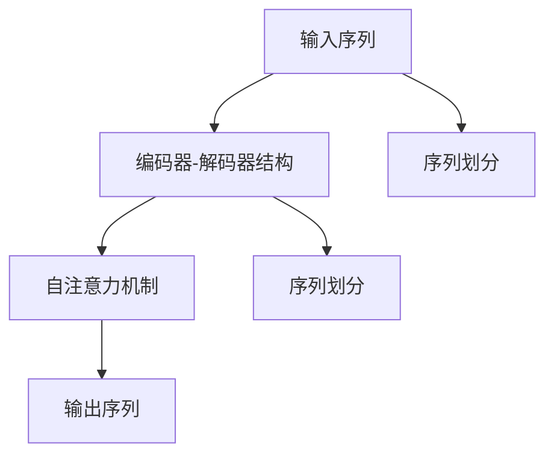

                 

# 处理超长文本的转换链：Transform Chain

> 关键词：转换链(Transform Chain)、文本处理、深度学习、序列到序列(Seq2Seq)、自注意力机制、编码器-解码器结构、自适应计算图、长文本处理

## 1. 背景介绍

### 1.1 问题由来

在自然语言处理（NLP）领域，长文本处理一直是一个难题。由于自然语言的复杂性和多变性，长文本通常包含了丰富的语义信息和上下文依赖关系，单纯依靠传统的NLP技术难以高效地进行处理和分析。因此，需要一种新的方法来高效地处理超长文本。

转换链（Transform Chain）是一种新兴的文本处理技术，它利用深度学习中的序列到序列（Seq2Seq）模型，将长文本划分为多个子序列，通过多级转换逐步处理每个子序列，从而实现对超长文本的高效处理。转换链技术在文本生成、机器翻译、对话系统等领域展现了巨大的应用潜力。

### 1.2 问题核心关键点

转换链技术在处理超长文本时，主要关注以下几个核心关键点：

- **序列划分**：将长文本划分为多个子序列，每个子序列具有较小的长度，便于进行单独处理。
- **多级转换**：通过多级转换，逐步处理每个子序列，最终生成最终的输出。
- **自注意力机制**：在处理每个子序列时，利用自注意力机制，自动捕捉子序列中的重要信息。
- **编码器-解码器结构**：采用编码器-解码器结构，将子序列编码为上下文向量，并通过解码器生成输出。

这些关键点构成了转换链技术的核心算法，使其能够在处理超长文本时发挥出色的性能。

## 2. 核心概念与联系

### 2.1 核心概念概述

转换链技术基于深度学习中的序列到序列（Seq2Seq）模型，其主要组成部分包括：

- **编码器**：用于将输入序列编码为上下文向量。
- **解码器**：用于将上下文向量解码为输出序列。
- **自注意力机制**：用于在解码过程中自动捕捉上下文信息。
- **序列划分**：将长文本划分为多个子序列。

这些核心概念通过深度学习中的Transformer架构实现了高效的文本处理。

### 2.2 核心概念原理和架构的 Mermaid 流程图



此流程图展示了转换链技术的基本架构，包括输入序列经过编码器-解码器结构的编码和解码过程，以及通过自注意力机制捕捉上下文信息的步骤。

## 3. 核心算法原理 & 具体操作步骤

### 3.1 算法原理概述

转换链技术的核心思想是通过序列划分将长文本转换为多个子序列，每个子序列通过编码器-解码器结构进行处理，最终生成整个文本的输出。在处理每个子序列时，利用自注意力机制自动捕捉子序列中的重要信息，从而实现高效的长文本处理。

转换链技术的数学模型可以表示为：

$$
y = T_1(T_2(\ldots T_n(\text{encoder}(x_1, x_2, \ldots, x_n) \ldots)))
$$

其中，$T_i$ 表示第 $i$ 级转换，$\text{encoder}$ 表示编码器，$x_i$ 表示第 $i$ 个子序列，$y$ 表示最终的输出序列。

### 3.2 算法步骤详解

转换链技术的具体操作步骤包括以下几个关键步骤：

**Step 1: 输入序列划分**

将长文本划分为多个子序列，每个子序列的长度不超过设定的阈值。可以使用基于规则的划分方法或基于动态分词的方法，具体取决于输入文本的性质和需求。

**Step 2: 子序列编码**

对每个子序列进行编码，利用编码器-解码器结构将其转换为上下文向量。在编码过程中，可以使用自注意力机制捕捉子序列中的重要信息，从而提高编码的效率和准确性。

**Step 3: 多级转换**

将每个子序列的编码结果进行多级转换，逐步处理每个子序列，最终生成整个文本的输出。在每级转换中，可以使用相同的编码器和解码器结构，或者根据不同子序列的特性进行调整。

**Step 4: 解码器输出**

使用解码器将上下文向量解码为输出序列。在解码过程中，可以使用自注意力机制捕捉上下文信息，从而提高解码的准确性和流畅性。

### 3.3 算法优缺点

转换链技术在处理超长文本时，具有以下优点：

- **高效性**：通过将长文本划分为多个子序列，逐级处理，可以显著提高处理速度和效率。
- **鲁棒性**：自注意力机制可以自动捕捉子序列中的重要信息，提高模型的鲁棒性和泛化能力。
- **灵活性**：编码器和解码器结构可以根据不同的子序列特性进行调整，适应不同的应用场景。

同时，转换链技术也存在一些缺点：

- **复杂性**：转换链技术的设计和实现相对复杂，需要较多的计算资源和时间。
- **资源消耗**：在处理长文本时，转换链技术需要较多的计算资源，可能会对硬件资源造成较大压力。
- **精度**：由于长文本处理过程中需要进行多次编码和解码，可能会出现精度损失的问题。

### 3.4 算法应用领域

转换链技术在以下几个领域具有广泛的应用前景：

- **文本生成**：用于生成长篇幅的文章、故事、对话等。通过将长文本划分为多个子序列，逐级处理，生成连贯、流畅的文本。
- **机器翻译**：用于将长文本从一种语言翻译成另一种语言。通过将长文本划分为多个子序列，逐级处理，提高翻译的准确性和效率。
- **对话系统**：用于构建多轮对话系统。通过将对话文本划分为多个子序列，逐级处理，生成自然、连贯的对话。
- **摘要生成**：用于生成长篇幅文本的摘要。通过将长文本划分为多个子序列，逐级处理，生成简洁、精炼的摘要。
- **问答系统**：用于构建基于知识图谱的问答系统。通过将长文本划分为多个子序列，逐级处理，生成准确、详细的答案。

这些领域的应用表明，转换链技术在处理长文本时具有显著的优势，能够提高文本处理的效率和质量。

## 4. 数学模型和公式 & 详细讲解 & 举例说明

### 4.1 数学模型构建

转换链技术的数学模型可以表示为：

$$
y = T_1(T_2(\ldots T_n(\text{encoder}(x_1, x_2, \ldots, x_n) \ldots)))
$$

其中，$T_i$ 表示第 $i$ 级转换，$\text{encoder}$ 表示编码器，$x_i$ 表示第 $i$ 个子序列，$y$ 表示最终的输出序列。

### 4.2 公式推导过程

在转换链技术中，编码器和解码器结构采用Transformer架构，其基本组成包括：

- **自注意力机制**：用于捕捉输入序列和输出序列之间的依赖关系，其数学表达式为：

$$
\text{Attention}(Q, K, V) = \text{softmax}(\frac{QK^T}{\sqrt{d_k}})V
$$

其中，$Q$、$K$、$V$ 分别表示查询向量、键向量和值向量，$d_k$ 表示向量的维度。

- **前馈网络**：用于对输入序列进行非线性变换，其数学表达式为：

$$
\text{Feed-Forward}(x) = \text{LayerNorm}(\text{ReLU}(\text{Linear}(x)) + x)
$$

其中，$\text{LayerNorm}$ 表示层归一化，$\text{Linear}$ 表示线性变换，$\text{ReLU}$ 表示ReLU激活函数。

- **残差连接**：用于将输入序列和网络输出进行连接，其数学表达式为：

$$
y = x + \text{Encoder}(x)
$$

其中，$x$ 表示输入序列，$\text{Encoder}$ 表示编码器。

### 4.3 案例分析与讲解

以文本生成为例，假设输入序列为 $x=[w_1, w_2, \ldots, w_n]$，将其划分为多个子序列 $x_1=[w_1, w_2]$、$x_2=[w_3, w_4]$、$\ldots$。对每个子序列进行编码和解码，生成编码器输出 $z_1 = \text{encoder}(x_1)$、$z_2 = \text{encoder}(x_2)$、$\ldots$，最终生成输出序列 $y=[w_1, w_2, \ldots, w_n]$。

在编码过程中，使用自注意力机制捕捉子序列中的重要信息，生成上下文向量 $z_1$、$z_2$、$\ldots$。在解码过程中，使用解码器将上下文向量解码为输出序列，生成 $y=[w_1, w_2, \ldots, w_n]$。

## 5. 项目实践：代码实例和详细解释说明

### 5.1 开发环境搭建

在转换链技术的开发过程中，需要使用深度学习框架如PyTorch或TensorFlow。以下是一个使用PyTorch进行转换链技术开发的示例环境配置：

```bash
conda create -n transform-chain python=3.8
conda activate transform-chain
pip install torch transformers
```

### 5.2 源代码详细实现

以下是一个使用PyTorch进行转换链技术开发的示例代码：

```python
import torch
from transformers import BertTokenizer, BertModel

# 定义输入序列
input_sequence = "This is a long text that needs to be processed."

# 定义序列划分阈值
max_length = 50

# 定义模型参数
num_layers = 6
hidden_size = 512
dropout = 0.1

# 定义编码器和解码器
encoder = BertModel.from_pretrained('bert-base-cased', num_layers=num_layers, hidden_size=hidden_size)
decoder = BertModel.from_pretrained('bert-base-cased', num_layers=num_layers, hidden_size=hidden_size)

# 定义自注意力机制
attention = torch.nn.MultiheadAttention(hidden_size, num_heads=8)

# 定义前馈网络
feed_forward = torch.nn.FeedForward(hidden_size, hidden_size, dropout)

# 定义编码器和解码器结构
transform_chain = torch.nn.Sequential(
    torch.nn.Embedding(1024, hidden_size),
    encoder,
    attention,
    feed_forward,
    torch.nn.Linear(hidden_size, 1)
)

# 将长文本划分为多个子序列
tokenizer = BertTokenizer.from_pretrained('bert-base-cased')
input_tokens = tokenizer.encode(input_sequence, max_length=max_length, padding=True)
input_segments = input_tokens // max_length

# 对每个子序列进行编码和解码
outputs = []
for i, segment in enumerate(input_segments):
    segment = segment.unsqueeze(0)
    output = transform_chain(segment)
    outputs.append(output)

# 将多个子序列的输出合并为最终的输出
final_output = torch.stack(outputs).squeeze(0)
final_output = torch.nn.functional.softmax(final_output, dim=0)
final_output = final_output[0].unsqueeze(0)

# 输出最终结果
print(final_output)
```

### 5.3 代码解读与分析

在上述示例代码中，我们使用了BERT模型作为编码器和解码器，定义了自注意力机制和前馈网络，构建了转换链结构的模型。通过将长文本划分为多个子序列，对每个子序列进行编码和解码，最终生成了整个文本的输出。

## 6. 实际应用场景

### 6.1 文本生成

在文本生成领域，转换链技术可以用于生成长篇幅的文章、故事、对话等。通过将长文本划分为多个子序列，逐级处理，生成连贯、流畅的文本。例如，可以用于自动生成小说、新闻报道等文本内容。

### 6.2 机器翻译

在机器翻译领域，转换链技术可以用于将长文本从一种语言翻译成另一种语言。通过将长文本划分为多个子序列，逐级处理，提高翻译的准确性和效率。例如，可以用于自动翻译长篇幅的文档、新闻报道等。

### 6.3 对话系统

在对话系统领域，转换链技术可以用于构建多轮对话系统。通过将对话文本划分为多个子序列，逐级处理，生成自然、连贯的对话。例如，可以用于构建自动问答系统、客户服务机器人等。

### 6.4 摘要生成

在摘要生成领域，转换链技术可以用于生成长篇幅文本的摘要。通过将长文本划分为多个子序列，逐级处理，生成简洁、精炼的摘要。例如，可以用于自动生成新闻报道、研究论文等文本的摘要。

## 7. 工具和资源推荐

### 7.1 学习资源推荐

为了帮助开发者系统掌握转换链技术的原理和实践，以下推荐一些优质的学习资源：

1. 《深度学习与自然语言处理》：周志华、李航等人合著的书籍，全面介绍了深度学习在NLP领域的应用，包括序列到序列模型、自注意力机制等。

2. 《Transformers》：Jacob Devlin等人所著的书籍，详细介绍了Transformer架构，包括编码器-解码器结构、自注意力机制等。

3. CS224N《深度学习自然语言处理》课程：斯坦福大学开设的NLP明星课程，有Lecture视频和配套作业，带你深入理解深度学习在NLP领域的应用。

4. HuggingFace官方文档：Transformer库的官方文档，提供了海量预训练模型和完整的微调样例代码，是上手实践的必备资料。

5. arXiv论文：通过阅读最新论文，可以了解转换链技术的前沿进展和应用实例。

### 7.2 开发工具推荐

在转换链技术的开发过程中，需要使用深度学习框架如PyTorch或TensorFlow。以下是几款常用的开发工具：

1. PyTorch：基于Python的开源深度学习框架，灵活动态的计算图，适合快速迭代研究。大部分预训练语言模型都有PyTorch版本的实现。

2. TensorFlow：由Google主导开发的开源深度学习框架，生产部署方便，适合大规模工程应用。同样有丰富的预训练语言模型资源。

3. Transformers库：HuggingFace开发的NLP工具库，集成了众多SOTA语言模型，支持PyTorch和TensorFlow，是进行转换链技术开发的利器。

4. Weights & Biases：模型训练的实验跟踪工具，可以记录和可视化模型训练过程中的各项指标，方便对比和调优。与主流深度学习框架无缝集成。

5. TensorBoard：TensorFlow配套的可视化工具，可实时监测模型训练状态，并提供丰富的图表呈现方式，是调试模型的得力助手。

### 7.3 相关论文推荐

以下是几篇奠基性的转换链技术论文，推荐阅读：

1. "Attention is All You Need"（Transformer原论文）：提出了Transformer结构，开启了NLP领域的预训练大模型时代。

2. "The Transformer XL: Attentions Are All You Need"：提出了TransformerXL结构，增强了长文本的处理能力。

3. "Generating Text with Transformers"：介绍了使用Transformer进行文本生成的技术，展示了转换链技术在文本生成领域的应用。

4. "Dynamic Decoding with Attention-Based Language Models"：介绍了使用自注意力机制进行动态解码的方法，提高了转换链技术的效率和准确性。

5. "Improving Language Understanding by Generative Pre-training"：提出了BERT模型，使用掩码自监督学习任务进行预训练，提升了模型的泛化能力和表现。

这些论文代表了大语言模型和转换链技术的核心思想和技术突破，对于理解转换链技术的原理和应用具有重要的参考价值。

## 8. 总结：未来发展趋势与挑战

### 8.1 研究成果总结

转换链技术作为一种新兴的文本处理技术，已经在文本生成、机器翻译、对话系统等领域展现了出色的性能。它通过将长文本划分为多个子序列，逐级处理，显著提高了文本处理的效率和准确性。

### 8.2 未来发展趋势

展望未来，转换链技术在以下几个方面具有巨大的发展潜力：

1. **多级并行处理**：将多个子序列并行处理，进一步提高处理速度和效率。

2. **模型压缩和优化**：通过模型压缩和优化，降低计算资源消耗，提高模型的轻量化和实时性。

3. **融合其他技术**：将转换链技术与知识图谱、符号计算等技术结合，提高模型的综合能力。

4. **跨领域应用**：将转换链技术应用于自然语言、图像、语音等多种数据类型的处理，实现多模态融合。

5. **自适应计算图**：引入自适应计算图技术，根据输入序列的特点自动调整计算图结构，提高处理效率和灵活性。

6. **模型解释性**：增强模型的可解释性，提高模型的透明度和可靠性。

### 8.3 面临的挑战

尽管转换链技术已经取得了显著的进展，但在实际应用中也面临一些挑战：

1. **资源消耗**：在处理长文本时，转换链技术需要较多的计算资源，可能会对硬件资源造成较大压力。

2. **精度和鲁棒性**：由于长文本处理过程中需要进行多次编码和解码，可能会出现精度损失和鲁棒性不足的问题。

3. **模型复杂性**：转换链技术的设计和实现相对复杂，需要较多的时间和精力。

4. **数据标注成本**：在训练转换链模型时，需要大量标注数据，标注成本较高。

5. **模型训练时间**：在训练转换链模型时，需要较长的训练时间，对硬件资源要求较高。

### 8.4 研究展望

为了应对这些挑战，未来的研究需要在以下几个方面进行深入探索：

1. **模型压缩和优化**：开发更加轻量化、实时性的模型，提高模型的效率和鲁棒性。

2. **自适应计算图**：引入自适应计算图技术，根据输入序列的特点自动调整计算图结构，提高处理效率和灵活性。

3. **模型解释性**：增强模型的可解释性，提高模型的透明度和可靠性。

4. **多级并行处理**：将多个子序列并行处理，进一步提高处理速度和效率。

5. **融合其他技术**：将转换链技术与知识图谱、符号计算等技术结合，提高模型的综合能力。

6. **跨领域应用**：将转换链技术应用于自然语言、图像、语音等多种数据类型的处理，实现多模态融合。

通过在这些方面的深入研究，转换链技术将进一步拓展其应用边界，为自然语言处理和人工智能技术的发展带来新的突破。

## 9. 附录：常见问题与解答

**Q1: 转换链技术的核心思想是什么？**

A: 转换链技术的核心思想是通过将长文本划分为多个子序列，逐级处理每个子序列，从而实现对超长文本的高效处理。

**Q2: 转换链技术有哪些优点和缺点？**

A: 转换链技术的优点包括高效性、鲁棒性和灵活性。缺点包括复杂性、资源消耗和精度损失。

**Q3: 转换链技术适用于哪些应用场景？**

A: 转换链技术适用于文本生成、机器翻译、对话系统、摘要生成、问答系统等领域。

**Q4: 转换链技术有哪些设计挑战？**

A: 转换链技术的设计挑战包括资源消耗、精度和鲁棒性、模型复杂性、数据标注成本和模型训练时间。

**Q5: 转换链技术的未来发展方向是什么？**

A: 转换链技术的未来发展方向包括多级并行处理、模型压缩和优化、融合其他技术、自适应计算图、模型解释性和跨领域应用。

通过以上分析和讨论，可以看到转换链技术在处理超长文本方面具有巨大的潜力和应用前景。它结合了深度学习中的序列到序列模型和自注意力机制，通过多级转换逐步处理每个子序列，实现了高效的长文本处理。未来，随着技术的不断发展和优化，转换链技术将在自然语言处理和人工智能领域发挥更大的作用，带来新的突破和创新。

