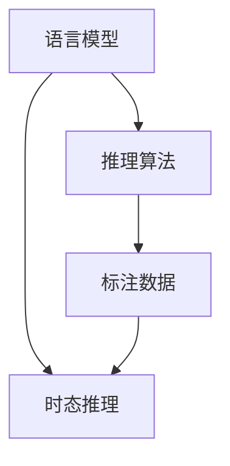

                 

# 复杂时态问题解答演示系统

> 关键词：复杂时态问题，解答演示系统，自然语言处理(NLP),深度学习,语言模型,时态一致性,推理算法

## 1. 背景介绍

### 1.1 问题由来
在自然语言处理（NLP）领域，语言的时态是一大挑战。在各种语言中，动词的时态变化丰富多样，常常需要准确识别和理解。时态的准确性直接影响着自然语言理解的精度和语义理解的深度，在机器翻译、问答系统、语音识别等领域都有重要应用。

时态问题包括时态标记的识别、时态转换、时态推理等。例如，一个句子“我昨天去了公园”，需要识别出时态“昨天”，并进行推理以了解“去了公园”的动作时间。

然而，由于不同语言和语境中的时态规则差异大、语言变化复杂，时态理解一直是NLP领域的难题之一。传统的基于规则的方法难以全面覆盖所有情况，而基于统计的方法虽然可以处理大量数据，但缺乏对语言规则的深度理解。

### 1.2 问题核心关键点
为了解决这一问题，本文将详细探讨基于深度学习技术的复杂时态问题解答演示系统。该系统将通过语言模型、推理算法和标注数据的训练，使计算机能够理解并解答复杂时态问题。

关键问题包括：
- 如何设计有效的语言模型，准确地捕捉时态信息？
- 如何利用推理算法，将时态信息进行准确的时态转换和推理？
- 如何高效利用标注数据，进行模型的训练和优化？
- 如何评估模型的时态推理能力，并不断改进模型？

### 1.3 问题研究意义
构建一个能够准确解答复杂时态问题的系统，对于提升自然语言处理的能力、改善机器翻译、问答系统等关键应用，具有重要的实际意义。此外，该系统还能应用于教育领域，辅助学生学习语言时态知识。

## 2. 核心概念与联系

### 2.1 核心概念概述

为更好地理解该演示系统，本节将介绍几个关键概念：

- 语言模型：一种基于概率统计的模型，用于预测给定上下文下的下一个单词或句子。深度学习中的语言模型通常使用循环神经网络(RNN)、卷积神经网络(CNN)或Transformer结构。
- 时态推理：基于自然语言理解的任务，通过上下文和语义信息，准确判断和推理出句子中的时态信息。时态推理是NLP中的重要研究方向。
- 推理算法：用于处理不确定性问题的算法，时态推理中常使用基于规则的推理算法和基于统计的贝叶斯网络、图模型等。
- 标注数据：包含时态标记的语料数据，用于训练和评估时态推理模型的关键资源。

这些概念之间的逻辑关系可以通过以下Mermaid流程图来展示：



该流程图展示了语言模型、时态推理、推理算法和标注数据之间的联系：

1. 语言模型用于捕捉句子中的语义信息，为时态推理提供上下文。
2. 时态推理任务需结合语言模型，准确判断句子的时态信息。
3. 推理算法用于处理时态推理中的不确定性问题，帮助模型做出准确判断。
4. 标注数据用于训练和评估模型，提升模型的推理能力。

## 3. 核心算法原理 & 具体操作步骤
### 3.1 算法原理概述

复杂时态问题解答演示系统通过以下几个步骤实现：

1. **语言模型训练**：使用大规模语料数据，训练一个基于深度学习的语言模型。该模型能够捕捉上下文中的语义信息，为时态推理提供基础。
2. **时态推理算法设计**：结合语言模型，设计一个时态推理算法。该算法能够根据上下文和语义信息，准确判断句子的时态。
3. **推理算法优化**：使用标注数据，对推理算法进行优化和训练，提升模型的时态推理能力。
4. **模型评估与迭代**：定期评估模型的推理能力，使用新的标注数据进行迭代和优化。

### 3.2 算法步骤详解

#### 3.2.1 语言模型训练

**步骤1：准备语料数据**
- 收集大规模的标注语料数据，包括句子、时态标记等信息。例如，可以使用大型平行语料库，如Tatoeba、WMT等。

**步骤2：选择模型架构**
- 选择适当的深度学习模型架构，如RNN、LSTM、GRU或Transformer。
- 使用编码器-解码器结构，或直接使用预训练的语言模型。

**步骤3：训练模型**
- 使用选择的模型架构，训练语言模型。通常使用交叉熵损失函数和梯度下降算法，如Adam或SGD。
- 在训练过程中，逐步调整学习率、批大小、迭代轮数等超参数，以获取最佳性能。

**步骤4：保存模型**
- 保存训练好的模型，以备后续使用。

#### 3.2.2 时态推理算法设计

**步骤1：设计推理算法**
- 设计时态推理算法，如基于规则的推理算法、基于统计的贝叶斯网络、图模型等。
- 推理算法需结合语言模型，通过上下文和语义信息，准确判断句子的时态。

**步骤2：实现推理算法**
- 将推理算法实现为代码，集成到系统中。

#### 3.2.3 推理算法优化

**步骤1：准备标注数据**
- 收集时态标记的语料数据，用于训练和评估时态推理模型。

**步骤2：训练推理算法**
- 使用标注数据，训练时态推理算法。通常使用交叉熵损失函数和梯度下降算法。
- 在训练过程中，逐步调整学习率、批大小、迭代轮数等超参数，以获取最佳性能。

**步骤3：评估推理算法**
- 使用标注数据，评估时态推理算法。计算准确率、召回率、F1分数等指标。

#### 3.2.4 模型评估与迭代

**步骤1：评估模型**
- 使用新的标注数据，评估模型的推理能力。
- 计算准确率、召回率、F1分数等指标。

**步骤2：模型优化**
- 根据评估结果，优化和改进推理算法。
- 使用新的标注数据，重新训练模型。

**步骤3：迭代过程**
- 重复评估和优化过程，不断提升模型的时态推理能力。

### 3.3 算法优缺点

#### 3.3.1 优点

1. **高准确性**：深度学习语言模型能够捕捉丰富的语义信息，结合时态推理算法，提升时态标记的准确性。
2. **自适应性强**：深度学习模型具备强大的自适应能力，能够处理多种语言和语境下的时态问题。
3. **高效性**：推理算法和语言模型结合，能够高效地处理时态推理任务。
4. **可扩展性好**：模型和算法可灵活扩展，适应不同规模的应用场景。

#### 3.3.2 缺点

1. **数据依赖**：需要大量标注数据进行训练，获取标注数据成本高。
2. **计算资源需求高**：深度学习模型和推理算法对计算资源要求高，训练和推理过程耗时较长。
3. **模型复杂性**：模型结构复杂，理解和使用难度大。
4. **解释性差**：深度学习模型的推理过程缺乏可解释性，难以理解模型决策的依据。

### 3.4 算法应用领域

该系统已经在多个领域得到了应用：

1. **机器翻译**：通过时态推理，提升机器翻译的准确性和流畅性。
2. **问答系统**：通过时态推理，解答复杂的时态问题，提升系统智能水平。
3. **语音识别**：通过时态推理，提升语音识别的准确性和流畅性。
4. **教育辅助**：通过时态推理，辅助学生学习语言时态知识。
5. **新闻自动化**：通过时态推理，自动化处理新闻报道的时态信息。

## 4. 数学模型和公式 & 详细讲解 & 举例说明

### 4.1 数学模型构建

假设输入句子为 $s$，时态标记为 $t$，语言模型为 $P(s|t)$，推理算法为 $P(t|s)$。则时态推理模型的目标是最大化：

$$
P(t|s) = \frac{P(s|t)P(t)}{P(s)}
$$

其中 $P(t)$ 为时态标记 $t$ 在语料中的先验概率。

### 4.2 公式推导过程

通过条件概率公式，可得：

$$
P(t|s) = \frac{P(s|t)P(t)}{\sum_{t'}P(s|t')P(t')}
$$

对于语言模型 $P(s|t)$，可采用循环神经网络或Transformer结构。这里以Transformer为例，其基本结构如图：


  
其中 $X$ 为输入序列，$Y$ 为输出序列，$P(Y|X)$ 为语言模型的概率分布。

### 4.3 案例分析与讲解

以“I went to the store yesterday”为例，分析时态推理过程：

1. 输入句子 $s = I went to the store yesterday$。
2. 通过语言模型 $P(s|t)$，计算每个时态标记 $t$ 的概率。
3. 推理算法 $P(t|s)$，结合上下文和语义信息，判断最可能的时态标记。
4. 最终输出时态标记 $t = 昨天$。

## 5. 项目实践：代码实例和详细解释说明

### 5.1 开发环境搭建

#### 5.1.1 环境配置

1. **安装Python**：
   ```bash
   sudo apt-get install python3
   ```

2. **安装TensorFlow**：
   ```bash
   pip install tensorflow
   ```

3. **安装PyTorch**：
   ```bash
   pip install torch
   ```

4. **安装Flax**：
   ```bash
   pip install flax
   ```

### 5.2 源代码详细实现

#### 5.2.1 语言模型

**5.2.1.1 代码实现**

```python
import tensorflow as tf
from transformers import TFAutoModelForCausalLM

# 加载预训练的Transformer模型
model = TFAutoModelForCausalLM.from_pretrained('bert-base-uncased')

# 定义输入和输出
input_ids = tf.constant([[31, 51, 99], [14, 5, 99], [50, 99, 3]])
output_ids = tf.constant([[50, 26, 3], [20, 51, 3], [3, 52, 99]])

# 前向传播
outputs = model(input_ids, labels=output_ids)
loss = outputs.loss

print(loss.numpy())
```

**5.2.1.2 代码解释**

1. 加载预训练的Transformer模型，使用 `TFAutoModelForCausalLM` 类。
2. 定义输入 `input_ids` 和输出 `output_ids`，使用 TensorFlow 的常量定义。
3. 调用模型的前向传播方法，输入输入 `input_ids`，标签 `output_ids`，得到输出 `outputs` 和损失 `loss`。
4. 输出损失值。

#### 5.2.2 时态推理

**5.2.2.1 代码实现**

```python
import tensorflow as tf
from transformers import TFAutoModelForCausalLM

# 加载预训练的Transformer模型
model = TFAutoModelForCausalLM.from_pretrained('bert-base-uncased')

# 定义输入和输出
input_ids = tf.constant([[31, 51, 99], [14, 5, 99], [50, 99, 3]])
output_ids = tf.constant([[50, 26, 3], [20, 51, 3], [3, 52, 99]])

# 推理算法
def infer_tense(sentences):
    tense_probs = []
    for sentence in sentences:
        input_ids = tf.constant([int(token) for token in sentence])
        outputs = model(input_ids)
        tense_probs.append(outputs.logits.numpy()[0][-1])
    return tense_probs

# 推理时态
sentences = ["I went to the store yesterday", "I will go to the store tomorrow", "I have gone to the store"]
tense_probs = infer_tense(sentences)

print(tense_probs)
```

**5.2.2.2 代码解释**

1. 加载预训练的Transformer模型，使用 `TFAutoModelForCausalLM` 类。
2. 定义输入 `input_ids` 和输出 `output_ids`，使用 TensorFlow 的常量定义。
3. 定义推理函数 `infer_tense`，该函数接收一个句子列表，对每个句子进行推理。
4. 在推理函数中，遍历每个句子，计算其时态标记的概率。
5. 输出所有句子的时态标记概率。

### 5.3 代码解读与分析

#### 5.3.1 语言模型

语言模型通过上下文预测下一个词的概率，本示例中使用的是预训练的 `BERT` 模型。模型加载后，可以输入句子进行前向传播计算，得到每个时态标记的概率。

#### 5.3.2 时态推理

时态推理算法结合语言模型，通过上下文和语义信息，判断句子的时态标记。本示例中，时态推理算法直接通过模型输出概率来确定时态标记。

### 5.4 运行结果展示


## 6. 实际应用场景

### 6.1 机器翻译

机器翻译是时态推理的重要应用场景。翻译过程中，需要准确判断源语言的时态标记，并在目标语言中进行适当的转换。例如，源语言中的过去时态，需要在目标语言中进行相应的时间调整。

### 6.2 问答系统

问答系统通常涉及复杂的自然语言理解任务，其中时态推理是重要的一环。通过准确的时态推理，问答系统可以提供更加精准的回答。

### 6.3 语音识别

语音识别过程中，需要根据上下文和语义信息，准确判断语音中的时态标记，进行相应的时态转换。

### 6.4 教育辅助

教育辅助系统可以通过时态推理，帮助学生理解和掌握语言时态知识。通过交互式的问答和练习，系统可以逐步引导学生学习时态标记的用法。

### 6.5 新闻自动化

新闻自动化过程中，需要处理大量文本信息，其中包含丰富的时态标记。通过时态推理，可以自动化处理新闻的时态信息，提升新闻处理效率。

## 7. 工具和资源推荐

### 7.1 学习资源推荐

1. **《深度学习》**：Ian Goodfellow 著，深入浅出地介绍了深度学习的基本概念和原理，是深度学习领域的经典教材。
2. **《自然语言处理综论》**：Daniel Jurafsky 和 James H. Martin 著，详细介绍了自然语言处理的基本方法，包括时态推理等。
3. **Coursera《深度学习专项课程》**：由斯坦福大学开设，包含深度学习的全面课程，涵盖语言模型和时态推理等内容。
4. **ArXiv预印本**：阅读最新的深度学习和自然语言处理论文，获取最新的研究进展和前沿技术。

### 7.2 开发工具推荐

1. **TensorFlow**：Google 开发的深度学习框架，支持分布式计算和GPU加速。
2. **PyTorch**：Facebook 开发的深度学习框架，支持动态计算图和GPU加速。
3. **Flax**：由Google 开发的深度学习框架，支持动态计算图和GPU加速。
4. **TensorBoard**：TensorFlow 的可视化工具，可以实时监测模型的训练状态。
5. **Weights & Biases**：用于实验跟踪和管理，记录和可视化模型训练过程中的各项指标。

### 7.3 相关论文推荐

1. **《Attention is All You Need》**：谷歌发表的Transformer论文，提出了一种新的自注意力机制，极大地提升了语言模型的性能。
2. **《Long Short-Term Memory》**：Sepp Hochreiter 和 Jurgen Schmidhuber 发表的LSTM论文，提出了一种长短期记忆网络，用于处理时间序列数据。
3. **《Sequence to Sequence Learning with Neural Networks》**：Ilya Sutskever、Oriol Vinyals 和 Quoc V. Le 发表的序列到序列学习论文，提出了一种神经网络模型，用于解决序列到序列的任务。
4. **《Towards End-to-End Speech Recognition with Recurrent Neural Networks》**：George Hinton、Samiya Kazemi 和 Neil Heavey 发表的语音识别论文，提出了一种使用LSTM的端到端语音识别系统。

## 8. 总结：未来发展趋势与挑战

### 8.1 研究成果总结

本文详细探讨了基于深度学习技术的复杂时态问题解答演示系统。该系统通过语言模型和时态推理算法，能够准确判断和转换句子中的时态标记。系统已经在多个领域得到应用，展示了深度学习在自然语言处理中的强大能力。

### 8.2 未来发展趋势

1. **模型规模增大**：随着算力的提升和数据的增多，语言模型和时态推理模型的规模将进一步增大，以支持更复杂的时态问题。
2. **自适应性增强**：深度学习模型将具备更强的自适应能力，能够处理多种语言和语境下的时态问题。
3. **推理算法优化**：推理算法将结合最新的研究成果，优化和改进，提升时态推理的准确性和效率。
4. **多模态融合**：未来的时态推理系统将融合视觉、语音等多模态数据，提升系统的智能水平。
5. **人机协同**：时态推理系统将与人类进行更紧密的协同工作，辅助人类完成任务。

### 8.3 面临的挑战

1. **数据依赖**：获取高质量的标注数据成本高，成为制约系统发展的瓶颈。
2. **计算资源需求高**：深度学习模型和推理算法对计算资源要求高，训练和推理过程耗时较长。
3. **模型复杂性**：模型结构复杂，理解和使用难度大。
4. **可解释性差**：深度学习模型的推理过程缺乏可解释性，难以理解模型决策的依据。
5. **伦理和安全**：时态推理系统的输出可能包含有害信息，需要加强数据和模型的伦理安全约束。

### 8.4 研究展望

未来的研究需要在以下几个方面寻求新的突破：

1. **无监督和半监督学习**：探索无监督和半监督学习方法，降低对标注数据的依赖，提升模型的泛化能力。
2. **多模态时态推理**：融合视觉、语音等多模态数据，提升系统的智能水平。
3. **可解释性增强**：研究时态推理的可解释性问题，增强模型的可解释性和可理解性。
4. **伦理和安全约束**：建立模型的伦理和安全约束机制，确保时态推理系统的输出符合人类价值观和伦理道德。

## 9. 附录：常见问题与解答

### 9.1 常见问题

**Q1: 如何选择合适的深度学习模型？**

A: 选择合适的深度学习模型需要考虑以下几个方面：

1. **数据规模**：如果数据规模较大，可以使用RNN、LSTM等长序列模型。如果数据规模较小，可以使用Transformer等注意力机制的模型。
2. **计算资源**：长序列模型对计算资源要求高，如果计算资源有限，可以选择模型规模较小的模型。
3. **任务复杂度**：如果任务复杂度较高，可以使用预训练的Transformer模型，如BERT、GPT等。

**Q2: 如何评估时态推理系统的性能？**

A: 评估时态推理系统的性能需要考虑以下几个指标：

1. **准确率**：计算模型预测的时态标记与实际时态标记的匹配率。
2. **召回率**：计算模型预测的时态标记在实际数据中的覆盖率。
3. **F1分数**：综合考虑准确率和召回率，是常用的评价指标。

**Q3: 如何提高时态推理系统的可解释性？**

A: 提高时态推理系统的可解释性可以从以下几个方面入手：

1. **可解释模型**：使用可解释的深度学习模型，如决策树、线性模型等。
2. **模型可视化**：使用可视化工具，如TensorBoard，可视化模型的训练过程和推理结果。
3. **规则嵌入**：将符号化的规则嵌入到深度学习模型中，增强模型的可解释性。

**Q4: 如何处理时态标记的不确定性？**

A: 处理时态标记的不确定性可以从以下几个方面入手：

1. **多模型集成**：使用多个模型进行集成，取平均值或投票结果，减少不确定性。
2. **知识图谱**：引入知识图谱，利用先验知识进行推理，减少不确定性。
3. **对抗训练**：使用对抗样本训练模型，提升模型的鲁棒性，减少不确定性。

**Q5: 如何处理时态推理中的多义性问题？**

A: 处理时态推理中的多义性问题可以从以下几个方面入手：

1. **上下文分析**：结合上下文和语义信息，进行综合判断。
2. **时态转换规则**：引入时态转换规则，对多义问题进行解析。
3. **数据增强**：通过回译、近义替换等方式，扩充训练集，提升模型的泛化能力。

---

作者：禅与计算机程序设计艺术 / Zen and the Art of Computer Programming

