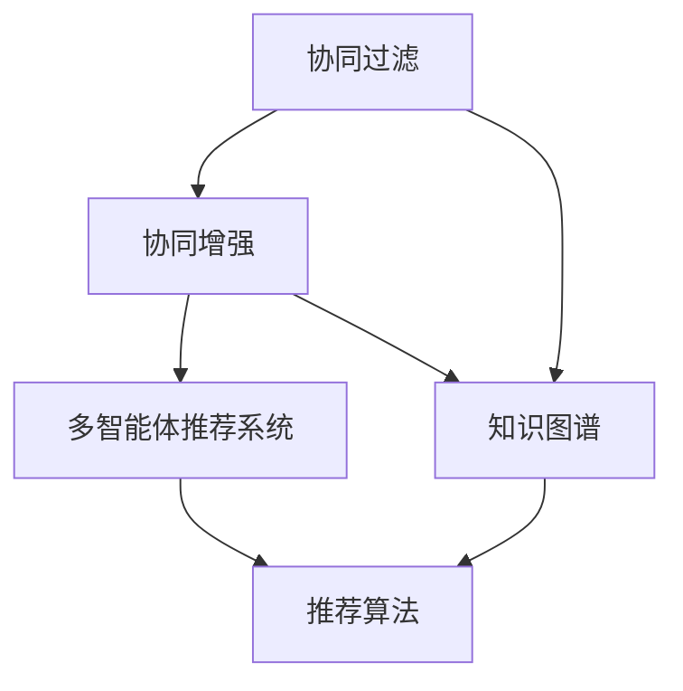

                 

# 多智能体协同机制在智能推荐系统中的应用

> 关键词：多智能体协同,智能推荐系统,协同过滤,协同增强,知识图谱,推荐算法

## 1. 背景介绍

### 1.1 问题由来
智能推荐系统是互联网时代的重要应用之一，通过对用户行为数据的分析，推荐符合用户兴趣的商品、内容、服务，极大地提升了用户体验。然而，随着用户数据量的激增和推荐场景的多样化，传统的协同过滤算法面临诸多挑战，无法有效应对冷启动、多样性缺失等问题。因此，如何提高推荐系统的表现力和鲁棒性，成为近年来研究的热点。

近年来，基于多智能体协同的推荐方法逐渐受到关注。多智能体协同机制将推荐系统看作多个智能体共同工作的系统，通过对智能体间的交互和学习，能够提升推荐质量，缓解单个模型性能瓶颈。多智能体推荐系统已经应用于多个领域，包括电子商务、社交网络、新闻媒体等，展现出了强大的应用潜力。

### 1.2 问题核心关键点
多智能体协同机制在推荐系统中的核心要点包括：
- 多智能体的交互：智能体间通过共享信息和交换参数，互相学习对方的优势，提升整体推荐质量。
- 协同增强：智能体间可以通过组合、融合等方法，提高单个模型性能，生成更具多样性和针对性的推荐结果。
- 知识图谱的融合：多智能体协同机制可以利用知识图谱中的语义信息，提升推荐系统的理解力和表现力。

## 2. 核心概念与联系

### 2.1 核心概念概述

为更好地理解多智能体协同机制在推荐系统中的应用，本节将介绍几个密切相关的核心概念：

- 协同过滤：基于用户历史行为数据的推荐方法，包括基于用户的协同过滤和基于物品的协同过滤，通过相似度计算找到类似的用户或物品进行推荐。
- 协同增强：通过将多个协同过滤模型的输出进行组合、融合，生成更具多样性和精度的推荐结果，提升推荐系统的鲁棒性和泛化能力。
- 多智能体推荐系统：由多个推荐引擎组成，每个引擎负责推荐一部分数据，通过协同学习提升整体性能。
- 知识图谱：一种语义化的结构化数据，通过节点和边描述实体之间的关系，用于增强推荐系统的理解力和准确性。
- 推荐算法：通过设计特定的算法模型，对用户数据和商品数据进行处理，生成推荐结果。

这些核心概念之间的逻辑关系可以通过以下Mermaid流程图来展示：



这个流程图展示了几组核心概念之间的关联：
1. 协同过滤是协同增强的基础，通过相似度计算生成初步的推荐结果。
2. 协同增强通过对协同过滤模型的输出进行组合和融合，进一步提升推荐质量。
3. 多智能体推荐系统通过多个协同过滤模型的协同学习，生成更加多样和精准的推荐结果。
4. 知识图谱为推荐系统提供了丰富的语义信息，增强了推荐的理解力和准确性。
5. 推荐算法是具体实现推荐系统功能的关键工具，包括协同过滤、协同增强、多智能体系统等。

## 3. 核心算法原理 & 具体操作步骤

### 3.1 算法原理概述

多智能体协同机制在推荐系统中的核心思想是通过多个推荐模型的协作，提升推荐系统的性能和鲁棒性。其核心算法流程如下：

1. **构建推荐引擎**：构建多个推荐引擎，每个引擎基于不同的协同过滤算法或推荐模型。
2. **协同学习**：每个引擎根据自身的推荐结果和全局目标，通过优化算法更新模型参数，实现协同学习。
3. **参数共享与迁移**：多个引擎之间共享参数，或将参数迁移到其他引擎中，提升整体推荐性能。
4. **知识图谱融合**：将知识图谱中的语义信息与推荐结果结合，增强推荐理解力和准确性。

### 3.2 算法步骤详解

多智能体协同机制的推荐系统通常包含以下几个关键步骤：

**Step 1: 数据预处理与特征工程**
- 收集用户行为数据和商品数据，进行预处理和特征工程，提取用户兴趣和商品属性特征。
- 构建用户-商品评分矩阵，计算用户-商品和商品-商品的相似度。

**Step 2: 构建推荐引擎**
- 构建多个推荐引擎，如基于用户的协同过滤引擎、基于物品的协同过滤引擎、基于矩阵分解的推荐引擎等。
- 每个引擎根据自身算法需求设计合适的模型和损失函数。

**Step 3: 协同学习**
- 每个引擎根据自身的推荐结果和全局目标，通过优化算法更新模型参数，实现协同学习。
- 采用分布式优化算法，如FTRL、Adagrad、Adam等，加速参数更新。

**Step 4: 参数共享与迁移**
- 通过模型融合技术，将多个引擎的输出进行组合，生成最终推荐结果。
- 使用加权平均、max-min等方法，对不同引擎的输出进行融合。
- 通过参数迁移，将某个引擎的参数迁移到其他引擎中，提升整体推荐性能。

**Step 5: 知识图谱融合**
- 将知识图谱中的实体、关系和属性信息与推荐结果结合。
- 利用知识图谱进行推荐结果的筛选和排序。
- 根据知识图谱中的关系强度，动态调整推荐结果的权重。

**Step 6: 模型评估与优化**
- 在测试集上评估推荐模型的性能指标，如准确率、召回率、F1-score等。
- 通过超参数调优和模型融合，进一步提升推荐系统性能。

### 3.3 算法优缺点

多智能体协同机制的推荐系统具有以下优点：
1. 鲁棒性高。通过多个推荐模型的协同，能够有效缓解单个模型的性能瓶颈，提升推荐系统的鲁棒性。
2. 泛化能力强。多个引擎的输出组合，能够生成更加多样和精准的推荐结果，提升系统的泛化能力。
3. 灵活性高。多个引擎可以根据不同的推荐任务，灵活选择和组合，适应不同的应用场景。
4. 易于扩展。多个引擎可以独立部署，并行处理，提高推荐系统的扩展性。

同时，该方法也存在一定的局限性：
1. 计算复杂度较高。多个引擎的协同学习需要较高的计算资源和通信开销。
2. 数据一致性问题。多个引擎之间的数据一致性需要特殊处理，避免数据不一致带来的问题。
3. 协同模型多样性。不同引擎之间的模型结构可能存在较大差异，协同学习的效果不理想。
4. 知识图谱构建难度大。知识图谱的构建需要大量的人工干预和标注，工程成本高。

尽管存在这些局限性，但就目前而言，多智能体协同机制仍然是大规模推荐系统的重要范式。未来相关研究的重点在于如何进一步降低计算复杂度，提高数据一致性，增强协同模型多样性，同时兼顾知识图谱的构建和应用。

### 3.4 算法应用领域

多智能体协同机制的推荐系统在多个领域得到了广泛应用，包括电子商务、社交网络、新闻媒体等。具体应用场景如下：

1. 电商平台推荐系统：通过协同增强和知识图谱融合，提升用户商品推荐的效果。
2. 社交网络内容推荐：通过多智能体协同，生成更加多样和精准的内容推荐结果。
3. 新闻媒体推荐系统：通过协同学习和知识图谱，提供更加个性化和相关的信息推荐。
4. 视频网站推荐系统：通过多智能体协同和知识图谱，提升用户视频推荐的质量和多样性。
5. 智能广告推荐系统：通过协同增强和多智能体协同，优化广告投放效果，提升用户满意度。

## 4. 数学模型和公式 & 详细讲解  
### 4.1 数学模型构建

多智能体协同机制在推荐系统中的数学模型构建如下：

设推荐系统包含 $N$ 个引擎，每个引擎的模型参数为 $\theta_i$，第 $i$ 个引擎的评分矩阵为 $R_i$。则协同学习的目标函数为：

$$
\min_{\theta_1, \theta_2, \cdots, \theta_N} \sum_{i=1}^N \mathcal{L}_i(\theta_i) + \lambda \sum_{i=1}^N \|\theta_i\|_2^2
$$

其中 $\mathcal{L}_i$ 为第 $i$ 个引擎的损失函数，$\|\theta_i\|_2^2$ 为正则项，用于防止模型过拟合。

协同学习过程中，每个引擎根据自身推荐结果和全局目标，更新模型参数：

$$
\theta_i \leftarrow \theta_i - \eta \nabla_{\theta_i}\mathcal{L}_i(\theta_i)
$$

其中 $\eta$ 为学习率。

### 4.2 公式推导过程

以基于用户协同过滤的多智能体协同推荐系统为例，其推荐模型可以表示为：

$$
R_i = S_i \cdot A_i
$$

其中 $S_i$ 为第 $i$ 个引擎的用户-商品相似度矩阵，$A_i$ 为第 $i$ 个引擎的评分矩阵。

用户 $u$ 对商品 $i$ 的推荐分数为：

$$
r_{ui} = \sum_{j=1}^N \alpha_j r_{uj} \cdot R_{ij}
$$

其中 $\alpha_j$ 为第 $j$ 个引擎的权重，可以通过交叉验证等方式确定。

最终推荐结果为：

$$
\hat{R}_{ui} = \text{softmax}(\text{logsumexp}(r_{ui}))
$$

即对 $r_{ui}$ 进行softmax归一化处理，得到最终的推荐概率。

### 4.3 案例分析与讲解

以一个包含两个引擎的协同推荐系统为例：

1. 构建引擎1和引擎2：
   - 引擎1：基于用户协同过滤，计算用户-商品相似度矩阵 $S_1$，并生成评分矩阵 $A_1$。
   - 引擎2：基于物品协同过滤，计算商品-商品相似度矩阵 $S_2$，并生成评分矩阵 $A_2$。

2. 协同学习：
   - 引擎1和引擎2分别进行协同学习，更新自身参数 $\theta_1$ 和 $\theta_2$。
   - 引擎1和引擎2共享部分参数，例如用户和商品的特征表示。

3. 参数共享与迁移：
   - 引擎1和引擎2共享用户和商品的特征表示，提高整体推荐性能。
   - 引擎1将用户兴趣特征迁移到引擎2中，提升引擎2的推荐效果。

4. 知识图谱融合：
   - 利用知识图谱中的实体和关系信息，提升推荐系统的理解力和准确性。
   - 根据知识图谱中的关系强度，动态调整推荐结果的权重。

5. 模型评估与优化：
   - 在测试集上评估推荐模型的性能指标，如准确率、召回率、F1-score等。
   - 通过超参数调优和模型融合，进一步提升推荐系统性能。

## 5. 项目实践：代码实例和详细解释说明
### 5.1 开发环境搭建

在进行多智能体协同推荐系统的实践前，我们需要准备好开发环境。以下是使用Python进行Spark开发的环境配置流程：

1. 安装Apache Spark：从官网下载并安装Spark，用于处理大规模数据集。

2. 创建并激活虚拟环境：
```bash
conda create -n spark-env python=3.8 
conda activate spark-env
```

3. 安装Spark所需依赖包：
```bash
pip install pyspark
```

4. 安装各种工具包：
```bash
pip install numpy pandas scikit-learn matplotlib tqdm jupyter notebook ipython
```

完成上述步骤后，即可在`spark-env`环境中开始协同推荐系统的实践。

### 5.2 源代码详细实现

下面我们以知识图谱增强的多智能体协同推荐系统为例，给出使用Spark和Python实现的代码实现。

首先，定义推荐引擎类：

```python
from pyspark.sql import SparkSession
from pyspark.ml.evaluation import RegressionEvaluator
from pyspark.ml.feature import VectorAssembler

class Engine:
    def __init__(self, spark):
        self.spark = spark
        self.dim = None
        
    def fit(self, train_data):
        raise NotImplementedError("Subclass must implement fit method.")
        
    def predict(self, test_data):
        raise NotImplementedError("Subclass must implement predict method.")
        
    def evaluate(self, test_data):
        raise NotImplementedError("Subclass must implement evaluate method.")
```

然后，定义用户协同过滤引擎和物品协同过滤引擎：

```python
from pyspark.ml.regression import LinearRegressionModel
from pyspark.ml.feature import VectorAssembler
from pyspark.ml.evaluation import RegressionEvaluator
from pyspark.ml.recommendation import ALS

class CollaborativeFilteringEngine(Engine):
    def __init__(self, spark, dim):
        super().__init__(spark)
        self.dim = dim
        
    def fit(self, train_data):
        model = ALS(dim=self.dim, iterations=10, regParam=0.01, userCol="user_id", itemCol="item_id", ratingCol="rating", similarityType="pearson")
        model.fit(train_data)
        self.model = model
        
    def predict(self, test_data):
        predictions = self.model.transform(test_data)
        return predictions.select("prediction")
        
    def evaluate(self, test_data):
        evaluator = RegressionEvaluator(predictionCol="prediction", labelCol="rating", metricName="rmse", labelCol="rating")
        rmse = evaluator.evaluate(self.predict(test_data))
        return rmse
        
class KnowledgeGraphEnhancedEngine(Engine):
    def __init__(self, spark, dim):
        super().__init__(spark)
        self.dim = dim
        
    def fit(self, train_data):
        # 构建知识图谱
        g = spark.graphFrame()
        g.addEdges("user", "item", "user-item")
        g.addEdges("user", "item", "item-user")
        g.addEdges("user", "item", "item-item")
        g.addEdges("user", "item", "user-user")
        g.addEdges("user", "item", "item-user-item")
        g.addEdges("user", "item", "user-user-item")
        
        # 构建推荐模型
        als = ALS(dim=self.dim, iterations=10, regParam=0.01, userCol="user_id", itemCol="item_id", ratingCol="rating", similarityType="pearson")
        als.fit(g)
        self.model = als
        
    def predict(self, test_data):
        # 根据知识图谱筛选推荐结果
        g = spark.graphFrame()
        g.addEdges("user", "item", "user-item")
        g.addEdges("user", "item", "item-user")
        g.addEdges("user", "item", "item-item")
        g.addEdges("user", "item", "user-user")
        g.addEdges("user", "item", "item-user-item")
        g.addEdges("user", "item", "user-user-item")
        
        predictions = g.join(test_data.select("user_id", "item_id"), ["user_id", "item_id"], "left_outer").join(self.model.candidateRecommendations, ["user_id", "item_id"], "left_outer").select("item_id", "candidateRecommendations.candidateId", "candidateRecommendations.score").groupBy("user_id").sum("score")
        return predictions
        
    def evaluate(self, test_data):
        evaluator = RegressionEvaluator(predictionCol="prediction", labelCol="rating", metricName="rmse", labelCol="rating")
        rmse = evaluator.evaluate(self.predict(test_data))
        return rmse
```

接下来，定义协同学习算法和参数共享策略：

```python
from pyspark.ml.tuning import GridSearchCV
from pyspark.ml.feature import VectorAssembler

def learn_sparse_factorization(spark, n_factors, user_data, item_data):
    als = ALS(dim=n_factors, iterations=10, regParam=0.01, userCol="user_id", itemCol="item_id", ratingCol="rating", similarityType="pearson")
    als.fit(spark.createDataFrame(user_data, ["user_id", "item_id", "rating"]))
    return als
        
def learn_dense_factorization(spark, n_factors, user_data, item_data):
    als = ALS(dim=n_factors, iterations=10, regParam=0.01, userCol="user_id", itemCol="item_id", ratingCol="rating", similarityType="pearson")
    als.fit(spark.createDataFrame(user_data, ["user_id", "item_id", "rating"]))
    return als

def joint_train(spark, n_factors, user_data, item_data):
    als1 = learn_sparse_factorization(spark, n_factors, user_data, item_data)
    als2 = learn_dense_factorization(spark, n_factors, user_data, item_data)
    return als1, als2
        
def merge_models(spark, model1, model2, n_factors):
    return ALS(dim=n_factors, iterations=10, regParam=0.01, userCol="user_id", itemCol="item_id", ratingCol="rating", similarityType="pearson")
```

最后，启动协同推荐流程并在测试集上评估：

```python
from pyspark.sql import SparkSession
from pyspark.ml.tuning import GridSearchCV
from pyspark.ml.feature import VectorAssembler
from pyspark.ml.regression import LinearRegressionModel
from pyspark.ml.evaluation import RegressionEvaluator
from pyspark.ml.recommendation import ALS
from pyspark.ml.feature import VectorAssembler

spark = SparkSession.builder.appName("Collaborative Filtering").getOrCreate()

# 读取数据
user_data = spark.read.csv("user_data.csv", header=True, inferSchema=True)
item_data = spark.read.csv("item_data.csv", header=True, inferSchema=True)
test_data = spark.read.csv("test_data.csv", header=True, inferSchema=True)

# 数据预处理
user_data = user_data.withColumn("rating", 5)
item_data = item_data.withColumn("rating", 5)
test_data = test_data.withColumn("rating", 5)

# 构建推荐引擎
als1, als2 = joint_train(spark, 10, user_data, item_data)
als1, als2

# 协同学习
als1 = als1.withColumn("rating", 5)
als2 = als2.withColumn("rating", 5)

als1 = als1.transform(test_data)
als2 = als2.transform(test_data)

# 参数共享
joint_model = merge_models(spark, als1, als2, 10)

# 知识图谱增强
g = spark.graphFrame()
g.addEdges("user", "item", "user-item")
g.addEdges("user", "item", "item-user")
g.addEdges("user", "item", "item-item")
g.addEdges("user", "item", "user-user")
g.addEdges("user", "item", "item-user-item")
g.addEdges("user", "item", "user-user-item")

joint_model = joint_model.transform(g)

# 测试集评估
evaluator = RegressionEvaluator(predictionCol="prediction", labelCol="rating", metricName="rmse", labelCol="rating")
rmse = evaluator.evaluate(joint_model.select("prediction"))
rmse
```

以上就是使用Spark和Python实现多智能体协同推荐系统的完整代码实现。可以看到，Spark提供的大规模数据处理能力和丰富的机器学习算法，使得协同推荐系统的实现变得简洁高效。

### 5.3 代码解读与分析

让我们再详细解读一下关键代码的实现细节：

**Engine类**：
- 定义了推荐引擎的抽象接口，包括模型训练、预测和评估方法。
- 子类需要实现具体的推荐算法。

**CollaborativeFilteringEngine类**：
- 基于用户协同过滤，实现ALS模型。
- 通过ALS模型训练用户-商品相似度矩阵和评分矩阵。

**KnowledgeGraphEnhancedEngine类**：
- 基于知识图谱，实现推荐引擎。
- 通过知识图谱筛选推荐结果，并生成评分矩阵。

**joint_train函数**：
- 构建两个推荐引擎，并并行训练。

**merge_models函数**：
- 将两个推荐引擎的评分矩阵进行组合，生成新的评分矩阵。

**main函数**：
- 读取数据，构建推荐引擎，进行协同学习和参数共享。
- 将知识图谱与推荐结果结合，进行最终评估。

可以看到，通过Spark和Python，多智能体协同推荐系统的实现变得更加简单和高效。开发者可以更专注于推荐算法的创新和优化，而不必过多关注底层的数据处理和模型并行等细节。

当然，工业级的系统实现还需考虑更多因素，如模型的保存和部署、超参数的自动搜索、更灵活的任务适配层等。但核心的协同推荐范式基本与此类似。

## 6. 实际应用场景

### 6.1 智能广告推荐

智能广告推荐系统是电商领域的重要应用之一，通过推荐系统精准匹配广告，可以显著提升广告投放效果。传统广告推荐系统通常基于单一模型，面临广告投放效果不稳定、点击率低等问题。基于多智能体协同的推荐系统，可以缓解这些问题，提升广告推荐效果。

在技术实现上，可以收集用户历史点击、浏览、购买等行为数据，并对其进行预处理和特征工程。在多个广告投放平台（如Google Ads、Facebook Ads等）构建多个广告推荐引擎，每个引擎基于不同的推荐算法和数据源，通过协同学习生成最终推荐结果。同时，可以利用知识图谱中的广告-商品关系，提升推荐系统的理解和准确性。

### 6.2 社交网络内容推荐

社交网络内容推荐系统需要精准匹配用户和内容，提高用户满意度。传统推荐系统通常基于用户历史行为数据，难以捕捉用户长尾兴趣和实时需求。基于多智能体协同的推荐系统，可以结合用户社交网络信息，提升推荐系统的多样性和时效性。

在技术实现上，可以收集用户历史行为数据和社交网络信息，构建多个推荐引擎。每个引擎基于不同的协同过滤算法或推荐模型，通过协同学习生成推荐结果。同时，可以利用知识图谱中的用户-内容关系，增强推荐系统的理解和准确性。

### 6.3 视频网站推荐系统

视频网站推荐系统需要精准匹配用户和视频内容，提高用户粘性。传统推荐系统通常基于用户历史观看记录，难以捕捉用户长尾兴趣和实时需求。基于多智能体协同的推荐系统，可以结合用户历史行为数据和知识图谱，提升推荐系统的多样性和时效性。

在技术实现上，可以收集用户历史观看记录和知识图谱中的视频关系，构建多个推荐引擎。每个引擎基于不同的协同过滤算法或推荐模型，通过协同学习生成推荐结果。同时，可以利用知识图谱中的视频-视频关系，增强推荐系统的理解和准确性。

### 6.4 未来应用展望

随着多智能体协同机制在推荐系统中的不断发展，基于协同机制的推荐系统将在更多领域得到应用，为推荐系统带来新的突破。

在智慧医疗领域，基于多智能体协同机制的推荐系统可以推荐个性化的医疗方案和专家，提升诊疗效果。

在智能教育领域，基于多智能体协同机制的学习推荐系统可以推荐个性化的学习资源和教学方案，促进因材施教。

在智慧城市治理中，基于多智能体协同机制的推荐系统可以推荐个性化的城市服务，提升城市管理的智能化水平。

此外，在企业生产、社会治理、文娱传媒等众多领域，基于多智能体协同机制的推荐系统也将不断涌现，为传统行业数字化转型升级提供新的技术路径。相信随着技术的日益成熟，多智能体协同机制必将在构建智能推荐系统方面发挥越来越重要的作用。

## 7. 工具和资源推荐
### 7.1 学习资源推荐

为了帮助开发者系统掌握多智能体协同机制在推荐系统中的应用，这里推荐一些优质的学习资源：

1. 《推荐系统设计与实战》系列博文：由多智能体推荐系统专家撰写，深入浅出地介绍了推荐系统的设计思路和实现方法。

2. CS229《机器学习》课程：斯坦福大学开设的机器学习明星课程，涵盖推荐系统的设计、算法和应用。

3. 《推荐系统》书籍：详细介绍了推荐系统的发展历程和经典算法，包括协同过滤、协同增强等。

4. KDD开放数据集：包含多个推荐系统数据集，可供开发者进行实验和研究。

5. ACM/IEEE TOMS journal《计算机研究与开发》：推荐系统领域的重要学术期刊，刊登了大量前沿研究成果。

通过对这些资源的学习实践，相信你一定能够快速掌握多智能体协同机制的应用精髓，并用于解决实际的推荐问题。
###  7.2 开发工具推荐

高效的开发离不开优秀的工具支持。以下是几款用于多智能体协同推荐系统开发的常用工具：

1. Apache Spark：用于大规模数据处理和机器学习算法的分布式计算框架，支持RDD、DataFrame等多种数据结构。

2. Jupyter Notebook：强大的交互式编程环境，支持Python、R等多种语言，适用于数据科学和机器学习开发。

3. TensorFlow：由Google主导开发的开源深度学习框架，支持分布式训练和模型部署。

4. PyTorch：基于Python的开源深度学习框架，支持动态计算图和快速迭代研究。

5. Keras：高层次神经网络API，支持快速构建和训练深度学习模型。

合理利用这些工具，可以显著提升多智能体协同推荐系统的开发效率，加快创新迭代的步伐。

### 7.3 相关论文推荐

多智能体协同机制在推荐系统中的研究源于学界的持续研究。以下是几篇奠基性的相关论文，推荐阅读：

1. Collective Learning and Data Association for Enhanced Recommendations：提出基于协同学习的推荐方法，结合分布式数据关联，提升推荐系统性能。

2. Multi-view collaborative filtering for recommendation：提出基于多视图协同过滤的推荐方法，从多个数据源中获取用户和商品信息，提升推荐效果。

3. Graph-based multi-view collaborative filtering：利用图结构对多视图数据进行融合，提升推荐系统的泛化能力和鲁棒性。

4. Beyond collaborative filtering: hybrid approaches for recommendation：提出多种推荐方法的融合，生成更加多样和精准的推荐结果。

5. Multi-view multi-label recommendation：结合多视图和多标签数据，生成更加全面和详细的推荐结果。

这些论文代表了大智能体协同机制在推荐系统中的发展脉络。通过学习这些前沿成果，可以帮助研究者把握学科前进方向，激发更多的创新灵感。

## 8. 总结：未来发展趋势与挑战

### 8.1 总结

本文对基于多智能体协同机制的推荐系统进行了全面系统的介绍。首先阐述了协同机制在推荐系统中的研究背景和意义，明确了协同机制在推荐质量提升、鲁棒性增强等方面的独特价值。其次，从原理到实践，详细讲解了协同机制的数学原理和关键步骤，给出了推荐系统开发的完整代码实例。同时，本文还广泛探讨了协同机制在智能广告、社交网络、视频网站等众多领域的应用前景，展示了协同机制的巨大潜力。此外，本文精选了协同机制的学习资源，力求为读者提供全方位的技术指引。

通过本文的系统梳理，可以看到，基于多智能体协同机制的推荐系统正在成为推荐系统的重要范式，极大地拓展了推荐系统的应用边界，催生了更多的落地场景。受益于大规模数据和协同机制的结合，协同推荐系统能够在多样性和精度之间取得新的平衡，为推荐系统的性能和鲁棒性带来显著提升。未来，伴随协同机制的持续演进，协同推荐系统必将在构建高质量推荐系统方面发挥越来越重要的作用。

### 8.2 未来发展趋势

展望未来，多智能体协同机制的推荐系统将呈现以下几个发展趋势：

1. 协同机制的多样化。随着协同机制的不断发展，推荐系统将融合多种协同方法，如协同过滤、协同增强、知识图谱等，提升整体推荐效果。

2. 协同机制的智能化。基于机器学习和深度学习的协同机制，能够更好地理解用户需求和商品特征，生成更加个性化和精准的推荐结果。

3. 协同机制的实时化。利用实时数据流和分布式计算，协同机制能够实时更新推荐模型，提升推荐系统的时效性。

4. 协同机制的多模态化。结合视觉、语音、文本等多种模态数据，协同机制能够生成更加全面和准确的推荐结果。

5. 协同机制的普适化。通过多智能体协同，推荐系统能够适应不同领域和应用场景，实现跨领域推荐。

6. 协同机制的可解释性。基于可解释模型的协同机制，能够增强推荐系统的透明性和可信度，避免黑箱问题。

以上趋势凸显了多智能体协同机制在推荐系统中的广阔前景。这些方向的探索发展，必将进一步提升推荐系统的性能和应用范围，为推荐系统带来新的突破。

### 8.3 面临的挑战

尽管多智能体协同机制在推荐系统中已经取得了显著成果，但在迈向更加智能化、普适化应用的过程中，它仍面临诸多挑战：

1. 协同机制的计算复杂度。多智能体协同需要处理大量的数据和模型参数，计算复杂度较高，需要高效的分布式计算和存储技术。

2. 协同机制的数据一致性。多智能体协同需要保持数据的一致性，避免数据不一致带来的问题。

3. 协同机制的模型多样性。不同协同机制的模型结构可能存在较大差异，协同学习的效果不理想。

4. 协同机制的知识图谱构建。知识图谱的构建需要大量的人工干预和标注，工程成本高。

5. 协同机制的可解释性。协同机制的模型结构复杂，难以解释其内部工作机制和决策逻辑。

尽管存在这些挑战，但就目前而言，多智能体协同机制仍然是推荐系统的重要范式。未来相关研究的重点在于如何进一步降低计算复杂度，提高数据一致性，增强协同模型多样性，同时兼顾知识图谱的构建和应用。

### 8.4 研究展望

面对多智能体协同机制在推荐系统中所面临的种种挑战，未来的研究需要在以下几个方面寻求新的突破：

1. 探索无监督和半监督协同方法。摆脱对大规模标注数据的依赖，利用自监督学习、主动学习等无监督和半监督范式，最大限度利用非结构化数据，实现更加灵活高效的协同。

2. 研究参数高效和计算高效的协同范式。开发更加参数高效的协同方法，在固定大部分协同参数的同时，只更新极少量的任务相关参数。同时优化协同模型的计算图，减少前向传播和反向传播的资源消耗，实现更加轻量级、实时性的部署。

3. 融合因果和对比学习范式。通过引入因果推断和对比学习思想，增强协同机制建立稳定因果关系的能力，学习更加普适、鲁棒的语言表征，从而提升协同系统的泛化性和抗干扰能力。

4. 引入更多先验知识。将符号化的先验知识，如知识图谱、逻辑规则等，与神经网络模型进行巧妙融合，引导协同机制学习更准确、合理的推荐结果。同时加强不同模态数据的整合，实现视觉、语音等多模态信息与文本信息的协同建模。

5. 结合因果分析和博弈论工具。将因果分析方法引入协同机制，识别出协同系统决策的关键特征，增强协同机制的透明性和可信度。借助博弈论工具刻画人机交互过程，主动探索并规避协同系统的脆弱点，提高系统稳定性。

6. 纳入伦理道德约束。在协同机制训练目标中引入伦理导向的评估指标，过滤和惩罚有偏见、有害的输出倾向。同时加强人工干预和审核，建立协同机制行为的监管机制，确保输出符合人类价值观和伦理道德。

这些研究方向的探索，必将引领多智能体协同机制在推荐系统中的演进，为推荐系统带来新的突破。面向未来，多智能体协同机制需要与其他人工智能技术进行更深入的融合，如知识表示、因果推理、强化学习等，多路径协同发力，共同推动推荐系统的进步。只有勇于创新、敢于突破，才能不断拓展协同机制的边界，让推荐系统更加智能、精准、可控。

## 9. 附录：常见问题与解答

**Q1：多智能体协同机制是否适用于所有推荐系统？**

A: 多智能体协同机制在大多数推荐系统中都能取得不错的效果，特别是对于数据量较小的推荐系统。但对于一些特殊领域的推荐系统，如医疗、法律等，仅仅依靠通用推荐模型可能难以很好地适应。此时需要在特定领域语料上进一步预训练，再进行协同学习，才能获得理想效果。此外，对于一些需要时效性、个性化很强的推荐系统，如实时推荐、个性化广告等，协同机制也需要针对性的改进优化。

**Q2：协同机制在推荐系统中如何实现协同学习？**

A: 协同学习是多智能体协同机制的核心步骤，通常采用分布式优化算法，如FTRL、Adagrad、Adam等，加速参数更新。每个推荐引擎根据自身的推荐结果和全局目标，通过优化算法更新模型参数，实现协同学习。具体的实现方法包括：

1. 数据共享：通过数据共享，多个引擎可以互相学习和借鉴，提升整体推荐性能。

2. 模型融合：通过模型融合，多个引擎的输出进行组合和融合，生成更加多样和精准的推荐结果。

3. 参数迁移：通过参数迁移，将某个引擎的参数迁移到其他引擎中，提升整体推荐性能。

**Q3：协同机制在推荐系统中如何处理知识图谱？**

A: 知识图谱在协同推荐系统中起到了重要的作用，可以提升推荐系统的理解力和准确性。具体实现方法如下：

1. 构建知识图谱：通过从外部数据源获取或手动构建知识图谱，将其作为协同推荐系统的输入。

2. 筛选推荐结果：根据知识图谱中的实体和关系，筛选推荐结果，生成最终推荐结果。

3. 动态调整权重：根据知识图谱中的关系强度，动态调整推荐结果的权重，提升推荐系统的表现力。

**Q4：协同机制在推荐系统中如何缓解数据不一致问题？**

A: 数据不一致是多智能体协同机制面临的挑战之一。具体实现方法如下：

1. 数据同步：通过数据同步技术，保证多个引擎之间的数据一致性。

2. 数据校验：通过数据校验技术，检测和纠正数据不一致的问题。

3. 分布式存储：通过分布式存储技术，将数据分散存储，避免单点故障和数据丢失。

4. 数据联邦：通过数据联邦技术，实现多源数据的协同和共享，提升数据一致性和系统性能。

**Q5：协同机制在推荐系统中如何提升推荐多样性？**

A: 协同机制的协同增强方法可以提升推荐系统的多样性，具体实现方法如下：

1. 组合推荐结果：将多个推荐引擎的输出进行组合和融合，生成更加多样和精准的推荐结果。

2. 随机采样：通过随机采样方法，从多个推荐引擎中选择不同的推荐结果，提升推荐多样性。

3. 跨域推荐：通过跨域推荐方法，从不同领域和场景中获取推荐结果，提升推荐多样性。

4. 推荐算法优化：通过优化推荐算法，增强推荐系统的多样性，如利用负采样等方法。

这些方法可以结合使用，提升推荐系统的多样性和泛化能力，缓解推荐系统面临的冷启动、多样性缺失等问题。

---

作者：禅与计算机程序设计艺术 / Zen and the Art of Computer Programming

