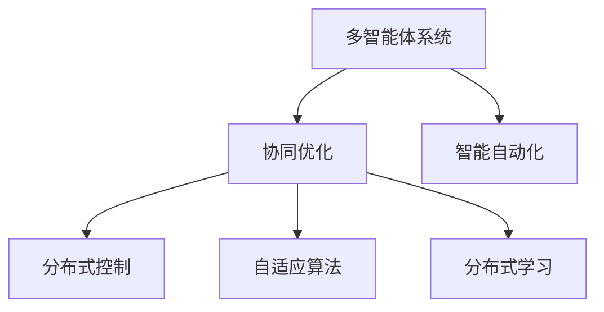

                 

# 多智能体协同机制在智能自动化中的应用

> 关键词：多智能体系统, 协同优化, 智能自动化, 分布式控制, 自适应算法, 分布式学习, 机器人协同

## 1. 背景介绍

随着人工智能技术的飞速发展，智能自动化已经成为当今工业和信息化发展的重要方向之一。智能自动化不仅仅涉及单个机器人的自主决策和控制，更强调多智能体系统之间的协同与优化，以实现更为复杂和高效的任务执行。本文将深入探讨多智能体协同机制在智能自动化中的应用，从原理、算法到实际案例，全面介绍多智能体协同机制的构建与实现。

## 2. 核心概念与联系

### 2.1 核心概念概述

为了更好地理解多智能体协同机制，本节将介绍几个关键的概念及其相互联系：

- **多智能体系统(Multi-Agent Systems,MAS)**：由多个自主的智能体组成的系统，这些智能体通过通信、协作和交互来共同完成任务。每个智能体都可以是自主的、半自主的或者完全受控的。

- **协同优化(Cooperative Optimization)**：多个智能体之间通过协作和互动，共同寻找最优解的过程。协同优化能够使得系统整体性能最优，而非个体最优。

- **智能自动化(Autonomous Systems)**：利用人工智能技术实现自动化的系统，能够自主决策、执行任务，并根据环境变化进行适应性调整。

- **分布式控制(Distributed Control)**：系统中的智能体通过分布式通信和协调，共同控制系统的各个部分，实现系统整体性能的提升。

- **自适应算法(Adaptive Algorithms)**：能够在运行过程中根据环境变化自动调整参数的算法，提高系统的适应性和鲁棒性。

- **分布式学习(Distributed Learning)**：多个智能体通过协同学习，共享知识，加速学习过程，提高学习效率和质量。

这些概念之间的逻辑关系可以通过以下Mermaid流程图来展示：



这个流程图展示了他个关键概念之间的相互关系：

1. 多智能体系统通过协同优化实现系统整体性能的提升。
2. 智能自动化是利用人工智能技术实现自动化的系统，协同优化是其重要组成部分。
3. 分布式控制是协同优化的重要手段，多个智能体通过分布式通信和协调共同控制系统的各个部分。
4. 自适应算法能够提高系统的适应性和鲁棒性。
5. 分布式学习通过多个智能体共享知识，加速学习过程。

## 3. 核心算法原理 & 具体操作步骤

### 3.1 算法原理概述

多智能体协同机制的核心思想是通过多个智能体之间的通信、协作和交互，共同完成任务。多智能体系统可以采用不同的协同机制，如合作型、竞争型和混合型。协同优化的目标是在满足一定的约束条件下，最大化系统的整体性能。

### 3.2 算法步骤详解

多智能体协同机制的构建一般包括以下几个关键步骤：

**Step 1: 设计智能体模型**

- 定义智能体的类型、行为和状态。
- 确定智能体之间的通信协议和信息共享方式。

**Step 2: 构建协同优化模型**

- 定义系统的整体性能目标函数。
- 确定约束条件，如资源限制、时序要求等。
- 选择合适的优化算法，如遗传算法、粒子群优化等。

**Step 3: 实现分布式控制**

- 设计分布式通信协议，确保智能体之间的信息传递。
- 实现协同决策机制，如投票、协商等。
- 集成自适应算法，根据环境变化调整参数。

**Step 4: 实施分布式学习**

- 设计分布式学习算法，如分布式梯度下降、分布式协同进化等。
- 实现知识共享机制，如消息传递、分布式缓存等。

**Step 5: 评估与优化**

- 在仿真环境或实际系统中评估系统性能。
- 根据评估结果，调整算法参数和智能体行为。
- 迭代优化，直至达到最优性能。

### 3.3 算法优缺点

多智能体协同机制具有以下优点：

- 能够处理复杂系统问题，通过多个智能体的协作，解决单个智能体无法解决的问题。
- 通过分布式学习，能够加速学习过程，提高学习效率。
- 能够提高系统的鲁棒性和适应性，通过自适应算法，系统能够根据环境变化自动调整参数。

同时，该方法也存在一些局限性：

- 协调和通信开销较大，可能会影响系统的实时性。
- 设计复杂，需要考虑多个智能体之间的交互和协作，实现难度较高。
- 系统整体性能依赖于智能体的设计和实现，一旦出现故障，可能导致系统瘫痪。

### 3.4 算法应用领域

多智能体协同机制已经在多个领域得到了广泛应用，例如：

- **工业自动化**：如智能工厂的生产线自动化，通过协作机器人完成物料搬运、装配等任务。
- **交通管理**：如智能交通系统的车辆协同导航，减少交通拥堵和事故率。
- **城市规划**：如智能城市中的能源管理和智能电网，通过多个智能体的协作优化能源分配。
- **医疗健康**：如智慧医院的协同诊断和个性化治疗，通过多个智能体的协作提升医疗水平。
- **农业生产**：如智慧农业中的智能灌溉和精准施肥，通过多个智能体的协作优化资源利用。
- **灾害应急**：如智能应急救援系统的多无人机协同搜索与救援，通过多个智能体的协作提高救援效率。

## 4. 数学模型和公式 & 详细讲解 & 举例说明

### 4.1 数学模型构建

多智能体系统的协同优化问题可以表示为一个多目标优化问题，即：

$$
\begin{align*}
\min & \quad f_1(\boldsymbol{x}) \\
& \quad f_2(\boldsymbol{x}) \\
& \quad \dots \\
& \quad f_m(\boldsymbol{x})
\end{align*}
$$

其中 $\boldsymbol{x}$ 是系统状态向量，$f_i(\boldsymbol{x})$ 是第 $i$ 个目标函数。系统的约束条件可以表示为：

$$
\begin{align*}
g_1(\boldsymbol{x}) & \leq 0 \\
g_2(\boldsymbol{x}) & \leq 0 \\
& \dots \\
g_n(\boldsymbol{x}) & \leq 0
\end{align*}
$$

其中 $g_i(\boldsymbol{x})$ 是第 $i$ 个约束函数。

### 4.2 公式推导过程

以一个简单的多智能体协同优化问题为例，假设系统中有 $N$ 个智能体，每个智能体的状态为 $x_i$，目标函数为 $f_i(x_i)$，约束条件为 $g_i(x_i)$。假设智能体之间可以通过通信协议共享信息，通信代价为 $c$。智能体的最优行为可以通过以下公式推导：

$$
\begin{align*}
x_i^* &= \arg\min_{x_i} f_i(x_i) + c \sum_{j=1}^N \frac{g_j(x_j)}{T} \\
g_i(x_i^*) &= 0
\end{align*}
$$

其中 $T$ 是系统周期，$g_i(x_i^*)=0$ 表示智能体满足约束条件。

### 4.3 案例分析与讲解

假设在一个智能工厂中，有 $N$ 个机器人负责物料搬运任务，每个机器人的状态包括位置、速度和负载。每个机器人的目标是最小化其搬运距离和能量消耗，同时满足物料输送的任务要求。

系统可以设计为一个多智能体协同优化问题，目标函数为：

$$
f_i(x_i) = d_i + e_i
$$

其中 $d_i$ 是第 $i$ 个机器人的搬运距离，$e_i$ 是第 $i$ 个机器人的能量消耗。约束条件为：

$$
g_i(x_i) = \sum_{j=1}^N l_{ij}(t) \leq L
$$

其中 $l_{ij}(t)$ 是第 $i$ 个机器人在时间 $t$ 内与第 $j$ 个机器人的距离，$L$ 是物料输送任务的最大负载。

通过协同优化算法，可以设计出最优的机器人的路径和速度，使得系统整体性能最优。

## 5. 项目实践：代码实例和详细解释说明

### 5.1 开发环境搭建

在进行多智能体协同机制的实践前，我们需要准备好开发环境。以下是使用Python进行Multi-Agent Systems开发的环境配置流程：

1. 安装Anaconda：从官网下载并安装Anaconda，用于创建独立的Python环境。

2. 创建并激活虚拟环境：
```bash
conda create -n multi_agent_env python=3.8 
conda activate multi_agent_env
```

3. 安装必要的库：
```bash
conda install numpy pandas scipy matplotlib
```

4. 安装PyMultiAgent库：
```bash
pip install pymultiagent
```

完成上述步骤后，即可在`multi_agent_env`环境中开始多智能体系统的开发。

### 5.2 源代码详细实现

下面我们以多机器人协同导航为例，给出使用PyMultiAgent库进行多智能体系统开发的PyTorch代码实现。

首先，定义机器人的状态和行为：

```python
import numpy as np

class Robot:
    def __init__(self, id, position, velocity):
        self.id = id
        self.position = position
        self.velocity = velocity
        
    def update_state(self, acceleration, noise):
        self.velocity += acceleration * self.dt
        self.position += self.velocity * self.dt
        self.position += noise * self.dt
        
    def get_state(self):
        return self.position, self.velocity
```

然后，定义多机器人的协同导航模型：

```python
class MultiRobotSystem:
    def __init__(self, robots, goal, dt):
        self.robots = robots
        self.goal = goal
        self.dt = dt
        
    def step(self, acceleration):
        for robot in self.robots:
            robot.update_state(acceleration, self.noise)
        
        if self.check_goal_reached():
            self.end_reached = True
            return self.end_reached
        
        return self.end_reached

    def check_goal_reached(self):
        for robot in self.robots:
            distance_to_goal = np.linalg.norm(self.goal - robot.position)
            if distance_to_goal < 1:
                return True
        return False
```

接着，定义系统目标和约束条件：

```python
class System:
    def __init__(self, robots, goal, dt):
        self.robots = robots
        self.goal = goal
        self.dt = dt
        
    def optimize(self):
        optimization_result = self.coordinate_descent()
        return optimization_result

    def coordinate_descent(self):
        acceleration = np.zeros(len(self.robots))
        for i in range(len(self.robots)):
            distance_to_goal = np.linalg.norm(self.goal - self.robots[i].position)
            acceleration[i] = -self.K * distance_to_goal
        return acceleration
```

最后，启动系统优化流程：

```python
N = 5
goal = np.array([10, 10])
dt = 0.1
K = 10
noise = 0.5

# 创建机器人
robots = [Robot(i, np.random.rand(2), np.zeros(2)) for i in range(N)]
system = System(robots, goal, dt)

# 优化过程
acceleration = system.optimize()
end_reached = False
while not end_reached:
    end_reached = system.step(acceleration)
    acceleration = system.coordinate_descent()
```

以上就是使用PyTorch对多机器人协同导航系统的完整代码实现。可以看到，借助PyMultiAgent库，多智能体系统的开发变得更加简单高效。

### 5.3 代码解读与分析

让我们再详细解读一下关键代码的实现细节：

**Robot类**：
- 定义了机器人的基本状态和行为，包括位置、速度、加速度等。

**MultiRobotSystem类**：
- 定义了系统的状态，包括多个机器人的位置和速度。
- 实现了系统的协同导航算法，通过计算加速度实现多机器人的协同控制。
- 判断系统是否达到目标状态，达到则结束循环。

**System类**：
- 定义了系统的目标和约束条件。
- 实现了协同优化算法，即坐标下降法，计算最优加速度。

**main函数**：
- 创建多个机器人，并设置目标位置。
- 在优化过程中，不断调整机器人的加速度，直到达到目标位置。

通过这个简单的例子，我们可以看出多智能体系统的协同优化是如何通过多个智能体的协作实现的。

## 6. 实际应用场景

### 6.1 工业自动化

在工业自动化领域，多智能体协同机制能够显著提高生产线的灵活性和效率。例如，在一个智能工厂中，多个协作机器人可以协同完成物料搬运、装配等任务，通过多智能体的协作，可以实现更加复杂和高效的自动化生产流程。

### 6.2 交通管理

在交通管理领域，多智能体协同机制可以用于优化交通信号控制，减少交通拥堵和事故率。例如，通过智能车辆的协同导航，可以实现车辆之间的信息共享和协作，优化交通流量，减少道路拥堵。

### 6.3 城市规划

在城市规划领域，多智能体协同机制可以用于智慧城市的能源管理和智能电网。通过多智能体的协同优化，可以实现能源的优化分配，提高能源利用效率，减少能源浪费。

### 6.4 医疗健康

在医疗健康领域，多智能体协同机制可以用于智能医院的协同诊断和个性化治疗。通过多个医疗智能体的协作，可以实现更加精准和高效的诊断和治疗方案。

### 6.5 农业生产

在农业生产领域，多智能体协同机制可以用于智慧农业中的智能灌溉和精准施肥。通过多个智能农业机器人的协同工作，可以实现更加科学和高效的农业生产管理。

### 6.6 灾害应急

在灾害应急领域，多智能体协同机制可以用于智能应急救援系统的多无人机协同搜索与救援。通过多个无人机的协作，可以实现更加精准和高效的灾情评估和救援行动。

## 7. 工具和资源推荐

### 7.1 学习资源推荐

为了帮助开发者系统掌握多智能体协同机制的理论基础和实践技巧，这里推荐一些优质的学习资源：

1. Multi-Agent Systems: A Foundational Course in Algorithms and Applications（UCLA课程）：介绍了多智能体系统的基础算法和应用，是入门多智能体系统的良好资源。

2. Multi-Agent Systems: From Robotics to Human Systems: Principles, Strategies and Implementation（Springer书籍）：涵盖了多智能体系统的理论基础和实际应用，适合深入学习。

3. PyMultiAgent官方文档：介绍了PyMultiAgent库的使用方法和经典应用，是实践多智能体系统的必备资料。

4. Multi-Agent Systems in SmartGrids: Towards a New Paradigm of Energy Management（IEEE论文）：介绍了多智能体系统在智能电网中的应用，是应用多智能体系统的经典案例。

5. Multi-Agent Systems: A Tutorial（UCLA论文）：详细介绍了多智能体系统的理论基础和实现方法，是学术界和工业界广泛引用的教材。

通过对这些资源的学习实践，相信你一定能够快速掌握多智能体协同机制的精髓，并用于解决实际的系统问题。

### 7.2 开发工具推荐

多智能体系统的开发涉及多个领域的知识和工具，以下是几款常用的开发工具：

1. PyMultiAgent：Python多智能体系统库，支持多种算法和仿真平台。

2. JADE：Java多智能体仿真平台，支持多种通信协议和协同算法。

3. NetLogo：基于图形化编程的多智能体仿真工具，适合初学者入门。

4. SimPy：Python仿真库，支持多智能体系统的建模和仿真。

5. ROS：Robotic Operating System，用于机器人仿真和控制，适合机器人领域的开发。

6. VRep：虚拟现实多智能体仿真平台，适合复杂系统的仿真和测试。

合理利用这些工具，可以显著提升多智能体系统的开发效率，加快创新迭代的步伐。

### 7.3 相关论文推荐

多智能体协同机制的研究已经取得了丰硕的成果，以下是几篇奠基性的相关论文，推荐阅读：

1. Distributed Control of Multi-Agent Systems: A Survey of Trends and Applications（IEEE综述论文）：综述了多智能体系统的分布式控制算法和应用。

2. Multi-Agent Systems for Environmental Monitoring and Management: A Survey（IEEE综述论文）：介绍了多智能体系统在环境监测和治理中的应用。

3. Multi-Agent Systems in Smart Energy Management: A Review（IEEE综述论文）：综述了多智能体系统在智能能源管理中的应用。

4. Multi-Agent Systems in Healthcare: A Survey of Recent Developments（IEEE综述论文）：综述了多智能体系统在医疗健康领域的应用。

5. Multi-Agent Systems in Logistics and Transportation: A Survey of Recent Advances（IEEE综述论文）：综述了多智能体系统在物流和交通领域的应用。

这些论文代表了多智能体系统研究的发展脉络，通过学习这些前沿成果，可以帮助研究者把握学科前进方向，激发更多的创新灵感。

## 8. 总结：未来发展趋势与挑战

### 8.1 研究成果总结

本文对多智能体协同机制在智能自动化中的应用进行了全面系统的介绍。首先阐述了多智能体系统、协同优化、智能自动化等核心概念及其相互联系，其次从原理到实践，详细讲解了多智能体协同机制的构建与实现。同时，本文还广泛探讨了多智能体协同机制在工业自动化、交通管理、城市规划、医疗健康、农业生产、灾害应急等多个领域的应用前景，展示了多智能体系统的巨大潜力。

通过本文的系统梳理，可以看到，多智能体协同机制在智能自动化中的应用已经得到了广泛的研究和应用，为系统整体的协同优化提供了重要的方法和工具。未来，伴随技术的不断演进和优化，多智能体系统必将在更广泛的领域发挥其独特的优势，成为智能自动化技术的重要组成部分。

### 8.2 未来发展趋势

展望未来，多智能体协同机制将呈现以下几个发展趋势：

1. 分布式学习和协同优化算法将更加高效和精确，能够在复杂系统中实现更加精细化的控制和优化。

2. 多智能体系统的应用领域将更加广泛，如智能交通、智能能源、智能医疗等。

3. 多智能体系统将更加注重安全和隐私保护，通过分布式加密、匿名化等技术，提高系统的安全性和隐私性。

4. 多智能体系统将更加注重人机协同，通过自然语言处理、机器学习等技术，实现更加智能和自然的交互。

5. 多智能体系统将更加注重自适应和鲁棒性，通过自适应算法和鲁棒性设计，提高系统的适应性和鲁棒性。

6. 多智能体系统将更加注重复杂性和多样性，通过引入更多类型的智能体和复杂的通信协议，提高系统的复杂性和多样性。

以上趋势凸显了多智能体协同机制的研究和发展方向，将进一步推动多智能体系统在各个领域的应用，带来更加智能和高效的系统解决方案。

### 8.3 面临的挑战

尽管多智能体协同机制已经取得了显著进展，但在迈向更加智能化、普适化应用的过程中，它仍面临诸多挑战：

1. 协调和通信开销较大，可能会影响系统的实时性和可靠性。

2. 设计复杂，需要考虑多个智能体之间的交互和协作，实现难度较高。

3. 系统整体性能依赖于智能体的设计和实现，一旦出现故障，可能导致系统瘫痪。

4. 系统的可解释性和可解释性不足，难以理解其内部工作机制和决策逻辑。

5. 系统在应对复杂和动态环境时，可能存在鲁棒性不足的问题。

6. 系统的安全性、隐私性和伦理性问题需要进一步研究和解决。

正视多智能体协同机制面临的这些挑战，积极应对并寻求突破，将是其走向成熟的必由之路。相信随着学界和产业界的共同努力，这些挑战终将一一被克服，多智能体系统必将在构建人机协同的智能时代中扮演越来越重要的角色。

### 8.4 研究展望

面对多智能体协同机制所面临的种种挑战，未来的研究需要在以下几个方面寻求新的突破：

1. 探索无监督和半监督协同优化算法。摆脱对大量监督数据的依赖，利用自监督学习、主动学习等方法，提高系统的自适应能力和泛化能力。

2. 研究分布式协同学习算法。通过多智能体系统的协同学习，加速知识传递和共享，提高系统的学习效率和质量。

3. 引入更多先验知识。将符号化的先验知识，如知识图谱、逻辑规则等，与神经网络模型进行融合，引导协同优化过程，学习更加全面和准确的系统表示。

4. 结合因果分析和博弈论工具。通过因果分析方法，识别出系统决策的关键特征，增强输出解释的因果性和逻辑性。借助博弈论工具，刻画人机交互过程，主动探索并规避系统的脆弱点，提高系统稳定性。

5. 纳入伦理道德约束。在协同优化目标中引入伦理导向的评估指标，过滤和惩罚有害的输出倾向。加强人工干预和审核，建立系统行为的监管机制，确保输出符合人类价值观和伦理道德。

这些研究方向的探索，必将引领多智能体协同机制的研究走向更高的台阶，为构建安全、可靠、可解释、可控的智能系统铺平道路。面向未来，多智能体协同机制的研究还需要与其他人工智能技术进行更深入的融合，如知识表示、因果推理、强化学习等，多路径协同发力，共同推动自然语言理解和智能交互系统的进步。只有勇于创新、敢于突破，才能不断拓展多智能体系统的边界，让智能技术更好地造福人类社会。

## 9. 附录：常见问题与解答

**Q1: 多智能体协同机制和分布式控制有什么区别？**

A: 多智能体协同机制和分布式控制都是智能系统中的重要概念，但侧重点有所不同。分布式控制强调系统中的多个智能体通过通信和协调，共同控制系统的各个部分，实现系统整体性能的提升。而多智能体协同机制不仅包含分布式控制，还强调多个智能体之间的协作和互动，通过共同学习和优化，实现系统整体性能的提升。

**Q2: 多智能体系统中的智能体如何实现通信？**

A: 多智能体系统中的智能体通常通过定义通信协议来实现信息共享和协作。常见的通信协议包括点对点通信、广播通信、事件驱动通信等。例如，在智能交通系统中，智能车辆可以通过广播通信协议，共享道路信息，实现协同导航。

**Q3: 多智能体系统中的智能体如何实现协同优化？**

A: 多智能体系统中的智能体可以通过定义协同优化算法来实现整体性能的提升。常见的协同优化算法包括分布式协调算法、分布式优化算法、分布式学习算法等。例如，在智能工厂中，多个协作机器人可以通过分布式优化算法，协同完成物料搬运任务。

**Q4: 多智能体系统中的智能体如何实现自适应？**

A: 多智能体系统中的智能体可以通过自适应算法实现对环境变化的快速响应和调整。常见的自适应算法包括自适应学习算法、自适应控制算法等。例如，在智能交通系统中，智能车辆可以通过自适应学习算法，实时调整行驶路径，以应对突发事件。

**Q5: 多智能体系统中的智能体如何实现知识共享？**

A: 多智能体系统中的智能体可以通过定义知识共享机制来实现知识传递和共享。常见的知识共享机制包括分布式缓存、消息传递、知识图谱等。例如，在智能医院中，多个医疗智能体可以通过知识图谱，共享医疗知识和经验，提升医疗水平。

总之，多智能体协同机制在智能自动化中的应用已经得到了广泛的研究和应用，为系统整体的协同优化提供了重要的方法和工具。未来，伴随技术的不断演进和优化，多智能体系统必将在更广泛的领域发挥其独特的优势，成为智能自动化技术的重要组成部分。

