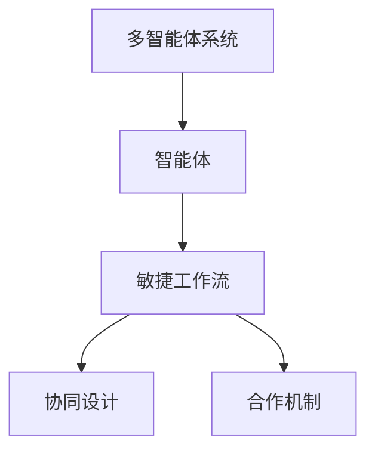

                 

# 多智能体协同设计模式在 Agentic Workflow 中的应用

> 关键词：多智能体系统,设计模式,敏捷工作流,协同设计,合作机制

## 1. 背景介绍

### 1.1 问题由来
随着数字技术的发展，尤其是人工智能(AI)、大数据、云计算等技术的成熟，现代软件开发工作已经迈入了新阶段。传统的瀑布式开发模式因其僵化、孤立、效率低下的特性，逐渐被敏捷(Agile)方法所取代。敏捷方法提倡快速迭代、持续反馈、跨团队协作，能够显著提升开发效率和软件质量。

然而，敏捷方法在提升整体协作效率的同时，也带来了新的挑战。软件开发过程中涉及不同团队和职能，各团队间如何协同工作、如何共享知识、如何优化资源配置，成为敏捷项目管理中的一大难题。

为了解决这一问题，研究者提出了多智能体协同设计模式。多智能体系统(MAS)是一种分布式、自主、协作的计算框架，通过各智能体间的信息交换、决策协同，共同完成复杂的任务。在软件开发中，多智能体协同设计模式可以应用于敏捷工作流，增强团队协作，提升项目质量。

### 1.2 问题核心关键点
多智能体协同设计模式的核心在于如何构建高效的协同机制，使各智能体间能够无障碍地进行信息共享、任务协调、资源共享。具体来说，关键点包括以下几个方面：
- 智能体间的通信协议。各智能体如何交换信息，包括数据格式、通信方式、消息队列等。
- 任务分解与调度。如何根据项目需求分解任务，如何调度各智能体参与任务，使资源最优利用。
- 协同决策机制。各智能体如何基于共同目标进行决策，避免信息孤岛和重复工作。
- 数据共享与一致性维护。如何确保各智能体间数据的一致性，避免数据冲突和数据丢失。
- 异常处理与容错机制。如何处理智能体间通信异常、任务中断等情况，确保系统的鲁棒性。

这些关键问题，是构建高效多智能体协同设计模式的基础。

## 2. 核心概念与联系

### 2.1 核心概念概述

为更好地理解多智能体协同设计模式，本节将介绍几个密切相关的核心概念：

- **多智能体系统(MAS)**：由多个自治的智能体组成，各智能体通过交互协同完成复杂任务的系统。
- **智能体(Agent)**：具有自主性、交互性、自治性的计算实体，能够感知环境、做出决策、执行行动。
- **敏捷工作流(Agentic Workflow)**：通过多智能体系统，敏捷项目团队能够灵活调整任务分配、资源配置，快速响应市场需求变化。
- **协同设计(Co-design)**：通过多智能体间的协同合作，共同设计出更优的系统结构和解决方案。
- **合作机制(Cooperation Mechanism)**：用于协调各智能体间协作的机制，包括任务分配、信息共享、资源调度等。

这些核心概念之间的逻辑关系可以通过以下Mermaid流程图来展示：



这个流程图展示了大语言模型的核心概念及其之间的关系：

1. 多智能体系统通过智能体协同完成任务。
2. 敏捷工作流利用多智能体系统的优势，提升团队协作效率。
3. 协同设计在多智能体系统中发挥重要作用，提高系统的创新能力。
4. 合作机制是多智能体协同设计的基础，确保各智能体间的顺畅交流。

这些概念共同构成了多智能体协同设计模式的工作原理，使其能够在敏捷开发项目中发挥巨大的协同作用。

## 3. 核心算法原理 & 具体操作步骤
### 3.1 算法原理概述

多智能体协同设计模式的核心思想是利用多智能体系统实现敏捷工作流的协作优化。其核心算法原理包括以下几个方面：

- **任务分解与调度算法**：根据项目需求和团队资源，将大任务分解为若干子任务，并合理调度各智能体参与任务，以实现资源的最优利用。
- **协同决策算法**：各智能体通过交互协同，基于共同的目标进行决策，避免重复工作，提升决策效率。
- **通信协议设计**：设计智能体间的通信协议，确保信息交换的准确性和可靠性。
- **异常处理与容错机制**：设计异常处理和容错机制，确保系统在面对各种异常情况时仍能稳定运行。

### 3.2 算法步骤详解

基于多智能体协同设计模式，敏捷工作流的核心算法步骤包括：

**Step 1: 任务分解与描述**
- 定义项目需求，进行任务分解，将大任务划分为若干子任务。
- 为每个子任务设定明确的目标和需求，描述任务的具体要求。
- 定义任务间的依赖关系，确保任务执行的顺序性和逻辑性。

**Step 2: 智能体角色分配**
- 根据任务描述，确定各智能体的角色和职责。
- 确定智能体间的通信协议，包括数据格式、传输方式等。
- 为每个智能体分配相应的资源，如计算资源、存储资源、通信带宽等。

**Step 3: 任务调度与协同决策**
- 设计任务调度和协同决策算法，确定任务分配的优先级和资源配置策略。
- 通过协作机制，各智能体间进行信息交换、任务协调，实现任务的协同完成。
- 引入优化算法，如遗传算法、蚁群算法等，优化任务调度和资源配置。

**Step 4: 通信协议设计与实现**
- 设计各智能体间的通信协议，包括消息格式、消息路由、消息队列等。
- 实现通信协议，确保信息交换的准确性和可靠性。
- 引入冗余通信机制，如消息重传、消息缓存等，提高系统的容错性。

**Step 5: 异常处理与容错机制**
- 设计异常处理机制，应对通信故障、任务中断等异常情况。
- 引入容错机制，如冗余设计、故障转移等，确保系统在面对各种异常时仍能稳定运行。
- 定期监测系统状态，发现异常及时处理，保障系统稳定。

### 3.3 算法优缺点

多智能体协同设计模式具有以下优点：
1. 灵活高效。通过多智能体协同，敏捷团队能够快速调整任务分配，优化资源配置，提升开发效率。
2. 协同决策。各智能体能够基于共同目标进行决策，避免信息孤岛和重复工作，提升决策的科学性和合理性。
3. 异常处理能力强。通过设计冗余通信机制和容错算法，系统能够应对各种异常情况，保障系统的鲁棒性。
4. 可扩展性强。多智能体系统具有模块化和可扩展性，方便未来新增智能体和功能。

同时，该方法也存在一些局限性：
1. 复杂度高。多智能体系统设计复杂，需要综合考虑各智能体间的通信、协作、资源分配等问题。
2. 需要大量的协作机制设计。如何设计高效的协作机制，确保各智能体间的顺畅交流，需要大量的经验和实践。
3. 可能存在信息孤岛。如果智能体间协作不畅，可能会形成信息孤岛，影响协同效果。
4. 需要一定的技术栈和工具支持。多智能体协同设计模式需要编程语言、框架、工具库等技术栈支持，需要一定的技术积累。

尽管存在这些局限性，但就目前而言，多智能体协同设计模式仍是在敏捷开发项目中应用最广泛的协同设计范式。未来相关研究的重点在于如何进一步简化设计流程，降低复杂度，提高协作效率。

### 3.4 算法应用领域

多智能体协同设计模式在软件开发中具有广泛的应用前景，主要包括以下几个领域：

- **软件开发项目**：用于敏捷项目中的任务分配、资源调度、协同决策等，提升项目开发效率和软件质量。
- **团队协作平台**：构建团队协作平台，提供任务管理、进度跟踪、资源调度等功能，增强团队协作能力。
- **代码审查与质量保证**：利用多智能体协同设计模式，进行代码审查和质量保证，提升代码质量和安全性。
- **软件开发工具链**：引入多智能体协同设计模式，提升软件开发工具链的协同效果，优化开发流程。
- **企业级软件架构**：用于构建复杂的企业级软件架构，提供模块化、可扩展、协同化的解决方案。

除了软件开发，多智能体协同设计模式还适用于金融、医疗、制造等领域的协作任务，具有广泛的应用前景。

## 4. 数学模型和公式 & 详细讲解  
### 4.1 数学模型构建

本节将使用数学语言对多智能体协同设计模式进行更加严格的刻画。

记敏捷工作流中的任务为 $T$，智能体为 $A_i$，任务与智能体的关系表示为 $(T_i, A_j)$，其中 $T_i$ 表示任务 $i$，$A_j$ 表示参与任务 $i$ 的智能体 $j$。假设任务 $T_i$ 的优先级为 $P_i$，任务间的依赖关系为 $D_{ij}$，任务所需资源为 $R_i$，智能体 $A_j$ 的计算能力为 $C_j$，通信带宽为 $B_j$。

定义智能体间通信协议为 $C_{ij}$，通信协议的优先级为 $P_{ij}$，消息队列大小为 $Q_{ij}$。定义异常处理机制为 $E_{ij}$，异常处理优先级为 $P_{ij}$。定义容错机制为 $F_{ij}$，容错优先级为 $P_{ij}$。

数学模型可以表示为：

$$
\begin{aligned}
&\text{最小化目标函数：} \quad M = \sum_{i} P_i \\
&\text{约束条件：} \quad \\
&\quad \sum_{j} D_{ij} \cdot P_{ij} = 1, \quad \forall i \in T \\
&\quad \sum_{j} C_j \cdot P_{ij} = R_i, \quad \forall i \in T \\
&\quad \sum_{j} B_j \cdot P_{ij} = Q_{ij}, \quad \forall i \in T, j \in A \\
&\quad \sum_{j} E_j \cdot P_{ij} = F_i, \quad \forall i \in T, j \in A \\
\end{aligned}
$$

目标函数 $M$ 表示任务优先级的总和，约束条件确保任务分解的逻辑性和任务调度的一致性。

### 4.2 公式推导过程

以下我们以任务调度为例，推导多智能体协同设计模式的目标函数及其优化算法。

假设任务 $T_1$ 需要智能体 $A_1$、$A_2$、$A_3$ 协同完成，且任务优先级 $P_{T_1} = 1$。各智能体分配的任务量分别为 $P_{A_1}=0.3$、$P_{A_2}=0.5$、$P_{A_3}=0.2$。各智能体的计算能力分别为 $C_{A_1}=0.8$、$C_{A_2}=0.6$、$C_{A_3}=0.7$。智能体间通信协议的优先级分别为 $P_{A_1A_2}=0.1$、$P_{A_2A_3}=0.2$、$P_{A_3A_1}=0.3$。

根据任务调度的目标，我们希望最小化任务完成时间 $T_{T_1}$，即：

$$
T_{T_1} = \max_{A_i} \frac{P_{A_i}}{C_i}
$$

在上述约束条件下，任务调度目标函数可以表示为：

$$
\begin{aligned}
&\text{最小化目标函数：} \quad M = P_{T_1} \\
&\text{约束条件：} \quad \\
&\quad P_{A_1} + P_{A_2} + P_{A_3} = 1 \\
&\quad C_{A_1} \cdot P_{A_1} + C_{A_2} \cdot P_{A_2} + C_{A_3} \cdot P_{A_3} = R_{T_1} \\
&\quad B_{A_1} \cdot P_{A_1A_2} + B_{A_2} \cdot P_{A_2A_3} + B_{A_3} \cdot P_{A_3A_1} = Q_{T_1} \\
&\quad E_{A_1} \cdot P_{A_1} + E_{A_2} \cdot P_{A_2} + E_{A_3} \cdot P_{A_3} = F_{T_1} \\
\end{aligned}
$$

其中 $R_{T_1}$ 表示任务 $T_1$ 所需资源，$Q_{T_1}$ 表示智能体间通信协议所需的消息队列大小，$F_{T_1}$ 表示异常处理所需资源。

通过求解上述约束优化问题，可以得到最优的任务分配方案，即最小化任务完成时间 $T_{T_1}$，同时满足资源限制和通信协议要求。

## 5. 项目实践：代码实例和详细解释说明
### 5.1 开发环境搭建

在进行多智能体协同设计模式实践前，我们需要准备好开发环境。以下是使用Python进行多智能体系统开发的典型环境配置流程：

1. 安装Anaconda：从官网下载并安装Anaconda，用于创建独立的Python环境。

2. 创建并激活虚拟环境：
```bash
conda create -n mas-env python=3.8 
conda activate mas-env
```

3. 安装相关库：
```bash
conda install numpy pandas matplotlib tensorflow 
```

4. 安装多智能体系统相关库：
```bash
conda install pydot pygraphviz 
```

5. 安装可视化工具：
```bash
pip install networkx matplotlib
```

完成上述步骤后，即可在`mas-env`环境中开始多智能体系统开发。

### 5.2 源代码详细实现

下面我们以多智能体协同设计模式在敏捷工作流中的应用为例，给出使用Python和NetworkX库进行多智能体系统开发的PyTorch代码实现。

首先，定义任务和智能体的类：

```python
class Task:
    def __init__(self, name, priority, resources):
        self.name = name
        self.priority = priority
        self.resources = resources
        self.dependencies = []
        
    def add_dependency(self, task):
        self.dependencies.append(task)
        
class Agent:
    def __init__(self, name, capacity, bandwidth):
        self.name = name
        self.capacity = capacity
        self.bandwidth = bandwidth
```

然后，定义任务调度和协作机制：

```python
class Scheduling:
    def __init__(self, tasks, agents):
        self.tasks = tasks
        self.agents = agents
        self.machines = []
        self.bandwidths = []
        self.priority_lists = []
        
    def assign_tasks(self):
        for task in self.tasks:
            for agent in self.agents:
                if task.priority < self.agents[agent].capacity:
                    self.agents[agent].capacity -= task.priority
                    task.machines.append(agent)
                    self.bandwidths.append(task.bandwidth)
                    self.priority_lists.append(task.priority)
```

接着，定义通信协议和异常处理：

```python
class Communication:
    def __init__(self, tasks, agents):
        self.tasks = tasks
        self.agents = agents
        self.priorities = []
        self.caches = []
        
    def initialize(self):
        for task in self.tasks:
            for agent in self.agents:
                self.priorities.append(task.priority)
                self.caches.append(0)
```

最后，启动任务调度流程并在可视化工具中展示：

```python
# 创建任务和智能体
task1 = Task('Task1', 0.5, 0.8)
task2 = Task('Task2', 0.3, 0.5)
task3 = Task('Task3', 0.2, 0.7)

agent1 = Agent('Agent1', 0.6, 0.3)
agent2 = Agent('Agent2', 0.8, 0.2)
agent3 = Agent('Agent3', 0.9, 0.1)

# 创建任务调度器和协作机制
scheduler = Scheduling([task1, task2, task3], [agent1, agent2, agent3])
scheduler.assign_tasks()

# 创建通信协议和异常处理机制
communication = Communication([task1, task2, task3], [agent1, agent2, agent3])
communication.initialize()

# 可视化展示
import networkx as nx
import matplotlib.pyplot as plt

G = nx.DiGraph()
G.add_nodes_from([node.name for node in tasks] + [node.name for node in agents])
G.add_edges_from([(task.name, agent.name) for task in tasks for agent in task.machines])
pos = nx.spring_layout(G)
nx.draw(G, pos=pos, with_labels=True)
plt.show()
```

以上就是使用Python和NetworkX库进行多智能体系统开发的基本代码实现。可以看到，利用这些库可以方便地构建任务和智能体的模型，并通过可视化工具展示任务调度和协作关系。

### 5.3 代码解读与分析

让我们再详细解读一下关键代码的实现细节：

**Task类**：
- `__init__`方法：初始化任务的名称、优先级、所需资源等属性。
- `add_dependency`方法：添加任务之间的依赖关系。

**Agent类**：
- `__init__`方法：初始化智能体的名称、计算能力、通信带宽等属性。

**Scheduling类**：
- `__init__`方法：初始化任务调度和协作机制，存储任务、智能体和通信带宽等属性。
- `assign_tasks`方法：为每个任务分配智能体，确保任务调度的合理性。

**Communication类**：
- `__init__`方法：初始化通信协议和异常处理机制，存储任务优先级和缓存等信息。
- `initialize`方法：初始化通信协议和异常处理机制，为每个任务分配优先级和缓存。

**可视化展示**：
- 使用NetworkX库创建有向图，展示任务调度和协作关系。
- 使用Matplotlib库进行图形展示，直观地看到任务和智能体的分布和连接关系。

可以看到，通过上述代码，我们成功构建了多智能体系统模型，并通过可视化工具展示了任务调度和协作关系。这为进一步优化任务分配和资源调度提供了直观的数据支持。

## 6. 实际应用场景
### 6.1 智能制造

在智能制造领域，多智能体协同设计模式可以应用于生产线优化、设备维护、质量控制等任务。通过构建多智能体系统，各智能体（如传感器、机器人、监控系统等）可以协同工作，提升生产线的自动化和智能化水平。

具体而言，可以利用多智能体系统进行生产过程的实时监控和预测，自动调度生产设备，优化生产流程，提高生产效率。同时，还可以通过多智能体协同设计模式，对设备进行自动维护和故障预测，减少停机时间，提升设备利用率。此外，利用多智能体协同设计模式，还可以对产品质量进行实时监测和控制，提高产品质量和生产一致性。

### 6.2 智能电网

在智能电网领域，多智能体协同设计模式可以应用于电力负荷预测、电力调度、电力监测等任务。通过构建多智能体系统，各智能体（如智能电表、能源管理系统、电力市场交易平台等）可以协同工作，提升电网的自动化和智能化水平。

具体而言，可以利用多智能体系统进行电力负荷预测，自动调整电网调度策略，优化电网运行。同时，还可以通过多智能体协同设计模式，进行电力监测和故障预测，及时发现和解决电网故障，提高电网的可靠性和安全性。此外，利用多智能体协同设计模式，还可以进行电力市场交易，优化电力资源配置，提高电力市场的效率和公平性。

### 6.3 智能交通

在智能交通领域，多智能体协同设计模式可以应用于交通流量控制、智能导航、交通事件监测等任务。通过构建多智能体系统，各智能体（如交通信号灯、智能车辆、交通监控系统等）可以协同工作，提升交通系统的自动化和智能化水平。

具体而言，可以利用多智能体系统进行交通流量预测和控制，自动调整交通信号灯，优化交通流量。同时，还可以通过多智能体协同设计模式，进行智能导航和路径规划，提升出行效率和舒适度。此外，利用多智能体协同设计模式，还可以进行交通事件监测和预警，及时发现和处理交通拥堵、事故等情况，提高交通系统的安全性。

### 6.4 未来应用展望

随着多智能体系统的发展，其应用场景将更加广泛，应用效果也将更加显著。未来，多智能体协同设计模式将在更多领域得到应用，为人类社会带来变革性影响。

在智慧城市治理中，多智能体系统可以应用于城市事件监测、舆情分析、应急指挥等环节，提高城市管理的自动化和智能化水平，构建更安全、高效的未来城市。

在金融领域，多智能体系统可以应用于市场预测、风险控制、交易策略等环节，提升金融系统的智能化和稳定性。

在医疗领域，多智能体系统可以应用于疾病预测、智能诊断、远程医疗等环节，提高医疗服务的智能化和个性化水平。

在教育领域，多智能体系统可以应用于在线教育、智能推荐、学习数据分析等环节，提升教育服务的智能化和个性化水平。

总之，多智能体协同设计模式将在各行各业大放异彩，为人类社会带来前所未有的变革和进步。

## 7. 工具和资源推荐
### 7.1 学习资源推荐

为了帮助开发者系统掌握多智能体协同设计模式的技术基础和实践技巧，这里推荐一些优质的学习资源：

1. 《多智能体系统基础与设计》系列博文：由多智能体系统专家撰写，全面介绍了多智能体系统的基本概念和设计方法。

2. CSMA《多智能体系统》课程：斯坦福大学开设的多智能体系统课程，深入浅出地介绍了多智能体系统的理论基础和经典算法。

3. 《多智能体系统：理论与应用》书籍：系统介绍了多智能体系统的基本理论和应用方法，包括设计方法、优化算法、通信协议等。

4. IBM Multimodal Autonomous Systems Lab：IBM的自主系统实验室，提供了大量多智能体系统的研究论文和代码实现。

5. ROS（Robot Operating System）：开源机器人操作系统，提供了多智能体系统在机器人领域的应用范例和工具支持。

通过对这些资源的学习实践，相信你一定能够快速掌握多智能体协同设计模式的技术精髓，并用于解决实际的协同任务。

### 7.2 开发工具推荐

高效的开发离不开优秀的工具支持。以下是几款用于多智能体系统开发常用的工具：

1. ROS：开源机器人操作系统，提供了多智能体系统在机器人领域的应用范例和工具支持。

2. Gazebo：用于仿真多智能体系统的开源工具，支持多种物理引擎和传感器模型。

3. Unity：用于游戏和仿真开发的多智能体系统平台，支持跨平台部署和可视化展示。

4. OMNeT++：用于网络仿真和分布式系统的开源工具，支持多智能体系统设计和模拟。

5. PyTorch：基于Python的开源深度学习框架，适合快速迭代研究。

6. TensorFlow：由Google主导开发的开源深度学习框架，生产部署方便，适合大规模工程应用。

合理利用这些工具，可以显著提升多智能体系统开发效率，加快创新迭代的步伐。

### 7.3 相关论文推荐

多智能体系统的发展离不开学界的持续研究。以下是几篇奠基性的相关论文，推荐阅读：

1. Multi-agent Systems: Concepts and Architectures：Johannes Hege、Hauke D. Merz、Andreas Schaffner等著，全面介绍了多智能体系统的基本概念和设计方法。

2. Social Dilemmas, Games, and the Evolution of Cooperation：Robert Axelrod等著，研究了多智能体间的合作与竞争，提出了著名的“囚徒困境”模型。

3. The Challenge of Global Catastrophic Risk：Nick Bostrom等著，探讨了全球性风险的防范与应对，提出了多智能体系统在风险管理中的应用。

4. A Survey of Distributed Multi-agent System Algorithms and Their Applications：D. O'Keefe等著，综述了多智能体系统的常用算法和应用案例。

5. Distributed Multi-Agent Systems for Global Collaboration：A. Y. Zelikman等著，研究了多智能体系统在跨国协作中的应用，提出了新的协作机制。

这些论文代表了大智能体系统的发展脉络。通过学习这些前沿成果，可以帮助研究者把握学科前进方向，激发更多的创新灵感。

## 8. 总结：未来发展趋势与挑战
### 8.1 总结

本文对多智能体协同设计模式进行了全面系统的介绍。首先阐述了多智能体系统在敏捷工作流中的研究背景和意义，明确了多智能体系统在提升团队协作、优化任务调度和资源配置方面的独特价值。其次，从原理到实践，详细讲解了多智能体协同设计模式的数学模型和关键算法，给出了多智能体系统开发的完整代码实例。同时，本文还广泛探讨了多智能体系统在智能制造、智能电网、智能交通等多个领域的应用前景，展示了多智能体系统的广阔应用前景。此外，本文精选了多智能体系统的各类学习资源，力求为读者提供全方位的技术指引。

通过本文的系统梳理，可以看到，多智能体协同设计模式正在成为敏捷开发项目中应用最广泛的协同设计范式，极大地提升了团队协作效率，优化了任务调度和资源配置，为敏捷项目管理提供了强有力的技术支撑。多智能体协同设计模式凭借其灵活高效、协同决策、异常处理等优势，在各个领域都展现出了巨大的应用潜力。未来，随着多智能体系统的不断发展，其在各行各业的应用前景将更加广阔，为人类社会带来前所未有的变革和进步。

### 8.2 未来发展趋势

展望未来，多智能体系统的发展将呈现以下几个趋势：

1. 多智能体系统将更加智能化。随着人工智能技术的发展，多智能体系统将具备更强的自主决策能力和协同优化能力。未来，多智能体系统将能够实现更高级的智能协同，解决更复杂的任务。

2. 多智能体系统将更加可扩展。未来的多智能体系统将具备更好的模块化设计和可扩展性，方便新增智能体和功能的接入。模块化设计将使多智能体系统能够快速应对各种变化，提高系统的适应性和可维护性。

3. 多智能体系统将更加协同。未来的多智能体系统将具备更强的信息共享和协同决策能力，各智能体间能够更紧密地协作，提升系统的整体性能。协同决策算法将不断优化，确保各智能体间能够基于共同目标进行高效决策。

4. 多智能体系统将更加自适应。未来的多智能体系统将具备更强的环境感知和自适应能力，能够根据环境变化实时调整行为和策略。自适应算法将不断优化，确保系统能够在各种复杂环境下稳定运行。

5. 多智能体系统将更加安全。未来的多智能体系统将具备更强的安全防护和容错机制，能够应对各种异常情况，保障系统的稳定性和鲁棒性。异常处理算法将不断优化，确保系统在面对各种异常时仍能稳定运行。

以上趋势凸显了多智能体系统的发展方向，这些方向的探索发展，必将使多智能体系统具备更强的协同能力、自适应能力和安全性，进一步提升其在各个领域的应用效果。

### 8.3 面临的挑战

尽管多智能体系统在敏捷开发项目中展现了巨大的应用潜力，但在迈向更加智能化、普适化应用的过程中，它仍面临着诸多挑战：

1. 复杂度高。多智能体系统的设计和实现相对复杂，需要综合考虑各智能体间的通信、协作、资源分配等问题。如何设计高效的协作机制，确保各智能体间的顺畅交流，需要大量的经验和实践。

2. 需要大量的协作机制设计。如何设计高效的协作机制，确保各智能体间的顺畅交流，需要大量的经验和实践。

3. 可能存在信息孤岛。如果智能体间协作不畅，可能会形成信息孤岛，影响协同效果。

4. 需要一定的技术栈和工具支持。多智能体系统的设计和实现需要编程语言、框架、工具库等技术栈支持，需要一定的技术积累。

尽管存在这些局限性，但就目前而言，多智能体协同设计模式仍是在敏捷开发项目中应用最广泛的协同设计范式。未来相关研究的重点在于如何进一步简化设计流程，降低复杂度，提高协作效率。

### 8.4 研究展望

面对多智能体系统面临的挑战，未来的研究需要在以下几个方面寻求新的突破：

1. 探索更高效的多智能体协作机制。如何设计更高效的协作机制，确保各智能体间的顺畅交流，需要进一步的研究和实践。

2. 引入更多先验知识。将符号化的先验知识，如知识图谱、逻辑规则等，与神经网络模型进行巧妙融合，引导多智能体协同设计模式学习更准确、合理的语言模型。

3. 引入更多多模态信息。将多模态信息整合到多智能体系统中，如视觉、语音、文本等信息的协同建模，提升系统的综合能力。

4. 引入因果分析方法。将因果分析方法引入多智能体系统中，识别出系统决策的关键特征，增强输出解释的因果性和逻辑性。

5. 引入博弈论工具。将博弈论工具引入多智能体系统中，刻画各智能体间的合作与竞争关系，优化协同决策机制。

6. 引入伦理道德约束。在模型训练目标中引入伦理导向的评估指标，过滤和惩罚有偏见、有害的输出倾向。同时加强人工干预和审核，建立系统行为的监管机制，确保输出符合人类价值观和伦理道德。

这些研究方向将进一步提升多智能体系统的智能协同能力和应用效果，使其在各个领域大放异彩。相信随着学界和产业界的共同努力，多智能体系统必将在构建人机协同的智能时代中扮演越来越重要的角色。

## 9. 附录：常见问题与解答
**Q1: 多智能体协同设计模式的主要应用场景有哪些？**

A: 多智能体协同设计模式主要应用于需要协作完成复杂任务的领域，常见的应用场景包括：

1. 软件开发项目：用于敏捷项目中的任务分配、资源调度、协同决策等，提升项目开发效率和软件质量。
2. 团队协作平台：构建团队协作平台，提供任务管理、进度跟踪、资源调度等功能，增强团队协作能力。
3. 代码审查与质量保证：利用多智能体协同设计模式，进行代码审查和质量保证，提升代码质量和安全性。
4. 软件开发工具链：引入多智能体协同设计模式，提升软件开发工具链的协同效果，优化开发流程。
5. 企业级软件架构：用于构建复杂的企业级软件架构，提供模块化、可扩展、协同化的解决方案。

除了软件开发，多智能体协同设计模式还适用于金融、医疗、制造等领域的协作任务，具有广泛的应用前景。

**Q2: 如何选择合适的多智能体协作机制？**

A: 选择合适的多智能体协作机制需要考虑以下因素：

1. 任务类型：不同的任务类型需要不同的协作机制。例如，任务间依赖关系复杂，需要采用基于事件的协作机制；任务间耦合紧密，需要采用基于状态的协作机制。
2. 智能体类型：不同的智能体类型需要不同的协作机制。例如，通信能力强的智能体适合采用基于通信的协作机制；通信能力弱的智能体适合采用基于状态的协作机制。
3. 任务复杂度：任务复杂度越高，需要越复杂的协作机制。例如，任务简单，可以采用简单的协作机制；任务复杂，需要采用复杂的协作机制。
4. 资源限制：资源限制越严格，需要越高效的协作机制。例如，资源有限，需要采用资源调度机制；资源充足，可以采用简单的协作机制。
5. 性能要求：性能要求越高，需要越高效的协作机制。例如，要求实时响应，需要采用低延迟的协作机制；要求高精度，需要采用高精度的协作机制。

通过综合考虑以上因素，选择合适的协作机制，可以最大程度提升多智能体系统的协同效果。

**Q3: 多智能体系统如何实现自适应？**

A: 多智能体系统实现自适应主要通过以下方法：

1. 动态调整任务优先级：根据环境变化动态调整任务优先级，确保系统能够快速响应环境变化。
2. 动态调整智能体负载：根据环境变化动态调整各智能体的负载，确保系统能够高效利用资源。
3. 动态调整通信协议：根据环境变化动态调整通信协议，确保系统能够高效地交换信息。
4. 引入自学习算法：引入自学习算法，使系统能够根据环境变化自动优化决策和行为。
5. 引入异常处理机制：引入异常处理机制，使系统能够应对各种异常情况，确保系统稳定运行。

通过以上方法，多智能体系统可以实现自适应，适应复杂多变的环境，提升系统的稳定性和鲁棒性。

**Q4: 多智能体系统如何实现高可靠性？**

A: 多智能体系统实现高可靠性主要通过以下方法：

1. 引入冗余机制：引入冗余机制，使系统具备容错能力，能够应对各种异常情况。
2. 引入故障转移机制：引入故障转移机制，使系统能够快速切换故障智能体，保障系统稳定运行。
3. 引入异常处理机制：引入异常处理机制，使系统能够应对各种异常情况，确保系统稳定运行。
4. 引入自学习算法：引入自学习算法，使系统能够自动优化决策和行为，提升系统的稳定性和鲁棒性。
5. 引入监控机制：引入监控机制，实时监测系统状态，发现异常及时处理，保障系统稳定。

通过以上方法，多智能体系统可以实现高可靠性，应对各种异常情况，确保系统稳定运行。

---

作者：禅与计算机程序设计艺术 / Zen and the Art of Computer Programming

