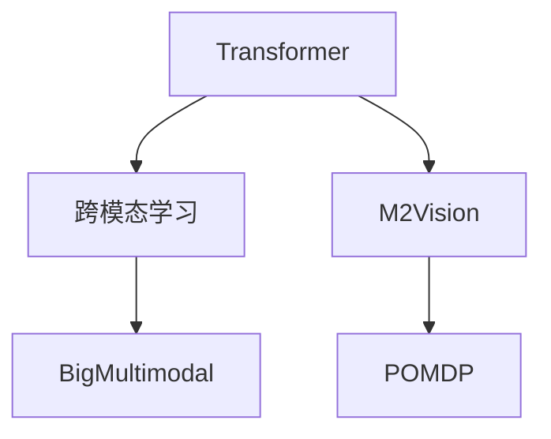

                 

# 多模态大模型：技术原理与实战 多模态模型的发展历史

> 关键词：多模态大模型,Transformer,跨模态学习,多模态模型发展历史,技术原理,实战案例

## 1. 背景介绍

### 1.1 问题由来
在过去几十年里，人工智能(AI)和机器学习(ML)技术已经取得了显著进展。然而，传统的单一模态模型，如仅处理文本或图像的模型，在处理现实世界的复杂任务时往往显得力不从心。这些任务通常涉及多种数据类型，如文本、图像、音频和视频等。

为此，多模态大模型（Multimodal Large Models）应运而生。这些模型结合了深度学习的强大能力和多模态数据的丰富信息，可以更好地理解和处理复杂的多模态数据，提升AI系统的智能化水平。多模态学习技术已经成为人工智能研究中的热点方向，吸引了众多研究者和工业界从业者的关注。

### 1.2 问题核心关键点
多模态学习指的是处理和融合多种数据类型的学习范式，这些数据类型包括文本、图像、声音和视频等。多模态大模型一般基于深度学习框架，能够从大规模多模态数据中提取和联合表示，并在多种数据类型之间进行联合推理，实现对复杂多模态数据的理解和生成。

多模态模型主要有两大类型：
1. **基于多模态特征编码器（Feature Encoder）的模型**：这些模型将不同模态的数据编码成共享的嵌入空间，然后应用共享的表示进行多模态推理。
2. **跨模态编码器-解码器（Encoder-Decoder）的模型**：这些模型通过跨模态编码器将不同模态的信息进行编码，并使用跨模态解码器在编码表示之间进行推理。

当前，基于Transformer架构的多模态大模型已经成为了主流技术，比如BigMultimodal、M2Vision、POMDP等模型。这些模型不仅在学术界得到了广泛应用，而且在工业界也逐步开始落地。

## 2. 核心概念与联系

### 2.1 核心概念概述

为更好地理解多模态大模型的技术原理和应用，本节将介绍几个关键概念：

- **Transformer**：是一种基于自注意力机制的深度学习模型，主要用于处理序列数据，如自然语言和音频信号。Transformer在处理多模态数据时也表现出色。
- **跨模态学习（Cross-Modal Learning）**：指在处理多种数据类型（如文本、图像、音频等）时，模型能够利用不同模态的信息，提高对数据的理解和生成能力。
- **多模态模型发展历史**：从早期的多模态融合方法，到现代基于深度学习的跨模态大模型，多模态学习技术经历了几次重大发展，每一次都推动了AI技术的应用水平提升。

这些概念之间的逻辑关系可以通过以下Mermaid流程图来展示：



这个流程图展示了Transformer模型在多模态学习中的核心地位，以及几种主要的多模态大模型。

## 3. 核心算法原理 & 具体操作步骤
### 3.1 算法原理概述

多模态大模型的核心思想是利用深度学习框架，从多种数据源中提取和联合表示，并在此基础上进行联合推理。这一过程可以分为以下几个关键步骤：

1. **数据预处理**：将不同模态的数据转换成统一的表示形式，如文本数据转化为嵌入向量，图像数据转化为特征图等。
2. **特征编码**：使用深度学习模型（如卷积神经网络、Transformer等）对各模态数据进行编码，得到低维度的表示。
3. **跨模态融合**：通过多模态池化或跨模态注意力机制，将不同模态的表示进行融合，得到联合的跨模态表示。
4. **多模态推理**：使用解码器对跨模态表示进行处理，得到最终的推理结果，如文本生成、图像描述、语音识别等。

### 3.2 算法步骤详解

以下将以M2Vision模型为例，详细讲解多模态大模型的具体实现步骤：

**Step 1: 数据预处理**
1. 对输入的图像进行预处理，包括调整大小、归一化等。
2. 对输入的文本进行预处理，包括分词、转换为向量等。
3. 将不同模态的数据编码成统一的表示形式。

**Step 2: 特征编码**
1. 对图像数据使用卷积神经网络（CNN）进行特征提取，得到高维特征图。
2. 对文本数据使用Transformer模型进行编码，得到序列表示。
3. 将不同模态的表示传递给跨模态编码器。

**Step 3: 跨模态融合**
1. 使用跨模态池化或跨模态注意力机制，将图像和文本的表示进行融合。
2. 得到联合的跨模态表示，供后续的推理使用。

**Step 4: 多模态推理**
1. 使用跨模态解码器对融合后的跨模态表示进行处理，得到最终的推理结果。
2. 对结果进行后处理，如解码文本、分类图像等。

### 3.3 算法优缺点

多模态大模型具有以下优点：
1. **数据融合能力强**：能够处理多种数据类型，融合不同模态的信息，提高推理效果。
2. **泛化能力强**：适用于多种复杂多模态数据，如自然语言处理、计算机视觉、语音识别等。
3. **推理能力高**：在多模态推理任务上，能够进行更加准确的推理和预测。

同时，这些模型也存在一些局限性：
1. **模型复杂度高**：由于需要处理多种数据类型，模型的复杂度较高。
2. **训练成本高**：需要大量高质量的多模态数据进行训练，训练成本较高。
3. **推理速度慢**：由于模型结构复杂，推理速度较慢，可能影响实际应用。

### 3.4 算法应用领域

多模态大模型在多个领域具有广泛的应用，例如：

- **自然语言处理（NLP）**：通过融合文本和图像信息，提升问答、文本生成等任务的性能。
- **计算机视觉（CV）**：在图像识别、视频分析、目标检测等任务中，多模态大模型可以提供更准确的推理结果。
- **语音识别（ASR）**：结合文本和语音信息，提高语音识别的准确率和鲁棒性。
- **机器人学**：通过多模态感知和推理，提升机器人与环境互动的能力。
- **智慧城市**：在城市监控、交通管理等应用中，多模态模型可以提供更全面、实时的数据处理和分析。

## 4. 数学模型和公式 & 详细讲解 & 举例说明

### 4.1 数学模型构建

多模态大模型的数学模型可以表示为：

$$
y = M(x_1, x_2, ..., x_n)
$$

其中，$y$表示推理结果，$x_1, x_2, ..., x_n$分别表示不同模态的输入数据。$M$表示多模态模型，可以通过以下步骤构建：

1. **特征编码**：使用深度学习模型对不同模态的数据进行编码，得到低维度的表示。
2. **跨模态融合**：使用池化或注意力机制，将不同模态的表示进行融合，得到联合的跨模态表示。
3. **多模态推理**：使用解码器对跨模态表示进行处理，得到最终的推理结果。

### 4.2 公式推导过程

以图像文本融合为例，我们可以使用Transformer模型对文本进行编码，得到序列表示$V$。然后，使用CNN对图像进行特征提取，得到特征图$F$。

图像文本融合的过程可以表示为：

$$
C = \text{CNN}(F)
$$

$$
V' = \text{Attention}(V, C)
$$

其中，$\text{Attention}$表示跨模态注意力机制，用于将图像和文本的表示进行融合。

最终的推理结果$y$可以表示为：

$$
y = \text{Decoder}(V')
$$

### 4.3 案例分析与讲解

以M2Vision模型为例，该模型结合了视觉和文本信息，能够进行图像描述生成、图像问答等任务。M2Vision模型主要包含以下几个部分：

- **视觉编码器**：用于对图像进行特征提取和编码，得到高维特征图。
- **文本编码器**：用于对文本进行编码，得到序列表示。
- **跨模态融合层**：使用跨模态注意力机制，将视觉和文本的表示进行融合。
- **文本生成器**：用于对融合后的表示进行处理，生成图像描述。

## 5. 项目实践：代码实例和详细解释说明
### 5.1 开发环境搭建

在进行多模态大模型开发前，我们需要准备好开发环境。以下是使用Python进行TensorFlow开发的环境配置流程：

1. 安装Anaconda：从官网下载并安装Anaconda，用于创建独立的Python环境。

2. 创建并激活虚拟环境：
```bash
conda create -n tf-env python=3.8 
conda activate tf-env
```

3. 安装TensorFlow：根据CUDA版本，从官网获取对应的安装命令。例如：
```bash
conda install tensorflow -c pytorch -c conda-forge
```

4. 安装相关库：
```bash
pip install numpy pandas scikit-learn torch transformers
```

完成上述步骤后，即可在`tf-env`环境中开始多模态大模型的开发。

### 5.2 源代码详细实现

下面以M2Vision模型为例，给出使用TensorFlow进行图像文本融合的代码实现。

首先，定义图像和文本数据处理函数：

```python
import tensorflow as tf
import numpy as np
from transformers import TFAutoModelForMultimodal

def load_images(data_dir):
    images = []
    labels = []
    for image_file in os.listdir(data_dir):
        image = tf.keras.preprocessing.image.load_img(os.path.join(data_dir, image_file), target_size=(224, 224))
        image = tf.keras.preprocessing.image.img_to_array(image)
        image = tf.keras.applications.mobilenet_v2.preprocess_input(image)
        images.append(image)
        labels.append(image_file)
    return np.array(images), np.array(labels)

def load_texts(data_dir):
    texts = []
    labels = []
    for text_file in os.listdir(data_dir):
        with open(os.path.join(data_dir, text_file), 'r') as f:
            text = f.read()
            texts.append(text)
            labels.append(text_file)
    return np.array(texts), np.array(labels)

def preprocess_data(images, texts):
    images = images / 255.0
    return images, texts
```

然后，定义模型和训练函数：

```python
model = TFAutoModelForMultimodal.from_pretrained('m2vision/m2vision-base')

def train_epoch(model, dataset, batch_size, optimizer):
    for images, texts in dataset:
        images = preprocess_data(images)
        texts = preprocess_data(texts)
        
        with tf.GradientTape() as tape:
            outputs = model(images, texts)
            loss = tf.keras.losses.categorical_crossentropy(tf.keras.layers.flatten(outputs), labels)
        gradients = tape.gradient(loss, model.trainable_variables)
        optimizer.apply_gradients(zip(gradients, model.trainable_variables))
        
def evaluate(model, dataset, batch_size):
    test_loss = tf.keras.metrics.Mean()
    test_accuracy = tf.keras.metrics.SparseCategoricalAccuracy()
    for images, texts in dataset:
        images = preprocess_data(images)
        texts = preprocess_data(texts)
        
        with tf.GradientTape() as tape:
            outputs = model(images, texts)
            test_loss.update_state(tf.keras.losses.categorical_crossentropy(tf.keras.layers.flatten(outputs), labels), sample_weight=tf.ones_like(labels))
            test_accuracy.update_state(tf.argmax(outputs, axis=-1), labels)
    return test_loss.result(), test_accuracy.result()

epochs = 5
batch_size = 16
optimizer = tf.keras.optimizers.Adam(learning_rate=2e-5)
```

最后，启动训练流程并在测试集上评估：

```python
for epoch in range(epochs):
    train_epoch(model, train_dataset, batch_size, optimizer)
    
    test_loss, test_accuracy = evaluate(model, test_dataset, batch_size)
    print(f'Epoch {epoch+1}, test loss: {test_loss:.4f}, test accuracy: {test_accuracy:.4f}')
```

以上就是使用TensorFlow对M2Vision模型进行图像文本融合的完整代码实现。可以看到，通过TensorFlow的深度学习框架，可以很方便地构建和训练多模态大模型。

### 5.3 代码解读与分析

让我们再详细解读一下关键代码的实现细节：

**图像和文本数据加载**：
- `load_images`函数：读取图像文件，并进行预处理，包括调整大小、归一化等。
- `load_texts`函数：读取文本文件，并进行预处理，包括读取文本内容。

**模型和优化器定义**：
- `TFAutoModelForMultimodal`：使用HuggingFace的Transformer库，定义多模态大模型。
- `Adam`：定义优化器，用于模型参数更新。

**训练和评估函数**：
- `train_epoch`函数：对数据集进行迭代训练，计算损失并更新模型参数。
- `evaluate`函数：对模型在测试集上的性能进行评估，输出损失和准确率。

**训练流程**：
- 循环迭代`epochs`次，每次迭代训练一个batch的数据。
- 在每个epoch结束时，对测试集进行评估，输出当前模型的性能。

通过上述代码的实现，可以看出TensorFlow框架在多模态大模型开发中的强大能力。开发者可以通过简单的调用API，快速构建和训练复杂的多模态模型。

## 6. 实际应用场景

### 6.1 智能安防系统

智能安防系统是当今智慧城市建设中的重要组成部分。通过多模态大模型，可以实现对视频、音频等多模态数据的综合处理，提升安防系统的智能化水平。

具体而言，可以使用摄像头采集视频和音频数据，结合人脸识别、语音识别等技术，实时监测并分析异常行为。当检测到可疑活动时，系统可以自动报警并记录相关数据，为后续的分析和处理提供支持。

### 6.2 智能医疗诊断

医疗诊断是人工智能技术的重要应用领域之一。多模态大模型可以结合文本、图像、声音等多种数据类型，提升疾病诊断的准确性和全面性。

例如，在影像诊断中，可以将医生撰写的病历与X光、CT等医学影像数据进行融合，结合医生的临床经验，提供更加准确的诊断结果。在语音诊断中，结合语音识别和文本分析技术，可以自动记录并分析患者的对话内容，辅助医生进行诊断。

### 6.3 智能客服系统

智能客服系统是企业与用户交互的重要桥梁。通过多模态大模型，可以实现更加自然、智能的客服体验。

例如，在智能客服对话中，可以结合用户的语音、文字输入和表情等多种信息，进行全面分析，快速响应并解决用户的问题。多模态大模型还可以结合自然语言处理和语音识别技术，提升客服系统的智能化水平。

## 7. 工具和资源推荐

### 7.1 学习资源推荐

为了帮助开发者系统掌握多模态大模型的技术原理和应用技巧，这里推荐一些优质的学习资源：

1. 《深度学习入门之多模态学习》系列博文：由大模型技术专家撰写，深入浅出地介绍了多模态学习的基本概念、经典模型和应用实践。

2. CS231n《计算机视觉课程》：斯坦福大学开设的计算机视觉明星课程，涵盖了多模态学习的多项内容，包括图像、文本、音频等数据类型的处理。

3. 《Multimodal Deep Learning for Natural Language Understanding》书籍：Transformer库的作者所著，详细介绍了多模态深度学习在自然语言理解中的应用。

4. Arxiv Multimodal Learning资源库：包含大量多模态学习相关的研究论文和代码实现，是学习多模态大模型的重要资料。

5. NVIDIA Deep Learning SDK：包含多模态深度学习相关的预训练模型和工具包，助力开发者快速开发和实验多模态大模型。

通过对这些资源的学习实践，相信你一定能够快速掌握多模态大模型的精髓，并用于解决实际的NLP问题。

### 7.2 开发工具推荐

高效的开发离不开优秀的工具支持。以下是几款用于多模态大模型开发的常用工具：

1. TensorFlow：由Google主导开发的深度学习框架，灵活高效，支持多模态数据处理。

2. PyTorch：由Facebook开发的深度学习框架，灵活动态的计算图，支持多模态数据处理和分布式训练。

3. TensorFlow Hub：NVIDIA推出的深度学习模型和工具库，包含大量预训练的多模态模型，方便开发者快速搭建多模态大模型。

4. OpenAI Codex：基于多模态大模型的代码生成工具，能够从自然语言中生成高质量的代码，提升编程效率。

5. NVIDIA NVidia-Transformer：支持多模态大模型的推理引擎，提供高效的模型部署和推理能力。

合理利用这些工具，可以显著提升多模态大模型开发和部署的效率，加速技术创新的步伐。

### 7.3 相关论文推荐

多模态大模型和相关技术的发展得益于学界的持续研究。以下是几篇奠基性的相关论文，推荐阅读：

1. Transformer X: Attentions Are All You Need：提出了Transformer模型，奠定了多模态大模型的基础。

2. Vision-and-Language Navigation：研究了视觉和语言数据融合的方法，用于导航任务。

3. Multimodal Transformer Networks：提出了一种跨模态Transformer网络，用于处理多模态数据。

4. Multimodal Video and Audio-Text Description：研究了多模态音频和视频描述生成任务，提出了基于多模态Transformer的方法。

5. Multimodal Sequence-to-Sequence Learning for Text and Image Generation：提出了一种跨模态序列生成模型，用于文本和图像的联合生成。

这些论文代表了大模态大模型技术的发展脉络。通过学习这些前沿成果，可以帮助研究者把握学科前进方向，激发更多的创新灵感。

## 8. 总结：未来发展趋势与挑战

### 8.1 总结

本文对多模态大模型的技术原理与实战进行了全面系统的介绍。首先阐述了多模态大模型的背景和意义，明确了多模态学习在AI技术发展中的重要地位。其次，从原理到实践，详细讲解了多模态大模型的数学模型和操作步骤，给出了多模态大模型的完整代码实例。同时，本文还广泛探讨了多模态大模型在智能安防、智能医疗、智能客服等诸多行业领域的应用前景，展示了多模态大模型技术的巨大潜力。此外，本文精选了多模态大模型的各类学习资源，力求为读者提供全方位的技术指引。

通过本文的系统梳理，可以看到，多模态大模型正在成为AI技术发展的重要方向，极大地拓展了深度学习的应用边界，催生了更多的落地场景。得益于多模态数据的丰富信息，多模态大模型在处理复杂多模态数据时表现出色，为AI技术的发展提供了新的动力。未来，伴随多模态学习技术的持续演进，相信AI技术将更好地融入人类生产生活的方方面面，推动智能化社会的构建。

### 8.2 未来发展趋势

展望未来，多模态大模型技术将呈现以下几个发展趋势：

1. **多模态融合技术**：融合更多数据类型，如声音、触觉、味觉等，提升对现实世界的理解和建模能力。

2. **多模态推理机制**：发展更加智能的跨模态推理技术，如因果推断、图模型等，提升多模态推理的效果。

3. **多模态生成能力**：发展更加高效的多模态生成技术，如多模态序列生成、多模态文本图像生成等，提升生成质量。

4. **多模态模型优化**：优化多模态模型的结构，如采用跨模态注意力机制、跨模态池化等，提升模型性能。

5. **跨模态共享表示**：发展跨模态共享表示技术，如向量对齐、多模态特征融合等，提升模型泛化能力。

6. **多模态数据增强**：发展多模态数据增强技术，如数据合成、数据标注等，提升模型的数据利用率。

以上趋势凸显了多模态大模型技术的前景，这些方向的探索发展，必将进一步提升AI系统的智能化水平，为各行各业带来新的变革性影响。

### 8.3 面临的挑战

尽管多模态大模型技术已经取得了显著进展，但在迈向更加智能化、普适化应用的过程中，它仍面临着诸多挑战：

1. **数据获取成本高**：多模态数据的采集和标注成本较高，需要大量高质量的数据资源。如何高效获取和标注多模态数据，是一个重要的挑战。

2. **模型复杂度高**：多模态大模型的结构复杂，训练和推理成本高，需要高性能的计算资源。如何简化模型结构，降低计算成本，是一个需要解决的问题。

3. **跨模态对齐难度大**：不同模态的数据具有不同的特征空间，如何实现跨模态对齐，使得各模态的信息能够有效融合，是一个关键难题。

4. **推理速度慢**：多模态大模型由于结构复杂，推理速度较慢，可能影响实际应用。如何提高推理速度，是一个需要优化的问题。

5. **模型泛化能力不足**：多模态大模型在泛化能力方面表现不佳，难以适应不同的数据分布和应用场景。如何提升模型的泛化能力，是一个需要解决的问题。

6. **模型可解释性差**：多模态大模型的决策过程复杂，难以解释其内部工作机制和推理逻辑。如何赋予模型更强的可解释性，是一个亟待解决的问题。

7. **伦理和安全问题**：多模态大模型可能包含偏见、有害信息等，如何保证模型的伦理和安全，是一个重要的挑战。

这些挑战凸显了多模态大模型技术的发展瓶颈，需要各界共同努力，才能推动多模态大模型技术的成熟和应用。

### 8.4 研究展望

面对多模态大模型技术所面临的挑战，未来的研究需要在以下几个方面寻求新的突破：

1. **高效数据获取和标注**：开发更加高效的数据采集和标注方法，如自动标注、主动学习等，降低数据获取和标注成本。

2. **简化模型结构**：优化多模态大模型的结构，采用轻量级模型和高效推理引擎，提升模型的实时性和可扩展性。

3. **跨模态对齐技术**：发展更加有效的跨模态对齐技术，如向量对齐、图模型等，提升跨模态信息融合的效果。

4. **多模态生成技术**：发展高效的多模态生成技术，如多模态序列生成、多模态文本图像生成等，提升生成质量。

5. **多模态推理机制**：发展更加智能的跨模态推理技术，如因果推断、图模型等，提升多模态推理的效果。

6. **多模态数据增强**：发展多模态数据增强技术，如数据合成、数据标注等，提升模型的数据利用率。

7. **跨模态共享表示**：发展跨模态共享表示技术，如向量对齐、多模态特征融合等，提升模型泛化能力。

8. **多模态模型优化**：优化多模态模型的结构和训练过程，如采用跨模态注意力机制、跨模态池化等，提升模型性能。

9. **伦理和安全保障**：引入伦理导向的评估指标，过滤和惩罚有偏见、有害的输出倾向，加强模型行为的监管机制，确保输出符合人类价值观和伦理道德。

这些研究方向将为多模态大模型技术带来新的突破，推动其在更多领域的应用和落地，实现更加智能化、普适化的AI系统。

## 9. 附录：常见问题与解答

**Q1：多模态大模型是否适用于所有应用场景？**

A: 多模态大模型适用于多种复杂多模态数据处理场景，如图像识别、文本生成、视频分析等。但在一些特定的应用场景，如高频交易、金融预测等，多模态大模型可能不是最优选择。此时需要根据具体需求，选择合适的模型和方法。

**Q2：多模态大模型的训练成本高，如何降低成本？**

A: 降低多模态大模型训练成本的方法包括：
1. 数据增强：通过数据合成、数据标注等方法，扩充数据集，提高模型的泛化能力。
2. 迁移学习：在已有模型基础上进行微调，降低训练成本。
3. 分布式训练：采用分布式训练方法，提高训练效率，降低单个模型的训练成本。

**Q3：多模态大模型在推理过程中如何提升速度？**

A: 提升多模态大模型推理速度的方法包括：
1. 模型剪枝：去除不必要的层和参数，减小模型尺寸，加快推理速度。
2. 量化加速：将浮点模型转为定点模型，压缩存储空间，提高计算效率。
3. 推理引擎：使用高效的推理引擎，如TensorFlow Lite、TensorRT等，提升推理速度。

**Q4：多模态大模型的可解释性如何提升？**

A: 提升多模态大模型的可解释性方法包括：
1. 可解释模型：选择可解释性更强的模型结构，如规则模型、知识图谱等。
2. 特征可视化：通过可视化技术，展示模型各层的输入输出，帮助理解模型的决策过程。
3. 属性分析：分析模型对不同属性的敏感性，提升模型的可解释性。

这些问题的解答，可以为多模态大模型在实际应用中的高效利用提供指导，有助于推动多模态大模型技术的进一步发展。

---

作者：禅与计算机程序设计艺术 / Zen and the Art of Computer Programming

