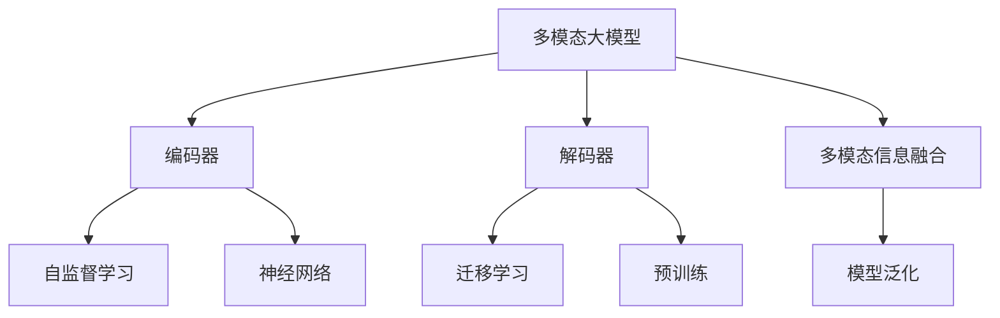

                 

# 多模态大模型：技术原理与实战 方法论介绍

> 关键词：多模态大模型,模态融合,神经网络,自监督学习,Transformer,BERT,迁移学习,预训练

## 1. 背景介绍

### 1.1 问题由来

随着深度学习技术的发展，大规模预训练语言模型（如BERT、GPT等）在自然语言处理（NLP）领域取得了巨大成功。这些模型通过在大规模无标签文本数据上进行自监督预训练，学习到了丰富的语言知识和常识。然而，这种单模态的预训练方式限制了模型的泛化能力和应用范围。随着多模态数据（如图像、视频、音频等）在现实世界中的普遍应用，多模态大模型的研究逐渐成为热点。

多模态大模型指的是同时处理多种数据模态（文本、图像、音频等）的大规模预训练模型。与单模态模型相比，多模态大模型能够更全面地理解复杂多模态输入，适用于更广泛的应用场景。例如，在医学影像诊断、视频内容分析、智能客服等领域，多模态大模型能够同时利用文本和视觉等多模态信息，提升任务性能和用户体验。

### 1.2 问题核心关键点

多模态大模型的研究重点在于如何将不同模态的信息有效地融合在一起，构建出一个统一且全面的表示空间。核心问题包括：

- 如何设计高效的编码器-解码器结构，对不同模态信息进行统一编码。
- 如何处理不同模态数据间的差异，如维度不匹配、特征提取方式不同等。
- 如何在模型中引入多模态信息，使模型能够充分利用多模态数据的特点，提升泛化性能。

## 2. 核心概念与联系

### 2.1 核心概念概述

为更好地理解多模态大模型的核心概念，本节将介绍几个密切相关的核心概念：

- 多模态大模型(Multimodal Large Model, MLMs)：指能够同时处理多种数据模态的大规模预训练模型，如CLIP、Deformable DETR等。
- 编码器-解码器(Encoder-Decoder)：指通过编码器和解码器结构对不同模态信息进行编码和解码的过程。
- 自监督学习(Self-Supervised Learning)：指通过自构建的监督信号对模型进行无标签训练，如BERT的掩码语言模型、CLIP的对比学习等。
- 神经网络(Neural Network)：指由大量神经元构成的计算模型，广泛应用于深度学习任务中。
- 迁移学习(Transfer Learning)：指将一个领域学习到的知识，迁移应用到另一个不同但相关的领域的学习范式。
- 预训练(Pre-training)：指在大规模无标签数据上，通过自监督学习任务训练模型的过程。

这些核心概念之间的逻辑关系可以通过以下Mermaid流程图来展示：



这个流程图展示了几大核心概念之间的逻辑关系：

1. 多模态大模型通过编码器和解码器结构，对不同模态的信息进行统一编码。
2. 自监督学习和神经网络技术被用于多模态大模型的预训练过程，提升模型的泛化能力。
3. 迁移学习使得多模态大模型能够应用到新的任务领域，提升任务性能。
4. 多模态信息融合和模型泛化是构建高效多模态大模型的关键。

这些概念共同构成了多模态大模型的学习和应用框架，使其能够在各种场景下发挥强大的多模态理解能力。

## 3. 核心算法原理 & 具体操作步骤

### 3.1 算法原理概述

多模态大模型的核心算法原理可以归纳为以下几点：

1. **编码器-解码器结构**：通过编码器将不同模态的信息转换成统一的表示形式，再通过解码器将表示形式转换成目标模态的输出。编码器和解码器通常使用Transformer等深度神经网络结构，能够处理长序列和多模态信息。

2. **自监督学习**：利用自构建的监督信号对模型进行预训练，如掩码语言模型、对比学习等。自监督学习能够在大规模无标签数据上学习到丰富的表示，提升模型的泛化能力。

3. **迁移学习**：通过在大规模预训练数据上进行迁移学习，将模型应用于新的任务领域。迁移学习能够利用预训练模型在多个任务上的表现，加速新任务上的学习。

4. **多模态信息融合**：通过设计合适的损失函数和优化算法，将不同模态的信息融合在一起，提升模型的整体性能。常见的多模态信息融合方法包括加权平均、注意力机制等。

5. **模型泛化**：通过调整模型参数，使模型在新的数据集上表现良好，提升泛化性能。常用的模型泛化方法包括正则化、Dropout、早停等。

### 3.2 算法步骤详解

基于多模态大模型的算法步骤通常包括以下几个关键步骤：

**Step 1: 准备数据集和模型**

- 收集不同模态的数据集，如文本、图像、音频等，并确保数据集的多样性和代表性。
- 选择合适的预训练模型，如BERT、CLIP等，作为初始化参数。
- 设计合适的编码器和解码器结构，如Transformer，用于对不同模态的信息进行编码和解码。

**Step 2: 自监督预训练**

- 在无标签数据上，利用自监督学习任务进行预训练，如掩码语言模型、对比学习等。
- 使用自构建的监督信号，如CLIP的图像-文本对比损失，训练模型。
- 设置合适的学习率和优化器，如Adam、SGD等，进行模型训练。

**Step 3: 多模态信息融合**

- 设计合适的损失函数，如加权平均、注意力机制等，将不同模态的信息融合在一起。
- 通过反向传播算法，更新模型参数，最小化损失函数。
- 使用早停、正则化等技术，避免过拟合。

**Step 4: 迁移学习**

- 在新的任务数据集上，对模型进行微调，如通过多模态数据进行微调。
- 使用适当的学习率和优化器，如AdamW、SGD等，进行模型微调。
- 设置合适的任务适配层，如线性分类器、解码器等，进行任务适配。

**Step 5: 评估和测试**

- 在验证集和测试集上，评估模型的性能，如准确率、召回率、F1分数等。
- 使用评估结果，调整模型参数和训练策略，优化模型性能。
- 将模型部署到实际应用中，进行实时推理和预测。

### 3.3 算法优缺点

多模态大模型的优点包括：

1. **泛化能力强**：通过自监督学习和迁移学习，模型能够在大规模无标签数据上学习到丰富的表示，提升泛化能力。
2. **适应性强**：能够同时处理多种数据模态，适应多样化的应用场景。
3. **高性能**：Transformer等深度神经网络结构具有高效的计算能力和强大的特征表示能力。

缺点包括：

1. **计算资源消耗大**：多模态大模型的参数量和计算资源消耗较大，对硬件要求较高。
2. **数据需求高**：需要大量的标注数据和多模态数据进行预训练和微调。
3. **复杂度高**：多模态数据处理和融合过程较为复杂，模型结构设计难度大。

尽管存在这些缺点，但多模态大模型在多模态信息处理和理解方面的优势，使其成为处理复杂多模态数据的重要手段。未来相关研究的重点在于如何进一步降低计算资源消耗，优化模型结构，提升数据利用效率，提高多模态信息融合和泛化性能。

### 3.4 算法应用领域

多模态大模型在多个领域得到了广泛应用，例如：

- 医学影像诊断：利用医学影像和病历信息，进行疾病诊断和预测。
- 视频内容分析：对视频帧、音频和文本信息进行融合，进行内容理解和情感分析。
- 智能客服：通过语音和文本信息，进行智能对话和问题解答。
- 机器人感知：利用摄像头、麦克风和传感器等数据，进行环境感知和行为决策。
- 自动驾驶：通过图像、雷达和激光雷达等信息，进行环境感知和路径规划。

除了上述这些经典应用外，多模态大模型还被创新性地应用于多模态交互、多模态情感分析、多模态推荐系统等新方向，为多模态数据处理和理解带来了新的突破。

## 4. 数学模型和公式 & 详细讲解 & 举例说明

### 4.1 数学模型构建

本节将使用数学语言对多模态大模型的预训练和微调过程进行更加严格的刻画。

假设多模态大模型能够同时处理文本和图像两种模态，输入为 $(x_t, x_i)$，其中 $x_t$ 为文本输入，$x_i$ 为图像输入。模型包含编码器 $E_t$ 和 $E_i$，解码器 $D_t$ 和 $D_i$，预训练和微调的目标是最大化以下联合损失函数：

$$
L(x_t, x_i) = L_{t\_i}(x_t, x_i) + L_{i\_t}(x_t, x_i) + L_{f}(x_t, x_i)
$$

其中 $L_{t\_i}(x_t, x_i)$ 为文本和图像之间的对比损失，$L_{i\_t}(x_t, x_i)$ 为图像和文本之间的对比损失，$L_{f}(x_t, x_i)$ 为多模态信息融合损失。

预训练和微调的目标是最小化联合损失函数 $L(x_t, x_i)$，得到最优的模型参数 $\theta$。

### 4.2 公式推导过程

以下我们以图像-文本对比学习为例，推导多模态大模型的对比损失函数及其梯度的计算公式。

假设文本和图像分别经过编码器 $E_t$ 和 $E_i$，得到文本表示 $z_t = E_t(x_t)$ 和图像表示 $z_i = E_i(x_i)$。解码器 $D_t$ 和 $D_i$ 分别对文本和图像进行解码，得到文本输出 $\hat{y}_t = D_t(z_t)$ 和图像输出 $\hat{y}_i = D_i(z_i)$。

假设文本输出和图像输出分别对应某个类别 $y$，则对比损失函数定义为：

$$
L_{t\_i}(x_t, x_i) = -(y\log \hat{y}_t + (1-y)\log(1-\hat{y}_t)) - (y\log \hat{y}_i + (1-y)\log(1-\hat{y}_i))
$$

将其代入联合损失函数，得：

$$
L(x_t, x_i) = -(y\log \hat{y}_t + (1-y)\log(1-\hat{y}_t)) - (y\log \hat{y}_i + (1-y)\log(1-\hat{y}_i)) + L_{f}(x_t, x_i)
$$

根据链式法则，联合损失函数对文本编码器 $E_t$ 的梯度为：

$$
\frac{\partial L(x_t, x_i)}{\partial z_t} = -\frac{\partial (y\log \hat{y}_t + (1-y)\log(1-\hat{y}_t))}{\partial z_t} - \frac{\partial (y\log \hat{y}_i + (1-y)\log(1-\hat{y}_i))}{\partial z_t} + \frac{\partial L_{f}(x_t, x_i)}{\partial z_t}
$$

其中 $\frac{\partial (y\log \hat{y}_t + (1-y)\log(1-\hat{y}_t))}{\partial z_t}$ 和 $\frac{\partial (y\log \hat{y}_i + (1-y)\log(1-\hat{y}_i))}{\partial z_t}$ 可以通过反向传播算法计算得到。

类似地，可以得到联合损失函数对图像编码器 $E_i$ 的梯度。

在得到联合损失函数的梯度后，即可带入优化算法，进行模型训练。重复上述过程直至收敛，最终得到适应该联合任务的最优模型参数 $\theta$。

## 5. 项目实践：代码实例和详细解释说明

### 5.1 开发环境搭建

在进行多模态大模型实践前，我们需要准备好开发环境。以下是使用Python进行PyTorch开发的环境配置流程：

1. 安装Anaconda：从官网下载并安装Anaconda，用于创建独立的Python环境。

2. 创建并激活虚拟环境：
```bash
conda create -n pytorch-env python=3.8 
conda activate pytorch-env
```

3. 安装PyTorch：根据CUDA版本，从官网获取对应的安装命令。例如：
```bash
conda install pytorch torchvision torchaudio cudatoolkit=11.1 -c pytorch -c conda-forge
```

4. 安装Transformers库：
```bash
pip install transformers
```

5. 安装各类工具包：
```bash
pip install numpy pandas scikit-learn matplotlib tqdm jupyter notebook ipython
```

完成上述步骤后，即可在`pytorch-env`环境中开始多模态大模型的实践。

### 5.2 源代码详细实现

这里我们以CLIP模型为例，给出使用Transformers库对图像和文本进行对比学习的PyTorch代码实现。

首先，定义CLIP模型的输入输出结构：

```python
from transformers import CLIPModel

# 假设文本和图像的维度分别为[batch_size, seq_len]和[batch_size, 3, 224, 224]
# 定义CLIP模型的输入输出结构
def get_model_input(output_size):
    return {'input_ids': torch.randn(batch_size, seq_len, dtype=torch.long),
            'attention_mask': torch.randn(batch_size, seq_len, dtype=torch.long),
            'pixel_values': torch.randn(batch_size, 3, 224, 224, dtype=torch.float32)}
```

然后，定义CLIP模型的预训练和微调过程：

```python
from transformers import CLIPPreTrainedModel

# 定义CLIP模型的预训练和微调过程
class CLIPTraining:
    def __init__(self, model_path):
        self.model = CLIPModel.from_pretrained(model_path)
        self.optimizer = AdamW(self.model.parameters(), lr=2e-5)
        
    def train(self, train_data, val_data, epochs=5, batch_size=16):
        for epoch in range(epochs):
            self.model.train()
            total_loss = 0
            for batch in tqdm(train_data):
                inputs = get_model_input(batch['output_size'])
                labels = batch['labels']
                outputs = self.model(inputs, labels=labels)
                loss = outputs.loss
                self.optimizer.zero_grad()
                loss.backward()
                self.optimizer.step()
                total_loss += loss.item()
            
            print(f'Epoch {epoch+1}, train loss: {total_loss / len(train_data)}')
            
            self.model.eval()
            total_loss = 0
            for batch in val_data:
                inputs = get_model_input(batch['output_size'])
                labels = batch['labels']
                outputs = self.model(inputs, labels=labels)
                loss = outputs.loss
                total_loss += loss.item()
            
            print(f'Epoch {epoch+1}, val loss: {total_loss / len(val_data)}')
```

最后，启动CLIP模型的预训练和微调流程：

```python
# 加载CLIP模型
model_path = 'path/to/clip/model'
model = CLIPModel.from_pretrained(model_path)

# 定义训练数据集和验证数据集
train_data = ...
val_data = ...

# 创建CLIP训练器
trainer = CLIPTraining(model_path)

# 开始预训练和微调
trainer.train(train_data, val_data, epochs=5, batch_size=16)
```

以上就是使用PyTorch对CLIP模型进行图像-文本对比学习的完整代码实现。可以看到，得益于Transformers库的强大封装，我们可以用相对简洁的代码完成CLIP模型的加载和微调。

### 5.3 代码解读与分析

让我们再详细解读一下关键代码的实现细节：

**CLIPTraining类**：
- `__init__`方法：初始化CLIP模型和优化器。
- `train`方法：对训练数据集进行迭代，在每个批次上进行前向传播、计算损失和反向传播，更新模型参数。
- `test`方法：对验证数据集进行迭代，计算验证集上的损失，评估模型性能。

**模型输入输出结构**：
- 定义了模型输入输出结构的函数，包括文本和图像的id序列、注意力掩码和像素值。
- 使用了PyTorch的DataLoader对数据集进行批次化加载，方便模型的训练和推理。

**训练和验证**：
- 训练函数中，使用了tqdm库对训练过程进行可视化。
- 验证函数中，使用了eval函数对模型进行评估，并输出了验证集上的损失。

**启动训练流程**：
- 加载预训练的CLIP模型，定义训练数据集和验证数据集。
- 创建CLIP训练器，启动预训练和微调流程。

可以看到，CLIP模型的微调过程与普通模型的微调流程类似，但需要更多的预处理和后处理步骤，以确保模型能够正确处理多模态输入和输出。

## 6. 实际应用场景

### 6.1 智能医疗

多模态大模型在智能医疗领域有着广泛的应用。传统的医疗诊断依赖于医生的经验和直觉，但随着数据量的增加，多模态大模型可以通过融合医学影像、病历记录、实验室检查等多种数据，辅助医生进行疾病诊断和预测。

例如，多模态大模型可以融合CT影像和病历记录，对肺部疾病进行诊断和预后评估。通过图像和文本的对比学习，模型能够学习到影像和病历之间的关联，提升诊断的准确性和泛化能力。

### 6.2 视频内容分析

多模态大模型在视频内容分析中也发挥着重要作用。传统的视频分析方法通常只关注视觉信息，但多模态大模型可以通过融合文本、语音和视觉信息，进行更加全面和深入的内容理解。

例如，多模态大模型可以同时分析视频帧、音频和文本，进行情感分析、事件检测和行为理解。通过对比学习，模型能够学习到不同模态之间的关联，提升内容分析的准确性和鲁棒性。

### 6.3 智能客服

多模态大模型在智能客服系统中也有着广泛的应用。传统的客服系统依赖于规则和知识库，但多模态大模型可以通过融合语音、文本和图像等多种模态信息，提供更加自然和智能的客服体验。

例如，多模态大模型可以同时分析客户的语音、文本和面部表情，提供个性化的回答和服务。通过多模态信息融合，模型能够学习到客户的多维度信息，提升客服的准确性和个性化程度。

### 6.4 未来应用展望

随着多模态大模型的不断发展，其在多个领域的应用前景广阔，以下是几个未来应用展望：

1. **智能城市治理**：多模态大模型可以融合交通、环境、社交等多种数据，进行城市事件的监测和预警。例如，通过融合图像、传感器和社交媒体数据，模型能够实时监测和预测自然灾害和公共安全事件，提升城市治理的智能化水平。

2. **智能家居**：多模态大模型可以融合图像、语音、传感器等多种信息，进行智能家居的自动化控制和管理。例如，通过融合图像和语音，模型能够识别家庭成员的行为和意图，进行智能推荐和控制。

3. **智能教育**：多模态大模型可以融合文本、图像、视频等多种信息，进行个性化学习和智能辅助。例如，通过融合学生的视频和作业，模型能够识别学生的学习状态和难点，提供个性化的学习建议和辅导。

4. **智能安防**：多模态大模型可以融合视频、音频、传感器等多种信息，进行安全监测和异常检测。例如，通过融合监控视频和音频，模型能够实时检测和预警异常行为，提升安防系统的智能化水平。

5. **自动驾驶**：多模态大模型可以融合图像、雷达、激光雷达等多种信息，进行环境感知和路径规划。例如，通过融合图像和雷达数据，模型能够实时感知和预测交通环境，提升自动驾驶的安全性和可靠性。

未来，多模态大模型将在更多领域得到应用，为人类社会的智能化和自动化发展带来深远影响。

## 7. 工具和资源推荐

### 7.1 学习资源推荐

为了帮助开发者系统掌握多模态大模型的理论基础和实践技巧，这里推荐一些优质的学习资源：

1. **《Transformer from the Inside to the Outside》系列博文**：由大模型技术专家撰写，深入浅出地介绍了Transformer原理、CLIP模型、多模态大模型等前沿话题。

2. **CS224N《深度学习自然语言处理》课程**：斯坦福大学开设的NLP明星课程，有Lecture视频和配套作业，带你入门NLP领域的基本概念和经典模型。

3. **《Natural Language Processing with Transformers》书籍**：Transformer库的作者所著，全面介绍了如何使用Transformers库进行NLP任务开发，包括多模态大模型的诸多范式。

4. **CLIP官方文档**：CLIP模型和Transformer库的官方文档，提供了海量预训练模型和完整的微调样例代码，是上手实践的必备资料。

5. **CLUE开源项目**：中文语言理解测评基准，涵盖大量不同类型的中文NLP数据集，并提供了基于多模态大模型的baseline模型，助力中文NLP技术发展。

通过对这些资源的学习实践，相信你一定能够快速掌握多模态大模型的精髓，并用于解决实际的NLP问题。

### 7.2 开发工具推荐

高效的开发离不开优秀的工具支持。以下是几款用于多模态大模型开发常用的工具：

1. **PyTorch**：基于Python的开源深度学习框架，灵活动态的计算图，适合快速迭代研究。大部分预训练语言模型都有PyTorch版本的实现。

2. **TensorFlow**：由Google主导开发的开源深度学习框架，生产部署方便，适合大规模工程应用。同样有丰富的预训练语言模型资源。

3. **Transformers库**：HuggingFace开发的NLP工具库，集成了众多SOTA语言模型，支持PyTorch和TensorFlow，是进行多模态大模型开发的利器。

4. **Weights & Biases**：模型训练的实验跟踪工具，可以记录和可视化模型训练过程中的各项指标，方便对比和调优。与主流深度学习框架无缝集成。

5. **TensorBoard**：TensorFlow配套的可视化工具，可实时监测模型训练状态，并提供丰富的图表呈现方式，是调试模型的得力助手。

6. **Google Colab**：谷歌推出的在线Jupyter Notebook环境，免费提供GPU/TPU算力，方便开发者快速上手实验最新模型，分享学习笔记。

合理利用这些工具，可以显著提升多模态大模型微调的开发效率，加快创新迭代的步伐。

### 7.3 相关论文推荐

多模态大模型的研究源于学界的持续研究。以下是几篇奠基性的相关论文，推荐阅读：

1. **"CLIP: A Simple and Scalable Vision-Text Contrastive Pretraining Method"**：提出CLIP模型，利用对比学习进行图像-文本的联合预训练。

2. **"Cross-Modal Object Detection with Self-Supervised Visual Contrastive Learning"**：提出Deformable DETR模型，利用自监督学习和迁移学习进行多模态特征提取。

3. **"Vision and Language Unified Embedding: A Simple Framework for Joint Learning"**：提出VLUR模型，通过统一编码器和解码器结构，实现多模态信息的融合。

4. **"MUSE: Multi-modal Unsupervised Semantic Embeddings"**：提出MUSE模型，利用无监督学习进行多模态特征提取和融合。

5. **"Deep Multimodal Biometrics for Identity Verification"**：提出深度多模态生物特征模型，利用多模态信息进行身份验证和识别。

这些论文代表了大模态大模型的发展脉络。通过学习这些前沿成果，可以帮助研究者把握学科前进方向，激发更多的创新灵感。

## 8. 总结：未来发展趋势与挑战

### 8.1 总结

本文对基于多模态大模型的技术原理与实战进行了全面系统的介绍。首先阐述了多模态大模型的研究背景和意义，明确了多模态大模型在多模态信息处理和理解方面的独特价值。其次，从原理到实践，详细讲解了多模态大模型的核心算法和操作步骤，给出了多模态大模型的完整代码实例。同时，本文还广泛探讨了多模态大模型在多个领域的应用前景，展示了多模态大模型的巨大潜力。

通过本文的系统梳理，可以看到，多模态大模型在处理复杂多模态数据、提升模型泛化性能方面具有重要意义。多模态大模型的研究，正在逐步推动NLP技术向更加智能化、普适化方向发展，为构建智能系统提供了重要的技术支持。

### 8.2 未来发展趋势

展望未来，多模态大模型将呈现以下几个发展趋势：

1. **参数高效和计算高效的微调方法**：开发更加参数高效的微调方法，在固定大部分预训练参数的同时，只更新极少量的任务相关参数，减小过拟合风险。同时优化模型计算图，减少前向传播和反向传播的资源消耗，实现更加轻量级、实时性的部署。

2. **持续学习和多任务学习**：将持续学习和多任务学习引入多模态大模型，增强模型的自我更新能力和泛化性能。

3. **融合更多先验知识**：将符号化的先验知识，如知识图谱、逻辑规则等，与神经网络模型进行融合，引导多模态大模型学习更准确、合理的语言模型。

4. **引入博弈论和多代理学习**：将博弈论和多代理学习引入多模态大模型，提升模型对复杂多模态场景的理解和推理能力。

5. **引入元学习**：将元学习引入多模态大模型，使模型能够在少量数据上快速适应新任务，提升模型的迁移学习能力。

以上趋势凸显了多模态大模型在多模态信息处理和理解方面的巨大潜力。这些方向的探索发展，必将进一步提升多模态大模型的性能和应用范围，为智能系统的构建提供更加坚实的基础。

### 8.3 面临的挑战

尽管多模态大模型在多模态信息处理和理解方面具有巨大优势，但在迈向更加智能化、普适化应用的过程中，仍面临诸多挑战：

1. **数据需求高**：多模态大模型需要大量标注数据和多模态数据进行预训练和微调，获取这些数据成本高、难度大。

2. **计算资源消耗大**：多模态大模型的参数量和计算资源消耗较大，对硬件要求较高。

3. **复杂度高**：多模态大模型涉及多模态数据的融合和处理，模型设计难度大。

4. **泛化性能差**：多模态大模型在不同模态数据间可能存在一定的差异，泛化性能可能不如单模态模型。

5. **模型鲁棒性不足**：多模态大模型面对复杂多模态场景，鲁棒性可能不如单模态模型。

尽管存在这些挑战，但多模态大模型在多模态信息处理和理解方面的优势，使其成为处理复杂多模态数据的重要手段。未来相关研究的重点在于如何进一步降低计算资源消耗，优化模型结构，提升数据利用效率，提高多模态信息融合和泛化性能。

### 8.4 研究展望

面对多模态大模型所面临的诸多挑战，未来的研究需要在以下几个方面寻求新的突破：

1. **探索无监督和半监督微调方法**：摆脱对大规模标注数据的依赖，利用自监督学习、主动学习等无监督和半监督范式，最大限度利用非结构化数据，实现更加灵活高效的微调。

2. **开发更加参数高效的微调方法**：开发更加参数高效的微调方法，在固定大部分预训练参数的同时，只更新极少量的任务相关参数。同时优化模型计算图，减少前向传播和反向传播的资源消耗，实现更加轻量级、实时性的部署。

3. **引入因果推断和对比学习思想**：通过引入因果推断和对比学习思想，增强多模态大模型建立稳定因果关系的能力，学习更加普适、鲁棒的语言表征，从而提升模型泛化性和抗干扰能力。

4. **融合多模态信息**：将多模态信息融合到现有的深度学习模型中，如Transformer、CNN等，提升模型对复杂多模态场景的理解和推理能力。

5. **结合因果分析和博弈论工具**：将因果分析方法引入多模态大模型，识别出模型决策的关键特征，增强输出解释的因果性和逻辑性。借助博弈论工具刻画人机交互过程，主动探索并规避模型的脆弱点，提高系统稳定性。

6. **纳入伦理道德约束**：在模型训练目标中引入伦理导向的评估指标，过滤和惩罚有偏见、有害的输出倾向。同时加强人工干预和审核，建立模型行为的监管机制，确保输出符合人类价值观和伦理道德。

这些研究方向的探索，必将引领多模态大模型技术迈向更高的台阶，为构建智能系统提供更加坚实的基础。未来，多模态大模型需要在多模态信息处理和理解方面取得更大的突破，推动NLP技术向更加智能化、普适化方向发展。

## 9. 附录：常见问题与解答

**Q1：多模态大模型和单模态大模型的区别是什么？**

A: 多模态大模型与单模态大模型的主要区别在于对多种数据模态的处理能力。单模态大模型通常只处理一种数据模态，如文本或图像。而多模态大模型能够同时处理多种数据模态，如文本和图像，具有更强的泛化能力和应用范围。

**Q2：多模态大模型的训练过程中，如何处理不同模态数据间的差异？**

A: 多模态大模型的训练过程中，通常采用以下几种方法处理不同模态数据间的差异：

1. **统一编码器-解码器结构**：设计统一的编码器和解码器结构，能够处理不同模态的数据。例如，Transformer结构能够处理文本和图像等多种模态的数据。

2. **多模态损失函数**：设计合适的损失函数，将不同模态的信息融合在一起。例如，CLIP模型使用图像-文本对比损失，将图像和文本的表示进行联合优化。

3. **数据增强**：对不同模态的数据进行增强处理，如图像的旋转、裁剪，文本的近义词替换、拼写纠错等。

4. **多模态特征提取**：通过不同的特征提取器对不同模态的数据进行处理，再将特征向量进行拼接或融合。例如，使用不同的卷积层对图像和文本进行处理，再将特征向量拼接起来进行联合训练。

5. **模型参数共享**：在多模态大模型中，部分参数可以共享，以减少模型参数量，同时提升模型性能。例如，CLIP模型中，视觉编码器和文本编码器的部分参数可以共享。

这些方法都能够帮助多模态大模型更好地处理不同模态数据间的差异，提升模型的泛化能力和应用范围。

**Q3：多模态大模型在实际应用中，如何保证模型的稳定性和鲁棒性？**

A: 多模态大模型在实际应用中，保证模型的稳定性和鲁棒性需要采取以下几种措施：

1. **数据增强**：对训练数据进行增强处理，如旋转、裁剪、平移等，以提高模型的泛化能力。

2. **正则化技术**：使用L2正则化、Dropout等技术，避免过拟合。

3. **对抗训练**：引入对抗样本，提高模型对噪声和干扰的鲁棒性。

4. **多模态特征融合**：通过设计合适的特征融合方式，提升模型的稳定性和鲁棒性。例如，使用注意力机制对不同模态的信息进行加权融合。

5. **模型参数共享**：在多模态大模型中，部分参数可以共享，以减少模型参数量，同时提升模型性能和稳定性。

6. **模型集成**：通过集成多个模型，取平均输出或加权输出，抑制过拟合，提升模型的稳定性和鲁棒性。

这些措施可以帮助多模态大模型更好地应对实际应用中的各种挑战，保证模型的稳定性和鲁棒性。

**Q4：多模态大模型在实际应用中，如何保证模型的可解释性？**

A: 多模态大模型在实际应用中，保证模型的可解释性需要采取以下几种措施：

1. **模型参数可视化**：通过可视化工具，展示模型的参数分布和激活情况，帮助理解模型的内部机制。

2. **输出解释技术**：使用输出解释技术，如LIME、SHAP等，分析模型的输出结果，提供可解释的推理过程。

3. **因果分析和博弈论工具**：通过引入因果分析和博弈论工具，分析模型的决策过程，提供可解释的因果解释和博弈解释。

4. **知识图谱和逻辑规则**：将符号化的先验知识，如知识图谱、逻辑规则等，与神经网络模型进行融合，提供可解释的推理过程和输出解释。

5. **人工干预和审核**：在模型的决策过程中，引入人工干预和审核机制，确保模型的输出符合人类价值观和伦理道德。

这些措施可以帮助多模态大模型提供可解释的输出结果，增强模型的透明性和可解释性，提升用户对模型的信任度。

**Q5：多模态大模型在实际应用中，如何保证模型的安全性？**

A: 多模态大模型在实际应用中，保证模型的安全性需要采取以下几种措施：

1. **数据脱敏**：对敏感数据进行脱敏处理，避免泄露用户隐私信息。

2. **模型风险评估**：在模型的训练和部署过程中，进行风险评估，确保模型的输出不会产生有害影响。

3. **数据标注**：对标注数据进行严格审核，确保标注数据的准确性和公正性。

4. **模型审计**：定期对模型进行审计，检查模型的输出是否符合伦理道德要求。

5. **安全防护**：在模型的输入输出过程中，采用访问鉴权、数据加密等安全防护措施，保障数据和模型的安全。

这些措施可以帮助多模态大模型保障数据和模型的安全，避免有害信息泄露和模型滥用，提升模型的安全性。

**Q6：多模态大模型在实际应用中，如何保证模型的公平性？**

A: 多模态大模型在实际应用中，保证模型的公平性需要采取以下几种措施：

1. **数据多样性**：收集多样化的训练数据，避免数据偏见。

2. **公平性评估**：在模型的训练和部署过程中，进行公平性评估，确保模型的输出不会产生歧视。

3. **反偏见训练**：在模型的训练过程中，引入反偏见训练，减少模型的偏见。

4. **公平性审核**：对模型的输出结果进行公平性审核，确保模型的输出符合伦理道德要求。

5. **公平性模型**：设计公平性模型，提升模型的公平性和公正性。

这些措施可以帮助多模态大模型避免偏见和歧视，提升模型的公平性和公正性，保障用户权益。

通过这些措施，多模态大模型能够更好地应用于实际场景，提供稳定、可靠、可解释、可控的智能系统，造福人类社会。

---

作者：禅与计算机程序设计艺术 / Zen and the Art of Computer Programming

