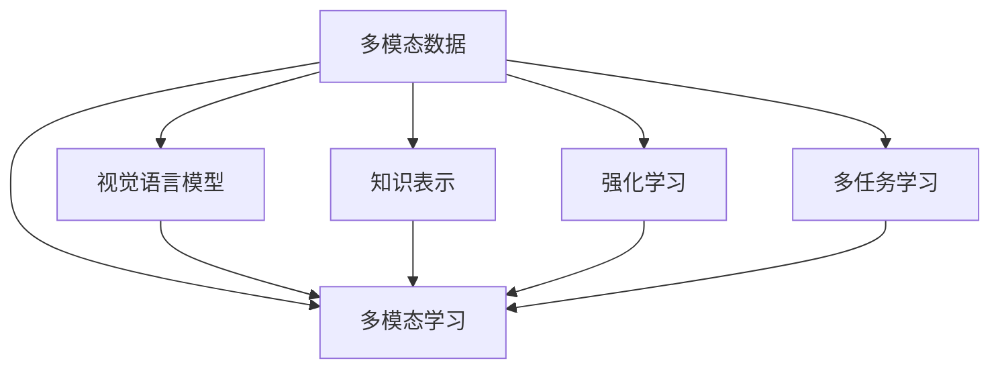

                 

# 多模态大模型：技术原理与实战 用多模态大模型打造AI助理实战

> 关键词：多模态大模型,多模态学习,视觉语言模型,知识表示,强化学习,多任务学习,多模态AI助理,技术实战,代码实现,应用场景

## 1. 背景介绍

随着人工智能技术的不断发展，多模态学习（Multi-modal Learning）成为了当前研究的热点领域。传统的单模态学习往往只能处理一种类型的数据，而多模态学习可以同时处理文本、图像、语音等多种类型的数据，具有更强的表达能力和适应能力。特别是在智能助手、机器人等应用场景中，多模态学习能够更好地理解和响应人类的需求，提升用户体验。

本文将从多模态大模型的技术原理入手，通过一系列的理论分析和项目实战，探讨如何用多模态大模型打造高性能的AI助理。希望读者能够从本文中学习到多模态学习的核心思想和实现方法，从而在实际工作中应用到所学知识，构建出功能强大、反应迅速的AI助理系统。

## 2. 核心概念与联系

### 2.1 核心概念概述

要理解多模态大模型，首先需要了解以下几个核心概念：

- **多模态数据**：指的是同时包含文本、图像、语音等多种类型数据的信息。例如，一个文本描述中的图片，或者一段语音的文本转写。

- **多模态学习**：指的是对多模态数据进行学习，挖掘数据中的多种信息，提高模型的综合表达能力。常见的多模态学习模型包括视觉语言模型（Visual-Language Models, VLMs）、多任务学习（Multitask Learning, MTL）、多模态增强学习（Multimodal Reinforcement Learning, MRL）等。

- **视觉语言模型**：通过同时学习图像和文本的联合分布，能够在视觉和语言之间建立映射关系。例如，使用ImageNet预训练的Vision Transformer模型，再与语言模型进行联合训练。

- **知识表示**：通过在模型中嵌入知识图谱（Knowledge Graphs），能够对先验知识进行编码和推理，提升模型的常识推理能力。

- **强化学习**：通过与环境的交互，模型可以不断优化自身的决策策略，提升模型的适应性和智能水平。

- **多任务学习**：通过同时训练多个相关的任务，可以在一个模型中共享参数，提升模型对不同任务的理解和泛化能力。

这些概念之间的关系可以通过以下Mermaid流程图来展示：



这个流程图展示了大模型在多模态学习中的核心组成和关键技术点：

1. 多模态数据是多模态学习的输入，包含了文本、图像、语音等多种信息。
2. 多模态学习通过不同的方法对这些数据进行融合和处理，提升了模型的综合表达能力。
3. 视觉语言模型通过同时学习图像和文本，建立视觉和语言之间的映射关系。
4. 知识表示通过在模型中嵌入知识图谱，提升了模型的常识推理能力。
5. 强化学习通过与环境的交互，不断优化模型策略，提升了模型的适应性。
6. 多任务学习通过同时训练多个相关任务，提升了模型对不同任务的泛化能力。

## 3. 核心算法原理 & 具体操作步骤

### 3.1 算法原理概述

多模态大模型的核心思想是通过同时学习多种模态的数据，构建出强大的多模态知识表示。常见的多模态学习算法包括多模态表示学习、视觉语言模型和知识表示等。

**多模态表示学习**：通过同时处理图像和文本信息，构建出具有跨模态表示能力的模型。例如，使用CLIP模型，同时学习图像和文本的分布，使得模型能够跨模态识别和分类。

**视觉语言模型**：通过同时学习图像和文本的联合分布，提升模型在视觉和语言之间的映射能力。例如，使用ViT模型预训练，再与语言模型进行联合训练，构建出视觉语言模型。

**知识表示**：通过在模型中嵌入知识图谱，提升模型对先验知识的理解和推理能力。例如，使用KG-BERT模型，在BERT模型的基础上嵌入知识图谱，构建出多模态知识表示。

### 3.2 算法步骤详解

下面以Visual-Language Model为例，详细介绍多模态大模型的实现步骤。

**Step 1: 数据准备**

- **图像数据**：从公开数据集（如ImageNet、COCO等）中获取图像数据，并进行预处理。
- **文本数据**：从公开数据集（如Wikipedia、BookCorpus等）中获取文本数据，并进行预处理。

**Step 2: 模型构建**

- **视觉模型**：使用Vision Transformer模型（如ViT）作为视觉处理模型。
- **语言模型**：使用语言模型（如BERT）作为语言处理模型。

**Step 3: 联合训练**

- **模型初始化**：对两个模型进行预训练，分别得到视觉编码器和语言编码器。
- **联合训练**：将图像数据和文本数据输入模型，通过反向传播更新模型参数，使得模型能够学习图像和文本的联合分布。
- **迭代优化**：在训练过程中，不断调整学习率、优化器等参数，直到模型收敛。

**Step 4: 模型评估**

- **验证集评估**：在验证集上进行评估，计算模型的准确率、召回率等指标。
- **测试集评估**：在测试集上进行评估，计算模型的精度、F1值等指标。

### 3.3 算法优缺点

多模态大模型具有以下优点：

- **综合表达能力**：同时学习多种模态的数据，能够更好地理解复杂场景中的信息。
- **跨模态推理能力**：通过学习图像和文本的联合分布，提升了模型在视觉和语言之间的推理能力。
- **常识推理能力**：通过知识表示方法，模型能够利用先验知识，提升常识推理能力。

同时，多模态大模型也存在以下缺点：

- **数据获取困难**：多模态数据需要同时包含图像、文本等，获取数据较为困难。
- **计算资源需求高**：多模态学习需要同时处理多种类型的数据，计算资源需求较高。
- **模型复杂度高**：多模态模型结构较为复杂，训练和推理速度较慢。

### 3.4 算法应用领域

多模态大模型在多个领域都有广泛应用，例如：

- **智能助手**：通过同时处理用户的语音和文本信息，构建出高性能的智能助理系统。
- **机器人**：通过同时处理视觉和语音信息，构建出具有高智能水平的机器人系统。
- **医疗诊断**：通过同时处理医学图像和文本信息，提升医疗诊断的准确性。
- **自动驾驶**：通过同时处理视觉和传感器数据，提升自动驾驶系统的感知和决策能力。
- **增强现实**：通过同时处理图像和AR设备的数据，提升增强现实应用的用户体验。

## 4. 数学模型和公式 & 详细讲解 & 举例说明

### 4.1 数学模型构建

多模态大模型的数学模型主要由以下几个部分组成：

- **视觉模型**：$V(x)$，将图像数据$x$映射到高维表示空间。
- **语言模型**：$L(y)$，将文本数据$y$映射到高维表示空间。
- **跨模态融合层**：$f(V(x), L(y))$，将视觉和语言表示进行融合。

多模态大模型的目标是通过联合训练，使得$f(V(x), L(y))$能够最大化视觉和语言的联合分布。

### 4.2 公式推导过程

以ViT-Transformer模型为例，推导多模态大模型的联合训练公式。

- **视觉模型**：
  $$
  V(x) = \text{ViT}(x)
  $$

- **语言模型**：
  $$
  L(y) = \text{BERT}(y)
  $$

- **跨模态融合层**：
  $$
  f(V(x), L(y)) = \text{MLP}(\text{Cat}(V(x), L(y)))
  $$

其中$\text{Cat}$表示拼接操作。

联合训练的目标函数为：
$$
\mathcal{L}(V(x), L(y)) = \text{CE}(f(V(x), L(y)), \text{Label})
$$

其中$\text{CE}$表示交叉熵损失函数，$\text{Label}$表示标注标签。

### 4.3 案例分析与讲解

以Multimodal BERT为例，详细分析多模态大模型的构建和训练过程。

**模型结构**：
- **视觉编码器**：使用ViT模型作为视觉编码器，将图像数据$x$映射到高维表示$V(x)$。
- **语言编码器**：使用BERT模型作为语言编码器，将文本数据$y$映射到高维表示$L(y)$。
- **跨模态融合层**：使用MLP层将视觉和语言表示进行拼接和融合，得到跨模态表示$f(V(x), L(y))$。

**训练过程**：
1. 将图像和文本数据输入模型，计算损失函数$\mathcal{L}(V(x), L(y))$。
2. 通过反向传播更新模型参数。
3. 重复上述步骤，直到模型收敛。

## 5. 项目实践：代码实例和详细解释说明

### 5.1 开发环境搭建

为了进行多模态大模型的实战，需要搭建相应的开发环境。以下是Python和PyTorch环境配置的详细步骤：

1. 安装Python和PyTorch：
  ```bash
  pip install python pytorch
  ```

2. 安装相关库：
  ```bash
  pip install torch torchvision transformers
  ```

3. 配置环境变量：
  ```bash
  export PYTHONPATH=/path/to/your/lib:$PYTHONPATH
  ```

### 5.2 源代码详细实现

以下是一个简单的多模态大模型实现示例，使用ViT-Transformer模型和BERT模型构建跨模态模型。

```python
import torch
import torchvision.transforms as transforms
from transformers import BertModel, BertTokenizer
from transformers import ViTFeatureExtractor, ViTModel

# 加载模型和预处理器
tokenizer = BertTokenizer.from_pretrained('bert-base-uncased')
model = BertModel.from_pretrained('bert-base-uncased')
vit_extractor = ViTFeatureExtractor.from_pretrained('google/vit-base-patch16-224-in21k')
vit_model = ViTModel.from_pretrained('google/vit-base-patch16-224-in21k')

# 定义多模态模型
class MultimodalModel(torch.nn.Module):
    def __init__(self):
        super(MultimodalModel, self).__init__()
        self.vit = vit_model
        self.bert = model
        self.fusion = torch.nn.Linear(vit_model.config.hidden_size + bert.config.hidden_size, 512)

    def forward(self, x, y):
        # 图像处理
        vit_outputs = self.vit(x)
        visual_features = vit_outputs.last_hidden_state

        # 文本处理
        bert_outputs = self.bert(y)
        language_features = bert_outputs.last_hidden_state

        # 跨模态融合
        fusion_outputs = self.fusion(torch.cat([visual_features, language_features], dim=1))
        return fusion_outputs

# 定义训练函数
def train(model, train_loader, device, optimizer, criterion):
    model.train()
    for batch in train_loader:
        inputs, labels = batch
        inputs = inputs.to(device)
        labels = labels.to(device)
        fusion_outputs = model(inputs, labels)
        loss = criterion(fusion_outputs, labels)
        optimizer.zero_grad()
        loss.backward()
        optimizer.step()
        print('Train Loss: {:.4f}'.format(loss.item()))

# 定义验证函数
def evaluate(model, val_loader, device, criterion):
    model.eval()
    val_loss = 0
    for batch in val_loader:
        inputs, labels = batch
        inputs = inputs.to(device)
        labels = labels.to(device)
        fusion_outputs = model(inputs, labels)
        val_loss += criterion(fusion_outputs, labels).item()
    val_loss /= len(val_loader)
    print('Validation Loss: {:.4f}'.format(val_loss))

# 训练模型
train_loader = ...
val_loader = ...
device = torch.device('cuda' if torch.cuda.is_available() else 'cpu')
model = MultimodalModel().to(device)
optimizer = torch.optim.Adam(model.parameters(), lr=1e-4)
criterion = torch.nn.CrossEntropyLoss()
for epoch in range(10):
    train(model, train_loader, device, optimizer, criterion)
    evaluate(model, val_loader, device, criterion)
```

### 5.3 代码解读与分析

上述代码实现了一个简单的多模态大模型，包括图像处理、文本处理和跨模态融合三个部分。

- **图像处理**：使用ViT模型对图像数据进行处理，得到视觉特征。
- **文本处理**：使用BERT模型对文本数据进行处理，得到语言特征。
- **跨模态融合**：使用线性层将视觉特征和语言特征进行拼接和融合，得到跨模态表示。

训练函数通过反向传播更新模型参数，验证函数计算验证集上的损失。通过不断迭代，模型能够逐步优化，提高跨模态表示的能力。

## 6. 实际应用场景

### 6.1 智能助手

智能助手可以通过同时处理用户的语音和文本信息，构建出高性能的AI助理系统。例如，使用多模态大模型处理用户输入的语音和文本，构建出对话系统，能够更好地理解和响应用户需求。

在实际应用中，智能助手可以应用于语音助手、客服机器人、健康顾问等多个场景，提升用户体验和服务质量。

### 6.2 医疗诊断

在医疗诊断中，多模态大模型可以同时处理医学图像和文本信息，提升诊断的准确性和智能性。例如，使用多模态大模型对医学图像进行分析和识别，再结合病历和症状描述，构建出完整的诊断模型。

在实际应用中，多模态大模型可以应用于影像分析、病历分析、药物研发等多个领域，提升医疗服务的智能化水平。

### 6.3 自动驾驶

在自动驾驶中，多模态大模型可以同时处理视觉和传感器数据，提升感知和决策能力。例如，使用多模态大模型对视觉图像和传感器数据进行融合，构建出感知系统，能够更好地识别道路环境和其他车辆。

在实际应用中，多模态大模型可以应用于自动驾驶、智能交通等多个场景，提升智能交通系统的安全性。

## 7. 工具和资源推荐

### 7.1 学习资源推荐

为了帮助开发者掌握多模态大模型的核心技术，以下是几个优质的学习资源：

1. **《多模态学习》书籍**：这本书详细介绍了多模态学习的理论基础和实现方法，涵盖了视觉语言模型、知识表示、强化学习等多个方向。

2. **CLIP模型论文**：这篇论文是CLIP模型的经典之作，详细介绍了CLIP模型的构建和训练过程，是学习多模态大模型的必读文献。

3. **ViT模型论文**：这篇论文介绍了ViT模型的构建和训练过程，是视觉语言模型的重要参考资料。

4. **Multimodal BERT论文**：这篇论文详细介绍了Multimodal BERT模型的构建和训练过程，是学习多模态大模型的经典案例。

5. **Hugging Face官方文档**：Transformers库的官方文档，提供了丰富的预训练模型和微调样例，是学习多模态大模型的重要工具。

### 7.2 开发工具推荐

多模态大模型的实现需要借助一些高效的开发工具，以下是几个推荐的工具：

1. **PyTorch**：基于Python的开源深度学习框架，支持动态图和静态图，适合灵活迭代研究。

2. **TensorFlow**：由Google主导的开源深度学习框架，支持分布式训练，适合大规模工程应用。

3. **Transformers库**：Hugging Face开发的NLP工具库，支持多模态模型的构建和微调。

4. **TensorBoard**：TensorFlow配套的可视化工具，可以实时监测模型训练状态，提供丰富的图表呈现方式。

5. **Weights & Biases**：模型训练的实验跟踪工具，可以记录和可视化模型训练过程中的各项指标，方便对比和调优。

### 7.3 相关论文推荐

多模态大模型的研究源于学界的持续探索，以下是几篇经典的多模态大模型论文：

1. **《CLIP: A Simple yet Powerful Method to Learn Visual and Textual Features from No Supervision with Contrastive Predictive Coding》**：这篇论文介绍了CLIP模型的构建和训练过程，展示了多模态大模型在图像和文本上的良好性能。

2. **《Visual and Textual Pre-training for Multimodal Reasoning》**：这篇论文详细介绍了Multimodal BERT模型的构建和训练过程，展示了多模态大模型在多任务学习中的强大能力。

3. **《Dense Image Reasoning》**：这篇论文介绍了Dense Image Reasoning模型的构建和训练过程，展示了多模态大模型在图像推理中的出色表现。

4. **《Long-Short Term Memory Networks》**：这篇论文介绍了LSTM网络的结构和训练过程，展示了多模态大模型在时间序列分析中的能力。

这些论文代表了多模态大模型的研究方向，是学习多模态大模型的重要参考资料。

## 8. 总结：未来发展趋势与挑战

### 8.1 研究成果总结

多模态大模型在NLP和计算机视觉领域取得了显著进展，提升了模型的综合表达能力和跨模态推理能力。基于多模态大模型，研究人员可以构建出高性能的AI助理、智能机器人、自动驾驶等多个应用场景的系统。

### 8.2 未来发展趋势

未来，多模态大模型将呈现以下几个发展趋势：

1. **模型规模扩大**：随着算力成本的下降和数据规模的扩张，多模态大模型的参数量将继续增长，提升模型的综合表达能力。

2. **跨模态推理能力提升**：通过引入更多的跨模态融合技术，提升模型在视觉和语言之间的推理能力。

3. **知识表示能力增强**：通过在模型中嵌入知识图谱，提升模型的常识推理能力。

4. **多任务学习应用广泛**：通过同时训练多个相关任务，提升模型对不同任务的泛化能力。

5. **强化学习结合**：通过与环境的交互，不断优化模型策略，提升模型的适应性和智能水平。

### 8.3 面临的挑战

尽管多模态大模型取得了显著进展，但仍然面临一些挑战：

1. **数据获取困难**：多模态数据需要同时包含图像、文本等，获取数据较为困难。

2. **计算资源需求高**：多模态学习需要同时处理多种类型的数据，计算资源需求较高。

3. **模型复杂度高**：多模态模型结构较为复杂，训练和推理速度较慢。

### 8.4 研究展望

未来，多模态大模型需要从以下几个方向进行深入研究：

1. **数据融合技术**：开发更加高效的多模态数据融合技术，提升模型的综合表达能力。

2. **跨模态推理技术**：开发更加强大的跨模态推理技术，提升模型在视觉和语言之间的推理能力。

3. **知识表示技术**：开发更加高效的知识表示技术，提升模型的常识推理能力。

4. **多任务学习技术**：开发更加高效的跨任务学习技术，提升模型对不同任务的泛化能力。

5. **强化学习技术**：开发更加高效的强化学习技术，提升模型的智能水平。

综上所述，多模态大模型具有广阔的发展前景和重要的应用价值，需要通过不断的技术探索和工程实践，推动其在更多领域的应用，提升人工智能系统的智能化水平。

## 9. 附录：常见问题与解答

**Q1：多模态大模型的核心思想是什么？**

A: 多模态大模型的核心思想是通过同时学习多种模态的数据，构建出具有跨模态表示能力的模型。通过联合训练，提升模型在视觉和语言之间的映射能力，提高模型的综合表达能力和跨模态推理能力。

**Q2：多模态大模型在实现过程中需要注意哪些问题？**

A: 在多模态大模型的实现过程中，需要注意以下几个问题：

1. 数据获取困难：多模态数据需要同时包含图像、文本等，获取数据较为困难。可以通过数据增强和数据合成等方法，缓解数据获取的困难。

2. 计算资源需求高：多模态学习需要同时处理多种类型的数据，计算资源需求较高。可以通过模型压缩、混合精度训练等方法，提高计算效率。

3. 模型复杂度高：多模态模型结构较为复杂，训练和推理速度较慢。可以通过模型裁剪、量化加速等方法，优化模型结构。

**Q3：多模态大模型在应用过程中需要注意哪些问题？**

A: 在多模态大模型的应用过程中，需要注意以下几个问题：

1. 数据隐私保护：多模态大模型需要处理用户的多种类型的数据，需要注意数据隐私保护，避免数据泄露。

2. 模型泛化能力：多模态大模型需要处理多种类型的数据，需要注意模型的泛化能力，避免过拟合。

3. 模型可解释性：多模态大模型往往较为复杂，需要注意模型的可解释性，方便用户理解和调试。

综上所述，多模态大模型具有广阔的发展前景和重要的应用价值，需要通过不断的技术探索和工程实践，推动其在更多领域的应用，提升人工智能系统的智能化水平。

---

作者：禅与计算机程序设计艺术 / Zen and the Art of Computer Programming

