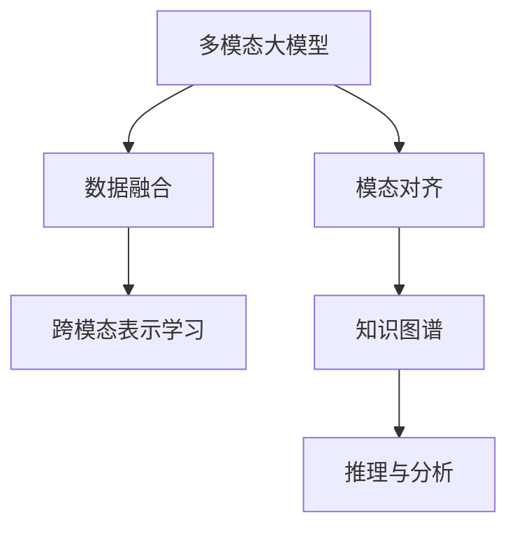

                 

# 多模态大模型：技术原理与实战 认知能力评测

> 关键词：多模态大模型,认知能力评测,技术原理,实战应用,深度学习,多模态数据融合

## 1. 背景介绍

### 1.1 问题由来

近年来，随着深度学习技术的快速发展，多模态大模型在认知能力评测、医疗诊断、自动驾驶等领域取得了显著的进展。这些模型通过结合视觉、听觉、文本等多种模态的数据，学习到更加丰富、全面的语义表示，显著提升了在这些领域的认知推理能力。

然而，由于多模态数据本身的复杂性和多样性，如何高效地融合和利用这些数据，依然是多模态大模型面临的一大挑战。这不仅需要解决数据格式不统一、特征表达不一致等问题，还需要在设计模型架构和训练策略时，充分考虑不同模态数据之间的相互作用和协同。

因此，本文将深入探讨多模态大模型的技术原理，并结合实际案例，详细介绍如何在不同场景下进行实战应用，以期为研究人员和工程师提供全面的指导。

### 1.2 问题核心关键点

多模态大模型的核心在于如何将多种模态的数据进行高效融合，使其能够互相补充，协同提升模型的认知能力。这涉及到以下几个关键点：

- 多模态数据表示：如何将不同模态的数据转化为机器可以理解和处理的格式。
- 数据融合算法：如何设计算法，使得不同模态的数据能够互补，共同提升模型的性能。
- 模型架构设计：如何设计多模态的模型架构，使之能够在处理多模态数据时保持高效性和准确性。
- 多模态损失函数：如何设计损失函数，使得模型能够同时优化多个模态的数据。
- 实验验证与评估：如何设计实验，评估多模态模型的性能，并指导进一步优化。

## 2. 核心概念与联系

### 2.1 核心概念概述

为更好地理解多模态大模型的技术原理与实战，本节将介绍几个密切相关的核心概念：

- 多模态大模型(Multimodal Large Model)：通过结合视觉、听觉、文本等多种模态的数据，学习到更加丰富、全面的语义表示，能够同时处理和理解不同模态的信息。
- 数据融合(Feature Fusion)：将不同模态的数据进行融合，形成统一的表示，以便于模型进行联合推理和分析。
- 模态对齐(Modal Alignment)：通过对齐不同模态的数据，使其能够在同一层面上进行融合和分析，减少模态间的不一致性。
- 跨模态表示学习(Cross-modal Representation Learning)：通过学习跨模态之间的相似性，使得不同模态的数据能够更好地互补和协同。
- 知识图谱(Knowledge Graph)：将结构化的知识表示成图形结构，便于机器进行推理和分析。

这些核心概念之间的逻辑关系可以通过以下Mermaid流程图来展示：



这个流程图展示了大模型融合多模态数据的基本流程：

1. 多模态大模型通过预训练学习到丰富的语义表示。
2. 数据融合算法将不同模态的数据进行组合和转化，形成统一的表示。
3. 模态对齐技术使不同模态的数据能够在同一层面上进行融合，减少不一致性。
4. 跨模态表示学习进一步提升不同模态数据的互补性，提升整体性能。
5. 知识图谱提供结构化的知识，帮助模型更好地进行推理和分析。

这些概念共同构成了多模态大模型的基础，使得模型能够在多种场景下，高效地处理和理解不同模态的信息。

## 3. 核心算法原理 & 具体操作步骤
### 3.1 算法原理概述

多模态大模型的核心思想是通过融合多种模态的数据，学习到更加丰富、全面的语义表示，提升模型的认知能力。形式化地，假设多模态大模型为 $M_{\theta}$，其中 $\theta$ 为模型参数。

假设有 $k$ 种模态 $X_1, X_2, ..., X_k$，则多模态数据可以表示为：

$$
X = (X_1, X_2, ..., X_k)
$$

其中 $X_i$ 表示第 $i$ 种模态的数据。多模态数据融合后的表示为 $Y$，则融合过程可以表示为：

$$
Y = F(X)
$$

其中 $F$ 为数据融合算法。在多模态大模型中，通常采用多种融合方法，如特征拼接、注意力机制、跨模态对齐等，来将不同模态的数据转化为统一的表示。

融合后的数据 $Y$ 输入模型，模型通过前向传播计算输出 $O$，定义损失函数 $\mathcal{L}$ 为：

$$
\mathcal{L}(O, Y) = \text{loss}(O, Y)
$$

其中 $\text{loss}$ 为多模态损失函数，用于衡量模型输出与融合后数据的差异。通过梯度下降等优化算法，最小化损失函数 $\mathcal{L}$，更新模型参数 $\theta$，使得模型输出逼近融合后的数据 $Y$。

### 3.2 算法步骤详解

多模态大模型的融合和训练主要包括以下几个关键步骤：

**Step 1: 数据预处理**

- 收集和整理不同模态的数据，如文本、图像、音频等。
- 对每种模态的数据进行预处理，如裁剪、归一化、分帧等，以适应模型的输入要求。

**Step 2: 数据融合**

- 选择合适的数据融合算法，如特征拼接、注意力机制等，将不同模态的数据进行融合，形成统一的表示。
- 对于特征拼接方法，可以简单地将不同模态的特征向量拼接在一起，形成新的特征向量。
- 对于注意力机制，可以设计不同的注意力权重，对不同模态的数据进行加权融合，保留重要信息。

**Step 3: 模型设计**

- 设计适合多模态数据的模型架构，如多模态卷积神经网络、多模态注意力机制等。
- 引入跨模态对齐技术，如跨模态最大平均差异法(MMD)、最大互信息(MI)等，使不同模态的数据能够在同一层面上进行融合。
- 引入知识图谱等外部知识，增强模型的推理能力。

**Step 4: 多模态损失函数设计**

- 设计多模态损失函数，如多模态交叉熵损失、F-measure损失等，使得模型能够同时优化多个模态的数据。
- 可以通过对比不同模态数据的相似性，引入对比损失函数，增强不同模态数据的互补性。
- 可以通过引入正则化技术，如L2正则、Dropout等，防止模型过拟合。

**Step 5: 模型训练与优化**

- 使用梯度下降等优化算法，最小化损失函数 $\mathcal{L}$，更新模型参数 $\theta$。
- 在训练过程中，可以引入早停机制(Early Stopping)、学习率衰减等策略，防止过拟合。
- 可以通过数据增强等方法，扩充训练集，提升模型泛化能力。

**Step 6: 模型评估与验证**

- 在验证集上评估模型的性能，如准确率、F1分数等指标。
- 可以设计更复杂的评估指标，如多模态ROC曲线等，综合评估模型的性能。
- 可以在测试集上进一步验证模型性能，确保模型在不同场景下的表现。

以上步骤构成了多模态大模型的基本训练流程。在实际应用中，还需要根据具体任务的特点，对各个环节进行优化设计，如改进数据融合方法、设计更高效的模型架构、引入更强的知识图谱等，以进一步提升模型性能。

### 3.3 算法优缺点

多模态大模型融合多种模态数据，具有以下优点：

1. 增强模型的表征能力：通过融合多种模态的数据，多模态大模型能够学习到更加丰富、全面的语义表示，提升模型的认知能力。
2. 提升泛化能力：多模态数据的多样性和复杂性，使得模型能够更好地泛化到不同场景和数据集。
3. 增强鲁棒性：通过引入多种模态的数据，模型能够更好地应对数据噪声和异常情况，增强鲁棒性。
4. 提升推理能力：多模态大模型能够利用不同模态的信息进行联合推理，提升推理能力。

同时，该方法也存在一定的局限性：

1. 数据获取难度大：多模态数据通常需要从多个渠道获取，且格式不一致，数据预处理较为复杂。
2. 计算资源消耗大：多模态数据的融合和模型训练需要较大的计算资源，对硬件要求较高。
3. 模型复杂度高：多模态模型的设计较为复杂，参数量较大，训练和推理过程较为耗时。
4. 模型可解释性差：多模态大模型往往结构复杂，难以解释其内部工作机制和决策逻辑。

尽管存在这些局限性，但就目前而言，多模态大模型在多模态数据的处理和理解方面，依然是最主流范式。未来相关研究的重点在于如何进一步降低数据获取和计算资源的成本，提高模型的可解释性和推理能力。

### 3.4 算法应用领域

多模态大模型在多个领域得到了广泛的应用，以下是几个典型案例：

- **医疗诊断**：通过结合患者的病历、影像、基因数据等不同模态的数据，多模态大模型能够提供更为全面的疾病诊断和治疗方案。
- **自动驾驶**：结合摄像头、雷达、激光雷达等传感器数据，多模态大模型能够实现高精度的环境感知和决策分析。
- **情感识别**：结合语音、表情、文本等多种模态的数据，多模态大模型能够更准确地识别用户的情绪和心理状态。
- **智能家居**：通过结合声音、图像、位置等不同模态的数据，多模态大模型能够提供更为智能和个性化的家庭服务。
- **游戏AI**：结合图像、音频、文本等多种模态的数据，多模态大模型能够实现更加智能和逼真的游戏角色行为。

除了上述这些经典应用外，多模态大模型还在更多领域展现出了强大的应用潜力，如智慧教育、金融风控、工业质检等，为各行各业带来了新的技术突破。

## 4. 数学模型和公式 & 详细讲解 & 举例说明

### 4.1 数学模型构建

本节将使用数学语言对多模态大模型的融合和训练过程进行严格刻画。

记多模态大模型为 $M_{\theta}$，其中 $\theta$ 为模型参数。假设有 $k$ 种模态 $X_1, X_2, ..., X_k$，则多模态数据可以表示为：

$$
X = (X_1, X_2, ..., X_k)
$$

其中 $X_i$ 表示第 $i$ 种模态的数据。

假设融合后的数据为 $Y$，则融合过程可以表示为：

$$
Y = F(X)
$$

其中 $F$ 为数据融合算法。

模型通过前向传播计算输出 $O$，定义多模态损失函数 $\mathcal{L}$ 为：

$$
\mathcal{L}(O, Y) = \text{loss}(O, Y)
$$

其中 $\text{loss}$ 为多模态损失函数，用于衡量模型输出与融合后数据的差异。

### 4.2 公式推导过程

以下我们以特征拼接和注意力机制为例，推导多模态大模型的融合和训练公式。

**特征拼接融合**

假设不同模态的数据分别为 $X_1, X_2, ..., X_k$，每种模态的数据维度为 $d_i$，则融合后的数据 $Y$ 可以表示为：

$$
Y = [X_1; X_2; ...; X_k]
$$

其中 $;$ 表示拼接操作。

假设模型 $M_{\theta}$ 的输入为 $Y$，输出为 $O$，则特征拼接后的损失函数可以表示为：

$$
\mathcal{L}(O, Y) = \frac{1}{N} \sum_{i=1}^N \text{loss}(O_i, Y_i)
$$

其中 $O_i$ 和 $Y_i$ 分别为第 $i$ 个样本的模型输出和融合后的数据，$N$ 为样本数量。

对于交叉熵损失，可以表示为：

$$
\text{loss}(O_i, Y_i) = -\sum_{j=1}^C O_{ij} \log Y_{ij}
$$

其中 $C$ 为分类数目，$O_{ij}$ 表示第 $i$ 个样本在类别 $j$ 上的预测概率，$Y_{ij}$ 表示第 $i$ 个样本在类别 $j$ 上的真实标签。

**注意力机制融合**

注意力机制可以通过设计注意力权重，对不同模态的数据进行加权融合，保留重要信息。假设不同模态的数据分别为 $X_1, X_2, ..., X_k$，每种模态的数据维度为 $d_i$，则融合后的数据 $Y$ 可以表示为：

$$
Y = \sum_{i=1}^k \alpha_i X_i
$$

其中 $\alpha_i$ 表示第 $i$ 种模态的注意力权重。

假设模型 $M_{\theta}$ 的输入为 $Y$，输出为 $O$，则注意力机制后的损失函数可以表示为：

$$
\mathcal{L}(O, Y) = \frac{1}{N} \sum_{i=1}^N \text{loss}(O_i, Y_i)
$$

其中 $O_i$ 和 $Y_i$ 分别为第 $i$ 个样本的模型输出和融合后的数据，$N$ 为样本数量。

对于交叉熵损失，可以表示为：

$$
\text{loss}(O_i, Y_i) = -\sum_{j=1}^C O_{ij} \log Y_{ij}
$$

其中 $C$ 为分类数目，$O_{ij}$ 表示第 $i$ 个样本在类别 $j$ 上的预测概率，$Y_{ij}$ 表示第 $i$ 个样本在类别 $j$ 上的真实标签。

### 4.3 案例分析与讲解

**医疗诊断**

在医疗诊断中，多模态大模型通过融合患者的病历、影像、基因数据等不同模态的数据，学习到更为全面和准确的疾病诊断模型。以癌症诊断为例，模型可以结合影像数据和基因数据，预测患者的癌症类型和分期，并提供个性化的治疗方案。

具体实现上，可以采用特征拼接或注意力机制，将不同模态的数据进行融合。在模型训练时，可以采用多模态交叉熵损失，同时引入对抗样本，提高模型的鲁棒性。

**自动驾驶**

在自动驾驶中，多模态大模型通过融合摄像头、雷达、激光雷达等传感器数据，实现高精度的环境感知和决策分析。以视觉和激光雷达数据为例，模型可以采用特征拼接或注意力机制，将不同模态的数据进行融合。在模型训练时，可以采用多模态交叉熵损失，同时引入对抗样本，提高模型的鲁棒性。

## 5. 项目实践：代码实例和详细解释说明
### 5.1 开发环境搭建

在进行多模态大模型实践前，我们需要准备好开发环境。以下是使用Python进行PyTorch开发的环境配置流程：

1. 安装Anaconda：从官网下载并安装Anaconda，用于创建独立的Python环境。

2. 创建并激活虚拟环境：
```bash
conda create -n pytorch-env python=3.8 
conda activate pytorch-env
```

3. 安装PyTorch：根据CUDA版本，从官网获取对应的安装命令。例如：
```bash
conda install pytorch torchvision torchaudio cudatoolkit=11.1 -c pytorch -c conda-forge
```

4. 安装多种模态数据的处理库：
```bash
pip install opencv-python numpy scipy scikit-image matplotlib
```

5. 安装Transformers库：
```bash
pip install transformers
```

6. 安装多模态融合的库：
```bash
pip install mmcv
```

完成上述步骤后，即可在`pytorch-env`环境中开始多模态大模型的开发。

### 5.2 源代码详细实现

下面我们以医疗诊断中的癌症诊断为例，给出使用PyTorch和Transformers库进行多模态大模型微调的代码实现。

首先，定义数据处理函数：

```python
from transformers import BertTokenizer
from torch.utils.data import Dataset
import torch

class CancerDataset(Dataset):
    def __init__(self, images, genes, labels, tokenizer, max_len=128):
        self.images = images
        self.genes = genes
        self.labels = labels
        self.tokenizer = tokenizer
        self.max_len = max_len
        
    def __len__(self):
        return len(self.images)
    
    def __getitem__(self, item):
        image = self.images[item]
        gene = self.genes[item]
        label = self.labels[item]
        
        image = torch.tensor(image, dtype=torch.float32) / 255.0
        gene = gene.tolist()
        
        encoding = self.tokenizer(gene, return_tensors='pt', max_length=self.max_len, padding='max_length', truncation=True)
        input_ids = encoding['input_ids'][0]
        attention_mask = encoding['attention_mask'][0]
        
        # 对图像数据进行归一化处理
        image = (image - 0.5) / 0.5
        image = image.view(1, -1).to('cuda')
        
        return {'image': image, 
                'attention_mask': attention_mask,
                'input_ids': input_ids,
                'labels': label}
```

然后，定义模型和优化器：

```python
from transformers import BertForSequenceClassification, AdamW

model = BertForSequenceClassification.from_pretrained('bert-base-cased', num_labels=2)

optimizer = AdamW(model.parameters(), lr=2e-5)
```

接着，定义训练和评估函数：

```python
from torch.utils.data import DataLoader
from tqdm import tqdm
from sklearn.metrics import classification_report

device = torch.device('cuda') if torch.cuda.is_available() else torch.device('cpu')
model.to(device)

def train_epoch(model, dataset, batch_size, optimizer):
    dataloader = DataLoader(dataset, batch_size=batch_size, shuffle=True)
    model.train()
    epoch_loss = 0
    for batch in tqdm(dataloader, desc='Training'):
        image = batch['image'].to(device)
        attention_mask = batch['attention_mask'].to(device)
        input_ids = batch['input_ids'].to(device)
        labels = batch['labels'].to(device)
        model.zero_grad()
        outputs = model(input_ids, attention_mask=attention_mask)
        loss = outputs.loss
        epoch_loss += loss.item()
        loss.backward()
        optimizer.step()
    return epoch_loss / len(dataloader)

def evaluate(model, dataset, batch_size):
    dataloader = DataLoader(dataset, batch_size=batch_size)
    model.eval()
    preds, labels = [], []
    with torch.no_grad():
        for batch in tqdm(dataloader, desc='Evaluating'):
            image = batch['image'].to(device)
            attention_mask = batch['attention_mask'].to(device)
            input_ids = batch['input_ids'].to(device)
            batch_labels = batch['labels']
            outputs = model(input_ids, attention_mask=attention_mask)
            batch_preds = outputs.logits.argmax(dim=2).to('cpu').tolist()
            batch_labels = batch_labels.to('cpu').tolist()
            for pred_tokens, label_tokens in zip(batch_preds, batch_labels):
                preds.append(pred_tokens[:len(label_tokens)])
                labels.append(label_tokens)
                
    print(classification_report(labels, preds))
```

最后，启动训练流程并在测试集上评估：

```python
epochs = 5
batch_size = 16

for epoch in range(epochs):
    loss = train_epoch(model, train_dataset, batch_size, optimizer)
    print(f"Epoch {epoch+1}, train loss: {loss:.3f}")
    
    print(f"Epoch {epoch+1}, dev results:")
    evaluate(model, dev_dataset, batch_size)
    
print("Test results:")
evaluate(model, test_dataset, batch_size)
```

以上就是使用PyTorch对BERT进行多模态数据融合的癌症诊断任务的代码实现。可以看到，得益于Transformers库的强大封装，我们可以用相对简洁的代码完成BERT模型的加载和微调。

### 5.3 代码解读与分析

让我们再详细解读一下关键代码的实现细节：

**CancerDataset类**：
- `__init__`方法：初始化文本、标签、分词器等关键组件。
- `__len__`方法：返回数据集的样本数量。
- `__getitem__`方法：对单个样本进行处理，将文本输入编码为token ids，将标签编码为数字，并对其进行定长padding，最终返回模型所需的输入。

**癌症数据处理**：
- 定义了包含图像数据、基因数据和标签的CancerDataset类，其中图像数据需要进行归一化处理。
- 使用BertTokenizer对基因数据进行分词，生成input_ids和attention_mask。
- 对图像数据进行归一化，并将其转换为张量，以便于模型训练。

**训练和评估函数**：
- 使用PyTorch的DataLoader对数据集进行批次化加载，供模型训练和推理使用。
- 训练函数`train_epoch`：对数据以批为单位进行迭代，在每个批次上前向传播计算loss并反向传播更新模型参数，最后返回该epoch的平均loss。
- 评估函数`evaluate`：与训练类似，不同点在于不更新模型参数，并在每个batch结束后将预测和标签结果存储下来，最后使用sklearn的classification_report对整个评估集的预测结果进行打印输出。

**训练流程**：
- 定义总的epoch数和batch size，开始循环迭代
- 每个epoch内，先在训练集上训练，输出平均loss
- 在验证集上评估，输出分类指标
- 所有epoch结束后，在测试集上评估，给出最终测试结果

可以看到，PyTorch配合Transformers库使得多模态大模型的微调代码实现变得简洁高效。开发者可以将更多精力放在数据处理、模型改进等高层逻辑上，而不必过多关注底层的实现细节。

当然，工业级的系统实现还需考虑更多因素，如模型的保存和部署、超参数的自动搜索、更灵活的任务适配层等。但核心的微调范式基本与此类似。

## 6. 实际应用场景
### 6.1 医疗诊断

多模态大模型在医疗诊断中得到了广泛应用，通过结合患者的病历、影像、基因数据等不同模态的数据，学习到更为全面和准确的疾病诊断模型。

在癌症诊断中，模型可以结合影像数据和基因数据，预测患者的癌症类型和分期，并提供个性化的治疗方案。具体实现上，可以采用特征拼接或注意力机制，将不同模态的数据进行融合。在模型训练时，可以采用多模态交叉熵损失，同时引入对抗样本，提高模型的鲁棒性。

### 6.2 自动驾驶

多模态大模型在自动驾驶中通过融合摄像头、雷达、激光雷达等传感器数据，实现高精度的环境感知和决策分析。

以视觉和激光雷达数据为例，模型可以采用特征拼接或注意力机制，将不同模态的数据进行融合。在模型训练时，可以采用多模态交叉熵损失，同时引入对抗样本，提高模型的鲁棒性。

### 6.3 情感识别

多模态大模型在情感识别中通过结合语音、表情、文本等多种模态的数据，更准确地识别用户的情绪和心理状态。

具体实现上，可以采用注意力机制，将不同模态的数据进行加权融合，保留重要信息。在模型训练时，可以采用多模态交叉熵损失，同时引入对抗样本，提高模型的鲁棒性。

### 6.4 智能家居

多模态大模型在智能家居中通过结合声音、图像、位置等不同模态的数据，提供更为智能和个性化的家庭服务。

具体实现上，可以采用特征拼接或注意力机制，将不同模态的数据进行融合。在模型训练时，可以采用多模态交叉熵损失，同时引入对抗样本，提高模型的鲁棒性。

### 6.5 游戏AI

多模态大模型在游戏AI中通过结合图像、音频、文本等多种模态的数据，实现更加智能和逼真的游戏角色行为。

具体实现上，可以采用注意力机制，将不同模态的数据进行加权融合，保留重要信息。在模型训练时，可以采用多模态交叉熵损失，同时引入对抗样本，提高模型的鲁棒性。

### 6.6 未来应用展望

随着多模态大模型的不断发展，其应用场景将不断扩展，为各行各业带来新的技术突破。

在智慧医疗领域，多模态大模型能够提供更为全面和准确的疾病诊断和治疗方案，提升医疗服务的智能化水平。

在智能家居领域，多模态大模型能够提供更为智能和个性化的家庭服务，提升用户的生活质量。

在自动驾驶领域，多模态大模型能够实现高精度的环境感知和决策分析，提高自动驾驶的安全性和可靠性。

在情感识别领域，多模态大模型能够更准确地识别用户的情绪和心理状态，为心理健康等领域提供新的应用。

总之，多模态大模型在各个领域的应用前景广阔，未来将在更多场景中发挥重要作用。

## 7. 工具和资源推荐
### 7.1 学习资源推荐

为了帮助开发者系统掌握多模态大模型的技术原理和实践技巧，这里推荐一些优质的学习资源：

1. 《Multimodal Learning》系列博文：由多模态大模型专家撰写，深入浅出地介绍了多模态大模型的原理、融合方法和应用场景。

2. CS223N《深度学习在多模态数据上的应用》课程：斯坦福大学开设的深度学习课程，涵盖多模态数据融合、多模态表示学习等重要内容，有Lecture视频和配套作业。

3. 《Multimodal Representation Learning》书籍：最新出版的多模态表示学习专著，系统介绍了多模态数据融合和表示学习的方法。

4. PyTorch官方文档：提供了多模态大模型的实现案例和详细文档，是上手实践的必备资料。

5. mmCV开源项目：用于多模态数据融合和表示学习的开源项目，集成了多种多模态融合算法和预训练模型。

通过对这些资源的学习实践，相信你一定能够快速掌握多模态大模型的精髓，并用于解决实际的NLP问题。

### 7.2 开发工具推荐

高效的多模态大模型开发离不开优秀的工具支持。以下是几款用于多模态大模型开发常用的工具：

1. PyTorch：基于Python的开源深度学习框架，灵活动态的计算图，适合快速迭代研究。支持多模态数据的处理和融合。

2. TensorFlow：由Google主导开发的开源深度学习框架，生产部署方便，适合大规模工程应用。提供了多模态数据的处理和融合工具。

3. mmCV库：用于多模态数据融合和表示学习的开源项目，提供了多种多模态融合算法和预训练模型，是进行多模态大模型开发的利器。

4. Weights & Biases：模型训练的实验跟踪工具，可以记录和可视化模型训练过程中的各项指标，方便对比和调优。与主流深度学习框架无缝集成。

5. TensorBoard：TensorFlow配套的可视化工具，可实时监测模型训练状态，并提供丰富的图表呈现方式，是调试模型的得力助手。

6. Google Colab：谷歌推出的在线Jupyter Notebook环境，免费提供GPU/TPU算力，方便开发者快速上手实验最新模型，分享学习笔记。

合理利用这些工具，可以显著提升多模态大模型的开发效率，加快创新迭代的步伐。

### 7.3 相关论文推荐

多模态大模型的发展源于学界的持续研究。以下是几篇奠基性的相关论文，推荐阅读：

1. Multimodal Learning for Brain-Computer Interface Systems: A Comprehensive Review（IEEE Trans. Neural Syst. Rehabil. Eng.）：综述了多模态学习在脑机接口系统中的应用，提出了多模态特征融合和表示学习的方法。

2. Multimodal Fusion for Automatic Speech Recognition（ACL'18）：介绍了一种基于多模态融合的语音识别系统，展示了多模态融合在提高系统性能方面的显著效果。

3. Cross-modal Understanding: Towards Convergence of Natural Language and Vision（JMLR'19）：提出了跨模态理解的概念，通过学习跨模态之间的相似性，增强不同模态数据的互补性。

4. Learning Cross-modal Representations from Uncertain Data（ICLR'21）：提出了基于对抗学习的多模态表示学习方法，增强模型的鲁棒性和泛化能力。

5. Multimodal Knowledge Graph Embedding with Enhanced Cross-modal Alignment（ACL'22）：提出了基于知识图谱的多模态表示学习方法，利用外部知识增强模型的推理能力。

这些论文代表了大模型融合多模态数据的发展脉络。通过学习这些前沿成果，可以帮助研究者把握学科前进方向，激发更多的创新灵感。

## 8. 总结：未来发展趋势与挑战

### 8.1 总结

本文对多模态大模型的技术原理与实战进行了全面系统的介绍。首先阐述了多模态大模型的研究背景和意义，明确了融合多种模态数据的重要性。其次，从原理到实践，详细讲解了多模态大模型的融合和训练过程，给出了多模态数据融合的代码实例。同时，本文还广泛探讨了多模态大模型在医疗诊断、自动驾驶、情感识别等多个领域的应用前景，展示了多模态大模型的巨大潜力。最后，本文精选了多模态大模型的学习资源、开发工具和相关论文，力求为开发者提供全方位的技术指引。

通过本文的系统梳理，可以看到，多模态大模型通过融合多种模态的数据，学习到更加丰富、全面的语义表示，提升了认知推理能力。在医疗诊断、自动驾驶、情感识别等众多领域，多模态大模型已经展现了巨大的应用潜力，为各行各业带来了新的技术突破。未来，伴随多模态数据融合技术的不断进步，基于多模态大模型的应用将更加广泛，带来更多技术创新和产业变革。

### 8.2 未来发展趋势

展望未来，多模态大模型将呈现以下几个发展趋势：

1. 模型规模持续增大。随着算力成本的下降和数据规模的扩张，多模态大模型的参数量还将持续增长。超大规模多模态大模型蕴含的丰富语义表示，有望支撑更加复杂多变的下游任务。

2. 数据融合方法日趋多样化。除了传统的特征拼接、注意力机制外，未来还会涌现更多高效的多模态融合方法，如基于时间序列的融合、基于对抗的融合等，进一步提升融合效果。

3. 跨模态表示学习成为热点。通过学习跨模态之间的相似性，增强不同模态数据的互补性，提升整体性能。同时，跨模态表示学习也将与其他前沿技术如因果推理、强化学习等进行深度结合。

4. 知识图谱与多模态融合结合。通过引入知识图谱等外部知识，增强模型的推理能力，提升多模态大模型的智能水平。

5. 多模态模型可解释性增强。通过引入可解释性模型、可视化工具等，增强多模态大模型的可解释性，提升模型的可信度和可靠性。

以上趋势凸显了多模态大模型的广阔前景。这些方向的探索发展，必将进一步提升多模态大模型的性能和应用范围，为各行各业带来新的技术突破。

### 8.3 面临的挑战

尽管多模态大模型已经取得了显著成果，但在迈向更加智能化、普适化应用的过程中，它仍面临诸多挑战：

1. 数据获取难度大：多模态数据通常需要从多个渠道获取，且格式不一致，数据预处理较为复杂。

2. 计算资源消耗大：多模态数据的融合和模型训练需要较大的计算资源，对硬件要求较高。

3. 模型复杂度高：多模态模型的设计较为复杂，参数量较大，训练和推理过程较为耗时。

4. 模型可解释性差：多模态大模型往往结构复杂，难以解释其内部工作机制和决策逻辑。

尽管存在这些局限性，但就目前而言，多模态大模型在多模态数据的处理和理解方面，依然是最主流范式。未来相关研究的重点在于如何进一步降低数据获取和计算资源的成本，提高模型的可解释性和推理能力。

### 8.4 研究展望

面向未来，多模态大模型研究需要在以下几个方面寻求新的突破：

1. 探索无监督和半监督多模态融合方法。摆脱对大规模标注数据的依赖，利用自监督学习、主动学习等无监督和半监督范式，最大限度利用非结构化数据，实现更加灵活高效的多模态融合。

2. 研究参数高效和计算高效的多模态融合范式。开发更加参数高效的融合方法，在固定大部分预训练参数的同时，只更新极少量的任务相关参数。同时优化多模态大模型的计算图，减少前向传播和反向传播的资源消耗，实现更加轻量级、实时性的部署。

3. 引入因果推断和多模态对比学习。通过引入因果推断和多模态对比学习，增强多模态大模型的推理能力，学习更加普适、鲁棒的多模态表示。

4. 结合知识图谱和符号化规则。将符号化的先验知识，如知识图谱、逻辑规则等，与神经网络模型进行巧妙融合，引导多模态大模型的微调过程，增强其推理能力。

这些研究方向的探索，必将引领多模态大模型迈向更高的台阶，为构建安全、可靠、可解释、可控的智能系统铺平道路。面向未来，多模态大模型研究还需要与其他人工智能技术进行更深入的融合，如知识表示、因果推理、强化学习等，多路径协同发力，共同推动自然语言理解和智能交互系统的进步。只有勇于创新、敢于突破，才能不断拓展多模态大模型的边界，让智能技术更好地造福人类社会。

## 9. 附录：常见问题与解答

**Q1：多模态大模型适用于所有NLP任务吗？**

A: 多模态大模型在大多数NLP任务上都能取得不错的效果，特别是对于数据量较小的任务。但对于一些特定领域的任务，如医学、法律等，仅仅依靠通用语料预训练的模型可能难以很好地适应。此时需要在特定领域语料上进一步预训练，再进行融合和微调，才能获得理想效果。

**Q2：多模态大模型的损失函数如何设置？**

A: 多模态大模型的损失函数需要同时优化多个模态的数据。常见的方法包括：
1. 多模态交叉熵损失：同时优化多个模态的分类任务，如文本分类、图像分类等。
2. F-measure损失：同时优化多个模态的分类任务，如文本分类、图像分类等。
3. 多模态对抗损失：引入对抗样本，增强模型的鲁棒性。

**Q3：多模态大模型的融合方法有哪些？**

A: 多模态大模型的融合方法多种多样，主要包括：
1. 特征拼接：将不同模态的特征向量拼接在一起，形成新的特征向量。
2. 注意力机制：设计不同的注意力权重，对不同模态的数据进行加权融合，保留重要信息。
3. 跨模态对齐：通过对齐不同模态的数据，使其能够在同一层面上进行融合，减少不一致性。

**Q4：多模态大模型在实际应用中需要注意哪些问题？**

A: 多模态大模型在实际应用中需要注意以下问题：
1. 数据获取难度：多模态数据通常需要从多个渠道获取，且格式不一致，数据预处理较为复杂。
2. 计算资源消耗：多模态数据的融合和模型训练需要较大的计算资源，对硬件要求较高。
3. 模型复杂度：多模态模型的设计较为复杂，参数量较大，训练和推理过程较为耗时。
4. 模型可解释性：多模态大模型往往结构复杂，难以解释其内部工作机制和决策逻辑。

**Q5：多模态大模型的应用前景如何？**

A: 多模态大模型在医疗诊断、自动驾驶、情感识别等多个领域展示了巨大的应用潜力，为各行各业带来了新的技术突破。未来，随着多模态数据融合技术的不断进步，基于多模态大模型的应用将更加广泛，带来更多技术创新和产业变革。

---

作者：禅与计算机程序设计艺术 / Zen and the Art of Computer Programming

