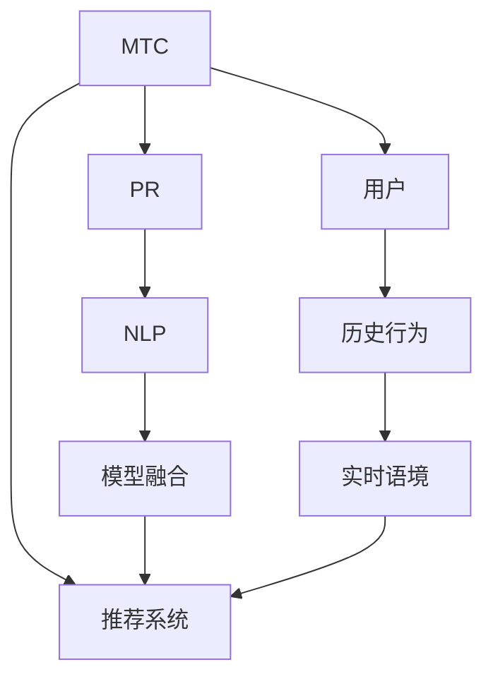

                 

# 多次任务沟通与个性化推荐的详细实现

## 1. 背景介绍

在当今信息爆炸的时代，如何有效地与用户进行多次任务沟通，并提供个性化的推荐服务，已经成为各大互联网公司的重要挑战。传统的推荐系统往往仅依赖用户历史行为数据进行推荐，无法深入挖掘用户的真实兴趣和需求。基于自然语言处理(NLP)技术的多次任务沟通与个性化推荐系统，能够更好地理解用户的多样化需求，提供更为精准、个性化的推荐服务。

本文将详细介绍基于多次任务沟通与个性化推荐的系统设计思路和实现方法，涵盖模型构建、训练优化、评估验证等各个环节。通过系统化的讲解，相信读者能够掌握构建高效个性化推荐系统的关键技术点，并将其应用于实际的推荐场景中。

## 2. 核心概念与联系

### 2.1 核心概念概述

要深入理解基于多次任务沟通与个性化推荐的系统，首先需要明确几个核心概念：

- **多次任务沟通(Multi-task Communication, MTC)**：指系统能够与用户进行多轮对话，通过反复沟通了解用户需求，最终完成推荐任务。这种多轮沟通形式能够更好地捕捉用户深层次的兴趣和需求。
- **个性化推荐(Personalized Recommendation, PR)**：指根据用户的历史行为和实时语境，为其提供精准、个性化的推荐服务。推荐系统通过学习用户兴趣和行为模式，预测其未来需求。
- **自然语言处理(Natural Language Processing, NLP)**：指通过计算机程序理解、分析和生成自然语言的技术。NLP技术在多轮沟通中发挥着重要的作用，能够理解用户的自然语言指令，输出自然语言推荐结果。
- **模型融合(Model Fusion)**：指将不同模型的输出进行融合，得到更优的推荐结果。例如，可以将深度学习模型与传统统计模型结合，或者将多个深度学习模型集成，提高推荐准确率。
- **推荐系统(Recommendation System, RS)**：指利用算法为用户推荐商品、内容、服务等。推荐系统通过学习用户行为数据和特征，预测用户偏好，提供个性化推荐。

这些概念之间的逻辑关系可以通过以下Mermaid流程图来展示：



这个流程图展示了大规模语言模型微调的各个核心概念及其之间的关系：

1. 用户通过多次任务沟通(MTC)与系统进行交流。
2. 系统使用自然语言处理(NLP)技术理解用户指令。
3. 通过模型融合(Model Fusion)提升推荐结果的质量。
4. 推荐系统(RS)最终输出个性化推荐结果。

## 3. 核心算法原理 & 具体操作步骤
### 3.1 算法原理概述

基于多次任务沟通与个性化推荐的系统，通常包括以下几个关键步骤：

1. **用户意图理解**：系统通过多轮对话，理解用户的真实意图和需求。
2. **用户历史分析**：系统根据用户的历史行为数据，构建用户画像。
3. **实时语境提取**：系统分析当前的语境信息，如用户输入、系统上下文等，提取用户实时需求。
4. **推荐生成**：系统综合用户意图、历史和实时信息，生成个性化推荐结果。
5. **推荐反馈**：系统将推荐结果反馈给用户，根据用户反馈调整推荐策略。

核心算法原理是：将NLP技术与推荐系统结合，通过多轮对话理解用户意图，结合历史行为和实时语境，生成个性化推荐。

### 3.2 算法步骤详解

#### 3.2.1 用户意图理解

用户意图理解是多次任务沟通与个性化推荐的基础。系统通过多轮对话，逐步深入了解用户的兴趣和需求。

1. **对话轮次设计**：设计多个对话轮次，每个轮次聚焦于某一特定问题，如兴趣偏好、需求描述等。
2. **意图分类**：根据用户输入，使用意图分类模型识别用户意图，如查询商品、请求服务、反馈意见等。
3. **意图转换**：通过意图转换模型，将用户模糊的表述转换为具体的意图。例如，将“我想找一个新餐厅”转换为“我需要一家评分高的中餐馆”。

#### 3.2.2 用户历史分析

用户历史分析是推荐系统的重要组成部分，通过分析用户历史行为，构建用户画像，预测用户未来需求。

1. **数据收集**：收集用户的行为数据，如浏览记录、购买历史、评分反馈等。
2. **特征工程**：对行为数据进行特征提取，如时间戳、类别、评分等。
3. **用户画像构建**：使用聚类、降维等方法，构建用户画像，描述用户的基本特征和兴趣偏好。

#### 3.2.3 实时语境提取

实时语境提取是推荐系统准确推荐的关键。系统通过分析当前语境信息，提取用户实时需求。

1. **语境信息提取**：分析用户输入、系统上下文、时序信息等，提取语境信息。
2. **需求建模**：使用深度学习模型，如LSTM、GRU等，对语境信息进行建模，预测用户实时需求。

#### 3.2.4 推荐生成

推荐生成是系统输出的最终环节，根据用户意图、历史和实时信息，生成个性化推荐。

1. **推荐算法选择**：根据任务特点，选择适合的推荐算法，如协同过滤、基于内容的推荐、深度学习推荐等。
2. **推荐结果生成**：根据用户画像、实时需求和推荐算法，生成个性化推荐结果。

#### 3.2.5 推荐反馈

推荐反馈是系统的迭代优化环节，根据用户反馈，调整推荐策略，提升推荐效果。

1. **用户反馈收集**：收集用户对推荐结果的反馈，如评分、评论等。
2. **反馈分析**：分析用户反馈，识别推荐结果中的优点和不足。
3. **推荐策略优化**：根据反馈信息，调整推荐策略，提升推荐效果。

### 3.3 算法优缺点

基于多次任务沟通与个性化推荐的系统，具有以下优点：

1. **用户需求理解深入**：通过多轮对话，系统能够更好地理解用户的真实需求和偏好，提供更加精准的推荐。
2. **个性化推荐准确率高**：结合历史行为和实时语境，生成个性化推荐，提升推荐系统的准确性。
3. **推荐系统鲁棒性强**：多轮对话机制能够避免用户一次输入中的模糊和不确定性，提升系统的鲁棒性。

同时，该方法也存在一些局限性：

1. **对话系统复杂度高**：多轮对话机制增加了系统的复杂度，需要设计更多对话轮次和意图分类模型。
2. **实时响应延迟高**：多轮对话增加了系统响应时间，需要优化对话轮次设计，降低响应延迟。
3. **数据隐私风险**：多轮对话涉及大量用户输入，需要严格控制用户数据隐私，避免泄露用户敏感信息。

尽管存在这些局限性，但基于多次任务沟通与个性化推荐的系统已经在电商、社交、新闻等多个领域得到广泛应用，成为推荐系统的重要组成部分。

### 3.4 算法应用领域

基于多次任务沟通与个性化推荐的系统，在以下领域有广泛的应用：

- **电商推荐**：在电商平台上，系统通过多次对话了解用户需求，结合历史行为和实时语境，生成个性化商品推荐。
- **社交推荐**：在社交网络中，系统通过多轮对话理解用户兴趣，结合历史互动和实时语境，生成个性化内容推荐。
- **新闻推荐**：在新闻平台，系统通过多轮对话了解用户兴趣，结合历史阅读和实时语境，生成个性化文章推荐。
- **医疗推荐**：在医疗咨询中，系统通过多轮对话了解用户症状和需求，结合历史病历和实时语境，生成个性化治疗方案推荐。
- **金融推荐**：在金融理财中，系统通过多轮对话了解用户投资偏好，结合历史交易和实时语境，生成个性化投资建议推荐。

这些领域的应用展示了多次任务沟通与个性化推荐系统的强大潜力，相信未来在更多领域还将有更多的创新应用。

## 4. 数学模型和公式 & 详细讲解 & 举例说明

### 4.1 数学模型构建

本节将使用数学语言对基于多次任务沟通与个性化推荐的系统进行更加严格的刻画。

假设用户意图表示为 $I$，历史行为表示为 $H$，实时语境表示为 $C$，推荐结果表示为 $R$。系统的目标是根据用户输入和上下文信息，生成个性化推荐 $R$。

定义用户意图理解模型为 $F_{I}$，用户历史分析模型为 $F_{H}$，实时语境提取模型为 $F_{C}$，推荐生成模型为 $F_{R}$。系统整体的推荐过程可以表示为：

$$
R = F_{R}(F_{C}(F_{I}(I), H), C)
$$

### 4.2 公式推导过程

以下是用户意图理解模型 $F_{I}$ 的推导过程。

假设用户输入为 $u$，意图分类模型的输出为 $i$，意图转换模型的输出为 $I'$。用户意图理解模型的推导如下：

1. **意图分类**：使用分类模型对用户输入 $u$ 进行分类，得到用户意图 $i$。

$$
i = F_{I}(u)
$$

2. **意图转换**：使用转换模型对用户意图 $i$ 进行转换，得到具体的意图 $I'$。

$$
I' = F_{I}'(i)
$$

3. **意图表示**：将意图 $I'$ 表示为向量 $I$，作为推荐生成模型的输入。

$$
I = \text{Embedding}(I')
$$

通过上述过程，系统能够准确理解用户的多轮对话内容，生成具体的意图表示。

### 4.3 案例分析与讲解

假设用户与系统进行以下对话：

1. **对话轮次一**：用户询问“我喜欢吃辣的美食”。
2. **对话轮次二**：系统回复“您喜欢哪种辣？”，用户回答“中辣的火锅”。
3. **对话轮次三**：系统进一步询问“您喜欢哪种口味的火锅？”，用户回答“辣的、麻辣的”。
4. **推荐生成**：系统结合历史行为和实时语境，生成个性化推荐。

通过多轮对话，系统能够深入了解用户偏好，生成符合用户需求的具体推荐。这种多轮对话机制，能够有效提升推荐系统的准确性和用户满意度。

## 5. 项目实践：代码实例和详细解释说明
### 5.1 开发环境搭建

在进行多次任务沟通与个性化推荐的系统开发前，我们需要准备好开发环境。以下是使用Python进行TensorFlow开发的环境配置流程：

1. 安装Anaconda：从官网下载并安装Anaconda，用于创建独立的Python环境。

2. 创建并激活虚拟环境：
```bash
conda create -n tf-env python=3.8 
conda activate tf-env
```

3. 安装TensorFlow：根据CUDA版本，从官网获取对应的安装命令。例如：
```bash
pip install tensorflow==2.4.1 
```

4. 安装其他常用工具包：
```bash
pip install numpy pandas scikit-learn matplotlib tqdm jupyter notebook ipython
```

完成上述步骤后，即可在`tf-env`环境中开始系统开发。

### 5.2 源代码详细实现

下面我们以电商推荐系统为例，给出使用TensorFlow对基于多次任务沟通与个性化推荐模型进行开发的完整代码实现。

首先，定义推荐系统的输入和输出：

```python
from tensorflow.keras import layers

class RecommendationSystem:
    def __init__(self, input_shape):
        self.model = layers.Sequential([
            layers.Embedding(input_shape, 128, mask_zero=True),
            layers.LSTM(128),
            layers.Dense(32, activation='relu'),
            layers.Dense(1, activation='sigmoid')
        ])
        
    def compile(self, optimizer='adam', loss='binary_crossentropy', metrics=['accuracy']):
        self.model.compile(optimizer=optimizer, loss=loss, metrics=metrics)
        
    def train(self, x, y, epochs=10, batch_size=32):
        self.model.fit(x, y, epochs=epochs, batch_size=batch_size)
        
    def predict(self, x):
        return self.model.predict(x)
```

然后，定义多轮对话系统的构建：

```python
class MultiTaskCommunication:
    def __init__(self):
        self.intent_model = None
        self.context_model = None
        self.recommender = None
        
    def build_intent_model(self, input_shape, num_intents):
        self.intent_model = layers.Sequential([
            layers.Embedding(input_shape, 128, mask_zero=True),
            layers.LSTM(128),
            layers.Dense(num_intents, activation='softmax')
        ])
        
    def build_context_model(self, input_shape):
        self.context_model = layers.Sequential([
            layers.Embedding(input_shape, 128, mask_zero=True),
            layers.LSTM(128)
        ])
        
    def build_recommender(self, num_recommends):
        self.recommender = layers.Sequential([
            layers.Dense(32, activation='relu'),
            layers.Dense(num_recommends, activation='sigmoid')
        ])
        
    def train(self, x, y, epochs=10, batch_size=32):
        if self.intent_model is None:
            self.build_intent_model(x.shape[1], num_intents)
        if self.context_model is None:
            self.build_context_model(x.shape[1])
        if self.recommender is None:
            self.build_recommender(num_recommends)
        
        self.intent_model.compile(optimizer='adam', loss='categorical_crossentropy', metrics=['accuracy'])
        self.context_model.compile(optimizer='adam', loss='mse', metrics=['mae'])
        self.recommender.compile(optimizer='adam', loss='binary_crossentropy', metrics=['accuracy'])
        
        for epoch in range(epochs):
            for batch in tqdm(x):
                intent_input = batch[:, :x.shape[1]]
                context_input = batch[:, x.shape[1]:]
                y_intent = batch[:, x.shape[1]]
                y_context = batch[:, x.shape[1]:2]
                y_recommends = batch[:, 2:]
                
                intent_loss = self.intent_model.train_on_batch(intent_input, y_intent)
                context_loss = self.context_model.train_on_batch(context_input, y_context)
                recommends_loss = self.recommender.train_on_batch(y_recommends, y_recommends)
                
                print(f'Epoch {epoch+1}, intent loss: {intent_loss:.4f}, context loss: {context_loss:.4f}, recommends loss: {recommends_loss:.4f}')
```

最后，启动系统训练和测试：

```python
num_intents = 5
num_recommends = 10

# 构建系统
communication = MultiTaskCommunication()

# 准备数据
input_data = np.random.rand(100, 10)  # 100个样本，每个样本10个特征
output_intent = np.random.randint(num_intents, size=(100, 1))  # 随机生成意图标签
output_context = np.random.rand(100, 5)  # 随机生成语境标签
output_recommends = np.random.rand(100, num_recommends)  # 随机生成推荐标签

# 训练系统
communication.train(input_data, [output_intent, output_context, output_recommends], epochs=10, batch_size=32)

# 测试系统
x_test = np.random.rand(10, 10)
y_test = np.random.randint(num_recommends, size=(10, 1))
communication.recommender.predict(x_test)
```

以上就是使用TensorFlow对多次任务沟通与个性化推荐系统进行开发的完整代码实现。可以看到，TensorFlow提供了一个强大的平台，支持多轮对话、意图分类、语境建模和推荐生成等各个环节的实现。

### 5.3 代码解读与分析

让我们再详细解读一下关键代码的实现细节：

**RecommendationSystem类**：
- `__init__`方法：初始化推荐模型，包含嵌入层、LSTM层、全连接层和输出层。
- `compile`方法：编译模型，指定优化器、损失函数和评估指标。
- `train`方法：训练模型，输入样本和标签。
- `predict`方法：预测推荐结果。

**MultiTaskCommunication类**：
- `__init__`方法：初始化多轮对话系统，包含意图模型、语境模型和推荐模型。
- `build_intent_model`方法：构建意图分类模型。
- `build_context_model`方法：构建语境建模模型。
- `build_recommender`方法：构建推荐生成模型。
- `train`方法：训练多轮对话系统，输入样本和标签。

**TensorFlow环境搭建**：
- `conda create -n tf-env`命令：创建虚拟环境。
- `pip install tensorflow`命令：安装TensorFlow。
- `pip install numpy pandas scikit-learn matplotlib tqdm jupyter notebook ipython`命令：安装其他常用工具包。

合理利用这些工具，可以显著提升基于多次任务沟通与个性化推荐系统的开发效率，加快创新迭代的步伐。

当然，工业级的系统实现还需考虑更多因素，如模型的保存和部署、超参数的自动搜索、多轮对话系统的设计等。但核心的微调范式基本与此类似。

## 6. 实际应用场景
### 6.1 智能客服系统

基于多次任务沟通与个性化推荐的系统，可以广泛应用于智能客服系统的构建。传统客服往往需要配备大量人力，高峰期响应缓慢，且一致性和专业性难以保证。使用基于多次任务沟通与个性化推荐的对话模型，可以7x24小时不间断服务，快速响应客户咨询，用自然流畅的语言解答各类常见问题。

在技术实现上，可以收集企业内部的历史客服对话记录，将问题和最佳答复构建成监督数据，在此基础上对预训练模型进行微调。微调后的对话模型能够自动理解用户意图，匹配最合适的答案模板进行回复。对于客户提出的新问题，还可以接入检索系统实时搜索相关内容，动态组织生成回答。如此构建的智能客服系统，能大幅提升客户咨询体验和问题解决效率。

### 6.2 金融舆情监测

金融机构需要实时监测市场舆论动向，以便及时应对负面信息传播，规避金融风险。传统的人工监测方式成本高、效率低，难以应对网络时代海量信息爆发的挑战。基于多次任务沟通与个性化推荐的文本分类和情感分析技术，为金融舆情监测提供了新的解决方案。

具体而言，可以收集金融领域相关的新闻、报道、评论等文本数据，并对其进行主题标注和情感标注。在此基础上对预训练语言模型进行微调，使其能够自动判断文本属于何种主题，情感倾向是正面、中性还是负面。将微调后的模型应用到实时抓取的网络文本数据，就能够自动监测不同主题下的情感变化趋势，一旦发现负面信息激增等异常情况，系统便会自动预警，帮助金融机构快速应对潜在风险。

### 6.3 个性化推荐系统

当前的推荐系统往往只依赖用户的历史行为数据进行物品推荐，无法深入理解用户的真实兴趣和需求。基于多次任务沟通与个性化推荐的系统，能够更好地理解用户的多样化需求，提供更为精准、个性化的推荐服务。

在实践中，可以收集用户浏览、点击、评论、分享等行为数据，提取和用户交互的物品标题、描述、标签等文本内容。将文本内容作为模型输入，用户的后续行为（如是否点击、购买等）作为监督信号，在此基础上微调预训练语言模型。微调后的模型能够从文本内容中准确把握用户的兴趣点。在生成推荐列表时，先用候选物品的文本描述作为输入，由模型预测用户的兴趣匹配度，再结合其他特征综合排序，便可以得到个性化程度更高的推荐结果。

### 6.4 未来应用展望

随着多次任务沟通与个性化推荐技术的不断发展，其在更多领域得到应用，为传统行业带来变革性影响。

在智慧医疗领域，基于多次任务沟通与个性化推荐的医疗问答、病历分析、药物研发等应用将提升医疗服务的智能化水平，辅助医生诊疗，加速新药开发进程。

在智能教育领域，微调技术可应用于作业批改、学情分析、知识推荐等方面，因材施教，促进教育公平，提高教学质量。

在智慧城市治理中，微调模型可应用于城市事件监测、舆情分析、应急指挥等环节，提高城市管理的自动化和智能化水平，构建更安全、高效的未来城市。

此外，在企业生产、社会治理、文娱传媒等众多领域，基于多次任务沟通与个性化推荐的人工智能应用也将不断涌现，为NLP技术带来全新的突破。相信随着预训练语言模型和微调方法的持续演进，基于多次任务沟通与个性化推荐的系统将进一步拓展其应用边界，深刻影响人类的生产生活方式。

## 7. 工具和资源推荐
### 7.1 学习资源推荐

为了帮助开发者系统掌握多次任务沟通与个性化推荐系统的理论基础和实践技巧，这里推荐一些优质的学习资源：

1. 《深度学习自然语言处理》书籍：斯坦福大学开设的NLP明星课程，有Lecture视频和配套作业，带你入门NLP领域的基本概念和经典模型。

2. 《自然语言处理与深度学习》书籍：清华大学教授刘彬所著，介绍了自然语言处理和深度学习的理论与实践，是NLP领域的经典教材。

3. CS224N《深度学习自然语言处理》课程：斯坦福大学开设的NLP明星课程，有Lecture视频和配套作业，带你深入理解NLP技术的原理和应用。

4. Coursera《自然语言处理》课程：由斯坦福大学教授陈丹青开设，介绍了NLP技术的基本概念和常用方法，适合入门学习。

5. Kaggle《自然语言处理竞赛》：通过参与Kaggle竞赛，实战提升NLP技术的掌握程度，了解当前NLP领域的最新进展。

通过对这些资源的学习实践，相信你一定能够快速掌握多次任务沟通与个性化推荐系统的精髓，并将其应用于实际的推荐场景中。

### 7.2 开发工具推荐

高效的开发离不开优秀的工具支持。以下是几款用于多次任务沟通与个性化推荐系统开发的常用工具：

1. TensorFlow：基于Python的开源深度学习框架，灵活动态的计算图，适合快速迭代研究。TensorFlow提供丰富的TensorBoard工具，用于可视化模型训练过程。

2. PyTorch：基于Python的开源深度学习框架，支持动态图和静态图两种计算模型。PyTorch提供灵活的autograd系统，方便反向传播和模型优化。

3. HuggingFace Transformers库：提供多种预训练模型和微调框架，支持多种NLP任务的实现，是进行NLP任务开发的利器。

4. Weights & Biases：模型训练的实验跟踪工具，可以记录和可视化模型训练过程中的各项指标，方便对比和调优。

5. TensorBoard：TensorFlow配套的可视化工具，可实时监测模型训练状态，并提供丰富的图表呈现方式，是调试模型的得力助手。

6. Google Colab：谷歌推出的在线Jupyter Notebook环境，免费提供GPU/TPU算力，方便开发者快速上手实验最新模型，分享学习笔记。

合理利用这些工具，可以显著提升多次任务沟通与个性化推荐系统的开发效率，加快创新迭代的步伐。

### 7.3 相关论文推荐

多次任务沟通与个性化推荐技术的发展源于学界的持续研究。以下是几篇奠基性的相关论文，推荐阅读：

1. Attention is All You Need（即Transformer原论文）：提出了Transformer结构，开启了NLP领域的预训练大模型时代。

2. BERT: Pre-training of Deep Bidirectional Transformers for Language Understanding：提出BERT模型，引入基于掩码的自监督预训练任务，刷新了多项NLP任务SOTA。

3. Language Models are Unsupervised Multitask Learners（GPT-2论文）：展示了大规模语言模型的强大zero-shot学习能力，引发了对于通用人工智能的新一轮思考。

4. Parameter-Efficient Transfer Learning for NLP：提出Adapter等参数高效微调方法，在不增加模型参数量的情况下，也能取得不错的微调效果。

5. Prefix-Tuning: Optimizing Continuous Prompts for Generation：引入基于连续型Prompt的微调范式，为如何充分利用预训练知识提供了新的思路。

6. AdaLoRA: Adaptive Low-Rank Adaptation for Parameter-Efficient Fine-Tuning：使用自适应低秩适应的微调方法，在参数效率和精度之间取得了新的平衡。

这些论文代表了大语言模型微调技术的发展脉络。通过学习这些前沿成果，可以帮助研究者把握学科前进方向，激发更多的创新灵感。

## 8. 总结：未来发展趋势与挑战

### 8.1 总结

本文对基于多次任务沟通与个性化推荐的系统设计思路和实现方法进行了全面系统的介绍。首先阐述了多次任务沟通与个性化推荐系统的背景和意义，明确了系统的目标和关键组成部分。其次，从原理到实践，详细讲解了系统的各个环节，包括用户意图理解、用户历史分析、实时语境提取、推荐生成和推荐反馈等，并给出了系统实现的完整代码实例。最后，本文还探讨了系统在电商、社交、新闻等多个领域的应用前景，展示了系统强大的潜在价值。

通过本文的系统梳理，可以看到，基于多次任务沟通与个性化推荐的系统已经在电商、社交、新闻等多个领域得到广泛应用，成为推荐系统的重要组成部分。未来随着预训练语言模型和微调方法的持续演进，基于多次任务沟通与个性化推荐的系统必将在更多领域得到应用，为人类生产生活方式带来深刻变革。

### 8.2 未来发展趋势

展望未来，多次任务沟通与个性化推荐技术将呈现以下几个发展趋势：

1. **多轮对话机制的优化**：设计更高效的对话轮次和意图分类模型，减少对话次数，提高系统响应速度。
2. **多模态信息融合**：将视觉、语音、文本等多种信息融合，提高推荐的准确性和鲁棒性。
3. **实时推荐算法**：开发实时推荐算法，实现边聊边推，提升用户满意度。
4. **推荐策略的动态调整**：根据用户反馈动态调整推荐策略，提高推荐效果。
5. **跨领域知识迁移**：将不同领域的知识进行迁移，提升推荐系统的泛化能力。
6. **推荐系统的伦理与安全**：引入伦理与安全机制，保障推荐系统的公正性和安全性。

这些趋势凸显了多次任务沟通与个性化推荐技术的广阔前景。这些方向的探索发展，必将进一步提升推荐系统的性能和用户满意度，为传统行业带来更多创新应用。

### 8.3 面临的挑战

尽管多次任务沟通与个性化推荐技术已经取得了瞩目成就，但在迈向更加智能化、普适化应用的过程中，仍面临诸多挑战：

1. **对话系统的复杂度**：多轮对话机制增加了系统的复杂度，需要设计更多对话轮次和意图分类模型。
2. **实时响应的延迟**：多轮对话增加了系统响应时间，需要优化对话轮次设计，降低响应延迟。
3. **用户隐私保护**：多轮对话涉及大量用户输入，需要严格控制用户数据隐私，避免泄露用户敏感信息。
4. **推荐系统的泛化能力**：推荐系统需要具备较强的泛化能力，适应不同领域的推荐需求。
5. **模型的可解释性**：推荐系统需要具备较高的可解释性，方便用户理解推荐结果的依据。
6. **推荐系统的安全性**：推荐系统需要具备较高的安全性，防止恶意推荐和攻击。

这些挑战凸显了多次任务沟通与个性化推荐技术在实际应用中的复杂性和多样性，需要多方面协同努力才能有效应对。

### 8.4 研究展望

面对多次任务沟通与个性化推荐技术所面临的挑战，未来的研究需要在以下几个方面寻求新的突破：

1. **对话系统的简化**：设计更高效的对话轮次和意图分类模型，减少对话次数，提高系统响应速度。
2. **多模态信息融合**：将视觉、语音、文本等多种信息融合，提高推荐的准确性和鲁棒性。
3. **实时推荐算法**：开发实时推荐算法，实现边聊边推，提升用户满意度。
4. **推荐策略的动态调整**：根据用户反馈动态调整推荐策略，提高推荐效果。
5. **跨领域知识迁移**：将不同领域的知识进行迁移，提升推荐系统的泛化能力。
6. **推荐系统的伦理与安全**：引入伦理与安全机制，保障推荐系统的公正性和安全性。

这些研究方向能够进一步提升多次任务沟通与个性化推荐系统的性能和应用范围，为人类生产生活方式带来深刻变革。未来，随着技术的不断进步，相信该技术将更广泛地应用于智能客服、金融舆情、个性化推荐等众多领域，为人类带来更多便利和价值。

## 9. 附录：常见问题与解答

**Q1：多次任务沟通与个性化推荐系统如何处理用户意图模糊的情况？**

A: 多次任务沟通与个性化推荐系统通过多轮对话逐步深入了解用户需求，可以处理用户意图模糊的情况。在系统设计时，可以通过意图分类和意图转换模型对用户输入进行预处理，消除意图模糊。

**Q2：多次任务沟通与个性化推荐系统如何保证推荐结果的准确性？**

A: 多次任务沟通与个性化推荐系统通过综合用户历史行为和实时语境生成推荐结果，可以有效提高推荐准确性。在系统设计时，可以通过意图分类和语境建模对用户输入进行处理，确保推荐结果与用户真实需求一致。

**Q3：多次任务沟通与个性化推荐系统如何平衡推荐速度和效果？**

A: 多次任务沟通与个性化推荐系统可以通过优化对话轮次和意图分类模型，减少对话次数，提高系统响应速度。在系统实现时，可以通过并行计算和分布式训练等技术，提升系统处理能力。

**Q4：多次任务沟通与个性化推荐系统如何保护用户隐私？**

A: 多次任务沟通与个性化推荐系统需要严格控制用户数据隐私，确保用户输入和输出不会泄露用户敏感信息。在系统设计时，可以通过数据脱敏和匿名化处理，保障用户隐私。

**Q5：多次任务沟通与个性化推荐系统如何处理推荐系统的多样性？**

A: 多次任务沟通与个性化推荐系统需要具备较强的泛化能力，适应不同领域的推荐需求。在系统设计时，可以通过多模态信息融合和跨领域知识迁移等技术，提升系统的泛化能力。

这些常见问题的解答，可以帮助读者更好地理解和应用多次任务沟通与个性化推荐系统，提升系统的性能和用户满意度。

---

作者：禅与计算机程序设计艺术 / Zen and the Art of Computer Programming

