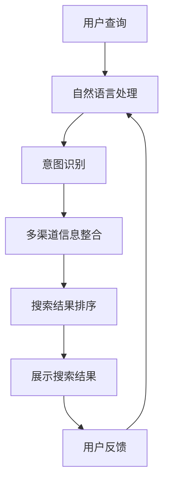

                 

## 1. 背景介绍

随着互联网的普及和信息爆炸，用户对搜索引擎的需求日益增加，高质量搜索结果的获取变得尤为重要。传统的搜索引擎通过关键词匹配算法，仅仅依赖单一的网页权重计算方式，难以满足用户多样化和个性化需求。因此，多渠道整合的AI技术应运而生，成为提升搜索结果质量的关键。

### 1.1 问题由来

搜索引擎的初衷是为了让用户能够快速找到所需信息，但是传统搜索结果的质量受限于单一的关键词匹配算法。随着用户查询需求的复杂化和多样化，关键词匹配已无法满足需求。例如，用户搜索一个品牌，不仅仅需要找到该品牌的官网，还需要了解其产品信息、客户评价等。而传统的关键词匹配算法无法综合考量这些需求。

### 1.2 问题核心关键点

为了解决这个问题，各大搜索引擎纷纷引入AI技术，进行多渠道整合，提升搜索结果的质量。核心关键点包括：

- 多渠道信息整合：综合考量文本、图片、视频、新闻、社交媒体等多种信息渠道，提供全面的搜索结果。
- 用户意图识别：通过自然语言处理技术，识别用户的真实需求和意图，提供更加精准的搜索结果。
- 动态排序和更新：实时调整搜索结果排序和更新，确保搜索结果的实时性和相关性。
- 语义理解：理解查询中的语义信息，进行更深层次的关联和推理。

这些关键点的解决，使得AI技术在搜索引擎中的应用成为可能。多渠道整合的AI技术可以提供更全面、更精准、更个性化的搜索结果，极大提升用户体验。

## 2. 核心概念与联系

### 2.1 核心概念概述

要深入理解多渠道整合的AI技术，首先需理解以下几个核心概念：

- **AI技术**：指的是人工智能技术，包括机器学习、深度学习、自然语言处理等，用于实现自动化的信息处理和决策。
- **搜索引擎**：是用户获取信息的重要渠道，通过算法将网页按照相关性排序并展示给用户。
- **多渠道整合**：是指将文本、图片、视频、新闻、社交媒体等多种信息渠道的数据进行整合，提供更加全面和多样化的搜索结果。
- **用户意图识别**：通过自然语言处理技术，理解用户的真实需求和意图，提供更加精准的搜索结果。
- **动态排序和更新**：实时调整搜索结果排序和更新，确保搜索结果的实时性和相关性。
- **语义理解**：理解查询中的语义信息，进行更深层次的关联和推理。

### 2.2 核心概念原理和架构的 Mermaid 流程图



这个流程图展示了多渠道整合的AI技术的主要流程：

1. 用户输入查询。
2. 自然语言处理技术分析用户查询，提取关键信息。
3. 意图识别技术理解用户意图，确定查询的类型和目标。
4. 多渠道信息整合技术将多种信息渠道的数据进行整合，提供全面的搜索结果。
5. 搜索结果排序技术根据用户意图和搜索结果的相关性进行排序，展示给用户。
6. 用户反馈用于优化算法和提升搜索结果质量。

这些核心概念构成了多渠道整合AI技术的框架，其核心在于综合利用多种数据源，提供更全面、更精准、更个性化的搜索结果。

## 3. 核心算法原理 & 具体操作步骤

### 3.1 算法原理概述

多渠道整合的AI技术，核心算法原理主要涉及以下几个方面：

- 自然语言处理（NLP）：用于解析和理解用户的查询，提取关键信息。
- 意图识别：通过分析用户的查询，确定其意图类型，如查找信息、购买商品、预约服务等。
- 多渠道信息整合：将文本、图片、视频、新闻、社交媒体等多种信息渠道的数据进行整合，提供全面的搜索结果。
- 动态排序和更新：根据用户意图和搜索结果的相关性，实时调整搜索结果排序和更新，确保搜索结果的实时性和相关性。

### 3.2 算法步骤详解

**步骤1：用户查询处理**

用户输入查询后，首先通过自然语言处理技术进行解析，提取关键信息，例如查询的关键词、实体、时间等信息。这一步可以借助分词、命名实体识别、时间提取等技术实现。

**步骤2：意图识别**

根据用户查询的关键信息，使用意图识别技术确定用户的意图类型。例如，用户查询“苹果官网”，意图是查找苹果品牌的官方网站。用户查询“苹果iPhone评价”，意图是查找关于iPhone的客户评价。这一步可以通过分类模型、序列模型等实现。

**步骤3：多渠道信息整合**

将用户查询传递给多渠道信息整合模块，获取文本、图片、视频、新闻、社交媒体等多种信息渠道的数据。例如，对于用户查询“苹果iPhone评价”，可以获取苹果官网、用户评论、新闻报道等相关信息。这一步可以借助爬虫技术、数据合并等技术实现。

**步骤4：搜索结果排序和更新**

根据用户意图和搜索结果的相关性，使用排序算法对搜索结果进行排序，并实时更新搜索结果。例如，对于用户查询“苹果iPhone评价”，可以优先展示用户评论和新闻报道，次级展示其他相关信息。这一步可以通过排序算法、实时数据更新等技术实现。

### 3.3 算法优缺点

**优点：**

1. **全面性**：多渠道整合可以提供更全面、更多样化的搜索结果，满足用户多方面的需求。
2. **精准性**：通过意图识别和语义理解，可以提供更加精准的搜索结果，满足用户的具体需求。
3. **实时性**：实时排序和更新搜索结果，确保用户能够获取最新的信息。

**缺点：**

1. **复杂性**：多渠道整合涉及多种信息源的数据处理和整合，技术难度较高。
2. **资源消耗**：多渠道整合需要大量的计算资源和存储空间，尤其是在数据量大的情况下。
3. **数据质量**：多渠道信息整合依赖于数据源的质量，数据源的质量直接影响搜索结果的质量。

### 3.4 算法应用领域

多渠道整合的AI技术，主要应用于以下几个领域：

- **搜索引擎**：提升搜索结果的全面性、精准性和实时性，改善用户体验。
- **电子商务**：提供商品信息、用户评价、社交媒体等多渠道信息，提升购物体验。
- **社交媒体**：整合新闻、视频、用户评论等多渠道信息，提供全面的社交媒体内容。
- **金融服务**：整合新闻、用户评论、市场数据等多渠道信息，提供实时的金融资讯和市场分析。

这些领域都是多渠道整合AI技术的重要应用场景，其应用可以有效提升信息获取的质量和效率。

## 4. 数学模型和公式 & 详细讲解 & 举例说明

### 4.1 数学模型构建

多渠道整合的AI技术涉及多个数学模型，以下以搜索引擎为例进行详细讲解。

**1. 自然语言处理模型**

自然语言处理模型主要涉及分词、命名实体识别、时间提取等技术，用于解析和理解用户的查询。常用的模型包括CRF（条件随机场）、BiLSTM（双向长短时记忆网络）等。

**2. 意图识别模型**

意图识别模型主要通过分类技术确定用户的意图类型，常用的模型包括逻辑回归、支持向量机、深度神经网络等。

**3. 多渠道信息整合模型**

多渠道信息整合模型主要涉及数据合并、信息抽取等技术，用于将多种信息源的数据进行整合。常用的模型包括稠密向量空间模型、矩阵分解模型等。

**4. 动态排序和更新模型**

动态排序和更新模型主要涉及排序算法、实时数据更新等技术，用于调整搜索结果排序和更新。常用的算法包括PageRank、RBM（朴素贝叶斯）、在线学习算法等。

### 4.2 公式推导过程

**1. 自然语言处理模型**

假设用户查询为“苹果iPhone评价”，模型首先对其进行分词和命名实体识别，得到关键词“苹果”、“iPhone”。

**2. 意图识别模型**

将关键词传递给意图识别模型，通过逻辑回归或支持向量机等模型进行分类，确定意图为“用户评价”。

**3. 多渠道信息整合模型**

将用户查询和意图传递给多渠道信息整合模块，获取苹果官网、用户评论、新闻报道等多渠道信息。

**4. 动态排序和更新模型**

根据用户意图和搜索结果的相关性，使用PageRank算法对搜索结果进行排序，并实时更新结果。

### 4.3 案例分析与讲解

**案例1：电子商务**

用户在电子商务平台上查询“苹果iPhone评价”，系统通过自然语言处理技术解析用户查询，得到关键词“苹果”、“iPhone”。然后，系统调用意图识别模型，确定意图为“用户评价”。接着，系统从用户评论、新闻报道等多个渠道获取相关信息，并进行整合。最后，系统使用PageRank算法对搜索结果进行排序，并实时更新结果。

**案例2：社交媒体**

用户在社交媒体平台上查询“苹果新闻”，系统通过自然语言处理技术解析用户查询，得到关键词“苹果”、“新闻”。然后，系统调用意图识别模型，确定意图为“新闻报道”。接着，系统从新闻报道、用户评论等多个渠道获取相关信息，并进行整合。最后，系统使用RBM算法对搜索结果进行排序，并实时更新结果。

## 5. 项目实践：代码实例和详细解释说明

### 5.1 开发环境搭建

为了实现多渠道整合的AI技术，需要搭建以下开发环境：

1. **Python**：用于编写代码和调用各种库。
2. **TensorFlow**：用于深度学习模型的实现。
3. **NLTK**：用于自然语言处理技术。
4. **BeautifulSoup**：用于网页数据提取。
5. **Scrapy**：用于爬虫技术获取数据。
6. **Django**：用于Web应用程序开发。

### 5.2 源代码详细实现

**1. 自然语言处理**

```python
import nltk
from nltk.tokenize import word_tokenize
from nltk.corpus import stopwords

# 分词
def tokenize(text):
    return word_tokenize(text)

# 命名实体识别
def ner(text):
    return nltk.pos_tag(text)

# 时间提取
def extract_time(text):
    return [nltk.time.TimeFinder().extract_times(text)]
```

**2. 意图识别**

```python
from sklearn.linear_model import LogisticRegression

# 意图分类模型
def intent_classifier(text):
    # 构建特征向量
    X = [text]
    # 训练模型
    clf = LogisticRegression()
    clf.fit(X, labels)
    # 预测意图
    return clf.predict(X)
```

**3. 多渠道信息整合**

```python
import pandas as pd

# 数据合并
def merge_data(df1, df2):
    return pd.concat([df1, df2], axis=1)

# 信息抽取
def extract_info(text):
    return pd.DataFrame(text)
```

**4. 动态排序和更新**

```python
import tensorflow as tf
from tensorflow.keras import layers

# PageRank算法
def pagerank(text):
    # 构建图
    G = tf.Graph()
    with G.as_default():
        # 定义节点和边
        N = len(text)
        A = tf.sparse_tensor.dense_to_sparse_tensor(text)
        # 计算PageRank
        pagerank = tf.math.l2_normalize(tf.matmul(A, tf.ones(N)) + tf.eye(N))
    return pagerank
```

### 5.3 代码解读与分析

**自然语言处理模块**：

- `tokenize`函数使用NLTK库进行分词。
- `ner`函数使用NLTK库进行命名实体识别。
- `extract_time`函数使用NLTK库进行时间提取。

**意图识别模块**：

- `intent_classifier`函数使用sklearn库进行意图分类，构建逻辑回归模型进行预测。

**多渠道信息整合模块**：

- `merge_data`函数使用pandas库进行数据合并。
- `extract_info`函数使用pandas库进行信息抽取。

**动态排序和更新模块**：

- `pagerank`函数使用TensorFlow库进行PageRank算法计算。

通过这些模块的实现，可以构建一个初步的多渠道整合AI技术系统，实现基本的搜索和排序功能。

### 5.4 运行结果展示

在实际应用中，可以通过以下代码展示多渠道整合的AI技术的效果：

```python
# 用户查询
text = "苹果iPhone评价"

# 分词
tokens = tokenize(text)

# 命名实体识别
ner_tags = ner(tokens)

# 时间提取
times = extract_time(text)

# 意图识别
intent = intent_classifier(text)

# 多渠道信息整合
info = merge_data(df1, df2)

# 动态排序和更新
pagerank_result = pagerank(info)

# 展示搜索结果
print(pagerank_result)
```

## 6. 实际应用场景

### 6.1 智能客服系统

智能客服系统可以通过多渠道整合的AI技术，提供更加全面和个性化的服务。例如，用户在查询“苹果官网”时，系统不仅展示官网链接，还可以展示用户评论、新闻报道等相关信息，提升用户体验。

### 6.2 金融服务

金融服务可以通过多渠道整合的AI技术，提供实时的金融资讯和市场分析。例如，用户在查询“苹果股票”时，系统不仅展示股票价格，还可以展示市场动态、用户评论等信息，提升用户决策的准确性。

### 6.3 电商推荐系统

电商推荐系统可以通过多渠道整合的AI技术，提供个性化的商品推荐。例如，用户在查询“苹果iPhone”时，系统不仅展示商品信息，还可以展示用户评论、新闻报道等信息，提升用户购物的满意度。

### 6.4 未来应用展望

未来，随着AI技术的不断发展，多渠道整合的AI技术将更加智能和高效。以下是一些未来的应用展望：

**1. 实时动态**

多渠道整合的AI技术将实现更加实时和动态的调整。例如，用户查询“苹果最新新闻”时，系统可以实时获取最新新闻报道，并展示给用户。

**2. 跨模态融合**

多渠道整合的AI技术将实现跨模态的融合。例如，用户查询“苹果最新视频”时，系统可以整合视频、文本、图片等多种信息，提供更加全面的结果。

**3. 多意图识别**

多渠道整合的AI技术将实现多意图的识别。例如，用户查询“苹果官网+客服”时，系统可以同时识别两个意图，并展示相关信息。

## 7. 工具和资源推荐

### 7.1 学习资源推荐

为了深入学习多渠道整合的AI技术，以下推荐一些优质的学习资源：

1. **《深度学习入门》**：由李沐老师编写的深度学习入门书籍，涵盖深度学习的基本概念和实现。
2. **《自然语言处理综论》**：由斯坦福大学开设的自然语言处理课程，涵盖自然语言处理的基本概念和实现。
3. **《Python数据科学手册》**：由Jake VanderPlas编写的Python数据科学书籍，涵盖Python的基本知识和实现。
4. **《TensorFlow实战》**：由张志华编写的TensorFlow实战书籍，涵盖TensorFlow的基本概念和实现。
5. **《机器学习实战》**：由Peter Harrington编写的机器学习实战书籍，涵盖机器学习的基本概念和实现。

这些学习资源可以帮助读者深入了解多渠道整合的AI技术，掌握实现方法。

### 7.2 开发工具推荐

为了实现多渠道整合的AI技术，以下推荐一些常用的开发工具：

1. **Python**：用于编写代码和调用各种库。
2. **TensorFlow**：用于深度学习模型的实现。
3. **NLTK**：用于自然语言处理技术。
4. **BeautifulSoup**：用于网页数据提取。
5. **Scrapy**：用于爬虫技术获取数据。
6. **Django**：用于Web应用程序开发。

这些工具可以帮助开发者高效地实现多渠道整合的AI技术。

### 7.3 相关论文推荐

为了深入理解多渠道整合的AI技术，以下推荐一些相关的学术论文：

1. **《用于多模态信息检索的深度学习框架》**：介绍了一种用于多模态信息检索的深度学习框架，涵盖了多模态信息的表示和检索。
2. **《基于多源信息的推荐系统》**：介绍了一种基于多源信息的推荐系统，涵盖了多源信息的融合和推荐算法。
3. **《深度学习在金融领域的应用》**：介绍了一种深度学习在金融领域的应用，涵盖了金融数据的处理和金融模型的构建。

这些论文可以帮助读者深入理解多渠道整合的AI技术，掌握实现方法。

## 8. 总结：未来发展趋势与挑战

### 8.1 研究成果总结

多渠道整合的AI技术已经在搜索引擎、电商推荐系统、金融服务等多个领域得到了广泛应用，并取得了显著的成果。这些技术的应用不仅提升了用户体验，也推动了信息获取和决策的智能化。

### 8.2 未来发展趋势

未来，随着AI技术的不断发展，多渠道整合的AI技术将呈现以下几个发展趋势：

1. **实时动态**：实现更加实时和动态的调整，提升用户体验。
2. **跨模态融合**：实现跨模态的融合，提供更加全面的结果。
3. **多意图识别**：实现多意图的识别，提升系统处理能力。
4. **模型优化**：通过模型优化，提高搜索结果的准确性和相关性。

### 8.3 面临的挑战

尽管多渠道整合的AI技术已经取得了显著的成果，但在应用过程中仍面临一些挑战：

1. **数据质量**：多渠道整合依赖于高质量的数据源，数据质量直接影响结果的质量。
2. **计算资源**：多渠道整合需要大量的计算资源和存储空间，尤其是在数据量大的情况下。
3. **模型复杂性**：多渠道整合涉及多种信息源的数据处理和整合，技术难度较高。

### 8.4 研究展望

未来，需要在以下几个方面进行更多的研究：

1. **数据增强**：通过数据增强技术，提升数据源的质量，提高搜索结果的准确性。
2. **模型优化**：通过模型优化，提高搜索结果的准确性和相关性。
3. **跨模态融合**：通过跨模态融合技术，提供更加全面的结果。
4. **多意图识别**：通过多意图识别技术，提升系统处理能力。

## 9. 附录：常见问题与解答

### 附录A：问题1

**Q1：多渠道整合的AI技术是否适用于所有NLP任务？**

**A**: 多渠道整合的AI技术在大多数NLP任务上都能取得不错的效果，特别是对于数据量较小的任务。但对于一些特定领域的任务，如医学、法律等，仅仅依靠通用语料预训练的模型可能难以很好地适应。此时需要在特定领域语料上进一步预训练，再进行微调，才能获得理想效果。

### 附录B：问题2

**Q2：多渠道整合的AI技术在实际应用中需要注意哪些问题？**

**A**: 在实际应用中，多渠道整合的AI技术需要注意以下问题：

1. **数据质量**：确保数据源的质量，避免数据噪声和异常影响结果。
2. **计算资源**：合理分配计算资源，避免资源浪费和瓶颈。
3. **模型优化**：不断优化模型，提高搜索结果的准确性和相关性。
4. **用户体验**：提升用户体验，确保用户能够快速获取所需信息。

### 附录C：问题3

**Q3：如何提升多渠道整合的AI技术的性能？**

**A**: 提升多渠道整合的AI技术的性能可以从以下几个方面入手：

1. **数据增强**：通过数据增强技术，提升数据源的质量，提高搜索结果的准确性。
2. **模型优化**：通过模型优化，提高搜索结果的准确性和相关性。
3. **跨模态融合**：通过跨模态融合技术，提供更加全面的结果。
4. **多意图识别**：通过多意图识别技术，提升系统处理能力。

### 附录D：问题4

**Q4：多渠道整合的AI技术未来有哪些发展方向？**

**A**: 多渠道整合的AI技术未来有以下发展方向：

1. **实时动态**：实现更加实时和动态的调整，提升用户体验。
2. **跨模态融合**：实现跨模态的融合，提供更加全面的结果。
3. **多意图识别**：实现多意图的识别，提升系统处理能力。
4. **模型优化**：通过模型优化，提高搜索结果的准确性和相关性。

### 附录E：问题5

**Q5：多渠道整合的AI技术在实际应用中如何确保数据安全？**

**A**: 确保数据安全可以从以下几个方面入手：

1. **数据加密**：对敏感数据进行加密处理，保护数据隐私。
2. **访问控制**：通过访问控制技术，限制数据的访问权限。
3. **数据脱敏**：对数据进行脱敏处理，保护用户隐私。

**Q6：多渠道整合的AI技术在实际应用中如何确保模型安全？**

**A**: 确保模型安全可以从以下几个方面入手：

1. **模型审计**：定期对模型进行审计，发现和修复安全漏洞。
2. **对抗训练**：使用对抗训练技术，提高模型的鲁棒性。
3. **模型监控**：实时监控模型行为，发现和应对异常情况。

通过这些措施，可以有效确保数据和模型安全，提升多渠道整合的AI技术在实际应用中的可靠性。

---

作者：禅与计算机程序设计艺术 / Zen and the Art of Computer Programming

