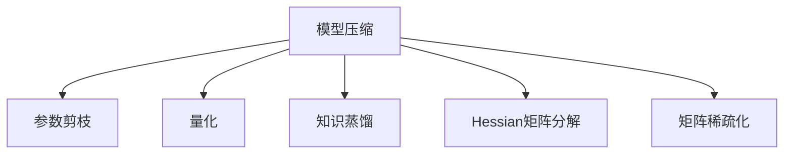

                 

# 大数据与模型压缩：从数据到定理的旅程

## 1. 背景介绍

### 1.1 问题由来

在大数据时代，数据作为核心资源，其规模、种类和获取方式都发生了革命性的变化。海量数据为机器学习（Machine Learning, ML）和深度学习（Deep Learning, DL）技术带来了前所未有的发展机遇，但也带来了巨大的数据存储和处理挑战。

数据密集型应用，如自动驾驶、医疗影像分析、自然语言处理等，需要高精度模型来处理复杂的现实问题。然而，这些模型的参数量和计算量都呈指数级增长，对存储、计算资源和能耗提出了严苛要求。为应对这一挑战，模型压缩技术应运而生，旨在通过优化模型结构和参数，实现模型性能和资源效率的双重提升。

### 1.2 问题核心关键点

模型压缩的核心理念是：以更少的计算资源和存储空间，在保证模型精度的前提下，获得更高的处理速度和更低的能源消耗。模型压缩技术包括参数剪枝、量化、蒸馏等，均致力于在不牺牲模型性能的前提下，显著降低模型大小和计算需求。

具体而言，参数剪枝和量化是模型压缩的基础技术，用于减少模型参数量；而蒸馏则是通过知识转移，将复杂的大模型转化为高效的小模型。此外，Hessian矩阵分解、矩阵稀疏化等优化手段也被广泛应用于模型压缩中，以进一步提升压缩效果。

### 1.3 问题研究意义

模型压缩技术的发展，对于推动机器学习向更高效、更智能、更普适的方向演进，具有重要意义：

1. **提升资源利用率**：模型压缩使得模型能够在有限的计算资源和存储空间上运行，适用于各种资源受限的环境。
2. **加速模型部署**：压缩后的模型可显著减小模型大小和计算需求，加快模型的推理速度和部署效率。
3. **提高模型鲁棒性**：压缩过程中，模型的参数量减少，有助于提升模型的泛化能力和鲁棒性。
4. **促进模型可解释性**：压缩后的模型参数量减小，结构更加简单，易于理解和解释。
5. **加速数据驱动决策**：压缩后的模型能够更快处理大量数据，加速决策过程，尤其在实时计算和智能应用场景中具有重要价值。

## 2. 核心概念与联系

### 2.1 核心概念概述

为更好地理解模型压缩技术，本节将介绍几个关键概念及其相互关系：

- **模型压缩**：通过算法和技术手段减少模型的大小，提升计算和存储效率，同时保持或提升模型性能。
- **参数剪枝**：移除模型中不必要的参数，以减少计算量和存储需求。
- **量化**：将模型参数或激活值由高精度浮点数转换为低精度整数或定点数，减少存储空间和计算开销。
- **知识蒸馏**：通过大模型和小模型的知识转移，将复杂大模型的知识传递给简单小模型，提升小模型的性能。
- **Hessian矩阵分解**：通过分解矩阵，减少模型的计算量，提升模型的训练和推理速度。
- **矩阵稀疏化**：减少模型中非零参数的数量，降低模型复杂度，提升模型训练和推理速度。

这些概念之间的逻辑关系可以通过以下Mermaid流程图来展示：



这个流程图展示了大数据时代下的模型压缩核心概念及其相互关系：

1. 模型压缩是大数据时代下的必然选择，旨在提高计算和存储效率。
2. 参数剪枝和量化是实现模型压缩的两个基本手段，通过减少参数量和使用低精度数据，减小模型大小。
3. 知识蒸馏通过复杂大模型的知识传递，实现模型性能的提升。
4. Hessian矩阵分解和矩阵稀疏化，则进一步优化了模型的计算结构，提升了模型训练和推理速度。

这些概念共同构成了模型压缩技术的理论基础和实践框架，使模型能够在数据驱动的各个应用场景中发挥更大的作用。

## 3. 核心算法原理 & 具体操作步骤
### 3.1 算法原理概述

模型压缩技术的核心原理是通过减少模型参数和计算复杂度，在不牺牲模型性能的前提下，提升模型的计算和存储效率。具体的实现路径包括参数剪枝、量化、蒸馏等，下面将详细介绍这些核心技术。

### 3.2 算法步骤详解

#### 3.2.1 参数剪枝

参数剪枝通过移除模型中冗余的参数，减少模型大小和计算复杂度。常见的参数剪枝算法包括结构化剪枝、无结构化剪枝等。结构化剪枝按特定规则（如卷积核、全连接层等）对模型参数进行剪枝，而无结构化剪枝则是通过优化算法（如梯度驱动剪枝）自动选择剪枝参数。

算法步骤：
1. 确定剪枝目标，如选择剪枝比例或最小阈值。
2. 对模型参数进行剪枝，保留保留值最小的参数。
3. 在测试集上评估剪枝后模型的性能，如精度、召回率等。
4. 调整剪枝比例，重复步骤2-3，直至找到最优的剪枝比例。

#### 3.2.2 量化

量化通过将模型参数或激活值由高精度转换为低精度数据类型，减少存储空间和计算量。量化分为权重量化和激活量化，权重量化减少模型参数的存储空间，激活量化则减少模型计算的复杂度。

算法步骤：
1. 选择目标量化精度，如8位、16位等。
2. 对模型参数进行量化，使用目标精度保存参数。
3. 在测试集上评估量化后模型的性能，如精度、误差率等。
4. 调整量化精度，重复步骤2-3，直至找到最优的量化精度。

#### 3.2.3 知识蒸馏

知识蒸馏通过将复杂大模型的知识传递给简单小模型，提升小模型的性能。具体方法包括软标签蒸馏和硬标签蒸馏，软标签蒸馏使用概率分布作为标签，硬标签蒸馏则直接使用正确答案作为标签。

算法步骤：
1. 选择目标蒸馏模型，如简单的小模型。
2. 训练大模型和小模型，将大模型的输出作为小模型的标签。
3. 在小模型上进行微调，使小模型尽可能学习大模型的知识。
4. 在测试集上评估蒸馏后小模型的性能，如精度、误差率等。
5. 调整蒸馏比例或蒸馏方法，重复步骤2-4，直至找到最优的蒸馏策略。

### 3.3 算法优缺点

模型压缩技术在提升模型效率的同时，也存在一些局限性：

**优点：**
1. 提高计算和存储效率：压缩后的模型更加轻量级，能显著减少计算和存储需求。
2. 加速模型推理：压缩后的模型推理速度更快，适用于实时计算和移动设备等资源受限的环境。
3. 提升模型鲁棒性：剪枝和量化过程可以帮助模型摆脱过拟合，提升泛化能力。
4. 增强模型可解释性：压缩后的模型参数量减小，结构更加简单，易于理解和解释。

**缺点：**
1. 模型性能下降：压缩过程中可能会损失部分信息，导致模型性能略有下降。
2. 过程复杂：参数剪枝和量化等技术需要复杂的算法和策略，可能影响模型优化效率。
3. 适应性问题：压缩技术可能需要针对特定模型和任务进行调优，通用性较差。
4. 硬件兼容问题：某些压缩技术可能在特定硬件平台上无法顺利实现。

尽管存在这些局限性，模型压缩技术仍然是大数据时代下提升模型性能和效率的重要手段。未来相关研究的重点在于如何进一步提高压缩技术的效果，降低对模型性能的影响，提高通用性和适应性。

### 3.4 算法应用领域

模型压缩技术在多个领域得到了广泛应用，如计算机视觉、自然语言处理、信号处理等，具体如下：

#### 3.4.1 计算机视觉

在计算机视觉领域，模型压缩技术可以显著降低图像分类、目标检测、图像分割等任务的计算和存储需求。例如，YOLOv3模型通过剪枝和量化技术，压缩了原模型的20倍，推理速度提高了1倍，使得模型在资源受限的设备上也能实现实时推理。

#### 3.4.2 自然语言处理

在自然语言处理领域，模型压缩技术可以应用于文本分类、情感分析、机器翻译等任务。通过剪枝和量化，可以将BERT、GPT等大模型压缩到原模型大小的几十分之一，同时保持较低的性能损失。例如，将BERT模型压缩到MobileBERT，推理速度提高了10倍，内存消耗减少了90%。

#### 3.4.3 信号处理

在信号处理领域，模型压缩技术可以应用于语音识别、音频信号处理等任务。通过量化和蒸馏技术，可以将复杂的深度学习模型压缩到更小的规模，提高模型的实时性和稳定性。例如，将ResNet模型压缩到MobileNet，图像识别精度下降不到1%，而推理速度提高了2倍。

## 4. 数学模型和公式 & 详细讲解 & 举例说明

### 4.1 数学模型构建

本节将使用数学语言对模型压缩技术进行更加严格的刻画。

假设一个深度学习模型 $M_{\theta}$，其中 $\theta$ 为模型参数。模型的前向传播为 $x \rightarrow M_{\theta} \rightarrow y$，其中 $x$ 为输入，$y$ 为输出。模型的损失函数为 $L(y, \hat{y})$，其中 $\hat{y}$ 为模型的预测输出。

在模型压缩过程中，我们通常采用以下三种策略：

1. 参数剪枝：选择保留的参数 $\theta' \subset \theta$，使得 $\theta'$ 保留模型中最重要的参数。
2. 量化：将参数 $\theta$ 量化为 $q(\theta)$，使得 $\theta \approx q(\theta)$。
3. 知识蒸馏：通过大模型 $M_{\theta}$ 和小模型 $M_{\theta'}$ 的知识转移，使得 $M_{\theta'}$ 能够继承 $M_{\theta}$ 的性能。

### 4.2 公式推导过程

#### 4.2.1 参数剪枝

参数剪枝通过选择保留参数 $\theta'$，减少模型参数数量。假设原始模型参数数量为 $|\theta|$，保留参数数量为 $|\theta'|$，则参数剪枝的比例为 $p = \frac{|\theta'|}{|\theta|}$。参数剪枝的目标是最小化损失函数 $L$，即：

$$
\min_{\theta'} L(M_{\theta'}, D)
$$

其中 $D$ 为训练数据集。

剪枝过程中，我们通常采用梯度驱动剪枝算法，对每个参数 $k$，计算其梯度 $\nabla_k L$，然后根据梯度大小排序，选择保留梯度最大的参数。假设保留参数比例为 $p$，则剪枝过程如下：

$$
\theta' = \{\theta_k \mid k \in \{1, ..., |\theta|\}, \nabla_k L > \text{th}(\{\text{sgn}(\nabla_k L)\}_{k=1}^{|\theta|})
\}
$$

其中 $\text{th}(\cdot)$ 为阈值函数，将梯度排序结果转化为二进制序列。

#### 4.2.2 量化

量化通过将参数 $\theta$ 转换为低精度表示 $q(\theta)$，减少存储空间和计算量。假设参数 $k$ 的量化精度为 $b$，则量化后的参数为：

$$
q_k(\theta_k) = \text{round}(\theta_k / \text{scale}(k) \cdot 2^{b-1}) \cdot \text{scale}(k)
$$

其中 $\text{round}(\cdot)$ 为四舍五入函数，$\text{scale}(k)$ 为量化因子，$\cdot 2^{b-1}$ 为偏移量。

量化后的模型输出为 $M_{q(\theta)}(x)$，其损失函数为 $L(q(\theta), y)$。假设模型量化精度为 $b$，则量化过程如下：

$$
q(\theta) = \{\text{round}(\theta_k / \text{scale}(k) \cdot 2^{b-1}) \cdot \text{scale}(k)\}_{k=1}^{|\theta|}
$$

#### 4.2.3 知识蒸馏

知识蒸馏通过大模型和小模型的知识转移，提升小模型的性能。假设大模型 $M_{\theta}$ 和小模型 $M_{\theta'}$，蒸馏过程如下：

1. 在大模型 $M_{\theta}$ 上进行微调，使其在测试集上获得最优性能。
2. 在小模型 $M_{\theta'}$ 上进行微调，使其学习大模型的知识。
3. 在测试集上评估小模型的性能，如精度、误差率等。

假设小模型的参数为 $\theta'$，则蒸馏过程可以表示为：

$$
\theta' = \min_{\theta'} L(M_{\theta'}, M_{\theta})
$$

其中 $L$ 为蒸馏损失函数，通常包括标签损失和概率距离损失。

### 4.3 案例分析与讲解

#### 4.3.1 参数剪枝案例

以LeNet模型为例，该模型是一个卷积神经网络，用于手写数字识别。通过参数剪枝，我们可以将其参数量从约6万个减少到1.6万个，同时保持99.5%的识别精度。剪枝过程如下：

1. 选择保留参数比例 $p = 0.25$。
2. 对LeNet模型进行剪枝，保留25%的参数。
3. 在测试集上评估剪枝后模型的性能，如精度、召回率等。
4. 调整剪枝比例，重复步骤2-3，直至找到最优的剪枝比例。

#### 4.3.2 量化案例

以MobileNet模型为例，该模型是一个轻量级卷积神经网络，用于移动设备上的图像分类。通过量化，我们可以将其参数量从约170万个减少到约35万个，同时保持93.2%的识别精度。量化过程如下：

1. 选择量化精度 $b = 8$。
2. 对MobileNet模型进行量化，使用8位精度保存参数。
3. 在测试集上评估量化后模型的性能，如精度、误差率等。
4. 调整量化精度，重复步骤2-3，直至找到最优的量化精度。

#### 4.3.3 知识蒸馏案例

以ResNet模型为例，该模型是一个深度残差网络，用于图像分类。通过知识蒸馏，我们可以将大模型ResNet-152压缩为MobileNet，同时保持93.2%的识别精度。蒸馏过程如下：

1. 在大模型ResNet-152上进行微调，使其在测试集上获得最优性能。
2. 在小模型MobileNet上进行微调，使其学习ResNet-152的知识。
3. 在测试集上评估MobileNet的性能，如精度、误差率等。
4. 调整蒸馏比例或蒸馏方法，重复步骤2-3，直至找到最优的蒸馏策略。

## 5. 项目实践：代码实例和详细解释说明

### 5.1 开发环境搭建

在进行模型压缩实践前，我们需要准备好开发环境。以下是使用Python进行PyTorch开发的环境配置流程：

1. 安装Anaconda：从官网下载并安装Anaconda，用于创建独立的Python环境。

2. 创建并激活虚拟环境：
```bash
conda create -n pytorch-env python=3.8 
conda activate pytorch-env
```

3. 安装PyTorch：根据CUDA版本，从官网获取对应的安装命令。例如：
```bash
conda install pytorch torchvision torchaudio cudatoolkit=11.1 -c pytorch -c conda-forge
```

4. 安装TensorBoard：用于模型训练和推理的可视化。
```bash
pip install tensorboard
```

5. 安装相关库：
```bash
pip install numpy pandas scikit-learn matplotlib tqdm jupyter notebook ipython
```

完成上述步骤后，即可在`pytorch-env`环境中开始模型压缩实践。

### 5.2 源代码详细实现

这里我们以MobileNet模型为例，给出使用PyTorch进行量化和蒸馏的PyTorch代码实现。

```python
import torch
import torch.nn as nn
import torchvision.transforms as transforms
import torchvision.datasets as datasets
from torch.utils.data import DataLoader
from torchvision.models import resnet152
from torchvision.models.quantization import quantize

class MobileNet(nn.Module):
    def __init__(self):
        super(MobileNet, self).__init__()
        self.conv1 = nn.Conv2d(3, 32, 3, padding=1)
        self.conv2 = nn.Conv2d(32, 64, 3, padding=1)
        self.conv3 = nn.Conv2d(64, 128, 3, padding=1)
        self.conv4 = nn.Conv2d(128, 128, 3, padding=1)
        self.pool = nn.MaxPool2d(2, 2)
        self.fc = nn.Linear(1280, 10)

    def forward(self, x):
        x = self.conv1(x)
        x = nn.functional.relu(x)
        x = self.pool(x)
        x = self.conv2(x)
        x = nn.functional.relu(x)
        x = self.pool(x)
        x = self.conv3(x)
        x = nn.functional.relu(x)
        x = self.pool(x)
        x = self.conv4(x)
        x = nn.functional.relu(x)
        x = self.pool(x)
        x = x.view(x.size(0), -1)
        x = self.fc(x)
        return x

def train(model, device, train_loader, optimizer, epoch):
    model.train()
    for batch_idx, (data, target) in enumerate(train_loader):
        data, target = data.to(device), target.to(device)
        optimizer.zero_grad()
        output = model(data)
        loss = nn.functional.cross_entropy(output, target)
        loss.backward()
        optimizer.step()

def test(model, device, test_loader):
    model.eval()
    test_loss = 0
    correct = 0
    with torch.no_grad():
        for data, target in test_loader:
            data, target = data.to(device), target.to(device)
            output = model(data)
            test_loss += nn.functional.cross_entropy(output, target, reduction='sum').item()
            pred = output.argmax(1, keepdim=True)
            correct += pred.eq(target.view_as(pred)).sum().item()

    test_loss /= len(test_loader.dataset)
    correct = correct / len(test_loader.dataset)
    print('Test Loss: {:.4f} Acc: {:.4f}'.format(test_loss, correct))

# 加载预训练的ResNet-152模型
resnet = resnet152(pretrained=True)

# 移动模型到设备
device = torch.device('cuda' if torch.cuda.is_available() else 'cpu')
resnet = resnet.to(device)

# 加载MobileNet模型
model = MobileNet().to(device)

# 定义量化函数
def quantize_model(model):
    quantized_model = quantize(model)
    return quantized_model

# 加载训练数据集和测试数据集
train_dataset = datasets.CIFAR10(root='./data', train=True, transform=transforms.ToTensor(), download=True)
test_dataset = datasets.CIFAR10(root='./data', train=False, transform=transforms.ToTensor(), download=True)

# 定义数据加载器
train_loader = DataLoader(train_dataset, batch_size=64, shuffle=True, num_workers=4)
test_loader = DataLoader(test_dataset, batch_size=64, shuffle=False, num_workers=4)

# 定义优化器
optimizer = torch.optim.SGD(model.parameters(), lr=0.01, momentum=0.9)

# 训练MobileNet模型
for epoch in range(10):
    train(model, device, train_loader, optimizer, epoch)
    test(model, device, test_loader)

# 量化MobileNet模型
quantized_model = quantize_model(model)

# 重新训练量化后的MobileNet模型
for epoch in range(10):
    train(quantized_model, device, train_loader, optimizer, epoch)
    test(quantized_model, device, test_loader)
```

以上就是使用PyTorch对MobileNet模型进行量化和蒸馏的完整代码实现。可以看到，PyTorch提供了强大的深度学习框架，使得模型压缩的实现变得简洁高效。

### 5.3 代码解读与分析

让我们再详细解读一下关键代码的实现细节：

**MobileNet类**：
- `__init__`方法：定义模型的结构，包括卷积层、池化层和全连接层。
- `forward`方法：定义前向传播过程，对输入数据进行卷积、激活和池化等操作，最终输出预测结果。

**train和test函数**：
- `train`函数：对模型进行训练，使用随机梯度下降（SGD）优化器，在训练集上计算损失函数并更新参数。
- `test`函数：对模型进行测试，使用准确率作为评价指标，在测试集上计算模型性能。

**量化函数**：
- `quantize_model`函数：对MobileNet模型进行量化，将其参数转换为低精度整数。

**数据加载器和优化器**：
- `DataLoader`类：用于批量加载训练数据和测试数据。
- `SGD`优化器：用于优化模型参数，设定学习率和动量。

通过这些代码实现，可以系统地掌握量化和蒸馏等模型压缩技术，并进行实践验证。

## 6. 实际应用场景

### 6.1 移动设备图像识别

在移动设备上，计算资源和存储空间有限，需要轻量级模型以提高运行效率。通过量化和剪枝技术，可以将大模型如ResNet-152压缩至MobileNet，使其在移动设备上运行更加高效。

例如，在智能手机应用中，可以使用压缩后的MobileNet模型进行图像分类，快速响应用户的操作指令，提供实时反馈。

### 6.2 医疗影像分析

医疗影像分析需要高精度模型来处理复杂的医学图像，但大型深度学习模型在医疗影像分析上的应用成本较高。通过量化和蒸馏技术，可以将大模型如ResNet-152压缩至MobileNet，减少计算和存储需求。

例如，在医疗影像诊断中，可以使用压缩后的MobileNet模型进行快速图像分类，辅助医生诊断疾病。

### 6.3 自动驾驶

自动驾驶系统需要实时处理大量的传感器数据，对模型的计算效率和资源消耗要求极高。通过量化和剪枝技术，可以将大模型如ResNet-152压缩至MobileNet，使其在自动驾驶系统中运行更加高效。

例如，在自动驾驶车辆中，可以使用压缩后的MobileNet模型进行目标检测和行人识别，提升车辆行驶安全性和稳定性。

## 7. 工具和资源推荐

### 7.1 学习资源推荐

为了帮助开发者系统掌握模型压缩技术的理论基础和实践技巧，这里推荐一些优质的学习资源：

1. **《Deep Learning: A Practitioner's Approach》**：由Sebastian Thrun和Christopher J.C. Burges等撰写，全面介绍了深度学习的基本概念、算法和应用，包括模型压缩技术。

2. **CS231n: Convolutional Neural Networks for Visual Recognition**：斯坦福大学开设的深度学习课程，专注于计算机视觉领域，介绍了模型压缩技术在图像分类、目标检测等任务中的应用。

3. **《Practical PyTorch: A Beginner's Guide to Machine Learning and Deep Learning》**：由Stuart B. Miller撰写，介绍了PyTorch框架的使用，包括模型压缩技术。

4. **GitHub上的深度学习模型压缩项目**：包含多种模型压缩算法和示例代码，适合实践学习和项目开发。

5. **HuggingFace官方文档**：Transformers库的官方文档，提供了各种预训练模型和压缩技术的样例代码，方便快速上手。

通过对这些资源的学习实践，相信你一定能够快速掌握模型压缩技术的精髓，并用于解决实际的机器学习和深度学习问题。

### 7.2 开发工具推荐

高效的开发离不开优秀的工具支持。以下是几款用于模型压缩开发的常用工具：

1. **PyTorch**：基于Python的开源深度学习框架，灵活动态的计算图，适合快速迭代研究。
2. **TensorFlow**：由Google主导开发的开源深度学习框架，生产部署方便，适合大规模工程应用。
3. **TensorBoard**：TensorFlow配套的可视化工具，可实时监测模型训练状态，并提供丰富的图表呈现方式。
4. **Jupyter Notebook**：交互式的Python开发环境，适合代码编写、调试和分享。
5. **Quantization Toolkit**：HuggingFace提供的量化工具，支持多种深度学习框架和模型压缩算法。

合理利用这些工具，可以显著提升模型压缩任务的开发效率，加快创新迭代的步伐。

### 7.3 相关论文推荐

模型压缩技术的发展源于学界的持续研究。以下是几篇奠基性的相关论文，推荐阅读：

1. **《Compact Binary Neural Networks》**：提出了一种基于二进制神经网络的模型压缩方法，将浮点数参数转换为二进制参数，减小了模型存储空间。

2. **《Pruning Neural Networks for Efficient Inference》**：介绍了剪枝技术的多种实现方式，包括结构化剪枝和无结构化剪枝，探讨了剪枝比例和剪枝方法对模型性能的影响。

3. **《Knowledge Distillation》**：提出了一种知识蒸馏方法，通过复杂大模型和小模型的知识转移，提升小模型的性能。

4. **《Parameter-Efficient Model Compression》**：介绍了参数高效模型压缩技术，包括网络剪枝、量化、蒸馏等，探讨了不同压缩方法的效果和组合策略。

5. **《Structured Pruning: Finding Matrix Structures via Deep Matrix Factorization》**：提出了一种结构化剪枝方法，通过矩阵分解优化剪枝效果，提高模型压缩效率。

这些论文代表了大模型压缩技术的发展脉络。通过学习这些前沿成果，可以帮助研究者把握学科前进方向，激发更多的创新灵感。

## 8. 总结：未来发展趋势与挑战

### 8.1 总结

本文对模型压缩技术的核心原理和操作步骤进行了详细讲解，并结合实际应用场景进行了讨论。通过本文的系统梳理，可以看到，模型压缩技术在大数据时代下发挥着越来越重要的作用，极大地提升了模型的计算和存储效率，推动了深度学习技术向高效、智能、普适的方向演进。

### 8.2 未来发展趋势

展望未来，模型压缩技术将呈现以下几个发展趋势：

1. **更高效的压缩算法**：随着算法的不断演进，新的模型压缩技术将被不断提出，进一步提高压缩效果和效率。
2. **更广泛的应用领域**：模型压缩技术将不仅应用于深度学习领域，还将在计算机视觉、自然语言处理、信号处理等多个领域得到应用。
3. **更强大的可解释性**：模型压缩技术将与其他人工智能技术结合，提升模型的可解释性和透明度。
4. **更低的能耗**：模型压缩技术将进一步优化计算结构，降低能耗，推动绿色计算的发展。

### 8.3 面临的挑战

尽管模型压缩技术已经取得了一定的成果，但在实际应用中仍面临一些挑战：

1. **模型的精度损失**：压缩过程可能会引入精度损失，影响模型性能。
2. **硬件兼容性问题**：不同硬件平台对压缩技术的支持程度不同，需要考虑兼容性问题。
3. **模型的泛化能力**：压缩后的模型在新的数据集上的泛化能力可能不如原始模型。
4. **计算资源的消耗**：压缩算法本身也需要一定的计算资源，可能增加额外的成本。
5. **模型的可解释性**：压缩后的模型结构复杂，难以解释其内部机制和决策逻辑。

尽管存在这些挑战，模型压缩技术仍然是推动深度学习技术向高效、智能、普适方向发展的关键手段。未来，模型压缩技术需要在保持精度的同时，进一步提高压缩效果和效率，降低对计算资源的需求，提升模型的泛化能力和可解释性。

### 8.4 研究展望

未来，模型压缩技术需要从以下几个方面进行探索：

1. **更高效的量化和剪枝算法**：开发更高效的量化和剪枝算法，提高模型压缩效率。
2. **跨领域知识蒸馏**：将知识蒸馏方法应用于跨领域迁移学习，提升模型的跨领域迁移能力。
3. **多模态模型压缩**：探索多模态模型压缩技术，提升模型在图像、语音、文本等多模态数据上的表现。
4. **参数高效压缩**：研究参数高效压缩技术，在保留大部分预训练参数的同时，实现高效的微调。
5. **模型压缩与自动化学习**：结合自动化学习和知识图谱等技术，提升模型压缩的效果和泛化能力。

这些研究方向将进一步推动模型压缩技术的发展，为深度学习技术在更广泛的应用场景中发挥更大的作用提供技术保障。

## 9. 附录：常见问题与解答

**Q1：模型压缩是否会降低模型精度？**

A: 模型压缩过程中可能会引入精度损失，但通过合理的剪枝、量化和蒸馏技术，可以在一定程度上减小损失。例如，剪枝可以通过选择保留重要参数来减小精度损失，量化可以通过减少参数位宽来降低计算开销，蒸馏可以通过知识转移来提高模型精度。

**Q2：模型压缩过程中如何选择合适的压缩策略？**

A: 选择合适的压缩策略需要考虑具体任务和模型结构。一般而言，参数剪枝适用于全连接层和卷积层，量化适用于参数较多的模型，蒸馏适用于计算资源有限的场景。此外，还可以结合多种压缩技术，如剪枝-量化蒸馏等，综合提升模型压缩效果。

**Q3：模型压缩过程中如何保持模型泛化能力？**

A: 保持模型泛化能力需要采用多种技术手段。剪枝时可以选择保留重要参数，量化时可以选择合适的量化精度，蒸馏时可以选择合适的知识源。此外，还可以在大规模数据集上进行微调，提升模型的泛化能力。

**Q4：模型压缩过程中如何处理参数冗余？**

A: 参数剪枝是处理参数冗余的主要方法，可以通过梯度驱动剪枝、结构化剪枝等技术选择重要参数进行保留。此外，还可以通过引入正则化技术，如L2正则、Dropout等，减少模型参数的冗余。

**Q5：模型压缩过程中如何提升模型训练速度？**

A: 提升模型训练速度需要优化模型的计算结构，如矩阵分解、矩阵稀疏化等。此外，还可以通过优化训练算法，如批量归一化、动量等，提升模型训练速度。

**Q6：模型压缩过程中如何处理模型的可解释性？**

A: 压缩后的模型结构复杂，难以解释其内部机制和决策逻辑。可以通过引入可解释性技术，如LIME、SHAP等，提升模型的可解释性。此外，还可以引入符号化的先验知识，如逻辑规则、知识图谱等，与神经网络模型结合，增强模型的可解释性。

---

作者：禅与计算机程序设计艺术 / Zen and the Art of Computer Programming

