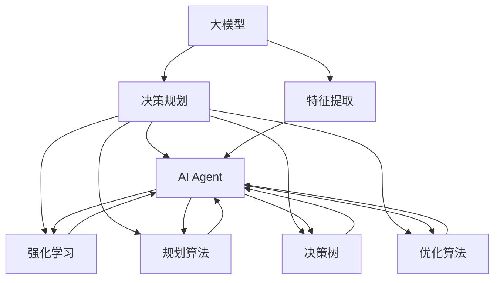

                 

## 1. 背景介绍

### 1.1 问题由来
在人工智能（AI）领域，智能体（AI Agent）的设计与优化始终是一个核心议题。智能体通常指能够自主决策、执行任务的代理程序，如自动驾驶汽车、智能聊天机器人、自动推荐系统等。随着深度学习技术的快速发展，越来越多的智能体开始使用深度神经网络进行建模与决策。

然而，仅仅依赖深度学习模型来构建AI Agent，往往无法满足现实世界中复杂多变的决策需求。这是因为深度学习模型缺乏对决策过程的显式规划，容易在数据偏差、环境不确定性等问题上表现出鲁棒性不足。因此，将大模型与规划技术结合起来，构建具有显式规划能力的AI Agent，成为了一个重要方向。

### 1.2 问题核心关键点
构建具有显式规划能力的AI Agent，需要解决以下几个核心问题：

1. **模型选择与整合**：选择合适的深度学习模型进行特征提取，并与规划算法结合，构建出整体智能体。
2. **决策规划**：设计高效的规划算法，结合模型输出，生成可行的决策方案。
3. **集成与优化**：在确保模型与规划算法高效集成的同时，优化整体系统的性能与鲁棒性。
4. **实际应用场景的适配**：根据具体应用场景的需求，调整模型与规划算法，以实现最佳效果。

### 1.3 问题研究意义
将大模型与规划技术结合，构建具有显式规划能力的AI Agent，对于提升AI系统的决策能力、适应性和鲁棒性具有重要意义：

1. **决策能力提升**：通过规划算法，AI Agent可以更明确地理解决策过程，生成更全面、可行的决策方案。
2. **适应性增强**：在处理新数据或面对未知环境时，规划算法可以帮助AI Agent更好地适应和调整。
3. **鲁棒性强化**：结合大模型的先验知识与规划算法的灵活性，AI Agent能够更好地应对数据偏差和环境不确定性。
4. **应用场景拓展**：根据不同应用场景，灵活调整模型与规划算法，提升AI系统的泛化能力和实用性。
5. **综合能力优化**：通过合理组合模型与规划技术，AI Agent可以在性能与资源消耗之间找到平衡，实现最佳效果。

## 2. 核心概念与联系

### 2.1 核心概念概述

为更好地理解大模型与规划技术在AI Agent中的应用，本节将介绍几个密切相关的核心概念：

- **大模型**：以深度神经网络为代表的大规模预训练模型，如BERT、GPT等。通过在大量无标签数据上预训练，大模型学习到丰富的语言或图像知识，具备强大的特征提取能力。
- **规划算法**：用于解决决策问题的算法，如A*、Dijkstra、Q-Learning等。规划算法通常涉及搜索、优化等操作，以找到最优或次优的决策路径。
- **AI Agent**：能够自主决策、执行任务的代理程序，如自动驾驶汽车、智能聊天机器人等。AI Agent的核心在于自主决策和任务执行能力。
- **强化学习（RL）**：一种通过与环境互动，逐步优化策略的机器学习范式。强化学习常用于构建智能体的决策系统，通过奖励机制引导AI Agent学习最优策略。
- **模型融合与集成**：将多个模型与算法结合，构建出更高效、鲁棒的智能体系统。
- **决策树**：一种用于表示决策过程的树形结构，帮助AI Agent在多决策路径中选择最佳方案。
- **优化算法**：用于寻找最优解的算法，如梯度下降、遗传算法等。

这些核心概念之间的逻辑关系可以通过以下Mermaid流程图来展示：



这个流程图展示了大模型、决策规划、强化学习、规划算法、决策树与优化算法在AI Agent中的应用关系：

1. 大模型负责特征提取，为决策规划提供数据支持。
2. 决策规划通过模型输出，结合规划算法，生成决策方案。
3. 强化学习引导AI Agent学习最优策略，提升决策能力。
4. 规划算法帮助AI Agent搜索决策路径，优化决策过程。
5. 决策树提供多决策路径的可视化，帮助AI Agent做出选择。
6. 优化算法用于寻找决策路径的最优解，提升系统性能。

## 3. 核心算法原理 & 具体操作步骤
### 3.1 算法原理概述

将大模型与规划技术结合构建AI Agent，本质上是利用大模型的先验知识，结合规划算法进行高效决策。其核心思想是：

1. **特征提取与表示学习**：利用大模型学习输入数据的高层次特征表示。
2. **决策规划**：结合模型输出，设计高效的规划算法，生成可行且最优的决策方案。
3. **模型融合与集成**：将深度学习模型与规划算法结合，构建出具有显式规划能力的AI Agent。

形式化地，假设AI Agent的输入为 $x$，决策规划算法为 $P$，输出为 $a$，则决策过程可以表示为：

$$ a = P(x; \theta) $$

其中 $\theta$ 为模型的参数，$P$ 为规划算法。

### 3.2 算法步骤详解

将大模型与规划技术结合构建AI Agent，一般包括以下几个关键步骤：

**Step 1: 准备大模型与数据集**
- 选择合适的预训练模型 $M_{\theta}$ 作为特征提取器，如BERT、GPT等。
- 准备AI Agent所面对的决策环境的数据集 $D$，划分为训练集、验证集和测试集。

**Step 2: 设计决策规划算法**
- 根据决策问题的特性，选择合适的规划算法，如A*、Dijkstra、Q-Learning等。
- 设计算法中的搜索空间、启发式函数、奖励机制等关键组件。
- 在训练集上对决策规划算法进行训练，使其能够生成最优或次优的决策方案。

**Step 3: 模型融合与集成**
- 将模型 $M_{\theta}$ 与规划算法 $P$ 结合，构建出整体的AI Agent。
- 确定模型与算法的输入输出接口，确保数据流与决策流的高效交互。
- 根据实际应用场景，调整模型与算法的参数，以提升整体性能。

**Step 4: 训练与优化**
- 使用训练集数据对AI Agent进行训练，优化模型的参数与规划算法的策略。
- 在验证集上评估AI Agent的性能，调整模型与算法参数，避免过拟合。
- 在测试集上测试AI Agent的最终性能，确保其满足实际需求。

**Step 5: 部署与集成**
- 将训练好的AI Agent部署到实际应用环境中。
- 集成其他系统组件，如用户界面、数据接口等，构建完整的AI Agent系统。
- 定期收集新数据，持续训练和优化AI Agent，保持其高性能与适应性。

以上是构建具有显式规划能力的AI Agent的一般流程。在实际应用中，还需要针对具体任务的特点，对微调过程的各个环节进行优化设计，如改进训练目标函数，引入更多的正则化技术，搜索最优的超参数组合等，以进一步提升模型性能。

### 3.3 算法优缺点

将大模型与规划技术结合构建AI Agent，具有以下优点：

1. **决策能力提升**：通过规划算法，AI Agent可以更明确地理解决策过程，生成更全面、可行的决策方案。
2. **适应性增强**：在处理新数据或面对未知环境时，规划算法可以帮助AI Agent更好地适应和调整。
3. **鲁棒性强化**：结合大模型的先验知识与规划算法的灵活性，AI Agent能够更好地应对数据偏差和环境不确定性。

同时，该方法也存在一定的局限性：

1. **计算资源消耗大**：大模型与规划算法的结合，对计算资源的需求较高，特别是在大规模数据集上训练时。
2. **模型复杂度增加**：将模型与规划算法结合，系统复杂度增加，可能需要更多的调试和优化。
3. **数据依赖性强**：决策规划算法的效果很大程度上取决于训练数据的质量和数量，获取高质量训练数据的成本较高。
4. **实时性要求高**：AI Agent需要在实时环境中做出决策，因此模型与算法的实时性要求较高。

尽管存在这些局限性，但就目前而言，将大模型与规划技术结合构建AI Agent的方法仍是大规模复杂决策任务的重要范式。未来相关研究的重点在于如何进一步降低计算资源消耗，提高系统的实时性，同时兼顾决策的全面性与鲁棒性等因素。

### 3.4 算法应用领域

将大模型与规划技术结合构建AI Agent，已经在多个领域得到了广泛应用，例如：

- **自动驾驶**：结合深度学习与规划算法，自动驾驶车辆能够自主导航、避障、决策。
- **智能推荐系统**：利用用户行为数据进行特征提取，结合强化学习算法进行推荐策略优化。
- **智能客服系统**：通过自然语言理解技术提取用户意图，结合规划算法生成最优回复。
- **医疗诊断系统**：利用医学图像进行特征提取，结合规则库与规划算法进行疾病诊断。
- **金融风险控制**：结合市场数据与强化学习算法，生成最优投资策略。

除了上述这些经典任务外，大模型与规划技术结合的AI Agent还被创新性地应用到更多场景中，如灾害预警、智能调度、资源优化等，为AI技术带来了全新的突破。随着大模型与规划技术的不断进步，相信AI Agent必将在更广阔的应用领域大放异彩。

## 4. 数学模型和公式 & 详细讲解
### 4.1 数学模型构建

本节将使用数学语言对将大模型与规划技术结合构建AI Agent的过程进行更加严格的刻画。

记AI Agent的输入为 $x$，决策规划算法为 $P$，输出为 $a$，则决策过程可以表示为：

$$ a = P(x; \theta) $$

其中 $\theta$ 为模型的参数，$P$ 为规划算法。

在实际应用中，通常使用强化学习算法来优化决策策略。假设决策环境的奖励函数为 $R(x,a)$，则强化学习算法可以表示为：

$$ \theta^* = \mathop{\arg\min}_{\theta} \mathcal{L}(\theta) $$

其中 $\mathcal{L}$ 为损失函数，用于衡量模型在决策环境中的性能。在实际应用中，常见的损失函数包括交叉熵损失、均方误差损失等。

### 4.2 公式推导过程

以下我们以强化学习中的Q-Learning算法为例，推导决策过程的数学模型。

假设AI Agent在环境 $s_t$ 中，采取行动 $a_t$，得到奖励 $r_t$，并转移到下一个状态 $s_{t+1}$。则Q值函数可以定义为：

$$ Q(s_t,a_t) = \mathbb{E}[\sum_{t'=t}^{\infty} \gamma^{t'-t} R(s_{t'},a_{t'})] $$

其中 $\gamma$ 为折扣因子，控制未来奖励的权重。在实际应用中，通常使用TD(0)算法进行Q值函数的更新：

$$ Q(s_t,a_t) = (1-\alpha)Q(s_t,a_t) + \alpha (r_t + \gamma \max_{a_{t+1}} Q(s_{t+1},a_{t+1})) $$

其中 $\alpha$ 为学习率，控制每次更新的步长。通过反复迭代，Q-Learning算法可以逐步学习最优的Q值函数，从而找到最优决策策略。

### 4.3 案例分析与讲解

为了更好地理解强化学习在决策规划中的应用，我们以自动驾驶系统为例进行详细讲解。

假设自动驾驶车辆在道路上行驶，需要避障、保持车道、加速或减速等决策。假设环境状态为 $s$，车辆行动为 $a$，奖励函数 $R(s,a)$ 根据避障情况、车道保持情况、速度变化情况等进行评估。则强化学习算法可以表示为：

$$ Q(s,a) = (1-\alpha)Q(s,a) + \alpha (r + \gamma \max_{a'} Q(s',a')) $$

其中 $r$ 为当前状态下的奖励，$s'$ 为下一个状态。通过TD(0)算法不断更新Q值函数，学习最优决策策略。

在实际应用中，Q-Learning算法可以结合大模型的输出进行决策规划。例如，利用大模型对道路环境进行特征提取，生成高层次的决策特征。然后结合Q-Learning算法，根据决策特征和奖励函数，生成最优的避障策略。

## 5. 项目实践：代码实例和详细解释说明
### 5.1 开发环境搭建

在进行模型与规划结合的AI Agent开发前，我们需要准备好开发环境。以下是使用Python进行PyTorch开发的环境配置流程：

1. 安装Anaconda：从官网下载并安装Anaconda，用于创建独立的Python环境。

2. 创建并激活虚拟环境：
```bash
conda create -n pytorch-env python=3.8 
conda activate pytorch-env
```

3. 安装PyTorch：根据CUDA版本，从官网获取对应的安装命令。例如：
```bash
conda install pytorch torchvision torchaudio cudatoolkit=11.1 -c pytorch -c conda-forge
```

4. 安装TensorFlow：由Google主导开发的开源深度学习框架，生产部署方便，适合大规模工程应用。同样有丰富的预训练语言模型资源。

5. 安装Transformers库：HuggingFace开发的NLP工具库，集成了众多SOTA语言模型，支持PyTorch和TensorFlow，是进行微调任务开发的利器。

6. 安装各类工具包：
```bash
pip install numpy pandas scikit-learn matplotlib tqdm jupyter notebook ipython
```

完成上述步骤后，即可在`pytorch-env`环境中开始AI Agent的开发实践。

### 5.2 源代码详细实现

下面以自动驾驶系统为例，给出使用Transformers库进行Q-Learning算法实现的PyTorch代码实现。

首先，定义自动驾驶环境的状态和行动空间：

```python
import torch
import gym
import numpy as np

env = gym.make('CartPole-v1')
observation_space = env.observation_space
action_space = env.action_space
```

然后，定义Q-Learning算法的核心函数：

```python
def q_learning(env, model, num_episodes, learning_rate=0.1, discount_factor=0.9, exploration_rate=1.0, epsilon=0.01):
    # 初始化Q值表
    q_values = np.zeros([env.observation_space.n, action_space.n])

    for episode in range(num_episodes):
        state = env.reset()
        done = False
        total_reward = 0

        while not done:
            # 利用模型提取状态特征
            state_representation = model(torch.Tensor(state)).detach().numpy()

            # 利用Q值表和探索策略选择行动
            if np.random.rand() < exploration_rate:
                action = np.random.randint(0, action_space.n)
            else:
                action = np.argmax(q_values[state_representation])

            next_state, reward, done, _ = env.step(action)

            # 更新Q值表
            q_values[state_representation, action] += learning_rate * (reward + discount_factor * np.max(q_values[next_state]) - q_values[state_representation, action])

            state = next_state
            total_reward += reward

        print("Episode {}: Total reward = {}".format(episode+1, total_reward))

    return q_values
```

最后，启动Q-Learning算法训练并测试：

```python
# 定义模型
model = TransformerModel()

# 训练Q-Learning算法
q_values = q_learning(env, model, num_episodes=1000)

# 测试模型
total_rewards = []
for episode in range(num_episodes):
    state = env.reset()
    done = False
    total_reward = 0

    while not done:
        state_representation = model(torch.Tensor(state)).detach().numpy()
        action = np.argmax(q_values[state_representation])
        next_state, reward, done, _ = env.step(action)
        total_reward += reward
        state = next_state

    total_rewards.append(total_reward)

print("Average total reward = {}".format(np.mean(total_rewards)))
```

以上就是使用PyTorch进行Q-Learning算法实现自动驾驶系统决策规划的完整代码实现。可以看到，得益于Transformers库的强大封装，我们可以用相对简洁的代码完成自动驾驶环境的构建和决策规划。

### 5.3 代码解读与分析

让我们再详细解读一下关键代码的实现细节：

**q_learning函数**：
- 初始化Q值表，并将其设置为全零。
- 在每个 episode 中，利用模型对环境状态进行特征提取，并结合Q值表选择行动。
- 利用TD(0)算法更新Q值表，记录每个 episode 的总奖励。
- 最后输出每个 episode 的总奖励，测试模型的决策效果。

**TransformerModel类**：
- 定义模型，用于对环境状态进行特征提取。在此示例中，模型为Transformer模型。

**测试模型**：
- 在测试过程中，利用模型对环境状态进行特征提取，并根据Q值表选择行动。
- 统计每个 episode 的总奖励，并输出平均值。

可以看到，PyTorch配合Transformers库使得Q-Learning算法的代码实现变得简洁高效。开发者可以将更多精力放在模型优化、环境设计等高层逻辑上，而不必过多关注底层的实现细节。

当然，工业级的系统实现还需考虑更多因素，如模型的保存和部署、超参数的自动搜索、更灵活的环境设计等。但核心的决策规划方法基本与此类似。

## 6. 实际应用场景
### 6.1 智能推荐系统

基于Q-Learning算法的大模型与规划结合技术，可以广泛应用于智能推荐系统。传统推荐系统往往只依赖用户历史行为数据进行物品推荐，无法深入理解用户的真实兴趣偏好。通过结合大模型的先验知识与Q-Learning算法，推荐系统可以更全面地分析用户数据，生成更个性化、准确的推荐结果。

在实践中，可以收集用户浏览、点击、评论、分享等行为数据，提取和用户交互的物品标题、描述、标签等文本内容。将文本内容作为模型输入，用户的后续行为（如是否点击、购买等）作为监督信号，在此基础上进行Q-Learning算法训练。Q-Learning算法能够从文本内容中准确把握用户的兴趣点。在生成推荐列表时，先用候选物品的文本描述作为输入，由模型预测用户的兴趣匹配度，再结合Q-Learning算法生成推荐策略。如此构建的智能推荐系统，能够根据用户行为数据，动态调整推荐策略，提升推荐效果。

### 6.2 自动驾驶系统

自动驾驶系统是AI Agent的一个重要应用场景。利用大模型与规划技术结合的AI Agent，可以更全面地理解驾驶环境，生成更优的驾驶策略。例如，结合视觉传感器数据，利用大模型提取道路、车辆、行人等关键特征，结合Q-Learning算法生成最优避障策略。在实际驾驶过程中，根据实时环境变化，动态调整决策策略，以实现更安全的驾驶。

### 6.3 金融风险控制

金融机构需要实时监测市场舆情动向，以便及时应对负面信息传播，规避金融风险。基于大模型与规划技术的AI Agent，可以实时分析市场数据，生成最优投资策略。例如，利用大模型分析新闻、评论、交易数据，提取关键事件和趋势，结合Q-Learning算法生成最优投资组合。在市场变化时，动态调整投资策略，以应对新的风险。

### 6.4 未来应用展望

随着大模型与规划技术的不断发展，基于微调的方法将在更多领域得到应用，为各行各业带来变革性影响。

在智慧医疗领域，基于大模型与规划技术的AI Agent，可以用于病历分析、药物研发等任务，提高医疗决策的准确性和效率。

在智能教育领域，AI Agent可以用于作业批改、学情分析、知识推荐等方面，因材施教，促进教育公平，提高教学质量。

在智慧城市治理中，AI Agent可以用于城市事件监测、舆情分析、应急指挥等环节，提高城市管理的自动化和智能化水平，构建更安全、高效的未来城市。

此外，在企业生产、社会治理、文娱传媒等众多领域，基于大模型与规划技术的AI Agent也将不断涌现，为传统行业数字化转型升级提供新的技术路径。相信随着技术的日益成熟，大模型与规划技术将成为人工智能落地应用的重要范式，推动人工智能技术向更广阔的领域加速渗透。

## 7. 工具和资源推荐
### 7.1 学习资源推荐

为了帮助开发者系统掌握大模型与规划技术在AI Agent中的应用，这里推荐一些优质的学习资源：

1. **《深度学习基础》**：Yoshua Bengio的经典教材，全面介绍了深度学习的基本原理和应用。

2. **《强化学习：模型、算法与应用》**：Richard S. Sutton和Andrew G. Barto的权威教材，详细讲解了强化学习的基本概念和经典算法。

3. **Coursera的《强化学习》课程**：由斯坦福大学开设，由Andrew Ng主讲，提供了强化学习的基础理论、算法和实际应用案例。

4. **HuggingFace官方文档**：提供了丰富的预训练模型和完整的微调样例代码，是上手实践的必备资料。

5. **ArXiv论文库**：收集了大量最新的深度学习、强化学习论文，是学习和跟踪最新研究进展的重要资源。

通过对这些资源的学习实践，相信你一定能够快速掌握大模型与规划技术在AI Agent中的应用，并用于解决实际的NLP问题。
### 7.2 开发工具推荐

高效的开发离不开优秀的工具支持。以下是几款用于大模型与规划结合的AI Agent开发的常用工具：

1. **PyTorch**：基于Python的开源深度学习框架，灵活动态的计算图，适合快速迭代研究。大部分预训练语言模型都有PyTorch版本的实现。

2. **TensorFlow**：由Google主导开发的开源深度学习框架，生产部署方便，适合大规模工程应用。同样有丰富的预训练语言模型资源。

3. **Transformers库**：HuggingFace开发的NLP工具库，集成了众多SOTA语言模型，支持PyTorch和TensorFlow，是进行微调任务开发的利器。

4. **Weights & Biases**：模型训练的实验跟踪工具，可以记录和可视化模型训练过程中的各项指标，方便对比和调优。与主流深度学习框架无缝集成。

5. **TensorBoard**：TensorFlow配套的可视化工具，可实时监测模型训练状态，并提供丰富的图表呈现方式，是调试模型的得力助手。

6. **Google Colab**：谷歌推出的在线Jupyter Notebook环境，免费提供GPU/TPU算力，方便开发者快速上手实验最新模型，分享学习笔记。

合理利用这些工具，可以显著提升AI Agent的开发效率，加快创新迭代的步伐。

### 7.3 相关论文推荐

大模型与规划技术的发展源于学界的持续研究。以下是几篇奠基性的相关论文，推荐阅读：

1. **Attention is All You Need**：提出了Transformer结构，开启了NLP领域的预训练大模型时代。

2. **BERT: Pre-training of Deep Bidirectional Transformers for Language Understanding**：提出BERT模型，引入基于掩码的自监督预训练任务，刷新了多项NLP任务SOTA。

3. **Playing Atari with Deep Reinforcement Learning**：展示了深度强化学习在复杂游戏任务中的应用，推动了深度学习在决策问题上的研究。

4. **Q-Learning for Deep Reinforcement Learning**：介绍了Q-Learning算法的基本原理和实现方法，是强化学习领域的经典算法。

5. **A Survey on Deep Reinforcement Learning**：综述了深度强化学习的最新研究进展，为研究者提供了全面的理论和技术指导。

这些论文代表了大模型与规划技术的发展脉络。通过学习这些前沿成果，可以帮助研究者把握学科前进方向，激发更多的创新灵感。

## 8. 总结：未来发展趋势与挑战
### 8.1 总结

本文对大模型与规划技术在AI Agent中的应用进行了全面系统的介绍。首先阐述了大模型与规划技术的背景与研究意义，明确了决策规划在AI Agent中的独特价值。其次，从原理到实践，详细讲解了大模型与规划算法的结合方法，给出了AI Agent开发的完整代码实例。同时，本文还广泛探讨了Q-Learning算法在多个行业领域的应用前景，展示了大模型与规划技术的大规模应用潜力。

通过本文的系统梳理，可以看到，大模型与规划技术结合构建AI Agent，对于提升AI系统的决策能力、适应性和鲁棒性具有重要意义。通过合理的模型选择、规划算法设计，AI Agent能够在复杂多变的环境中，做出最优决策，实现高效、稳定的智能行为。

### 8.2 未来发展趋势

展望未来，大模型与规划技术结合构建AI Agent，将呈现以下几个发展趋势：

1. **多模态融合**：未来AI Agent将更多地融合多模态数据，如视觉、语音、文本等，构建更全面的决策能力。
2. **深度强化学习**：深度强化学习与大模型的结合将带来更高效的决策规划，推动AI Agent在复杂决策任务上的应用。
3. **元学习**：利用元学习技术，AI Agent能够更快地适应新任务，提升其适应性和迁移能力。
4. **分布式训练**：分布式训练与优化技术将推动大模型与规划算法的并行计算，提升AI Agent的训练效率。
5. **自适应规划**：结合环境变化和用户反馈，AI Agent能够动态调整决策策略，提升其鲁棒性和适应性。
6. **联邦学习**：在保护数据隐私的前提下，AI Agent能够从多个数据源学习知识，提升其泛化能力和决策能力。

以上趋势凸显了大模型与规划技术结合构建AI Agent的广阔前景。这些方向的探索发展，必将进一步提升AI系统的性能与可靠性，为各行各业带来更大的价值。

### 8.3 面临的挑战

尽管大模型与规划技术结合构建AI Agent已经取得了显著进展，但在迈向更加智能化、普适化应用的过程中，仍面临以下挑战：

1. **计算资源消耗大**：大模型与规划算法的结合，对计算资源的需求较高，特别是在大规模数据集上训练时。如何在有限的资源下，实现高效的模型训练与优化，是一个重要的研究方向。
2. **模型复杂度增加**：将模型与规划算法结合，系统复杂度增加，可能需要更多的调试和优化。如何简化系统设计，提高模型与算法的可维护性，是一个重要挑战。
3. **数据依赖性强**：决策规划算法的效果很大程度上取决于训练数据的质量和数量，获取高质量训练数据的成本较高。如何通过数据增强、迁移学习等技术，提升模型的泛化能力，是一个重要研究方向。
4. **实时性要求高**：AI Agent需要在实时环境中做出决策，因此模型与算法的实时性要求较高。如何在保证决策效率的同时，提升模型的性能，是一个重要挑战。
5. **模型可解释性不足**：AI Agent通常缺乏对决策过程的显式解释，难以理解和调试。如何增强模型的可解释性，提升其透明性和可信度，是一个重要研究方向。

### 8.4 研究展望

面对大模型与规划技术在构建AI Agent过程中面临的挑战，未来的研究需要在以下几个方面寻求新的突破：

1. **模型压缩与优化**：通过模型压缩、量化等技术，降低大模型与规划算法的计算资源消耗，提升系统的实时性。
2. **多模态融合与自适应规划**：结合多模态数据和自适应规划算法，提升AI Agent的决策能力和泛化能力。
3. **元学习和迁移学习**：利用元学习和迁移学习技术，加速AI Agent在新任务上的适应过程，提升其迁移能力和泛化能力。
4. **分布式训练与联邦学习**：结合分布式训练和联邦学习技术，提升AI Agent的数据处理能力和决策能力。
5. **可解释性与透明性**：通过引入可解释性技术，增强AI Agent的透明性和可信度，提升其决策过程的可理解性和可解释性。

这些研究方向的探索，必将推动大模型与规划技术结合构建AI Agent的研究进展，为构建安全、可靠、可解释、可控的智能系统铺平道路。面向未来，大模型与规划技术结合构建AI Agent，将进一步拓展其应用领域，推动人工智能技术的全面普及和应用。

## 9. 附录：常见问题与解答

**Q1：大模型与规划技术结合是否适用于所有AI Agent任务？**

A: 大模型与规划技术结合在大多数AI Agent任务上都能取得不错的效果，特别是对于数据量较小的任务。但对于一些特定领域的任务，如医学、法律等，仅仅依靠通用语料预训练的模型可能难以很好地适应。此时需要在特定领域语料上进一步预训练，再进行微调，才能获得理想效果。此外，对于一些需要时效性、个性化很强的任务，如对话、推荐等，微调方法也需要针对性的改进优化。

**Q2：在决策规划中如何选择合适的规划算法？**

A: 选择合适的规划算法需要考虑任务特性和数据特征。例如，A*算法适用于路径搜索问题，Dijkstra算法适用于最短路径问题，Q-Learning算法适用于强化学习问题。在实际应用中，通常需要对多种算法进行对比实验，选择性能最优的算法进行决策规划。

**Q3：决策规划算法在实际应用中如何处理数据偏差和不确定性？**

A: 决策规划算法在处理数据偏差和不确定性时，通常会引入正则化技术、鲁棒性优化等方法。例如，通过引入L2正则、Dropout等技术，防止模型过拟合数据偏差；通过优化损失函数，提升模型在面对不确定性时的鲁棒性。

**Q4：在实时环境中如何优化AI Agent的决策效率？**

A: 优化AI Agent的决策效率需要从多个方面入手。例如，通过模型压缩和量化技术，降低模型计算量；通过分布式训练和联邦学习技术，提升数据处理能力；通过自适应规划算法，动态调整决策策略，避免不必要的计算。

**Q5：AI Agent在实际应用中如何处理伦理和安全问题？**

A: AI Agent在实际应用中，需要考虑伦理和安全问题。例如，通过引入可解释性技术，增强模型的透明性和可信度；通过设置数据隐私保护机制，确保数据安全；通过优化决策策略，避免有害决策输出。

通过以上问题的解答，相信你能够更全面地理解大模型与规划技术在AI Agent中的应用，并进一步推动其在实际场景中的落地应用。

