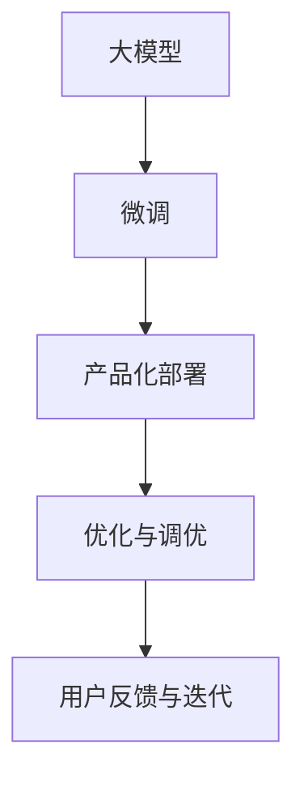

                 

# 大模型产品的挑战与乐趣

> 关键词：大模型,大模型产品,挑战,乐趣

## 1. 背景介绍

### 1.1 问题由来
近年来，随着深度学习技术的飞速发展，大模型（如BERT、GPT-3等）在NLP、图像识别、推荐系统等领域取得了显著的成果。这些大模型通过在大规模无标签数据上进行预训练，学习到了丰富的知识表示，能够通过微调（fine-tuning）在不同任务上取得优异的性能。然而，构建和使用大模型产品也面临着诸多挑战和乐趣。本文将从挑战和乐趣两个角度，深入探讨大模型产品的开发和应用。

### 1.2 问题核心关键点
大模型产品的主要挑战包括：数据采集、模型训练、产品化部署、优化与调优、用户反馈与迭代等。这些挑战需要研发团队具备丰富的经验和技术积累，才能将大模型成功地应用于实际场景。

而大模型产品的乐趣则在于其高效、灵活、强大的功能和表现，能够带来显著的业务价值提升，同时也为研发团队提供了不断创新和突破的机会。

## 2. 核心概念与联系

### 2.1 核心概念概述

为了更好地理解大模型产品的挑战与乐趣，本节将介绍几个关键概念及其相互联系：

- **大模型（Large Model）**：指的是使用大规模无标签数据进行预训练的模型，如BERT、GPT-3等。这些模型具备强大的知识表示能力，能够通过微调在不同任务上表现优异。

- **微调（Fine-Tuning）**：指在大模型上进行下游任务的微调，通过少量的有标签数据，调整模型参数以适应特定任务。微调是实现大模型产品的重要步骤之一。

- **产品化部署（Productization）**：指将训练好的大模型整合到具体的产品或服务中，实现用户需求的满足。这包括模型的优化、接口设计、用户交互等方面。

- **优化与调优（Optimization）**：在产品化部署过程中，需要对模型进行不断的优化调优，以提升性能、减少资源消耗等。

- **用户反馈与迭代（User Feedback and Iteration）**：通过收集用户反馈，不断迭代产品，以提高用户体验和满意度。这是大模型产品不断进化的重要环节。

这些概念之间的联系可以通过以下Mermaid流程图来展示：



这个流程图展示了从大模型到产品化部署的全过程，以及产品化部署后通过优化与调优和用户反馈与迭代进行持续改进的循环。

## 3. 核心算法原理 & 具体操作步骤

### 3.1 算法原理概述

大模型产品的核心算法原理基于预训练与微调（Fine-Tuning）。大模型通过在大规模无标签数据上进行预训练，学习到丰富的知识表示，能够在小规模有标签数据上进行微调，从而适应具体任务。

在微调过程中，使用大模型的权重作为初始化参数，通过有监督地训练优化模型，使其在特定任务上表现更好。微调的目标是最小化损失函数，使得模型输出与真实标签之间的差距最小。

### 3.2 算法步骤详解

大模型产品的微调步骤通常包括以下几个关键步骤：

1. **数据准备**：收集、清洗、标注下游任务的数据集，确保数据集的质量和多样性。

2. **模型初始化**：使用大模型作为初始化参数，如BERT、GPT-3等。

3. **微调训练**：在微调器上训练模型，通过前向传播计算损失函数，反向传播更新模型参数，最小化损失函数。

4. **评估与优化**：在验证集上评估模型性能，根据性能指标调整超参数，如学习率、批大小、迭代轮数等。

5. **部署与集成**：将微调后的模型部署到生产环境中，与产品或服务进行集成。

### 3.3 算法优缺点

大模型产品的微调算法具有以下优点：

- **高效性**：使用大规模预训练模型，能够在小样本数据上进行微调，减少标注数据成本。

- **通用性**：适用于多种NLP任务，如文本分类、命名实体识别、问答系统等，具有较好的泛化能力。

- **灵活性**：微调后的模型可以根据具体任务进行定制，提高模型性能。

同时，大模型产品的微调算法也存在一些缺点：

- **资源消耗**：预训练模型和微调过程需要大量的计算资源，如GPU、TPU等。

- **过拟合风险**：微调模型容易过拟合，特别是在数据集较小的情况下。

- **模型复杂度**：大模型参数量庞大，导致模型复杂度高，推理速度慢。

- **依赖标注数据**：微调效果高度依赖标注数据的质量和数量，标注成本较高。

### 3.4 算法应用领域

大模型产品的微调算法在NLP、图像识别、推荐系统等领域得到了广泛应用。例如，在自然语言处理中，可以使用微调后的BERT模型进行文本分类、命名实体识别、问答系统等任务；在图像识别中，可以使用微调后的ResNet模型进行图像分类、目标检测等任务；在推荐系统中，可以使用微调后的模型进行个性化推荐等。

## 4. 数学模型和公式 & 详细讲解 & 举例说明

### 4.1 数学模型构建

在微调过程中，通常使用有监督学习的损失函数来衡量模型输出与真实标签之间的差距。假设模型输出为 $y_{pred}$，真实标签为 $y_{true}$，损失函数 $\mathcal{L}$ 可以定义为交叉熵损失函数：

$$
\mathcal{L}(y_{pred}, y_{true}) = -\frac{1}{N} \sum_{i=1}^{N} y_{true_i} \log y_{pred_i}
$$

其中 $N$ 表示样本数。

### 4.2 公式推导过程

在微调过程中，模型参数 $\theta$ 的更新公式为：

$$
\theta \leftarrow \theta - \eta \nabla_{\theta} \mathcal{L}(\theta)
$$

其中 $\eta$ 为学习率，$\nabla_{\theta} \mathcal{L}(\theta)$ 为损失函数对模型参数 $\theta$ 的梯度。

### 4.3 案例分析与讲解

以微调BERT模型进行文本分类任务为例，假设有两个样本 $(X_1, Y_1)$ 和 $(X_2, Y_2)$，其中 $X_i$ 为输入文本，$Y_i$ 为分类标签，$Y_{pred}$ 为模型预测结果，则交叉熵损失函数为：

$$
\mathcal{L}(Y_{pred}, Y_{true}) = -\frac{1}{N} \sum_{i=1}^{N} Y_{true_i} \log Y_{pred_i}
$$

在微调过程中，模型的更新公式为：

$$
\theta \leftarrow \theta - \eta \nabla_{\theta} \mathcal{L}(\theta)
$$

## 5. 项目实践：代码实例和详细解释说明

### 5.1 开发环境搭建

在开始大模型产品开发之前，需要搭建好开发环境。以下是使用Python进行TensorFlow开发的环境配置流程：

1. 安装Anaconda：从官网下载并安装Anaconda，用于创建独立的Python环境。

2. 创建并激活虚拟环境：
```bash
conda create -n tf-env python=3.8 
conda activate tf-env
```

3. 安装TensorFlow：根据CUDA版本，从官网获取对应的安装命令。例如：
```bash
conda install tensorflow-gpu=2.4.1 -c conda-forge
```

4. 安装TensorBoard：
```bash
pip install tensorboard
```

5. 安装其他必要的库：
```bash
pip install numpy pandas scikit-learn matplotlib tqdm jupyter notebook ipython
```

完成上述步骤后，即可在`tf-env`环境中开始微调实践。

### 5.2 源代码详细实现

下面我们以微调BERT模型进行文本分类任务为例，给出使用TensorFlow的代码实现。

```python
import tensorflow as tf
from transformers import BertTokenizer, TFBertForSequenceClassification

# 定义模型和优化器
model = TFBertForSequenceClassification.from_pretrained('bert-base-uncased', num_labels=2)
optimizer = tf.keras.optimizers.Adam(learning_rate=2e-5)

# 定义损失函数
def compute_loss(labels, logits):
    loss_fct = tf.keras.losses.SparseCategoricalCrossentropy(from_logits=True)
    loss = loss_fct(labels, logits)
    return loss

# 定义评估函数
def evaluate(labels, logits):
    predictions = tf.argmax(logits, axis=1)
    accuracy = tf.metrics.sparse_categorical_accuracy(labels, predictions)
    return accuracy.numpy()

# 定义训练函数
@tf.function
def train_step(inputs, targets):
    with tf.GradientTape() as tape:
        logits = model(inputs['input_ids'], attention_mask=inputs['attention_mask'], token_type_ids=inputs['token_type_ids'])
        loss = compute_loss(targets, logits)
    grads = tape.gradient(loss, model.trainable_variables)
    optimizer.apply_gradients(zip(grads, model.trainable_variables))

# 加载数据集
tokenizer = BertTokenizer.from_pretrained('bert-base-uncased')
train_dataset = ...
val_dataset = ...

# 训练模型
epochs = 5
batch_size = 32

for epoch in range(epochs):
    for inputs, targets in train_dataset:
        train_step(inputs, targets)
    val_loss = val_dataset.batch(batch_size)
    val_predictions = model(val_dataset['input_ids'], attention_mask=val_dataset['attention_mask'], token_type_ids=val_dataset['token_type_ids'])
    val_labels = val_dataset['labels']
    accuracy = evaluate(val_labels, val_predictions)

# 在测试集上评估模型
test_dataset = ...
test_predictions = model(test_dataset['input_ids'], attention_mask=test_dataset['attention_mask'], token_type_ids=test_dataset['token_type_ids'])
test_labels = test_dataset['labels']
accuracy = evaluate(test_labels, test_predictions)
```

### 5.3 代码解读与分析

以上代码实现了使用TensorFlow微调BERT模型进行文本分类任务的过程。以下是关键代码的详细解读：

**模型初始化与优化器**：
```python
model = TFBertForSequenceClassification.from_pretrained('bert-base-uncased', num_labels=2)
optimizer = tf.keras.optimizers.Adam(learning_rate=2e-5)
```
- `TFBertForSequenceClassification.from_pretrained`：从Hugging Face Model Hub下载并初始化BERT模型。
- `num_labels=2`：设置输出层为二分类任务，标签数为2。
- `optimizer`：使用Adam优化器进行模型优化。

**损失函数**：
```python
def compute_loss(labels, logits):
    loss_fct = tf.keras.losses.SparseCategoricalCrossentropy(from_logits=True)
    loss = loss_fct(labels, logits)
    return loss
```
- `tf.keras.losses.SparseCategoricalCrossentropy`：计算交叉熵损失。
- `from_logits=True`：输出为未经过softmax处理的logits，即原始预测分数。

**评估函数**：
```python
def evaluate(labels, logits):
    predictions = tf.argmax(logits, axis=1)
    accuracy = tf.metrics.sparse_categorical_accuracy(labels, predictions)
    return accuracy.numpy()
```
- `tf.argmax`：从预测结果中提取最高概率的分类。
- `tf.metrics.sparse_categorical_accuracy`：计算准确率。

**训练函数**：
```python
@tf.function
def train_step(inputs, targets):
    with tf.GradientTape() as tape:
        logits = model(inputs['input_ids'], attention_mask=inputs['attention_mask'], token_type_ids=inputs['token_type_ids'])
        loss = compute_loss(targets, logits)
    grads = tape.gradient(loss, model.trainable_variables)
    optimizer.apply_gradients(zip(grads, model.trainable_variables))
```
- `tf.function`：将训练函数编译为TensorFlow图，提高执行效率。
- `tf.GradientTape`：记录梯度信息。
- `optimizer.apply_gradients`：更新模型参数。

### 5.4 运行结果展示

在训练和评估过程中，可以使用TensorBoard对模型的训练日志和评估结果进行可视化，帮助理解模型的表现和调整。以下是TensorBoard的代码示例：

```python
from tensorboard import SummaryWriter

# 创建TensorBoard日志记录器
writer = SummaryWriter()

# 在TensorBoard中记录训练和评估结果
writer.add_scalar('loss', loss, global_step=epoch)
writer.add_scalar('accuracy', accuracy, global_step=epoch)
```

以上代码将训练损失和评估准确率记录到TensorBoard中，可以实时查看训练过程和模型表现。

## 6. 实际应用场景

### 6.1 智能客服系统

大模型产品在智能客服系统中得到了广泛应用。传统客服系统需要配备大量人力，高峰期响应缓慢，且一致性和专业性难以保证。使用大模型产品，可以构建7x24小时不间断的智能客服系统，快速响应客户咨询，提供自然流畅的语言交流。

在技术实现上，可以收集企业内部的历史客服对话记录，将问题和最佳答复构建成监督数据，在此基础上对预训练模型进行微调。微调后的模型能够自动理解用户意图，匹配最合适的答复模板进行回复。对于客户提出的新问题，还可以接入检索系统实时搜索相关内容，动态组织生成回答。

### 6.2 金融舆情监测

金融机构需要实时监测市场舆论动向，以便及时应对负面信息传播，规避金融风险。使用大模型产品，可以构建金融舆情监测系统，实时抓取网络文本数据，自动判断文本属于何种主题，情感倾向是正面、中性还是负面。一旦发现负面信息激增等异常情况，系统便会自动预警，帮助金融机构快速应对潜在风险。

### 6.3 个性化推荐系统

当前的推荐系统往往只依赖用户的历史行为数据进行物品推荐，难以深入理解用户的真实兴趣偏好。使用大模型产品，可以构建个性化推荐系统，通过微调模型从文本内容中准确把握用户的兴趣点。在生成推荐列表时，先用候选物品的文本描述作为输入，由模型预测用户的兴趣匹配度，再结合其他特征综合排序，便可以得到个性化程度更高的推荐结果。

## 7. 工具和资源推荐

### 7.1 学习资源推荐

为了帮助开发者系统掌握大模型产品的开发和应用，这里推荐一些优质的学习资源：

1. **《Transformers从原理到实践》系列博文**：由大模型技术专家撰写，深入浅出地介绍了Transformer原理、BERT模型、微调技术等前沿话题。

2. **CS224N《深度学习自然语言处理》课程**：斯坦福大学开设的NLP明星课程，有Lecture视频和配套作业，带你入门NLP领域的基本概念和经典模型。

3. **《Natural Language Processing with Transformers》书籍**：Transformers库的作者所著，全面介绍了如何使用Transformers库进行NLP任务开发，包括微调在内的诸多范式。

4. **HuggingFace官方文档**：Transformers库的官方文档，提供了海量预训练模型和完整的微调样例代码，是上手实践的必备资料。

5. **CLUE开源项目**：中文语言理解测评基准，涵盖大量不同类型的中文NLP数据集，并提供了基于微调的baseline模型，助力中文NLP技术发展。

通过对这些资源的学习实践，相信你一定能够快速掌握大模型产品的开发和应用。

### 7.2 开发工具推荐

高效的开发离不开优秀的工具支持。以下是几款用于大模型产品开发常用的工具：

1. **PyTorch**：基于Python的开源深度学习框架，灵活动态的计算图，适合快速迭代研究。大部分预训练语言模型都有PyTorch版本的实现。

2. **TensorFlow**：由Google主导开发的开源深度学习框架，生产部署方便，适合大规模工程应用。同样有丰富的预训练语言模型资源。

3. **Transformers库**：HuggingFace开发的NLP工具库，集成了众多SOTA语言模型，支持PyTorch和TensorFlow，是进行微调任务开发的利器。

4. **Weights & Biases**：模型训练的实验跟踪工具，可以记录和可视化模型训练过程中的各项指标，方便对比和调优。与主流深度学习框架无缝集成。

5. **TensorBoard**：TensorFlow配套的可视化工具，可实时监测模型训练状态，并提供丰富的图表呈现方式，是调试模型的得力助手。

6. **Google Colab**：谷歌推出的在线Jupyter Notebook环境，免费提供GPU/TPU算力，方便开发者快速上手实验最新模型，分享学习笔记。

合理利用这些工具，可以显著提升大模型产品的开发效率，加快创新迭代的步伐。

### 7.3 相关论文推荐

大模型产品的发展源于学界的持续研究。以下是几篇奠基性的相关论文，推荐阅读：

1. **Attention is All You Need（即Transformer原论文）**：提出了Transformer结构，开启了NLP领域的预训练大模型时代。

2. **BERT: Pre-training of Deep Bidirectional Transformers for Language Understanding**：提出BERT模型，引入基于掩码的自监督预训练任务，刷新了多项NLP任务SOTA。

3. **Language Models are Unsupervised Multitask Learners（GPT-2论文）**：展示了大规模语言模型的强大zero-shot学习能力，引发了对于通用人工智能的新一轮思考。

4. **Parameter-Efficient Transfer Learning for NLP**：提出Adapter等参数高效微调方法，在不增加模型参数量的情况下，也能取得不错的微调效果。

5. **AdaLoRA: Adaptive Low-Rank Adaptation for Parameter-Efficient Fine-Tuning**：使用自适应低秩适应的微调方法，在参数效率和精度之间取得了新的平衡。

这些论文代表了大模型产品的发展脉络。通过学习这些前沿成果，可以帮助研究者把握学科前进方向，激发更多的创新灵感。

## 8. 总结：未来发展趋势与挑战

### 8.1 总结

本文对大模型产品的开发和应用进行了全面系统的介绍。首先阐述了大模型产品的挑战与乐趣，明确了其对业务价值和研发创新的重要意义。其次，从原理到实践，详细讲解了大模型产品的核心算法和具体操作步骤，给出了完整的大模型产品代码实现。同时，本文还探讨了大模型产品在实际场景中的应用，展示了其广泛的业务价值。最后，本文精选了学习资源、开发工具和相关论文，力求为读者提供全方位的技术指引。

通过本文的系统梳理，可以看到，大模型产品凭借其高效、灵活、强大的功能和表现，已经在NLP、图像识别、推荐系统等领域取得了显著的成果，并广泛应用于智能客服、金融舆情监测、个性化推荐等多个行业场景中。未来，伴随大模型产品和相关技术的不断演进，相信其在更多领域的应用将进一步拓展，为人工智能技术的发展带来新的突破。

### 8.2 未来发展趋势

展望未来，大模型产品的发展趋势将呈现出以下几个方向：

1. **模型规模持续增大**：随着算力成本的下降和数据规模的扩张，预训练语言模型的参数量还将持续增长。超大规模语言模型蕴含的丰富知识表示，有望支撑更加复杂多变的下游任务微调。

2. **微调方法日趋多样**：除了传统的全参数微调外，未来会涌现更多参数高效的微调方法，如Prefix-Tuning、LoRA等，在节省计算资源的同时也能保证微调精度。

3. **持续学习成为常态**：随着数据分布的不断变化，微调模型也需要持续学习新知识以保持性能。如何在不遗忘原有知识的同时，高效吸收新样本信息，将成为重要的研究课题。

4. **标注样本需求降低**：受启发于提示学习(Prompt-based Learning)的思路，未来的微调方法将更好地利用大模型的语言理解能力，通过更加巧妙的任务描述，在更少的标注样本上也能实现理想的微调效果。

5. **多模态微调崛起**：当前的微调主要聚焦于纯文本数据，未来会进一步拓展到图像、视频、语音等多模态数据微调。多模态信息的融合，将显著提升语言模型对现实世界的理解和建模能力。

6. **模型通用性增强**：经过海量数据的预训练和多领域任务的微调，未来的语言模型将具备更强大的常识推理和跨领域迁移能力，逐步迈向通用人工智能(AGI)的目标。

以上趋势凸显了大模型产品技术的广阔前景。这些方向的探索发展，必将进一步提升大模型产品的性能和应用范围，为人工智能技术的发展注入新的活力。

### 8.3 面临的挑战

尽管大模型产品在技术上取得了显著成就，但在实际应用中仍面临着诸多挑战：

1. **数据采集与标注成本高**：大模型产品通常需要大规模的高质量数据进行训练和微调，数据采集与标注成本较高。

2. **模型鲁棒性不足**：微调模型面对域外数据时，泛化性能往往大打折扣。对于测试样本的微小扰动，微调模型的预测也容易发生波动。

3. **资源消耗大**：超大规模语言模型和微调过程需要大量的计算资源，如GPU、TPU等。

4. **可解释性不足**：大模型产品通常作为"黑盒"系统，难以解释其内部工作机制和决策逻辑。

5. **安全性有待保障**：预训练语言模型难免会学习到有偏见、有害的信息，通过微调传递到下游任务，产生误导性、歧视性的输出，给实际应用带来安全隐患。

6. **优化与调优困难**：在大模型产品的微调过程中，如何平衡模型精度、计算资源和训练时间，是重要的优化方向。

### 8.4 研究展望

面对大模型产品面临的挑战，未来的研究需要在以下几个方面寻求新的突破：

1. **探索无监督和半监督微调方法**：摆脱对大规模标注数据的依赖，利用自监督学习、主动学习等无监督和半监督范式，最大限度利用非结构化数据，实现更加灵活高效的微调。

2. **研究参数高效和计算高效的微调范式**：开发更加参数高效的微调方法，在固定大部分预训练参数的同时，只更新极少量的任务相关参数。同时优化微调模型的计算图，减少前向传播和反向传播的资源消耗，实现更加轻量级、实时性的部署。

3. **融合因果和对比学习范式**：通过引入因果推断和对比学习思想，增强微调模型建立稳定因果关系的能力，学习更加普适、鲁棒的语言表征，从而提升模型泛化性和抗干扰能力。

4. **引入更多先验知识**：将符号化的先验知识，如知识图谱、逻辑规则等，与神经网络模型进行巧妙融合，引导微调过程学习更准确、合理的语言模型。同时加强不同模态数据的整合，实现视觉、语音等多模态信息与文本信息的协同建模。

5. **结合因果分析和博弈论工具**：将因果分析方法引入微调模型，识别出模型决策的关键特征，增强输出解释的因果性和逻辑性。借助博弈论工具刻画人机交互过程，主动探索并规避模型的脆弱点，提高系统稳定性。

6. **纳入伦理道德约束**：在模型训练目标中引入伦理导向的评估指标，过滤和惩罚有偏见、有害的输出倾向。同时加强人工干预和审核，建立模型行为的监管机制，确保输出符合人类价值观和伦理道德。

这些研究方向的探索，必将引领大模型产品技术的不断进步，为人工智能技术的发展提供新的动力。

## 9. 附录：常见问题与解答

**Q1：大模型产品是否适用于所有NLP任务？**

A: 大模型产品通常适用于大多数NLP任务，但某些特定领域的任务可能需要进一步的预训练和微调。例如，医学、法律等领域的任务通常需要更多领域特定的数据和知识。

**Q2：大模型产品的微调过程是否可以避免过拟合？**

A: 大模型产品的微调过程可以通过多种策略避免过拟合，例如使用数据增强、正则化、对抗训练等。但完全避免过拟合较为困难，需要通过不断的迭代优化来平衡模型性能。

**Q3：如何评估大模型产品的性能？**

A: 评估大模型产品的性能通常需要从多个角度进行，包括精度、召回率、F1值、计算速度等。使用标准数据集和评估指标进行对比测试，可以更全面地评估模型性能。

**Q4：大模型产品的开发过程中有哪些挑战？**

A: 大模型产品的开发过程中，主要挑战包括数据采集、模型训练、产品化部署、优化与调优、用户反馈与迭代等。每个环节都需要精心设计和持续优化，才能实现最佳效果。

**Q5：大模型产品的开发过程中有哪些乐趣？**

A: 大模型产品的开发过程中，乐趣在于不断挑战和突破技术瓶颈，实现高性能、高可用的模型，同时帮助用户解决实际问题，提升业务价值。与用户的互动和反馈，也带来不断进步的动力和成就感。

---

作者：禅与计算机程序设计艺术 / Zen and the Art of Computer Programming

