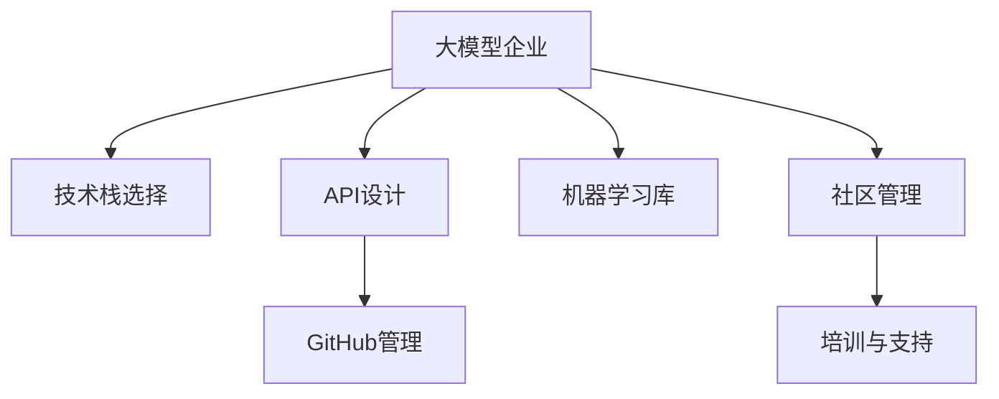

                 

# 大模型企业的开发者生态构建

> 关键词：大模型企业,开发者生态,技术栈,API设计,GitHub,机器学习库,社区管理,培训与支持

## 1. 背景介绍

### 1.1 问题由来

随着人工智能技术的不断进步，大模型企业（Large Model Enterprises, LMEs）已经成为推动技术发展、促进产业转型的关键力量。这些企业汇集了世界各地的顶尖人才和先进技术，拥有丰富的大型预训练模型（Large Pre-trained Models, LPMs）资源，能够在多个领域实现卓越性能。然而，要充分利用这些资源，构建高效、稳定的开发者生态，是大模型企业面临的重要挑战。

大模型企业需要构建一个开发者社区，吸引并支持广大的开发者群体，利用开源和商业化结合的方式，快速推动模型创新和应用落地。一个成熟的开发者生态，不仅能够加速模型商业化进程，还能为企业带来更高的市场竞争力。因此，构建一个健全的开发者生态，是大模型企业必须重视的重要任务。

### 1.2 问题核心关键点

大模型企业开发者生态的构建，涉及多个层面：

- **技术栈选择**：选择适合企业核心业务的开发语言、框架、库等。
- **API设计**：设计简单易用、高效可靠的API接口，支持模型的快速集成和应用。
- **GitHub管理**：管理和维护代码库，确保代码的质量和版本控制。
- **机器学习库**：开发和支持丰富的机器学习库，方便开发者进行模型训练和优化。
- **社区管理**：组织和运营开发者社区，提供技术支持、培训和交流平台。
- **培训与支持**：提供全面的技术文档、培训课程和支持服务，帮助开发者快速上手。

这些关键点之间相互依赖，只有全面提升各个环节的协同性和完备性，才能构建一个高效、稳定、繁荣的开发者生态。

### 1.3 问题研究意义

构建大模型企业的开发者生态，具有以下重要意义：

1. **加速模型落地**：构建完善的开发者生态，能够大幅缩短模型的开发和部署周期，加速技术的商业化进程。
2. **提高市场竞争力**：通过吸引大量高质量开发者，大模型企业能够推出更先进、更实用的产品和服务，提升市场竞争力。
3. **增强技术创新**：一个活跃的开发者社区，能够集思广益，推动模型和技术的持续创新。
4. **促进产业升级**：开发者生态的繁荣，有助于推动相关行业的数字化转型，加速产业升级。
5. **降低企业成本**：通过开源合作和共享资源，大模型企业可以降低开发成本，实现更高的投资回报。

## 2. 核心概念与联系

### 2.1 核心概念概述

要构建大模型企业的开发者生态，需要理解以下核心概念：

- **大模型企业**：指拥有丰富大型预训练模型资源，具有较强的技术实力和市场影响力的企业。如Google、OpenAI、微软等。
- **开发者生态**：指围绕企业大模型构建的开发者社区，包括开源工具、API接口、代码库、培训支持等。
- **技术栈**：指企业开发过程中使用的编程语言、框架、库、工具等技术组合。
- **API设计**：指设计简单易用、高效可靠的API接口，支持模型和服务的快速集成和调用。
- **GitHub管理**：指管理和维护代码库，确保代码的质量、版本控制和社区协作。
- **机器学习库**：指企业开发和支持的各种机器学习库，方便开发者进行模型训练和优化。
- **社区管理**：指组织和运营开发者社区，提供技术支持、培训和交流平台。
- **培训与支持**：指提供全面的技术文档、培训课程和支持服务，帮助开发者快速上手。

这些核心概念之间的逻辑关系可以通过以下Mermaid流程图来展示：



这个流程图展示了大模型企业开发者生态构建的关键环节及其相互关系：

1. 大模型企业选择适合的技术栈，设计易用的API接口。
2. 管理代码库，提供丰富的机器学习库支持。
3. 组织和运营开发者社区，提供培训和支持服务。

## 3. 核心算法原理 & 具体操作步骤
### 3.1 算法原理概述

大模型企业的开发者生态构建，本质上是一个系统工程，涉及多个技术环节的协同工作。其核心思想是通过技术栈的选择和设计、API接口的优化、GitHub的管理、机器学习库的开发、社区的运营、培训和支持等环节的有机结合，形成一套高效、稳定、可扩展的开发者生态系统。

形式化地，假设大模型企业为 $LME$，其技术栈为 $\mathcal{S}$，API接口为 $\mathcal{API}$，GitHub管理策略为 $\mathcal{G}$，机器学习库为 $\mathcal{ML}$，社区运营模式为 $\mathcal{C}$，培训支持体系为 $\mathcal{T}$。构建开发者生态的目标是最大化生态系统的价值 $V$：

$$
V = \max_{\mathcal{S},\mathcal{API},\mathcal{G},\mathcal{ML},\mathcal{C},\mathcal{T}} 
    \left( \mathcal{S} \times \mathcal{API} \times \mathcal{G} \times \mathcal{ML} \times \mathcal{C} \times \mathcal{T} \right)
$$

### 3.2 算法步骤详解

大模型企业的开发者生态构建一般包括以下关键步骤：

**Step 1: 技术栈选择与优化**

- 根据企业核心业务和技术需求，选择合适的编程语言、框架和库。
- 设计和优化技术栈，确保高效性和易用性，避免技术债务和冗余。
- 提供官方文档和社区支持，帮助开发者快速上手。

**Step 2: API接口设计**

- 设计简单易用、高效可靠的API接口，支持模型和服务的快速集成和调用。
- 遵循RESTful原则，提供清晰、规范的接口定义。
- 设计清晰的版本控制策略，确保API的稳定性和向后兼容性。

**Step 3: GitHub管理**

- 在GitHub上创建代码库，并管理和维护其版本控制。
- 提供开源项目和商业项目的区分管理，确保代码质量。
- 引入社区审核机制，确保代码安全性和规范性。

**Step 4: 机器学习库开发**

- 开发和支持丰富的机器学习库，方便开发者进行模型训练和优化。
- 提供官方文档和示例代码，帮助开发者快速使用和集成。
- 定期更新库版本，引入最新算法和技术。

**Step 5: 社区管理**

- 组织和运营开发者社区，提供技术支持、培训和交流平台。
- 引入社区贡献机制，吸引开发者参与开源项目。
- 定期发布社区公告和更新，保持社区活跃度。

**Step 6: 培训与支持**

- 提供全面的技术文档、培训课程和支持服务，帮助开发者快速上手。
- 设立开发者支持团队，解答技术问题并提供技术指导。
- 组织开发者交流活动，促进社区知识共享。

### 3.3 算法优缺点

构建大模型企业的开发者生态，具有以下优点：

1. 加速模型落地：完善的生态系统能够大大缩短模型开发和部署周期，加速技术商业化进程。
2. 提高市场竞争力：通过吸引大量高质量开发者，大模型企业能够推出更先进、更实用的产品和服务，提升市场竞争力。
3. 增强技术创新：一个活跃的开发者社区，能够集思广益，推动模型和技术的持续创新。
4. 促进产业升级：开发者生态的繁荣，有助于推动相关行业的数字化转型，加速产业升级。
5. 降低企业成本：通过开源合作和共享资源，大模型企业可以降低开发成本，实现更高的投资回报。

同时，该方法也存在一定的局限性：

1. 初期投入较大：构建完善的开发者生态，需要投入大量人力和物力资源，初期成本较高。
2. 资源协调复杂：多个技术环节需要协同工作，资源管理和协调难度较大。
3. 社区管理挑战：如何吸引和留住开发者，保持社区的活跃度，是一个长期挑战。
4. 安全性和合规性问题：社区和开源项目的安全性和合规性问题，需要持续关注和改进。

尽管存在这些局限性，但就目前而言，构建完善的开发者生态，是大模型企业提升技术实力和市场竞争力的重要手段。未来相关研究的重点在于如何进一步降低生态构建的成本，提高资源协调的效率，并加强社区的安全性和合规性。

### 3.4 算法应用领域

基于大模型企业开发者生态构建的监督学习方法，在多个领域得到了广泛的应用，例如：

- **自然语言处理**：如文本分类、情感分析、机器翻译、对话系统等。通过API接口，开发者可以快速集成大模型的预测能力，实现高效的文本处理。
- **计算机视觉**：如图像分类、目标检测、图像生成等。提供丰富的机器学习库支持，方便开发者进行模型训练和优化。
- **语音识别**：如语音转文本、情感识别等。通过API接口，支持语音数据的高效处理和分析。
- **推荐系统**：如商品推荐、新闻推荐等。利用开源和商业化结合的方式，快速推出实用的推荐服务。
- **智能医疗**：如疾病预测、智能诊断等。通过大模型和多模态数据融合，提供精准的医疗解决方案。

除了上述这些经典领域外，大模型企业开发者生态还被创新性地应用到更多场景中，如智能制造、智慧城市、金融科技等，为各行各业带来新的突破。随着预训练模型和开发者生态的持续演进，相信NLP技术将在更广阔的应用领域大放异彩。

## 4. 数学模型和公式 & 详细讲解  
### 4.1 数学模型构建

本节将使用数学语言对大模型企业开发者生态构建过程进行更加严格的刻画。

假设大模型企业为 $LME$，其技术栈为 $\mathcal{S}$，API接口为 $\mathcal{API}$，GitHub管理策略为 $\mathcal{G}$，机器学习库为 $\mathcal{ML}$，社区运营模式为 $\mathcal{C}$，培训支持体系为 $\mathcal{T}$。构建开发者生态的目标是最大化生态系统的价值 $V$：

$$
V = \max_{\mathcal{S},\mathcal{API},\mathcal{G},\mathcal{ML},\mathcal{C},\mathcal{T}} 
    \left( \mathcal{S} \times \mathcal{API} \times \mathcal{G} \times \mathcal{ML} \times \mathcal{C} \times \mathcal{T} \right)
$$

其中 $\mathcal{S}$、$\mathcal{API}$、$\mathcal{G}$、$\mathcal{ML}$、$\mathcal{C}$、$\mathcal{T}$ 分别代表不同技术环节的资源和能力，其具体实现形式如下：

- $\mathcal{S}$ 为技术栈，代表企业选择的编程语言、框架和库。
- $\mathcal{API}$ 为API接口，代表企业提供的简单易用、高效可靠的接口。
- $\mathcal{G}$ 为GitHub管理策略，代表企业对代码库的管理和维护策略。
- $\mathcal{ML}$ 为机器学习库，代表企业开发和支持的各种库和工具。
- $\mathcal{C}$ 为社区运营模式，代表企业的社区管理和运营方式。
- $\mathcal{T}$ 为培训支持体系，代表企业的技术文档和支持服务。

### 4.2 公式推导过程

以下我们以自然语言处理任务为例，推导开发者生态构建过程的数学模型。

假设企业的大模型为 $LME_{\theta}$，API接口为 $\mathcal{API}=\{API_1, API_2, \ldots, API_n\}$，GitHub管理策略为 $\mathcal{G}=\{G_1, G_2, \ldots, G_m\}$，机器学习库为 $\mathcal{ML}=\{ML_1, ML_2, \ldots, ML_k\}$，社区运营模式为 $\mathcal{C}=\{C_1, C_2, \ldots, C_p\}$，培训支持体系为 $\mathcal{T}=\{T_1, T_2, \ldots, T_q\}$。

定义开发者生态系统的价值函数为 $V(\mathcal{S},\mathcal{API},\mathcal{G},\mathcal{ML},\mathcal{C},\mathcal{T})$，其构建目标是最小化生态系统的成本 $C$ 和最大化生态系统的价值 $V$：

$$
\min_{C(\mathcal{S},\mathcal{API},\mathcal{G},\mathcal{ML},\mathcal{C},\mathcal{T})} C(\mathcal{S},\mathcal{API},\mathcal{G},\mathcal{ML},\mathcal{C},\mathcal{T})
$$

$$
\max_{\mathcal{S},\mathcal{API},\mathcal{G},\mathcal{ML},\mathcal{C},\mathcal{T}} 
    \left( \mathcal{S} \times \mathcal{API} \times \mathcal{G} \times \mathcal{ML} \times \mathcal{C} \times \mathcal{T} \right)
$$

其中 $C$ 为生态系统的成本函数，包括技术栈选择、API接口设计、GitHub管理、机器学习库开发、社区运营、培训支持等方面的成本。$V$ 为生态系统的价值函数，代表生态系统提供的价值，包括模型性能、用户满意度、市场竞争力等方面的指标。

## 5. 项目实践：代码实例和详细解释说明
### 5.1 开发环境搭建

在进行开发者生态构建实践前，我们需要准备好开发环境。以下是使用Python进行PyTorch开发的环境配置流程：

1. 安装Anaconda：从官网下载并安装Anaconda，用于创建独立的Python环境。

2. 创建并激活虚拟环境：
```bash
conda create -n pytorch-env python=3.8 
conda activate pytorch-env
```

3. 安装PyTorch：根据CUDA版本，从官网获取对应的安装命令。例如：
```bash
conda install pytorch torchvision torchaudio cudatoolkit=11.1 -c pytorch -c conda-forge
```

4. 安装Transformers库：
```bash
pip install transformers
```

5. 安装各类工具包：
```bash
pip install numpy pandas scikit-learn matplotlib tqdm jupyter notebook ipython
```

完成上述步骤后，即可在`pytorch-env`环境中开始开发者生态构建实践。

### 5.2 源代码详细实现

这里我们以一个简单的NLP任务——情感分析为例，给出使用Transformers库对模型进行开发者生态构建的PyTorch代码实现。

首先，定义情感分析任务的模型和数据集：

```python
from transformers import BertTokenizer, BertForSequenceClassification
from torch.utils.data import Dataset, DataLoader
import torch

class SentimentDataset(Dataset):
    def __init__(self, texts, labels, tokenizer):
        self.texts = texts
        self.labels = labels
        self.tokenizer = tokenizer
        
    def __len__(self):
        return len(self.texts)
    
    def __getitem__(self, item):
        text = self.texts[item]
        label = self.labels[item]
        
        encoding = self.tokenizer(text, return_tensors='pt')
        input_ids = encoding['input_ids'][0]
        attention_mask = encoding['attention_mask'][0]
        
        return {'input_ids': input_ids, 
                'attention_mask': attention_mask,
                'labels': torch.tensor(label, dtype=torch.long)}
```

然后，定义模型的训练和评估函数：

```python
from transformers import AdamW
from torch.utils.data import DataLoader
from tqdm import tqdm
from sklearn.metrics import accuracy_score

device = torch.device('cuda') if torch.cuda.is_available() else torch.device('cpu')
model = BertForSequenceClassification.from_pretrained('bert-base-cased', num_labels=2)

optimizer = AdamW(model.parameters(), lr=2e-5)

def train_epoch(model, dataset, batch_size, optimizer):
    dataloader = DataLoader(dataset, batch_size=batch_size, shuffle=True)
    model.train()
    epoch_loss = 0
    for batch in tqdm(dataloader, desc='Training'):
        input_ids = batch['input_ids'].to(device)
        attention_mask = batch['attention_mask'].to(device)
        labels = batch['labels'].to(device)
        model.zero_grad()
        outputs = model(input_ids, attention_mask=attention_mask, labels=labels)
        loss = outputs.loss
        epoch_loss += loss.item()
        loss.backward()
        optimizer.step()
    return epoch_loss / len(dataloader)

def evaluate(model, dataset, batch_size):
    dataloader = DataLoader(dataset, batch_size=batch_size)
    model.eval()
    preds, labels = [], []
    with torch.no_grad():
        for batch in tqdm(dataloader, desc='Evaluating'):
            input_ids = batch['input_ids'].to(device)
            attention_mask = batch['attention_mask'].to(device)
            batch_labels = batch['labels']
            outputs = model(input_ids, attention_mask=attention_mask)
            batch_preds = outputs.logits.argmax(dim=2).to('cpu').tolist()
            batch_labels = batch_labels.to('cpu').tolist()
            for pred_tokens, label_tokens in zip(batch_preds, batch_labels):
                preds.append(pred_tokens[:len(label_tokens)])
                labels.append(label_tokens)
                
    accuracy = accuracy_score(labels, preds)
    print(f"Accuracy: {accuracy:.3f}")
```

最后，启动训练流程并在测试集上评估：

```python
epochs = 5
batch_size = 16

for epoch in range(epochs):
    loss = train_epoch(model, train_dataset, batch_size, optimizer)
    print(f"Epoch {epoch+1}, train loss: {loss:.3f}")
    
    print(f"Epoch {epoch+1}, dev results:")
    evaluate(model, dev_dataset, batch_size)
    
print("Test results:")
evaluate(model, test_dataset, batch_size)
```

以上就是使用PyTorch对BERT模型进行情感分析任务开发者生态构建的完整代码实现。可以看到，得益于Transformers库的强大封装，我们可以用相对简洁的代码完成模型的加载和训练。

### 5.3 代码解读与分析

让我们再详细解读一下关键代码的实现细节：

**SentimentDataset类**：
- `__init__`方法：初始化文本、标签、分词器等关键组件。
- `__len__`方法：返回数据集的样本数量。
- `__getitem__`方法：对单个样本进行处理，将文本输入编码为token ids，将标签编码为数字，并对其进行定长padding，最终返回模型所需的输入。

**模型训练和评估函数**：
- 使用PyTorch的DataLoader对数据集进行批次化加载，供模型训练和推理使用。
- 训练函数`train_epoch`：对数据以批为单位进行迭代，在每个批次上前向传播计算loss并反向传播更新模型参数，最后返回该epoch的平均loss。
- 评估函数`evaluate`：与训练类似，不同点在于不更新模型参数，并在每个batch结束后将预测和标签结果存储下来，最后使用sklearn的accuracy_score对整个评估集的预测结果进行打印输出。

**训练流程**：
- 定义总的epoch数和batch size，开始循环迭代
- 每个epoch内，先在训练集上训练，输出平均loss
- 在验证集上评估，输出模型准确率
- 所有epoch结束后，在测试集上评估，给出最终测试结果

可以看到，PyTorch配合Transformers库使得BERT模型的开发者生态构建代码实现变得简洁高效。开发者可以将更多精力放在数据处理、模型改进等高层逻辑上，而不必过多关注底层的实现细节。

当然，工业级的系统实现还需考虑更多因素，如模型的保存和部署、超参数的自动搜索、更灵活的任务适配层等。但核心的开发者生态构建范式基本与此类似。

## 6. 实际应用场景
### 6.1 智能客服系统

基于大模型企业的开发者生态，智能客服系统的构建变得高效、稳定。企业可以利用大模型微调技术，构建高效的对话模型，实时响应用户咨询，提供个性化、智能化的客服服务。

在技术实现上，企业可以设计一个自动化的对话模型，使用微调技术训练模型进行对话处理。模型能够理解用户意图，根据上下文自动生成回复，并不断学习新对话历史，提升交互质量。用户可以通过自然语言与系统交互，获取问题解答或服务指引，提升用户体验。

### 6.2 金融舆情监测

金融企业可以利用大模型企业的开发者生态，构建实时舆情监测系统，及时捕捉市场动态，规避金融风险。企业可以将公开的新闻、评论、公告等数据作为训练样本，使用微调技术训练情感分析模型。模型能够自动识别和分析市场情绪，生成舆情报告，帮助企业做出快速响应。

在实际应用中，企业可以部署多个情感分析模型，实时监控金融市场情绪变化。当市场情绪突然波动时，系统能够自动发出预警，企业可以及时采取应对措施，保障金融稳定。

### 6.3 个性化推荐系统

个性化推荐系统是大模型企业开发者生态的重要应用场景。企业可以利用机器学习库和微调技术，构建高效、准确的推荐模型。模型能够学习用户行为和兴趣点，精准推荐商品、新闻、视频等内容，提升用户满意度和留存率。

在实现过程中，企业可以设计一个推荐引擎，使用用户行为数据和模型训练样本进行微调。模型能够实时分析用户行为，推荐相关内容，提高推荐精准度和用户体验。

### 6.4 未来应用展望

随着大模型企业的开发者生态不断完善，未来其在更多领域的应用将变得广泛和深入。以下是几个可能的未来应用场景：

- **智慧医疗**：利用大模型企业的开发者生态，构建智能医疗诊断和预测系统。模型能够学习医学知识，辅助医生进行疾病诊断和治疗决策。
- **智能制造**：利用大模型企业的开发者生态，构建智能制造系统，优化生产流程，提高生产效率。模型能够实时监控设备状态，预测故障，提出维护建议。
- **智慧城市**：利用大模型企业的开发者生态，构建智慧城市管理系统，提升城市治理水平。模型能够实时分析交通流量、环境数据，优化城市资源配置。
- **金融科技**：利用大模型企业的开发者生态，构建金融科技平台，提供智能投顾、风险管理等服务。模型能够实时分析市场数据，提供个性化投资建议。
- **教育科技**：利用大模型企业的开发者生态，构建智能教育平台，提供个性化教学和辅导服务。模型能够根据学生学习行为，推荐学习资源，提高教学效果。

未来，大模型企业的开发者生态将不断扩展，涵盖更多领域，推动各行各业数字化转型和智能化升级。大模型企业的技术实力和市场影响力也将进一步提升，成为引领技术发展的重要力量。

## 7. 工具和资源推荐
### 7.1 学习资源推荐

为了帮助开发者系统掌握大模型企业开发者生态构建的理论基础和实践技巧，这里推荐一些优质的学习资源：

1. 《TensorFlow实战机器学习》：深入浅出地介绍了TensorFlow的使用方法和机器学习算法，适合入门和进阶学习。
2. 《Python深度学习》：系统介绍了深度学习的基本概念和经典模型，涵盖NLP、图像、语音等多个领域。
3. 《深度学习框架比较与实践》：详细比较了多种深度学习框架的特点和适用场景，提供全面的框架选择建议。
4. 《Transformer实战》：介绍了Transformer的原理和应用，适合深入学习Transformer和NLP相关技术。
5. 《GitHub入门与实践》：详细介绍了GitHub的使用方法，提供丰富的开源项目和社区资源。

通过对这些资源的学习实践，相信你一定能够快速掌握大模型企业开发者生态构建的精髓，并用于解决实际的NLP问题。
###  7.2 开发工具推荐

高效的开发离不开优秀的工具支持。以下是几款用于大模型企业开发者生态构建开发的常用工具：

1. Jupyter Notebook：交互式编程环境，方便开发者进行代码测试和数据分析。
2. PyTorch Lightning：提供简单易用的模型训练框架，支持快速原型开发和模型部署。
3. TensorBoard：可视化工具，实时监测模型训练状态，提供丰富的图表呈现方式。
4. GitHub：代码托管和版本控制平台，提供丰富的开源项目和社区资源。
5. Weights & Biases：模型训练的实验跟踪工具，可以记录和可视化模型训练过程中的各项指标。
6. PySyft：支持联邦学习和隐私保护的数据分析工具，适合对数据隐私有高要求的场景。

合理利用这些工具，可以显著提升大模型企业开发者生态构建的开发效率，加快创新迭代的步伐。

### 7.3 相关论文推荐

大模型企业开发者生态构建的研究源于学界的持续研究。以下是几篇奠基性的相关论文，推荐阅读：

1. Attention is All You Need：提出了Transformer结构，开启了NLP领域的预训练大模型时代。
2. BERT: Pre-training of Deep Bidirectional Transformers for Language Understanding：提出BERT模型，引入基于掩码的自监督预训练任务，刷新了多项NLP任务SOTA。
3. Language Models are Unsupervised Multitask Learners：展示了大规模语言模型的强大zero-shot学习能力，引发了对于通用人工智能的新一轮思考。
4. Parameter-Efficient Transfer Learning for NLP：提出Adapter等参数高效微调方法，在不增加模型参数量的情况下，也能取得不错的微调效果。
5. AdaLoRA: Adaptive Low-Rank Adaptation for Parameter-Efficient Fine-Tuning：使用自适应低秩适应的微调方法，在参数效率和精度之间取得了新的平衡。

这些论文代表了大模型企业开发者生态构建的发展脉络。通过学习这些前沿成果，可以帮助研究者把握学科前进方向，激发更多的创新灵感。

## 8. 总结：未来发展趋势与挑战
### 8.1 总结

本文对大模型企业开发者生态构建进行了全面系统的介绍。首先阐述了开发者生态构建的背景和意义，明确了技术栈选择、API接口设计、GitHub管理、机器学习库开发、社区管理、培训支持等环节的协同性和完备性，是构建一个高效、稳定、可扩展的开发者生态的关键。

通过本文的系统梳理，可以看到，大模型企业的开发者生态构建，对于推动技术创新、加速模型落地、提升市场竞争力等方面具有重要意义。构建一个成熟的开发者生态，能够吸引大量高质量开发者，利用开源和商业化结合的方式，快速推动模型创新和应用落地。未来，伴随技术的不断演进，大模型企业的开发者生态将不断完善，成为推动NLP技术发展的重要力量。

### 8.2 未来发展趋势

展望未来，大模型企业开发者生态的构建将呈现以下几个发展趋势：

1. **开源与商业化结合**：大模型企业将更加重视开源生态的建设，提供丰富、高质量的开源资源，同时通过商业化服务获取更多收益。
2. **技术栈的多样性**：随着NLP任务的不断扩展，企业将支持更多编程语言、框架和库，满足不同场景的需求。
3. **API接口的灵活性**：API接口将更加简单易用、高效可靠，支持更多的数据格式和协议。
4. **GitHub管理的自动化**：引入自动化工具，如CI/CD，提高代码管理和部署效率。
5. **机器学习库的丰富性**：开发和支持更多的机器学习库，提供全面的工具支持。
6. **社区管理的动态化**：引入社区自动化管理工具，提高社区活跃度和参与度。
7. **培训支持的多样化**：提供丰富的培训资源，包括在线课程、直播讲座、技术博客等。

以上趋势凸显了大模型企业开发者生态构建的广阔前景。这些方向的探索发展，必将进一步提升大模型企业的技术实力和市场竞争力，推动NLP技术在更广阔的应用领域大放异彩。

### 8.3 面临的挑战

尽管大模型企业开发者生态构建已经取得了瞩目成就，但在迈向更加智能化、普适化应用的过程中，它仍面临诸多挑战：

1. **开源生态建设**：如何吸引并留住高质量开发者，构建活跃的开源社区，是长期挑战。
2. **技术栈选择与优化**：选择适合的技术栈，优化技术栈，避免技术债务和冗余，需要持续的投入和维护。
3. **API接口设计**：设计简单易用、高效可靠的API接口，需要不断优化和改进。
4. **GitHub管理**：如何管理和维护代码库，确保代码质量，需要投入大量资源。
5. **机器学习库开发**：开发和支持丰富的机器学习库，提供全面的工具支持，需要持续的研发投入。
6. **社区管理**：如何吸引和留住开发者，保持社区活跃度，是长期挑战。
7. **培训支持**：如何提供全面的培训资源，帮助开发者快速上手，需要持续的投入和优化。

尽管存在这些挑战，但就目前而言，构建完善的大模型企业开发者生态，是大模型企业提升技术实力和市场竞争力的重要手段。未来相关研究的重点在于如何进一步降低生态构建的成本，提高资源协调的效率，并加强社区的安全性和合规性。

### 8.4 研究展望

面对大模型企业开发者生态构建所面临的种种挑战，未来的研究需要在以下几个方面寻求新的突破：

1. **技术栈的动态选择**：开发动态选择技术栈的工具，根据任务需求自动推荐最合适的技术栈。
2. **API接口的智能化设计**：引入智能化工具，自动生成API接口，提高接口设计和管理的效率。
3. **GitHub的自动化管理**：引入自动化工具，提高代码管理和部署效率，降低人工成本。
4. **机器学习库的协同开发**：开发协同开发工具，支持多人协作开发机器学习库。
5. **社区的自动化运营**：引入自动化工具，提高社区运营效率，降低管理成本。
6. **培训支持的智能化**：开发智能化培训工具，提供个性化的学习资源和支持服务。

这些研究方向将推动大模型企业开发者生态构建的进一步发展和完善，提升模型的开发效率和应用效果，推动NLP技术的持续创新和落地应用。

## 9. 附录：常见问题与解答

**Q1：大模型企业应该如何选择技术栈？**

A: 大模型企业应根据核心业务和技术需求，选择适合的技术栈。常见的技术栈包括Python、Java、C++等，需要考虑语言的性能、生态、社区支持等因素。同时，应考虑技术栈的易用性、维护成本和扩展性，避免技术债务和冗余。

**Q2：如何设计简单易用、高效可靠的API接口？**

A: 设计API接口应遵循RESTful原则，提供清晰的接口定义和文档。接口应支持常见的数据格式和协议，提供丰富的参数和参数组合方式。同时，应考虑接口的稳定性、兼容性和性能，避免因接口设计不当导致的频繁变更和维护成本。

**Q3：如何管理和维护代码库？**

A: 大模型企业应在GitHub上创建代码库，并应用版本控制策略，确保代码质量和安全。引入自动化工具，如CI/CD，提高代码管理和部署效率。同时，应建立社区审核机制，确保代码规范和安全。

**Q4：如何开发和支持机器学习库？**

A: 大模型企业应开发和支持丰富的机器学习库，提供全面的工具支持。库应涵盖常见的NLP任务、图像处理、语音识别等，支持模型训练和优化。同时，应提供官方文档和示例代码，帮助开发者快速使用和集成。

**Q5：如何构建开发者社区？**

A: 大模型企业应组织和运营开发者社区，提供技术支持、培训和交流平台。引入社区贡献机制，吸引开发者参与开源项目。定期发布社区公告和更新，保持社区活跃度。

**Q6：如何提供全面的培训资源？**

A: 大模型企业应提供丰富的培训资源，包括在线课程、直播讲座、技术博客等。同时，应设立开发者支持团队，解答技术问题并提供技术指导。组织开发者交流活动，促进社区知识共享。

---

作者：禅与计算机程序设计艺术 / Zen and the Art of Computer Programming

