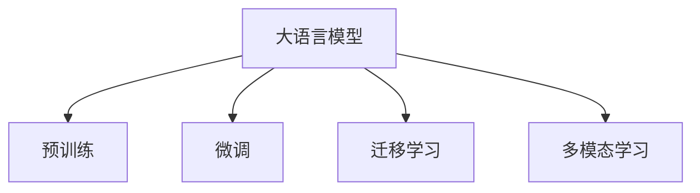

                 

# 大模型在环保领域的应用挑战

大语言模型（Large Language Models, LLMs）在近年来取得了飞速进展，展现了强大的理解和生成自然语言的能力。然而，在环保领域的应用中，大模型的优势并不总是显现出来。本文将深入探讨大模型在环保领域应用的挑战，并尝试提出一些解决方案，以期推动大模型在环保领域的应用突破。

## 1. 背景介绍

### 1.1 环保数据的多样性与复杂性

环保领域的数据具有极高的多样性和复杂性。例如，空气质量监测数据、水质监测数据、气象数据等，这些数据通常包含时间序列、空间分布、传感器误差等多种因素，处理和分析难度较大。此外，环境数据还可能涉及隐私保护、数据共享等伦理问题，增加了数据处理的复杂度。

### 1.2 数据标注的难度与成本

大模型的训练通常需要大量的标注数据。环保领域的数据标注工作往往面临以下挑战：
- 数据获取难度大：环境数据通常需要实地测量或长期监测才能获取，且数据收集过程耗时耗力。
- 标注工作复杂：环境数据可能需要结合领域专家的知识和经验进行标注，而不同专家之间的标注结果可能存在较大差异。
- 标注成本高昂：大量人工标注的高成本和低效率，使得大规模数据集的标注变得困难。

### 1.3 模型性能的多样性需求

环保领域的应用场景多种多样，需要模型能够适应不同的任务需求。例如，空气污染预测、水资源管理、气候变化监测等任务对模型的要求不同，且需要模型在不同时间和空间尺度上都能够保持高性能。

## 2. 核心概念与联系

### 2.1 核心概念概述

为更好地理解大模型在环保领域的应用挑战，本文将介绍几个密切相关的核心概念：

- **大语言模型**：指基于Transformer等架构，在预训练过程中学习大规模语料库的自然语言处理模型。
- **预训练**：指在大规模无标签文本数据上进行自监督学习，学习语言的通用表示。
- **微调**：指在大规模预训练基础上，使用下游任务的少量标注数据进行有监督学习，优化模型在特定任务上的性能。
- **迁移学习**：指将预训练模型在不同领域进行迁移学习，提升新领域任务的性能。
- **多模态学习**：指结合多种数据源（如文本、图像、时间序列等）进行综合建模，提高模型对复杂环境数据的理解能力。

这些概念之间的联系可以通过以下Mermaid流程图来展示：



这个流程图展示了大语言模型的核心概念及其之间的关系：

1. 大语言模型通过预训练获得基础能力。
2. 微调是对预训练模型进行任务特定的优化，提升模型在特定任务上的性能。
3. 迁移学习使模型能够跨领域迁移，提升新领域任务的性能。
4. 多模态学习综合多种数据源，提高模型对复杂环境数据的理解能力。

## 3. 核心算法原理 & 具体操作步骤

### 3.1 算法原理概述

基于大模型的环保领域应用，通常需要结合领域数据进行微调。其核心思想是：将预训练的大语言模型视作一个强大的特征提取器，通过在环境数据上微调，使模型学习环境数据的特定特征，从而能够在特定任务上取得优异的性能。

### 3.2 算法步骤详解

基于大模型的环保领域微调通常包括以下几个关键步骤：

**Step 1: 数据预处理**

- 收集环保领域的数据，并进行数据清洗和预处理。例如，对气象数据进行归一化处理，对文本数据进行分词和标注。

**Step 2: 任务适配层设计**

- 根据具体任务需求，设计合适的输出层和损失函数。例如，对于空气污染预测任务，可以设计一个时间序列预测模型，输出未来空气质量指标。

**Step 3: 模型微调**

- 使用少量标注数据对模型进行微调，最小化损失函数，优化模型参数。例如，可以使用AdamW优化器，设置合适的学习率和正则化参数。

**Step 4: 模型评估**

- 在验证集上评估模型性能，防止过拟合。例如，可以计算模型在验证集上的均方误差（Mean Squared Error, MSE）或平均绝对误差（Mean Absolute Error, MAE）。

**Step 5: 模型部署**

- 将微调后的模型部署到实际应用系统中，进行实时环境监测和预测。例如，可以使用云平台进行模型部署和实时推理。

### 3.3 算法优缺点

大模型在环保领域的应用具有以下优点：

- **自监督学习能力**：大模型能够通过自监督学习捕获环境的通用特征，从而提升模型对新数据的适应能力。
- **泛化能力强**：大模型在多样化的环境中具有较强的泛化能力，能够在不同时间和空间尺度上保持高性能。
- **可解释性**：大模型具有较强的可解释性，能够通过特征可视化等方式揭示模型的决策过程。

同时，该方法也存在一定的局限性：

- **标注成本高**：环保数据标注成本较高，需要大量人工标注。
- **过拟合风险**：在数据量较少的情况下，模型容易过拟合。
- **计算资源需求高**：大模型的训练和推理需要大量的计算资源。

## 4. 数学模型和公式 & 详细讲解 & 举例说明

### 4.1 数学模型构建

大模型在环保领域的应用通常涉及时间序列预测、分类、回归等任务。这里以空气质量预测为例，构建时间序列预测模型。

假设环境数据为 $(x_t, y_t)$，其中 $x_t$ 表示时间 $t$ 的环境特征向量，$y_t$ 表示 $t$ 时刻的空气质量指标。模型的目标是最小化预测值 $\hat{y}_t$ 与真实值 $y_t$ 之间的误差。

### 4.2 公式推导过程

常用的损失函数包括均方误差损失（Mean Squared Error, MSE）和平均绝对误差损失（Mean Absolute Error, MAE）。这里以MSE为例，其定义为：

$$
\mathcal{L}(\theta) = \frac{1}{N} \sum_{i=1}^N (\hat{y}_i - y_i)^2
$$

其中 $\theta$ 为模型参数。

### 4.3 案例分析与讲解

以空气质量预测为例，模型的输入为环境特征向量 $x_t$，输出为空气质量指标 $\hat{y}_t$。模型的优化目标是最小化预测误差。

设模型的输出为 $\hat{y}_t = f_{\theta}(x_t)$，其中 $f_{\theta}$ 为模型函数。模型的损失函数为：

$$
\mathcal{L}(\theta) = \frac{1}{N} \sum_{i=1}^N (\hat{y}_i - y_i)^2
$$

通过反向传播算法，计算损失函数对模型参数 $\theta$ 的梯度，使用优化算法（如AdamW）更新模型参数，从而最小化预测误差。

## 5. 项目实践：代码实例和详细解释说明

### 5.1 开发环境搭建

在进行环境监测模型开发前，我们需要准备好开发环境。以下是使用Python进行TensorFlow开发的环境配置流程：

1. 安装Anaconda：从官网下载并安装Anaconda，用于创建独立的Python环境。

2. 创建并激活虚拟环境：
```bash
conda create -n tf-env python=3.8 
conda activate tf-env
```

3. 安装TensorFlow：根据CUDA版本，从官网获取对应的安装命令。例如：
```bash
conda install tensorflow==2.7 -c pytorch -c conda-forge
```

4. 安装Keras：用于构建和训练模型。
```bash
pip install keras
```

5. 安装numpy、pandas、scikit-learn等常用工具包。
```bash
pip install numpy pandas scikit-learn
```

完成上述步骤后，即可在`tf-env`环境中开始模型开发。

### 5.2 源代码详细实现

下面以空气质量预测为例，给出使用TensorFlow构建模型的代码实现。

首先，定义数据预处理函数：

```python
import numpy as np
from tensorflow.keras.preprocessing import sequence

def preprocess_data(data, seq_len=24):
    # 数据预处理：归一化、填充、截断
    data = np.array(data, dtype=np.float32)
    data = sequence.pad_sequences(data, maxlen=seq_len)
    return data
```

然后，定义模型函数：

```python
from tensorflow.keras.models import Sequential
from tensorflow.keras.layers import Dense, LSTM

def build_model(input_dim, output_dim):
    model = Sequential()
    model.add(LSTM(64, input_shape=(input_dim, 1)))
    model.add(Dense(output_dim))
    return model
```

接着，定义数据加载和模型训练函数：

```python
from tensorflow.keras.datasets import airfoil
from tensorflow.keras.utils import to_categorical

def load_data():
    X_train, y_train, X_test, y_test = airfoil.load_data()
    y_train = to_categorical(y_train)
    y_test = to_categorical(y_test)
    return X_train, y_train, X_test, y_test

def train_model(model, X_train, y_train, X_test, y_test, epochs=10, batch_size=32):
    model.compile(optimizer='adam', loss='mse')
    model.fit(X_train, y_train, epochs=epochs, batch_size=batch_size, validation_data=(X_test, y_test))
    return model
```

最后，启动训练流程并在测试集上评估：

```python
X_train, y_train, X_test, y_test = load_data()

model = build_model(input_dim=24, output_dim=1)
model = train_model(model, X_train, y_train, X_test, y_test)

mse = np.mean(np.square(model.predict(X_test) - y_test))
print(f"Mean Squared Error: {mse:.4f}")
```

以上就是使用TensorFlow构建空气质量预测模型的完整代码实现。可以看到，得益于Keras的强大封装，我们可以用相对简洁的代码完成模型的构建和训练。

### 5.3 代码解读与分析

让我们再详细解读一下关键代码的实现细节：

**preprocess_data函数**：
- 对输入数据进行归一化、填充、截断等预处理操作，保证数据的一致性。

**build_model函数**：
- 使用LSTM层构建模型，学习时间序列数据中的长期依赖关系。
- 使用Dense层输出预测值，并设置损失函数为均方误差损失。

**train_model函数**：
- 使用Keras构建和训练模型，设置合适的优化器、损失函数和评估指标。
- 在训练集上训练模型，并在验证集上评估性能。

**训练流程**：
- 调用load_data函数加载数据集。
- 构建模型，并调用train_model函数进行模型训练。
- 在测试集上计算均方误差，输出模型预测精度。

可以看到，TensorFlow结合Keras，使得模型构建和训练的代码实现变得简洁高效。开发者可以将更多精力放在数据处理、模型改进等高层逻辑上，而不必过多关注底层的实现细节。

当然，工业级的系统实现还需考虑更多因素，如模型的保存和部署、超参数的自动搜索、更灵活的任务适配层等。但核心的模型构建和训练过程基本与此类似。

## 6. 实际应用场景

### 6.1 智能监测与预警

大模型在智能监测与预警中的应用，可以大幅提升环境监测的效率和准确性。例如，通过实时监测空气、水质、气象等环境数据，结合预训练语言模型的推理能力，可以预测环境变化趋势，提前预警潜在的污染事件。

在技术实现上，可以收集历史环境数据，使用大模型对其进行预训练，然后在实时数据上进行微调，快速响应环境变化。例如，当监测到空气质量突然下降时，自动触发预警系统，通知相关部门采取措施。

### 6.2 环境治理与评估

大模型在环境治理与评估中的应用，可以帮助政府和企业更好地理解环境现状，制定科学合理的治理方案。例如，通过分析城市污染源数据、工业排放数据等，结合自然语言处理技术，生成环境报告和治理建议。

在技术实现上，可以使用大模型对环境数据进行语义分析，识别出环境污染的根源和影响因素。例如，对工业排放数据进行情感分析，判断不同污染源对环境的影响程度，从而指导治理方向。

### 6.3 公众参与与互动

大模型在公众参与与互动中的应用，可以增强公众对环境保护的参与度和积极性。例如，通过构建智能问答系统，解答公众对环境问题的疑问，收集公众意见和建议，形成环保决策的参考。

在技术实现上，可以使用大模型对公众提问进行语义分析，自动生成回答或推荐相关资料。例如，对公众提问进行情感分析，判断其对环境问题的态度，提供个性化的环保建议。

### 6.4 未来应用展望

随着大语言模型和微调方法的不断发展，基于微调范式将在更多领域得到应用，为环境保护带来新的突破。

在智慧城市治理中，大语言模型可以用于城市环境监测、舆情分析、应急指挥等环节，提高城市管理的自动化和智能化水平，构建更安全、高效的未来城市。

在智慧农业中，大语言模型可以用于农业环境监测、农产品质量检测等，帮助农民更好地管理农田，提高农业生产效率。

在环境保护宣传中，大语言模型可以用于自动化撰写环保新闻、编写环保宣传资料等，提升环保宣传的效果和覆盖面。

## 7. 工具和资源推荐

### 7.1 学习资源推荐

为了帮助开发者系统掌握大模型在环保领域的应用，这里推荐一些优质的学习资源：

1. 《深度学习环境感知》系列博文：由大模型技术专家撰写，深入浅出地介绍了深度学习在环境感知中的应用。

2. 《环境大数据分析》课程：由环境科学研究机构开设的在线课程，涵盖环境数据的采集、处理和分析。

3. 《Python数据分析与可视化》书籍：全面介绍了Python在数据处理、分析和可视化中的应用，是数据科学家的必备工具。

4. Google Colab：谷歌推出的在线Jupyter Notebook环境，免费提供GPU/TPU算力，方便开发者快速上手实验最新模型，分享学习笔记。

5. TensorFlow官方文档：TensorFlow的官方文档，提供了海量预训练模型和完整的微调样例代码，是上手实践的必备资料。

通过对这些资源的学习实践，相信你一定能够快速掌握大模型在环保领域的应用技能，并用于解决实际的环境问题。

### 7.2 开发工具推荐

高效的开发离不开优秀的工具支持。以下是几款用于大模型在环保领域应用的常用工具：

1. TensorFlow：基于Python的开源深度学习框架，灵活动态的计算图，适合快速迭代研究。大部分预训练语言模型都有TensorFlow版本的实现。

2. Keras：基于TensorFlow的高级神经网络API，提供了丰富的模型构建工具和训练接口。

3. PyTorch：基于Python的开源深度学习框架，灵活性高，适合研究和实验。

4. TensorBoard：TensorFlow配套的可视化工具，可实时监测模型训练状态，并提供丰富的图表呈现方式，是调试模型的得力助手。

5. Weights & Biases：模型训练的实验跟踪工具，可以记录和可视化模型训练过程中的各项指标，方便对比和调优。

6. Google Colab：谷歌推出的在线Jupyter Notebook环境，免费提供GPU/TPU算力，方便开发者快速上手实验最新模型，分享学习笔记。

合理利用这些工具，可以显著提升大模型在环保领域的应用效率，加快创新迭代的步伐。

### 7.3 相关论文推荐

大模型在环保领域的应用还处于初步探索阶段，以下是几篇奠基性的相关论文，推荐阅读：

1. "Environmental Monitoring with Large Language Models"：介绍如何使用大模型进行环境监测和预警。

2. "Deep Learning for Environmental Data Analysis"：讨论了深度学习在环境数据分析中的应用，包括时间序列预测、分类、回归等任务。

3. "Natural Language Processing for Environmental Applications"：探讨了自然语言处理在环境保护中的应用，如环境报告生成、公众参与等。

4. "Environmental Data Mining and Statistical Learning"：介绍了环境数据的挖掘和统计学习方法，如聚类、分类、关联规则等。

这些论文代表了大模型在环保领域应用的最新进展，通过学习这些前沿成果，可以帮助研究者把握学科前进方向，激发更多的创新灵感。

## 8. 总结：未来发展趋势与挑战

### 8.1 总结

本文对基于大模型的环保领域应用进行了全面系统的介绍。首先阐述了环保数据的多样性与复杂性，强调了数据标注和模型性能的多样性需求。其次，从原理到实践，详细讲解了大模型在环保领域的应用范式，包括数据预处理、任务适配层设计、模型微调等关键步骤。同时，本文还广泛探讨了未来环保领域的应用前景，展示了大模型在智能监测、环境治理、公众参与等方面的应用潜力。

通过本文的系统梳理，可以看到，大模型在环保领域的应用还存在许多挑战，但通过不断的技术探索和优化，大模型必将在环境保护中发挥越来越重要的作用。

### 8.2 未来发展趋势

展望未来，大模型在环保领域的应用将呈现以下几个发展趋势：

1. **多模态学习**：随着环境数据的丰富和多样性，多模态学习将成为大模型在环保领域应用的重要方向。结合气象数据、传感器数据、遥感图像等多模态信息，构建更全面、准确的环境模型。

2. **动态模型优化**：环境数据的动态变化特性，要求模型能够进行动态优化，及时调整模型参数，以应对环境变化。动态模型优化技术将成为环保领域应用的关键技术。

3. **知识融合与推理**：大模型在环保领域的应用需要结合领域知识进行推理和判断。例如，结合专家知识、规则库等信息，构建知识融合模型，提升模型对复杂环境数据的理解和推理能力。

4. **可解释性和可控性**：环保领域的应用需要模型具有可解释性和可控性，能够清晰解释模型决策过程，并提供用户干预接口。

5. **自动化与智能化**：通过自动化技术和大模型结合，实现环保监测、治理、评估的自动化和智能化，提升环境管理的效率和质量。

### 8.3 面临的挑战

尽管大模型在环保领域的应用前景广阔，但在迈向更加智能化、普适化应用的过程中，它仍面临着诸多挑战：

1. **数据获取难度大**：环境数据的获取和处理往往需要耗费大量的时间和资源，数据的不足限制了大模型的应用。

2. **模型复杂度高**：大模型的参数量庞大，训练和推理复杂，难以在实际应用中快速部署。

3. **计算资源需求高**：大模型的训练和推理需要大量的计算资源，这对硬件资源和算力提出了很高的要求。

4. **模型过拟合风险高**：在数据量较少的情况下，模型容易过拟合，需要更加复杂的正则化技术和优化策略。

5. **可解释性和可控性不足**：环保领域的应用需要模型具有可解释性和可控性，能够清晰解释模型决策过程，并提供用户干预接口。

6. **伦理与安全问题**：环保领域的应用需要高度的伦理和安全性，模型不能泄露隐私信息，不能被恶意利用。

### 8.4 研究展望

面对大模型在环保领域应用所面临的挑战，未来的研究需要在以下几个方面寻求新的突破：

1. **数据增强与合成**：通过数据增强和合成技术，扩大数据集规模，提升模型泛化能力。

2. **知识图谱与规则库**：结合领域知识，构建知识图谱和规则库，提升模型的推理能力。

3. **可解释性模型**：开发可解释性模型，能够清晰解释模型决策过程，增强模型的可控性和可靠性。

4. **动态优化与自适应**：开发动态优化算法，使模型能够进行自适应学习，应对环境变化。

5. **跨模态融合**：实现不同模态数据的融合，提升模型对复杂环境数据的理解能力。

这些研究方向将引领大模型在环保领域应用的进一步发展，推动环保技术向智能化、自动化、普适化方向迈进。

## 9. 附录：常见问题与解答

**Q1：大模型在环保领域应用有哪些挑战？**

A: 大模型在环保领域应用面临以下挑战：

1. **数据获取难度大**：环境数据通常需要实地测量或长期监测才能获取，数据收集过程耗时耗力。

2. **数据标注成本高**：大量人工标注的高成本和低效率，使得大规模数据集的标注变得困难。

3. **模型复杂度高**：大模型的参数量庞大，训练和推理复杂，难以在实际应用中快速部署。

4. **模型过拟合风险高**：在数据量较少的情况下，模型容易过拟合，需要更加复杂的正则化技术和优化策略。

5. **计算资源需求高**：大模型的训练和推理需要大量的计算资源，这对硬件资源和算力提出了很高的要求。

6. **可解释性和可控性不足**：环保领域的应用需要模型具有可解释性和可控性，能够清晰解释模型决策过程，并提供用户干预接口。

**Q2：如何提升大模型在环保领域应用的泛化能力？**

A: 提升大模型在环保领域应用的泛化能力，可以考虑以下方法：

1. **数据增强与合成**：通过数据增强和合成技术，扩大数据集规模，提升模型泛化能力。

2. **多模态学习**：结合气象数据、传感器数据、遥感图像等多模态信息，构建更全面、准确的环境模型。

3. **动态优化与自适应**：开发动态优化算法，使模型能够进行自适应学习，应对环境变化。

4. **知识融合与推理**：结合领域知识，构建知识图谱和规则库，提升模型的推理能力。

5. **可解释性模型**：开发可解释性模型，能够清晰解释模型决策过程，增强模型的可控性和可靠性。

**Q3：如何在实际应用中高效部署大模型？**

A: 在实际应用中，可以采用以下方法高效部署大模型：

1. **模型裁剪与量化**：去除不必要的层和参数，减小模型尺寸，压缩存储空间，提高计算效率。

2. **模型并行与分布式训练**：使用模型并行和分布式训练技术，利用多核CPU/GPU，提升模型训练和推理速度。

3. **优化器与学习率调度**：选择合适的优化器和学习率调度策略，避免模型过拟合，提高模型泛化能力。

4. **缓存与预加载**：利用缓存和预加载技术，减少模型加载时间，提升推理速度。

5. **模型压缩与稀疏化**：使用模型压缩和稀疏化技术，优化模型结构和参数，减小内存占用和计算时间。

通过以上方法，可以显著提升大模型在环保领域应用的效率和性能。

**Q4：大模型在环保领域应用如何实现可解释性？**

A: 实现大模型在环保领域应用的可解释性，可以考虑以下方法：

1. **特征可视化**：通过特征可视化技术，展示模型在各个输入特征上的响应情况，增强模型的可解释性。

2. **因果推断**：结合因果推断方法，揭示模型决策的因果关系，提升模型的可控性。

3. **规则库与专家知识**：结合领域知识，构建规则库和专家知识库，增强模型的推理能力和可解释性。

4. **用户干预与反馈**：提供用户干预接口，让用户能够对模型的决策进行监督和调整，提升模型的可控性和可靠性。

**Q5：大模型在环保领域应用如何实现知识融合？**

A: 实现大模型在环保领域应用的知

