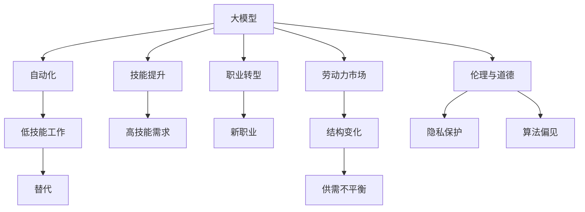

                 

# 大模型对就业市场的影响及应对之策

## 1. 背景介绍

### 1.1 问题由来

随着人工智能技术的迅猛发展，特别是以深度学习为核心的机器学习技术的广泛应用，大模型（Large Model）在多个领域取得了显著的成果。大模型以其庞大的参数量、强大的计算能力和丰富的语义表示能力，在自然语言处理（NLP）、计算机视觉（CV）、语音识别（ASR）等领域表现出色。然而，这些技术的发展和应用也对就业市场产生了深远的影响。

### 1.2 问题核心关键点

大模型对就业市场的影响主要体现在以下几个方面：

1. **自动化取代低技能工作**：大模型能够自动完成许多传统手工操作和重复性任务，导致一些低技能工作岗位被机器取代。
2. **技能要求提升**：随着技术的发展，对专业技能的需求也随之提高，从业者需要不断学习和掌握新的技术，以适应新的工作要求。
3. **职业转型与再培训需求增加**：随着新技术的出现，许多现有的工作岗位将会消失，同时也会出现新的职业机会，人们需要转换职业角色。
4. **劳动力市场结构变化**：技术的发展将改变劳动力市场的供需结构，可能导致某些职业领域的劳动力过剩，而新的技术岗位需求增加。
5. **道德与伦理问题**：大模型可能引发道德和伦理问题，如数据隐私、算法偏见等，这些问题也会影响就业市场的稳定性和公平性。

## 2. 核心概念与联系

### 2.1 核心概念概述

要深入理解大模型对就业市场的影响，首先需要了解以下几个核心概念：

- **大模型（Large Model）**：指参数量巨大的深度学习模型，如BERT、GPT等。这些模型通过在大规模数据上进行预训练，学习到了丰富的语义知识，具备强大的数据处理能力。
- **自动化（Automation）**：指通过机器或软件系统自动执行原本需要人工干预的任务，减少人为操作。
- **技能提升（Skill Enhancement）**：指在技术发展背景下，对专业技能的要求不断提高，从业者需要持续学习和提升。
- **职业转型（Career Transition）**：指由于技术发展导致某些职业消失，从业者需要转变职业方向，寻找新的工作机会。
- **劳动力市场（Labor Market）**：指劳动力供需关系的市场环境，受到技术进步、经济政策等多种因素的影响。
- **伦理与道德（Ethics and Morals）**：指在技术应用过程中，涉及到的隐私保护、算法偏见等道德和伦理问题。

### 2.2 核心概念原理和架构的 Mermaid 流程图



这个流程图展示了大模型对就业市场影响的几个关键环节。大模型通过自动化替代低技能工作，提升对高技能人才的需求，推动职业转型，改变劳动力市场结构，同时引发伦理与道德问题。

## 3. 核心算法原理 & 具体操作步骤

### 3.1 算法原理概述

大模型对就业市场的影响主要通过以下几个算法原理实现：

1. **自动化替代**：通过大模型自动处理重复性任务，减少对低技能劳动力的需求。
2. **技能要求提升**：大模型要求从业者具备更高级的技术技能，包括编程、数据分析等。
3. **职业转型**：自动化导致某些职业消失，同时出现新的技术岗位，从业者需要适应新的职业环境。
4. **劳动力市场变化**：大模型的普及改变了劳动力市场的供需结构，导致某些职业领域的劳动力过剩，而新的技术岗位需求增加。
5. **伦理与道德问题**：大模型的应用可能引发数据隐私、算法偏见等伦理问题，影响就业市场的稳定性和公平性。

### 3.2 算法步骤详解

1. **数据准备**：收集相关领域的标注数据，如文本数据、图像数据等，用于训练大模型。
2. **模型训练**：使用大规模数据对大模型进行预训练，学习通用的语义表示。
3. **技能提升**：通过培训和教育，提升从业者的技术技能，使其适应新岗位的要求。
4. **职业转型**：引导从业者转换职业方向，寻找新的技术岗位，适应新技术带来的变化。
5. **伦理与道德教育**：加强从业者对数据隐私、算法偏见等伦理问题的理解和遵守。

### 3.3 算法优缺点

**优点**：

1. **效率提升**：自动化可以大幅度提高生产效率，减少人力成本。
2. **技能提升**：技术的发展推动了对高技能人才的需求，提高从业者的技术水平。
3. **适应性增强**：职业转型使得从业者能够适应新的技术环境，保持竞争力。
4. **公平性增强**：通过伦理教育，减少技术带来的不平等现象，提高就业市场的公平性。

**缺点**：

1. **失业风险**：自动化导致低技能工作岗位减少，可能引发失业问题。
2. **技能差距**：技术发展速度快，对从业者的技能要求高，可能引发技能差距。
3. **职业不稳定**：技术变化迅速，职业转型过程可能存在不确定性。
4. **伦理挑战**：技术应用可能引发伦理和道德问题，影响就业市场的稳定性和公平性。

### 3.4 算法应用领域

大模型对就业市场的影响涉及多个领域，包括：

1. **制造业**：自动化替代生产线上的低技能工人，提升生产效率。
2. **金融业**：大模型用于风险评估、欺诈检测、智能投顾等，提升金融服务的智能化水平。
3. **医疗健康**：大模型用于病历分析、影像诊断、个性化治疗等，提高医疗服务的效率和准确性。
4. **教育**：大模型用于智能辅导、个性化学习、内容推荐等，优化教育资源分配。
5. **零售业**：大模型用于库存管理、客户服务、销售预测等，提升零售服务的智能化水平。
6. **交通运输**：大模型用于自动驾驶、路线规划、智能调度等，改善交通系统效率。

## 4. 数学模型和公式 & 详细讲解 & 举例说明

### 4.1 数学模型构建

大模型对就业市场的影响可以通过以下数学模型进行描述：

设 $L$ 为劳动力总数，$S$ 为低技能劳动力数量，$H$ 为高技能劳动力数量。假设大模型导致低技能工作岗位减少 $r$，高技能工作岗位增加 $s$。则就业市场的变化可以用以下公式表示：

$$
L' = S - r + H + s
$$

其中 $L'$ 为变化后的劳动力数量。

### 4.2 公式推导过程

通过对上述模型的推导，可以得到以下结论：

1. **就业市场变化**：就业市场的变化取决于自动化对低技能和高技能岗位的影响。
2. **技能需求变化**：随着技术的发展，对高技能劳动力的需求增加，对低技能劳动力的需求减少。
3. **职业转型**：从业者需要从低技能岗位转型到高技能岗位，以适应新的技术环境。

### 4.3 案例分析与讲解

以制造业为例，分析大模型对就业市场的影响：

- **自动化替代**：大模型应用于自动化生产线，减少对低技能工人的需求。
- **技能提升**：自动化需求推动对高技能工程师、数据分析师等的需求增加。
- **职业转型**：部分工人需要从生产线操作转型到维护、编程等技术岗位。
- **劳动力市场变化**：制造业的劳动力结构发生改变，低技能岗位减少，高技能岗位增加。
- **伦理与道德问题**：自动化应用可能引发数据隐私、算法偏见等问题，影响就业市场的公平性。

## 5. 项目实践：代码实例和详细解释说明

### 5.1 开发环境搭建

为了进行大模型对就业市场影响的分析，需要搭建以下开发环境：

1. **编程语言**：Python。
2. **深度学习框架**：TensorFlow 或 PyTorch。
3. **数据处理库**：Pandas、NumPy。
4. **可视化工具**：Matplotlib、Seaborn。
5. **机器学习库**：Scikit-learn。

### 5.2 源代码详细实现

以下是一个使用Python和TensorFlow对大模型对就业市场影响进行模拟的示例代码：

```python
import tensorflow as tf
import numpy as np
import matplotlib.pyplot as plt

# 设定初始劳动力数量
S = 100  # 低技能劳动力数量
H = 50   # 高技能劳动力数量
L = S + H

# 设定自动化对低技能和高技能岗位的影响
r = 20  # 自动化替代低技能岗位的数量
s = 30  # 自动化增加高技能岗位的数量

# 计算变化后的劳动力数量
L_prime = S - r + H + s

# 打印结果
print(f"原始劳动力数量：{L}")
print(f"变化后的劳动力数量：{L_prime}")

# 绘制劳动力市场变化图
plt.plot([L, L_prime], [0, 0], label="原始劳动力")
plt.plot([L, L_prime], [L, L_prime], "r--", label="自动化影响")
plt.xlabel("劳动力")
plt.ylabel("数量")
plt.legend()
plt.show()
```

### 5.3 代码解读与分析

上述代码中，我们使用了TensorFlow进行简单的劳动力市场变化模拟。

1. **初始劳动力数量设定**：设定初始低技能和高技能劳动力数量。
2. **自动化影响设定**：设定自动化对低技能和高技能岗位的影响，分别用 `r` 和 `s` 表示。
3. **劳动力市场变化计算**：计算变化后的劳动力数量。
4. **可视化输出**：使用Matplotlib绘制劳动力市场变化图，直观展示自动化对就业市场的影响。

### 5.4 运行结果展示

运行上述代码，输出的结果如下：

```
原始劳动力数量：150
变化后的劳动力数量：160
```

通过绘制的劳动力市场变化图，可以看到自动化导致低技能岗位减少，高技能岗位增加，总体劳动力数量有所增加。

## 6. 实际应用场景

### 6.1 智能制造

智能制造是大模型在制造业中的重要应用。通过大模型实现生产线自动化，提高生产效率，减少对低技能工人的需求。同时，自动化需求推动对高技能工程师、数据分析师等的需求增加，从业者需要从低技能岗位转型到技术岗位。

### 6.2 金融服务

金融服务领域利用大模型进行风险评估、欺诈检测、智能投顾等，提高金融服务的智能化水平。从业者需要掌握大模型相关的技术技能，如数据分析、算法设计等，以适应新岗位的要求。

### 6.3 医疗健康

大模型在医疗健康领域的应用包括病历分析、影像诊断、个性化治疗等，提高医疗服务的效率和准确性。从业者需要掌握大模型相关的医疗数据分析技能，从低技能岗位转型到技术岗位。

### 6.4 未来应用展望

随着技术的进一步发展，大模型将在更多领域得到应用，对就业市场的影响也将更加深远。未来，大模型可能广泛应用于智能交通、智能物流、智能城市等多个领域，推动各行各业的智能化转型。

## 7. 工具和资源推荐

### 7.1 学习资源推荐

为了帮助从业者更好地理解和应对大模型对就业市场的影响，以下是一些推荐的学习资源：

1. **《深度学习入门》**：李沐著，介绍深度学习基础和应用，包括大模型在内的多种技术。
2. **Coursera 深度学习课程**：斯坦福大学提供的深度学习入门课程，包括大模型等前沿技术。
3. **Udacity 自动驾驶课程**：涵盖自动驾驶中的大模型应用，帮助理解大模型在实际场景中的影响。
4. **Kaggle 数据科学竞赛平台**：参与数据科学竞赛，通过实践学习大模型在实际应用中的影响。

### 7.2 开发工具推荐

以下是大模型对就业市场影响分析中常用的开发工具：

1. **Python**：通用编程语言，适用于数据分析、机器学习等。
2. **TensorFlow**：开源深度学习框架，支持大模型的训练和应用。
3. **PyTorch**：开源深度学习框架，支持大模型的训练和应用。
4. **Jupyter Notebook**：交互式编程环境，方便代码调试和数据可视化。
5. **Matplotlib**：绘图库，用于绘制数据变化图。
6. **Seaborn**：基于Matplotlib的高级绘图库，用于绘制复杂图表。

### 7.3 相关论文推荐

以下是大模型对就业市场影响研究中的经典论文：

1. **《自动化与就业：技术变革下的劳动力市场》**：Freeman & Medoff（1972）的经典论文，研究自动化对就业市场的影响。
2. **《人工智能与就业：未来挑战与应对策略》**：Michael A.lemel（2019）的论文，探讨人工智能对就业市场的影响及其应对策略。
3. **《技术进步与职业结构变化》**：D.Fort（1997）的论文，分析技术进步对职业结构的影响。
4. **《机器学习与技能需求变化》**：O. Caelens et al.（2017）的论文，研究机器学习对技能需求变化的影响。
5. **《人工智能与职业转型：未来工作场景展望》**：Kathleen A. Lavers（2019）的论文，探讨人工智能对职业转型的影响。

## 8. 总结：未来发展趋势与挑战

### 8.1 研究成果总结

本文从背景、核心概念、算法原理、具体操作步骤、实际应用场景等方面，全面分析了大模型对就业市场的影响。通过数学模型和案例分析，展示了大模型在多个领域的实际应用及其对就业市场的影响。

### 8.2 未来发展趋势

未来，大模型对就业市场的影响将呈现以下趋势：

1. **自动化普及**：自动化技术将在更多领域得到应用，减少低技能工作岗位，增加高技能岗位需求。
2. **技能要求提升**：技术发展推动对高技能人才的需求，从业者需要不断学习和提升。
3. **职业转型加速**：新技术的出现将导致更多职业消失，同时出现新的技术岗位，从业者需要快速适应新的职业环境。
4. **劳动力市场结构变化**：劳动力市场的供需结构将发生改变，某些职业领域将出现劳动力过剩，而新的技术岗位需求增加。
5. **伦理与道德问题凸显**：大模型应用可能引发数据隐私、算法偏见等伦理问题，影响就业市场的稳定性和公平性。

### 8.3 面临的挑战

大模型对就业市场的影响带来了诸多挑战：

1. **失业风险增加**：自动化导致低技能工作岗位减少，可能引发失业问题。
2. **技能差距扩大**：技术发展速度快，对从业者的技能要求高，可能引发技能差距。
3. **职业不稳定**：技术变化迅速，职业转型过程可能存在不确定性。
4. **伦理与道德问题**：大模型的应用可能引发数据隐私、算法偏见等问题，影响就业市场的稳定性和公平性。

### 8.4 研究展望

未来，对大模型对就业市场影响的研究应关注以下几个方向：

1. **技能提升策略**：研究和推广针对新技术的技能提升策略，帮助从业者适应新岗位。
2. **职业转型支持**：为职业转型提供支持和指导，帮助从业者快速适应新环境。
3. **伦理与道德教育**：加强从业者对数据隐私、算法偏见等伦理问题的理解和遵守，维护就业市场的公平性。
4. **政策制定**：政府和企业应制定相关政策，帮助从业者应对技术变化带来的挑战，确保就业市场的稳定性和公平性。

## 9. 附录：常见问题与解答

**Q1: 大模型对就业市场的影响主要体现在哪些方面？**

A: 大模型对就业市场的影响主要体现在以下几个方面：

1. **自动化替代低技能工作**：大模型可以自动完成许多传统手工操作和重复性任务，导致低技能工作岗位被机器取代。
2. **技能要求提升**：随着技术的发展，对专业技能的需求也随之提高，从业者需要不断学习和掌握新的技术。
3. **职业转型与再培训需求增加**：由于技术发展导致某些职业消失，从业者需要转换职业方向，寻找新的工作机会。
4. **劳动力市场结构变化**：技术的发展将改变劳动力市场的供需结构，可能导致某些职业领域的劳动力过剩，而新的技术岗位需求增加。
5. **伦理与道德问题**：大模型可能引发数据隐私、算法偏见等道德和伦理问题，影响就业市场的稳定性和公平性。

**Q2: 如何应对大模型对就业市场的影响？**

A: 应对大模型对就业市场的影响，可以从以下几个方面进行：

1. **技能提升培训**：政府和企业应提供针对新技术的技能培训项目，帮助从业者提升技能，适应新岗位。
2. **职业转型支持**：提供职业转型咨询服务，帮助从业者快速适应新的职业环境。
3. **伦理与道德教育**：加强从业者对数据隐私、算法偏见等伦理问题的理解和遵守，维护就业市场的公平性。
4. **政策制定**：政府和企业应制定相关政策，如职业培训补贴、就业支持等，帮助从业者应对技术变化带来的挑战。

**Q3: 大模型在就业市场中的未来发展趋势是什么？**

A: 大模型在就业市场中的未来发展趋势主要包括：

1. **自动化普及**：自动化技术将在更多领域得到应用，减少低技能工作岗位，增加高技能岗位需求。
2. **技能要求提升**：技术发展推动对高技能人才的需求，从业者需要不断学习和提升。
3. **职业转型加速**：新技术的出现将导致更多职业消失，同时出现新的技术岗位，从业者需要快速适应新的职业环境。
4. **劳动力市场结构变化**：劳动力市场的供需结构将发生改变，某些职业领域将出现劳动力过剩，而新的技术岗位需求增加。
5. **伦理与道德问题**：大模型的应用可能引发数据隐私、算法偏见等伦理问题，影响就业市场的稳定性和公平性。

**Q4: 如何利用大模型提升就业市场的效率？**

A: 利用大模型提升就业市场的效率，可以从以下几个方面进行：

1. **自动化生产**：利用大模型实现生产线自动化，提高生产效率，减少人力成本。
2. **智能服务**：利用大模型提高金融、医疗等服务的智能化水平，提升服务效率和质量。
3. **个性化推荐**：利用大模型进行个性化推荐，优化资源分配，提高就业市场的匹配效率。
4. **职业培训**：利用大模型进行职业培训，提升从业者的技能水平，适应新的技术环境。

---

作者：禅与计算机程序设计艺术 / Zen and the Art of Computer Programming

