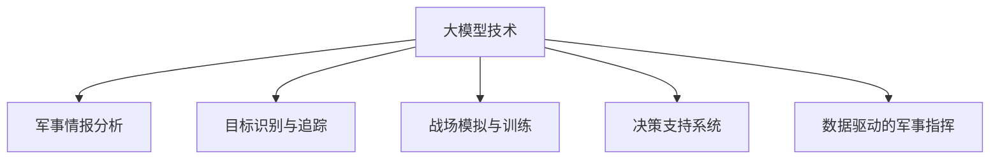

                 

# 大模型技术的军事应用前景

> 关键词：大模型技术, 军事应用, 情报分析, 目标识别, 战场模拟, 决策支持系统, 数据驱动, 人工智能, 自动化

## 1. 背景介绍

### 1.1 问题由来

随着人工智能(AI)技术的不断进步，大模型技术在多个领域展现了前所未有的应用潜力。特别是对于军事领域而言，大模型技术可以在情报分析、目标识别、战场模拟、决策支持系统等多个方面发挥重要作用，从而提升军事决策和作战效率。然而，军事应用的大模型技术仍处于起步阶段，其未来前景和应用前景尚未被充分探索。

### 1.2 问题核心关键点

大模型技术在军事领域的应用主要涉及以下几个关键点：

- **情报分析与处理**：利用大模型进行文本挖掘、情感分析、舆情监测等，快速提取关键情报信息，辅助决策。
- **目标识别与追踪**：通过大模型进行目标检测、识别和追踪，提高战场态势感知能力。
- **战场模拟与训练**：借助大模型进行战场环境模拟和作战训练，优化战术方案。
- **决策支持系统**：构建基于大模型的决策支持系统，提供实时决策建议和方案，提升指挥官决策质量。
- **数据驱动的军事指挥**：通过分析大量历史数据和实时数据，实现军事指挥的自动化和智能化。

### 1.3 问题研究意义

研究大模型技术在军事领域的应用，对于提升军事决策和作战效率，增强军事指挥自动化水平，具有重要意义：

1. **提升情报处理效率**：大模型能够自动分析海量情报数据，快速提取关键信息，辅助情报分析。
2. **增强战场态势感知**：通过大模型实现目标自动识别和追踪，提高战场态势感知能力。
3. **优化战术方案**：借助大模型进行战场环境模拟和作战训练，优化战术方案，提高实战能力。
4. **提高决策质量**：构建基于大模型的决策支持系统，提供实时决策建议，提升指挥决策质量。
5. **推动军事转型**：数据驱动的军事指挥系统，能够实现更快速、更精确的决策，推动军事转型。

## 2. 核心概念与联系

### 2.1 核心概念概述

为更好地理解大模型技术在军事领域的应用，本节将介绍几个密切相关的核心概念：

- **大模型技术**：指使用大规模深度学习模型，通过在大规模数据集上进行预训练，学习到丰富的语言和视觉知识，具备强大的数据处理和分析能力。

- **军事情报分析**：利用大模型技术，对海量的文本、图像、视频等情报数据进行自动化分析和挖掘，快速提取关键情报信息。

- **目标识别与追踪**：通过大模型实现目标的自动识别、分类、追踪等，提高战场态势感知能力。

- **战场模拟与训练**：使用大模型进行战场环境的模拟，提供训练和演习环境，优化战术方案。

- **决策支持系统**：构建基于大模型的决策支持系统，辅助军事指挥决策。

- **数据驱动的军事指挥**：通过分析历史和实时数据，实现军事指挥的自动化和智能化，提高决策效率和质量。

这些核心概念之间的逻辑关系可以通过以下Mermaid流程图来展示：



这个流程图展示了大模型技术的核心概念及其之间的关系：

1. 大模型技术通过预训练获得基础能力。
2. 在情报分析、目标识别、战场模拟、决策支持等多个军事任务中，通过微调或迁移学习实现特定任务优化。
3. 数据驱动的军事指挥系统进一步利用大数据技术，提升指挥决策的自动化水平。

## 3. 核心算法原理 & 具体操作步骤
### 3.1 算法原理概述

大模型技术在军事应用中的核心思想是：利用大模型强大的数据处理和分析能力，对军事领域的各类数据进行高效处理，快速提取关键信息，优化决策过程。

形式化地，假设大模型为 $M_{\theta}$，其中 $\theta$ 为预训练得到的模型参数。给定军事任务 $T$ 的数据集 $D=\{(x_i,y_i)\}_{i=1}^N$，其中 $x_i$ 表示军事任务相关的数据，如情报数据、目标图像等，$y_i$ 表示对应的标签，如情报类型、目标类别等。大模型的应用目标是最小化任务 $T$ 上的经验风险，即找到最优参数：

$$
\theta^* = \mathop{\arg\min}_{\theta} \mathcal{L}(M_{\theta},D)
$$

其中 $\mathcal{L}$ 为针对任务 $T$ 设计的损失函数，用于衡量模型预测输出与真实标签之间的差异。常见的损失函数包括交叉熵损失、均方误差损失等。

通过梯度下降等优化算法，大模型不断更新模型参数 $\theta$，最小化损失函数 $\mathcal{L}$，使得模型输出逼近真实标签。由于 $\theta$ 已经通过预训练获得了较强的数据处理能力，因此即便在小规模数据集 $D$ 上进行微调，也能较快收敛到理想的模型参数 $\hat{\theta}$。

### 3.2 算法步骤详解

基于大模型技术在军事领域的应用，一般包括以下几个关键步骤：

**Step 1: 准备数据和预训练模型**
- 收集军事任务相关的数据集 $D$，如情报文本、目标图像等。
- 选择合适的预训练大模型 $M_{\theta}$ 作为初始化参数，如BERT、ResNet等。

**Step 2: 任务适配层设计**
- 根据具体军事任务，设计合适的输出层和损失函数。例如，对于情报分析任务，通常使用文本分类器输出情报类型，交叉熵损失函数；对于目标识别任务，使用图像分类器输出目标类别，交叉熵损失函数。

**Step 3: 微调超参数设置**
- 选择合适的优化算法及其参数，如 Adam、SGD 等，设置学习率、批大小、迭代轮数等。
- 设置正则化技术及强度，包括权重衰减、Dropout、Early Stopping 等。
- 确定冻结预训练参数的策略，如仅微调顶层，或全部参数都参与微调。

**Step 4: 执行梯度训练**
- 将训练集数据分批次输入模型，前向传播计算损失函数。
- 反向传播计算参数梯度，根据设定的优化算法和学习率更新模型参数。
- 周期性在验证集上评估模型性能，根据性能指标决定是否触发 Early Stopping。
- 重复上述步骤直到满足预设的迭代轮数或 Early Stopping 条件。

**Step 5: 测试和部署**
- 在测试集上评估微调后模型 $M_{\hat{\theta}}$ 的性能，对比微调前后的精度提升。
- 使用微调后的模型对新样本进行推理预测，集成到实际的应用系统中。
- 持续收集新的数据，定期重新微调模型，以适应数据分布的变化。

以上是基于大模型技术在军事领域的应用的一般流程。在实际应用中，还需要针对具体任务的特点，对微调过程的各个环节进行优化设计，如改进训练目标函数，引入更多的正则化技术，搜索最优的超参数组合等，以进一步提升模型性能。

### 3.3 算法优缺点

基于大模型技术在军事领域的应用具有以下优点：

- **效率高**：大模型能够快速处理和分析海量数据，显著提升情报处理效率。
- **适应性强**：大模型可以通过微调或迁移学习快速适应不同军事任务，增强任务灵活性。
- **鲁棒性好**：大模型在面对噪声数据和复杂环境时具有较好的鲁棒性，能够稳定输出。
- **可扩展性**：大模型可以根据需要扩展到多个任务，实现多任务集成。

同时，该方法也存在一定的局限性：

- **依赖数据**：军事任务的数据获取和标注成本较高，可能影响模型性能。
- **安全风险**：大模型可能学习到敏感信息，带来数据泄露和安全风险。
- **计算资源需求高**：大模型需要高性能计算资源，可能限制在资源受限环境下的应用。
- **模型解释性差**：大模型的决策过程较为复杂，难以进行可解释性分析。

尽管存在这些局限性，但就目前而言，基于大模型技术的应用仍是大规模数据处理和分析的理想选择。未来相关研究的重点在于如何进一步降低数据获取成本，提高模型可解释性，优化资源利用，并确保数据和模型的安全。

### 3.4 算法应用领域

基于大模型技术在军事领域的应用已经得到了广泛的研究和探索，涵盖了情报分析、目标识别、战场模拟、决策支持系统等多个方面，具体应用领域包括：

- **情报分析与处理**：利用大模型技术，对情报文本进行情感分析、主题分类、舆情监测等，提取关键情报信息。
- **目标识别与追踪**：通过大模型实现目标的自动检测、识别和追踪，提高战场态势感知能力。
- **战场模拟与训练**：使用大模型进行战场环境的模拟和作战训练，优化战术方案。
- **决策支持系统**：构建基于大模型的决策支持系统，辅助军事指挥决策。
- **数据驱动的军事指挥**：通过分析历史和实时数据，实现军事指挥的自动化和智能化，提高决策效率和质量。

除了上述这些经典应用外，大模型技术还被创新性地应用到更多场景中，如战场态势预测、装备维护、无人机控制等，为军事应用带来了新的突破。

## 4. 数学模型和公式 & 详细讲解  
### 4.1 数学模型构建

本节将使用数学语言对基于大模型技术在军事领域的应用进行更加严格的刻画。

记军事任务 $T$ 的数据集为 $D=\{(x_i,y_i)\}_{i=1}^N$，其中 $x_i$ 为军事任务相关的数据，$y_i$ 为对应的标签。定义大模型 $M_{\theta}$ 在数据样本 $(x,y)$ 上的损失函数为 $\ell(M_{\theta}(x),y)$，则在数据集 $D$ 上的经验风险为：

$$
\mathcal{L}(\theta) = \frac{1}{N} \sum_{i=1}^N \ell(M_{\theta}(x_i),y_i)
$$

大模型的应用目标是最小化经验风险，即找到最优参数：

$$
\theta^* = \mathop{\arg\min}_{\theta} \mathcal{L}(\theta)
$$

在实践中，我们通常使用基于梯度的优化算法（如SGD、Adam等）来近似求解上述最优化问题。设 $\eta$ 为学习率，$\lambda$ 为正则化系数，则参数的更新公式为：

$$
\theta \leftarrow \theta - \eta \nabla_{\theta}\mathcal{L}(\theta) - \eta\lambda\theta
$$

其中 $\nabla_{\theta}\mathcal{L}(\theta)$ 为损失函数对参数 $\theta$ 的梯度，可通过反向传播算法高效计算。

### 4.2 公式推导过程

以下我们以情报分析任务为例，推导基于大模型的交叉熵损失函数及其梯度的计算公式。

假设大模型 $M_{\theta}$ 在情报文本 $x$ 上的输出为 $\hat{y}=M_{\theta}(x)$，表示情报类型预测。真实标签 $y \in \{1,2,...,C\}$，其中 $C$ 为情报类型总数。则情报分析任务的交叉熵损失函数定义为：

$$
\ell(M_{\theta}(x),y) = -\frac{1}{N} \sum_{i=1}^N [y_i\log M_{\theta}(x_i)+(1-y_i)\log (1-M_{\theta}(x_i))]
$$

将其代入经验风险公式，得：

$$
\mathcal{L}(\theta) = -\frac{1}{N}\sum_{i=1}^N [y_i\log M_{\theta}(x_i)+(1-y_i)\log(1-M_{\theta}(x_i))]
$$

根据链式法则，损失函数对参数 $\theta_k$ 的梯度为：

$$
\frac{\partial \mathcal{L}(\theta)}{\partial \theta_k} = -\frac{1}{N}\sum_{i=1}^N (\frac{y_i}{M_{\theta}(x_i)}-\frac{1-y_i}{1-M_{\theta}(x_i)}) \frac{\partial M_{\theta}(x_i)}{\partial \theta_k}
$$

其中 $\frac{\partial M_{\theta}(x_i)}{\partial \theta_k}$ 可进一步递归展开，利用自动微分技术完成计算。

在得到损失函数的梯度后，即可带入参数更新公式，完成模型的迭代优化。重复上述过程直至收敛，最终得到适应军事任务的最优模型参数 $\theta^*$。

## 5. 项目实践：代码实例和详细解释说明
### 5.1 开发环境搭建

在进行军事应用的大模型实践前，我们需要准备好开发环境。以下是使用Python进行PyTorch开发的环境配置流程：

1. 安装Anaconda：从官网下载并安装Anaconda，用于创建独立的Python环境。

2. 创建并激活虚拟环境：
```bash
conda create -n pytorch-env python=3.8 
conda activate pytorch-env
```

3. 安装PyTorch：根据CUDA版本，从官网获取对应的安装命令。例如：
```bash
conda install pytorch torchvision torchaudio cudatoolkit=11.1 -c pytorch -c conda-forge
```

4. 安装Transformers库：
```bash
pip install transformers
```

5. 安装各类工具包：
```bash
pip install numpy pandas scikit-learn matplotlib tqdm jupyter notebook ipython
```

完成上述步骤后，即可在`pytorch-env`环境中开始军事应用的大模型实践。

### 5.2 源代码详细实现

这里我们以情报分析任务为例，给出使用Transformers库对BERT模型进行军事应用的大模型微调PyTorch代码实现。

首先，定义情报分析任务的数据处理函数：

```python
from transformers import BertTokenizer
from torch.utils.data import Dataset
import torch

class IntelligenceDataset(Dataset):
    def __init__(self, texts, tags, tokenizer, max_len=128):
        self.texts = texts
        self.tags = tags
        self.tokenizer = tokenizer
        self.max_len = max_len
        
    def __len__(self):
        return len(self.texts)
    
    def __getitem__(self, item):
        text = self.texts[item]
        tags = self.tags[item]
        
        encoding = self.tokenizer(text, return_tensors='pt', max_length=self.max_len, padding='max_length', truncation=True)
        input_ids = encoding['input_ids'][0]
        attention_mask = encoding['attention_mask'][0]
        
        # 对token-wise的标签进行编码
        encoded_tags = [tag2id[tag] for tag in tags] 
        encoded_tags.extend([tag2id['O']] * (self.max_len - len(encoded_tags)))
        labels = torch.tensor(encoded_tags, dtype=torch.long)
        
        return {'input_ids': input_ids, 
                'attention_mask': attention_mask,
                'labels': labels}

# 标签与id的映射
tag2id = {'O': 0, '情报A': 1, '情报B': 2, '情报C': 3, '情报D': 4, '情报E': 5}
id2tag = {v: k for k, v in tag2id.items()}

# 创建dataset
tokenizer = BertTokenizer.from_pretrained('bert-base-cased')

train_dataset = IntelligenceDataset(train_texts, train_tags, tokenizer)
dev_dataset = IntelligenceDataset(dev_texts, dev_tags, tokenizer)
test_dataset = IntelligenceDataset(test_texts, test_tags, tokenizer)
```

然后，定义模型和优化器：

```python
from transformers import BertForTokenClassification, AdamW

model = BertForTokenClassification.from_pretrained('bert-base-cased', num_labels=len(tag2id))

optimizer = AdamW(model.parameters(), lr=2e-5)
```

接着，定义训练和评估函数：

```python
from torch.utils.data import DataLoader
from tqdm import tqdm
from sklearn.metrics import classification_report

device = torch.device('cuda') if torch.cuda.is_available() else torch.device('cpu')
model.to(device)

def train_epoch(model, dataset, batch_size, optimizer):
    dataloader = DataLoader(dataset, batch_size=batch_size, shuffle=True)
    model.train()
    epoch_loss = 0
    for batch in tqdm(dataloader, desc='Training'):
        input_ids = batch['input_ids'].to(device)
        attention_mask = batch['attention_mask'].to(device)
        labels = batch['labels'].to(device)
        model.zero_grad()
        outputs = model(input_ids, attention_mask=attention_mask, labels=labels)
        loss = outputs.loss
        epoch_loss += loss.item()
        loss.backward()
        optimizer.step()
    return epoch_loss / len(dataloader)

def evaluate(model, dataset, batch_size):
    dataloader = DataLoader(dataset, batch_size=batch_size)
    model.eval()
    preds, labels = [], []
    with torch.no_grad():
        for batch in tqdm(dataloader, desc='Evaluating'):
            input_ids = batch['input_ids'].to(device)
            attention_mask = batch['attention_mask'].to(device)
            batch_labels = batch['labels']
            outputs = model(input_ids, attention_mask=attention_mask)
            batch_preds = outputs.logits.argmax(dim=2).to('cpu').tolist()
            batch_labels = batch_labels.to('cpu').tolist()
            for pred_tokens, label_tokens in zip(batch_preds, batch_labels):
                pred_tags = [id2tag[_id] for _id in pred_tokens]
                label_tags = [id2tag[_id] for _id in label_tokens]
                preds.append(pred_tags[:len(label_tags)])
                labels.append(label_tags)
                
    print(classification_report(labels, preds))
```

最后，启动训练流程并在测试集上评估：

```python
epochs = 5
batch_size = 16

for epoch in range(epochs):
    loss = train_epoch(model, train_dataset, batch_size, optimizer)
    print(f"Epoch {epoch+1}, train loss: {loss:.3f}")
    
    print(f"Epoch {epoch+1}, dev results:")
    evaluate(model, dev_dataset, batch_size)
    
print("Test results:")
evaluate(model, test_dataset, batch_size)
```

以上就是使用PyTorch对BERT模型进行情报分析任务微调的完整代码实现。可以看到，得益于Transformers库的强大封装，我们可以用相对简洁的代码完成BERT模型的加载和微调。

### 5.3 代码解读与分析

让我们再详细解读一下关键代码的实现细节：

**IntelligenceDataset类**：
- `__init__`方法：初始化文本、标签、分词器等关键组件。
- `__len__`方法：返回数据集的样本数量。
- `__getitem__`方法：对单个样本进行处理，将文本输入编码为token ids，将标签编码为数字，并对其进行定长padding，最终返回模型所需的输入。

**tag2id和id2tag字典**：
- 定义了标签与数字id之间的映射关系，用于将token-wise的预测结果解码回真实的标签。

**训练和评估函数**：
- 使用PyTorch的DataLoader对数据集进行批次化加载，供模型训练和推理使用。
- 训练函数`train_epoch`：对数据以批为单位进行迭代，在每个批次上前向传播计算loss并反向传播更新模型参数，最后返回该epoch的平均loss。
- 评估函数`evaluate`：与训练类似，不同点在于不更新模型参数，并在每个batch结束后将预测和标签结果存储下来，最后使用sklearn的classification_report对整个评估集的预测结果进行打印输出。

**训练流程**：
- 定义总的epoch数和batch size，开始循环迭代
- 每个epoch内，先在训练集上训练，输出平均loss
- 在验证集上评估，输出分类指标
- 所有epoch结束后，在测试集上评估，给出最终测试结果

可以看到，PyTorch配合Transformers库使得BERT微调的代码实现变得简洁高效。开发者可以将更多精力放在数据处理、模型改进等高层逻辑上，而不必过多关注底层的实现细节。

当然，工业级的系统实现还需考虑更多因素，如模型的保存和部署、超参数的自动搜索、更灵活的任务适配层等。但核心的微调范式基本与此类似。

## 6. 实际应用场景
### 6.1 情报分析与处理

情报分析是军事领域的重要任务之一，涉及情报收集、情报分析、情报判断等多个环节。通过大模型技术，可以实现自动化情报处理，提升情报分析效率和准确性。

在技术实现上，可以收集大量的情报数据，如新闻报道、社交媒体、开源情报等，构建情报分析任务的数据集。利用预训练的大模型进行微调，使得模型能够自动识别情报类型、情感倾向、关键词等信息。对于新接收的情报数据，模型能够快速分析和提取关键情报信息，辅助指挥决策。

### 6.2 目标识别与追踪

目标识别与追踪是现代战争中的关键技术，能够显著提升战场态势感知能力。通过大模型技术，可以实现目标的自动识别、分类和追踪，提高战场信息获取的效率和准确性。

具体而言，可以利用大模型对目标图像进行预训练，学习到目标特征。在实际战场中，通过摄像头或无人机获取实时图像数据，利用训练好的模型进行目标检测、分类和追踪。模型能够快速识别出目标的类型和位置，为指挥决策提供实时支持。

### 6.3 战场模拟与训练

战场模拟与训练是军事指挥的重要环节，能够提高部队的实战能力和战术水平。通过大模型技术，可以实现大规模的战场模拟和作战训练，优化战术方案。

具体而言，可以利用大模型进行战场环境的模拟，构建逼真的作战场景。模型能够根据历史数据和规则，模拟不同情况下的战场环境，如天气变化、地形地貌等。通过多次训练和模拟，部队能够学习和掌握不同的战术方案，提高实战能力。

### 6.4 决策支持系统

决策支持系统是现代军事指挥的重要工具，能够提供实时的决策建议和方案。通过大模型技术，可以实现基于大数据的军事决策支持，提升指挥决策的自动化水平。

具体而言，可以利用大模型进行历史数据的分析，挖掘出有效的决策规律。在实际作战中，系统能够根据实时数据和历史经验，自动提供决策建议和方案。指挥官可以依据系统推荐，快速做出决策，提升指挥效率和质量。

### 6.5 数据驱动的军事指挥

数据驱动的军事指挥系统能够实现更快速、更精确的决策，推动军事转型。通过大模型技术，可以实现对大量历史和实时数据的深度分析和挖掘，提供数据驱动的决策支持。

具体而言，可以收集海量的军事数据，包括作战记录、装备状态、后勤保障等。利用大模型进行数据分析和挖掘，发现其中的规律和趋势。系统能够根据实时数据和历史经验，自动生成决策建议和方案，辅助指挥决策。

## 7. 工具和资源推荐
### 7.1 学习资源推荐

为了帮助开发者系统掌握大模型技术在军事领域的应用，这里推荐一些优质的学习资源：

1. 《Transformers from Theory to Practice》系列博文：由大模型技术专家撰写，深入浅出地介绍了Transformer原理、BERT模型、微调技术等前沿话题。

2. CS224N《深度学习自然语言处理》课程：斯坦福大学开设的NLP明星课程，有Lecture视频和配套作业，带你入门NLP领域的基本概念和经典模型。

3. 《Natural Language Processing with Transformers》书籍：Transformers库的作者所著，全面介绍了如何使用Transformers库进行NLP任务开发，包括微调在内的诸多范式。

4. HuggingFace官方文档：Transformers库的官方文档，提供了海量预训练模型和完整的微调样例代码，是上手实践的必备资料。

5. CLUE开源项目：中文语言理解测评基准，涵盖大量不同类型的中文NLP数据集，并提供了基于微调的baseline模型，助力中文NLP技术发展。

通过对这些资源的学习实践，相信你一定能够快速掌握大模型技术在军事领域的应用精髓，并用于解决实际的军事问题。
###  7.2 开发工具推荐

高效的开发离不开优秀的工具支持。以下是几款用于大模型技术在军事领域开发的工具：

1. PyTorch：基于Python的开源深度学习框架，灵活动态的计算图，适合快速迭代研究。大部分预训练语言模型都有PyTorch版本的实现。

2. TensorFlow：由Google主导开发的开源深度学习框架，生产部署方便，适合大规模工程应用。同样有丰富的预训练语言模型资源。

3. Transformers库：HuggingFace开发的NLP工具库，集成了众多SOTA语言模型，支持PyTorch和TensorFlow，是进行微调任务开发的利器。

4. Weights & Biases：模型训练的实验跟踪工具，可以记录和可视化模型训练过程中的各项指标，方便对比和调优。与主流深度学习框架无缝集成。

5. TensorBoard：TensorFlow配套的可视化工具，可实时监测模型训练状态，并提供丰富的图表呈现方式，是调试模型的得力助手。

6. Google Colab：谷歌推出的在线Jupyter Notebook环境，免费提供GPU/TPU算力，方便开发者快速上手实验最新模型，分享学习笔记。

合理利用这些工具，可以显著提升大模型技术在军事领域的应用效率，加快创新迭代的步伐。

### 7.3 相关论文推荐

大模型技术在军事领域的应用源于学界的持续研究。以下是几篇奠基性的相关论文，推荐阅读：

1. Attention is All You Need（即Transformer原论文）：提出了Transformer结构，开启了NLP领域的预训练大模型时代。

2. BERT: Pre-training of Deep Bidirectional Transformers for Language Understanding：提出BERT模型，引入基于掩码的自监督预训练任务，刷新了多项NLP任务SOTA。

3. Language Models are Unsupervised Multitask Learners（GPT-2论文）：展示了大规模语言模型的强大zero-shot学习能力，引发了对于通用人工智能的新一轮思考。

4. Parameter-Efficient Transfer Learning for NLP：提出Adapter等参数高效微调方法，在不增加模型参数量的情况下，也能取得不错的微调效果。

5. Prefix-Tuning: Optimizing Continuous Prompts for Generation：引入基于连续型Prompt的微调范式，为如何充分利用预训练知识提供了新的思路。

6. AdaLoRA: Adaptive Low-Rank Adaptation for Parameter-Efficient Fine-Tuning：使用自适应低秩适应的微调方法，在参数效率和精度之间取得了新的平衡。

这些论文代表了大模型技术在军事领域的发展脉络。通过学习这些前沿成果，可以帮助研究者把握学科前进方向，激发更多的创新灵感。

## 8. 总结：未来发展趋势与挑战

### 8.1 总结

本文对基于大模型技术在军事领域的应用进行了全面系统的介绍。首先阐述了大模型技术和军事应用的研究背景和意义，明确了大模型技术在军事情报分析、目标识别、战场模拟、决策支持系统等多个军事任务中的应用价值。其次，从原理到实践，详细讲解了大模型技术的应用步骤和关键技术点，给出了基于BERT的军事应用的大模型微调代码实现。同时，本文还广泛探讨了大模型技术在军事领域的应用场景，展示了其在情报分析、目标识别、战场模拟、决策支持系统等多个军事任务中的实际应用效果。

通过本文的系统梳理，可以看到，基于大模型技术在军事领域的应用具有广阔前景，能够在情报分析、目标识别、战场模拟、决策支持等多个环节提供强有力的支持，提升军事决策和作战效率。未来，伴随大模型技术的不断进步，军事应用领域必将迎来更加智能化、自动化和高效化的发展。

### 8.2 未来发展趋势

展望未来，大模型技术在军事领域的应用将呈现以下几个发展趋势：

1. **数据驱动的智能化**：基于大数据的军事决策支持系统将变得更加智能化，能够提供更快速、更精确的决策建议。

2. **全时空作战**：利用大模型技术进行战场模拟与训练，实现全时空作战能力，提升战术方案的适应性和灵活性。

3. **多模态融合**：将视觉、语音、文本等多种信息源融合，提升战场态势感知和决策支持系统的效果。

4. **跨领域应用**：大模型技术不仅可以应用于军事领域，还可以扩展到更多的场景中，如网络安全、反恐情报、社交媒体分析等。

5. **实时化部署**：通过优化模型结构和推理算法，实现大模型技术的实时化部署，提升实战应用效率。

6. **自适应学习**：大模型技术能够根据任务需求和数据变化，自适应地进行微调和优化，提高模型泛化性和鲁棒性。

以上趋势凸显了大模型技术在军事领域的应用前景。这些方向的探索发展，必将进一步提升军事决策和作战效率，为军事指挥提供强有力的技术支持。

### 8.3 面临的挑战

尽管大模型技术在军事领域的应用前景广阔，但在迈向更加智能化、自动化应用的过程中，仍面临诸多挑战：

1. **数据获取和标注成本高**：军事任务的数据获取和标注成本较高，可能影响模型性能和训练进度。

2. **数据安全和隐私**：军事任务涉及大量敏感信息，数据安全和隐私保护成为重要问题。

3. **计算资源需求大**：大模型需要高性能计算资源，可能限制在资源受限环境下的应用。

4. **模型解释性和透明性差**：大模型的决策过程较为复杂，难以进行可解释性分析。

5. **对抗攻击风险**：大模型可能被对抗样本攻击，带来安全风险。

尽管存在这些挑战，但大模型技术在军事领域的应用前景仍然十分广阔。未来研究需要在降低数据成本、提高模型可解释性、优化资源利用等方面进行深入研究，以实现更加高效、安全、可靠的应用。

### 8.4 研究展望

面对大模型技术在军事领域所面临的诸多挑战，未来的研究需要在以下几个方面寻求新的突破：

1. **数据增强和数据生成**：通过数据增强和生成对抗网络等技术，扩充训练数据，降低数据标注成本。

2. **模型压缩和优化**：利用模型压缩和优化技术，减小模型规模，降低计算资源需求，实现高效部署。

3. **可解释性分析和透明性提升**：引入可解释性技术和透明性提升方法，增强大模型技术的可解释性和透明性，提高决策可信度。

4. **对抗攻击检测与防御**：研究对抗攻击检测和防御方法，提升大模型技术的鲁棒性和安全性。

5. **跨领域知识融合**：将跨领域知识与大模型技术结合，提升军事决策系统的智能化水平。

6. **实时化部署和优化**：研究实时化部署和优化技术，实现大模型技术的实时化应用，提高实战效率。

这些研究方向的探索，必将引领大模型技术在军事领域迈向更高的台阶，为军事指挥和作战提供更加智能化、高效化和可靠的技术支撑。面向未来，大模型技术需要在多个层面进行协同创新，共同推动军事指挥和作战的智能化转型。

