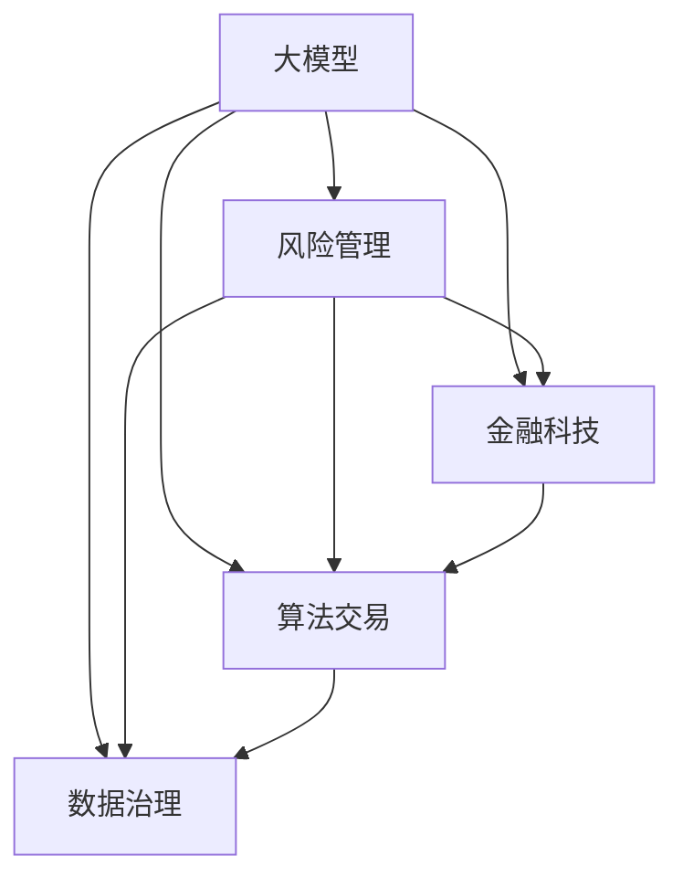

                 

# 大模型时代下的新型风险管理模式

> 关键词：风险管理, 大模型, 金融科技, 算法交易, 数据治理, 数据隐私

## 1. 背景介绍

### 1.1 问题由来
伴随着人工智能(AI)技术的快速发展，以深度学习、强化学习为代表的大模型在各行各业得到了广泛的应用。金融、医疗、电商等行业的AI应用逐步从传统的数据驱动走向智能决策，带来了一系列的机遇和挑战。然而，随着AI系统复杂度的提升，其潜在的风险管理问题也逐渐显现，并引起学术界和工业界的广泛关注。

### 1.2 问题核心关键点
当前，大模型在风险管理中的应用主要集中在以下几个方面：

1. **风险识别**：利用大模型对海量金融数据、社交媒体数据、市场数据等进行分析，识别潜在的市场波动、信用风险、欺诈风险等。
2. **风险评估**：通过大模型建立多因子风险评估模型，量化不同风险因素的权重和影响，为风险控制决策提供依据。
3. **风险预测**：使用大模型对历史数据进行学习，预测未来市场变化和风险事件，提供前瞻性风险预警。
4. **交易决策**：结合大模型的风险预测结果，自动化生成交易策略，辅助交易决策。
5. **数据治理**：通过大模型优化数据治理流程，提升数据质量和数据可用性，确保风险管理数据的一致性和准确性。

然而，大模型在风险管理应用中同样面临诸多挑战，包括但不限于：

1. **模型公平性和透明性**：大模型可能带有数据偏见，导致风险评估结果的不公平。模型复杂性和黑箱性使得风险管理决策难以解释和审核。
2. **数据隐私保护**：在收集和处理个人数据时，如何保护用户隐私，符合合规要求，成为一大难题。
3. **模型鲁棒性和稳定性**：模型在处理异常数据或罕见事件时可能表现不稳定，导致错误的决策。
4. **算法透明性**：大模型的决策过程往往缺乏透明的算法逻辑，难以进行有效监管和评估。

这些挑战对大模型在风险管理中的应用提出了新的要求，如何在提升模型性能的同时，确保风险管理的安全性和可靠性，是大模型时代风险管理的重要课题。

## 2. 核心概念与联系

### 2.1 核心概念概述

为更好地理解新型风险管理模式，本节将介绍几个密切相关的核心概念：

- **大模型**：以深度学习模型为代表的大规模神经网络模型，如BERT、GPT等，能够处理海量数据，学习复杂的特征和模式。
- **风险管理**：通过监测、预测、控制等手段，对企业或系统面临的各种风险进行识别和应对。
- **金融科技**：应用AI和大数据技术，优化金融业务流程，提升金融服务效率和质量。
- **算法交易**：利用AI模型自动进行股票、期货等金融产品的交易，提高交易效率和收益。
- **数据治理**：制定和实施数据质量管理、数据安全保护、数据隐私保护等措施，确保数据资产的安全和可用性。

这些概念之间的逻辑关系可以通过以下Mermaid流程图来展示：



这个流程图展示了大模型在金融科技、算法交易、数据治理等领域的应用，以及其对风险管理的支撑作用。

## 3. 核心算法原理 & 具体操作步骤
### 3.1 算法原理概述

新型风险管理模式的核心在于利用大模型进行风险识别、评估和预测，辅助决策。其核心思想是：将大模型视作一种高级的风险感知工具，通过学习海量历史数据和市场数据，构建高效的风险评估模型，实现自动化的风险管理。

形式化地，假设风险管理任务为 $T$，模型为 $M$，训练数据为 $D$，则风险管理模型的优化目标为：

$$
\min_{M} \mathcal{L}(M, D) + \lambda R(M)
$$

其中 $\mathcal{L}(M, D)$ 为模型在训练数据上的损失函数，$R(M)$ 为模型的风险度量，$\lambda$ 为风险惩罚系数。通过优化上述目标，可以同时优化模型的性能和风险度量。

### 3.2 算法步骤详解

新型风险管理模式的核心算法流程如下：

**Step 1: 数据准备**
- 收集历史交易数据、市场数据、社交媒体数据等，构建风险管理数据集 $D$。
- 对数据进行清洗、归一化、特征工程等预处理，确保数据的质量和可用性。

**Step 2: 模型训练**
- 选择合适的深度学习模型，如BERT、GPT、RNN等，并构建损失函数和风险度量。
- 使用优化算法（如Adam、SGD等）对模型进行训练，最小化损失函数和风险度量。
- 应用正则化技术（如L2正则、Dropout等），防止模型过拟合。

**Step 3: 风险评估**
- 对新数据进行风险评估，输出风险度量和决策建议。
- 对风险评估结果进行可视化展示，辅助人工决策。

**Step 4: 风险预警**
- 根据风险评估结果，制定风险预警策略，及时发出风险预警。
- 对预警信号进行多级级联，确保风险预警的有效性。

**Step 5: 模型评估和优化**
- 定期评估模型性能和风险度量，使用新的数据进行模型更新。
- 对模型进行参数调优，提高模型的鲁棒性和泛化能力。

### 3.3 算法优缺点

新型风险管理模式具有以下优点：

1. **数据利用效率高**：大模型能够高效处理和分析海量数据，提取复杂的风险特征。
2. **实时响应能力强**：通过快速训练和评估，大模型能够在实时数据上提供风险预警和决策建议。
3. **预测准确率高**：大模型通过学习历史数据，能够准确预测未来的风险事件。
4. **决策自动化程度高**：结合自动化的风险评估和预警机制，大模型可以大幅提升风险管理的效率和效果。

然而，该方法也存在一些局限性：

1. **数据隐私风险**：大模型在处理个人数据时，可能涉及数据隐私问题。
2. **模型复杂度高**：大模型参数量庞大，训练和推理过程复杂，难以解释和调试。
3. **鲁棒性不足**：模型对异常数据和罕见事件的处理能力有限，可能产生误判。
4. **计算资源需求高**：大模型训练和推理需要大量的计算资源，对硬件和网络环境要求较高。
5. **公平性和透明性问题**：模型可能带有数据偏见，导致不公平的风险评估。

尽管存在这些局限性，新型风险管理模式在金融、医疗、电商等领域仍具有广泛的应用前景，特别是在处理高风险场景和复杂决策问题时，其优势尤为明显。

### 3.4 算法应用领域

新型风险管理模式主要应用于以下领域：

- **金融风险管理**：利用大模型进行市场风险、信用风险、流动性风险等识别和预测，辅助银行和投资机构的决策。
- **医疗风险管理**：通过分析患者数据和医疗记录，预测疾病风险和诊疗效果，优化医疗资源配置。
- **电子商务风险管理**：利用用户行为数据和大模型，识别欺诈行为和信用风险，提高交易安全。
- **智能合约风险管理**：使用大模型分析交易条款和市场动态，评估智能合约风险，保障交易双方的利益。
- **供应链风险管理**：结合物流数据和大模型，预测供应链中断和价格波动，优化供应链管理。

这些应用场景展示了新型风险管理模式在多个领域的潜力和价值。

## 4. 数学模型和公式 & 详细讲解 & 举例说明

### 4.1 数学模型构建

本节将使用数学语言对新型风险管理模式进行严格刻画。

记风险管理任务为 $T$，模型为 $M_{\theta}$，其中 $\theta$ 为模型参数。假设训练数据集为 $D=\{(x_i, y_i)\}_{i=1}^N$，其中 $x_i$ 为输入特征，$y_i$ 为风险标签。

定义模型的损失函数为：

$$
\mathcal{L}(M_{\theta}, D) = \frac{1}{N}\sum_{i=1}^N \ell(M_{\theta}(x_i), y_i)
$$

其中 $\ell$ 为损失函数，如交叉熵损失、均方误差损失等。

定义模型的风险度量为：

$$
R(M_{\theta}) = \frac{1}{N}\sum_{i=1}^N \rho(y_i, M_{\theta}(x_i))
$$

其中 $\rho$ 为风险度量函数，如VaR、ES、SRB等。

### 4.2 公式推导过程

以下我们以风险评估任务为例，推导大模型的风险评估公式及其梯度计算。

假设模型 $M_{\theta}$ 在输入 $x$ 上的输出为 $M_{\theta}(x)$，表示预测的风险值。真实风险值 $y \in [0,1]$。则风险评估的损失函数为：

$$
\ell(M_{\theta}(x),y) = (y - M_{\theta}(x))^2
$$

将其代入经验风险公式，得：

$$
\mathcal{L}(\theta) = \frac{1}{N}\sum_{i=1}^N (y_i - M_{\theta}(x_i))^2
$$

定义风险度量函数为VaR，即在给定置信水平 $1-\alpha$ 下的风险值，则风险度量公式为：

$$
R(M_{\theta}) = \frac{1}{N}\sum_{i=1}^N M_{\theta}(x_i) - \alpha
$$

因此，风险评估的优化目标为：

$$
\min_{\theta} \mathcal{L}(\theta) + \lambda (R(M_{\theta}) - \alpha)
$$

根据链式法则，损失函数对参数 $\theta_k$ 的梯度为：

$$
\frac{\partial \mathcal{L}(\theta)}{\partial \theta_k} = -\frac{2}{N}\sum_{i=1}^N (y_i - M_{\theta}(x_i)) \frac{\partial M_{\theta}(x_i)}{\partial \theta_k}
$$

风险度量对参数 $\theta_k$ 的梯度为：

$$
\frac{\partial R(M_{\theta})}{\partial \theta_k} = \frac{1}{N}\sum_{i=1}^N \frac{\partial M_{\theta}(x_i)}{\partial \theta_k}
$$

综上，优化目标的梯度为：

$$
\nabla_{\theta}\mathcal{L}(\theta) + \lambda \nabla_{\theta}R(M_{\theta}) = \nabla_{\theta}\mathcal{L}(\theta) - \lambda \nabla_{\theta}R(M_{\theta})
$$

将上述梯度公式带入优化算法，即可进行模型参数的更新。

### 4.3 案例分析与讲解

以金融风险评估为例，假设我们有一个包含历史交易数据和市场数据的风险评估数据集 $D$，其中 $x$ 表示特征向量，如历史股价、市场指数、经济指标等，$y$ 表示风险标签，如违约概率。使用大模型BERT进行风险评估，损失函数为均方误差，风险度量函数为VaR。

我们首先对数据进行特征工程，包括特征选择、归一化、标准化等，确保数据的质量和可用性。然后使用Adam优化算法，对BERT模型进行训练，最小化损失函数和风险度量。最后，使用训练好的模型对新数据进行风险评估，输出风险值。

在实际应用中，还需要考虑模型的公平性和透明性问题。可以使用解释性方法，如LIME、SHAP等，对模型进行可解释性分析，确保风险评估结果的可理解性和公平性。同时，还需要对模型进行定期的评估和优化，确保其在不同数据分布下的稳定性。

## 5. 项目实践：代码实例和详细解释说明
### 5.1 开发环境搭建

在进行项目实践前，我们需要准备好开发环境。以下是使用Python进行PyTorch开发的环境配置流程：

1. 安装Anaconda：从官网下载并安装Anaconda，用于创建独立的Python环境。

2. 创建并激活虚拟环境：
```bash
conda create -n pytorch-env python=3.8 
conda activate pytorch-env
```

3. 安装PyTorch：根据CUDA版本，从官网获取对应的安装命令。例如：
```bash
conda install pytorch torchvision torchaudio cudatoolkit=11.1 -c pytorch -c conda-forge
```

4. 安装相关库：
```bash
pip install pandas numpy matplotlib sklearn
```

5. 安装Transformer库：
```bash
pip install transformers
```

完成上述步骤后，即可在`pytorch-env`环境中开始项目实践。

### 5.2 源代码详细实现

下面我们以金融风险评估任务为例，给出使用Transformer库对BERT模型进行风险评估的PyTorch代码实现。

首先，定义风险评估数据处理函数：

```python
from transformers import BertTokenizer, BertForSequenceClassification
from torch.utils.data import Dataset
import torch

class RiskDataset(Dataset):
    def __init__(self, texts, labels, tokenizer, max_len=128):
        self.texts = texts
        self.labels = labels
        self.tokenizer = tokenizer
        self.max_len = max_len
        
    def __len__(self):
        return len(self.texts)
    
    def __getitem__(self, item):
        text = self.texts[item]
        label = self.labels[item]
        
        encoding = self.tokenizer(text, return_tensors='pt', max_length=self.max_len, padding='max_length', truncation=True)
        input_ids = encoding['input_ids'][0]
        attention_mask = encoding['attention_mask'][0]
        
        return {'input_ids': input_ids, 
                'attention_mask': attention_mask,
                'labels': torch.tensor(label, dtype=torch.long)}
```

然后，定义模型和优化器：

```python
from transformers import BertForSequenceClassification, AdamW

model = BertForSequenceClassification.from_pretrained('bert-base-cased', num_labels=2)

optimizer = AdamW(model.parameters(), lr=2e-5)
```

接着，定义训练和评估函数：

```python
from torch.utils.data import DataLoader
from tqdm import tqdm

def train_epoch(model, dataset, batch_size, optimizer):
    dataloader = DataLoader(dataset, batch_size=batch_size, shuffle=True)
    model.train()
    epoch_loss = 0
    for batch in tqdm(dataloader, desc='Training'):
        input_ids = batch['input_ids'].to(device)
        attention_mask = batch['attention_mask'].to(device)
        labels = batch['labels'].to(device)
        model.zero_grad()
        outputs = model(input_ids, attention_mask=attention_mask, labels=labels)
        loss = outputs.loss
        epoch_loss += loss.item()
        loss.backward()
        optimizer.step()
    return epoch_loss / len(dataloader)

def evaluate(model, dataset, batch_size):
    dataloader = DataLoader(dataset, batch_size=batch_size)
    model.eval()
    preds, labels = [], []
    with torch.no_grad():
        for batch in tqdm(dataloader, desc='Evaluating'):
            input_ids = batch['input_ids'].to(device)
            attention_mask = batch['attention_mask'].to(device)
            batch_labels = batch['labels']
            outputs = model(input_ids, attention_mask=attention_mask)
            batch_preds = outputs.logits.argmax(dim=2).to('cpu').tolist()
            batch_labels = batch_labels.to('cpu').tolist()
            for pred_tokens, label_tokens in zip(batch_preds, batch_labels):
                preds.append(pred_tokens)
                labels.append(label_tokens)
                
    print(classification_report(labels, preds))
```

最后，启动训练流程并在测试集上评估：

```python
epochs = 5
batch_size = 16

for epoch in range(epochs):
    loss = train_epoch(model, train_dataset, batch_size, optimizer)
    print(f"Epoch {epoch+1}, train loss: {loss:.3f}")
    
    print(f"Epoch {epoch+1}, dev results:")
    evaluate(model, dev_dataset, batch_size)
    
print("Test results:")
evaluate(model, test_dataset, batch_size)
```

以上就是使用PyTorch对BERT进行金融风险评估任务的完整代码实现。可以看到，得益于Transformer库的强大封装，我们可以用相对简洁的代码完成BERT模型的加载和风险评估。

### 5.3 代码解读与分析

让我们再详细解读一下关键代码的实现细节：

**RiskDataset类**：
- `__init__`方法：初始化文本、标签、分词器等关键组件。
- `__len__`方法：返回数据集的样本数量。
- `__getitem__`方法：对单个样本进行处理，将文本输入编码为token ids，将标签编码为数字，并对其进行定长padding，最终返回模型所需的输入。

**风险评估模型**：
- 定义BERT模型为二分类任务，使用AdamW优化器进行训练。

**训练和评估函数**：
- 使用PyTorch的DataLoader对数据集进行批次化加载，供模型训练和推理使用。
- 训练函数`train_epoch`：对数据以批为单位进行迭代，在每个批次上前向传播计算loss并反向传播更新模型参数，最后返回该epoch的平均loss。
- 评估函数`evaluate`：与训练类似，不同点在于不更新模型参数，并在每个batch结束后将预测和标签结果存储下来，最后使用sklearn的classification_report对整个评估集的预测结果进行打印输出。

**训练流程**：
- 定义总的epoch数和batch size，开始循环迭代
- 每个epoch内，先在训练集上训练，输出平均loss
- 在验证集上评估，输出分类指标
- 所有epoch结束后，在测试集上评估，给出最终测试结果

可以看到，PyTorch配合Transformer库使得BERT风险评估的代码实现变得简洁高效。开发者可以将更多精力放在数据处理、模型改进等高层逻辑上，而不必过多关注底层的实现细节。

当然，工业级的系统实现还需考虑更多因素，如模型的保存和部署、超参数的自动搜索、更灵活的任务适配层等。但核心的风险评估流程基本与此类似。

## 6. 实际应用场景
### 6.1 金融风险管理

基于大模型进行金融风险管理，可以显著提升风险识别和预测的准确性，降低金融机构的风险敞口，提高其盈利能力和竞争力。

在技术实现上，可以收集历史交易数据、市场数据、舆情数据等，构建金融风险评估数据集。利用大模型BERT对数据集进行训练，输出风险预测结果。对于高风险交易，可以结合规则引擎和专家知识，进行多层次的风险控制和预警。

### 6.2 医疗风险评估

医疗领域存在大量的不确定性和复杂性，利用大模型进行风险评估，可以辅助医生进行疾病诊断和治疗决策。

具体而言，可以收集患者的临床数据、基因数据、影像数据等，构建医疗风险评估数据集。利用大模型进行训练，输出患者的健康风险预测结果。在实际应用中，结合医生的经验和专业知识，对模型结果进行综合判断，优化诊疗方案。

### 6.3 电子商务风险控制

电子商务平台面临大量的欺诈和信用风险，利用大模型进行风险评估，可以有效识别和防范这些风险。

具体而言，可以收集用户的交易记录、行为数据、信用评分等，构建电子商务风险评估数据集。利用大模型进行训练，输出用户的信用风险预测结果。结合规则引擎和专家知识，对高风险用户进行交易限制或预警。

### 6.4 智能合约风险管理

智能合约是区块链应用的核心组成部分，利用大模型进行风险评估，可以保障合约的安全和可信性。

具体而言，可以收集合约条款、市场数据、用户行为等，构建智能合约风险评估数据集。利用大模型进行训练，输出合约的风险预测结果。结合合约条款和市场动态，对高风险合约进行监控和预警。

## 7. 工具和资源推荐
### 7.1 学习资源推荐

为了帮助开发者系统掌握大模型在风险管理中的应用，这里推荐一些优质的学习资源：

1. 《金融科技与人工智能》系列博文：介绍AI在金融科技中的应用，包括风险管理、智能投顾、智能合约等，涵盖多个前沿技术方向。

2. 《深度学习在医疗中的应用》课程：介绍深度学习在医疗领域的应用，包括疾病诊断、图像识别、基因分析等，全面解析大模型的医疗风险管理能力。

3. 《电子商务中的智能风控》书籍：介绍电商平台的智能风控系统，包括欺诈检测、信用评分、风险控制等，提供多层次的智能风控解决方案。

4. 《智能合约与区块链》课程：介绍智能合约在区块链中的应用，包括合约设计、风险评估、安全防护等，涵盖智能合约的风险管理实践。

5. HuggingFace官方文档：提供丰富的预训练模型和微调样例，助力开发者快速上手实践。

通过对这些资源的学习实践，相信你一定能够快速掌握大模型在风险管理中的应用，并用于解决实际的风险管理问题。

### 7.2 开发工具推荐

高效的开发离不开优秀的工具支持。以下是几款用于大模型在风险管理中的应用开发的常用工具：

1. PyTorch：基于Python的开源深度学习框架，灵活动态的计算图，适合快速迭代研究。

2. TensorFlow：由Google主导开发的开源深度学习框架，生产部署方便，适合大规模工程应用。

3. Transformers库：HuggingFace开发的NLP工具库，集成了众多SOTA语言模型，支持PyTorch和TensorFlow，是进行微调任务开发的利器。

4. Weights & Biases：模型训练的实验跟踪工具，可以记录和可视化模型训练过程中的各项指标，方便对比和调优。

5. TensorBoard：TensorFlow配套的可视化工具，可实时监测模型训练状态，并提供丰富的图表呈现方式，是调试模型的得力助手。

6. Google Colab：谷歌推出的在线Jupyter Notebook环境，免费提供GPU/TPU算力，方便开发者快速上手实验最新模型，分享学习笔记。

合理利用这些工具，可以显著提升大模型在风险管理中的应用开发效率，加快创新迭代的步伐。

### 7.3 相关论文推荐

大模型在风险管理中的应用源于学界的持续研究。以下是几篇奠基性的相关论文，推荐阅读：

1. Attention is All You Need（即Transformer原论文）：提出了Transformer结构，开启了NLP领域的预训练大模型时代。

2. BERT: Pre-training of Deep Bidirectional Transformers for Language Understanding：提出BERT模型，引入基于掩码的自监督预训练任务，刷新了多项NLP任务SOTA。

3. Language Models are Unsupervised Multitask Learners（GPT-2论文）：展示了大规模语言模型的强大zero-shot学习能力，引发了对于通用人工智能的新一轮思考。

4. Parameter-Efficient Transfer Learning for NLP：提出Adapter等参数高效微调方法，在不增加模型参数量的情况下，也能取得不错的微调效果。

5. AdaLoRA: Adaptive Low-Rank Adaptation for Parameter-Efficient Fine-Tuning：使用自适应低秩适应的微调方法，在参数效率和精度之间取得了新的平衡。

这些论文代表了大模型在风险管理中的应用方向，提供了丰富的理论和实践参考。

## 8. 总结：未来发展趋势与挑战

### 8.1 总结

本文对基于大模型的金融风险管理方法进行了全面系统的介绍。首先阐述了大模型在金融科技、算法交易、数据治理等领域的应用，明确了其在风险管理中的独特价值。其次，从原理到实践，详细讲解了大模型进行风险评估的数学模型和算法步骤，给出了风险评估任务开发的完整代码实例。同时，本文还广泛探讨了大模型在金融、医疗、电商等领域的实际应用场景，展示了其在风险管理中的广泛应用前景。此外，本文精选了金融科技、医疗、电商等领域的权威学习资源，力求为读者提供全方位的技术指引。

通过本文的系统梳理，可以看到，基于大模型的风险管理方法正在成为金融、医疗、电商等领域的重要范式，极大地拓展了金融模型的应用边界，催生了更多的落地场景。受益于深度学习模型的强大性能，风险管理决策的准确性和自动化水平显著提升，风险管理效率和效果得到了显著改善。未来，伴随大模型的不断演进，风险管理技术必将进一步优化，为金融、医疗、电商等领域带来更广泛的应用和更深远的影响。

### 8.2 未来发展趋势

展望未来，大模型在风险管理中的应用将呈现以下几个发展趋势：

1. **模型的自动化和智能化**：随着模型的不断优化，大模型将具备更高的自动化和智能化水平，能够自动处理复杂的风险场景，提供实时、准确的风险预警和决策支持。

2. **跨领域知识的融合**：利用大模型融合多领域知识，如金融学、医学、计算机科学等，构建跨学科的风险管理模型，提升模型的全面性和通用性。

3. **隐私保护和数据治理**：随着数据隐私保护的法规和标准不断加强，大模型在风险管理中的应用需要更好地保护用户隐私，确保数据的合法合规使用。

4. **模型的公平性和透明性**：未来的大模型将更加注重公平性和透明性，通过可解释性方法，提高模型的决策透明度，确保风险评估的公正性。

5. **模型的鲁棒性和稳定性**：大模型将更加注重鲁棒性和稳定性，通过模型评估和优化，提升模型在不同数据分布下的表现，避免灾难性遗忘。

6. **模型的高效性和可扩展性**：大模型将更加注重高效性和可扩展性，通过参数压缩、模型裁剪、计算图优化等技术，提升模型的推理效率和计算资源利用率。

以上趋势凸显了大模型在风险管理中的应用潜力，随着技术不断进步，大模型将进一步提升风险管理的决策水平和应用效果。

### 8.3 面临的挑战

尽管大模型在风险管理中的应用取得了显著成果，但在迈向更加智能化、普适化应用的过程中，它仍面临诸多挑战：

1. **数据隐私风险**：大模型在处理个人数据时，涉及数据隐私问题，如何保护用户隐私，符合合规要求，仍是一个难题。
2. **模型的公平性和透明性**：大模型可能带有数据偏见，导致不公平的风险评估。模型复杂性和黑箱性使得风险评估难以解释和审核。
3. **模型的鲁棒性和稳定性**：模型对异常数据和罕见事件的处理能力有限，可能产生误判。
4. **计算资源需求高**：大模型训练和推理需要大量的计算资源，对硬件和网络环境要求较高。
5. **模型的解释性和可解释性**：大模型的决策过程往往缺乏透明的算法逻辑，难以进行有效监管和评估。

尽管存在这些挑战，大模型在风险管理中的应用前景依然广阔，我们需要在技术创新和合规规范之间找到平衡，克服现有挑战，推动大模型在风险管理中的应用迈向成熟。

### 8.4 研究展望

面对大模型在风险管理中面临的诸多挑战，未来的研究需要在以下几个方面寻求新的突破：

1. **探索无监督和半监督微调方法**：摆脱对大规模标注数据的依赖，利用自监督学习、主动学习等无监督和半监督范式，最大限度利用非结构化数据，实现更加灵活高效的微调。
2. **研究参数高效和计算高效的微调范式**：开发更加参数高效的微调方法，在固定大部分预训练参数的同时，只更新极少量的任务相关参数。同时优化微调模型的计算图，减少前向传播和反向传播的资源消耗，实现更加轻量级、实时性的部署。
3. **融合因果和对比学习范式**：通过引入因果推断和对比学习思想，增强大模型建立稳定因果关系的能力，学习更加普适、鲁棒的语言表征，从而提升模型泛化性和抗干扰能力。
4. **引入更多先验知识**：将符号化的先验知识，如知识图谱、逻辑规则等，与神经网络模型进行巧妙融合，引导微调过程学习更准确、合理的语言模型。同时加强不同模态数据的整合，实现视觉、语音等多模态信息与文本信息的协同建模。
5. **结合因果分析和博弈论工具**：将因果分析方法引入大模型，识别出模型决策的关键特征，增强输出解释的因果性和逻辑性。借助博弈论工具刻画人机交互过程，主动探索并规避模型的脆弱点，提高系统稳定性。
6. **纳入伦理道德约束**：在模型训练目标中引入伦理导向的评估指标，过滤和惩罚有偏见、有害的输出倾向。同时加强人工干预和审核，建立模型行为的监管机制，确保输出符合人类价值观和伦理道德。

这些研究方向的研究，将推动大模型在风险管理中的应用迈向新的高度，为构建安全、可靠、可解释、可控的智能系统铺平道路。面向未来，大模型在风险管理中的应用还需要与其他人工智能技术进行更深入的融合，如知识表示、因果推理、强化学习等，多路径协同发力，共同推动自然语言理解和智能交互系统的进步。只有勇于创新、敢于突破，才能不断拓展语言模型的边界，让智能技术更好地造福人类社会。

## 9. 附录：常见问题与解答

**Q1：大模型在风险管理中如何避免数据隐私风险？**

A: 为了避免数据隐私风险，可以采取以下措施：

1. **数据匿名化**：对用户数据进行匿名化处理，确保无法直接识别到个人身份。
2. **差分隐私**：使用差分隐私技术，添加噪声和扰动，保护用户数据隐私。
3. **数据分割**：将敏感数据与模型训练数据分离，确保敏感数据不被用于模型训练。
4. **联邦学习**：通过联邦学习技术，在多个本地节点上分布式训练模型，确保数据不离开本地。
5. **安全计算**：使用安全计算技术，如同态加密、多方安全计算等，保护数据在计算过程中的安全。

通过以上措施，可以在确保数据隐私的前提下，实现大模型在风险管理中的应用。

**Q2：大模型在风险管理中如何提高模型的公平性和透明性？**

A: 为了提高大模型在风险管理中的公平性和透明性，可以采取以下措施：

1. **数据预处理**：对数据进行去偏处理，确保训练数据集的代表性。
2. **模型可解释性**：使用可解释性方法，如LIME、SHAP等，对模型进行可解释性分析，提高模型的决策透明度。
3. **公平性指标**：引入公平性指标，如 demographic parity、equalized odds等，评估模型的公平性。
4. **对抗样本**：使用对抗样本训练，提高模型对异常数据的鲁棒性。
5. **专家评审**：邀请专家对模型的输出结果进行评审，确保模型的决策公正性。

通过以上措施，可以在提升模型性能的同时，确保其公平性和透明性，增强风险管理的可信度。

**Q3：大模型在风险管理中如何处理模型的鲁棒性和稳定性？**

A: 为了处理模型的鲁棒性和稳定性，可以采取以下措施：

1. **数据增强**：通过数据增强技术，如旋转、平移、噪声添加等，增加数据的多样性，提升模型的鲁棒性。
2. **正则化**：使用正则化技术，如L2正则、Dropout等，防止模型过拟合。
3. **对抗训练**：使用对抗训练技术，生成对抗样本进行训练，提高模型的鲁棒性。
4. **模型融合**：结合多个模型的输出，提高模型的鲁棒性和稳定性。
5. **模型裁剪**：对大模型进行裁剪，保留关键层，减少模型的复杂度，提升模型的稳定性和推理效率。

通过以上措施，可以在确保模型性能的同时，提升其鲁棒性和稳定性，增强风险管理的可靠性。

**Q4：大模型在风险管理中如何处理计算资源需求高的问题？**

A: 为了处理计算资源需求高的问题，可以采取以下措施：

1. **分布式训练**：使用分布式训练技术，将大模型分布式部署在多台服务器上，加速模型训练。
2. **计算图优化**：优化计算图，减少前向传播和反向传播的资源消耗，提高计算效率。
3. **模型压缩**：使用模型压缩技术，如知识蒸馏、量化等，减小模型的参数量和计算量。
4. **GPU/TPU加速**：使用GPU或TPU加速，提高模型训练和推理速度。
5. **优化器选择**：选择高效的优化器，如AdamW、Adafactor等，加快模型收敛速度。

通过以上措施，可以在保证模型性能的前提下，降低计算资源需求，实现大模型在风险管理中的高效部署。

**Q5：大模型在风险管理中如何处理模型的解释性和可解释性问题？**

A: 为了处理模型的解释性和可解释性问题，可以采取以下措施：

1. **可解释性方法**：使用可解释性方法，如LIME、SHAP等，对模型进行可解释性分析，提高模型的决策透明度。
2. **因果分析**：引入因果分析方法，识别出模型决策的关键特征，增强输出解释的因果性和逻辑性。
3. **模型可视化**：使用可视化工具，如TensorBoard、Weights & Biases等，对模型进行可视化展示，帮助理解模型的决策过程。
4. **专家评审**：邀请专家对模型的输出结果进行评审，确保模型的决策公正性和可信度。
5. **合规审查**：确保模型的决策符合法律法规和伦理标准，增强模型的合法性和合规性。

通过以上措施，可以在提升模型性能的同时，确保其解释性和可解释性，增强风险管理的合规性和可信度。

---

作者：禅与计算机程序设计艺术 / Zen and the Art of Computer Programming

