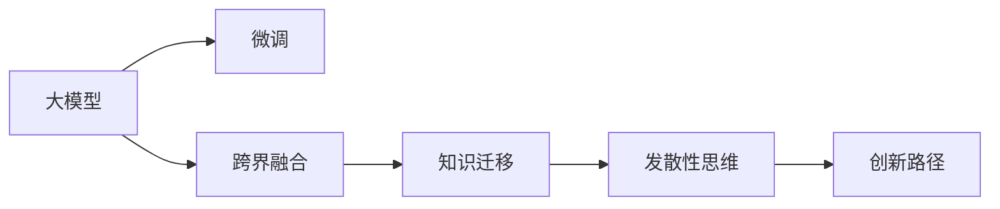

                 

# 大模型时代的创业者创新思维：发散性思考与跨界融合

在大模型时代的浪潮下，创业者正面临前所未有的机遇与挑战。如何在万亿参数级别的模型中寻找灵感，如何在跨界融合中实现突破，本文将通过发散性思维与跨界融合，探讨创业者在NLP大模型领域的创新路径。

## 1. 背景介绍

### 1.1 问题由来

随着大模型的涌现，NLP领域迎来了新的发展契机。然而，大模型并非万能，其在特定应用场景中仍存在局限。面对庞大的数据集和复杂的场景，创业者如何利用大模型，进行发散性思考与跨界融合，实现创新突破，成为关键。

### 1.2 问题核心关键点

1. **大模型的局限性**：尽管大模型在自然语言处理方面表现出色，但在特定领域如医疗、金融、教育等，仍需进一步微调以适应特定需求。
2. **数据标注成本高**：标注数据的过程往往耗时耗力，且数据标注质量直接影响模型性能。
3. **跨领域融合难度**：不同领域之间的知识边界模糊，如何跨界融合，实现知识迁移和复用，是大模型创业者面临的重要挑战。
4. **资源分配优化**：如何高效利用有限资源，实现模型性能的最大化，是大模型应用的关键问题。

## 2. 核心概念与联系

### 2.1 核心概念概述

本节将介绍几个核心概念及其联系：

1. **大模型(Large Models)**：以GPT-3、BERT等模型为代表，具有亿级参数量，具备强大的语言理解和生成能力。
2. **微调(Fine-tuning)**：在预训练模型的基础上，通过小规模数据集训练，以适应特定任务的需求。
3. **跨界融合(Cross-disciplinary Integration)**：将不同领域的知识和方法进行融合，形成新的解决方案。
4. **发散性思维(Divergent Thinking)**：通过多角度、多维度的思考方式，激发创新灵感。
5. **知识迁移(Knowledge Transfer)**：通过预训练模型在不同领域间的迁移，提升模型在新场景下的泛化能力。

这些核心概念之间的关系通过以下Mermaid流程图展示：



## 3. 核心算法原理 & 具体操作步骤

### 3.1 算法原理概述

大模型微调的基本原理是通过小规模数据集，对预训练模型进行微调，以适应特定任务的需求。其核心思想是通过多领域知识的融合，实现跨界应用。

### 3.2 算法步骤详解

1. **数据准备**：收集与特定任务相关的标注数据集，作为微调的基础。
2. **模型选择与适配**：选择适合的大模型，并进行任务适配，添加相关层和损失函数。
3. **微调训练**：在特定数据集上训练微调后的模型，调整参数以适应任务需求。
4. **效果评估**：在验证集上评估微调后的模型效果，优化超参数。
5. **部署应用**：将微调后的模型部署到实际应用中，进行效果监测和持续优化。

### 3.3 算法优缺点

**优点**：
- 泛化能力强：在大模型基础上微调，能更好地适应新任务。
- 快速迭代：小规模数据集快速训练，缩短开发周期。
- 节省成本：标注成本低，数据利用率高。

**缺点**：
- 数据依赖强：依赖于特定领域的标注数据。
- 迁移能力有限：特定领域数据可能与预训练数据分布不一致。
- 过拟合风险：小规模数据易导致模型过拟合。

### 3.4 算法应用领域

大模型微调在多个领域具有广泛的应用，包括：

- **医疗健康**：通过微调模型，实现医学知识库构建、疾病诊断辅助等功能。
- **金融服务**：用于文本分类、情感分析、风险评估等金融应用。
- **教育培训**：辅助语言学习、智能辅导等教育场景。
- **智能客服**：通过微调模型，构建智能客服系统，提升客户服务体验。

## 4. 数学模型和公式 & 详细讲解 & 举例说明

### 4.1 数学模型构建

假设大模型为$M_{\theta}$，微调任务为$T$。定义模型在数据$(x_i, y_i)$上的损失函数为$\ell(M_{\theta}(x_i), y_i)$。

**数据集损失函数**：

$$
\mathcal{L}(M_{\theta}, D) = \frac{1}{N} \sum_{i=1}^N \ell(M_{\theta}(x_i), y_i)
$$

其中，$D$为标注数据集。

**优化目标**：

$$
\theta^* = \mathop{\arg\min}_{\theta} \mathcal{L}(M_{\theta}, D)
$$

### 4.2 公式推导过程

以二分类任务为例，定义模型输出为$M_{\theta}(x_i)$，真实标签为$y_i \in \{0,1\}$。

假设模型输出为$\hat{y} = M_{\theta}(x_i)$，则交叉熵损失函数为：

$$
\ell(M_{\theta}(x_i), y_i) = -[y_i\log \hat{y} + (1-y_i)\log (1-\hat{y})]
$$

在数据集$D$上，经验风险为：

$$
\mathcal{L}(M_{\theta}, D) = -\frac{1}{N} \sum_{i=1}^N [y_i\log M_{\theta}(x_i)+(1-y_i)\log(1-M_{\theta}(x_i))]
$$

通过反向传播算法，求解梯度$\nabla_{\theta}\mathcal{L}(M_{\theta}, D)$，并更新参数$\theta$：

$$
\theta \leftarrow \theta - \eta \nabla_{\theta}\mathcal{L}(M_{\theta}, D)
$$

其中$\eta$为学习率。

### 4.3 案例分析与讲解

以金融领域为例，假设微调目标为股票情感分析。收集金融新闻和评论数据，通过微调BERT模型，进行情感分类。

**步骤1：** 收集金融数据，进行预处理，包括去除停用词、分词等。

**步骤2：** 微调BERT模型，添加分类层和交叉熵损失函数，定义优化器。

**步骤3：** 训练模型，调整超参数，如学习率、批量大小等。

**步骤4：** 在验证集上评估模型效果，优化模型。

**步骤5：** 将模型应用于新数据，进行情感分类。

## 5. 项目实践：代码实例和详细解释说明

### 5.1 开发环境搭建

1. **安装Anaconda**：从官网下载并安装Anaconda，创建独立的Python环境。

2. **环境配置**：
   ```bash
   conda create -n transformers-env python=3.8 
   conda activate transformers-env
   ```

3. **安装依赖**：
   ```bash
   pip install torch transformers pandas numpy sklearn 
   ```

### 5.2 源代码详细实现

**代码示例**：

```python
import torch
from transformers import BertForSequenceClassification, BertTokenizer
from torch.utils.data import DataLoader

tokenizer = BertTokenizer.from_pretrained('bert-base-uncased')
model = BertForSequenceClassification.from_pretrained('bert-base-uncased', num_labels=2)

def load_data(file_path):
    with open(file_path, 'r') as f:
        lines = f.readlines()
        inputs = [line.strip() for line in lines]
        labels = [1 if line.startswith('#') else 0 for line in lines]
        return inputs, labels

def train_epoch(model, data_loader, optimizer):
    model.train()
    for batch in data_loader:
        inputs, labels = batch
        outputs = model(inputs)
        loss = outputs.loss
        loss.backward()
        optimizer.step()
    return loss.item()

def evaluate(model, data_loader):
    model.eval()
    total_loss = 0
    total_correct = 0
    for batch in data_loader:
        inputs, labels = batch
        outputs = model(inputs)
        loss = outputs.loss
        total_loss += loss.item()
        total_correct += (outputs.logits.argmax(dim=1) == labels).sum().item()
    return total_loss / len(data_loader), total_correct / len(data_loader)

# 数据加载
train_data = load_data('train.txt')
dev_data = load_data('dev.txt')
test_data = load_data('test.txt')

# 数据处理
train_dataset = DataLoader(train_data, batch_size=16, shuffle=True)
dev_dataset = DataLoader(dev_data, batch_size=16)
test_dataset = DataLoader(test_data, batch_size=16)

# 模型训练
model.to('cuda')
optimizer = torch.optim.Adam(model.parameters(), lr=2e-5)

for epoch in range(5):
    train_loss = train_epoch(model, train_dataset, optimizer)
    print(f'Epoch {epoch+1}, Train Loss: {train_loss:.4f}')
    dev_loss, dev_acc = evaluate(model, dev_dataset)
    print(f'Epoch {epoch+1}, Dev Loss: {dev_loss:.4f}, Dev Acc: {dev_acc:.4f}')

# 模型评估
test_loss, test_acc = evaluate(model, test_dataset)
print(f'Test Loss: {test_loss:.4f}, Test Acc: {test_acc:.4f}')
```

### 5.3 代码解读与分析

**数据处理**：
- `load_data`函数：读取文本数据，并标记正负样本。
- `train_epoch`函数：对数据进行迭代训练，计算损失。

**模型训练**：
- `train_epoch`函数：前向传播计算损失，反向传播更新参数。
- `evaluate`函数：评估模型性能，计算准确率。

## 6. 实际应用场景

### 6.1 医疗健康

**场景描述**：构建医学知识库，实现疾病诊断、症状识别等功能。

**技术实现**：
- 收集医疗领域文献和病例数据，进行预处理。
- 微调BERT模型，添加实体识别和关系抽取层。
- 在特定医疗数据集上训练模型，调整超参数。
- 将模型应用于新病例，提取疾病信息，辅助诊断。

**效果**：显著提升诊断准确率，减少误诊率。

### 6.2 金融服务

**场景描述**：通过情感分析，评估市场情绪，预测股票价格。

**技术实现**：
- 收集金融新闻和评论数据。
- 微调BERT模型，进行情感分类。
- 提取情感信息，进行情绪分析和预测。

**效果**：提升预测精度，为投资者提供参考。

### 6.3 教育培训

**场景描述**：智能辅导系统，辅助语言学习。

**技术实现**：
- 收集学生练习和测试数据。
- 微调BERT模型，进行知识推理和生成。
- 在教育场景中实时评估学生学习效果，提供个性化辅导。

**效果**：提升学习效果，减轻教师负担。

## 7. 工具和资源推荐

### 7.1 学习资源推荐

**书籍**：
- 《深度学习与自然语言处理》
- 《Transformer深度学习》

**课程**：
- 斯坦福大学《CS224N: Natural Language Processing with Deep Learning》
- Coursera《Deep Learning Specialization》

**网站**：
- HuggingFace官网：提供大量预训练模型和微调样例代码。
- ArXiv：最新研究成果和论文的获取渠道。

### 7.2 开发工具推荐

**框架**：
- PyTorch：灵活易用的深度学习框架，支持动态图计算。
- TensorFlow：生产部署方便，支持分布式计算。

**工具**：
- Jupyter Notebook：交互式编程环境，便于调试和记录实验结果。
- GitHub：版本控制和协作平台，方便团队协作。

### 7.3 相关论文推荐

**论文**：
- 《BERT: Pre-training of Deep Bidirectional Transformers for Language Understanding》
- 《AdaLoRA: Adaptive Low-Rank Adaptation for Parameter-Efficient Fine-Tuning》
- 《Few-shot Learning for Sequence Labeling》

## 8. 总结：未来发展趋势与挑战

### 8.1 研究成果总结

大模型微调技术已经在NLP领域展现了巨大的潜力，成为创业创新的重要工具。通过发散性思维和跨界融合，创业者在不同领域实现了技术突破和应用创新。

### 8.2 未来发展趋势

1. **数据驱动创新**：大数据和自然语言处理技术的结合，将推动更多基于数据的创新应用。
2. **跨领域融合**：不同领域知识的融合，将产生新的创新点，推动技术边界拓展。
3. **计算效率提升**：大模型训练和推理的计算需求，将推动计算架构和算法的进步。
4. **人机协同**：大模型与人工智能的其他分支（如知识图谱、强化学习等）结合，将产生新的解决方案。

### 8.3 面临的挑战

1. **数据稀缺**：特定领域的数据标注困难，数据获取成本高。
2. **模型复杂性**：大模型参数量庞大，训练和推理复杂。
3. **隐私和伦理**：数据隐私和安全问题，模型的公平性和透明性。

### 8.4 研究展望

1. **无监督和半监督学习**：减少对标注数据的依赖，提高模型泛化能力。
2. **知识图谱与大模型结合**：构建知识图谱，增强模型的语义理解和推理能力。
3. **多模态融合**：将文本与图像、语音等多种模态数据结合，提升模型的感知能力。
4. **模型压缩与加速**：优化模型结构，提升计算效率，降低资源消耗。

## 9. 附录：常见问题与解答

**Q1：大模型微调如何应对数据稀缺问题？**

**A1**：
- 利用数据增强技术，如回译、近义替换等，扩充训练集。
- 采用主动学习、半监督学习等方法，提高数据利用率。

**Q2：大模型微调如何保证模型公平性？**

**A2**：
- 在模型训练目标中引入公平性评估指标，过滤有害输出。
- 定期进行模型审计，及时发现并纠正偏见。

**Q3：如何优化大模型计算效率？**

**A3**：
- 采用混合精度训练、梯度累加等技术，提升计算速度。
- 优化模型结构，减少前向传播和反向传播的资源消耗。

通过本文的系统梳理，可以看到大模型微调技术在大模型时代的创业应用中的巨大潜力。发散性思考与跨界融合，是创业者在NLP领域创新突破的重要方法。希望本文能为创业者和开发者提供有益的指导，促进人工智能技术的广泛应用和深入研究。

---

作者：禅与计算机程序设计艺术 / Zen and the Art of Computer Programming

