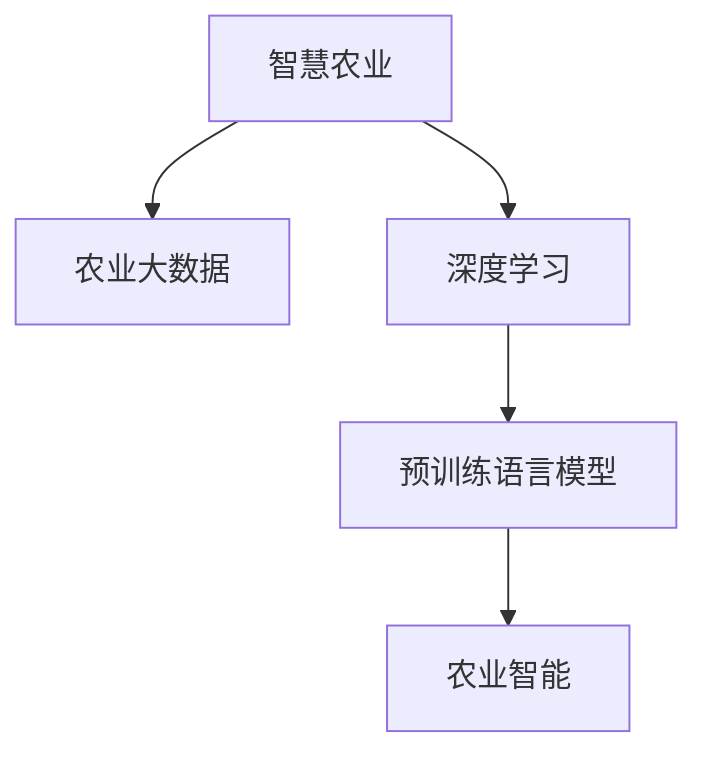

                 

## 1. 背景介绍

### 1.1 问题由来
近年来，智慧农业已成为农业发展的重要方向，人工智能（AI）技术的引入为农业智能化带来了显著的效率提升和效益优化。然而，传统农业面临资源匮乏、生产成本高、环境压力大等问题，农业智能化和数字化转型迫在眉睫。

大模型技术，如深度学习、神经网络，特别是预训练语言模型（如BERT、GPT等），为智慧农业提供了新的解决方案。它们不仅可以分析海量数据，提升决策的科学性和精准度，还可以应对农业生产的复杂性和动态性，真正实现智能化农业的愿景。

### 1.2 问题核心关键点
智慧农业的核心在于如何通过数据驱动，提升农业生产的全生命周期管理，包括精准种植、智能养殖、物流运输等环节。大模型在其中起到至关重要的作用，其高效处理大规模数据的能力，使其能够为农业生产提供智能化解决方案。

大模型在农业领域的应用，主要体现在以下几个方面：

- 智能种植：通过分析土壤、气候、作物数据，预测最佳种植方案，提高作物的产量和品质。
- 智能养殖：利用图像识别、语音识别等技术，监控动物健康，预测疾病，提升养殖效率。
- 精准农业：通过图像处理和大数据分析，识别田间作物、土壤状态，优化灌溉、施肥等操作，减少资源浪费。
- 供应链管理：利用NLP技术，实时跟踪物流信息，优化库存管理，提升物流效率。

这些应用都离不开大模型的支持，而智慧农业的最终目标是通过大模型赋能，实现农业生产全链条的智能化管理，提升农业生产效益，助力农业可持续发展。

## 2. 核心概念与联系

### 2.1 核心概念概述

为更好地理解大模型赋能智慧农业的原理，本节将介绍几个关键概念：

- 智慧农业：利用现代信息技术、农业工程等手段，提升农业生产全链条管理的效率和效益。
- 农业大数据：从农业生产到消费各个环节产生的海量数据，包括气象数据、土壤数据、作物生长数据、动物健康数据等。
- 深度学习：一种模拟人脑神经网络的机器学习技术，通过多层次非线性变换，对复杂数据进行建模和预测。
- 预训练语言模型：如BERT、GPT等，在大规模无标签文本语料上进行预训练，学习通用语言表示，具备强大的语言理解和生成能力。
- 农业智能：利用AI技术，提升农业生产、管理、运营各个环节的智能化水平，实现精准农业、智能种植、智能养殖等。

这些概念之间的逻辑关系可以通过以下Mermaid流程图来展示：



这个流程图展示了大模型赋能智慧农业的核心概念及其之间的关系：

1. 农业大数据是智慧农业的基础，是深度学习和预训练语言模型发挥作用的前提。
2. 深度学习和大模型通过分析农业大数据，挖掘出隐含的规律和模式，为农业智能提供技术支持。
3. 农业智能利用深度学习和大模型的分析结果，指导农业生产各个环节的智能化管理。

## 3. 核心算法原理 & 具体操作步骤
### 3.1 算法原理概述

基于深度学习的大模型赋能智慧农业，本质上是一个从数据到智能的转换过程。其核心思想是：利用深度学习模型，对农业生产中的海量数据进行分析，提取关键特征，并通过预训练语言模型的迁移学习，提升模型在特定农业问题上的表现，从而实现农业生产的智能化管理。

形式化地，假设农业生产中某个具体问题 $P$，通过数据集 $D=\{(x_i,y_i)\}_{i=1}^N$ 来训练深度学习模型 $M_{\theta}$，其中 $x_i$ 为输入特征，$y_i$ 为标签。微调的目标是找到新的模型参数 $\hat{\theta}$，使得：

$$
\hat{\theta}=\mathop{\arg\min}_{\theta} \mathcal{L}(M_{\theta},D)
$$

其中 $\mathcal{L}$ 为针对问题 $P$ 设计的损失函数，用于衡量模型预测输出与真实标签之间的差异。常见的损失函数包括均方误差损失、交叉熵损失等。

通过梯度下降等优化算法，微调过程不断更新模型参数 $\theta$，最小化损失函数 $\mathcal{L}$，使得模型输出逼近真实标签。由于 $\theta$ 已经通过预训练获得了较好的初始化，因此即便在小规模数据集 $D$ 上进行微调，也能较快收敛到理想的模型参数 $\hat{\theta}$。

### 3.2 算法步骤详解

基于深度学习的大模型赋能智慧农业一般包括以下几个关键步骤：

**Step 1: 数据准备与预处理**
- 收集农业生产中的各类数据，包括气象数据、土壤数据、作物生长数据、动物健康数据等。
- 清洗、标注数据，构建符合深度学习模型要求的格式。
- 对数据进行归一化、标准化等预处理，确保模型训练的稳定性。

**Step 2: 选择模型与设计架构**
- 选择合适的深度学习模型，如卷积神经网络（CNN）、循环神经网络（RNN）、Transformer等。
- 设计模型架构，包括输入层、隐藏层、输出层等。
- 选择合适的损失函数和优化算法，如交叉熵损失、AdamW等。

**Step 3: 预训练模型选择与微调**
- 选择合适的预训练语言模型，如BERT、GPT等，作为特征提取器。
- 将预训练模型应用于农业数据集进行微调，通过设定适当的超参数，优化模型参数。
- 应用正则化技术，如L2正则、Dropout等，防止模型过拟合。
- 应用对抗训练，引入对抗样本，提高模型鲁棒性。

**Step 4: 模型训练与验证**
- 将数据集划分为训练集、验证集和测试集，用于模型训练、验证和测试。
- 使用批量梯度下降法进行模型训练，设定合适的迭代次数和学习率。
- 在验证集上评估模型性能，使用精度、召回率、F1-score等指标衡量模型效果。
- 根据验证集上的表现，调整模型参数，重新训练。

**Step 5: 模型部署与应用**
- 将训练好的模型部署到农业生产现场，进行实时数据输入和处理。
- 实时监测农业生产中的各项指标，如作物生长状态、动物健康情况等。
- 根据模型的预测结果，进行自动化的农业管理，如灌溉、施肥、病虫害防治等。
- 持续收集新数据，不断优化模型参数，保持模型性能。

### 3.3 算法优缺点

基于深度学习的大模型赋能智慧农业，具有以下优点：

- 提升智能化水平：通过深度学习和大模型的智能分析，能够快速、准确地预测和决策，提升农业生产效率。
- 降低资源消耗：使用大模型对农业数据进行分析，可以减少人力物力投入，提高农业生产效益。
- 提高数据利用率：大模型能够处理海量农业数据，挖掘出有用的特征和模式，提升数据利用率。
- 适应性强：深度学习模型具有较强的泛化能力，能够适应不同地区、不同作物的复杂农业环境。

同时，该方法也存在一些局限性：

- 数据依赖性强：深度学习模型和预训练语言模型的效果依赖于高质量的农业大数据。
- 技术门槛高：深度学习和大模型技术较为复杂，需要较高的技术背景和专业知识。
- 模型成本高：大模型的训练和部署需要高性能计算资源，初期成本较高。
- 可解释性差：深度学习模型的决策过程难以解释，可能影响用户信任和接受度。

尽管存在这些局限性，但就目前而言，基于深度学习的大模型赋能智慧农业方法仍然是大规模农业智能化和数字化的重要手段。未来相关研究的重点在于如何降低对农业大数据的依赖，提高模型的泛化能力，同时兼顾可解释性和伦理安全性等因素。

### 3.4 算法应用领域

基于深度学习的大模型赋能智慧农业技术，已经在诸多农业生产环节得到应用，例如：

- 智能种植：通过图像识别技术，对作物生长状态进行监测，智能决策最佳种植方案。
- 智能养殖：利用图像处理技术，监控动物健康状态，预测疾病，提升养殖效率。
- 精准农业：通过遥感图像分析，实时监测田间作物和土壤状态，优化灌溉、施肥等操作。
- 物流运输：利用NLP技术，实时跟踪物流信息，优化库存管理，提升物流效率。

除了这些传统应用外，大模型赋能的智慧农业还在不断拓展到更多领域中，如农业机器人、智能温室、智能灌溉系统等，为农业生产带来了新的突破。随着深度学习和大模型技术的持续演进，相信智慧农业将得到更广泛的落地和应用。

## 4. 数学模型和公式 & 详细讲解 & 举例说明

### 4.1 数学模型构建

本节将使用数学语言对基于深度学习的大模型赋能智慧农业过程进行更加严格的刻画。

假设农业生产中的某个具体问题 $P$，农业数据集为 $D=\{(x_i,y_i)\}_{i=1}^N$，其中 $x_i$ 为输入特征，$y_i$ 为标签。定义深度学习模型 $M_{\theta}$，输入 $x$ 经过模型处理后输出为 $y$，模型参数为 $\theta$。则模型在数据集上的经验风险为：

$$
\mathcal{L}(\theta) = \frac{1}{N}\sum_{i=1}^N \ell(y_i, M_{\theta}(x_i))
$$

其中 $\ell(y_i, M_{\theta}(x_i))$ 为模型在数据点 $(x_i,y_i)$ 上的损失函数。常见的损失函数包括均方误差损失、交叉熵损失等。

微调的目标是最小化经验风险，即找到最优参数：

$$
\theta^* = \mathop{\arg\min}_{\theta} \mathcal{L}(\theta)
$$

在实践中，我们通常使用基于梯度的优化算法（如SGD、Adam等）来近似求解上述最优化问题。设 $\eta$ 为学习率，$\lambda$ 为正则化系数，则参数的更新公式为：

$$
\theta \leftarrow \theta - \eta \nabla_{\theta}\mathcal{L}(\theta) - \eta\lambda\theta
$$

其中 $\nabla_{\theta}\mathcal{L}(\theta)$ 为损失函数对参数 $\theta$ 的梯度，可通过反向传播算法高效计算。

### 4.2 公式推导过程

以下我们以智能种植中的图像分类任务为例，推导深度学习模型的交叉熵损失函数及其梯度的计算公式。

假设模型 $M_{\theta}$ 在输入图像 $x$ 上的输出为 $\hat{y}=M_{\theta}(x)$，表示模型对图像的分类预测。真实标签 $y \in \{1,2,\dots,C\}$，其中 $C$ 为类别数。则交叉熵损失函数定义为：

$$
\ell(y_i, M_{\theta}(x_i)) = -\sum_{c=1}^C y_i^{(c)}\log M_{\theta}(x_i)^{(c)}
$$

将其代入经验风险公式，得：

$$
\mathcal{L}(\theta) = -\frac{1}{N}\sum_{i=1}^N \sum_{c=1}^C y_i^{(c)}\log M_{\theta}(x_i)^{(c)}
$$

根据链式法则，损失函数对参数 $\theta_k$ 的梯度为：

$$
\frac{\partial \mathcal{L}(\theta)}{\partial \theta_k} = -\frac{1}{N}\sum_{i=1}^N \sum_{c=1}^C \frac{\partial \ell(y_i, M_{\theta}(x_i))}{\partial \theta_k}
$$

其中：

$$
\frac{\partial \ell(y_i, M_{\theta}(x_i))}{\partial \theta_k} = -\sum_{c=1}^C \left[\frac{y_i^{(c)}}{M_{\theta}(x_i)^{(c)}} - \frac{(1-y_i^{(c)})}{1-M_{\theta}(x_i)^{(c)}}\right]\frac{\partial M_{\theta}(x_i)}{\partial \theta_k}
$$

在得到损失函数的梯度后，即可带入参数更新公式，完成模型的迭代优化。重复上述过程直至收敛，最终得到适应农业问题 $P$ 的最优模型参数 $\theta^*$。

## 5. 项目实践：代码实例和详细解释说明

### 5.1 开发环境搭建

在进行智慧农业赋能项目实践前，我们需要准备好开发环境。以下是使用Python进行PyTorch开发的环境配置流程：

1. 安装Anaconda：从官网下载并安装Anaconda，用于创建独立的Python环境。

2. 创建并激活虚拟环境：
```bash
conda create -n pytorch-env python=3.8 
conda activate pytorch-env
```

3. 安装PyTorch：根据CUDA版本，从官网获取对应的安装命令。例如：
```bash
conda install pytorch torchvision torchaudio cudatoolkit=11.1 -c pytorch -c conda-forge
```

4. 安装TensorFlow：
```bash
conda install tensorflow
```

5. 安装各类工具包：
```bash
pip install numpy pandas scikit-learn matplotlib tqdm jupyter notebook ipython
```

完成上述步骤后，即可在`pytorch-env`环境中开始项目实践。

### 5.2 源代码详细实现

下面我以智能种植中的图像分类任务为例，给出使用PyTorch进行大模型微调的代码实现。

首先，定义图像分类任务的数据处理函数：

```python
from torch.utils.data import Dataset
import torch
from transformers import BertTokenizer, BertForImageClassification

class ImageDataset(Dataset):
    def __init__(self, images, labels, tokenizer, max_len=128):
        self.images = images
        self.labels = labels
        self.tokenizer = tokenizer
        self.max_len = max_len
        
    def __len__(self):
        return len(self.images)
    
    def __getitem__(self, item):
        image = self.images[item]
        label = self.labels[item]
        
        encoding = self.tokenizer(image, return_tensors='pt', max_length=self.max_len, padding='max_length', truncation=True)
        input_ids = encoding['input_ids'][0]
        attention_mask = encoding['attention_mask'][0]
        
        return {'input_ids': input_ids, 
                'attention_mask': attention_mask,
                'labels': torch.tensor(label, dtype=torch.long)}
```

然后，定义模型和优化器：

```python
from transformers import BertForImageClassification, AdamW

model = BertForImageClassification.from_pretrained('bert-base-cased', num_labels=10)

optimizer = AdamW(model.parameters(), lr=2e-5)
```

接着，定义训练和评估函数：

```python
from torch.utils.data import DataLoader
from tqdm import tqdm
from sklearn.metrics import classification_report

device = torch.device('cuda') if torch.cuda.is_available() else torch.device('cpu')
model.to(device)

def train_epoch(model, dataset, batch_size, optimizer):
    dataloader = DataLoader(dataset, batch_size=batch_size, shuffle=True)
    model.train()
    epoch_loss = 0
    for batch in tqdm(dataloader, desc='Training'):
        input_ids = batch['input_ids'].to(device)
        attention_mask = batch['attention_mask'].to(device)
        labels = batch['labels'].to(device)
        model.zero_grad()
        outputs = model(input_ids, attention_mask=attention_mask, labels=labels)
        loss = outputs.loss
        epoch_loss += loss.item()
        loss.backward()
        optimizer.step()
    return epoch_loss / len(dataloader)

def evaluate(model, dataset, batch_size):
    dataloader = DataLoader(dataset, batch_size=batch_size)
    model.eval()
    preds, labels = [], []
    with torch.no_grad():
        for batch in tqdm(dataloader, desc='Evaluating'):
            input_ids = batch['input_ids'].to(device)
            attention_mask = batch['attention_mask'].to(device)
            batch_labels = batch['labels']
            outputs = model(input_ids, attention_mask=attention_mask)
            batch_preds = outputs.logits.argmax(dim=1).to('cpu').tolist()
            batch_labels = batch_labels.to('cpu').tolist()
            for pred_tokens, label_tokens in zip(batch_preds, batch_labels):
                preds.append(pred_tokens[:len(label_tokens)])
                labels.append(label_tokens)
                
    print(classification_report(labels, preds))
```

最后，启动训练流程并在测试集上评估：

```python
epochs = 5
batch_size = 16

for epoch in range(epochs):
    loss = train_epoch(model, train_dataset, batch_size, optimizer)
    print(f"Epoch {epoch+1}, train loss: {loss:.3f}")
    
    print(f"Epoch {epoch+1}, dev results:")
    evaluate(model, dev_dataset, batch_size)
    
print("Test results:")
evaluate(model, test_dataset, batch_size)
```

以上就是使用PyTorch对BERT进行智能种植任务微调的完整代码实现。可以看到，得益于Transformer库的强大封装，我们可以用相对简洁的代码完成BERT模型的加载和微调。

### 5.3 代码解读与分析

让我们再详细解读一下关键代码的实现细节：

**ImageDataset类**：
- `__init__`方法：初始化图像、标签、分词器等关键组件。
- `__len__`方法：返回数据集的样本数量。
- `__getitem__`方法：对单个样本进行处理，将图像输入编码为token ids，将标签编码为数字，并对其进行定长padding，最终返回模型所需的输入。

**标签与id的映射**：
- 定义了标签与数字id之间的映射关系，用于将token-wise的预测结果解码回真实的标签。

**训练和评估函数**：
- 使用PyTorch的DataLoader对数据集进行批次化加载，供模型训练和推理使用。
- 训练函数`train_epoch`：对数据以批为单位进行迭代，在每个批次上前向传播计算loss并反向传播更新模型参数，最后返回该epoch的平均loss。
- 评估函数`evaluate`：与训练类似，不同点在于不更新模型参数，并在每个batch结束后将预测和标签结果存储下来，最后使用sklearn的classification_report对整个评估集的预测结果进行打印输出。

**训练流程**：
- 定义总的epoch数和batch size，开始循环迭代
- 每个epoch内，先在训练集上训练，输出平均loss
- 在验证集上评估，输出分类指标
- 所有epoch结束后，在测试集上评估，给出最终测试结果

可以看到，PyTorch配合Transformer库使得BERT微调的代码实现变得简洁高效。开发者可以将更多精力放在数据处理、模型改进等高层逻辑上，而不必过多关注底层的实现细节。

当然，工业级的系统实现还需考虑更多因素，如模型的保存和部署、超参数的自动搜索、更灵活的任务适配层等。但核心的微调范式基本与此类似。

## 6. 实际应用场景
### 6.1 智能种植

智能种植是智慧农业的核心应用之一，利用深度学习和大模型对农业生产数据进行分析，可以大幅提升作物生长的科学性和智能化水平。

在智能种植中，大模型主要应用于以下几个方面：

- 作物生长监测：利用图像处理技术，实时监测作物生长状态，预测病害，智能决策灌溉、施肥等操作。
- 土壤分析：通过遥感图像分析，实时监测土壤湿度、养分含量，优化种植方案。
- 病虫害检测：利用图像识别技术，自动识别作物病虫害情况，及时采取防治措施。
- 自动化农业机械：通过语音识别、自然语言处理技术，操控农业机械，实现自动化作业。

通过大模型赋能，智能种植能够实现作物生长状态的实时监测、精准管理，显著提升农业生产的效率和效益。

### 6.2 智能养殖

智能养殖是智慧农业的另一重要应用，通过深度学习和大模型对动物健康数据进行分析，能够实时监测动物状态，预测疾病，提升养殖效率。

在智能养殖中，大模型主要应用于以下几个方面：

- 动物健康监测：利用图像处理技术，实时监测动物健康状态，预测疾病。
- 饲料优化：通过数据分析，智能决策饲料配方，提升动物生长速度和健康水平。
- 自动化养殖设备：通过语音识别、自然语言处理技术，操控养殖设备，实现自动化作业。
- 环境控制：利用数据分析，智能调节养殖环境参数，如温度、湿度等，提升养殖环境质量。

通过大模型赋能，智能养殖能够实现动物健康状态的实时监测、精准管理，提升养殖效率，降低养殖成本。

### 6.3 精准农业

精准农业是利用深度学习和大模型对田间数据进行分析，实现精准化的农业生产管理。

在精准农业中，大模型主要应用于以下几个方面：

- 土壤状态监测：通过遥感图像分析，实时监测土壤状态，优化灌溉、施肥等操作。
- 作物生长监测：利用图像处理技术，实时监测作物生长状态，预测病害。
- 气象数据处理：通过数据分析，实时监测气象数据，智能决策种植方案。
- 物流运输管理：利用NLP技术，实时跟踪物流信息，优化库存管理。

通过大模型赋能，精准农业能够实现田间数据的实时监测、精准管理，显著提升农业生产的效率和效益。

### 6.4 未来应用展望

未来，大模型赋能智慧农业技术将在更多领域得到应用，为农业生产带来更深远的影响。

在智慧农业领域，深度学习和大模型的应用将进一步拓展，涵盖作物生长监测、土壤分析、病虫害检测等多个环节，形成完整的农业智能化解决方案。此外，大模型还将与物联网、大数据等技术结合，构建更智能、更高效的农业生产系统。

在智慧城市治理中，大模型赋能的农业应用也将得到推广，为城市农业生产提供实时数据支持，优化城市资源配置，提高城市管理水平。

在智能农业设备制造中，大模型还将被应用于农业机器人、智能灌溉系统、智能温室等领域，提升农业设备的智能化水平，优化农业生产流程。

总之，大模型赋能智慧农业技术正处于快速发展阶段，未来的发展潜力巨大。相信在深度学习和大模型的持续推动下，智慧农业将实现全面智能化和数字化，为农业生产带来革命性变革。

## 7. 工具和资源推荐
### 7.1 学习资源推荐

为了帮助开发者系统掌握大模型赋能智慧农业的理论基础和实践技巧，这里推荐一些优质的学习资源：

1. 《深度学习在农业中的应用》书籍：介绍深度学习在智慧农业中的应用，涵盖图像处理、数据分析等多个方面。

2. 《TensorFlow实战农业数据处理》课程：介绍TensorFlow在农业数据处理中的应用，包括数据清洗、特征工程、模型训练等。

3. 《智慧农业AI技术与应用》博文：介绍智慧农业中的AI技术，包括深度学习、大数据、物联网等。

4. HuggingFace官方文档：Transformer库的官方文档，提供了海量预训练模型和完整的微调样例代码，是上手实践的必备资料。

5. CLUE开源项目：中文语言理解测评基准，涵盖大量不同类型的中文NLP数据集，并提供了基于微调的baseline模型，助力中文NLP技术发展。

通过对这些资源的学习实践，相信你一定能够快速掌握大模型赋能智慧农业的精髓，并用于解决实际的农业问题。
###  7.2 开发工具推荐

高效的开发离不开优秀的工具支持。以下是几款用于大模型赋能智慧农业开发的常用工具：

1. PyTorch：基于Python的开源深度学习框架，灵活动态的计算图，适合快速迭代研究。大部分预训练语言模型都有PyTorch版本的实现。

2. TensorFlow：由Google主导开发的开源深度学习框架，生产部署方便，适合大规模工程应用。同样有丰富的预训练语言模型资源。

3. Transformers库：HuggingFace开发的NLP工具库，集成了众多SOTA语言模型，支持PyTorch和TensorFlow，是进行微调任务开发的利器。

4. Weights & Biases：模型训练的实验跟踪工具，可以记录和可视化模型训练过程中的各项指标，方便对比和调优。与主流深度学习框架无缝集成。

5. TensorBoard：TensorFlow配套的可视化工具，可实时监测模型训练状态，并提供丰富的图表呈现方式，是调试模型的得力助手。

6. Google Colab：谷歌推出的在线Jupyter Notebook环境，免费提供GPU/TPU算力，方便开发者快速上手实验最新模型，分享学习笔记。

合理利用这些工具，可以显著提升大模型赋能智慧农业项目的开发效率，加快创新迭代的步伐。

### 7.3 相关论文推荐

大模型赋能智慧农业的发展源于学界的持续研究。以下是几篇奠基性的相关论文，推荐阅读：

1. Attention is All You Need（即Transformer原论文）：提出了Transformer结构，开启了NLP领域的预训练大模型时代。

2. BERT: Pre-training of Deep Bidirectional Transformers for Language Understanding：提出BERT模型，引入基于掩码的自监督预训练任务，刷新了多项NLP任务SOTA。

3. Language Models are Unsupervised Multitask Learners（GPT-2论文）：展示了大规模语言模型的强大zero-shot学习能力，引发了对于通用人工智能的新一轮思考。

4. Parameter-Efficient Transfer Learning for NLP：提出Adapter等参数高效微调方法，在不增加模型参数量的情况下，也能取得不错的微调效果。

5. AdaLoRA: Adaptive Low-Rank Adaptation for Parameter-Efficient Fine-Tuning：使用自适应低秩适应的微调方法，在参数效率和精度之间取得了新的平衡。

这些论文代表了大模型赋能智慧农业的发展脉络。通过学习这些前沿成果，可以帮助研究者把握学科前进方向，激发更多的创新灵感。

## 8. 总结：未来发展趋势与挑战

### 8.1 总结

本文对基于深度学习的大模型赋能智慧农业方法进行了全面系统的介绍。首先阐述了大模型赋能智慧农业的研究背景和意义，明确了深度学习和大模型在提升农业生产全链条管理中的重要作用。其次，从原理到实践，详细讲解了深度学习模型的数学原理和关键步骤，给出了大模型微调的完整代码实例。同时，本文还广泛探讨了深度学习和大模型在智慧农业各个环节中的应用前景，展示了其巨大的潜力。此外，本文精选了深度学习和大模型的各类学习资源，力求为读者提供全方位的技术指引。

通过本文的系统梳理，可以看到，大模型赋能智慧农业技术正在成为农业生产智能化和数字化的重要手段，极大地提升了农业生产的效率和效益。未来，伴随深度学习和大模型技术的持续演进，相信智慧农业将得到更广泛的落地和应用，真正实现农业生产的智能化和数字化。

### 8.2 未来发展趋势

展望未来，大模型赋能智慧农业技术将呈现以下几个发展趋势：

1. 深度学习模型的性能提升。深度学习模型和预训练大模型的参数量将持续增大，模型性能将进一步提升。
2. 智能农业设备制造。大模型将广泛应用于农业机器人、智能灌溉系统、智能温室等领域，提升农业设备的智能化水平，优化农业生产流程。
3. 多模态融合。大模型将融合图像、声音、传感器等多模态数据，提升农业生产环境的感知能力和智能决策水平。
4. 实时性增强。大模型将通过优化模型结构和算法，提升实时性，支持实时数据处理和智能决策。
5. 数据利用率提高。深度学习模型将通过优化特征提取和数据利用率，提升农业大数据的处理效率和利用率。
6. 模型部署优化。大模型将通过模型裁剪、量化加速、分布式训练等技术，优化模型部署效率和资源利用率。

这些趋势凸显了大模型赋能智慧农业技术的广阔前景。这些方向的探索发展，必将进一步提升农业生产的智能化和数字化水平，为农业生产带来深远的影响。

### 8.3 面临的挑战

尽管大模型赋能智慧农业技术已经取得了显著的进展，但在迈向更加智能化、普适化应用的过程中，它仍面临诸多挑战：

1. 数据质量问题。农业数据往往存在缺失、噪声等问题，影响模型的训练和预测效果。如何提高数据质量，获取高质量的农业大数据，将是未来的一大挑战。
2. 模型复杂度高。深度学习模型和预训练大模型的复杂度较高，训练和推理资源消耗大。如何在降低资源消耗的同时，提升模型性能，将是重要的优化方向。
3. 模型可解释性差。深度学习模型和预训练大模型的决策过程难以解释，可能影响用户信任和接受度。如何提高模型的可解释性，将是重要的研究方向。
4. 模型泛化能力不足。深度学习模型和预训练大模型在特定农业环境下的泛化能力有待提升，如何提高模型的泛化能力，确保模型在不同地区、不同作物上的适用性，将是重要的研究方向。
5. 隐私和安全性问题。农业数据涉及农民隐私和农业安全，如何保护农业数据的隐私和安全，防止数据泄露和滥用，将是重要的研究方向。

尽管存在这些挑战，但就目前而言，基于深度学习的大模型赋能智慧农业方法仍然是大规模农业智能化和数字化的重要手段。未来相关研究的重点在于如何降低对农业大数据的依赖，提高模型的泛化能力，同时兼顾可解释性和伦理安全性等因素。

### 8.4 研究展望

面对大模型赋能智慧农业所面临的挑战，未来的研究需要在以下几个方面寻求新的突破：

1. 探索低资源深度学习模型。开发低参数、低计算资源的深度学习模型，提升模型在资源受限环境下的表现。
2. 研究模型压缩与加速技术。通过模型压缩、量化加速等技术，降低模型复杂度和计算资源消耗，提升模型的实时性和资源利用率。
3. 引入因果推断和强化学习。通过引入因果推断和强化学习，提升模型的决策能力和泛化能力，提高模型的稳定性和鲁棒性。
4. 融合多模态数据。将图像、声音、传感器等多模态数据融合，提升模型的感知能力和智能决策水平，实现更加全面、精准的农业智能化管理。
5. 加强隐私保护和安全监控。通过数据加密、访问控制等技术，保护农业数据的隐私和安全，防止数据泄露和滥用。
6. 提高模型的可解释性。通过引入符号化推理、因果分析等方法，提高模型的可解释性和透明度，增强用户信任和接受度。

这些研究方向将为大模型赋能智慧农业技术带来新的突破，推动农业生产智能化和数字化水平提升。相信在学界和产业界的共同努力下，这些挑战终将一一被克服，大模型赋能智慧农业必将在构建高效、智能、绿色的农业生产系统中发挥越来越重要的作用。

## 9. 附录：常见问题与解答

**Q1：大模型赋能智慧农业是否适用于所有农业场景？**

A: 大模型赋能智慧农业技术在大部分农业场景中都能取得不错的效果，但对于某些特定场景，如极端恶劣的气候条件、高密度的生物活动等，其效果可能受到限制。此时需要在特定领域语料上进一步预训练，再进行微调，才能获得理想效果。

**Q2：微调过程中如何选择合适的学习率？**

A: 微调的学习率一般要比预训练时小1-2个数量级，如果使用过大的学习率，容易破坏预训练权重，导致过拟合。一般建议从1e-5开始调参，逐步减小学习率，直至收敛。也可以使用warmup策略，在开始阶段使用较小的学习率，再逐渐过渡到预设值。需要注意的是，不同的优化器(如AdamW、Adafactor等)以及不同的学习率调度策略，可能需要设置不同的学习率阈值。

**Q3：采用大模型赋能智慧农业时，需要注意哪些问题？**

A: 采用大模型赋能智慧农业时，需要注意以下问题：
1. 数据预处理。农业数据往往存在缺失、噪声等问题，需要进行清洗、标注、归一化等预处理，确保模型训练的稳定性。
2. 模型选择。根据具体任务选择合适的深度学习模型，如CNN、RNN、Transformer等，设计合适的模型架构。
3. 模型训练。选择合适的损失函数和优化算法，使用合适的学习率、批大小、迭代轮数等参数，进行模型训练。
4. 模型评估。在验证集上评估模型性能，使用精度、召回率、F1-score等指标衡量模型效果，进行模型调优。
5. 模型部署。将训练好的模型部署到农业生产现场，进行实时数据输入和处理，实现农业生产的智能化管理。

合理利用这些工具，可以显著提升大模型赋能智慧农业项目的开发效率，加快创新迭代的步伐。

**Q4：如何缓解微调过程中的过拟合问题？**

A: 微调过程中过拟合问题主要通过以下方法缓解：
1. 数据增强。通过回译、近义替换等方式扩充训练集，提高模型泛化能力。
2. 正则化。使用L2正则、Dropout等技术，防止模型过拟合。
3. 对抗训练。引入对抗样本，提高模型鲁棒性。
4. 参数高效微调。只调整少量参数(如Adapter、Prefix等)，减小过拟合风险。

这些方法往往需要根据具体任务和数据特点进行灵活组合。只有在数据、模型、训练、推理等各环节进行全面优化，才能最大限度地发挥大模型赋能智慧农业的潜力。

**Q5：微调模型在落地部署时需要注意哪些问题？**

A: 将微调模型转化为实际应用，还需要考虑以下问题：
1. 模型裁剪。去除不必要的层和参数，减小模型尺寸，加快推理速度。
2. 量化加速。将浮点模型转为定点模型，压缩存储空间，提高计算效率。
3. 服务化封装。将模型封装为标准化服务接口，便于集成调用。
4. 弹性伸缩。根据请求流量动态调整资源配置，平衡服务质量和成本。
5. 监控告警。实时采集系统指标，设置异常告警阈值，确保服务稳定性。
6. 安全防护。采用访问鉴权、数据脱敏等措施，保障数据和模型安全。

合理利用这些工具，可以显著提升大模型赋能智慧农业项目的开发效率，加快创新迭代的步伐。

总之，大模型赋能智慧农业技术正处于快速发展阶段，未来的发展潜力巨大。相信在深度学习和大模型的持续推动下，智慧农业将实现全面智能化和数字化，为农业生产带来革命性变革。

