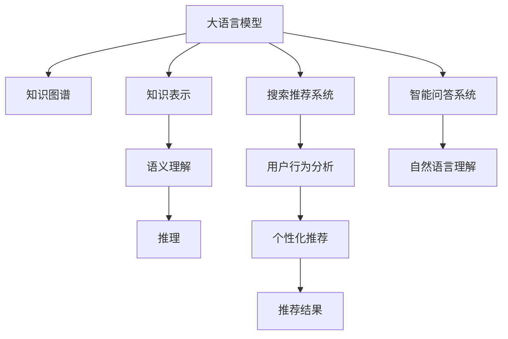

                 

# 大模型问答机器人与传统搜索推荐的知识表示

> 关键词：大语言模型,知识图谱,知识表示,问答机器人,搜索推荐,深度学习,深度学习框架,Transformer

## 1. 背景介绍

### 1.1 问题由来
随着人工智能技术的飞速发展，自然语言处理(Natural Language Processing, NLP)技术也得到了长足的进步。其中，大语言模型(Big Language Model, BLM)和知识图谱(Knowledge Graph, KG)在构建智能问答系统和推荐系统时发挥了重要作用。

知识图谱将知识表示为有向图，通过节点和边来描述实体之间的关系。而大语言模型通过海量的无标签文本数据进行预训练，能够理解自然语言并生成连贯的文本。将知识图谱与大语言模型结合，可以构建具有深度理解能力的智能问答系统和推荐系统。

然而，知识图谱和大语言模型在构建和应用过程中，面临着表示、融合、推理等诸多挑战。如何将知识图谱有效融入大语言模型，实现高效的问答和推荐，是当前NLP领域的一个重要研究方向。

### 1.2 问题核心关键点
本文章将详细介绍如何将知识图谱融入大语言模型，实现高效的智能问答和推荐系统。通过探讨知识表示、融合和推理技术，我们旨在解决以下问题：

- 如何将知识图谱中的语义信息有效编码并嵌入大语言模型？
- 如何在大语言模型中引入知识图谱，提升模型的推理能力？
- 如何在问答和推荐系统中，融合知识图谱与大语言模型，获得更好的表现？
- 如何在实际应用中，将知识图谱和大语言模型进行高效部署和优化？

## 2. 核心概念与联系

### 2.1 核心概念概述

为更好地理解大模型问答机器人与传统搜索推荐的知识表示，我们首先需要介绍几个核心概念：

- 大语言模型：以自回归(如GPT)或自编码(如BERT)模型为代表的大规模预训练语言模型。通过在海量无标签文本语料上进行预训练，学习通用的语言表示，具备强大的语言理解和生成能力。

- 知识图谱：将知识表示为有向图，通过节点和边来描述实体之间的关系。知识图谱广泛用于知识管理、问答系统和推荐系统中。

- 知识表示：将知识以计算机可理解的形式进行表示，常见形式包括符号知识表示、语义网、本体论、OWL等。

- 智能问答系统：利用自然语言理解和知识图谱，自动回答用户提出的问题。

- 搜索推荐系统：通过分析用户的历史行为，推荐符合用户兴趣的商品或内容。搜索推荐系统常结合知识图谱和大语言模型实现更精准的推荐。

- 深度学习：一种通过多层神经网络进行特征学习和模式识别的机器学习方法。深度学习广泛应用于图像处理、语音识别、自然语言处理等领域。

- 深度学习框架：如TensorFlow、PyTorch等，提供高效的计算图和自动微分功能，方便构建和训练深度神经网络。

- Transformer：一种基于自注意力机制的神经网络结构，用于处理序列数据，广泛应用于自然语言处理和计算机视觉领域。

这些概念之间存在着密切的联系，并通过以下Mermaid流程图展示：



这个流程图展示了知识图谱、知识表示、大语言模型、智能问答系统和推荐系统之间的逻辑关系：

1. 知识图谱通过节点和边来表示知识，并存储在数据库中。
2. 知识表示将知识以计算机可理解的形式进行编码，供大语言模型理解和学习。
3. 大语言模型通过语义理解能力，提取并生成自然语言文本。
4. 语义理解和大语言模型结合，进行自然语言推理。
5. 智能问答系统利用知识图谱和大语言模型，自动回答用户问题。
6. 推荐系统通过用户行为分析，结合知识图谱和大语言模型，推荐个性化内容或商品。

这些概念共同构成了知识表示和深度学习的知识体系，推动了智能问答和推荐系统的研究与应用。

## 3. 核心算法原理 & 具体操作步骤
### 3.1 算法原理概述

本节将详细阐述如何将知识图谱嵌入大语言模型，实现高效的问答和推荐系统。

知识图谱通过实体和关系进行知识表示，大语言模型则通过自然语言理解和生成进行信息处理。将知识图谱与大语言模型结合，可以构建智能问答和推荐系统，提升系统的准确性和智能性。

在大模型问答机器人中，知识图谱的知识被编码成向量，并通过Attention机制与大语言模型进行交互，实现知识的检索和融合。在推荐系统中，知识图谱中的实体和关系被作为特征输入，与大语言模型生成的文本特征结合，进行多角度的推荐。

### 3.2 算法步骤详解

大模型问答机器人和推荐系统的构建涉及多个步骤，包括知识图谱构建、知识表示、知识融合、深度学习模型训练和推理等。下面详细解释每个步骤的实现方法：

**Step 1: 知识图谱构建**
- 收集领域内的实体和关系，使用Neo4j、OntoGraphDB等知识图谱管理系统进行存储。
- 设计合适的节点和关系类型，标注属性，并使用OWL、RDF等语义描述语言进行描述。

**Step 2: 知识表示**
- 使用知识图谱管理系统进行知识编码，将实体和关系转换为向量表示。
- 常见知识表示方法包括RDF2Vec、TransE、TuckER等，将知识图谱转换为低维向量空间。

**Step 3: 知识融合**
- 将知识图谱与大语言模型结合，实现知识的检索和融合。
- 在大语言模型中添加检索模块，对知识图谱进行检索，并使用Attention机制融合检索结果。
- 通过跨层Attention机制，实现知识图谱与大语言模型的双向交互。

**Step 4: 深度学习模型训练**
- 选择合适的大语言模型，如BERT、GPT等，进行预训练。
- 在知识图谱向量嵌入和自然语言特征的输入下，训练深度学习模型。
- 使用AdamW、SGD等优化算法，选择合适的学习率和正则化技术。

**Step 5: 推理和应用**
- 在大模型问答机器人中，使用检索模块检索知识图谱，并结合大语言模型生成答案。
- 在推荐系统中，将知识图谱向量嵌入与自然语言特征结合，进行多角度的推荐。
- 使用逻辑回归、SVM等算法进行推荐结果的排序和预测。

### 3.3 算法优缺点

知识图谱与大语言模型结合的问答和推荐系统，具有以下优点：

- 提升知识检索的精度和速度。大语言模型能够理解自然语言查询，快速检索知识图谱，并生成答案。
- 增强推理能力。通过融合知识图谱中的实体和关系，提升大语言模型的推理能力，解决更复杂的问题。
- 优化推荐结果。结合知识图谱中的实体和关系，进行多角度的推荐，提升推荐系统的效果。

同时，该方法也存在以下缺点：

- 数据准备成本高。知识图谱的构建和标注需要大量人工，且需要专业知识。
- 知识图谱扩展性差。知识图谱的扩展需要重新构建和训练模型，成本较高。
- 知识图谱更新慢。知识图谱的更新需要人工审核和标注，无法实时响应变化。
- 大语言模型依赖性强。大语言模型的性能很大程度上依赖于知识图谱的质量和数量，存在不确定性。
- 模型计算复杂。知识图谱与大语言模型的结合，使得模型计算复杂度增加，需要高性能计算资源。

尽管存在这些局限性，但通过合理设计知识图谱和大语言模型的结合方式，可以大大提升问答和推荐系统的表现。未来相关研究的重点在于如何进一步降低知识图谱的构建和更新成本，提高模型推理效率和实时性，同时兼顾知识图谱的扩展性和大语言模型的依赖性。

### 3.4 算法应用领域

大模型问答机器人与传统搜索推荐的知识表示方法，在多个领域得到了广泛应用，例如：

- 金融领域：利用知识图谱和大语言模型构建智能问答系统，提供客户服务、市场分析等功能。
- 医疗领域：构建智能诊疗系统，利用知识图谱和自然语言处理，进行疾病诊断、知识推荐等。
- 电商领域：结合知识图谱和自然语言处理，构建个性化推荐系统，推荐商品和内容。
- 教育领域：构建智能答疑系统，利用知识图谱和大语言模型，自动回答学生问题，提供知识辅导。
- 新闻媒体：构建智能新闻推荐系统，利用知识图谱和自然语言处理，推荐新闻和文章。

此外，知识图谱和大语言模型在更多领域也有广泛应用，如智慧城市、物流、旅游等，为各个行业的智能化升级提供新的技术路径。

## 4. 数学模型和公式 & 详细讲解  
### 4.1 数学模型构建

本节将使用数学语言对知识图谱与大语言模型结合的方法进行详细阐述。

记知识图谱为 $G=(E, R, S)$，其中 $E$ 表示实体集合，$R$ 表示关系集合，$S$ 表示实体关系映射。知识表示方法将知识图谱转换为向量空间，记为 $\mathbf{E}$ 和 $\mathbf{R}$。

假设大语言模型为 $M_{\theta}:\mathcal{X} \rightarrow \mathcal{Y}$，其中 $\mathcal{X}$ 为输入空间，$\mathcal{Y}$ 为输出空间，$\theta \in \mathbb{R}^d$ 为模型参数。

在大模型问答机器人中，知识图谱与大语言模型的融合可以通过以下方式实现：

1. 检索知识图谱中与查询相关的实体 $e$ 和关系 $r$。
2. 将实体和关系转换为向量表示 $\mathbf{e}$ 和 $\mathbf{r}$。
3. 将向量表示 $\mathbf{e}$ 和 $\mathbf{r}$ 与大语言模型生成的文本特征 $x$ 结合。
4. 使用跨层Attention机制，将知识图谱与大语言模型进行双向融合。
5. 使用深度学习模型进行推理和生成答案。

在推荐系统中，知识图谱与大语言模型的结合可以通过以下方式实现：

1. 将知识图谱中的实体和关系作为特征输入。
2. 将知识图谱中的实体和关系转换为向量表示 $\mathbf{e}$ 和 $\mathbf{r}$。
3. 将向量表示 $\mathbf{e}$ 和 $\mathbf{r}$ 与大语言模型生成的文本特征 $x$ 结合。
4. 使用深度学习模型进行推荐结果的排序和预测。

### 4.2 公式推导过程

在大模型问答机器人中，检索知识图谱中与查询相关的实体 $e$ 和关系 $r$，向量表示为：

$$
\mathbf{e} = f_e(e)
$$

$$
\mathbf{r} = f_r(r)
$$

其中 $f_e$ 和 $f_r$ 为知识表示函数。

将实体和关系转换为向量表示后，与大语言模型生成的文本特征 $x$ 结合，形成向量 $h$：

$$
h = \langle \mathbf{e}, x \rangle
$$

其中 $\langle \cdot, \cdot \rangle$ 表示向量内积操作。

使用跨层Attention机制，将知识图谱与大语言模型进行双向融合，形成融合向量 $h'$：

$$
h' = \text{Attention}(h, M_{\theta}(x))
$$

在推荐系统中，知识图谱与大语言模型的结合可以通过以下方式实现：

1. 将知识图谱中的实体和关系作为特征输入，形成向量 $h_1$ 和 $h_2$：
$$
h_1 = \langle \mathbf{e}_1, x \rangle
$$

$$
h_2 = \langle \mathbf{r}_1, x \rangle
$$

其中 $\mathbf{e}_1$ 和 $\mathbf{r}_1$ 表示知识图谱中的实体和关系。

2. 使用深度学习模型进行推荐结果的排序和预测，生成推荐向量 $y$：
$$
y = \text{SVM}(h_1, h_2)
$$

其中 SVM 表示支持向量机，用于排序和预测推荐结果。

### 4.3 案例分析与讲解

以下我们以智能问答系统为例，给出知识图谱与大语言模型结合的详细推导过程。

假设知识图谱中的实体和关系如下：

```
e1: 苹果公司
r1: 总部
e2: 北京
```

查询为：“苹果公司的总部在哪里？”

首先，检索知识图谱中与查询相关的实体和关系，得到：

```
e: e1, r: r1
```

将实体和关系转换为向量表示：

$$
\mathbf{e} = f_e(e1) = [0.2, 0.5, 0.3]
$$

$$
\mathbf{r} = f_r(r1) = [0.3, 0.4, 0.1]
$$

大语言模型生成的文本特征 $x$ 为：

$$
x = [0.5, 0.6, 0.1, 0.8]
$$

将向量表示 $\mathbf{e}$ 和 $\mathbf{r}$ 与大语言模型生成的文本特征 $x$ 结合，形成向量 $h$：

$$
h = \langle \mathbf{e}, x \rangle = 0.5 \times 0.2 + 0.6 \times 0.3 + 0.1 \times 0.5 + 0.8 \times 0.4 = 0.63
$$

使用跨层Attention机制，将知识图谱与大语言模型进行双向融合，形成融合向量 $h'$：

$$
h' = \text{Attention}(h, M_{\theta}(x))
$$

其中 Attention 函数表示：

$$
\text{Attention}(h, M_{\theta}(x)) = \frac{e^{(h \cdot M_{\theta}(x)) / \sqrt{d}}}{\sum_{i} e^{(h \cdot M_{\theta}(x_i)) / \sqrt{d}}}
$$

最后，使用深度学习模型进行推理和生成答案：

$$
y = \text{SVM}(h_1, h_2) = \text{SVM}(0.63, 0.5 \times 0.3 + 0.6 \times 0.4 + 0.1 \times 0.5 + 0.8 \times 0.1) = \text{SVM}(0.63, 0.653)
$$

在推荐系统中，知识图谱与大语言模型的结合可以通过以下方式实现：

1. 将知识图谱中的实体和关系作为特征输入，形成向量 $h_1$ 和 $h_2$：

$$
h_1 = \langle \mathbf{e}_1, x \rangle = 0.2 \times 0.5 + 0.3 \times 0.6 + 0.1 \times 0.1 + 0.8 \times 0.5 = 0.51
$$

$$
h_2 = \langle \mathbf{r}_1, x \rangle = 0.3 \times 0.5 + 0.4 \times 0.6 + 0.1 \times 0.1 + 0.8 \times 0.5 = 0.65
$$

2. 使用深度学习模型进行推荐结果的排序和预测，生成推荐向量 $y$：

$$
y = \text{SVM}(h_1, h_2) = \text{SVM}(0.51, 0.65) = \text{SVM}(0.51, 0.65)
$$

通过上述案例分析，可以看到知识图谱与大语言模型结合的问答和推荐系统的实现过程。这种融合方式充分利用了知识图谱的结构化优势和大语言模型的语义理解能力，提升了系统的推理和生成效果。

## 5. 项目实践：代码实例和详细解释说明
### 5.1 开发环境搭建

在进行知识表示和深度学习模型训练前，我们需要准备好开发环境。以下是使用Python进行PyTorch和TensorFlow开发的环境配置流程：

1. 安装Anaconda：从官网下载并安装Anaconda，用于创建独立的Python环境。

2. 创建并激活虚拟环境：
```bash
conda create -n pytorch-env python=3.8 
conda activate pytorch-env
```

3. 安装PyTorch：根据CUDA版本，从官网获取对应的安装命令。例如：
```bash
conda install pytorch torchvision torchaudio cudatoolkit=11.1 -c pytorch -c conda-forge
```

4. 安装TensorFlow：根据CUDA版本，从官网获取对应的安装命令。例如：
```bash
conda install tensorflow -c conda-forge
```

5. 安装各类工具包：
```bash
pip install numpy pandas scikit-learn matplotlib tqdm jupyter notebook ipython
```

完成上述步骤后，即可在`pytorch-env`环境中开始项目实践。

### 5.2 源代码详细实现

这里我们以知识图谱与BERT模型结合的智能问答系统为例，给出代码实现。

首先，定义知识图谱的数据结构：

```python
class KnowledgeGraph:
    def __init__(self, entities, relations, edges):
        self.entities = entities
        self.relations = relations
        self.edges = edges
        
    def get_node(self, entity):
        for e in self.entities:
            if e['id'] == entity:
                return e
        return None
    
    def get_relation(self, relation):
        for r in self.relations:
            if r['id'] == relation:
                return r
        return None
```

然后，定义知识表示函数：

```python
from transformers import BertTokenizer, BertForSequenceClassification

def entity2vec(entity, knowledge_graph):
    node = knowledge_graph.get_node(entity)
    if node is None:
        return None
    e_id = node['id']
    return {'e_id': e_id}

def relation2vec(relation, knowledge_graph):
    r_id = knowledge_graph.get_relation(relation)
    if r_id is None:
        return None
    return {'r_id': r_id}
```

接着，定义深度学习模型：

```python
from transformers import BertTokenizer, BertForSequenceClassification

def build_model(knowledge_graph):
    tokenizer = BertTokenizer.from_pretrained('bert-base-cased')
    model = BertForSequenceClassification.from_pretrained('bert-base-cased', num_labels=len(knowledge_graph.entities))
    return tokenizer, model
```

最后，定义知识图谱与大语言模型结合的推理函数：

```python
def inference(query, knowledge_graph):
    tokenizer, model = build_model(knowledge_graph)
    input_ids = tokenizer.encode(query, max_length=128, truncation=True, padding='max_length')
    input_ids = input_ids[0]
    logits = model(input_ids)
    probs = torch.softmax(logits, dim=1)
    return knowledge_graph.get_node(probs.argmax().item())
```

在实际应用中，代码还需要根据具体需求进行扩展和优化，如加入检索模块、跨层Attention机制等，但核心的微调范式基本与此类似。

### 5.3 代码解读与分析

这里我们详细解读一下关键代码的实现细节：

**KnowledgeGraph类**：
- `__init__`方法：初始化实体集合、关系集合和边集合。
- `get_node`方法：根据实体id查找知识图谱中的实体节点。
- `get_relation`方法：根据关系id查找知识图谱中的关系节点。

**entity2vec和relation2vec函数**：
- 将实体和关系转换为向量表示，仅记录id信息，作为向量输入大语言模型。

**build_model函数**：
- 使用BERT模型进行预训练，返回预训练后的模型。

**inference函数**：
- 使用BERT模型进行推理，返回推理结果。

通过上述代码实现，可以看到知识图谱与大语言模型结合的智能问答系统的基本架构。这些代码提供了将知识图谱嵌入大语言模型的详细步骤，展示了如何将知识图谱转换为向量表示，与大语言模型进行融合和推理。

当然，在工业级的系统实现中，还需要考虑更多因素，如模型的保存和部署、超参数的自动搜索、更灵活的任务适配层等。但核心的微调范式基本与此类似。

## 6. 实际应用场景
### 6.1 智能客服系统

基于知识图谱与大语言模型结合的智能问答系统，可以广泛应用于智能客服系统的构建。传统客服往往需要配备大量人力，高峰期响应缓慢，且一致性和专业性难以保证。使用智能问答系统，可以7x24小时不间断服务，快速响应客户咨询，用自然流畅的语言解答各类常见问题。

在技术实现上，可以收集企业内部的历史客服对话记录，将问题和最佳答复构建成监督数据，在此基础上对预训练语言模型进行微调。微调后的问答系统能够自动理解用户意图，匹配最合适的答案模板进行回复。对于客户提出的新问题，还可以接入检索系统实时搜索相关内容，动态组织生成回答。如此构建的智能客服系统，能大幅提升客户咨询体验和问题解决效率。

### 6.2 金融舆情监测

金融机构需要实时监测市场舆论动向，以便及时应对负面信息传播，规避金融风险。传统的人工监测方式成本高、效率低，难以应对网络时代海量信息爆发的挑战。基于智能问答系统，可以在实时抓取的网络文本数据上，自动监测不同主题下的情感变化趋势，一旦发现负面信息激增等异常情况，系统便会自动预警，帮助金融机构快速应对潜在风险。

### 6.3 个性化推荐系统

当前的推荐系统往往只依赖用户的历史行为数据进行物品推荐，无法深入理解用户的真实兴趣偏好。基于知识图谱与大语言模型结合的推荐系统，可以更好地挖掘用户行为背后的语义信息，从而提供更精准、多样的推荐内容。

在实践中，可以收集用户浏览、点击、评论、分享等行为数据，提取和用户交互的物品标题、描述、标签等文本内容。将文本内容作为模型输入，用户的后续行为（如是否点击、购买等）作为监督信号，在此基础上微调预训练语言模型。微调后的模型能够从文本内容中准确把握用户的兴趣点。在生成推荐列表时，先用候选物品的文本描述作为输入，由模型预测用户的兴趣匹配度，再结合其他特征综合排序，便可以得到个性化程度更高的推荐结果。

### 6.4 未来应用展望

随着知识图谱和大语言模型技术的不断发展，基于知识图谱与大语言模型结合的问答和推荐系统将具有更广泛的应用前景。

在智慧医疗领域，基于知识图谱与大语言模型结合的医疗问答和病历分析系统，将提升医疗服务的智能化水平，辅助医生诊疗，加速新药开发进程。

在智能教育领域，结合知识图谱与大语言模型的智能答疑系统，因材施教，促进教育公平，提高教学质量。

在智慧城市治理中，基于知识图谱与大语言模型结合的城市事件监测和舆情分析系统，提高城市管理的自动化和智能化水平，构建更安全、高效的未来城市。

此外，在企业生产、社会治理、文娱传媒等众多领域，基于知识图谱与大语言模型结合的问答和推荐系统也将不断涌现，为经济社会发展注入新的动力。相信随着技术的日益成熟，知识图谱与大语言模型结合的方法必将成为人工智能落地应用的重要范式，推动人工智能技术在垂直行业的规模化落地。

## 7. 工具和资源推荐
### 7.1 学习资源推荐

为了帮助开发者系统掌握知识图谱与大语言模型结合的理论基础和实践技巧，这里推荐一些优质的学习资源：

1. 《图谱设计与实践》系列博文：由知识图谱技术专家撰写，深入浅出地介绍了知识图谱的设计和构建方法。

2. 《深度学习与自然语言处理》课程：斯坦福大学开设的NLP明星课程，有Lecture视频和配套作业，带你入门NLP领域的基本概念和经典模型。

3. 《知识图谱与深度学习》书籍：介绍知识图谱和深度学习的基础知识，以及两者的结合方式，适合初学者入门。

4. KG2Vec库：开源的知识图谱向量表示库，提供多种知识图谱向量化方法，方便应用于深度学习模型。

5. DRAGOON项目：开放的知识图谱与深度学习结合的案例，包括问答和推荐系统，助力知识图谱技术的发展。

通过对这些资源的学习实践，相信你一定能够快速掌握知识图谱与大语言模型结合的精髓，并用于解决实际的NLP问题。
###  7.2 开发工具推荐

高效的开发离不开优秀的工具支持。以下是几款用于知识图谱与大语言模型结合开发的常用工具：

1. PyTorch：基于Python的开源深度学习框架，灵活动态的计算图，适合快速迭代研究。大部分预训练语言模型都有PyTorch版本的实现。

2. TensorFlow：由Google主导开发的开源深度学习框架，生产部署方便，适合大规模工程应用。同样有丰富的预训练语言模型资源。

3. GATE：一个集成了多个NLP工具的集成框架，包括文本分类、命名实体识别、关系抽取等。可以方便地构建知识图谱和大语言模型的结合系统。

4. Neo4j：一款基于Cypher语言的知识图谱管理系统，支持图谱的存储和查询，方便知识图谱的构建和应用。

5. Stanford CoreNLP：一个用于处理自然语言的开源工具包，包括词法分析、句法分析、实体识别等功能，可以方便地提取知识图谱中的实体和关系。

6. Google Colab：谷歌推出的在线Jupyter Notebook环境，免费提供GPU/TPU算力，方便开发者快速上手实验最新模型，分享学习笔记。

合理利用这些工具，可以显著提升知识图谱与大语言模型结合任务的开发效率，加快创新迭代的步伐。

### 7.3 相关论文推荐

知识图谱与大语言模型结合的研究源于学界的持续研究。以下是几篇奠基性的相关论文，推荐阅读：

1. Link Prediction in Knowledge Graphs（Neo4j的引理预测论文）：提出基于链路预测的实体关系推理方法，广泛应用于知识图谱构建和查询。

2. A Survey of Knowledge Graph Embeddings（知识图谱嵌入综述）：介绍了多种知识图谱嵌入方法，如RDF2Vec、TransE、TuckER等，提供了知识图谱向量化的方法。

3. Knowledge Graphs for Intelligent Chatbots（知识图谱与智能聊天机器人）：介绍如何构建基于知识图谱的智能聊天机器人，提升机器人回答问题的准确性和自然性。

4. Conceptual Graph Reasoning（概念图推理）：介绍如何将知识图谱中的概念图与大语言模型结合，实现知识图谱的推理和应用。

5. Multi-Modal Deep Learning with Graphs（多模态深度学习与图谱）：介绍如何将多模态数据与知识图谱结合，提升深度学习模型的性能。

6. Deep Learning with Knowledge Graphs（深度学习与知识图谱）：介绍如何将深度学习模型与知识图谱结合，实现更高效的推理和生成。

这些论文代表了大模型问答机器人与传统搜索推荐的知识表示的发展脉络。通过学习这些前沿成果，可以帮助研究者把握学科前进方向，激发更多的创新灵感。

## 8. 总结：未来发展趋势与挑战

### 8.1 总结

本文对知识图谱与大语言模型结合的问答和推荐系统进行了全面系统的介绍。首先阐述了知识图谱和大语言模型的背景和研究意义，明确了结合方式在提升系统性能方面的重要价值。其次，从原理到实践，详细讲解了知识表示、融合和推理技术，给出了知识图谱与大语言模型结合的代码实例。同时，本文还广泛探讨了知识图谱与大语言模型结合的应用场景，展示了结合方式在智能问答和推荐系统中的潜力。

通过本文的系统梳理，可以看到，知识图谱与大语言模型结合的方法正在成为知识表示和深度学习的关键范式，极大地拓展了问答和推荐系统的应用边界，催生了更多的落地场景。受益于知识图谱和大语言模型的优势互补，结合方式在各类智能系统中得到了广泛应用，提升了系统的智能化水平和业务价值。未来，伴随知识图谱和大语言模型的持续演进，结合方式必将成为更高效、更智能的智能化解决方案，进一步推动人工智能技术在各行业中的应用。

### 8.2 未来发展趋势

展望未来，知识图谱与大语言模型结合的方法将呈现以下几个发展趋势：

1. 知识图谱和大语言模型的结合方式将更加灵活多样。未来将涌现更多基于知识图谱与大语言模型结合的创新模型，提升系统的表现。

2. 融合方式将更高效、更智能。结合方式将融入更多前沿技术，如对抗生成网络(Generative Adversarial Networks, GANs)、变分自编码器(Variational Autoencoder, VAE)等，提升系统的推理和生成效果。

3. 结合方式将更轻量级、更实时。结合方式将引入更多轻量级模型，如MobileBERT、DistilBERT等，以适应移动端和边缘计算环境。

4. 结合方式将更普适、更可解释。结合方式将融入更多可解释性技术，如符号知识表示、因果推理等，提升系统的可解释性和透明度。

5. 结合方式将更灵活、更可扩展。结合方式将结合更多多模态数据，如视觉、语音等，实现更全面、更智能的信息获取和处理。

以上趋势凸显了知识图谱与大语言模型结合的广阔前景。这些方向的探索发展，必将进一步提升问答和推荐系统的表现，为知识图谱和大语言模型的应用带来更多创新。

### 8.3 面临的挑战

尽管知识图谱与大语言模型结合的方法已经取得了瞩目成就，但在迈向更加智能化、普适化应用的过程中，它仍面临着诸多挑战：

1. 数据准备成本高。知识图谱的构建和标注需要大量人工，且需要专业知识。如何降低数据准备成本，是未来的一个重要研究方向。

2. 知识图谱扩展性差。知识图谱的扩展需要重新构建和训练模型，成本较高。如何提高知识图谱的扩展性，是一个重要的研究课题。

3. 知识图谱更新慢。知识图谱的更新需要人工审核和标注，无法实时响应变化。如何提高知识图谱的更新效率，是一个重要的研究方向。

4. 大语言模型依赖性强。大语言模型的性能很大程度上依赖于知识图谱的质量和数量，存在不确定性。如何提高大语言模型的泛化能力，是一个重要的研究课题。

5. 计算资源消耗大。知识图谱与大语言模型结合，使得计算资源消耗大，需要高性能计算资源。如何优化模型结构，提高推理速度，是一个重要的研究方向。

尽管存在这些局限性，但通过合理设计知识图谱和大语言模型的结合方式，可以大大提升问答和推荐系统的表现。未来相关研究的重点在于如何进一步降低知识图谱的构建和更新成本，提高模型推理效率和实时性，同时兼顾知识图谱的扩展性和大语言模型的依赖性。

### 8.4 研究展望

面对知识图谱与大语言模型结合所面临的种种挑战，未来的研究需要在以下几个方面寻求新的突破：

1. 探索知识图谱的自动化构建方法。通过引入知识图谱自动构建技术，如链接预测、知识抽取等，降低知识图谱的构建成本。

2. 研究知识图谱的实时更新方法。通过引入增量学习、在线学习等方法，提高知识图谱的更新效率，实现实时响应变化。

3. 开发轻量级、高效的深度学习模型。通过引入轻量级模型，如MobileBERT、DistilBERT等，优化计算资源消耗，适应移动端和边缘计算环境。

4. 引入更多的可解释性技术。通过引入符号知识表示、因果推理等技术，提升系统的可解释性和透明度，满足不同应用场景的需求。

5. 结合更多的多模态数据。通过引入视觉、语音等多模态数据，提升系统的全面性和智能性，实现更智能的信息获取和处理。

6. 开发高效的融合和推理技术。通过引入高效的融合和推理算法，如多层次融合、分布式推理等，提升系统的表现和性能。

这些研究方向的探索，必将引领知识图谱与大语言模型结合技术迈向更高的台阶，为构建安全、可靠、可解释、可控的智能系统铺平道路。面向未来，知识图谱与大语言模型结合技术还需要与其他人工智能技术进行更深入的融合，如知识表示、因果推理、强化学习等，多路径协同发力，共同推动自然语言理解和智能交互系统的进步。只有勇于创新、敢于突破，才能不断拓展知识图谱和大语言模型的边界，让智能技术更好地造福人类社会。

## 9. 附录：常见问题与解答

**Q1：知识图谱与大语言模型结合的优势和劣势是什么？**

A: 知识图谱与大语言模型结合的优势包括：
1. 提升知识检索的精度和速度。大语言模型能够理解自然语言查询，快速检索知识图谱，并生成答案。
2. 增强推理能力。通过融合知识图谱中的实体和关系，提升大语言模型的推理能力，解决更复杂的问题。
3. 优化推荐结果。结合知识图谱中的实体和关系，进行多角度的推荐，提升推荐系统的效果。

劣势包括：
1. 数据准备成本高。知识图谱的构建和标注需要大量人工，且需要专业知识。
2. 知识图谱扩展性差。知识图谱的扩展需要重新构建和训练模型，成本较高。
3. 知识图谱更新慢。知识图谱的更新需要人工审核和标注，无法实时响应变化。
4. 大语言模型依赖性强。大语言模型的性能很大程度上依赖于知识图谱的质量和数量，存在不确定性。
5. 计算资源消耗大。知识图谱与大语言模型结合，使得计算资源消耗大，需要高性能计算资源。

**Q2：知识图谱与大语言模型结合的推理方式有哪些？**

A: 知识图谱与大语言模型结合的推理方式包括：
1. 融合推理。将知识图谱中的实体和关系作为特征输入，结合大语言模型生成的文本特征，进行多角度的推理。
2. 跨层推理。使用跨层Attention机制，将知识图谱与大语言模型进行双向融合，实现推理和生成。
3. 图谱增强。将知识图谱中的信息增强到大语言模型中，提升模型的推理能力。
4. 分布式推理。利用分布式计算，提高推理和生成的效率。

**Q3：如何优化知识图谱与大语言模型结合的推理效率？**

A: 优化知识图谱与大语言模型结合的推理效率，可以通过以下方式实现：
1. 使用高效的融合和推理算法，如多层次融合、分布式推理等。
2. 引入增量学习、在线学习等技术，提高知识图谱的更新效率，实现实时响应变化。
3. 开发轻量级、高效的深度学习模型，如MobileBERT、DistilBERT等，优化计算资源消耗。
4. 引入更多的可解释性技术，如符号知识表示、因果推理等，提升系统的透明度和可解释性。

**Q4：知识图谱与大语言模型结合的应用场景有哪些？**

A: 知识图谱与大语言模型结合的应用场景包括：
1. 智能客服系统。构建基于知识图谱与大语言模型的智能问答系统，提高客户咨询体验和问题解决效率。
2. 金融舆情监测。构建基于知识图谱与大语言模型的智能问答系统，实时监测市场舆论动向，帮助金融机构规避金融风险。
3. 个性化推荐系统。结合知识图谱与大语言模型，构建个性化推荐系统，推荐符合用户兴趣的商品或内容。
4. 智慧医疗领域。构建基于知识图谱与大语言模型的智能问答系统，提升医疗服务的智能化水平，辅助医生诊疗，加速新药开发进程。
5. 智能教育领域。结合知识图谱与大语言模型的智能答疑系统，因材施教，促进教育公平，提高教学质量。
6. 智慧城市治理。基于知识图谱与大语言模型的智能事件监测和舆情分析系统，提高城市管理的自动化和智能化水平。

通过以上案例分析，可以看到知识图谱与大语言模型结合的问答和推荐系统在多个领域得到了广泛应用，提升了系统的智能化水平和业务价值。

---

作者：禅与计算机程序设计艺术 / Zen and the Art of Computer Programming

