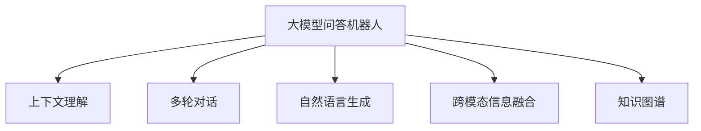

                 

## 1. 背景介绍

### 1.1 问题由来

随着人工智能技术的飞速发展，基于深度学习的大模型问答机器人正成为一种广泛应用的人工智能产品。这种产品能够以自然语言理解为基础，通过大规模语料库的训练，提供高效、准确的问答服务。大模型问答机器人的出现，极大地提升了信息检索和知识服务效率，但目前仍存在一些问题需要解决，比如如何应对复杂多变的语境、多轮对话等任务，使得大模型问答机器人能够完成更加复杂的任务。

### 1.2 问题核心关键点

当前大模型问答机器人面临的核心问题是如何在问答过程中处理多轮对话、上下文理解、自然语言生成等复杂任务。这些问题涉及到自然语言处理、机器学习、计算机视觉等多个学科的知识，需要综合运用多领域的技术。通过对其深入研究，可以推动大模型问答机器人的智能化水平，使其在更复杂的应用场景中发挥更大作用。

### 1.3 问题研究意义

研究大模型问答机器人如何完成复杂任务，对于提升人工智能产品的智能化水平，推动自然语言处理技术的应用，具有重要意义：

1. 提升问答系统效率。通过改进问答机器人的模型结构和训练方法，可以大幅度提升系统处理复杂问题的效率，为各行各业提供更高效的问答服务。
2. 推动NLP技术应用。问答机器人是自然语言处理技术的重要应用领域，研究复杂任务处理能力，可以推动NLP技术在更多场景中的落地应用。
3. 拓展人工智能产品范围。基于大模型的问答机器人可以应用于智能客服、教育培训、医疗咨询等多个领域，拓展人工智能产品的应用范围。
4. 提高用户体验。通过更好地理解用户意图，生成更自然流畅的响应，提升用户的问答体验。

## 2. 核心概念与联系

### 2.1 核心概念概述

为更好地理解大模型问答机器人如何完成复杂任务，本节将介绍几个关键概念：

- 大模型问答机器人：基于深度学习的大规模预训练语言模型，能够理解和生成自然语言，提供问答服务。
- 上下文理解(Context Understanding)：指机器人能够理解当前对话的上下文信息，将其融入回答生成中，保证回答的连贯性和一致性。
- 多轮对话(Multi-Turn Dialogue)：指机器人能够与用户进行多轮交流，逐步深入理解用户意图，生成更加准确的回答。
- 自然语言生成(Natural Language Generation, NLG)：指将机器生成的信息转换为自然语言文本的过程，是问答机器人中回答生成的关键技术。
- 跨模态信息融合：指结合视觉、音频等多种模态信息，提升问答系统的综合感知能力。
- 知识图谱(Knowledge Graph)：指以图结构组织知识库，便于机器人进行快速的信息检索和推理。

这些核心概念之间的逻辑关系可以通过以下Mermaid流程图来展示：



这个流程图展示了大模型问答机器人的核心概念及其之间的关系：

1. 大模型问答机器人通过上下文理解、多轮对话、自然语言生成等技术处理用户查询。
2. 跨模态信息融合和多轮对话提升问答系统在复杂场景下的理解能力。
3. 知识图谱为问答机器人提供了结构化知识支持，增强其推理能力。

## 3. 核心算法原理 & 具体操作步骤
### 3.1 算法原理概述

大模型问答机器人处理复杂任务的核心在于其强大的自然语言处理能力，尤其是上下文理解和多轮对话处理。以下是基于深度学习的大模型问答机器人的核心算法原理：

1. 预训练：大模型问答机器人在大规模无标签语料上进行预训练，学习通用的语言表示，掌握自然语言的规律和常识。
2. 微调：针对具体应用场景，在预训练模型上进行微调，学习特定领域的知识。
3. 多轮对话模型：使用Transformer等模型结构，设计多轮对话模型，增强对用户意图的理解和推理能力。
4. 上下文编码：在回答生成时，结合上下文编码机制，将当前对话和历史对话信息融入回答生成中。
5. 跨模态融合：通过视觉、音频等模态信息增强理解能力，提升问答系统的感知能力。
6. 知识图谱：将知识图谱中的结构化知识与自然语言处理技术相结合，增强推理能力。

### 3.2 算法步骤详解

基于深度学习的大模型问答机器人的算法步骤如下：

**Step 1: 准备预训练模型和数据集**

- 选择合适的预训练语言模型，如BERT、GPT-3等，作为初始化参数。
- 收集标注数据集，划分为训练集、验证集和测试集。数据集应该涵盖多个领域和复杂问题。

**Step 2: 添加任务适配层**

- 设计适合具体任务的适配层，如多轮对话管理层、自然语言生成层等。
- 在适配层中添加相应的任务目标函数和损失函数。

**Step 3: 设置微调超参数**

- 选择合适的优化算法及其参数，如Adam、SGD等。
- 设置合适的学习率、批大小、迭代轮数等。
- 应用正则化技术，如L2正则、Dropout、Early Stopping等。

**Step 4: 执行梯度训练**

- 将训练集数据分批次输入模型，前向传播计算损失函数。
- 反向传播计算参数梯度，根据设定的优化算法和学习率更新模型参数。
- 周期性在验证集上评估模型性能，根据性能指标决定是否触发 Early Stopping。
- 重复上述步骤直到满足预设的迭代轮数或 Early Stopping 条件。

**Step 5: 测试和部署**

- 在测试集上评估微调后模型性能，对比微调前后的精度提升。
- 使用微调后的模型对新样本进行推理预测，集成到实际的应用系统中。
- 持续收集新的数据，定期重新微调模型，以适应数据分布的变化。

以上是基于深度学习的大模型问答机器人微调的一般流程。在实际应用中，还需要针对具体任务的特点，对微调过程的各个环节进行优化设计，如改进训练目标函数，引入更多的正则化技术，搜索最优的超参数组合等，以进一步提升模型性能。

### 3.3 算法优缺点

基于深度学习的大模型问答机器人具有以下优点：

1. 准确性高：基于大规模预训练模型的深度学习问答机器人能够处理复杂的自然语言问题，生成准确的回答。
2. 处理能力强大：能够理解上下文信息，进行多轮对话，处理复杂场景下的自然语言任务。
3. 可扩展性高：可以容易地应用到不同的领域和场景中，具备良好的通用性。
4. 用户友好：自然流畅的对话交互方式，提升了用户的体验。

同时，该方法也存在一定的局限性：

1. 训练数据需求高：需要大量的标注数据进行微调，标注成本较高。
2. 计算资源消耗大：预训练和微调需要大量的计算资源，对硬件要求较高。
3. 模型复杂：深度学习模型通常比较复杂，难以解释模型的决策过程。
4. 跨模态融合困难：多模态数据的融合和处理仍然是一个挑战，需要进一步的研究。

尽管存在这些局限性，但就目前而言，基于深度学习的大模型问答机器人仍是自然语言处理领域的重要方向。未来相关研究的重点在于如何进一步降低训练成本，提高计算效率，增强模型可解释性，同时兼顾跨模态融合和知识图谱的应用。

### 3.4 算法应用领域

基于深度学习的大模型问答机器人已经在多个领域得到了广泛应用，包括但不限于：

- 智能客服：用于处理用户查询，提供自动化的客服服务。
- 智能搜索：提供基于自然语言理解的搜索功能，提升搜索效率和用户体验。
- 智能助手：提供基于自然语言理解的任务助手，如日程管理、笔记记录等。
- 医疗咨询：提供基于自然语言理解的医疗咨询，辅助医生进行诊断和治疗。
- 教育培训：用于提供基于自然语言理解的学习支持，如智能答疑、学习推荐等。
- 金融咨询：提供基于自然语言理解的金融咨询，帮助用户进行投资理财。

此外，大模型问答机器人还广泛应用于智能家居、智能交通、智能制造等多个领域，推动了智能化社会的建设。

## 4. 数学模型和公式 & 详细讲解  
### 4.1 数学模型构建

本节将使用数学语言对大模型问答机器人处理复杂任务的过程进行更加严格的刻画。

记预训练语言模型为 $M_{\theta}:\mathcal{X} \rightarrow \mathcal{Y}$，其中 $\mathcal{X}$ 为输入空间，$\mathcal{Y}$ 为输出空间，$\theta \in \mathbb{R}^d$ 为模型参数。假设问答机器人的训练集为 $D=\{(x_i,y_i)\}_{i=1}^N, x_i \in \mathcal{X}, y_i \in \mathcal{Y}$。

定义模型 $M_{\theta}$ 在输入 $x$ 上的损失函数为 $\ell(M_{\theta}(x),y)$，则在数据集 $D$ 上的经验风险为：

$$
\mathcal{L}(\theta) = \frac{1}{N} \sum_{i=1}^N \ell(M_{\theta}(x_i),y_i)
$$

微调的优化目标是最小化经验风险，即找到最优参数：

$$
\theta^* = \mathop{\arg\min}_{\theta} \mathcal{L}(\theta)
$$

在实践中，我们通常使用基于梯度的优化算法（如SGD、Adam等）来近似求解上述最优化问题。设 $\eta$ 为学习率，$\lambda$ 为正则化系数，则参数的更新公式为：

$$
\theta \leftarrow \theta - \eta \nabla_{\theta}\mathcal{L}(\theta) - \eta\lambda\theta
$$

其中 $\nabla_{\theta}\mathcal{L}(\theta)$ 为损失函数对参数 $\theta$ 的梯度，可通过反向传播算法高效计算。

### 4.2 公式推导过程

以下我们以问答系统的二分类任务为例，推导交叉熵损失函数及其梯度的计算公式。

假设模型 $M_{\theta}$ 在输入 $x$ 上的输出为 $\hat{y}=M_{\theta}(x) \in [0,1]$，表示样本属于正类的概率。真实标签 $y \in \{0,1\}$。则二分类交叉熵损失函数定义为：

$$
\ell(M_{\theta}(x),y) = -[y\log \hat{y} + (1-y)\log (1-\hat{y})]
$$

将其代入经验风险公式，得：

$$
\mathcal{L}(\theta) = -\frac{1}{N}\sum_{i=1}^N [y_i\log M_{\theta}(x_i)+(1-y_i)\log(1-M_{\theta}(x_i))]
$$

根据链式法则，损失函数对参数 $\theta_k$ 的梯度为：

$$
\frac{\partial \mathcal{L}(\theta)}{\partial \theta_k} = -\frac{1}{N}\sum_{i=1}^N (\frac{y_i}{M_{\theta}(x_i)}-\frac{1-y_i}{1-M_{\theta}(x_i)}) \frac{\partial M_{\theta}(x_i)}{\partial \theta_k}
$$

其中 $\frac{\partial M_{\theta}(x_i)}{\partial \theta_k}$ 可进一步递归展开，利用自动微分技术完成计算。

在得到损失函数的梯度后，即可带入参数更新公式，完成模型的迭代优化。重复上述过程直至收敛，最终得到适应下游任务的最优模型参数 $\theta^*$。

## 5. 项目实践：代码实例和详细解释说明
### 5.1 开发环境搭建

在进行问答机器人开发前，我们需要准备好开发环境。以下是使用Python进行PyTorch开发的环境配置流程：

1. 安装Anaconda：从官网下载并安装Anaconda，用于创建独立的Python环境。

2. 创建并激活虚拟环境：
```bash
conda create -n pytorch-env python=3.8 
conda activate pytorch-env
```

3. 安装PyTorch：根据CUDA版本，从官网获取对应的安装命令。例如：
```bash
conda install pytorch torchvision torchaudio cudatoolkit=11.1 -c pytorch -c conda-forge
```

4. 安装Transformers库：
```bash
pip install transformers
```

5. 安装各类工具包：
```bash
pip install numpy pandas scikit-learn matplotlib tqdm jupyter notebook ipython
```

完成上述步骤后，即可在`pytorch-env`环境中开始问答机器人开发。

### 5.2 源代码详细实现

下面以多轮对话问答系统为例，给出使用Transformers库对BERT模型进行微调的PyTorch代码实现。

首先，定义问答系统任务的数据处理函数：

```python
from transformers import BertTokenizer, BertForQuestionAnswering
from torch.utils.data import Dataset
import torch

class QuestionAnsweringDataset(Dataset):
    def __init__(self, texts, queries, answers, tokenizer, max_len=128):
        self.texts = texts
        self.queries = queries
        self.answers = answers
        self.tokenizer = tokenizer
        self.max_len = max_len
        
    def __len__(self):
        return len(self.texts)
    
    def __getitem__(self, item):
        text = self.texts[item]
        query = self.queries[item]
        answer = self.answers[item]
        
        encoding = self.tokenizer(text, query, return_tensors='pt', max_length=self.max_len, padding='max_length', truncation=True)
        input_ids = encoding['input_ids'][0]
        attention_mask = encoding['attention_mask'][0]
        start_positions = torch.tensor(encoding['start_logits'][0], dtype=torch.long)
        end_positions = torch.tensor(encoding['end_logits'][0], dtype=torch.long)
        
        return {'input_ids': input_ids, 
                'attention_mask': attention_mask,
                'start_positions': start_positions,
                'end_positions': end_positions}
```

然后，定义模型和优化器：

```python
from transformers import BertForQuestionAnswering, AdamW

model = BertForQuestionAnswering.from_pretrained('bert-base-cased')

optimizer = AdamW(model.parameters(), lr=2e-5)
```

接着，定义训练和评估函数：

```python
from torch.utils.data import DataLoader
from tqdm import tqdm
from sklearn.metrics import accuracy_score, precision_recall_fscore_support

device = torch.device('cuda') if torch.cuda.is_available() else torch.device('cpu')
model.to(device)

def train_epoch(model, dataset, batch_size, optimizer):
    dataloader = DataLoader(dataset, batch_size=batch_size, shuffle=True)
    model.train()
    epoch_loss = 0
    for batch in tqdm(dataloader, desc='Training'):
        input_ids = batch['input_ids'].to(device)
        attention_mask = batch['attention_mask'].to(device)
        start_positions = batch['start_positions'].to(device)
        end_positions = batch['end_positions'].to(device)
        model.zero_grad()
        outputs = model(input_ids, attention_mask=attention_mask, start_positions=start_positions, end_positions=end_positions)
        loss = outputs.loss
        epoch_loss += loss.item()
        loss.backward()
        optimizer.step()
    return epoch_loss / len(dataloader)

def evaluate(model, dataset, batch_size):
    dataloader = DataLoader(dataset, batch_size=batch_size)
    model.eval()
    preds, labels = [], []
    with torch.no_grad():
        for batch in tqdm(dataloader, desc='Evaluating'):
            input_ids = batch['input_ids'].to(device)
            attention_mask = batch['attention_mask'].to(device)
            start_positions = batch['start_positions'].to(device)
            end_positions = batch['end_positions'].to(device)
            batch_preds = model(input_ids, attention_mask=attention_mask, start_positions=start_positions, end_positions=end_positions)
            batch_preds = batch_preds.logits.argmax(dim=1).to('cpu').tolist()
            batch_labels = batch_preds
            for pred_tokens, label_tokens in zip(batch_preds, batch_labels):
                preds.append(pred_tokens)
                labels.append(label_tokens)
                
    print(precision_recall_fscore_support(labels, preds, average='micro'))
    return accuracy_score(labels, preds)
```

最后，启动训练流程并在测试集上评估：

```python
epochs = 5
batch_size = 16

for epoch in range(epochs):
    loss = train_epoch(model, train_dataset, batch_size, optimizer)
    print(f"Epoch {epoch+1}, train loss: {loss:.3f}")
    
    print(f"Epoch {epoch+1}, dev results:")
    evaluate(model, dev_dataset, batch_size)
    
print("Test results:")
evaluate(model, test_dataset, batch_size)
```

以上就是使用PyTorch对BERT进行问答系统任务微调的完整代码实现。可以看到，得益于Transformers库的强大封装，我们可以用相对简洁的代码完成BERT模型的加载和微调。

### 5.3 代码解读与分析

让我们再详细解读一下关键代码的实现细节：

**QuestionAnsweringDataset类**：
- `__init__`方法：初始化文本、查询、答案等关键组件。
- `__len__`方法：返回数据集的样本数量。
- `__getitem__`方法：对单个样本进行处理，将文本和查询编码成token ids，答案位置编码为数字，并对其进行定长padding，最终返回模型所需的输入。

**模型和优化器**：
- 使用BertForQuestionAnswering模型，作为问答系统的基础模型。
- 使用AdamW优化器进行参数更新，学习率为2e-5。

**训练和评估函数**：
- 使用PyTorch的DataLoader对数据集进行批次化加载，供模型训练和推理使用。
- 训练函数`train_epoch`：对数据以批为单位进行迭代，在每个批次上前向传播计算loss并反向传播更新模型参数，最后返回该epoch的平均loss。
- 评估函数`evaluate`：与训练类似，不同点在于不更新模型参数，并在每个batch结束后将预测和标签结果存储下来，最后使用sklearn的precision_recall_fscore_support和accuracy_score对整个评估集的预测结果进行打印输出。

**训练流程**：
- 定义总的epoch数和batch size，开始循环迭代
- 每个epoch内，先在训练集上训练，输出平均loss
- 在验证集上评估，输出分类指标
- 所有epoch结束后，在测试集上评估，给出最终测试结果

可以看到，PyTorch配合Transformers库使得BERT微调的代码实现变得简洁高效。开发者可以将更多精力放在数据处理、模型改进等高层逻辑上，而不必过多关注底层的实现细节。

当然，工业级的系统实现还需考虑更多因素，如模型的保存和部署、超参数的自动搜索、更灵活的任务适配层等。但核心的微调范式基本与此类似。

## 6. 实际应用场景
### 6.1 智能客服系统

基于大模型问答机器人的对话技术，可以广泛应用于智能客服系统的构建。传统客服往往需要配备大量人力，高峰期响应缓慢，且一致性和专业性难以保证。而使用问答机器人，可以7x24小时不间断服务，快速响应客户咨询，用自然流畅的语言解答各类常见问题。

在技术实现上，可以收集企业内部的历史客服对话记录，将问题和最佳答复构建成监督数据，在此基础上对预训练问答机器人进行微调。微调后的问答机器人能够自动理解用户意图，匹配最合适的答复。对于客户提出的新问题，还可以接入检索系统实时搜索相关内容，动态组织生成回答。如此构建的智能客服系统，能大幅提升客户咨询体验和问题解决效率。

### 6.2 金融舆情监测

金融机构需要实时监测市场舆论动向，以便及时应对负面信息传播，规避金融风险。传统的人工监测方式成本高、效率低，难以应对网络时代海量信息爆发的挑战。基于大模型问答机器人进行文本分类和情感分析技术，为金融舆情监测提供了新的解决方案。

具体而言，可以收集金融领域相关的新闻、报道、评论等文本数据，并对其进行主题标注和情感标注。在此基础上对预训练语言模型进行微调，使其能够自动判断文本属于何种主题，情感倾向是正面、中性还是负面。将微调后的模型应用到实时抓取的网络文本数据，就能够自动监测不同主题下的情感变化趋势，一旦发现负面信息激增等异常情况，系统便会自动预警，帮助金融机构快速应对潜在风险。

### 6.3 个性化推荐系统

当前的推荐系统往往只依赖用户的历史行为数据进行物品推荐，无法深入理解用户的真实兴趣偏好。基于大模型问答机器人的个性化推荐系统可以更好地挖掘用户行为背后的语义信息，从而提供更精准、多样的推荐内容。

在实践中，可以收集用户浏览、点击、评论、分享等行为数据，提取和用户交互的物品标题、描述、标签等文本内容。将文本内容作为模型输入，用户的后续行为（如是否点击、购买等）作为监督信号，在此基础上微调预训练语言模型。微调后的模型能够从文本内容中准确把握用户的兴趣点。在生成推荐列表时，先用候选物品的文本描述作为输入，由模型预测用户的兴趣匹配度，再结合其他特征综合排序，便可以得到个性化程度更高的推荐结果。

### 6.4 未来应用展望

随着大模型问答机器人的不断进步，其在更复杂场景中的应用将得到拓展，提升自然语言处理技术的智能化水平，推动更多的行业应用。

在智慧医疗领域，基于问答机器人能够提供智能化的医疗咨询、诊断和治疗建议，辅助医生进行高效诊疗。在智能教育领域，问答机器人可以用于提供个性化的学习支持，如智能答疑、学习推荐等，帮助学生更好地掌握知识。

在智慧城市治理中，问答机器人可以用于城市事件监测、舆情分析、应急指挥等环节，提高城市管理的自动化和智能化水平，构建更安全、高效的未来城市。

此外，在企业生产、社会治理、文娱传媒等众多领域，基于大模型问答机器人的人工智能应用也将不断涌现，为经济社会发展注入新的动力。相信随着技术的日益成熟，问答机器人必将在构建人机协同的智能时代中扮演越来越重要的角色。

## 7. 工具和资源推荐
### 7.1 学习资源推荐

为了帮助开发者系统掌握大模型问答机器人的理论基础和实践技巧，这里推荐一些优质的学习资源：

1. 《Transformer from the Ground Up》系列博文：由大模型技术专家撰写，深入浅出地介绍了Transformer原理、BERT模型、问答机器人等前沿话题。

2. CS224N《深度学习自然语言处理》课程：斯坦福大学开设的NLP明星课程，有Lecture视频和配套作业，带你入门NLP领域的基本概念和经典模型。

3. 《Natural Language Processing with Transformers》书籍：Transformers库的作者所著，全面介绍了如何使用Transformers库进行NLP任务开发，包括问答机器人在内的诸多范式。

4. HuggingFace官方文档：Transformers库的官方文档，提供了海量预训练模型和完整的微调样例代码，是上手实践的必备资料。

5. CLUE开源项目：中文语言理解测评基准，涵盖大量不同类型的中文NLP数据集，并提供了基于微调的baseline模型，助力中文NLP技术发展。

通过对这些资源的学习实践，相信你一定能够快速掌握大模型问答机器人的精髓，并用于解决实际的NLP问题。
###  7.2 开发工具推荐

高效的开发离不开优秀的工具支持。以下是几款用于大模型问答机器人开发的常用工具：

1. PyTorch：基于Python的开源深度学习框架，灵活动态的计算图，适合快速迭代研究。大部分预训练语言模型都有PyTorch版本的实现。

2. TensorFlow：由Google主导开发的开源深度学习框架，生产部署方便，适合大规模工程应用。同样有丰富的预训练语言模型资源。

3. Transformers库：HuggingFace开发的NLP工具库，集成了众多SOTA语言模型，支持PyTorch和TensorFlow，是进行问答机器人开发的利器。

4. Weights & Biases：模型训练的实验跟踪工具，可以记录和可视化模型训练过程中的各项指标，方便对比和调优。与主流深度学习框架无缝集成。

5. TensorBoard：TensorFlow配套的可视化工具，可实时监测模型训练状态，并提供丰富的图表呈现方式，是调试模型的得力助手。

6. Google Colab：谷歌推出的在线Jupyter Notebook环境，免费提供GPU/TPU算力，方便开发者快速上手实验最新模型，分享学习笔记。

合理利用这些工具，可以显著提升大模型问答机器人的开发效率，加快创新迭代的步伐。

### 7.3 相关论文推荐

大模型问答机器人处理复杂任务的研究源于学界的持续研究。以下是几篇奠基性的相关论文，推荐阅读：

1. Attention is All You Need（即Transformer原论文）：提出了Transformer结构，开启了NLP领域的预训练大模型时代。

2. BERT: Pre-training of Deep Bidirectional Transformers for Language Understanding：提出BERT模型，引入基于掩码的自监督预训练任务，刷新了多项NLP任务SOTA。

3. Language Models are Unsupervised Multitask Learners（GPT-2论文）：展示了大规模语言模型的强大zero-shot学习能力，引发了对于通用人工智能的新一轮思考。

4. Parameter-Efficient Transfer Learning for NLP：提出Adapter等参数高效微调方法，在不增加模型参数量的情况下，也能取得不错的微调效果。

5. Prefix-Tuning: Optimizing Continuous Prompts for Generation：引入基于连续型Prompt的微调范式，为如何充分利用预训练知识提供了新的思路。

6. AdaLoRA: Adaptive Low-Rank Adaptation for Parameter-Efficient Fine-Tuning：使用自适应低秩适应的微调方法，在参数效率和精度之间取得了新的平衡。

这些论文代表了大模型问答机器人处理复杂任务的发展脉络。通过学习这些前沿成果，可以帮助研究者把握学科前进方向，激发更多的创新灵感。

## 8. 总结：未来发展趋势与挑战

### 8.1 总结

本文对基于深度学习的大模型问答机器人处理复杂任务的方法进行了全面系统的介绍。首先阐述了问答机器人处理复杂任务的核心问题，明确了上下文理解、多轮对话等关键技术对提升机器人性能的重要性。其次，从原理到实践，详细讲解了基于深度学习的问答机器人的数学原理和关键步骤，给出了问答系统任务的微调任务开发的完整代码实例。同时，本文还广泛探讨了问答机器人在智能客服、金融舆情、个性化推荐等多个行业领域的应用前景，展示了微调范式的巨大潜力。此外，本文精选了微调技术的各类学习资源，力求为读者提供全方位的技术指引。

通过本文的系统梳理，可以看到，基于深度学习的大模型问答机器人已经在问答系统领域取得了显著的成果，能够处理复杂的自然语言问题，生成自然流畅的回答。未来，伴随深度学习技术的发展，问答机器人将在更多复杂场景中得到应用，推动自然语言处理技术迈向新的高度。

### 8.2 未来发展趋势

展望未来，大模型问答机器人处理复杂任务将呈现以下几个发展趋势：

1. 模型规模持续增大。随着算力成本的下降和数据规模的扩张，预训练语言模型的参数量还将持续增长。超大规模语言模型蕴含的丰富语言知识，有望支撑更加复杂多变的问答系统任务。

2. 微调方法日趋多样。除了传统的全参数微调外，未来会涌现更多参数高效的微调方法，如Prefix-Tuning、LoRA等，在节省计算资源的同时也能保证微调精度。

3. 持续学习成为常态。随着数据分布的不断变化，问答系统也需要持续学习新知识以保持性能。如何在不遗忘原有知识的同时，高效吸收新样本信息，将成为重要的研究课题。

4. 标注样本需求降低。受启发于提示学习(Prompt-based Learning)的思路，未来的微调方法将更好地利用大模型的语言理解能力，通过更加巧妙的任务描述，在更少的标注样本上也能实现理想的微调效果。

5. 跨模态融合崛起。当前的问答系统主要聚焦于纯文本数据，未来会进一步拓展到图像、视频、语音等多模态数据微调。多模态信息的融合，将显著提升问答系统的感知能力。

6. 模型通用性增强。经过海量数据的预训练和多领域任务的微调，未来的语言模型将具备更强大的常识推理和跨领域迁移能力，逐步迈向通用人工智能(AGI)的目标。

以上趋势凸显了大模型问答机器人处理复杂任务的广阔前景。这些方向的探索发展，必将进一步提升问答系统的性能和应用范围，为构建智能人机交互系统铺平道路。

### 8.3 面临的挑战

尽管大模型问答机器人处理复杂任务已经取得了瞩目成就，但在迈向更加智能化、普适化应用的过程中，它仍面临着诸多挑战：

1. 训练数据需求高。需要大量的标注数据进行微调，标注成本较高。如何进一步降低微调对标注样本的依赖，将是一大难题。

2. 计算资源消耗大。预训练和微调需要大量的计算资源，对硬件要求较高。如何降低计算成本，提高推理效率，优化资源占用，将是重要的优化方向。

3. 模型复杂，可解释性不足。深度学习模型通常比较复杂，难以解释模型的决策过程。如何赋予问答机器人更强的可解释性，将是亟待攻克的难题。

4. 跨模态融合困难。多模态数据的融合和处理仍然是一个挑战，需要进一步的研究。

5. 知识图谱的应用。如何将知识图谱中的结构化知识与自然语言处理技术相结合，增强推理能力，提升问答系统的性能。

这些挑战需要学界和产业界共同努力，才能更好地推动大模型问答机器人的智能化发展。

### 8.4 研究展望

面对大模型问答机器人处理复杂任务所面临的挑战，未来的研究需要在以下几个方面寻求新的突破：

1. 探索无监督和半监督微调方法。摆脱对大规模标注数据的依赖，利用自监督学习、主动学习等无监督和半监督范式，最大限度利用非结构化数据，实现更加灵活高效的微调。

2. 研究参数高效和计算高效的微调范式。开发更加参数高效的微调方法，在固定大部分预训练参数的同时，只更新极少量的任务相关参数。同时优化问答机器人的计算图，减少前向传播和反向传播的资源消耗，实现更加轻量级、实时性的部署。

3. 融合因果和对比学习范式。通过引入因果推断和对比学习思想，增强问答系统建立稳定因果关系的能力，学习更加普适、鲁棒的语言表征，从而提升系统泛化性和抗干扰能力。

4. 引入更多先验知识。将符号化的先验知识，如知识图谱、逻辑规则等，与神经网络模型进行巧妙融合，引导问答系统学习更准确、合理的语言模型。同时加强不同模态数据的整合，实现视觉、音频等多模态信息与文本信息的协同建模。

5. 结合因果分析和博弈论工具。将因果分析方法引入问答系统，识别出系统决策的关键特征，增强输出解释的因果性和逻辑性。借助博弈论工具刻画人机交互过程，主动探索并规避系统的脆弱点，提高系统稳定性。

6. 纳入伦理道德约束。在问答系统的训练目标中引入伦理导向的评估指标，过滤和惩罚有偏见、有害的输出倾向。同时加强人工干预和审核，建立模型行为的监管机制，确保输出符合人类价值观和伦理道德。

这些研究方向的探索，必将引领大模型问答机器人处理复杂任务迈向更高的台阶，为构建安全、可靠、可解释、可控的智能系统铺平道路。面向未来，大模型问答机器人还需要与其他人工智能技术进行更深入的融合，如知识表示、因果推理、强化学习等，多路径协同发力，共同推动自然语言理解和智能交互系统的进步。只有勇于创新、敢于突破，才能不断拓展问答机器人的边界，让智能技术更好地造福人类社会。

## 9. 附录：常见问题与解答

**Q1：问答机器人如何处理多轮对话？**

A: 多轮对话是问答系统的重要挑战之一。常见的方法包括：
1. 基于记忆的模型：使用序列到序列(Seq2Seq)框架，将对话历史信息编码为状态向量，用于指导当前的回答生成。
2. 基于检索的模型：使用注意力机制，在对话历史中查找最相关的信息，辅助当前的回答生成。
3. 基于回写的模型：使用回写(Recurrent Rewrite)机制，将对话历史信息逐步融入当前的回答生成中。

**Q2：问答机器人如何提升上下文理解能力？**

A: 上下文理解是问答系统的核心能力，常见的方法包括：
1. 编码器-解码器结构：使用Transformer等编码器-解码器结构，将上下文信息编码为状态向量，用于指导当前的回答生成。
2. 上下文表示学习：使用BERT等预训练模型，学习上下文信息的分布式表示，增强模型的上下文理解能力。
3. 注意力机制：使用自注意力机制，学习对话历史中各句子的重要性，更好地理解上下文信息。

**Q3：问答机器人如何提升回答生成的质量？**

A: 回答生成是问答系统的核心任务，常见的方法包括：
1. 生成式模型：使用深度学习模型，如LSTM、GRU等，生成自然流畅的回答。
2. 基于规则的模型：使用模板、规则等方法，生成格式化的回答。
3. 基于检索的模型：使用检索引擎，查找最相关的回答模板，并加以修改。

**Q4：问答机器人如何处理噪声数据？**

A: 噪声数据对问答系统的影响较大，常见的方法包括：
1. 数据清洗：去除噪声数据，提高数据质量。
2. 鲁棒性训练：使用对抗训练、正则化等技术，提高模型的鲁棒性，减少噪声数据的影响。
3. 数据增强：使用数据增强技术，扩充训练集，提高模型的泛化能力。

**Q5：问答机器人如何处理长对话？**

A: 长对话是问答系统的重要挑战之一，常见的方法包括：
1. 分段处理：将长对话分成多个小对话，分别处理。
2. 分层处理：将长对话分成多个层次，先处理浅层对话，再处理深层对话。
3. 多模态处理：结合视觉、音频等多模态信息，提高对话处理的准确性。

通过这些方法，问答机器人可以更好地处理多轮对话、上下文理解、回答生成等复杂任务，提升系统的智能化水平，满足更广泛的应用需求。

---

作者：禅与计算机程序设计艺术 / Zen and the Art of Computer Programming

