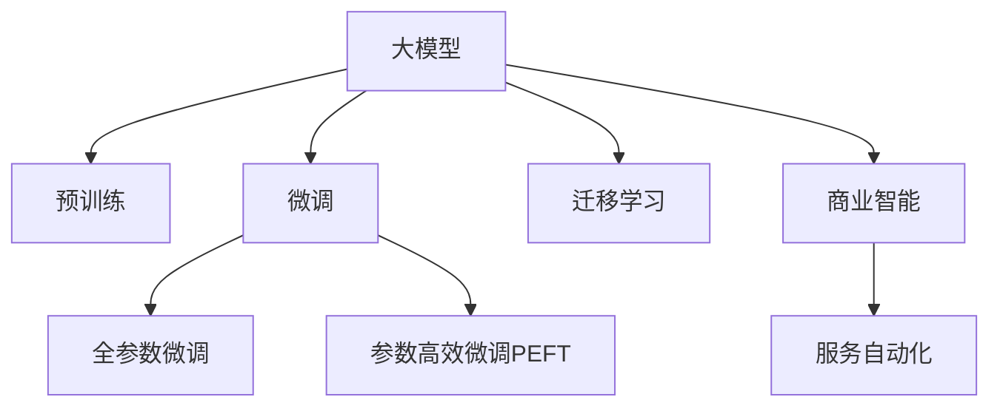

                 

# 大模型：未来商业的新引擎

> 关键词：大模型,商业应用,深度学习,人工智能,数据智能

## 1. 背景介绍

### 1.1 问题由来
近年来，随着深度学习技术和大数据资源的广泛应用，人工智能(AI)领域取得了突破性的进展。尤其是在计算机视觉、自然语言处理(NLP)、语音识别等方向，基于大模型的AI技术正不断刷新着各种任务的表现上限。例如，OpenAI的GPT-3模型，通过超大规模语料库进行预训练，已经在文本生成、情感分析、问答系统等众多NLP任务中取得了令人瞩目的成果。

然而，尽管大模型在学术领域表现出色，但在实际商业应用中，却面临诸多挑战。主要问题包括：模型复杂度高、计算资源需求大、部署成本高、泛化能力不足等。这些问题限制了AI技术在企业级场景中的广泛应用，阻碍了AI商业化进程。为此，本文将探讨如何利用大模型在商业领域的创新应用，以及相关技术和策略，以期为AI技术的广泛落地提供思路和参考。

### 1.2 问题核心关键点
本文将聚焦于大模型在商业领域的创新应用，具体包括以下几个核心关键点：

- **大模型的商业应用价值**：探讨大模型如何通过智能决策、数据洞察、服务自动化等方式，提升企业运营效率、降低成本、增强竞争力。
- **模型泛化能力提升**：研究如何通过迁移学习、微调、联邦学习等技术，提高模型在不同业务场景中的泛化能力。
- **模型部署与优化**：探讨模型压缩、分布式训练、边端推理等技术，降低模型部署成本，优化模型性能。
- **商业应用实例**：通过具体案例分析，展示大模型在不同商业场景中的应用效果和创新点。

## 2. 核心概念与联系

### 2.1 核心概念概述

为更好地理解大模型在商业领域的创新应用，本节将介绍几个密切相关的核心概念：

- **大模型**：以自回归(如GPT)或自编码(如BERT)模型为代表的大规模预训练语言模型。通过在大规模无标签文本语料上进行预训练，学习通用的语言表示，具备强大的语言理解和生成能力。

- **迁移学习**：指将一个领域学习到的知识，迁移应用到另一个不同但相关的领域的学习范式。大模型的预训练-微调过程即是一种典型的迁移学习方式。

- **微调(Fine-tuning)**：指在预训练模型的基础上，使用下游任务的少量标注数据，通过有监督学习优化模型在特定任务上的性能。通常只需要调整顶层分类器或解码器，并以较小的学习率更新全部或部分的模型参数。

- **商业智能(BI)**：利用AI技术进行数据分析、预测和决策支持，帮助企业优化运营、提高效率、发现商机。大模型在商业智能中扮演着重要的角色。

- **深度学习**：一种基于神经网络的机器学习范式，通过多层次的非线性映射，处理高维数据，揭示数据中的内在结构。

- **数据智能**：通过AI技术从海量数据中提取有价值的信息，支持业务决策和创新。大模型提供了强大的数据智能能力。

- **服务自动化**：利用AI技术自动执行重复性、耗时的业务任务，提升服务效率和客户满意度。大模型在服务自动化中具有广泛应用前景。

这些核心概念之间的逻辑关系可以通过以下Mermaid流程图来展示：



这个流程图展示了大模型的核心概念及其之间的关系：

1. 大模型通过预训练获得基础能力。
2. 微调是对预训练模型进行任务特定的优化，可以分为全参数微调和参数高效微调（PEFT）。
3. 迁移学习是连接预训练模型与商业智能的桥梁，可以通过微调或迁移学习实现。
4. 商业智能利用大模型的语言理解能力，进行数据分析、预测和决策支持。
5. 服务自动化利用大模型的自动化能力，提升服务效率和客户满意度。

## 3. 核心算法原理 & 具体操作步骤
### 3.1 算法原理概述

大模型在商业领域的应用，本质上是将深度学习与商业场景紧密结合，利用模型强大的数据分析和决策支持能力，辅助企业实现智能化转型。核心思想是：将大模型视作一种强大的"智能助手"，通过微调或迁移学习，使其在特定商业任务上表现出卓越的性能。

具体来说，大模型在商业智能中的作用主要体现在以下几个方面：

- **数据洞察**：通过分析海量文本数据，挖掘出隐含的商业信息和趋势，为决策提供支持。
- **智能决策**：利用大模型的预测能力，自动化处理复杂业务决策，如信用评估、市场预测等。
- **服务自动化**：通过自动生成文本、语音等，提高服务效率，增强客户体验。

大模型在服务自动化中的应用，如图书馆智能客服、在线客服、自动生成报告等，已成为许多企业的创新方向。通过微调或迁移学习，大模型可以适应特定场景的需求，自动生成符合规范的文本内容，从而大大提升自动化服务的质量和效率。

### 3.2 算法步骤详解

基于大模型的商业应用，通常包括以下几个关键步骤：

**Step 1: 收集并准备数据集**
- 收集与特定商业任务相关的文本数据，如客户反馈、交易记录、市场报告等。
- 对数据进行清洗、标注，确保数据质量和一致性。

**Step 2: 选择并加载模型**
- 选择合适的预训练大模型，如BERT、GPT等。
- 加载模型到开发环境，准备微调。

**Step 3: 添加任务适配层**
- 根据商业任务类型，在预训练模型顶层设计合适的输出层和损失函数。
- 对于分类任务，通常在顶层添加线性分类器和交叉熵损失函数。
- 对于生成任务，通常使用语言模型的解码器输出概率分布，并以负对数似然为损失函数。

**Step 4: 设置微调超参数**
- 选择合适的优化算法及其参数，如 AdamW、SGD 等，设置学习率、批大小、迭代轮数等。
- 设置正则化技术及强度，包括权重衰减、Dropout、Early Stopping 等。
- 确定冻结预训练参数的策略，如仅微调顶层，或全部参数都参与微调。

**Step 5: 执行梯度训练**
- 将训练集数据分批次输入模型，前向传播计算损失函数。
- 反向传播计算参数梯度，根据设定的优化算法和学习率更新模型参数。
- 周期性在验证集上评估模型性能，根据性能指标决定是否触发 Early Stopping。
- 重复上述步骤直到满足预设的迭代轮数或 Early Stopping 条件。

**Step 6: 部署与监控**
- 将微调后的模型部署到生产环境。
- 实时监控模型性能，收集反馈数据，定期重新微调模型，以适应数据分布的变化。

### 3.3 算法优缺点

基于大模型的商业应用，具有以下优点：

- **提升效率**：利用大模型的自动化能力，快速处理大量数据，提升服务效率。
- **降低成本**：避免人工处理的成本和时间，特别是对于重复性高的任务，效果显著。
- **增强灵活性**：通过微调和迁移学习，模型可以适应不同的业务场景和需求。

同时，该方法也存在一定的局限性：

- **依赖高质量数据**：微调效果很大程度上取决于训练数据的质量和数量，获取高质量标注数据的成本较高。
- **模型复杂度**：大模型参数量庞大，对计算资源要求高，部署和维护成本较大。
- **泛化能力有限**：当目标任务与预训练数据的分布差异较大时，微调的性能提升有限。
- **可解释性不足**：大模型通常是"黑盒"系统，难以解释其内部工作机制和决策逻辑。

尽管存在这些局限性，但就目前而言，大模型在商业智能中的应用仍是最主流范式。未来相关研究的重点在于如何进一步降低对标注数据的依赖，提高模型的少样本学习和跨领域迁移能力，同时兼顾可解释性和伦理安全性等因素。

### 3.4 算法应用领域

大模型在商业领域的应用已经遍及多个行业，覆盖了几乎所有常见任务，例如：

- **金融领域**：利用大模型进行信用评估、市场预测、情感分析等。
- **电商领域**：利用大模型进行推荐系统、情感分析、欺诈检测等。
- **医疗领域**：利用大模型进行病历分析、症状诊断、临床研究等。
- **媒体领域**：利用大模型进行文本生成、内容推荐、情感分析等。
- **零售领域**：利用大模型进行需求预测、库存管理、个性化推荐等。
- **客服领域**：利用大模型进行智能客服、自动回复、意图识别等。

除了上述这些经典任务外，大模型还被创新性地应用到更多场景中，如广告推荐、舆情监测、新闻摘要等，为各行各业带来了新的技术路径和商业价值。

## 4. 数学模型和公式 & 详细讲解  
### 4.1 数学模型构建

大模型在商业智能中的应用，通常涉及以下几个数学模型：

- **输入层**：将文本数据转换为模型可接受的向量形式，如Word2Vec、GloVe等词嵌入技术。
- **中间层**：通过预训练大模型进行特征提取，提取文本中的语义信息。
- **输出层**：根据任务类型，设计合适的输出层和损失函数，如线性分类器、交叉熵损失等。
- **优化算法**：利用梯度下降等优化算法进行模型训练，如Adam、SGD等。

数学模型的构建主要依赖于深度学习框架，如TensorFlow、PyTorch等，这些框架提供了强大的模型构建和训练功能。

### 4.2 公式推导过程

以下我们以金融情感分析为例，推导分类任务中大模型的训练公式。

假设输入文本为 $x$，预训练模型输出为 $h$，真实标签为 $y$，分类器的输出为 $s$。分类任务的交叉熵损失函数为：

$$
L(x,y) = -\log s(y|x) = -y\log \hat{y} - (1-y)\log(1-\hat{y})
$$

将损失函数扩展到训练集 $D=\{(x_i,y_i)\}_{i=1}^N$，则经验风险为：

$$
\mathcal{L}(h,D) = \frac{1}{N}\sum_{i=1}^N L(x_i,y_i)
$$

假设模型参数为 $\theta$，则前向传播过程为：

$$
h = \mathcal{F}(x;\theta)
$$

后向传播过程为：

$$
\frac{\partial \mathcal{L}(h,D)}{\partial \theta} = \frac{\partial}{\partial \theta}\left(\frac{1}{N}\sum_{i=1}^N L(x_i,y_i)\right) = \frac{1}{N}\sum_{i=1}^N \nabla_{\theta}L(x_i,y_i)
$$

其中 $\nabla_{\theta}L(x_i,y_i)$ 为损失函数对模型参数的梯度，可通过反向传播算法计算。

在得到损失函数的梯度后，即可带入梯度下降算法，更新模型参数 $\theta$，最小化经验风险 $\mathcal{L}(h,D)$。重复上述过程直至收敛，最终得到适应特定任务的最优模型参数 $\theta^*$。

## 5. 项目实践：代码实例和详细解释说明
### 5.1 开发环境搭建

在进行商业智能项目开发前，我们需要准备好开发环境。以下是使用Python进行PyTorch开发的环境配置流程：

1. 安装Anaconda：从官网下载并安装Anaconda，用于创建独立的Python环境。

2. 创建并激活虚拟环境：
```bash
conda create -n pytorch-env python=3.8 
conda activate pytorch-env
```

3. 安装PyTorch：根据CUDA版本，从官网获取对应的安装命令。例如：
```bash
conda install pytorch torchvision torchaudio cudatoolkit=11.1 -c pytorch -c conda-forge
```

4. 安装各类工具包：
```bash
pip install numpy pandas scikit-learn matplotlib tqdm jupyter notebook ipython
```

完成上述步骤后，即可在`pytorch-env`环境中开始项目实践。

### 5.2 源代码详细实现

这里我们以金融情感分析为例，给出使用Transformers库对BERT模型进行微调的PyTorch代码实现。

首先，定义情感分析任务的数据处理函数：

```python
from transformers import BertTokenizer
from torch.utils.data import Dataset
import torch

class FinanceSentimentDataset(Dataset):
    def __init__(self, texts, labels, tokenizer, max_len=128):
        self.texts = texts
        self.labels = labels
        self.tokenizer = tokenizer
        self.max_len = max_len
        
    def __len__(self):
        return len(self.texts)
    
    def __getitem__(self, item):
        text = self.texts[item]
        label = self.labels[item]
        
        encoding = self.tokenizer(text, return_tensors='pt', max_length=self.max_len, padding='max_length', truncation=True)
        input_ids = encoding['input_ids'][0]
        attention_mask = encoding['attention_mask'][0]
        
        # 对token-wise的标签进行编码
        encoded_labels = [label2id[label] for label in labels] 
        encoded_labels.extend([label2id['neutral']] * (self.max_len - len(encoded_labels)))
        labels = torch.tensor(encoded_labels, dtype=torch.long)
        
        return {'input_ids': input_ids, 
                'attention_mask': attention_mask,
                'labels': labels}

# 标签与id的映射
label2id = {'negative': 0, 'neutral': 1, 'positive': 2}
id2label = {v: k for k, v in label2id.items()}

# 创建dataset
tokenizer = BertTokenizer.from_pretrained('bert-base-cased')

train_dataset = FinanceSentimentDataset(train_texts, train_labels, tokenizer)
dev_dataset = FinanceSentimentDataset(dev_texts, dev_labels, tokenizer)
test_dataset = FinanceSentimentDataset(test_texts, test_labels, tokenizer)
```

然后，定义模型和优化器：

```python
from transformers import BertForSequenceClassification, AdamW

model = BertForSequenceClassification.from_pretrained('bert-base-cased', num_labels=len(label2id))

optimizer = AdamW(model.parameters(), lr=2e-5)
```

接着，定义训练和评估函数：

```python
from torch.utils.data import DataLoader
from tqdm import tqdm
from sklearn.metrics import classification_report

device = torch.device('cuda') if torch.cuda.is_available() else torch.device('cpu')
model.to(device)

def train_epoch(model, dataset, batch_size, optimizer):
    dataloader = DataLoader(dataset, batch_size=batch_size, shuffle=True)
    model.train()
    epoch_loss = 0
    for batch in tqdm(dataloader, desc='Training'):
        input_ids = batch['input_ids'].to(device)
        attention_mask = batch['attention_mask'].to(device)
        labels = batch['labels'].to(device)
        model.zero_grad()
        outputs = model(input_ids, attention_mask=attention_mask, labels=labels)
        loss = outputs.loss
        epoch_loss += loss.item()
        loss.backward()
        optimizer.step()
    return epoch_loss / len(dataloader)

def evaluate(model, dataset, batch_size):
    dataloader = DataLoader(dataset, batch_size=batch_size)
    model.eval()
    preds, labels = [], []
    with torch.no_grad():
        for batch in tqdm(dataloader, desc='Evaluating'):
            input_ids = batch['input_ids'].to(device)
            attention_mask = batch['attention_mask'].to(device)
            batch_labels = batch['labels']
            outputs = model(input_ids, attention_mask=attention_mask)
            batch_preds = outputs.logits.argmax(dim=2).to('cpu').tolist()
            batch_labels = batch_labels.to('cpu').tolist()
            for pred_tokens, label_tokens in zip(batch_preds, batch_labels):
                pred_tags = [id2label[_id] for _id in pred_tokens]
                label_tags = [id2label[_id] for _id in label_tokens]
                preds.append(pred_tags[:len(label_tags)])
                labels.append(label_tags)
                
    print(classification_report(labels, preds))
```

最后，启动训练流程并在测试集上评估：

```python
epochs = 5
batch_size = 16

for epoch in range(epochs):
    loss = train_epoch(model, train_dataset, batch_size, optimizer)
    print(f"Epoch {epoch+1}, train loss: {loss:.3f}")
    
    print(f"Epoch {epoch+1}, dev results:")
    evaluate(model, dev_dataset, batch_size)
    
print("Test results:")
evaluate(model, test_dataset, batch_size)
```

以上就是使用PyTorch对BERT进行金融情感分析任务微调的完整代码实现。可以看到，得益于Transformers库的强大封装，我们可以用相对简洁的代码完成BERT模型的加载和微调。

### 5.3 代码解读与分析

让我们再详细解读一下关键代码的实现细节：

**FinanceSentimentDataset类**：
- `__init__`方法：初始化文本、标签、分词器等关键组件。
- `__len__`方法：返回数据集的样本数量。
- `__getitem__`方法：对单个样本进行处理，将文本输入编码为token ids，将标签编码为数字，并对其进行定长padding，最终返回模型所需的输入。

**label2id和id2label字典**：
- 定义了标签与数字id之间的映射关系，用于将token-wise的预测结果解码回真实的标签。

**训练和评估函数**：
- 使用PyTorch的DataLoader对数据集进行批次化加载，供模型训练和推理使用。
- 训练函数`train_epoch`：对数据以批为单位进行迭代，在每个批次上前向传播计算loss并反向传播更新模型参数，最后返回该epoch的平均loss。
- 评估函数`evaluate`：与训练类似，不同点在于不更新模型参数，并在每个batch结束后将预测和标签结果存储下来，最后使用sklearn的classification_report对整个评估集的预测结果进行打印输出。

**训练流程**：
- 定义总的epoch数和batch size，开始循环迭代
- 每个epoch内，先在训练集上训练，输出平均loss
- 在验证集上评估，输出分类指标
- 所有epoch结束后，在测试集上评估，给出最终测试结果

可以看到，PyTorch配合Transformers库使得BERT微调的代码实现变得简洁高效。开发者可以将更多精力放在数据处理、模型改进等高层逻辑上，而不必过多关注底层的实现细节。

当然，工业级的系统实现还需考虑更多因素，如模型的保存和部署、超参数的自动搜索、更灵活的任务适配层等。但核心的微调范式基本与此类似。

## 6. 实际应用场景
### 6.1 智能客服系统

基于大模型微调的对话技术，可以广泛应用于智能客服系统的构建。传统客服往往需要配备大量人力，高峰期响应缓慢，且一致性和专业性难以保证。而使用微调后的对话模型，可以7x24小时不间断服务，快速响应客户咨询，用自然流畅的语言解答各类常见问题。

在技术实现上，可以收集企业内部的历史客服对话记录，将问题和最佳答复构建成监督数据，在此基础上对预训练对话模型进行微调。微调后的对话模型能够自动理解用户意图，匹配最合适的答案模板进行回复。对于客户提出的新问题，还可以接入检索系统实时搜索相关内容，动态组织生成回答。如此构建的智能客服系统，能大幅提升客户咨询体验和问题解决效率。

### 6.2 金融舆情监测

金融机构需要实时监测市场舆论动向，以便及时应对负面信息传播，规避金融风险。传统的人工监测方式成本高、效率低，难以应对网络时代海量信息爆发的挑战。基于大语言模型微调的文本分类和情感分析技术，为金融舆情监测提供了新的解决方案。

具体而言，可以收集金融领域相关的新闻、报道、评论等文本数据，并对其进行主题标注和情感标注。在此基础上对预训练语言模型进行微调，使其能够自动判断文本属于何种主题，情感倾向是正面、中性还是负面。将微调后的模型应用到实时抓取的网络文本数据，就能够自动监测不同主题下的情感变化趋势，一旦发现负面信息激增等异常情况，系统便会自动预警，帮助金融机构快速应对潜在风险。

### 6.3 个性化推荐系统

当前的推荐系统往往只依赖用户的历史行为数据进行物品推荐，无法深入理解用户的真实兴趣偏好。基于大语言模型微调技术，个性化推荐系统可以更好地挖掘用户行为背后的语义信息，从而提供更精准、多样的推荐内容。

在实践中，可以收集用户浏览、点击、评论、分享等行为数据，提取和用户交互的物品标题、描述、标签等文本内容。将文本内容作为模型输入，用户的后续行为（如是否点击、购买等）作为监督信号，在此基础上微调预训练语言模型。微调后的模型能够从文本内容中准确把握用户的兴趣点。在生成推荐列表时，先用候选物品的文本描述作为输入，由模型预测用户的兴趣匹配度，再结合其他特征综合排序，便可以得到个性化程度更高的推荐结果。

### 6.4 未来应用展望

随着大语言模型微调技术的发展，其在商业领域的应用前景将更加广阔。未来，基于大模型的商业智能应用将在更多领域得到应用，为传统行业带来变革性影响。

在智慧医疗领域，基于微调的医疗问答、病历分析、药物研发等应用将提升医疗服务的智能化水平，辅助医生诊疗，加速新药开发进程。

在智能教育领域，微调技术可应用于作业批改、学情分析、知识推荐等方面，因材施教，促进教育公平，提高教学质量。

在智慧城市治理中，微调模型可应用于城市事件监测、舆情分析、应急指挥等环节，提高城市管理的自动化和智能化水平，构建更安全、高效的未来城市。

此外，在企业生产、社会治理、文娱传媒等众多领域，基于大模型微调的人工智能应用也将不断涌现，为经济社会发展注入新的动力。相信随着技术的日益成熟，微调方法将成为人工智能落地应用的重要范式，推动人工智能技术在更广阔的领域大放异彩。

## 7. 工具和资源推荐
### 7.1 学习资源推荐

为了帮助开发者系统掌握大模型微调的理论基础和实践技巧，这里推荐一些优质的学习资源：

1. 《Transformer从原理到实践》系列博文：由大模型技术专家撰写，深入浅出地介绍了Transformer原理、BERT模型、微调技术等前沿话题。

2. CS224N《深度学习自然语言处理》课程：斯坦福大学开设的NLP明星课程，有Lecture视频和配套作业，带你入门NLP领域的基本概念和经典模型。

3. 《Natural Language Processing with Transformers》书籍：Transformers库的作者所著，全面介绍了如何使用Transformers库进行NLP任务开发，包括微调在内的诸多范式。

4. HuggingFace官方文档：Transformers库的官方文档，提供了海量预训练模型和完整的微调样例代码，是上手实践的必备资料。

5. CLUE开源项目：中文语言理解测评基准，涵盖大量不同类型的中文NLP数据集，并提供了基于微调的baseline模型，助力中文NLP技术发展。

通过对这些资源的学习实践，相信你一定能够快速掌握大语言模型微调的精髓，并用于解决实际的NLP问题。
###  7.2 开发工具推荐

高效的开发离不开优秀的工具支持。以下是几款用于大语言模型微调开发的常用工具：

1. PyTorch：基于Python的开源深度学习框架，灵活动态的计算图，适合快速迭代研究。大部分预训练语言模型都有PyTorch版本的实现。

2. TensorFlow：由Google主导开发的开源深度学习框架，生产部署方便，适合大规模工程应用。同样有丰富的预训练语言模型资源。

3. Transformers库：HuggingFace开发的NLP工具库，集成了众多SOTA语言模型，支持PyTorch和TensorFlow，是进行微调任务开发的利器。

4. Weights & Biases：模型训练的实验跟踪工具，可以记录和可视化模型训练过程中的各项指标，方便对比和调优。与主流深度学习框架无缝集成。

5. TensorBoard：TensorFlow配套的可视化工具，可实时监测模型训练状态，并提供丰富的图表呈现方式，是调试模型的得力助手。

6. Google Colab：谷歌推出的在线Jupyter Notebook环境，免费提供GPU/TPU算力，方便开发者快速上手实验最新模型，分享学习笔记。

合理利用这些工具，可以显著提升大语言模型微调任务的开发效率，加快创新迭代的步伐。

### 7.3 相关论文推荐

大语言模型和微调技术的发展源于学界的持续研究。以下是几篇奠基性的相关论文，推荐阅读：

1. Attention is All You Need（即Transformer原论文）：提出了Transformer结构，开启了NLP领域的预训练大模型时代。

2. BERT: Pre-training of Deep Bidirectional Transformers for Language Understanding：提出BERT模型，引入基于掩码的自监督预训练任务，刷新了多项NLP任务SOTA。

3. Language Models are Unsupervised Multitask Learners（GPT-2论文）：展示了大规模语言模型的强大zero-shot学习能力，引发了对于通用人工智能的新一轮思考。

4. Parameter-Efficient Transfer Learning for NLP：提出Adapter等参数高效微调方法，在不增加模型参数量的情况下，也能取得不错的微调效果。

5. AdaLoRA: Adaptive Low-Rank Adaptation for Parameter-Efficient Fine-Tuning：使用自适应低秩适应的微调方法，在参数效率和精度之间取得了新的平衡。

这些论文代表了大语言模型微调技术的发展脉络。通过学习这些前沿成果，可以帮助研究者把握学科前进方向，激发更多的创新灵感。

## 8. 总结：未来发展趋势与挑战

### 8.1 总结

本文对基于大模型的商业应用进行了全面系统的介绍。首先阐述了大模型在商业领域的创新应用价值，明确了微调在提升企业运营效率、降低成本、增强竞争力方面的独特价值。其次，从原理到实践，详细讲解了商业智能的数学模型构建和关键步骤，给出了微调任务开发的完整代码实例。同时，本文还广泛探讨了微调方法在智能客服、金融舆情、个性化推荐等多个行业领域的应用前景，展示了微调范式的巨大潜力。此外，本文精选了微调技术的各类学习资源，力求为读者提供全方位的技术指引。

通过本文的系统梳理，可以看到，基于大模型的商业应用已经成为AI技术落地的重要方向，极大地拓展了预训练语言模型的应用边界，催生了更多的落地场景。得益于深度学习和大规模语料库的强大能力，微调方法能够在多样化的商业场景中发挥重要作用，为企业带来显著的价值提升。未来，随着技术的不断进步，基于大模型的商业智能应用将进一步拓展，为各行各业带来新的发展机遇。

### 8.2 未来发展趋势

展望未来，大模型在商业领域的应用将呈现以下几个发展趋势：

1. **自动化程度提升**：大模型将进一步融入企业流程，自动化处理更多的业务任务，提高运营效率。
2. **跨领域能力增强**：大模型将具备更强的跨领域迁移能力，适应更多业务场景和需求。
3. **数据智能深化**：通过深度学习和大数据技术，大模型将提取更深层次的数据智能，支持更复杂的决策和预测。
4. **服务实时化**：大模型将实现更快速的响应时间和更强的实时处理能力，提升服务质量和客户满意度。
5. **个性化增强**：通过多模态数据的融合，大模型将提供更精准、个性化的服务和产品。
6. **智能化增强**：大模型将融入更多的智能化组件，如专家系统、规则引擎等，增强业务决策的智能化水平。

以上趋势凸显了大模型在商业智能中的广阔前景。这些方向的探索发展，必将进一步提升AI技术在商业领域的价值，为构建智能化企业提供新的技术路径。

### 8.3 面临的挑战

尽管大模型在商业智能中的应用已经取得了显著成果，但在迈向更加智能化、普适化应用的过程中，仍面临诸多挑战：

1. **数据隐私与安全**：企业需要处理大量敏感数据，数据隐私和安全问题不容忽视。如何保障用户数据安全，同时确保模型训练的合法合规，是需要解决的重要问题。
2. **模型泛化能力**：尽管大模型具有很强的泛化能力，但在特定领域或小规模数据上，泛化能力仍需进一步提升。如何在小数据集上获得满意的微调效果，是当前研究的重要方向。
3. **计算资源需求**：大模型的训练和部署需要大量计算资源，如何降低计算成本，提高模型训练和推理效率，是未来发展的关键。
4. **模型解释性不足**：大模型通常是"黑盒"系统，难以解释其内部工作机制和决策逻辑。如何赋予大模型更强的可解释性，是提升模型可信度的重要步骤。
5. **业务适应性**：大模型需要灵活适应不同的业务场景，如何在多种业务场景下保持高性能，是模型应用的重要考量。
6. **伦理道德问题**：大模型可能学习到有害信息或偏见，如何从数据和算法层面消除模型偏见，确保输出的安全性，是重要的研究课题。

尽管存在这些挑战，但通过不断的技术创新和应用实践，大模型在商业智能中的应用将更加广泛和深入，为各行各业带来新的发展机遇。

### 8.4 研究展望

未来的研究需要在以下几个方面寻求新的突破：

1. **无监督与半监督学习**：探索无监督和半监督学习方法，降低对标注数据的依赖，最大化利用非结构化数据，提升模型泛化能力。
2. **迁移学习与微调结合**：结合迁移学习和微调技术，提升模型在不同业务场景下的适应性和泛化能力。
3. **分布式与边缘计算**：探索分布式训练和边缘计算技术，降低计算资源需求，提升模型训练和推理效率。
4. **跨模态与多模态融合**：融合视觉、语音、文本等多模态数据，增强大模型的智能化水平和业务适应性。
5. **多领域模型构建**：构建多领域模型，提升模型在不同业务场景下的表现，满足企业多样化的需求。
6. **伦理道德约束**：从数据采集、模型训练、应用部署等全流程进行伦理道德约束，确保模型的安全性与可靠性。

这些研究方向的探索，必将引领大模型在商业智能中的应用迈向新的高度，为构建智能化企业提供更强大的技术支持。

## 9. 附录：常见问题与解答

**Q1：大模型在商业智能中如何提升运营效率？**

A: 大模型通过自动化处理大量的数据分析和业务决策，显著提升了运营效率。例如，在金融情感分析中，大模型可以自动对大量客户反馈进行分析，快速识别出潜在的风险和机会，辅助决策者进行业务调整。在个性化推荐系统中，大模型可以实时分析用户行为，动态调整推荐策略，提升用户体验和满意度。

**Q2：大模型微调是否需要大量的标注数据？**

A: 微调对标注数据的需求因任务而异。对于部分简单任务，可以通过小规模的数据集进行微调，获得满意的性能。但对于复杂任务，如医疗、金融等，由于数据稀少且质量要求高，需要投入更多的资源进行数据标注。

**Q3：如何降低大模型的计算成本？**

A: 通过分布式训练、混合精度训练、模型压缩等技术，可以显著降低大模型的计算成本。例如，使用TensorFlow的分布式训练框架TPU，可以大幅提高模型训练速度。通过使用混合精度训练，可以减小模型的计算需求，优化计算效率。通过模型压缩和量化，可以减少模型的存储空间和计算量，降低计算成本。

**Q4：大模型在多领域应用中的泛化能力如何？**

A: 大模型在多领域应用中，可以通过迁移学习、微调等技术提升泛化能力。例如，在金融情感分析中，将预训练模型微调到金融领域，可以提升模型对金融领域数据的适应性。通过多领域模型的构建，可以进一步增强模型在不同业务场景下的泛化能力。

**Q5：大模型的可解释性如何？**

A: 大模型通常是"黑盒"系统，难以解释其内部工作机制和决策逻辑。为提高可解释性，可以引入知识图谱、符号化推理等方法，对模型的输出进行解释和验证。例如，在医疗诊断中，可以利用知识图谱进行病历推理，提高诊断的准确性和可信度。

通过上述分析和解答，可以看出，大模型在商业智能中的应用已经展现出巨大的潜力，未来随着技术的不断进步，大模型将在更多领域得到应用，为各行各业带来新的发展机遇。

