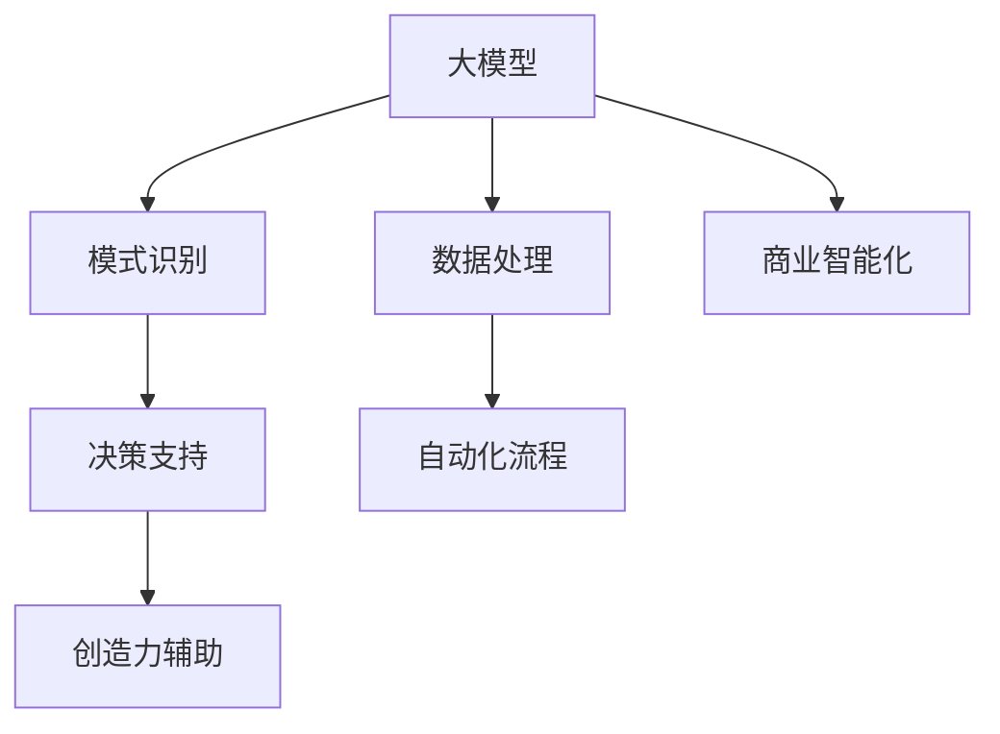

                 

# 大模型：未来商业的智能化发展

> 关键词：大模型, 商业智能化, AI, 深度学习, 自动化, 数据驱动

## 1. 背景介绍

### 1.1 问题由来

进入21世纪以来，信息技术和互联网的快速发展极大地推动了全球经济的数字化转型。如今，数据正成为最宝贵的资源之一。与此同时，人工智能（AI）和大数据技术的发展，让数据驱动的决策成为可能，带来了一场新的产业变革。

在这一过程中，深度学习尤其是大模型（Large Models）成为了核心驱动力。所谓大模型，通常指那些参数量在亿级以上的神经网络模型，比如GPT、BERT、DALL·E等。这些模型通过在海量数据上进行预训练，具备了强大的特征提取和模式识别能力，可以应用于各种复杂的商业智能任务，如自然语言处理（NLP）、图像识别、语音识别等。

### 1.2 问题核心关键点

大模型在商业智能化中的应用，已经从数据处理、模式识别延伸到了更为深入的决策支持、自动化流程和创造力辅助。其核心关键点包括：

- 数据处理：大模型通过自动化的方式，可以处理大规模、高复杂度的数据，为商业决策提供坚实的数据基础。
- 模式识别：大模型能够从海量数据中识别出隐含的模式和趋势，为商业预测和策略制定提供支持。
- 决策支持：大模型可以基于实时数据和历史数据，提供实时的决策建议，帮助企业快速响应市场变化。
- 自动化流程：大模型驱动的自动化流程可以大大提高商业运营效率，减少人工干预。
- 创造力辅助：大模型在艺术、设计等领域展现了其独特的创造力辅助能力，推动了创新型企业的快速发展。

然而，大模型的应用也面临一些挑战。包括数据隐私、模型可解释性、以及如何更好地融入现有的商业流程等问题。

## 2. 核心概念与联系

### 2.1 核心概念概述

在商业智能化的进程中，大模型是一个重要的组成部分。理解大模型及其应用，需从以下几个核心概念入手：

- **大模型**：指具有数亿参数的神经网络模型，如GPT、BERT等，通过在大规模数据集上进行预训练，可以具备强大的特征提取和模式识别能力。
- **商业智能化**：指利用AI技术和大数据，对商业决策、运营管理等环节进行智能化改造，提高企业的效率和竞争力。
- **自动化流程**：利用大模型自动化流程，可以显著降低人工操作成本，提高工作效率。
- **数据驱动决策**：基于大模型处理的数据，支持更加科学的决策制定。
- **创造力辅助**：大模型在创意设计、艺术创作等领域展现了强大的辅助能力，推动了创新型企业的兴起。

这些概念之间存在密切联系，共同构成了未来商业智能化的技术基础。

### 2.2 核心概念原理和架构的 Mermaid 流程图



通过这幅流程图，可以看出大模型在商业智能化中的作用是全方位的，从数据处理到决策支持，从自动化流程到创造力辅助，大模型都起到了关键作用。

## 3. 核心算法原理 & 具体操作步骤

### 3.1 算法原理概述

大模型在商业智能化中的核心算法原理是深度学习。深度学习通过多层次的神经网络，从数据中自动学习抽象特征，并能够处理复杂的非线性模式。在商业智能化中，大模型能够通过学习大量的业务数据，提取其中的关键特征，进而实现对复杂商业问题的分析和决策支持。

### 3.2 算法步骤详解

大模型在商业智能化中的应用通常分为以下几个步骤：

1. **数据收集与预处理**：
   - 收集和整理业务相关的数据，包括客户数据、市场数据、运营数据等。
   - 对数据进行清洗和标准化处理，确保数据的质量和一致性。
   - 对数据进行增量更新，保证数据的实时性。

2. **模型训练与优化**：
   - 在大规模数据集上对大模型进行预训练，学习通用特征。
   - 对预训练模型进行微调，以适应特定的商业智能任务。
   - 优化模型的超参数，提高模型性能和稳定性。

3. **模型部署与应用**：
   - 将训练好的模型部署到实际应用环境中。
   - 集成到业务系统，实现自动化流程和决策支持。
   - 不断监控模型的运行情况，及时进行调整和优化。

### 3.3 算法优缺点

#### 优点：

1. **高效处理大数据**：大模型能够高效处理大规模、高复杂度的数据，为商业决策提供坚实的数据基础。
2. **强大的模式识别能力**：通过深度学习，大模型可以识别出数据中的隐含模式和趋势，提供有力的决策支持。
3. **提升运营效率**：利用大模型的自动化流程，可以大幅度提高商业运营效率，减少人工干预。
4. **辅助创造力**：在艺术、设计等领域，大模型展现了其独特的创造力辅助能力，推动了创新型企业的快速发展。

#### 缺点：

1. **数据隐私问题**：大规模数据处理和大模型的使用，带来了数据隐私和安全的挑战。
2. **模型可解释性不足**：大模型通常是"黑盒"模型，难以解释其内部工作机制和决策逻辑。
3. **资源消耗大**：大模型需要高性能计算资源进行训练和部署，对硬件要求高。
4. **模型鲁棒性问题**：在面对异常或恶意数据时，大模型的表现可能不够鲁棒。

### 3.4 算法应用领域

大模型在商业智能化的应用领域非常广泛，涵盖了以下几个方面：

1. **自然语言处理（NLP）**：利用大模型进行文本分析、情感分析、机器翻译等。
2. **图像识别**：大模型可以用于图像分类、物体检测、图像生成等。
3. **语音识别**：大模型可以处理语音转文本、语音识别等任务。
4. **推荐系统**：基于用户行为和偏好，大模型可以提供个性化的商品推荐。
5. **财务分析**：利用大模型进行市场预测、风险评估等。
6. **客户服务**：利用大模型进行智能客服、客户数据分析等。
7. **供应链管理**：利用大模型优化供应链管理，提高效率和透明度。
8. **自动化流程**：利用大模型实现自动化流程，如自动化文档生成、自动化财务报表等。
9. **创造力辅助**：在艺术、设计等领域，大模型可以辅助创作，提高创意水平。

## 4. 数学模型和公式 & 详细讲解 & 举例说明

### 4.1 数学模型构建

大模型在商业智能化中的数学模型构建，通常采用深度学习中的神经网络模型。以下是一个简单的神经网络模型结构：

```text
      input      -> embedding -> hidden layers -> output
```

其中：
- **input**：输入数据，可以是文本、图像、声音等。
- **embedding**：将输入数据转换为向量表示，以便神经网络处理。
- **hidden layers**：神经网络的核心层，包含多个隐藏层。
- **output**：输出结果，可以是分类、预测、生成等。

### 4.2 公式推导过程

以一个简单的二分类问题为例，大模型通过多层次的神经网络进行训练。假设模型结构如下：

```text
      input      -> embedding -> hidden layers -> output
```

输入数据为 $x$，输出为 $y$，假设模型有 $n$ 个隐藏层，第 $k$ 层的权重为 $W_k$，偏置为 $b_k$，激活函数为 $f_k$，则模型输出为：

$$
y = \sigma_n(\sigma_{n-1}(...\sigma_2(\sigma_1(W_1x + b_1) + b_2) + b_3) + ... + b_n)
$$

其中 $\sigma_k$ 表示第 $k$ 层的激活函数，如ReLU、Sigmoid等。

在训练过程中，通过反向传播算法计算梯度，更新模型参数：

$$
\frac{\partial \mathcal{L}}{\partial W_k} = \frac{\partial \mathcal{L}}{\partial y} \frac{\partial y}{\partial z_{k-1}} \frac{\partial z_{k-1}}{\partial W_k}
$$

其中 $\mathcal{L}$ 为损失函数，通常采用交叉熵损失。

### 4.3 案例分析与讲解

以情感分析为例，假设有一个包含文本和情感标签的数据集，用于训练情感分析模型。

假设模型结构为：
- **输入层**：文本数据，经过词嵌入层转换为向量表示。
- **隐藏层**：包含多个全连接层，每层使用ReLU激活函数。
- **输出层**：输出层使用Sigmoid激活函数，输出二分类概率。

训练过程中，首先对文本数据进行预处理，包括分词、去除停用词等操作。然后，将文本数据输入模型进行训练，通过反向传播算法更新模型参数。

训练完成后，模型能够对新的文本数据进行情感分类，如判断评论是正面还是负面。

## 5. 项目实践：代码实例和详细解释说明

### 5.1 开发环境搭建

在进行商业智能化的大模型项目开发前，需要准备以下开发环境：

1. **安装Python**：确保Python环境正常运行。
2. **安装深度学习框架**：选择TensorFlow、PyTorch等深度学习框架，并根据需求进行安装。
3. **安装大模型库**：选择HuggingFace、TensorFlow Hub等库，方便下载和使用大模型。
4. **安装数据处理库**：选择Pandas、NumPy等库，用于数据处理和分析。
5. **安装模型部署库**：选择Flask、FastAPI等库，用于模型部署和API服务。
6. **安装可视化库**：选择Matplotlib、Seaborn等库，用于模型性能可视化。

### 5.2 源代码详细实现

以下是一个简单的情感分析项目实现，用于演示大模型在商业智能中的应用：

```python
# 导入所需的库
import pandas as pd
import numpy as np
from transformers import BertTokenizer, BertForSequenceClassification
from transformers import Trainer, TrainingArguments
from sklearn.metrics import accuracy_score

# 加载数据集
data = pd.read_csv('sentiment.csv')

# 初始化分词器和模型
tokenizer = BertTokenizer.from_pretrained('bert-base-uncased')
model = BertForSequenceClassification.from_pretrained('bert-base-uncased', num_labels=2)

# 定义训练参数
training_args = TrainingArguments(
    output_dir="./results",
    evaluation_strategy="epoch",
    per_device_train_batch_size=32,
    per_device_eval_batch_size=32,
    learning_rate=2e-5,
    num_train_epochs=5,
    weight_decay=0.01,
    logging_dir="./logs"
)

# 定义训练函数
def train(model, training_args):
    trainer = Trainer(
        model=model,
        args=training_args,
        train_dataset=data['text'].tolist(),
        eval_dataset=data['text'].tolist(),
        compute_metrics=lambda p: {'acc': accuracy_score(p['labels'], p['predictions'])}
    )
    trainer.train()

# 调用训练函数
train(model, training_args)

# 测试模型
test_data = ["This product is amazing!", "This product is terrible."]
test_dataset = [tokenizer.encode(text, return_tensors='pt') for text in test_data]
predictions = model(**test_dataset)[0].logits.argmax(dim=1).tolist()
print(predictions)
```

### 5.3 代码解读与分析

该代码实现了一个简单的情感分析项目，用于演示大模型在商业智能中的应用。

1. **数据处理**：首先，使用Pandas库加载情感分析数据集，并进行预处理。
2. **模型初始化**：使用HuggingFace库加载BERT分词器和模型，并定义训练参数。
3. **训练函数**：定义训练函数，并传入分词器、模型和训练参数，使用 Trainer 进行模型训练。
4. **测试模型**：使用预训练的模型对新的文本数据进行情感分类，输出分类结果。

### 5.4 运行结果展示

训练完成后，模型可以对新的文本数据进行情感分类，输出分类结果。以示例文本 "This product is amazing!" 为例，模型可以准确地预测其情感为正面。

## 6. 实际应用场景

### 6.1 智能客服系统

智能客服系统是商业智能化中大模型的典型应用之一。通过利用大模型进行自然语言处理和情感分析，智能客服系统可以提供7x24小时不间断的服务，快速响应客户咨询，用自然流畅的语言解答各类常见问题，提升客户体验。

以某电商平台为例，该平台利用大模型进行智能客服的开发和优化。平台通过收集历史客服对话记录，将问题和最佳答复构建成监督数据，对大模型进行微调，使其能够自动理解用户意图，匹配最合适的答案模板进行回复。微调后的模型在实际应用中，能够快速响应用户咨询，提供满意的服务，大幅提高了客户满意度。

### 6.2 金融风险控制

在金融领域，大模型可以用于金融风险控制，包括信用评估、风险预测、反欺诈检测等。通过利用大模型处理大量的金融数据，分析客户的信用行为和交易数据，大模型可以预测客户的违约概率，识别潜在的欺诈行为，为金融机构提供决策支持。

以一家在线贷款公司为例，该公司在用户申请贷款时，利用大模型分析其信用记录、社交媒体数据、交易行为等，预测其违约概率，从而决定是否发放贷款。该模型在实际应用中，已经大幅度提高了贷款审批的准确性，减少了坏账风险。

### 6.3 市场营销分析

大模型在市场营销分析中也有广泛应用。通过利用大模型分析消费者的购买行为、社交媒体数据等，企业可以更好地理解市场动态，制定更加精准的营销策略。

以一家大型零售企业为例，该企业利用大模型分析消费者的购物行为和社交媒体评论，了解消费者的偏好和需求，从而制定更加个性化的营销方案。该模型在实际应用中，已经帮助企业提升了销售额和客户满意度。

### 6.4 未来应用展望

未来，随着大模型技术的不断发展和商业智能化的深入应用，大模型在商业中的应用将更加广泛。以下是几个可能的未来应用场景：

1. **个性化推荐系统**：利用大模型分析用户行为和偏好，提供个性化的商品推荐，提高销售额。
2. **供应链管理**：利用大模型优化供应链管理，提高效率和透明度，降低成本。
3. **智能投顾**：利用大模型进行市场分析和预测，为投资者提供决策支持，提高投资回报率。
4. **风险评估**：利用大模型分析金融数据，预测市场风险，制定风险管理策略。
5. **自动化文档生成**：利用大模型自动生成商业文档，如合同、财务报表等，提高工作效率。
6. **客户情感分析**：利用大模型分析客户反馈和评价，改进产品和服务，提升客户满意度。

## 7. 工具和资源推荐

### 7.1 学习资源推荐

为了帮助开发者系统掌握大模型和商业智能化的相关知识，这里推荐一些优质的学习资源：

1. **《深度学习》课程**：斯坦福大学开设的深度学习课程，涵盖深度学习基础和应用，适合初学者和进阶者学习。
2. **《TensorFlow官方文档》**：TensorFlow的官方文档，提供详细的API文档和示例代码，适合深度学习开发人员参考。
3. **《自然语言处理与深度学习》**：吴恩达等人合著的深度学习与自然语言处理书籍，详细介绍自然语言处理和深度学习的应用。
4. **《Transformers实战》**：吴恩达等人合著的深度学习与自然语言处理书籍，详细讲解如何使用Transformers库进行NLP任务开发。
5. **《AI商业化实践》**：王飞跃等人的书籍，讲解AI技术在商业应用中的实践经验。

通过这些资源的学习，相信你一定能够掌握大模型和商业智能化的相关知识，并在实际项目中发挥重要作用。

### 7.2 开发工具推荐

在商业智能化的开发过程中，选择合适的开发工具非常重要。以下是几款常用的工具：

1. **PyTorch**：基于Python的深度学习框架，支持动态计算图，适合快速迭代开发。
2. **TensorFlow**：由Google主导的深度学习框架，生产部署方便，适合大规模工程应用。
3. **Jupyter Notebook**：交互式笔记本工具，方便进行数据处理和模型调试。
4. **TensorBoard**：TensorFlow配套的可视化工具，可实时监测模型训练状态。
5. **AWS SageMaker**：亚马逊的机器学习服务，提供丰富的AI工具和资源，方便模型部署和应用。

这些工具的合理使用，可以显著提升开发效率，加速商业智能化的实践进程。

### 7.3 相关论文推荐

大模型在商业智能化中的应用，离不开学界的持续研究。以下是几篇奠基性的相关论文，推荐阅读：

1. **《Attention is All You Need》**：谷歌的Transformer论文，提出自注意力机制，奠定了大模型的基础。
2. **《BERT: Pre-training of Deep Bidirectional Transformers for Language Understanding》**：谷歌的BERT论文，提出预训练语言模型，刷新了NLP任务SOTA。
3. **《GPT-3: Language Models are Unsupervised Multitask Learners》**：OpenAI的GPT-3论文，展示了大规模语言模型的强大零样本学习能力。
4. **《Parameter-Efficient Transfer Learning for NLP》**：斯坦福大学的论文，提出Adapter等参数高效微调方法，在固定大部分预训练参数的情况下，也能取得不错的微调效果。
5. **《AdaLoRA: Adaptive Low-Rank Adaptation for Parameter-Efficient Fine-Tuning》**：谷歌的论文，提出自适应低秩适应的微调方法，在参数效率和精度之间取得新的平衡。

这些论文代表了大模型和商业智能化的发展脉络。通过学习这些前沿成果，可以帮助研究者把握学科前进方向，激发更多的创新灵感。

## 8. 总结：未来发展趋势与挑战

### 8.1 研究成果总结

大模型在商业智能化中的应用，已经取得了显著的成果。通过深度学习和数据驱动，大模型在自然语言处理、图像识别、语音识别等诸多领域展现出了强大的能力，推动了商业智能化的快速发展。

### 8.2 未来发展趋势

展望未来，大模型在商业智能化中的应用将更加广泛。以下是几个可能的未来发展趋势：

1. **模型规模持续增大**：随着算力成本的下降和数据规模的扩张，预训练语言模型的参数量还将持续增长。超大规模语言模型蕴含的丰富语言知识，有望支撑更加复杂多变的商业智能任务。
2. **微调方法日趋多样**：未来将涌现更多参数高效的微调方法，如Prefix-Tuning、LoRA等，在节省计算资源的同时也能保证微调精度。
3. **持续学习成为常态**：随着数据分布的不断变化，微调模型也需要持续学习新知识以保持性能。如何在不遗忘原有知识的同时，高效吸收新样本信息，将成为重要的研究课题。
4. **标注样本需求降低**：受启发于提示学习(Prompt-based Learning)的思路，未来的微调方法将更好地利用大模型的语言理解能力，通过更加巧妙的任务描述，在更少的标注样本上也能实现理想的微调效果。
5. **多模态微调崛起**：当前的微调主要聚焦于纯文本数据，未来会进一步拓展到图像、视频、语音等多模态数据微调。多模态信息的融合，将显著提升语言模型对现实世界的理解和建模能力。
6. **知识整合能力增强**：未来的微调模型将更好地与外部知识库、规则库等专家知识结合，形成更加全面、准确的信息整合能力。
7. **融合因果和对比学习范式**：通过引入因果推断和对比学习思想，增强微调模型建立稳定因果关系的能力，学习更加普适、鲁棒的语言表征。

### 8.3 面临的挑战

尽管大模型在商业智能化中的应用已经取得了显著成效，但在迈向更加智能化、普适化应用的过程中，仍面临一些挑战：

1. **数据隐私问题**：大规模数据处理和大模型的使用，带来了数据隐私和安全的挑战。
2. **模型可解释性不足**：大模型通常是"黑盒"模型，难以解释其内部工作机制和决策逻辑。
3. **资源消耗大**：大模型需要高性能计算资源进行训练和部署，对硬件要求高。
4. **模型鲁棒性问题**：在面对异常或恶意数据时，大模型的表现可能不够鲁棒。
5. **知识整合能力不足**：现有的微调模型往往局限于任务内数据，难以灵活吸收和运用更广泛的先验知识。
6. **可解释性亟需加强**：对于高风险应用，算法的可解释性和可审计性尤为重要。

### 8.4 研究展望

未来的研究需要在以下几个方面寻求新的突破：

1. **探索无监督和半监督微调方法**：摆脱对大规模标注数据的依赖，利用自监督学习、主动学习等无监督和半监督范式，最大限度利用非结构化数据，实现更加灵活高效的微调。
2. **研究参数高效和计算高效的微调范式**：开发更加参数高效的微调方法，在固定大部分预训练参数的情况下，只更新极少量的任务相关参数。同时优化微调模型的计算图，减少前向传播和反向传播的资源消耗，实现更加轻量级、实时性的部署。
3. **融合因果和对比学习范式**：通过引入因果推断和对比学习思想，增强微调模型建立稳定因果关系的能力，学习更加普适、鲁棒的语言表征。
4. **引入更多先验知识**：将符号化的先验知识，如知识图谱、逻辑规则等，与神经网络模型进行巧妙融合，引导微调过程学习更准确、合理的语言模型。同时加强不同模态数据的整合，实现视觉、语音等多模态信息与文本信息的协同建模。
5. **结合因果分析和博弈论工具**：将因果分析方法引入微调模型，识别出模型决策的关键特征，增强输出解释的因果性和逻辑性。借助博弈论工具刻画人机交互过程，主动探索并规避模型的脆弱点，提高系统稳定性。
6. **纳入伦理道德约束**：在模型训练目标中引入伦理导向的评估指标，过滤和惩罚有偏见、有害的输出倾向。同时加强人工干预和审核，建立模型行为的监管机制，确保输出符合人类价值观和伦理道德。

这些研究方向将引领大模型在商业智能化中的进一步应用，为构建安全、可靠、可解释、可控的智能系统铺平道路。面向未来，大模型在商业智能化中的应用将继续深化，推动人工智能技术在各垂直行业的规模化落地。

## 9. 附录：常见问题与解答

### Q1: 大模型在商业智能化的应用有哪些？

A: 大模型在商业智能化的应用非常广泛，包括但不限于以下几类：

1. **自然语言处理（NLP）**：利用大模型进行文本分析、情感分析、机器翻译等。
2. **图像识别**：大模型可以用于图像分类、物体检测、图像生成等。
3. **语音识别**：大模型可以处理语音转文本、语音识别等任务。
4. **推荐系统**：基于用户行为和偏好，大模型可以提供个性化的商品推荐。
5. **财务分析**：利用大模型进行市场预测、风险评估等。
6. **客户服务**：利用大模型进行智能客服、客户数据分析等。
7. **供应链管理**：利用大模型优化供应链管理，提高效率和透明度。
8. **自动化流程**：利用大模型实现自动化流程，如自动化文档生成、自动化财务报表等。
9. **创造力辅助**：在艺术、设计等领域，大模型可以辅助创作，提高创意水平。

### Q2: 大模型的训练和优化过程中需要注意哪些问题？

A: 大模型的训练和优化过程中，需要注意以下几个问题：

1. **数据隐私**：大规模数据处理和大模型的使用，带来了数据隐私和安全的挑战。需采取数据脱敏、加密等措施，确保数据安全。
2. **模型鲁棒性**：在面对异常或恶意数据时，大模型的表现可能不够鲁棒。需引入对抗训练、数据增强等技术，提高模型鲁棒性。
3. **可解释性**：大模型通常是"黑盒"模型，难以解释其内部工作机制和决策逻辑。需引入模型解释工具，提高模型可解释性。
4. **资源消耗**：大模型需要高性能计算资源进行训练和部署，需考虑资源优化技术，如梯度积累、混合精度训练等。
5. **超参数调优**：大模型的训练和优化过程中，需不断调优超参数，如学习率、批大小、迭代轮数等，以提高模型性能。
6. **模型评估**：大模型的训练过程中，需不断评估模型性能，监控训练指标，及时进行调整和优化。

### Q3: 如何在大模型应用中避免数据隐私问题？

A: 在大模型应用中避免数据隐私问题，可以采取以下几种措施：

1. **数据匿名化**：在数据预处理阶段，对敏感信息进行匿名化处理，确保数据隐私。
2. **差分隐私**：引入差分隐私技术，添加噪声扰动，保护数据隐私。
3. **联邦学习**：采用联邦学习技术，将模型训练分布在多个本地设备上，不共享原始数据，保护数据隐私。
4. **访问控制**：对模型的访问进行严格的权限控制，确保数据不被滥用。
5. **数据加密**：对数据进行加密处理，确保数据在传输和存储过程中的安全。
6. **模型蒸馏**：利用蒸馏技术，将大模型的知识转移到小型模型中，减少对原始数据的依赖。

### Q4: 大模型在商业智能化中的应用，如何保障模型的可解释性？

A: 在大模型应用中，保障模型的可解释性是至关重要的。以下是几种常见的方法：

1. **模型解释工具**：引入如LIME、SHAP等模型解释工具，对模型的预测结果进行解释，帮助用户理解模型的决策过程。
2. **可解释性模型**：使用如LSTM、决策树等可解释性较强的模型，代替复杂的大模型。
3. **多模型融合**：通过多模型融合，将大模型与可解释性强的模型结合，提高模型的可解释性。
4. **因果分析**：引入因果推断技术，识别出模型决策的关键特征，增强输出解释的因果性和逻辑性。
5. **人工智能伦理**：在模型训练目标中引入伦理导向的评估指标，过滤和惩罚有偏见、有害的输出倾向。同时加强人工干预和审核，建立模型行为的监管机制，确保输出符合人类价值观和伦理道德。

这些方法可以有效提升大模型在商业智能化中的可解释性，帮助用户更好地理解模型的决策过程，增强对模型的信任度。

### Q5: 大模型在商业智能化中的未来发展方向是什么？

A: 大模型在商业智能化中的未来发展方向主要包括以下几个方面：

1. **模型规模持续增大**：随着算力成本的下降和数据规模的扩张，预训练语言模型的参数量还将持续增长。超大规模语言模型蕴含的丰富语言知识，有望支撑更加复杂多变的商业智能任务。
2. **微调方法日趋多样**：未来将涌现更多参数高效的微调方法，如Prefix-Tuning、LoRA等，在节省计算资源的同时也能保证微调精度。
3. **持续学习成为常态**：随着数据分布的不断变化，微调模型也需要持续学习新知识以保持性能。如何在不遗忘原有知识的同时，高效吸收新样本信息，将成为重要的研究课题。
4. **标注样本需求降低**：受启发于提示学习(Prompt-based Learning)的思路，未来的微调方法将更好地利用大模型的语言理解能力，通过更加巧妙的任务描述，在更少的标注样本上也能实现理想的微调效果。
5. **多模态微调崛起**：当前的微调主要聚焦于纯文本数据，未来会进一步拓展到图像、视频、语音等多模态数据微调。多模态信息的融合，将显著提升语言模型对现实世界的理解和建模能力。
6. **知识整合能力增强**：未来的微调模型将更好地与外部知识库、规则库等专家知识结合，形成更加全面、准确的信息整合能力。
7. **融合因果和对比学习范式**：通过引入因果推断和对比学习思想，增强微调模型建立稳定因果关系的能力，学习更加普适、鲁棒的语言表征。

这些研究方向将引领大模型在商业智能化中的进一步应用，为构建安全、可靠、可解释、可控的智能系统铺平道路。面向未来，大模型在商业智能化中的应用将继续深化，推动人工智能技术在各垂直行业的规模化落地。

---

作者：禅与计算机程序设计艺术 / Zen and the Art of Computer Programming

