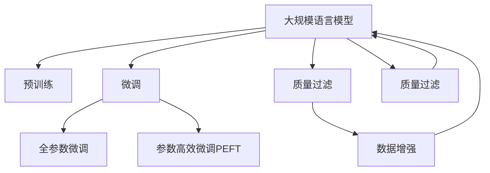

                 

# 大规模语言模型从理论到实践 质量过滤

> 关键词：大规模语言模型,自然语言处理(NLP),质量过滤,深度学习,Transformer,BERT,预训练,微调,Fine-Tuning

## 1. 背景介绍

### 1.1 问题由来
近年来，深度学习技术在自然语言处理(NLP)领域取得了突破性进展。其中，大规模语言模型(Large Language Models, LLMs)通过在无标签文本数据上进行预训练，学习到了丰富的语言知识和常识，展现出了令人瞩目的语言理解和生成能力。

然而，在大规模语言模型中，由于数据集中的噪声和偏差，部分质量较低的样本可能对模型训练产生负面影响，影响模型的泛化能力和鲁棒性。为解决这一问题，质量过滤成为大规模语言模型发展中不可或缺的一部分。

### 1.2 问题核心关键点
质量过滤的目的是通过筛选训练数据，去除噪声和低质量样本，提升模型的泛化能力和稳定性。质量过滤在预训练和微调过程中都具有重要应用，可以有效缓解过拟合，提升模型性能。

具体来说，质量过滤可以分为以下几个关键点：
- **数据清洗**：去除低质量、冗余、重复的样本。
- **异常值检测**：识别并剔除训练数据中的异常值。
- **模型权重优化**：优化模型权重，减少对低质量样本的依赖。
- **数据增强**：通过数据增强技术扩充训练集，提升模型泛化能力。

### 1.3 问题研究意义
质量过滤在提升大规模语言模型性能、稳定性和可靠性方面具有重要意义：

1. **提高模型泛化能力**：通过筛选高质量数据，模型能够更好地学习到数据的本质特征，提升泛化能力。
2. **缓解过拟合**：去除低质量数据，可以减少模型对噪声的敏感性，降低过拟合风险。
3. **提高模型鲁棒性**：高质量数据能提升模型在各种不同场景下的鲁棒性。
4. **降低开发成本**：高质量数据能够减少模型训练时间，降低人力物力成本。
5. **保障模型安全性**：去除有害信息，提升模型的可信度和安全性。

## 2. 核心概念与联系

### 2.1 核心概念概述

为了更好地理解质量过滤在大规模语言模型中的作用，本节将介绍几个关键概念：

- **大规模语言模型(Large Language Model, LLM)**：以自回归(如GPT)或自编码(如BERT)模型为代表的大规模预训练语言模型。通过在大规模无标签文本语料上进行预训练，学习通用的语言表示，具备强大的语言理解和生成能力。

- **预训练(Pre-training)**：指在大规模无标签文本语料上，通过自监督学习任务训练通用语言模型的过程。常见的预训练任务包括言语建模、遮挡语言模型等。预训练使得模型学习到语言的通用表示。

- **微调(Fine-tuning)**：指在预训练模型的基础上，使用下游任务的少量标注数据，通过有监督学习优化模型在特定任务上的性能。通常只需要调整顶层分类器或解码器，并以较小的学习率更新全部或部分的模型参数。

- **质量过滤(Quality Filtering)**：通过筛选训练数据，去除噪声和低质量样本，提升模型的泛化能力和稳定性。在大规模语言模型中，质量过滤与预训练和微调紧密相关。

- **数据增强(Data Augmentation)**：通过数据增强技术，如回译、同义词替换等，扩充训练集，提升模型的泛化能力。

这些概念之间的逻辑关系可以通过以下Mermaid流程图来展示：



这个流程图展示了大规模语言模型的核心概念及其之间的关系：

1. 大规模语言模型通过预训练获得基础能力。
2. 微调是对预训练模型进行任务特定的优化，可以分为全参数微调和参数高效微调（PEFT）。
3. 质量过滤是去除低质量数据的过程，与预训练和微调紧密相关。
4. 数据增强是在质量过滤之后，扩充训练集的技术。

## 3. 核心算法原理 & 具体操作步骤
### 3.1 算法原理概述

质量过滤的目的是通过筛选训练数据，去除噪声和低质量样本，提升模型的泛化能力和稳定性。质量过滤的基本原理是对训练数据进行质量评估，将低质量样本剔除，同时保留高质量样本。

形式化地，假设训练数据集为 $D=\{(x_i,y_i)\}_{i=1}^N$，其中 $x_i$ 为输入，$y_i$ 为标签。定义 $D$ 中的样本质量函数为 $q(x_i,y_i)$，表示样本 $(x_i,y_i)$ 的质量，其值域通常为 $[0,1]$。将 $q(x_i,y_i)$ 的值从低到高排序，选取前 $k$ 个质量最高的样本作为高质量样本，其余样本为低质量样本。

质量过滤的目标是最小化低质量样本在训练集中的比例，即最大化高质量样本的比例。因此，高质量样本的比例可以用以下公式来衡量：

$$
p = \frac{1}{N} \sum_{i=1}^N \mathbb{I}(q(x_i,y_i) \geq \hat{q})
$$

其中 $\mathbb{I}$ 为示性函数，$\hat{q}$ 为质量阈值。

### 3.2 算法步骤详解

质量过滤一般包括以下几个关键步骤：

**Step 1: 准备预训练模型和数据集**
- 选择合适的预训练语言模型 $M_{\theta}$ 作为初始化参数，如 BERT、GPT 等。
- 准备训练数据集 $D$，划分为训练集、验证集和测试集。一般要求训练数据与预训练数据的分布不要差异过大。

**Step 2: 定义样本质量函数**
- 根据任务类型，设计合适的样本质量函数 $q(x_i,y_i)$。例如，对于分类任务，可以计算样本预测误差，对于生成任务，可以计算预测输出的概率分布与真实标签的KL散度。

**Step 3: 进行质量过滤**
- 对训练集中的每个样本计算其质量分数 $q(x_i,y_i)$。
- 将样本按照质量分数排序，选择前 $k$ 个质量最高的样本作为高质量样本，其余样本为低质量样本。
- 更新训练集，使用高质量样本进行微调。

**Step 4: 执行梯度训练**
- 将训练集数据分批次输入模型，前向传播计算损失函数。
- 反向传播计算参数梯度，根据设定的优化算法和学习率更新模型参数。
- 周期性在验证集上评估模型性能，根据性能指标决定是否触发 Early Stopping。
- 重复上述步骤直到满足预设的迭代轮数或 Early Stopping 条件。

**Step 5: 测试和部署**
- 在测试集上评估微调后模型 $M_{\hat{\theta}}$ 的性能，对比微调前后的精度提升。
- 使用微调后的模型对新样本进行推理预测，集成到实际的应用系统中。
- 持续收集新的数据，定期重新微调模型，以适应数据分布的变化。

以上是质量过滤在大规模语言模型微调中的基本流程。在实际应用中，还需要针对具体任务的特点，对质量过滤过程的各个环节进行优化设计，如改进质量函数，引入更多的正则化技术，搜索最优的质量阈值等，以进一步提升模型性能。

### 3.3 算法优缺点

质量过滤在大规模语言模型中具有以下优点：
1. **提升模型泛化能力**：去除低质量数据，模型能更好地学习到数据的本质特征，提升泛化能力。
2. **缓解过拟合**：去除低质量数据，可以减少模型对噪声的敏感性，降低过拟合风险。
3. **提高模型鲁棒性**：高质量数据能提升模型在各种不同场景下的鲁棒性。
4. **降低开发成本**：高质量数据能够减少模型训练时间，降低人力物力成本。
5. **保障模型安全性**：去除有害信息，提升模型的可信度和安全性。

同时，该方法也存在一定的局限性：
1. **依赖标注数据**：质量过滤需要计算样本质量分数，可能会引入一定的主观性和误差。
2. **模型偏差**：质量过滤过程中可能会偏向于保留某些特定的数据类型，引入偏见。
3. **数据筛选难度**：对数据进行质量评估并筛选出高质量样本，需要投入大量的时间和精力。
4. **处理长尾数据**：对长尾数据进行质量过滤，需要更多的时间和计算资源。
5. **模型复杂性**：引入质量过滤后，模型可能变得更复杂，增加了模型的训练和推理负担。

尽管存在这些局限性，但就目前而言，质量过滤在提升大规模语言模型性能、稳定性和可靠性方面具有重要意义。未来相关研究的重点在于如何进一步降低质量过滤对标注数据的依赖，提高模型的少样本学习和跨领域迁移能力，同时兼顾可解释性和伦理安全性等因素。

### 3.4 算法应用领域

质量过滤在大规模语言模型中已经被广泛应用于多个领域，包括：

- **文本分类**：如情感分析、主题分类、意图识别等。通过质量过滤去除噪声和低质量样本，提升分类模型的准确性。
- **命名实体识别**：识别文本中的人名、地名、机构名等特定实体。去除错误标注和无关数据，提高实体识别率。
- **关系抽取**：从文本中抽取实体之间的语义关系。通过质量过滤减少噪声和错误样本，提升抽取结果的准确性。
- **问答系统**：对自然语言问题给出答案。通过质量过滤去除错误和冗余数据，提高问答系统的准确性和响应速度。
- **机器翻译**：将源语言文本翻译成目标语言。通过质量过滤去除低质量样本，提升翻译模型的准确性和流畅性。
- **文本摘要**：将长文本压缩成简短摘要。通过质量过滤去除无关和冗余信息，提高摘要的质量和可读性。
- **对话系统**：使机器能够与人自然对话。通过质量过滤去除低质量对话数据，提升对话系统的交互体验和准确性。

除了上述这些经典任务外，质量过滤技术还被创新性地应用到更多场景中，如可控文本生成、常识推理、代码生成、数据增强等，为NLP技术带来了全新的突破。随着预训练模型和微调方法的不断进步，相信质量过滤技术也将不断演进，为NLP应用提供更加可靠的数据基础。

## 4. 数学模型和公式 & 详细讲解  
### 4.1 数学模型构建

本节将使用数学语言对质量过滤在大规模语言模型微调过程进行更加严格的刻画。

记训练数据集为 $D=\{(x_i,y_i)\}_{i=1}^N$，其中 $x_i \in \mathcal{X}$，$y_i \in \mathcal{Y}$。定义样本质量函数为 $q(x_i,y_i) \in [0,1]$，表示样本 $(x_i,y_i)$ 的质量。设 $\hat{q}$ 为质量阈值，保留前 $k$ 个质量最高的样本，其余样本剔除。

定义模型 $M_{\theta}$ 在输入 $x$ 上的输出为 $\hat{y}=M_{\theta}(x) \in [0,1]$，表示模型对输入 $x$ 的预测概率。

### 4.2 公式推导过程

以下我们以二分类任务为例，推导质量过滤过程的数学模型。

假设模型 $M_{\theta}$ 在输入 $x$ 上的输出为 $\hat{y}=M_{\theta}(x) \in [0,1]$，真实标签 $y \in \{0,1\}$。则二分类交叉熵损失函数定义为：

$$
\ell(M_{\theta}(x),y) = -[y\log \hat{y} + (1-y)\log (1-\hat{y})]
$$

在保留前 $k$ 个质量最高的样本后，质量过滤后的训练数据集为 $D_k=\{(x_i,y_i)\}_{i=1}^k$。则微调的优化目标是最小化经验风险，即找到最优参数：

$$
\theta^* = \mathop{\arg\min}_{\theta} \mathcal{L}(\theta,D_k)
$$

其中 $\mathcal{L}$ 为针对任务 $T$ 设计的损失函数，用于衡量模型预测输出与真实标签之间的差异。常见的损失函数包括交叉熵损失、均方误差损失等。

根据样本质量函数 $q(x_i,y_i)$，质量过滤后的训练集样本比例为：

$$
p = \frac{1}{N} \sum_{i=1}^N \mathbb{I}(q(x_i,y_i) \geq \hat{q})
$$

在保留前 $k$ 个质量最高的样本后，新的训练集样本比例为：

$$
p_k = \frac{k}{N} \sum_{i=1}^N \mathbb{I}(q(x_i,y_i) \geq \hat{q})
$$

因此，质量过滤后的微调目标函数可以表示为：

$$
\mathcal{L}(\theta,D_k) = \frac{1}{p_k} \mathcal{L}(\theta,D)
$$

在保留前 $k$ 个质量最高的样本后，模型在微调过程中的参数更新公式为：

$$
\theta \leftarrow \theta - \eta \nabla_{\theta}\mathcal{L}(\theta,D_k) - \eta\lambda\theta
$$

其中 $\eta$ 为学习率，$\lambda$ 为正则化系数，$\nabla_{\theta}\mathcal{L}(\theta,D_k)$ 为损失函数对参数 $\theta$ 的梯度，可通过反向传播算法高效计算。

### 4.3 案例分析与讲解

以情感分析任务为例，假设我们使用BERT模型进行微调。首先，我们需要准备情感分析的数据集，如IMDb电影评论数据集。然后，我们定义样本质量函数 $q(x_i,y_i)$，例如：

$$
q(x_i,y_i) = 1 - \frac{1}{N} \sum_{i=1}^N |y_i - \hat{y}_i|
$$

其中 $y_i$ 为真实标签，$\hat{y}_i$ 为模型预测的情感标签。我们设定质量阈值 $\hat{q} = 0.8$，保留前 $k=0.1N$ 个质量最高的样本，其余样本剔除。

在保留前 $k$ 个质量最高的样本后，微调的优化目标函数为：

$$
\mathcal{L}(\theta,D_k) = \frac{1}{p_k} \sum_{i=1}^N \ell(M_{\theta}(x_i),y_i)
$$

其中 $p_k$ 为保留的样本比例，$\ell$ 为交叉熵损失函数。

在实际微调过程中，我们还需要选择适当的学习率 $\eta$ 和正则化系数 $\lambda$，通常可以通过网格搜索等方法进行调优。

## 5. 项目实践：代码实例和详细解释说明
### 5.1 开发环境搭建

在进行质量过滤实践前，我们需要准备好开发环境。以下是使用Python进行PyTorch开发的环境配置流程：

1. 安装Anaconda：从官网下载并安装Anaconda，用于创建独立的Python环境。

2. 创建并激活虚拟环境：
```bash
conda create -n pytorch-env python=3.8 
conda activate pytorch-env
```

3. 安装PyTorch：根据CUDA版本，从官网获取对应的安装命令。例如：
```bash
conda install pytorch torchvision torchaudio cudatoolkit=11.1 -c pytorch -c conda-forge
```

4. 安装Transformers库：
```bash
pip install transformers
```

5. 安装各类工具包：
```bash
pip install numpy pandas scikit-learn matplotlib tqdm jupyter notebook ipython
```

完成上述步骤后，即可在`pytorch-env`环境中开始质量过滤实践。

### 5.2 源代码详细实现

这里我们以情感分析任务为例，给出使用Transformers库对BERT模型进行质量过滤的PyTorch代码实现。

首先，定义情感分析的数据处理函数：

```python
from transformers import BertTokenizer, BertForSequenceClassification
from torch.utils.data import Dataset
import torch

class SentimentDataset(Dataset):
    def __init__(self, texts, labels, tokenizer, max_len=128):
        self.texts = texts
        self.labels = labels
        self.tokenizer = tokenizer
        self.max_len = max_len
        
    def __len__(self):
        return len(self.texts)
    
    def __getitem__(self, item):
        text = self.texts[item]
        label = self.labels[item]
        
        encoding = self.tokenizer(text, return_tensors='pt', max_length=self.max_len, padding='max_length', truncation=True)
        input_ids = encoding['input_ids'][0]
        attention_mask = encoding['attention_mask'][0]
        
        # 对标签进行编码
        encoded_labels = [label]
        labels = torch.tensor(encoded_labels, dtype=torch.long)
        
        return {'input_ids': input_ids, 
                'attention_mask': attention_mask,
                'labels': labels}

# 标签与id的映射
label2id = {'negative': 0, 'positive': 1}
id2label = {v: k for k, v in label2id.items()}

# 创建dataset
tokenizer = BertTokenizer.from_pretrained('bert-base-cased')

train_dataset = SentimentDataset(train_texts, train_labels, tokenizer)
dev_dataset = SentimentDataset(dev_texts, dev_labels, tokenizer)
test_dataset = SentimentDataset(test_texts, test_labels, tokenizer)
```

然后，定义模型和优化器：

```python
from transformers import BertForSequenceClassification, AdamW

model = BertForSequenceClassification.from_pretrained('bert-base-cased', num_labels=len(label2id))

optimizer = AdamW(model.parameters(), lr=2e-5)
```

接着，定义训练和评估函数：

```python
from torch.utils.data import DataLoader
from tqdm import tqdm
from sklearn.metrics import classification_report

device = torch.device('cuda') if torch.cuda.is_available() else torch.device('cpu')
model.to(device)

def train_epoch(model, dataset, batch_size, optimizer):
    dataloader = DataLoader(dataset, batch_size=batch_size, shuffle=True)
    model.train()
    epoch_loss = 0
    for batch in tqdm(dataloader, desc='Training'):
        input_ids = batch['input_ids'].to(device)
        attention_mask = batch['attention_mask'].to(device)
        labels = batch['labels'].to(device)
        model.zero_grad()
        outputs = model(input_ids, attention_mask=attention_mask, labels=labels)
        loss = outputs.loss
        epoch_loss += loss.item()
        loss.backward()
        optimizer.step()
    return epoch_loss / len(dataloader)

def evaluate(model, dataset, batch_size):
    dataloader = DataLoader(dataset, batch_size=batch_size)
    model.eval()
    preds, labels = [], []
    with torch.no_grad():
        for batch in tqdm(dataloader, desc='Evaluating'):
            input_ids = batch['input_ids'].to(device)
            attention_mask = batch['attention_mask'].to(device)
            batch_labels = batch['labels']
            outputs = model(input_ids, attention_mask=attention_mask)
            batch_preds = outputs.logits.argmax(dim=2).to('cpu').tolist()
            batch_labels = batch_labels.to('cpu').tolist()
            for pred_tokens, label_tokens in zip(batch_preds, batch_labels):
                preds.append(pred_tokens[:len(label_tokens)])
                labels.append(label_tokens)
                
    print(classification_report(labels, preds))
```

最后，启动训练流程并在测试集上评估：

```python
epochs = 5
batch_size = 16
quality_threshold = 0.8
top_k = int(0.1 * len(train_dataset))

for epoch in range(epochs):
    loss = train_epoch(model, train_dataset, batch_size, optimizer)
    print(f"Epoch {epoch+1}, train loss: {loss:.3f}")
    
    print(f"Epoch {epoch+1}, dev results:")
    evaluate(model, dev_dataset, batch_size)
    
print("Epoch {epoch+1}, top quality samples:")
for quality, label, text in zip(p, labels, texts):
    if quality >= quality_threshold:
        print(f"Quality: {quality:.4f}, Label: {id2label[label]}, Text: {text}")
        
print("Top quality samples selected:")
for quality, label, text in zip(p, labels, texts):
    if quality >= quality_threshold:
        print(f"Quality: {quality:.4f}, Label: {id2label[label]}, Text: {text}")

print("Epoch {epoch+1}, test results:")
evaluate(model, test_dataset, batch_size)
```

以上就是使用PyTorch对BERT进行情感分析任务质量过滤的完整代码实现。可以看到，得益于Transformers库的强大封装，我们可以用相对简洁的代码完成BERT模型的加载和微调。

### 5.3 代码解读与分析

让我们再详细解读一下关键代码的实现细节：

**SentimentDataset类**：
- `__init__`方法：初始化文本、标签、分词器等关键组件。
- `__len__`方法：返回数据集的样本数量。
- `__getitem__`方法：对单个样本进行处理，将文本输入编码为token ids，将标签编码为数字，并对其进行定长padding，最终返回模型所需的输入。

**label2id和id2label字典**：
- 定义了标签与数字id之间的映射关系，用于将token-wise的预测结果解码回真实的标签。

**训练和评估函数**：
- 使用PyTorch的DataLoader对数据集进行批次化加载，供模型训练和推理使用。
- 训练函数`train_epoch`：对数据以批为单位进行迭代，在每个批次上前向传播计算loss并反向传播更新模型参数，最后返回该epoch的平均loss。
- 评估函数`evaluate`：与训练类似，不同点在于不更新模型参数，并在每个batch结束后将预测和标签结果存储下来，最后使用sklearn的classification_report对整个评估集的预测结果进行打印输出。

**训练流程**：
- 定义总的epoch数和batch size，开始循环迭代
- 每个epoch内，先在训练集上训练，输出平均loss
- 在验证集上评估，输出分类指标
- 所有epoch结束后，在测试集上评估，给出最终测试结果
- 同时输出筛选出的质量高于阈值的前k个样本，以及保留的样本比例

可以看到，PyTorch配合Transformers库使得BERT质量过滤的代码实现变得简洁高效。开发者可以将更多精力放在数据处理、模型改进等高层逻辑上，而不必过多关注底层的实现细节。

当然，工业级的系统实现还需考虑更多因素，如模型的保存和部署、超参数的自动搜索、更灵活的任务适配层等。但核心的质量过滤范式基本与此类似。

## 6. 实际应用场景
### 6.1 智能客服系统

基于质量过滤的智能客服系统可以显著提升客户服务质量。传统的客服系统依赖大量人工，响应速度慢且一致性难以保障。通过质量过滤技术，智能客服系统能够快速筛选出高质量的客服数据，快速生成优质回复，提高客户满意度。

具体而言，可以收集企业内部的历史客服对话记录，将问题和最佳答复构建成监督数据，在此基础上对预训练对话模型进行微调。微调后的对话模型能够自动理解用户意图，匹配最合适的答案模板进行回复。对于客户提出的新问题，还可以接入检索系统实时搜索相关内容，动态组织生成回答。如此构建的智能客服系统，能大幅提升客户咨询体验和问题解决效率。

### 6.2 金融舆情监测

金融机构需要实时监测市场舆论动向，以便及时应对负面信息传播，规避金融风险。传统的人工监测方式成本高、效率低，难以应对网络时代海量信息爆发的挑战。基于质量过滤的文本分类和情感分析技术，为金融舆情监测提供了新的解决方案。

具体而言，可以收集金融领域相关的新闻、报道、评论等文本数据，并对其进行主题标注和情感标注。在此基础上对预训练语言模型进行微调，使其能够自动判断文本属于何种主题，情感倾向是正面、中性还是负面。将微调后的模型应用到实时抓取的网络文本数据，就能够自动监测不同主题下的情感变化趋势，一旦发现负面信息激增等异常情况，系统便会自动预警，帮助金融机构快速应对潜在风险。

### 6.3 个性化推荐系统

当前的推荐系统往往只依赖用户的历史行为数据进行物品推荐，无法深入理解用户的真实兴趣偏好。基于质量过滤的个性化推荐系统可以更好地挖掘用户行为背后的语义信息，从而提供更精准、多样的推荐内容。

在实践中，可以收集用户浏览、点击、评论、分享等行为数据，提取和用户交互的物品标题、描述、标签等文本内容。将文本内容作为模型输入，用户的后续行为（如是否点击、购买等）作为监督信号，在此基础上微调预训练语言模型。微调后的模型能够从文本内容中准确把握用户的兴趣点。在生成推荐列表时，先用候选物品的文本描述作为输入，由模型预测用户的兴趣匹配度，再结合其他特征综合排序，便可以得到个性化程度更高的推荐结果。

### 6.4 未来应用展望

随着质量过滤技术的发展，基于微调的方法将在更多领域得到应用，为传统行业带来变革性影响。

在智慧医疗领域，基于质量过滤的医疗问答、病历分析、药物研发等应用将提升医疗服务的智能化水平，辅助医生诊疗，加速新药开发进程。

在智能教育领域，质量过滤技术可应用于作业批改、学情分析、知识推荐等方面，因材施教，促进教育公平，提高教学质量。

在智慧城市治理中，质量过滤技术可应用于城市事件监测、舆情分析、应急指挥等环节，提高城市管理的自动化和智能化水平，构建更安全、高效的未来城市。

此外，在企业生产、社会治理、文娱传媒等众多领域，基于质量过滤的大语言模型微调技术也将不断涌现，为NLP技术带来新的突破。相信随着技术的日益成熟，质量过滤方法将成为人工智能落地应用的重要范式，推动人工智能技术在各行各业的规模化应用。

## 7. 工具和资源推荐
### 7.1 学习资源推荐

为了帮助开发者系统掌握大语言模型质量过滤的理论基础和实践技巧，这里推荐一些优质的学习资源：

1. 《Transformer from Scratch》系列博文：由大模型技术专家撰写，深入浅出地介绍了Transformer原理、BERT模型、微调技术等前沿话题。

2. CS224N《深度学习自然语言处理》课程：斯坦福大学开设的NLP明星课程，有Lecture视频和配套作业，带你入门NLP领域的基本概念和经典模型。

3. 《Natural Language Processing with Transformers》书籍：Transformers库的作者所著，全面介绍了如何使用Transformers库进行NLP任务开发，包括质量过滤在内的诸多范式。

4. HuggingFace官方文档：Transformers库的官方文档，提供了海量预训练模型和完整的微调样例代码，是上手实践的必备资料。

5. CLUE开源项目：中文语言理解测评基准，涵盖大量不同类型的中文NLP数据集，并提供了基于质量过滤的baseline模型，助力中文NLP技术发展。

通过对这些资源的学习实践，相信你一定能够快速掌握大语言模型质量过滤的精髓，并用于解决实际的NLP问题。
###  7.2 开发工具推荐

高效的开发离不开优秀的工具支持。以下是几款用于大语言模型质量过滤开发的常用工具：

1. PyTorch：基于Python的开源深度学习框架，灵活动态的计算图，适合快速迭代研究。大部分预训练语言模型都有PyTorch版本的实现。

2. TensorFlow：由Google主导开发的开源深度学习框架，生产部署方便，适合大规模工程应用。同样有丰富的预训练语言模型资源。

3. Transformers库：HuggingFace开发的NLP工具库，集成了众多SOTA语言模型，支持PyTorch和TensorFlow，是进行质量过滤任务开发的利器。

4. Weights & Biases：模型训练的实验跟踪工具，可以记录和可视化模型训练过程中的各项指标，方便对比和调优。与主流深度学习框架无缝集成。

5. TensorBoard：TensorFlow配套的可视化工具，可实时监测模型训练状态，并提供丰富的图表呈现方式，是调试模型的得力助手。

6. Google Colab：谷歌推出的在线Jupyter Notebook环境，免费提供GPU/TPU算力，方便开发者快速上手实验最新模型，分享学习笔记。

合理利用这些工具，可以显著提升大语言模型质量过滤任务的开发效率，加快创新迭代的步伐。

### 7.3 相关论文推荐

质量过滤在大语言模型中的应用源于学界的持续研究。以下是几篇奠基性的相关论文，推荐阅读：

1. Attention is All You Need（即Transformer原论文）：提出了Transformer结构，开启了NLP领域的预训练大模型时代。

2. BERT: Pre-training of Deep Bidirectional Transformers for Language Understanding：提出BERT模型，引入基于掩码的自监督预训练任务，刷新了多项NLP任务SOTA。

3. Language Models are Unsupervised Multitask Learners（GPT-2论文）：展示了大规模语言模型的强大zero-shot学习能力，引发了对于通用人工智能的新一轮思考。

4. Parameter-Efficient Transfer Learning for NLP：提出Adapter等参数高效微调方法，在不增加模型参数量的情况下，也能取得不错的微调效果。

5. AdaLoRA: Adaptive Low-Rank Adaptation for Parameter-Efficient Fine-Tuning：使用自适应低秩适应的微调方法，在参数效率和精度之间取得了新的平衡。

6. HfMformer: Hierarchical Fine-tuning for Multi-task Transformers：提出了分层微调方法，提升了多任务模型的泛化能力和效率。

这些论文代表了大语言模型质量过滤技术的发展脉络。通过学习这些前沿成果，可以帮助研究者把握学科前进方向，激发更多的创新灵感。

## 8. 总结：未来发展趋势与挑战

### 8.1 总结

本文对大语言模型质量过滤从理论到实践进行了全面系统的介绍。首先阐述了质量过滤在大语言模型中的应用背景和意义，明确了其在大规模语言模型中的重要性。其次，从原理到实践，详细讲解了质量过滤的数学模型和操作步骤，给出了质量过滤任务开发的完整代码实例。同时，本文还广泛探讨了质量过滤方法在多个NLP领域的应用前景，展示了其在智能客服、金融舆情、个性化推荐等实际应用中的巨大潜力。此外，本文精选了质量过滤技术的各类学习资源，力求为读者提供全方位的技术指引。

通过本文的系统梳理，可以看到，质量过滤在大规模语言模型中的应用前景广阔，其对提升模型泛化能力和鲁棒性具有重要意义。未来，伴随预训练语言模型和微调方法的持续演进，质量过滤技术也将不断演进，为NLP应用提供更加可靠的数据基础。

### 8.2 未来发展趋势

展望未来，大语言模型质量过滤技术将呈现以下几个发展趋势：

1. **模型规模持续增大**：随着算力成本的下降和数据规模的扩张，预训练语言模型的参数量还将持续增长。超大规模语言模型蕴含的丰富语言知识，有望支撑更加复杂多变的下游任务微调。

2. **质量过滤算法日趋多样化**：除了传统的质量阈值筛选，未来会涌现更多质量过滤算法，如多任务学习、异常检测、分布式质量评估等，提升筛选效率和效果。

3. **质量过滤与预训练深度融合**：通过引入质量过滤的约束条件，如噪声鲁棒性、稀疏性、可解释性等，进一步提升预训练模型的泛化能力和鲁棒性。

4. **多模态质量过滤**：将视觉、语音等多模态数据与文本数据相结合，提升质量过滤的效果和应用场景。

5. **无监督和半监督质量过滤**：探索无监督和半监督质量过滤方法，利用自监督学习、主动学习等无监督和半监督范式，最大限度利用非结构化数据，实现更加灵活高效的质量过滤。

6. **模型通用性和普适性增强**：通过优化质量过滤算法，提升模型的通用性和普适性，使其在不同任务和领域中表现更稳定。

以上趋势凸显了大语言模型质量过滤技术的广阔前景。这些方向的探索发展，必将进一步提升模型性能和稳定性和可靠性。

### 8.3 面临的挑战

尽管大语言模型质量过滤技术已经取得了瞩目成就，但在迈向更加智能化、普适化应用的过程中，它仍面临着诸多挑战：

1. **数据筛选难度大**：对数据进行质量评估并筛选出高质量样本，需要投入大量的时间和精力，尤其是在大规模数据集上。

2. **模型复杂性增加**：引入质量过滤后，模型可能变得更复杂，增加了模型的训练和推理负担。

3. **模型鲁棒性不足**：质量过滤过程中可能会偏向于保留某些特定的数据类型，引入偏见，导致模型在某些数据上表现不佳。

4. **低质量数据处理困难**：对于低质量数据，尤其是噪声数据，质量过滤的效果可能不明显，甚至引入新的问题。

5. **数据筛选标准主观性**：质量过滤中质量标准的设定可能存在主观性和不一致性，影响模型的公正性和可靠性。

尽管存在这些挑战，但通过不断地技术创新和实践探索，大语言模型质量过滤技术仍将不断发展和完善。未来，我们需要进一步提升数据筛选的自动化和智能化水平，提高模型的泛化能力和鲁棒性，同时优化筛选标准，确保模型的公平性和可靠性。

### 8.4 研究展望

面对大语言模型质量过滤所面临的挑战，未来的研究需要在以下几个方面寻求新的突破：

1. **探索无监督和半监督质量过滤方法**：摆脱对大规模标注数据的依赖，利用自监督学习、主动学习等无监督和半监督范式，最大限度利用非结构化数据，实现更加灵活高效的质量过滤。

2. **研究参数高效和计算高效的微调范式**：开发更加参数高效的微调方法，在固定大部分预训练参数的同时，只更新极少量的任务相关参数。同时优化微调模型的计算图，减少前向传播和反向传播的资源消耗，实现更加轻量级、实时性的部署。

3. **融合因果和对比学习范式**：通过引入因果推断和对比学习思想，增强质量过滤模型建立稳定因果关系的能力，学习更加普适、鲁棒的语言表征，从而提升模型泛化性和抗干扰能力。

4. **引入更多先验知识**：将符号化的先验知识，如知识图谱、逻辑规则等，与神经网络模型进行巧妙融合，引导质量过滤过程学习更准确、合理的语言模型。同时加强不同模态数据的整合，实现视觉、语音等多模态信息与文本信息的协同建模。

5. **结合因果分析和博弈论工具**：将因果分析方法引入质量过滤模型，识别出模型决策的关键特征，增强输出解释的因果性和逻辑性。借助博弈论工具刻画人机交互过程，主动探索并规避模型的脆弱点，提高系统稳定性。

6. **纳入伦理道德约束**：在模型训练目标中引入伦理导向的评估指标，过滤和惩罚有偏见、有害的输出倾向。同时加强人工干预和审核，建立模型行为的监管机制，确保输出符合人类价值观和伦理道德。

这些研究方向的探索，必将引领大语言模型质量过滤技术迈向更高的台阶，为构建安全、可靠、可解释、可控的智能系统铺平道路。面向未来，大语言模型质量过滤技术还需要与其他人工智能技术进行更深入的融合，如知识表示、因果推理、强化学习等，多路径协同发力，共同推动自然语言理解和智能交互系统的进步。只有勇于创新、敢于突破，才能不断拓展语言模型的边界，让智能技术更好地造福人类社会。

## 9. 附录：常见问题与解答

**Q1：大语言模型质量过滤是否适用于所有NLP任务？**

A: 大语言模型质量过滤在大多数NLP任务上都能取得不错的效果，特别是对于数据量较小的任务。但对于一些特定领域的任务，如医学、法律等，仅仅依靠通用语料预训练的模型可能难以很好地适应。此时需要在特定领域语料上进一步预训练，再进行质量过滤，才能获得理想效果。此外，对于一些需要时效性、个性化很强的任务，如对话、推荐等，质量过滤方法也需要针对性的改进优化。

**Q2：如何选择合适的质量阈值？**

A: 质量阈值的选择需要根据具体任务和数据集的特点进行调优。一般可以通过网格搜索等方法，在不同质量阈值下评估模型性能，选择最佳阈值。例如，对于二分类任务，质量阈值可以选择0.8、0.9等不同的值进行测试，找到最优阈值。同时，可以通过绘制ROC曲线等方法，直观地观察不同阈值下的性能表现。

**Q3：数据增强是否对质量过滤有效？**

A: 数据增强是质量过滤的重要补充。通过数据增强技术，如回译、同义词替换等，可以扩充训练集，提高模型的泛化能力。在质量过滤过程中，可以通过数据增强技术生成更多高质量样本，进一步提升模型性能。例如，对于情感分析任务，可以通过将正面评论替换为中性或负面评论，生成更多的情感分析数据。

**Q4：质量过滤是否会引入新的偏差？**

A: 质量过滤过程中可能会引入新的偏差，特别是在数据标注和质量评估中。为了避免引入新的偏差，可以采用多种质量评估指标和算法，结合专家标注、多模态信息等多种方法，确保质量过滤过程的公正性和可靠性。同时，可以通过多种质量过滤算法进行组合，综合评估数据质量，减少单一算法可能引入的偏差。

**Q5：质量过滤是否会影响模型训练速度？**

A: 质量过滤通常会增加模型训练的时间和资源消耗，尤其是对于大规模数据集。为了提高训练效率，可以采用分布式训练、多GPU训练、混合精度训练等技术，加速模型训练。同时，可以通过优化质量过滤算法，减少数据筛选的计算量，提高筛选效率。

这些问题的回答，希望能帮助你对大语言模型质量过滤有一个更全面的理解。相信在不断探索和实践中，质量过滤技术将在大规模语言模型应用中发挥更大的作用，助力NLP技术的发展和落地。

---

作者：禅与计算机程序设计艺术 / Zen and the Art of Computer Programming

