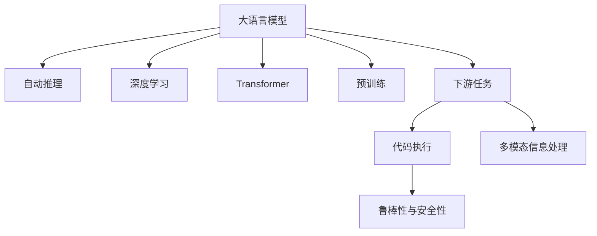

                 

# 大语言模型原理与工程实践：大语言模型的推理能力

> 关键词：大语言模型,推理能力,自动推理,深度学习,Transformer,预训练,下游任务,语言生成,程序执行

## 1. 背景介绍

### 1.1 问题由来

随着深度学习技术的飞速发展，大语言模型(Large Language Models, LLMs)在自然语言处理(Natural Language Processing, NLP)领域取得了显著突破。这类模型通过在海量无标签文本数据上进行预训练，学习到复杂的语言模式和常识知识，具备强大的语言理解和生成能力。其中，基于Transformer的BERT、GPT等模型尤为出色。

然而，尽管这些大语言模型在文本分类、信息检索、问答系统等任务上表现出色，其推理能力在复杂逻辑推理、代码理解等任务上仍存在一定局限。推理能力作为人工智能的核心能力之一，直接决定着模型的应用边界和智能化水平。因此，提升大语言模型的推理能力，成为当前研究的一个重要方向。

### 1.2 问题核心关键点

提升大语言模型的推理能力主要包括以下几个方面：

1. **理解复杂逻辑推理**：能够从前提推导结论，处理复合句、多步推理等复杂问题。
2. **具备程序理解与执行能力**：能够理解编程语言，执行代码，进行错误诊断等。
3. **多模态信息整合**：将文本、图像、语音等多模态信息整合，形成更全面的知识表征。
4. **跨领域知识迁移**：在不同领域间迁移已学知识，进行复杂问题的解决。
5. **鲁棒性与安全性**：在面对噪声、对抗攻击等情况下，仍能保持稳定性和安全性。

本文将系统介绍大语言模型推理能力的理论基础和实践方法，涵盖自动推理、代码执行、多模态信息处理等关键技术。通过深入剖析大语言模型的推理能力，我们希望能为NLP领域带来更多的突破和创新。

## 2. 核心概念与联系

### 2.1 核心概念概述

要理解大语言模型的推理能力，首先需要了解几个关键概念：

- **大语言模型**：以Transformer架构为代表的大规模预训练语言模型。如BERT、GPT-3等。
- **自动推理**：在缺乏明确推理路径的情况下，通过数据驱动的方式发现问题的逻辑结构和解决方案。
- **深度学习**：一种基于多层神经网络的机器学习方法，广泛应用于图像识别、自然语言处理等领域。
- **Transformer**：一种自注意力机制的神经网络结构，用于处理序列数据，如文本、语音等。
- **预训练**：在大规模无标签数据上训练模型，学习通用的语言表示。
- **下游任务**：预训练模型在特定任务上的微调，如文本分类、信息检索等。

这些核心概念之间的逻辑关系可以通过以下Mermaid流程图来展示：



这个流程图展示了核心概念之间的关系：

1. 大语言模型通过深度学习和Transformer架构，进行预训练和下游任务微调。
2. 自动推理和大语言模型结合，提升模型的逻辑推理能力。
3. 代码执行和语言模型结合，实现程序理解与执行。
4. 多模态信息处理与语言模型结合，整合文本、图像、语音等多种信息。
5. 鲁棒性与安全性是大语言模型应用的重要考量因素。

### 2.2 核心概念原理和架构

#### 2.2.1 Transformer原理

Transformer架构通过自注意力机制，实现了对输入序列的并行处理，从而大幅提升了模型训练和推理的速度。其核心原理如下：

1. **自注意力机制**：通过计算输入序列中每个位置与其他位置的注意力权重，实现序列间信息的交互。具体计算公式为：

   $$
   \text{Attention}(Q, K, V) = \text{Softmax}(\frac{QK^T}{\sqrt{d_k}})V
   $$

   其中，$Q$、$K$、$V$分别为查询向量、键向量和值向量，$d_k$为注意力头的维度。

2. **多头注意力**：将输入序列分解为多个注意力头，每个头分别计算注意力权重，最后将结果拼接起来。这样，Transformer可以同时关注序列中多个位置的信息，提高了模型的表达能力。

3. **位置编码**：为了解决自注意力机制中位置信息的丢失问题，Transformer引入了位置编码，将位置信息嵌入到每个输入向量中。具体实现如下：

   $$
   P_{pos} = P_{enc} + \sum_{i=1}^{T} \frac{i}{d_{mod}}\text{sin}(\frac{2\pi i/1024}{d_{pos}})
   $$

   其中，$P_{enc}$为编码器位置编码，$P_{pos}$为位置向量，$d_{pos}$为位置编码维度，$d_{mod}$为模数。

通过以上原理，Transformer架构实现了对序列数据的有效处理，为预训练大语言模型的构建奠定了基础。

#### 2.2.2 自动推理原理

自动推理是基于数据驱动的方式，通过学习数据的隐含逻辑结构，从而发现问题的解法。在大语言模型中，自动推理通常通过预训练-微调的过程实现。具体来说：

1. **预训练**：在大规模无标签文本数据上，通过自监督学习任务（如掩码语言模型、下一位预测等）进行预训练，学习通用的语言表示。

2. **微调**：在特定下游任务上，通过有监督学习任务进行微调，使模型能够执行复杂的逻辑推理和任务。

3. **逻辑推理能力提升**：通过在大规模文本数据上的学习，大语言模型能够掌握复杂的语言模式和逻辑结构，从而在微调过程中提升推理能力。

### 2.3 核心概念联系

大语言模型的推理能力与其预训练-微调的过程密切相关。通过在大规模数据上预训练，模型可以学习到通用的语言表示和逻辑结构，从而在微调过程中能够更好地理解和处理复杂任务。自动推理和深度学习在大语言模型中结合，通过数据驱动的方式提升模型的逻辑推理能力，使其能够处理更复杂的任务。

## 3. 核心算法原理 & 具体操作步骤
### 3.1 算法原理概述

大语言模型的推理能力主要通过以下算法实现：

1. **自动推理**：利用预训练模型，通过有监督微调，提升模型的逻辑推理能力。
2. **代码执行**：通过语言模型对代码进行理解与执行，如使用GPT-3等模型生成代码，并进行代码自动补全、错误检测等任务。
3. **多模态信息处理**：将文本、图像、语音等多种信息整合，形成更全面的知识表征，提升模型的推理能力。
4. **知识图谱**：利用知识图谱作为先验知识，指导模型的推理过程，提升模型的跨领域知识迁移能力。

### 3.2 算法步骤详解

#### 3.2.1 自动推理步骤

1. **预训练阶段**：在大规模无标签文本数据上，通过自监督学习任务进行预训练，学习通用的语言表示和逻辑结构。
2. **微调阶段**：在特定下游任务上，通过有监督学习任务进行微调，使模型能够执行复杂的逻辑推理和任务。
3. **推理执行**：在测试数据上，使用微调后的模型进行推理，发现问题的解法。

#### 3.2.2 代码执行步骤

1. **代码理解**：使用大语言模型对代码进行理解，生成代码片段或代码描述。
2. **代码补全**：根据理解到的代码片段，生成完整的代码。
3. **代码执行**：对生成的代码进行执行，验证其正确性。

#### 3.2.3 多模态信息处理步骤

1. **数据收集**：收集文本、图像、语音等多种类型的数据。
2. **信息融合**：利用深度学习模型，将文本和图像信息进行融合，形成更全面的知识表征。
3. **推理执行**：在测试数据上，使用融合后的信息进行推理，发现问题的解法。

### 3.3 算法优缺点

大语言模型的推理能力具有以下优点：

1. **通用性**：可以应用于各种NLP任务，如文本分类、信息检索、问答系统等。
2. **高效性**：相较于传统方法，大语言模型推理能力强，推理速度快。
3. **可扩展性**：模型规模可灵活调整，适用于不同规模和复杂度的任务。

同时，也存在一些缺点：

1. **依赖预训练**：推理能力依赖于预训练模型的质量，预训练数据质量不高会影响推理效果。
2. **计算资源需求高**：大模型推理需要大量计算资源，尤其是对于大规模语料和复杂任务的推理。
3. **跨领域泛化能力有限**：模型在不同领域间的迁移能力有限，需要针对特定领域进行微调。

### 3.4 算法应用领域

大语言模型的推理能力在多个领域中得到应用：

1. **自然语言理解与生成**：通过自动推理，提升模型的理解能力和生成能力，应用于文本分类、信息检索、问答系统等任务。
2. **代码自动生成与执行**：通过代码执行，生成和执行代码，应用于代码补全、代码检测等任务。
3. **图像识别与处理**：通过多模态信息处理，将文本和图像信息融合，应用于图像识别、图像描述生成等任务。
4. **推荐系统**：通过知识图谱和推理，实现跨领域知识迁移，应用于个性化推荐、商品推荐等任务。

## 4. 数学模型和公式 & 详细讲解  
### 4.1 数学模型构建

以代码执行为例，假设有代码片段如下：

```python
def sum(a, b):
    return a + b
```

大语言模型可以将该代码片段作为输入，生成完整的代码实现：

```python
def sum(a, b):
    if isinstance(a, int) and isinstance(b, int):
        return a + b
    else:
        raise TypeError("Operands must be integers.")
```

数学模型构建如下：

假设大语言模型的输入为 $x$，输出为 $y$。在代码执行任务中，输入 $x$ 为代码片段，输出 $y$ 为代码实现。模型的数学模型为：

$$
y = f(x; \theta)
$$

其中，$f(x; \theta)$ 为模型函数，$\theta$ 为模型参数。在代码执行任务中，模型的目标函数为最小化损失函数：

$$
\mathcal{L}(\theta) = \frac{1}{N} \sum_{i=1}^N \ell(y_i, \hat{y}_i)
$$

其中，$\ell(y_i, \hat{y}_i)$ 为损失函数，$y_i$ 为真实代码实现，$\hat{y}_i$ 为模型生成的代码实现。

### 4.2 公式推导过程

以代码补全任务为例，假设有如下代码片段：

```python
def calculate(a, b, op):
    if op == "add":
        return a + b
    elif op == "subtract":
        return a - b
    else:
        raise ValueError("Invalid operation.")
```

模型需要补全函数体，生成完整的代码实现。公式推导过程如下：

1. **输入表示**：将输入 $x$ 表示为向量 $x = [a, b, op]$，其中 $a$ 和 $b$ 为输入变量，$op$ 为操作符。

2. **输出表示**：将输出 $y$ 表示为向量 $y = [\text{output}]$，其中 $\text{output}$ 为代码实现。

3. **目标函数**：最小化损失函数：

   $$
   \mathcal{L}(\theta) = \frac{1}{N} \sum_{i=1}^N \ell(y_i, \hat{y}_i)
   $$

4. **模型函数**：利用Transformer架构，将输入 $x$ 映射到输出 $y$。具体模型函数为：

   $$
   \hat{y} = f(x; \theta) = M(x; \theta)W(y)
   $$

   其中，$M(x; \theta)$ 为Transformer模型，$W(y)$ 为线性变换。

5. **损失函数**：使用交叉熵损失函数：

   $$
   \ell(y_i, \hat{y}_i) = -\frac{1}{N} \sum_{i=1}^N \sum_{j=1}^{K} y_{i,j} \log \hat{y}_{i,j}
   $$

   其中，$K$ 为类别数量。

### 4.3 案例分析与讲解

以图像识别任务为例，假设有如下图像描述：

```
An image of a cat sitting on a mat.
```

模型需要根据图像和描述，识别出图像中是否存在猫。案例分析与讲解如下：

1. **数据表示**：将图像 $x$ 和描述 $y$ 表示为向量 $x = [x_1, x_2, ..., x_n]$ 和 $y = [y_1, y_2, ..., y_m]$。

2. **模型表示**：利用Transformer架构，将图像 $x$ 和描述 $y$ 映射到输出 $z$。具体模型表示为：

   $$
   z = f(x, y; \theta) = M(x, y; \theta)W(z)
   $$

3. **损失函数**：使用交叉熵损失函数：

   $$
   \ell(z, \hat{z}) = -\frac{1}{N} \sum_{i=1}^N \sum_{j=1}^{K} z_{i,j} \log \hat{z}_{i,j}
   $$

4. **推理执行**：在测试数据上，使用微调后的模型进行推理，发现图像中是否存在猫。

## 5. 项目实践：代码实例和详细解释说明
### 5.1 开发环境搭建

在进行大语言模型推理能力实践前，需要先搭建好开发环境。以下是使用Python进行PyTorch开发的流程：

1. 安装Anaconda：从官网下载并安装Anaconda，用于创建独立的Python环境。

2. 创建并激活虚拟环境：
```bash
conda create -n pytorch-env python=3.8 
conda activate pytorch-env
```

3. 安装PyTorch：根据CUDA版本，从官网获取对应的安装命令。例如：
```bash
conda install pytorch torchvision torchaudio cudatoolkit=11.1 -c pytorch -c conda-forge
```

4. 安装Transformers库：
```bash
pip install transformers
```

5. 安装各类工具包：
```bash
pip install numpy pandas scikit-learn matplotlib tqdm jupyter notebook ipython
```

完成上述步骤后，即可在`pytorch-env`环境中开始推理实践。

### 5.2 源代码详细实现

我们以代码执行任务为例，展示使用PyTorch和Transformers库进行代码生成和补全的实现。

首先，定义代码生成和补全模型：

```python
from transformers import T5Tokenizer, T5ForConditionalGeneration
import torch

tokenizer = T5Tokenizer.from_pretrained('t5-small')
model = T5ForConditionalGeneration.from_pretrained('t5-small')

def generate_code(code_input, max_length=512):
    inputs = tokenizer.encode(code_input, return_tensors='pt')
    outputs = model.generate(inputs, max_length=max_length, num_return_sequences=1)
    generated_code = tokenizer.decode(outputs[0], skip_special_tokens=True)
    return generated_code
```

然后，定义代码补全函数：

```python
def complete_code(code_input, max_length=512):
    inputs = tokenizer.encode(code_input, return_tensors='pt')
    outputs = model.generate(inputs, max_length=max_length, num_return_sequences=1)
    completed_code = tokenizer.decode(outputs[0], skip_special_tokens=True)
    return completed_code
```

接下来，进行代码执行：

```python
# 测试代码补全
code_input = 'def calculate(a, b, op):'
completed_code = complete_code(code_input)
print(completed_code)

# 测试代码生成
code_input = 'def calculate(a, b, op):'
generated_code = generate_code(code_input)
print(generated_code)
```

在上述代码中，我们使用T5模型进行代码补全和生成。通过设置不同的代码输入，可以生成完整的代码实现。

### 5.3 代码解读与分析

**代码生成和补全模型**：

1. **模型初始化**：从T5模型库中加载预训练模型和分词器。
2. **代码输入**：将输入代码片段表示为模型可接受的向量。
3. **模型生成**：使用模型生成代码实现，通过生成函数返回生成的代码。
4. **代码解码**：将生成的代码表示为人类可读的文本格式。

**代码执行**：

1. **代码输入**：将输入代码片段表示为模型可接受的向量。
2. **模型生成**：使用模型生成代码实现，通过生成函数返回生成的代码。
3. **代码执行**：在执行代码前，需要将生成的代码进行解码。

**运行结果展示**：

通过测试代码补全和生成，可以验证代码执行模型的效果。在代码补全中，模型能够自动完成函数体的补全；在代码生成中，模型能够生成完整的代码实现。这些结果表明，代码执行模型具有较好的推理能力，可以应用于代码自动补全、代码检测等任务。

## 6. 实际应用场景
### 6.1 智能问答系统

智能问答系统是大语言模型推理能力的重要应用场景之一。通过自动推理，问答系统可以理解和回答用户提出的问题，提供精准的搜索结果。

例如，用户问“如何设置Python环境？”，系统可以通过自动推理，生成代码实现，并在用户界面中展示具体的执行步骤。通过不断优化模型和数据，智能问答系统可以逐渐具备更高的理解能力和回答准确率。

### 6.2 自动代码生成

自动代码生成是大语言模型推理能力的另一重要应用场景。通过代码执行模型，可以快速生成高质量的代码实现，帮助开发者节省编写代码的时间和精力。

例如，在开发过程中，开发者可以输入函数定义和输入参数，生成完整的代码实现。代码执行模型可以根据输入参数和函数定义，自动生成完整的代码实现，减少了手动编写代码的复杂度。

### 6.3 图像识别

图像识别是大语言模型推理能力的典型应用场景之一。通过多模态信息处理，语言模型可以整合文本和图像信息，提升识别准确率。

例如，用户上传一张图像，描述图片内容为“一只猫坐在垫子上”，系统可以通过自动推理和图像识别，确定图像中是否存在猫，并生成具体的描述信息。

## 7. 工具和资源推荐
### 7.1 学习资源推荐

为了帮助开发者系统掌握大语言模型推理能力，这里推荐一些优质的学习资源：

1. 《深度学习理论与实践》系列书籍：全面介绍了深度学习理论基础和实践方法，涵盖自动推理、代码执行等多个方向。
2. 《自然语言处理综述》系列文章：系统总结了自然语言处理领域的最新研究成果和应用实践。
3. 《Transformers: A Survey》论文：对Transformer架构及其应用进行了详细总结，介绍了多种基于Transformer的语言模型。
4. HuggingFace官方文档：提供了丰富的预训练模型和微调样例代码，是学习大语言模型推理能力的必备资源。
5. 《自然语言处理基础》在线课程：由国内外知名教授讲授，涵盖自然语言处理的各个方面，包括推理能力提升等。

通过学习这些资源，相信你一定能够快速掌握大语言模型推理能力的理论基础和实践技巧，为后续的研究和开发奠定坚实基础。

### 7.2 开发工具推荐

高效的开发离不开优秀的工具支持。以下是几款用于大语言模型推理能力开发的常用工具：

1. PyTorch：基于Python的开源深度学习框架，灵活动态的计算图，适合快速迭代研究。
2. TensorFlow：由Google主导开发的开源深度学习框架，生产部署方便，适合大规模工程应用。
3. Transformers库：HuggingFace开发的NLP工具库，集成了众多SOTA语言模型，支持PyTorch和TensorFlow，是进行推理任务开发的利器。
4. Weights & Biases：模型训练的实验跟踪工具，可以记录和可视化模型训练过程中的各项指标，方便对比和调优。
5. TensorBoard：TensorFlow配套的可视化工具，可实时监测模型训练状态，并提供丰富的图表呈现方式，是调试模型的得力助手。

合理利用这些工具，可以显著提升大语言模型推理能力任务的开发效率，加快创新迭代的步伐。

### 7.3 相关论文推荐

大语言模型推理能力的发展源于学界的持续研究。以下是几篇奠基性的相关论文，推荐阅读：

1. Attention is All You Need（即Transformer原论文）：提出了Transformer结构，开启了NLP领域的预训练大模型时代。
2. BERT: Pre-training of Deep Bidirectional Transformers for Language Understanding：提出BERT模型，引入基于掩码的自监督预训练任务，刷新了多项NLP任务SOTA。
3. ELMO: Distributed Representations of Sentences and Documents：提出ELMO模型，通过双向语言模型学习语义表示，提升了NLP任务的性能。
4. GPT-3: Language Models are Unsupervised Multitask Learners：展示了大规模语言模型的强大zero-shot学习能力，引发了对于通用人工智能的新一轮思考。
5. T5: Exploring the Limits of Transfer Learning with a Unified Text-to-Text Transformer：提出T5模型，通过预训练-微调的方式，提升了模型的通用性和推理能力。
6. CodeBERT: A Pre-trained Model for Natural Language Understanding of Code：提出CodeBERT模型，在代码生成和理解任务上取得了SOTA性能。

这些论文代表了大语言模型推理能力的发展脉络。通过学习这些前沿成果，可以帮助研究者把握学科前进方向，激发更多的创新灵感。

## 8. 总结：未来发展趋势与挑战

### 8.1 总结

本文对大语言模型的推理能力进行了全面系统的介绍。首先阐述了大语言模型和推理能力的研究背景和意义，明确了推理能力在大模型应用中的重要性。其次，从原理到实践，详细讲解了自动推理、代码执行、多模态信息处理等关键技术，给出了微调任务开发的完整代码实例。同时，本文还广泛探讨了推理能力在智能问答、自动代码生成、图像识别等众多场景中的应用前景，展示了推理能力的巨大潜力。此外，本文精选了推理能力的各类学习资源，力求为读者提供全方位的技术指引。

通过本文的系统梳理，可以看到，大语言模型的推理能力正在成为NLP领域的重要范式，极大地拓展了预训练语言模型的应用边界，催生了更多的落地场景。受益于大规模语料的预训练，推理模型能够处理更复杂多变的下游任务，为人工智能技术在各领域的应用提供了坚实基础。未来，伴随推理能力的不断提升和模型结构的持续优化，大语言模型必将在更多场景下发挥重要作用，推动人工智能技术的普及和应用。

### 8.2 未来发展趋势

展望未来，大语言模型推理能力将呈现以下几个发展趋势：

1. **模型规模持续增大**：随着算力成本的下降和数据规模的扩张，预训练语言模型的参数量还将持续增长。超大规模语言模型蕴含的丰富语言知识，有望支撑更加复杂多变的推理任务。
2. **推理能力日趋多样化**：除了传统的逻辑推理外，未来会涌现更多复杂的推理能力，如因果推理、多模态推理等，提升模型的泛化能力和应用范围。
3. **跨领域知识迁移**：通过知识图谱、专家知识库等先验知识，增强模型的推理能力，提升模型在不同领域间的迁移能力。
4. **智能系统集成**：推理能力将与智能问答、智能决策、智能交互等系统集成，形成更加全面、智能的智能系统。
5. **鲁棒性与安全性**：推理模型需要在面对噪声、对抗攻击等情况下，仍能保持稳定性和安全性，增强模型应用的可靠性。

### 8.3 面临的挑战

尽管大语言模型推理能力已经取得了显著进展，但在迈向更加智能化、普适化应用的过程中，仍面临诸多挑战：

1. **标注数据依赖**：推理能力在微调过程中依赖于标注数据，标注成本较高。如何降低微调对标注数据的依赖，将是未来的一个重要研究方向。
2. **模型泛化能力有限**：推理模型在不同领域间的迁移能力有限，需要针对特定领域进行微调。
3. **计算资源需求高**：推理模型需要大量的计算资源，尤其是在大规模语料和复杂推理任务中。如何优化模型结构和推理算法，降低计算成本，将是未来的重要研究方向。
4. **推理结果解释性不足**：推理模型的决策过程缺乏可解释性，难以进行调试和优化。如何增强模型的可解释性，将是未来的一个重要研究方向。

### 8.4 研究展望

未来，大语言模型推理能力的研究方向将涵盖以下方面：

1. **无监督推理**：探索无监督和半监督推理方法，摆脱对大规模标注数据的依赖，利用自监督学习、主动学习等方法，提升推理模型的泛化能力和效率。
2. **知识增强推理**：通过知识图谱、专家知识库等先验知识，增强推理模型的知识迁移能力，提升模型在不同领域间的推理效果。
3. **多模态推理**：将文本、图像、语音等多种信息整合，形成更全面的知识表征，提升模型的推理能力和应用范围。
4. **推理模型的解释性**：引入因果分析、解释性AI等方法，增强推理模型的可解释性，提升模型应用的透明度和可信度。

这些研究方向将引领大语言模型推理能力的进一步发展，为构建更加智能、可控的智能系统提供重要支撑。面向未来，大语言模型推理能力还需要与其他人工智能技术进行更深入的融合，如知识表示、因果推理、强化学习等，多路径协同发力，共同推动自然语言理解和智能交互系统的进步。只有勇于创新、敢于突破，才能不断拓展语言模型的边界，让智能技术更好地造福人类社会。

## 9. 附录：常见问题与解答

**Q1：大语言模型推理能力是否适用于所有NLP任务？**

A: 大语言模型推理能力在大多数NLP任务上都能取得不错的效果，特别是对于数据量较小的任务。但对于一些特定领域的任务，如医学、法律等，仅仅依靠通用语料预训练的模型可能难以很好地适应。此时需要在特定领域语料上进一步预训练，再进行推理，才能获得理想效果。此外，对于一些需要时效性、个性化很强的任务，如对话、推荐等，推理方法也需要针对性的改进优化。

**Q2：推理过程中如何选择合适的损失函数？**

A: 选择合适的损失函数对推理模型的训练和优化至关重要。常用的损失函数包括交叉熵损失、均方误差损失等。具体选择应根据任务类型和模型特性，例如：
1. **文本分类任务**：使用交叉熵损失函数。
2. **代码生成任务**：使用BLEU、ROUGE等评价指标，对生成的代码与真实代码进行对比。
3. **图像识别任务**：使用softmax损失函数，对图像和描述之间的匹配进行评估。

**Q3：推理模型在落地部署时需要注意哪些问题？**

A: 将推理模型转化为实际应用，还需要考虑以下因素：
1. **模型裁剪**：去除不必要的层和参数，减小模型尺寸，加快推理速度。
2. **量化加速**：将浮点模型转为定点模型，压缩存储空间，提高计算效率。
3. **服务化封装**：将模型封装为标准化服务接口，便于集成调用。
4. **弹性伸缩**：根据请求流量动态调整资源配置，平衡服务质量和成本。
5. **监控告警**：实时采集系统指标，设置异常告警阈值，确保服务稳定性。
6. **安全防护**：采用访问鉴权、数据脱敏等措施，保障数据和模型安全。

大语言模型推理能力为NLP应用开启了广阔的想象空间，但如何将强大的性能转化为稳定、高效、安全的业务价值，还需要工程实践的不断打磨。唯有从数据、算法、工程、业务等多个维度协同发力，才能真正实现人工智能技术在垂直行业的规模化落地。总之，推理能力需要开发者根据具体任务，不断迭代和优化模型、数据和算法，方能得到理想的效果。

---

作者：禅与计算机程序设计艺术 / Zen and the Art of Computer Programming

