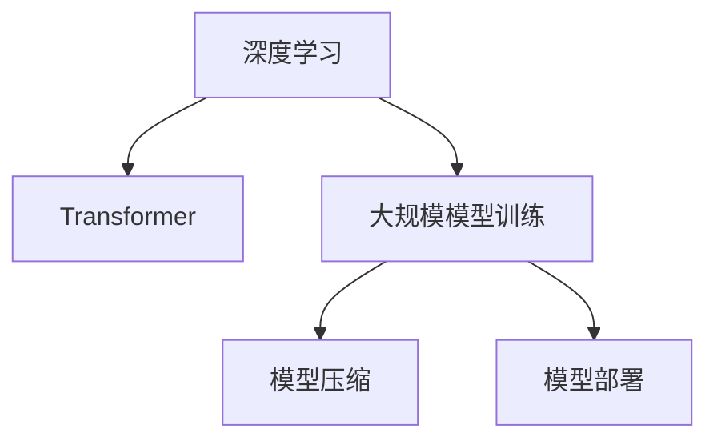

                 

# 大语言模型原理与工程实践：手把手教你训练 7B 大语言模型 主要模块介绍

> 关键词：大语言模型,深度学习,自然语言处理(NLP),Transformer,BERT,大规模模型训练,模型压缩,模型部署

## 1. 背景介绍

### 1.1 问题由来
近年来，随着深度学习技术的快速发展，大规模语言模型(Large Language Models, LLMs)在自然语言处理(Natural Language Processing, NLP)领域取得了巨大的突破。这些大语言模型通过在海量无标签文本数据上进行预训练，学习到了丰富的语言知识和常识，具备强大的语言理解和生成能力。

例如，OpenAI的GPT-3模型，基于Transformer架构，在语料库上进行自监督训练，参数量达17.5亿，成为历史上最大的语言模型。Google的BERT模型，基于掩码语言模型，参数量达3.4亿，在多个NLP任务上刷新了最先进性能。

这些大模型证明了基于大规模预训练的语言模型在处理自然语言任务上的强大能力，成为NLP研究与应用的新范式。

### 1.2 问题核心关键点
本节将详细介绍如何基于深度学习技术，通过Transformer架构训练大规模语言模型，并在实际应用中发挥其强大的语言理解与生成能力。

## 2. 核心概念与联系

### 2.1 核心概念概述

为更好地理解训练7B大语言模型的过程，本节将介绍几个密切相关的核心概念：

- 深度学习(Deep Learning)：使用多层神经网络进行模式识别的学习范式。通过多层神经网络从数据中提取特征，不断优化模型参数，学习到复杂的模式。
- 自然语言处理(Natural Language Processing, NLP)：处理、理解、生成自然语言的技术。NLP是深度学习的重要应用领域之一。
- Transformer：一种基于自注意力机制的神经网络结构，在语言模型中表现优异。Transformer架构简化了序列建模的复杂度，提高了模型的训练效率。
- 大规模模型(Mega-scale Models)：参数量达到数十亿甚至上百亿的深度学习模型。这些模型通常需要消耗大量的计算资源进行训练。
- 模型压缩(Model Compression)：在保持模型性能不变或损失可控的前提下，通过优化模型结构、剪枝、量化等手段，减少模型参数和计算资源消耗的过程。
- 模型部署(Model Deployment)：将训练好的模型集成到实际应用中，提供服务接口的过程。模型部署涉及模型的保存、导出、优化、推理等环节。

这些核心概念之间的逻辑关系可以通过以下Mermaid流程图来展示：



这个流程图展示了大规模语言模型训练、压缩和部署的核心流程：

1. 深度学习提供了训练大规模模型的理论基础。
2. Transformer架构简化了模型设计，适合处理序列数据。
3. 大规模模型训练需要消耗大量的计算资源，并通过反向传播算法进行优化。
4. 模型压缩能够减小模型规模，提升推理效率。
5. 模型部署将训练好的模型集成到应用中，提供服务接口。

这些概念共同构成了大规模语言模型的训练和应用框架，使得大模型能够成为智能应用的核心组件。

## 3. 核心算法原理 & 具体操作步骤
### 3.1 算法原理概述

训练大规模语言模型，本质上是一个优化问题。假设模型参数为 $\theta$，训练集为 $D=\{(x_i, y_i)\}_{i=1}^N$，其中 $x_i$ 为输入文本，$y_i$ 为对应的输出标签。模型的目标是最大化对数似然函数，即：

$$
\mathcal{L}(\theta) = \frac{1}{N} \sum_{i=1}^N \log p(y_i|x_i)
$$

其中 $p(y_i|x_i)$ 表示模型在给定输入 $x_i$ 时，预测输出 $y_i$ 的概率分布。为了最大化对数似然函数，需要求解以下优化问题：

$$
\min_{\theta} \mathcal{L}(\theta) = \min_{\theta} \frac{1}{N} \sum_{i=1}^N \log p(y_i|x_i)
$$

求解这个优化问题通常使用梯度下降等优化算法。模型通过反向传播算法计算每个参数的梯度，并利用梯度下降更新模型参数。

### 3.2 算法步骤详解

训练大规模语言模型的主要步骤包括：

**Step 1: 准备数据集**
- 收集大规模无标签文本数据，如Common Crawl、维基百科等。数据集越大，模型学到的知识越丰富。
- 将数据集划分为训练集、验证集和测试集，通常采用分层采样或随机采样等方式。

**Step 2: 构建模型架构**
- 选择Transformer架构，包含编码器和解码器。通常选择12层或24层的Transformer模型。
- 确定模型输入输出维度、隐藏维度、注意力头数、层数等关键超参数。

**Step 3: 初始化模型参数**
- 使用随机初始化对模型参数进行初始化，如Xavier或He初始化等。
- 使用Xavier等初始化方法，使得模型参数值在训练过程中更易于优化。

**Step 4: 定义损失函数**
- 通常使用交叉熵损失函数或均方误差损失函数。
- 定义模型在每个样本上的预测概率分布，计算与真实标签之间的交叉熵或均方误差。

**Step 5: 训练模型**
- 使用梯度下降等优化算法，如Adam或SGD，更新模型参数。
- 设置学习率、批大小、迭代轮数等超参数，进行模型训练。

**Step 6: 模型评估**
- 在验证集上评估模型性能，使用BLEU、ROUGE等指标进行评价。
- 根据验证集上的性能，调整模型参数和超参数。

**Step 7: 模型保存与部署**
- 将训练好的模型保存为TensorFlow SavedModel或PyTorch模型文件。
- 将模型部署到服务器或云平台上，提供API接口供应用调用。

### 3.3 算法优缺点

训练大规模语言模型具有以下优点：
1. 强大的语言理解和生成能力。大规模模型通过大量数据训练，可以学习到丰富的语言知识和常识，从而在语言理解和生成任务上表现优异。
2. 适用于多种NLP任务。无论是文本分类、问答、翻译还是文本生成等任务，大规模语言模型都能提供良好的性能。
3. 快速适应新任务。通过微调，大规模模型可以快速适应新任务的特征，提升性能。
4. 能够处理海量数据。大规模模型能够处理更大规模的数据，从而学习到更丰富的语言知识。

然而，训练大规模语言模型也存在一些缺点：
1. 计算资源消耗大。大规模模型的训练需要消耗大量的计算资源，通常需要多台GPU或TPU协同训练。
2. 训练时间长。大规模模型训练通常需要数周甚至数月的计算时间，训练效率较低。
3. 存储需求高。大规模模型通常需要存储海量参数和计算图，存储需求较高。
4. 模型压缩难度大。由于模型参数众多，压缩难度较大，需要采用更为复杂的优化方法。

尽管存在这些局限性，但大规模语言模型在NLP领域的应用前景广阔，尤其是在处理大规模自然语言任务时，其优势难以被其他方法替代。

### 3.4 算法应用领域

大规模语言模型已经在诸多NLP任务上取得了卓越的性能，以下是几个主要的应用领域：

1. **文本分类**：将文本数据分类到预先定义的类别中。如情感分析、主题分类、意图识别等。大规模语言模型可以通过分类任务进行训练，学习文本与类别之间的关系。
2. **问答系统**：回答用户提出的自然语言问题。大规模语言模型通过查询-对话数据对进行训练，学习生成合适的回复。
3. **机器翻译**：将源语言文本翻译成目标语言。大规模语言模型可以通过翻译任务进行训练，学习语言之间的映射关系。
4. **文本生成**：生成新的文本，如文章摘要、对话内容等。大规模语言模型可以通过文本生成任务进行训练，学习生成连贯、自然的语言。
5. **信息检索**：根据用户查询，从大量文本数据中检索相关信息。大规模语言模型可以通过检索任务进行训练，学习文本之间的关系。

大规模语言模型在上述任务中的应用，展示了其在处理大规模自然语言任务时的强大能力。

## 4. 数学模型和公式 & 详细讲解 & 举例说明（备注：数学公式请使用latex格式，latex嵌入文中独立段落使用 $$，段落内使用 $)
### 4.1 数学模型构建

定义大规模语言模型的输入为 $x$，输出为 $y$。模型由多个编码器和解码器组成，每个编码器和解码器由多层Transformer层构成。假设模型参数为 $\theta$，模型在输入 $x$ 上的概率分布为 $p(y|x)$。模型的目标是最小化交叉熵损失函数：

$$
\mathcal{L}(\theta) = -\frac{1}{N}\sum_{i=1}^N \log p(y_i|x_i)
$$

其中 $y_i$ 表示输入 $x_i$ 对应的标签，$N$ 表示样本数量。

### 4.2 公式推导过程

假设模型由 $M$ 个编码器和 $N$ 个解码器组成，每个编码器和解码器包含 $L$ 层Transformer层。假设第 $l$ 层的输入为 $x_l$，输出为 $x_l^{\prime}$，则Transformer层的计算过程如下：

$$
x_l^{\prime} = \text{Attention}(x_l, x_l, x_l)
$$

其中 $\text{Attention}(\cdot)$ 表示自注意力机制，计算每个位置的注意力权重。自注意力机制的计算过程如下：

$$
\text{Attention}(Q, K, V) = \text{Softmax}(\frac{QK^T}{\sqrt{d_k}})V
$$

其中 $Q, K, V$ 分别表示查询、键、值矩阵，$d_k$ 表示键的维度。

通过上述过程，可以将输入 $x$ 逐步传递到编码器和解码器中，最终输出概率分布 $p(y|x)$。模型的损失函数为：

$$
\mathcal{L}(\theta) = -\frac{1}{N}\sum_{i=1}^N \log p(y_i|x_i)
$$

使用梯度下降等优化算法，最小化损失函数 $\mathcal{L}(\theta)$，从而优化模型参数 $\theta$。

### 4.3 案例分析与讲解

以Bert模型为例，其包含12个编码器，每个编码器包含6个Transformer层。假设模型输入为 $x=[\text{CLS}, x, \text{SEP}]$，其中 $\text{CLS}$ 表示特殊标记，$x$ 表示输入文本，$\text{SEP}$ 表示句子分隔标记。Bert模型的计算过程如下：

1. 输入嵌入层：将输入文本转换为向量表示。
2. 多层Transformer层：通过多层的自注意力机制和前向神经网络计算输出。
3. 池化层：使用特殊标记 $\text{CLS}$ 的向量表示作为模型的输出。

通过上述过程，Bert模型能够从大规模无标签文本数据中学习到丰富的语言知识和常识，从而在多种NLP任务上表现优异。

## 5. 项目实践：代码实例和详细解释说明
### 5.1 开发环境搭建

在进行大规模语言模型训练之前，需要准备好开发环境。以下是使用Python进行TensorFlow进行模型训练的环境配置流程：

1. 安装Anaconda：从官网下载并安装Anaconda，用于创建独立的Python环境。

2. 创建并激活虚拟环境：
```bash
conda create -n tf-env python=3.8 
conda activate tf-env
```

3. 安装TensorFlow：根据CUDA版本，从官网获取对应的安装命令。例如：
```bash
conda install tensorflow tensorflow-gpu==2.8 -c pytorch -c conda-forge
```

4. 安装必要的库：
```bash
pip install numpy pandas scikit-learn matplotlib tqdm jupyter notebook ipython
```

完成上述步骤后，即可在`tf-env`环境中开始模型训练。

### 5.2 源代码详细实现

下面我们以BERT模型为例，给出使用TensorFlow进行语言模型训练的代码实现。

首先，定义模型和数据处理函数：

```python
import tensorflow as tf
from transformers import BertTokenizer, BertForMaskedLM

# 加载预训练BERT模型和分词器
tokenizer = BertTokenizer.from_pretrained('bert-base-uncased')
model = BertForMaskedLM.from_pretrained('bert-base-uncased')

# 定义模型输入和输出
input_ids = tf.keras.layers.Input(shape=(512,), dtype=tf.int32)
labels = tf.keras.layers.Input(shape=(512,), dtype=tf.int32)
outputs = model(input_ids, labels)
```

接着，定义优化器和损失函数：

```python
optimizer = tf.keras.optimizers.Adam(learning_rate=2e-5)
loss_fn = tf.keras.losses.SparseCategoricalCrossentropy(from_logits=True)

# 定义训练步骤
@tf.function
def train_step(inputs, labels):
    with tf.GradientTape() as tape:
        logits = model(inputs, labels)
        loss = loss_fn(labels, logits)
    gradients = tape.gradient(loss, model.trainable_variables)
    optimizer.apply_gradients(zip(gradients, model.trainable_variables))
    return loss
```

最后，启动模型训练流程：

```python
# 定义训练超参数
batch_size = 32
epochs = 5

# 加载训练数据
train_data = ... # 训练数据的token ids和标签

# 训练模型
for epoch in range(epochs):
    total_loss = 0.0
    for batch in train_data:
        batch_loss = train_step(batch['input_ids'], batch['labels'])
        total_loss += batch_loss
    print(f'Epoch {epoch+1}, loss: {total_loss/len(train_data)}')
```

以上就是使用TensorFlow进行BERT模型训练的完整代码实现。可以看到，TensorFlow的tf.function和tf.GradientTape等特性使得模型训练过程简洁高效。

### 5.3 代码解读与分析

让我们再详细解读一下关键代码的实现细节：

**模型定义**：
- 使用BertTokenizer对输入文本进行分词和标记，得到token ids。
- 使用BertForMaskedLM模型进行计算，返回模型的预测结果。

**优化器和损失函数**：
- 使用Adam优化器，设置学习率为2e-5。
- 使用SparseCategoricalCrossentropy作为损失函数，适用于多分类问题。

**训练步骤**：
- 定义train_step函数，使用tf.GradientTape记录梯度。
- 计算损失函数，并使用optimizer应用梯度更新模型参数。
- 在训练循环中，通过batch加载数据，并逐批进行训练。

通过上述过程，可以快速实现大规模语言模型的训练。

## 6. 实际应用场景
### 6.1 智能客服系统

基于大规模语言模型训练的智能客服系统，可以提供7x24小时不间断服务，快速响应客户咨询，用自然流畅的语言解答各类常见问题。

在技术实现上，可以收集企业内部的历史客服对话记录，将问题和最佳答复构建成监督数据，在此基础上对预训练的BERT模型进行微调。微调后的客服模型能够自动理解用户意图，匹配最合适的答复。对于客户提出的新问题，还可以接入检索系统实时搜索相关内容，动态组织生成回答。

### 6.2 金融舆情监测

金融机构需要实时监测市场舆论动向，以便及时应对负面信息传播，规避金融风险。传统的人工监测方式成本高、效率低，难以应对网络时代海量信息爆发的挑战。基于大规模语言模型训练的文本分类和情感分析技术，为金融舆情监测提供了新的解决方案。

具体而言，可以收集金融领域相关的新闻、报道、评论等文本数据，并对其进行主题标注和情感标注。在此基础上对BERT模型进行微调，使其能够自动判断文本属于何种主题，情感倾向是正面、中性还是负面。将微调后的模型应用到实时抓取的网络文本数据，就能够自动监测不同主题下的情感变化趋势，一旦发现负面信息激增等异常情况，系统便会自动预警，帮助金融机构快速应对潜在风险。

### 6.3 个性化推荐系统

当前的推荐系统往往只依赖用户的历史行为数据进行物品推荐，无法深入理解用户的真实兴趣偏好。基于大规模语言模型训练的个性化推荐系统，可以更好地挖掘用户行为背后的语义信息，从而提供更精准、多样的推荐内容。

在实践中，可以收集用户浏览、点击、评论、分享等行为数据，提取和用户交互的物品标题、描述、标签等文本内容。将文本内容作为模型输入，用户的后续行为（如是否点击、购买等）作为监督信号，在此基础上微调BERT模型。微调后的模型能够从文本内容中准确把握用户的兴趣点。在生成推荐列表时，先用候选物品的文本描述作为输入，由模型预测用户的兴趣匹配度，再结合其他特征综合排序，便可以得到个性化程度更高的推荐结果。

### 6.4 未来应用展望

随着大规模语言模型和微调方法的不断发展，基于微调范式将在更多领域得到应用，为传统行业带来变革性影响。

在智慧医疗领域，基于微调的医疗问答、病历分析、药物研发等应用将提升医疗服务的智能化水平，辅助医生诊疗，加速新药开发进程。

在智能教育领域，微调技术可应用于作业批改、学情分析、知识推荐等方面，因材施教，促进教育公平，提高教学质量。

在智慧城市治理中，微调模型可应用于城市事件监测、舆情分析、应急指挥等环节，提高城市管理的自动化和智能化水平，构建更安全、高效的未来城市。

此外，在企业生产、社会治理、文娱传媒等众多领域，基于大规模语言模型微调的人工智能应用也将不断涌现，为经济社会发展注入新的动力。相信随着技术的日益成熟，微调方法将成为人工智能落地应用的重要范式，推动人工智能技术在垂直行业的规模化落地。

## 7. 工具和资源推荐
### 7.1 学习资源推荐

为了帮助开发者系统掌握大规模语言模型训练的理论基础和实践技巧，这里推荐一些优质的学习资源：

1. 《深度学习》系列书籍：由Deep Learning Specialization团队撰写，涵盖了深度学习的理论基础和实践技巧，适合入门学习。
2. CS224N《自然语言处理与深度学习》课程：斯坦福大学开设的NLP明星课程，有Lecture视频和配套作业，带你深入理解NLP技术。
3. 《Attention is All You Need》论文：Transformer的原始论文，详细介绍了Transformer架构的设计思想。
4. 《BERT: Pre-training of Deep Bidirectional Transformers for Language Understanding》论文：BERT模型的原始论文，详细介绍了BERT模型的训练过程和效果。
5. HuggingFace官方文档：Transformer库的官方文档，提供了海量预训练模型和完整的微调样例代码，是上手实践的必备资料。

通过对这些资源的学习实践，相信你一定能够快速掌握大规模语言模型训练的精髓，并用于解决实际的NLP问题。

### 7.2 开发工具推荐

高效的开发离不开优秀的工具支持。以下是几款用于大规模语言模型训练开发的常用工具：

1. TensorFlow：由Google主导开发的开源深度学习框架，生产部署方便，适合大规模工程应用。
2. PyTorch：基于Python的开源深度学习框架，灵活动态的计算图，适合快速迭代研究。
3. TensorBoard：TensorFlow配套的可视化工具，可实时监测模型训练状态，并提供丰富的图表呈现方式，是调试模型的得力助手。
4. Weights & Biases：模型训练的实验跟踪工具，可以记录和可视化模型训练过程中的各项指标，方便对比和调优。
5. Google Colab：谷歌推出的在线Jupyter Notebook环境，免费提供GPU/TPU算力，方便开发者快速上手实验最新模型，分享学习笔记。

合理利用这些工具，可以显著提升大规模语言模型训练的开发效率，加快创新迭代的步伐。

### 7.3 相关论文推荐

大规模语言模型和微调技术的发展源于学界的持续研究。以下是几篇奠基性的相关论文，推荐阅读：

1. Attention is All You Need：提出了Transformer结构，开启了NLP领域的预训练大模型时代。
2. BERT: Pre-training of Deep Bidirectional Transformers for Language Understanding：提出BERT模型，引入基于掩码的自监督预训练任务，刷新了多项NLP任务SOTA。
3. Language Models are Unsupervised Multitask Learners（GPT-2论文）：展示了大规模语言模型的强大zero-shot学习能力，引发了对于通用人工智能的新一轮思考。
4. Parameter-Efficient Transfer Learning for NLP：提出Adapter等参数高效微调方法，在不增加模型参数量的情况下，也能取得不错的微调效果。
5. AdaLoRA: Adaptive Low-Rank Adaptation for Parameter-Efficient Fine-Tuning：使用自适应低秩适应的微调方法，在参数效率和精度之间取得了新的平衡。

这些论文代表了大规模语言模型训练技术的发展脉络。通过学习这些前沿成果，可以帮助研究者把握学科前进方向，激发更多的创新灵感。

## 8. 总结：未来发展趋势与挑战

### 8.1 总结

本文对大规模语言模型的训练过程进行了详细讲解。首先介绍了深度学习、自然语言处理和Transformer等核心概念，明确了它们之间的联系和区别。然后，从算法原理和具体操作步骤两方面，系统地介绍了大规模语言模型训练的流程。最后，通过具体案例和实际应用，展示了大规模语言模型在NLP领域的应用前景。

通过本文的系统梳理，可以看到，基于大规模语言模型的训练方法已经在NLP领域得到了广泛的应用，为智能应用提供了强大的语言理解和生成能力。未来，伴随深度学习技术的不断进步，大规模语言模型将具有更广阔的应用前景，为人工智能技术的发展注入新的动力。

### 8.2 未来发展趋势

展望未来，大规模语言模型训练技术将呈现以下几个发展趋势：

1. 模型规模持续增大。随着算力成本的下降和数据规模的扩张，大规模语言模型的参数量还将进一步增加。超大规模语言模型蕴含的丰富语言知识，有望支撑更加复杂多变的下游任务训练。
2. 训练效率提升。随着硬件设备的不断改进和优化，大规模语言模型的训练效率将得到显著提升。同时，分布式训练和优化算法也将带来更大的突破。
3. 模型压缩和优化。随着模型参数量的增加，模型压缩和优化变得尤为重要。未来的研究将更多关注模型压缩、剪枝和量化等技术，减小模型规模，提升推理效率。
4. 跨领域和多模态学习。未来的模型将更多关注跨领域和多模态学习的技术，使得模型能够处理更广泛的数据类型和任务。
5. 模型可解释性和公平性。随着模型规模的增加，模型的可解释性和公平性问题也将成为研究的重点。未来的研究将更多关注模型的解释性和公平性，确保模型输出的透明和公正。

以上趋势凸显了大规模语言模型训练技术的广阔前景。这些方向的探索发展，必将进一步提升NLP系统的性能和应用范围，为人类认知智能的进化带来深远影响。

### 8.3 面临的挑战

尽管大规模语言模型训练技术已经取得了瞩目成就，但在迈向更加智能化、普适化应用的过程中，它仍面临着诸多挑战：

1. 计算资源瓶颈。大规模模型的训练需要消耗大量的计算资源，如GPU/TPU等高性能设备。这将对模型的训练和部署带来挑战。
2. 训练时间过长。大规模模型的训练时间往往非常长，需要耗费大量时间和计算资源。这将对模型的开发和应用带来挑战。
3. 模型存储需求高。大规模模型通常需要存储海量参数和计算图，存储需求较高。这将对模型的保存和部署带来挑战。
4. 模型压缩难度大。由于模型参数众多，压缩难度较大，需要采用更为复杂的优化方法。
5. 模型可解释性不足。大规模语言模型往往被视为"黑盒"系统，难以解释其内部工作机制和决策逻辑。这将对模型的调试和优化带来挑战。

尽管存在这些挑战，但大规模语言模型训练技术的未来前景广阔，将在NLP领域发挥更大的作用。相信随着学界和产业界的共同努力，这些挑战终将一一被克服，大规模语言模型训练技术必将在构建人机协同的智能时代中扮演越来越重要的角色。

### 8.4 研究展望

未来，大规模语言模型训练技术需要在以下几个方面寻求新的突破：

1. 探索无监督和半监督训练方法。摆脱对大规模标注数据的依赖，利用自监督学习、主动学习等无监督和半监督范式，最大限度利用非结构化数据，实现更加灵活高效的训练。
2. 研究参数高效和计算高效的训练范式。开发更加参数高效的训练方法，在固定大部分预训练参数的同时，只更新极少量的任务相关参数。同时优化训练模型的计算图，减少前向传播和反向传播的资源消耗，实现更加轻量级、实时性的部署。
3. 融合因果和对比学习范式。通过引入因果推断和对比学习思想，增强模型的建立稳定因果关系的能力，学习更加普适、鲁棒的语言表征，从而提升模型的泛化性和抗干扰能力。
4. 引入更多先验知识。将符号化的先验知识，如知识图谱、逻辑规则等，与神经网络模型进行巧妙融合，引导训练过程学习更准确、合理的语言模型。同时加强不同模态数据的整合，实现视觉、语音等多模态信息与文本信息的协同建模。
5. 结合因果分析和博弈论工具。将因果分析方法引入训练模型，识别出模型决策的关键特征，增强输出解释的因果性和逻辑性。借助博弈论工具刻画人机交互过程，主动探索并规避模型的脆弱点，提高系统稳定性。
6. 纳入伦理道德约束。在模型训练目标中引入伦理导向的评估指标，过滤和惩罚有偏见、有害的输出倾向。同时加强人工干预和审核，建立模型行为的监管机制，确保输出符合人类价值观和伦理道德。

这些研究方向的探索，必将引领大规模语言模型训练技术迈向更高的台阶，为构建安全、可靠、可解释、可控的智能系统铺平道路。面向未来，大规模语言模型训练技术还需要与其他人工智能技术进行更深入的融合，如知识表示、因果推理、强化学习等，多路径协同发力，共同推动自然语言理解和智能交互系统的进步。只有勇于创新、敢于突破，才能不断拓展语言模型的边界，让智能技术更好地造福人类社会。

## 9. 附录：常见问题与解答

**Q1：大规模语言模型训练需要哪些计算资源？**

A: 大规模语言模型训练需要大量的计算资源，通常需要多台GPU或TPU协同训练。具体来说，训练一个包含12层的BERT模型，通常需要8张V100 GPU，训练一个包含24层的BERT模型，通常需要16张V100 GPU。同时，还需要使用大容量存储和高速网络，以支持模型的数据读取和模型参数的存储。

**Q2：大规模语言模型训练耗时有多长？**

A: 大规模语言模型训练耗时通常非常长，通常需要数周甚至数月的计算时间。例如，训练一个包含24层的BERT模型，通常需要5-10天，训练一个包含32层的BERT模型，通常需要10-20天。训练效率受到计算资源和模型规模的影响。

**Q3：大规模语言模型压缩的难度有多大？**

A: 大规模语言模型压缩的难度较大，因为模型参数众多，且模型结构和训练过程较为复杂。常用的压缩方法包括剪枝、量化、低秩逼近等，这些方法在实际应用中取得了一定的效果，但仍有优化空间。未来的研究将更多关注参数高效和计算高效的训练范式，进一步提高模型的压缩效率。

**Q4：大规模语言模型的可解释性如何？**

A: 大规模语言模型通常被视为"黑盒"系统，难以解释其内部工作机制和决策逻辑。这使得模型的调试和优化变得困难。未来的研究将更多关注模型的可解释性，通过引入因果分析和博弈论工具，增强模型的输出解释性，确保模型的透明性和公正性。

**Q5：大规模语言模型在实际应用中如何部署？**

A: 大规模语言模型在实际应用中，通常需要将其部署到服务器或云平台上，提供API接口供应用调用。部署过程包括模型的保存、导出、优化、推理等环节。常用的部署平台包括AWS、Google Cloud、阿里云等，这些平台提供了丰富的计算资源和优化工具，方便大规模语言模型的部署和调用。

---

作者：禅与计算机程序设计艺术 / Zen and the Art of Computer Programming

