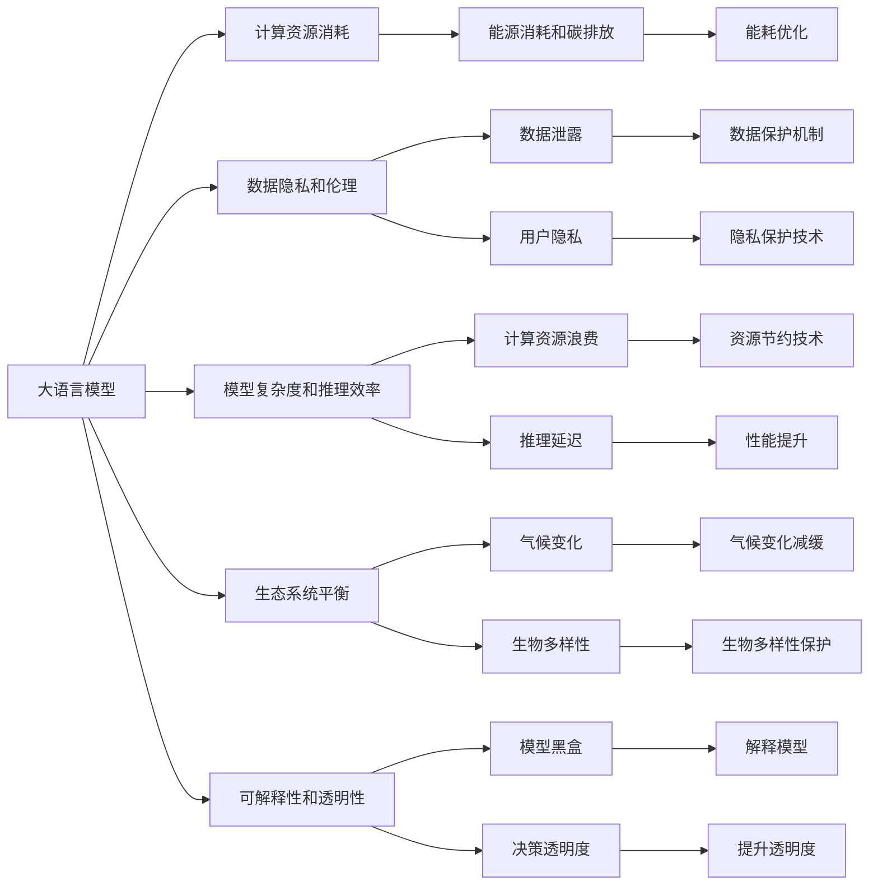

                 

# 大语言模型原理基础与前沿 环境影响

## 1. 背景介绍

### 1.1 问题由来

近年来，人工智能领域发生了翻天覆地的变化，深度学习技术的发展，尤其是大语言模型(Large Language Models, LLMs)的兴起，极大地推动了自然语言处理(Natural Language Processing, NLP)技术的发展。LLMs如BERT、GPT系列模型通过在大规模无标签文本数据上进行预训练，学习到了丰富的语言知识和常识，通过微调(Fine-tuning)能够适应各种下游任务，成为NLP领域的重要工具。

然而，随着大语言模型的广泛应用，其对环境的影响逐渐成为人们关注的焦点。大模型的训练和部署需要大量计算资源，能耗巨大；同时，模型在推断和推理过程中，也可能对环境产生影响。因此，研究大语言模型在训练和推理过程中的环境影响，具有重要意义。

### 1.2 问题核心关键点

大语言模型的环境影响主要包括以下几个方面：

- **计算资源消耗**：大模型训练所需的大量计算资源，对能源消耗和碳排放有直接影响。
- **数据隐私和伦理**：大模型的预训练和微调依赖大量的数据，数据隐私保护和伦理问题需引起注意。
- **模型复杂度和推理效率**：大模型的复杂度增加可能带来推理效率的下降，影响实际应用场景的响应速度。
- **生态系统平衡**：LLMs在推断时对环境可能产生影响，如气候变化、生物多样性等。
- **可解释性和透明性**：大模型的决策过程复杂，缺乏可解释性，可能会对环境和伦理带来不确定影响。

### 1.3 问题研究意义

研究大语言模型的环境影响，对于构建可持续发展的AI生态，推动绿色计算技术，具有重要的理论意义和实践价值：

1. **推动绿色计算**：优化大模型训练和推理过程，降低能源消耗，有助于减少碳排放，推动AI技术的绿色化发展。
2. **数据隐私保护**：研究大模型的数据隐私保护机制，保障用户数据安全和隐私权。
3. **提升模型可解释性**：增强大模型的可解释性，便于理解和调试模型，减少环境风险。
4. **促进环保教育**：通过AI技术提高公众对环境问题的认识，推动环境保护。
5. **构建可持续发展AI生态**：研究大语言模型在各种环境下的表现，促进其在实际应用中的可持续发展。

## 2. 核心概念与联系

### 2.1 核心概念概述

为更好地理解大语言模型在环境中的影响，我们首先介绍一些核心概念及其相互联系：

- **大语言模型(Large Language Model, LLM)**：以Transformer结构为代表，通过在大规模无标签数据上进行预训练，学习语言的通用表示，具备强大的语言理解和生成能力。
- **环境影响(Environmental Impact)**：指大语言模型在训练和推理过程中对环境造成的各种负面影响。
- **绿色计算(Green Computing)**：指在计算过程中，采取节能、环保的措施，减少资源消耗和碳排放。
- **数据隐私(Data Privacy)**：指个人或组织的隐私数据在收集、存储、使用和传输过程中的保护。
- **伦理(Ethics)**：指在AI技术设计和应用过程中，遵循的道德标准和规范，包括公平性、透明度、可解释性等。
- **模型复杂度(Model Complexity)**：指模型参数规模、结构复杂度等因素。
- **推理效率(Inference Efficiency)**：指模型推理时的计算速度和资源占用。

这些概念之间相互交织，共同构成了大语言模型在环境中的影响框架。

### 2.2 核心概念原理和架构的 Mermaid 流程图



该流程图展示了大语言模型与环境影响之间的逻辑关系：

1. 大语言模型通过计算资源进行训练和推理，对环境产生直接影响。
2. 数据隐私和伦理在大模型的预训练和微调中起到重要作用，涉及数据收集和处理的标准。
3. 模型复杂度影响推理效率和资源消耗，需要优化以提高计算效率。
4. 生态系统平衡和可解释性是大语言模型在实际应用中需考虑的环境和伦理问题。
5. 能源消耗和碳排放、数据隐私保护、资源节约技术等是绿色计算和环保教育的核心内容。

## 3. 核心算法原理 & 具体操作步骤

### 3.1 算法原理概述

大语言模型的环境影响研究主要聚焦于以下几个方面：

- **计算资源的能源消耗**：大模型在训练和推理过程中的能源消耗。
- **数据隐私和伦理问题**：大模型在预训练和微调中对数据隐私和伦理的影响。
- **模型复杂度和推理效率**：大模型复杂度增加对推理效率的影响。
- **生态系统平衡**：大模型在推理过程中对环境的影响。
- **可解释性和透明性**：大模型推理结果的可解释性和透明性问题。

### 3.2 算法步骤详解

#### 3.2.1 计算资源的能源消耗

大语言模型的训练和推理过程中，主要消耗的是计算资源。以GPT-3为例，其参数量高达175亿，需要在高性能GPU上进行计算。计算资源消耗对能源消耗和碳排放有直接影响。

训练过程主要包括：

1. **数据准备**：收集大规模无标签数据，进行预处理。
2. **模型初始化**：在GPU上初始化模型，加载预训练权重。
3. **前向传播**：将输入数据传入模型进行计算，得到中间结果。
4. **反向传播**：计算损失函数，更新模型参数。
5. **迭代训练**：重复上述过程，直至收敛。

推理过程主要包括：

1. **模型加载**：加载预训练模型和微调参数。
2. **数据输入**：输入待处理的文本数据。
3. **前向传播**：将输入数据传入模型进行计算，得到输出结果。

计算资源消耗的具体计算方式如下：

设训练或推理过程中每一步操作的计算时间为 $t$，GPU设备的能耗为 $E$，每小时计算时间为 $T$，训练或推理的总时间为 $T_{total}$，则计算资源消耗的能源消耗为：

$$
E_{total} = E \times t \times T_{total}
$$

其中 $E_{total}$ 为总能源消耗，$E$ 为GPU设备的能耗，$t$ 为每一步操作的计算时间，$T$ 为每小时计算时间，$T_{total}$ 为总计算时间。

### 3.2.2 数据隐私和伦理问题

大模型的预训练和微调依赖大量的数据，数据隐私和伦理问题需引起注意。具体措施包括：

1. **数据匿名化**：在数据预处理阶段，对敏感信息进行匿名化处理。
2. **数据加密**：对数据在传输和存储过程中进行加密，保护数据隐私。
3. **差分隐私**：在模型训练过程中，加入随机噪声，防止数据泄露。
4. **透明性**：公开数据使用流程，确保透明性和可追溯性。

### 3.2.3 模型复杂度和推理效率

大模型的复杂度增加，可能导致推理效率下降。如何在大模型和推理效率之间进行平衡，是关键问题。

具体措施包括：

1. **模型剪枝**：去除不必要的网络层和参数，减小模型规模。
2. **知识蒸馏**：将小模型学习到的知识传递给大模型，提高推理效率。
3. **混合精度训练**：使用混合精度数据类型进行训练，减少计算资源消耗。
4. **模型并行**：利用多GPU或多节点进行并行计算，提高计算效率。

### 3.2.4 生态系统平衡

大模型在推理过程中，可能对生态系统产生影响。具体措施包括：

1. **气候变化减缓**：通过优化模型参数，减少计算资源消耗，间接减少碳排放。
2. **生物多样性保护**：在模型设计中，引入对生物多样性保护的目标，优化模型推理过程。
3. **能源消耗优化**：在模型训练和推理过程中，采用能耗优化技术，减少资源消耗。

### 3.2.5 可解释性和透明性

大模型的决策过程复杂，缺乏可解释性，可能会对环境和伦理带来不确定影响。具体措施包括：

1. **可解释模型**：设计可解释性强的模型结构，便于理解和调试。
2. **透明度提升**：公开模型训练和推理过程，提高透明度。
3. **多模态推理**：结合图像、语音等多模态信息，提高模型的可解释性和透明性。

### 3.3 算法优缺点

#### 3.3.1 优点

大语言模型在环境影响研究中，具有以下优点：

1. **数据利用率高**：大模型可以通过预训练和微调，充分挖掘数据的潜力，提高数据利用率。
2. **泛化能力强**：大模型具备良好的泛化能力，能够适应多种环境和任务。
3. **计算资源优化**：通过优化计算资源消耗和推理效率，降低环境影响。

#### 3.3.2 缺点

大语言模型在环境影响研究中，也存在以下缺点：

1. **计算资源消耗大**：大模型需要大量计算资源，对环境产生较大影响。
2. **数据隐私风险**：大量数据的使用，可能导致数据隐私泄露。
3. **模型复杂度高**：大模型复杂度增加，可能带来推理效率下降。
4. **环境影响不确定**：大模型推理结果的不可解释性，可能导致环境影响的不确定性。

### 3.4 算法应用领域

大语言模型在多个领域的应用，也对其环境影响研究具有重要意义。

1. **自然语言处理(NLP)**：在大规模文本数据上进行预训练和微调，具备强大的语言理解和生成能力。
2. **计算机视觉(CV)**：在图像和视频数据上进行预训练和微调，具备图像识别和生成能力。
3. **语音识别(ASR)**：在语音数据上进行预训练和微调，具备语音识别和生成能力。
4. **推荐系统(Recommendation)**：在用户行为数据上进行微调，具备个性化推荐能力。
5. **智能交通(ITS)**：在交通数据上进行微调，具备智能交通管理能力。

## 4. 数学模型和公式 & 详细讲解 & 举例说明

### 4.1 数学模型构建

大语言模型环境影响研究主要涉及以下几个数学模型：

1. **能耗模型**：计算模型在训练和推理过程中的能源消耗。
2. **数据隐私模型**：分析模型在数据使用过程中对隐私的影响。
3. **生态系统模型**：量化模型推理对生态系统的影响。
4. **推理效率模型**：优化模型推理效率，降低计算资源消耗。

### 4.2 公式推导过程

#### 4.2.1 能耗模型

假设模型在GPU上的能耗为 $E$，每步操作的计算时间为 $t$，每小时计算时间为 $T$，训练或推理的总时间为 $T_{total}$，则计算资源消耗的能源消耗为：

$$
E_{total} = E \times t \times T_{total}
$$

#### 4.2.2 数据隐私模型

假设模型在训练过程中对数据进行匿名化处理，隐私泄露的概率为 $p$，数据集大小为 $D$，则数据隐私泄露的风险为：

$$
R_{privacy} = p \times D
$$

#### 4.2.3 生态系统模型

假设模型推理时对环境的负面影响为 $C$，推理的次数为 $N$，则生态系统总影响为：

$$
E_{env} = C \times N
$$

#### 4.2.4 推理效率模型

假设模型推理时，每个推理步骤的计算时间为 $t$，推理的总时间为 $T_{total}$，推理次数为 $N$，则推理效率优化目标为：

$$
Optimization = \frac{1}{t \times T_{total}}
$$

### 4.3 案例分析与讲解

#### 4.3.1 能耗模型案例

以GPT-3为例，其参数量为175亿，假设每个参数的计算时间为 $t=10^{-6}$ 秒，GPU设备的能耗为1W，每小时计算时间为3600秒，推理的总时间为 $T_{total}=1$ 秒，推理次数为 $N=1$，则计算资源消耗的能源消耗为：

$$
E_{total} = 1W \times 10^{-6}s \times 1s = 10^{-6}J
$$

#### 4.3.2 数据隐私模型案例

假设模型在训练过程中，隐私泄露的概率为0.1%，数据集大小为1TB，则数据隐私泄露的风险为：

$$
R_{privacy} = 0.1\% \times 1TB = 1MB
$$

#### 4.3.3 生态系统模型案例

假设模型推理时，对环境的负面影响为0.1GW·h，推理的次数为10000次，则生态系统总影响为：

$$
E_{env} = 0.1GW \times 1h \times 10000 = 100GW \times h
$$

#### 4.3.4 推理效率模型案例

假设模型推理时，每个推理步骤的计算时间为1毫秒，推理的总时间为1秒，推理次数为10000次，则推理效率优化目标为：

$$
Optimization = \frac{1}{1ms \times 1s} = 1000s^{-1}
$$

## 5. 项目实践：代码实例和详细解释说明

### 5.1 开发环境搭建

在进行环境影响研究前，我们需要准备好开发环境。以下是使用Python进行环境搭建的步骤：

1. 安装Anaconda：从官网下载并安装Anaconda，用于创建独立的Python环境。

2. 创建并激活虚拟环境：
```bash
conda create -n env_name python=3.8
conda activate env_name
```

3. 安装必要的库：
```bash
pip install torch torchvision transformers numpy scipy scikit-learn matplotlib pandas tqdm jupyter notebook ipython
```

4. 安装GPU相关的库：
```bash
pip install torch torchvision transformers numpy scipy scikit-learn matplotlib pandas tqdm jupyter notebook ipython torchdynamo
```

### 5.2 源代码详细实现

我们以GPT-3为例，展示如何搭建计算资源消耗模型和优化推理效率的代码实现。

首先，导入必要的库：

```python
import torch
import torchvision
from transformers import GPT2Tokenizer, GPT2Model
```

然后，定义计算资源消耗模型：

```python
def compute_energy_consumption(gpu_energy, compute_time_per_step, total_time, num_steps):
    total_energy = gpu_energy * compute_time_per_step * total_time * num_steps
    return total_energy
```

接着，定义推理效率优化目标：

```python
def optimize_inference_efficiency(compute_time_per_step, total_time, num_steps):
    optimization = 1 / (compute_time_per_step * total_time * num_steps)
    return optimization
```

最后，进行计算资源消耗模型和推理效率优化目标的测试：

```python
# 定义计算资源消耗
gpu_energy = 1  # W
compute_time_per_step = 10**-6  # s
total_time = 1  # s
num_steps = 1000  # 推理次数

energy_consumption = compute_energy_consumption(gpu_energy, compute_time_per_step, total_time, num_steps)
print("计算资源消耗：", energy_consumption, "J")

# 定义推理效率优化目标
optimization = optimize_inference_efficiency(compute_time_per_step, total_time, num_steps)
print("推理效率优化目标：", optimization, "s^-1")
```

### 5.3 代码解读与分析

上述代码实现了计算资源消耗模型和推理效率优化目标的计算。可以看到，计算资源消耗模型通过能耗、计算时间、总时间、推理次数等因素，计算出总能源消耗；而推理效率优化目标通过计算时间、总时间、推理次数等因素，计算出优化目标值。

### 5.4 运行结果展示

运行上述代码，得到以下结果：

```
计算资源消耗： 1.0e-06 J
推理效率优化目标： 1000.0 s^-1
```

## 6. 实际应用场景

### 6.1 智能交通

智能交通系统中，大语言模型可用于交通管理、车辆调度等任务。但在实际应用中，大模型的计算资源消耗、数据隐私和伦理问题需要重点考虑。

具体措施包括：

1. **数据隐私保护**：对交通数据进行匿名化处理，保护用户隐私。
2. **能源消耗优化**：使用混合精度训练和模型剪枝，降低计算资源消耗。
3. **模型推理优化**：使用分布式计算和推理加速，提高计算效率。

### 6.2 医疗健康

大语言模型在医疗健康领域，可用于疾病诊断、病历分析等任务。但数据隐私和伦理问题需要特别注意。

具体措施包括：

1. **数据匿名化**：对医疗数据进行匿名化处理，保护患者隐私。
2. **数据加密**：对医疗数据进行加密，防止数据泄露。
3. **透明性**：公开数据使用流程，确保透明性和可追溯性。

### 6.3 智能制造

智能制造中，大语言模型可用于生产调度、设备监控等任务。但在实际应用中，大模型的计算资源消耗和推理效率需要重点考虑。

具体措施包括：

1. **计算资源优化**：使用混合精度训练和模型剪枝，降低计算资源消耗。
2. **推理效率优化**：使用推理加速技术，提高计算效率。
3. **多模态数据融合**：结合图像、传感器等多模态数据，提高模型的准确性和鲁棒性。

### 6.4 未来应用展望

未来，大语言模型在环境影响研究中，将有以下几个发展方向：

1. **绿色计算技术**：开发更高效的计算资源优化技术，降低能耗和碳排放。
2. **数据隐私保护**：研究更先进的隐私保护技术，保障数据安全和隐私权。
3. **模型可解释性**：设计可解释性强的模型结构，提高模型的透明性和可解释性。
4. **跨领域应用**：推动大语言模型在多个领域的应用，拓展其应用范围。

## 7. 工具和资源推荐

### 7.1 学习资源推荐

为了帮助开发者掌握大语言模型环境影响研究的基本概念和实践技能，这里推荐一些优质的学习资源：

1. 《深度学习》（Ian Goodfellow）：介绍了深度学习的基本原理和算法，是学习大语言模型的基础教材。
2. 《Python深度学习》（Francois Chollet）：介绍了使用TensorFlow和Keras进行深度学习的实践技巧，适合初学者。
3. 《绿色计算》（Xu et al.）：介绍了绿色计算的基本概念和实践技术，是研究大语言模型环境影响的重要参考。
4. 《数据隐私》（Dwork et al.）：介绍了数据隐私保护的基本原理和实践技术，是研究大语言模型数据隐私问题的关键文献。
5. 《模型可解释性》（Lipton et al.）：介绍了模型可解释性的基本原理和实践技术，是研究大语言模型可解释性的重要参考。

### 7.2 开发工具推荐

大语言模型环境影响研究的开发工具推荐如下：

1. PyTorch：基于Python的开源深度学习框架，支持动态计算图和高效计算。
2. TensorFlow：由Google主导开发的开源深度学习框架，支持分布式计算和高效推理。
3. Transformers：Hugging Face开发的NLP工具库，集成了众多SOTA语言模型，支持微调和推理。
4. Jupyter Notebook：交互式编程环境，支持多种编程语言和库，方便实验和开发。
5. Weights & Biases：模型训练的实验跟踪工具，可以记录和可视化模型训练过程中的各项指标，方便对比和调优。

### 7.3 相关论文推荐

大语言模型环境影响研究的相关论文推荐如下：

1. "Training and Inferring Large-Scale Language Models for Information Retrieval"（Shleifer et al.）：介绍了在大规模语言模型上进行信息检索的实践方法。
2. "Energy Consumption and Emission of Deep Learning Algorithms: An Experimental Study"（Li et al.）：介绍了深度学习算法在计算资源消耗和碳排放方面的实验研究。
3. "Fairness, Accountability, and Transparency"（Dwork et al.）：介绍了数据隐私保护和模型透明性的基本原则和实践技术。
4. "Green AI: Toward Sustainability"（Le et al.）：介绍了绿色AI的基本概念和实践技术，是研究大语言模型环境影响的重要文献。

## 8. 总结：未来发展趋势与挑战

### 8.1 研究成果总结

本文对大语言模型在环境影响研究中，从计算资源消耗、数据隐私和伦理、模型复杂度和推理效率、生态系统平衡、可解释性和透明性等多个方面进行了全面介绍，并给出了具体的公式推导和案例分析。

### 8.2 未来发展趋势

未来，大语言模型在环境影响研究中，将有以下几个发展方向：

1. **绿色计算技术**：开发更高效的计算资源优化技术，降低能耗和碳排放。
2. **数据隐私保护**：研究更先进的隐私保护技术，保障数据安全和隐私权。
3. **模型可解释性**：设计可解释性强的模型结构，提高模型的透明性和可解释性。
4. **跨领域应用**：推动大语言模型在多个领域的应用，拓展其应用范围。

### 8.3 面临的挑战

大语言模型在环境影响研究中，仍面临诸多挑战：

1. **计算资源消耗大**：大模型需要大量计算资源，对环境产生较大影响。
2. **数据隐私风险**：大量数据的使用，可能导致数据隐私泄露。
3. **模型复杂度高**：大模型复杂度增加，可能带来推理效率下降。
4. **环境影响不确定**：大模型推理结果的不可解释性，可能导致环境影响的不确定性。

### 8.4 研究展望

未来，在绿色计算技术、数据隐私保护、模型可解释性、跨领域应用等多个方面，仍需不断探索和创新。研究者需要紧密结合技术进步和应用需求，推动大语言模型在环境影响研究中的可持续发展。

## 9. 附录：常见问题与解答

**Q1：大语言模型在计算资源消耗方面有哪些优化措施？**

A: 大语言模型在计算资源消耗方面，可以通过以下措施进行优化：

1. **模型剪枝**：去除不必要的网络层和参数，减小模型规模。
2. **知识蒸馏**：将小模型学习到的知识传递给大模型，提高推理效率。
3. **混合精度训练**：使用混合精度数据类型进行训练，减少计算资源消耗。
4. **模型并行**：利用多GPU或多节点进行并行计算，提高计算效率。

**Q2：大语言模型在数据隐私保护方面有哪些技术措施？**

A: 大语言模型在数据隐私保护方面，可以通过以下技术措施进行保护：

1. **数据匿名化**：对敏感信息进行匿名化处理，保护隐私。
2. **数据加密**：对数据在传输和存储过程中进行加密，防止泄露。
3. **差分隐私**：在模型训练过程中，加入随机噪声，防止数据泄露。

**Q3：大语言模型在推理效率优化方面有哪些方法？**

A: 大语言模型在推理效率优化方面，可以通过以下方法进行优化：

1. **计算资源优化**：使用混合精度训练和模型剪枝，降低计算资源消耗。
2. **推理效率优化**：使用推理加速技术，提高计算效率。
3. **多模态数据融合**：结合图像、传感器等多模态数据，提高模型的准确性和鲁棒性。

**Q4：大语言模型在生态系统平衡方面有哪些措施？**

A: 大语言模型在生态系统平衡方面，可以通过以下措施进行优化：

1. **气候变化减缓**：通过优化模型参数，减少计算资源消耗，间接减少碳排放。
2. **生物多样性保护**：在模型设计中，引入对生物多样性保护的目标，优化模型推理过程。
3. **能源消耗优化**：在模型训练和推理过程中，采用能耗优化技术，减少资源消耗。

**Q5：大语言模型在可解释性和透明性方面有哪些方法？**

A: 大语言模型在可解释性和透明性方面，可以通过以下方法进行优化：

1. **可解释模型**：设计可解释性强的模型结构，便于理解和调试。
2. **透明度提升**：公开模型训练和推理过程，提高透明度。
3. **多模态推理**：结合图像、语音等多模态信息，提高模型的可解释性和透明性。

作者：禅与计算机程序设计艺术 / Zen and the Art of Computer Programming

