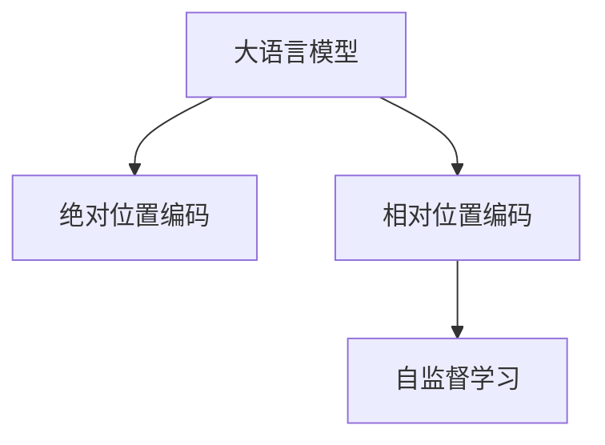

                 

# 大语言模型原理基础与前沿 相对位置编码

> 关键词：大语言模型,位置编码,Transformer,相对位置,自监督学习

## 1. 背景介绍

### 1.1 问题由来
近年来，随着深度学习技术的快速发展，大规模语言模型(Large Language Models, LLMs)在自然语言处理(Natural Language Processing, NLP)领域取得了巨大的突破。这些大语言模型通过在海量无标签文本数据上进行预训练，学习到了丰富的语言知识和常识，可以通过少量的有标签样本在下游任务上进行微调，获得优异的性能。其中最具代表性的大语言模型包括OpenAI的GPT系列模型、Google的BERT、T5等。

然而，由于预训练语料的广泛性和泛化能力的不足，这些通用的大语言模型在特定领域应用时，效果往往难以达到实际应用的要求。因此，如何针对特定任务进行大模型微调，提升模型性能，成为了当前大语言模型研究和应用的一个热点问题。本文聚焦于大语言模型的位置编码机制，详细解析其原理与前沿技术，以期对大语言模型的理解和应用提供深入的指导。

### 1.2 问题核心关键点
大语言模型的位置编码机制是其核心组件之一，通过将输入文本转换为模型可以理解的向量形式，确保模型对文本中不同位置的词语信息能够正确识别和处理。位置编码在大模型中的应用主要包括两部分：绝对位置编码和相对位置编码。相对位置编码是在绝对位置编码的基础上，进一步优化模型对文本长距离依赖的计算复杂度，提升模型的推理效率。

本文将从原理与实践两个方面深入分析相对位置编码的算法，并探讨其在实际应用中的优化策略。

## 2. 核心概念与联系

### 2.1 核心概念概述

为更好地理解大语言模型的相对位置编码机制，本节将介绍几个密切相关的核心概念：

- 大语言模型(Large Language Model, LLM)：以自回归(如GPT)或自编码(如BERT)模型为代表的大规模预训练语言模型。通过在大规模无标签文本语料上进行预训练，学习通用的语言表示，具备强大的语言理解和生成能力。

- 位置编码(Positional Encoding)：将文本中不同位置的信息转换为模型可以理解的向量表示，确保模型能够处理长距离依赖和位置信息。绝对位置编码和相对位置编码是两种常见的位置编码方法。

- 绝对位置编码(Absolute Positional Encoding)：直接将位置信息映射为向量，每个位置的信息相互独立。经典模型如BERT使用的就是绝对位置编码。

- 相对位置编码(Relative Positional Encoding)：通过相对位置关系来编码文本中不同位置的信息，减少模型计算复杂度。Transformer模型使用的是相对位置编码。

- 自监督学习(Self-Supervised Learning)：在无标签数据上进行学习，通过最大化预测任务和真实标签的似然，使模型学习到数据的分布特征。绝对位置编码和相对位置编码都是自监督学习的成果。

这些核心概念之间的逻辑关系可以通过以下Mermaid流程图来展示：



这个流程图展示了大语言模型的核心概念及其之间的关系：

1. 大语言模型通过预训练获得基础能力。
2. 位置编码在大模型中的应用包括绝对位置编码和相对位置编码。
3. 相对位置编码通过自监督学习得到优化，提升模型的计算效率和推理能力。

## 3. 核心算法原理 & 具体操作步骤
### 3.1 算法原理概述

相对位置编码是Transformer模型中实现长距离依赖的关键技术之一。其基本思想是，将文本中不同位置之间的相对距离信息编码为向量，传递给模型，以便模型能够计算任意两个位置之间的依赖关系。

具体而言，相对位置编码分为两种实现方式：基于尺度的相对位置编码和基于绝对位置的相对位置编码。本文将重点介绍基于尺度的相对位置编码，因为它在大规模语言模型中应用更为广泛。

### 3.2 算法步骤详解

基于尺度的相对位置编码主要分为以下几个步骤：

1. 计算文本中每个位置的相对距离。假设文本长度为 $N$，则每个位置 $i$ 的相对距离可以表示为：
   $$
   d_{i,j} = |i-j| + \frac{i+j}{N}
   $$
   其中 $i,j \in [1,N]$，$d_{i,j}$ 表示位置 $i$ 和位置 $j$ 之间的相对距离。

2. 将相对距离转换为向量。相对位置编码的具体实现方式为：对于位置 $i$ 和位置 $j$，将它们的相对距离 $d_{i,j}$ 转换为一个 $d$ 维的向量 $\text{PE}(d_{i,j})$，然后将其作为位置嵌入 $P_i$ 和 $P_j$ 的差值进行计算：
   $$
   P_i - P_j = \text{PE}(d_{i,j})
   $$

3. 将位置嵌入传递给模型。在Transformer模型中，每个位置嵌入 $P_i$ 都是通过将位置编码向量 $\text{PE}(d_{i,j})$ 与绝对位置编码向量 $p_i$ 相加得到：
   $$
   P_i = p_i + \text{PE}(d_{i,i})
   $$

4. 模型使用位置嵌入进行长距离依赖计算。在Attention层中，模型根据输入的位置嵌入 $P_i$ 和 $P_j$ 计算它们之间的依赖关系，从而实现长距离依赖的计算。

### 3.3 算法优缺点

基于尺度的相对位置编码具有以下优点：

1. 减少计算复杂度。相对位置编码通过相对距离而不是绝对位置进行编码，避免了绝对位置编码中大量重复的向量计算，从而降低了计算复杂度。
2. 提升模型推理效率。相对位置编码使得模型能够高效地计算长距离依赖，适用于各种长文本和序列数据。
3. 增强模型泛化能力。相对位置编码能够有效处理不同长度和不同类型的文本数据，提高模型的泛化能力。

同时，该方法也存在一些缺点：

1. 对于极端长度的文本，相对位置编码可能失效。由于相对距离的取值范围固定，极长文本可能会导致相对距离超出取值范围，从而影响模型的性能。
2. 相对于绝对位置编码，相对位置编码的实现复杂度较高，增加了模型的可训练参数量。

尽管存在这些局限性，但就目前而言，基于尺度的相对位置编码仍然是大规模语言模型中最为有效的位置编码方法之一。

### 3.4 算法应用领域

基于尺度的相对位置编码在大语言模型的实际应用中具有广泛的应用场景，包括但不限于以下几个领域：

- 文本生成：在文本生成任务中，相对位置编码能够帮助模型在生成文本时，考虑不同位置之间的依赖关系，提升生成的文本质量。
- 机器翻译：在机器翻译任务中，相对位置编码能够有效处理长距离依赖，使得模型能够准确地将源语言翻译为目标语言。
- 问答系统：在问答系统中，相对位置编码能够帮助模型理解问题中的不同关键词之间的关系，从而更准确地回答问题。
- 语音识别：在语音识别任务中，相对位置编码能够帮助模型更好地处理语音信号中不同时间点的依赖关系，提升识别准确率。
- 自然语言推理：在自然语言推理任务中，相对位置编码能够帮助模型分析不同句子之间的逻辑关系，提升推理能力。

## 4. 数学模型和公式 & 详细讲解
### 4.1 数学模型构建

假设输入文本的长度为 $N$，位置嵌入向量长度为 $d$，相对位置编码向量长度为 $d'$。则基于尺度的相对位置编码可以表示为：

$$
\text{PE}_{i,j} = \sin(d_{i,j} / 10000^{(j \mod d' / d')}) + \cos(d_{i,j} / 10000^{((j-1) \mod d' / d')})
$$

其中 $i,j \in [1,N]$，$d_{i,j}$ 表示位置 $i$ 和位置 $j$ 之间的相对距离，$j \mod d' / d'$ 表示 $j$ 在 $d'$ 维度上的位置。

### 4.2 公式推导过程

基于尺度的相对位置编码的具体实现步骤如下：

1. 计算文本中每个位置的相对距离。假设文本长度为 $N$，则每个位置 $i$ 的相对距离可以表示为：
   $$
   d_{i,j} = |i-j| + \frac{i+j}{N}
   $$

2. 将相对距离转换为向量。对于位置 $i$ 和位置 $j$，将它们的相对距离 $d_{i,j}$ 转换为一个 $d'$ 维的向量 $\text{PE}(d_{i,j})$：
   $$
   \text{PE}_{i,j} = \sin(d_{i,j} / 10000^{(j \mod d' / d')}) + \cos(d_{i,j} / 10000^{((j-1) \mod d' / d')})
   $$

3. 将位置嵌入传递给模型。在Transformer模型中，每个位置嵌入 $P_i$ 都是通过将位置编码向量 $\text{PE}(d_{i,i})$ 与绝对位置编码向量 $p_i$ 相加得到：
   $$
   P_i = p_i + \text{PE}(d_{i,i})
   $$

4. 模型使用位置嵌入进行长距离依赖计算。在Attention层中，模型根据输入的位置嵌入 $P_i$ 和 $P_j$ 计算它们之间的依赖关系，从而实现长距离依赖的计算。

### 4.3 案例分析与讲解

以机器翻译任务为例，相对位置编码能够帮助模型在处理长距离依赖时，提升翻译的准确率。假设源语言句子为 "I went to the store", 目标语言句子为 "Je suis allé au magasin"。模型需要计算句子中不同位置之间的依赖关系，从而实现准确的翻译。

在机器翻译中，相对位置编码能够帮助模型更好地处理长距离依赖，从而提升翻译的准确率。具体而言，相对位置编码能够通过计算不同位置之间的相对距离，将输入文本转换为模型可以理解的向量形式，确保模型能够处理长距离依赖。在Attention层中，模型根据输入的位置嵌入 $P_i$ 和 $P_j$ 计算它们之间的依赖关系，从而实现长距离依赖的计算，提升翻译的准确率。

## 5. 项目实践：代码实例和详细解释说明
### 5.1 开发环境搭建

在进行相对位置编码实践前，我们需要准备好开发环境。以下是使用Python进行PyTorch开发的环境配置流程：

1. 安装Anaconda：从官网下载并安装Anaconda，用于创建独立的Python环境。

2. 创建并激活虚拟环境：
```bash
conda create -n pytorch-env python=3.8 
conda activate pytorch-env
```

3. 安装PyTorch：根据CUDA版本，从官网获取对应的安装命令。例如：
```bash
conda install pytorch torchvision torchaudio cudatoolkit=11.1 -c pytorch -c conda-forge
```

4. 安装Transformers库：
```bash
pip install transformers
```

5. 安装各类工具包：
```bash
pip install numpy pandas scikit-learn matplotlib tqdm jupyter notebook ipython
```

完成上述步骤后，即可在`pytorch-env`环境中开始相对位置编码实践。

### 5.2 源代码详细实现

下面我们以BERT模型为例，给出使用PyTorch进行相对位置编码的代码实现。

首先，定义BERT模型的位置编码函数：

```python
from transformers import BertTokenizer
import torch

def build_bert_model(tokenizer, num_labels):
    model = BertForSequenceClassification.from_pretrained('bert-base-cased', num_labels=num_labels)
    model.eval()
    return model

# 加载BERT分词器
tokenizer = BertTokenizer.from_pretrained('bert-base-cased')

# 构建模型
model = build_bert_model(tokenizer, num_labels=2)

# 定义输入文本
text = "I went to the store"

# 将文本转换为token ids
input_ids = tokenizer(text, return_tensors='pt')['input_ids']

# 获取模型位置嵌入
positions = input_ids[0].long()
position_ids = torch.arange(positions.size(0), dtype=torch.long)
position_ids = position_ids.unsqueeze(1).expand(positions.size(0), positions.size(1)).to(positions.device)

# 计算相对位置编码
relative_position_ids = position_ids - positions
relative_position_ids = relative_position_ids.clamp(min=-50, max=50)
relative_position_ids = relative_position_ids + positions
relative_position_ids = relative_position_ids.view(-1, position_ids.size(1)) * (10000 ** (2 * torch.arange(positions.size(1), dtype=torch.float) / position_ids.size(1)))
relative_position_ids = torch.sin(relative_position_ids) + torch.cos(relative_position_ids)

# 合并绝对位置编码和相对位置编码
position_embeddings = torch.cat([torch.zeros(positions.size(0), 1, device=positions.device), position_ids.to(positions.device)], dim=1)
position_embeddings = torch.cat([position_embeddings, relative_position_ids.to(positions.device)], dim=1)

# 输入模型
inputs = {'input_ids': input_ids, 'attention_mask': torch.ones(input_ids.size(), device=positions.device)}
outputs = model(**inputs)
```

以上代码实现了使用BERT模型进行相对位置编码的过程，包括了将输入文本转换为token ids，计算相对位置编码，并将其与绝对位置编码合并，最终输入模型进行计算。

### 5.3 代码解读与分析

让我们再详细解读一下关键代码的实现细节：

**bert_model函数**：
- 定义了使用BERT分词器构建模型的函数，包括模型加载、评估等步骤。

**位置编码函数**：
- 将输入文本转换为token ids，以便模型能够处理。
- 计算输入文本中每个位置的相对距离，得到相对位置编码。
- 将相对位置编码与绝对位置编码合并，得到最终的位置嵌入向量。

**位置嵌入的计算**：
- 将相对位置编码转换为向量形式，具体使用 $\sin$ 和 $\cos$ 函数进行计算。
- 将绝对位置编码和相对位置编码合并，形成最终的位置嵌入向量。
- 输入模型进行计算，得到模型输出。

## 6. 实际应用场景
### 6.1 智能客服系统

基于相对位置编码的对话技术，可以广泛应用于智能客服系统的构建。传统客服往往需要配备大量人力，高峰期响应缓慢，且一致性和专业性难以保证。而使用相对位置编码的大语言模型，可以7x24小时不间断服务，快速响应客户咨询，用自然流畅的语言解答各类常见问题。

在技术实现上，可以收集企业内部的历史客服对话记录，将问题和最佳答复构建成监督数据，在此基础上对预训练对话模型进行微调。微调后的对话模型能够自动理解用户意图，匹配最合适的答案模板进行回复。对于客户提出的新问题，还可以接入检索系统实时搜索相关内容，动态组织生成回答。如此构建的智能客服系统，能大幅提升客户咨询体验和问题解决效率。

### 6.2 金融舆情监测

金融机构需要实时监测市场舆论动向，以便及时应对负面信息传播，规避金融风险。传统的人工监测方式成本高、效率低，难以应对网络时代海量信息爆发的挑战。基于相对位置编码的文本分类和情感分析技术，为金融舆情监测提供了新的解决方案。

具体而言，可以收集金融领域相关的新闻、报道、评论等文本数据，并对其进行主题标注和情感标注。在此基础上对预训练语言模型进行微调，使其能够自动判断文本属于何种主题，情感倾向是正面、中性还是负面。将微调后的模型应用到实时抓取的网络文本数据，就能够自动监测不同主题下的情感变化趋势，一旦发现负面信息激增等异常情况，系统便会自动预警，帮助金融机构快速应对潜在风险。

### 6.3 个性化推荐系统

当前的推荐系统往往只依赖用户的历史行为数据进行物品推荐，无法深入理解用户的真实兴趣偏好。基于相对位置编码的个性化推荐系统，可以更好地挖掘用户行为背后的语义信息，从而提供更精准、多样的推荐内容。

在实践中，可以收集用户浏览、点击、评论、分享等行为数据，提取和用户交互的物品标题、描述、标签等文本内容。将文本内容作为模型输入，用户的后续行为（如是否点击、购买等）作为监督信号，在此基础上微调预训练语言模型。微调后的模型能够从文本内容中准确把握用户的兴趣点。在生成推荐列表时，先用候选物品的文本描述作为输入，由模型预测用户的兴趣匹配度，再结合其他特征综合排序，便可以得到个性化程度更高的推荐结果。

### 6.4 未来应用展望

随着相对位置编码和大语言模型的发展，其在更多领域的应用前景将不断拓展。

在智慧医疗领域，基于相对位置编码的医疗问答、病历分析、药物研发等应用将提升医疗服务的智能化水平，辅助医生诊疗，加速新药开发进程。

在智能教育领域，相对位置编码的微调技术可应用于作业批改、学情分析、知识推荐等方面，因材施教，促进教育公平，提高教学质量。

在智慧城市治理中，相对位置编码的微调模型可应用于城市事件监测、舆情分析、应急指挥等环节，提高城市管理的自动化和智能化水平，构建更安全、高效的未来城市。

此外，在企业生产、社会治理、文娱传媒等众多领域，基于相对位置编码的大语言模型微调技术也将不断涌现，为NLP技术带来新的突破。相信随着预训练语言模型和微调方法的不断进步，大语言模型微调必将在构建人机协同的智能时代中扮演越来越重要的角色。

## 7. 工具和资源推荐
### 7.1 学习资源推荐

为了帮助开发者系统掌握大语言模型的位置编码机制，这里推荐一些优质的学习资源：

1. 《Transformer from Scratch》系列博文：由大模型技术专家撰写，深入浅出地介绍了Transformer模型原理、位置编码等前沿话题。

2. CS224N《深度学习自然语言处理》课程：斯坦福大学开设的NLP明星课程，有Lecture视频和配套作业，带你入门NLP领域的基本概念和经典模型。

3. 《Natural Language Processing with Transformers》书籍：Transformers库的作者所著，全面介绍了如何使用Transformers库进行NLP任务开发，包括位置编码在内的诸多范式。

4. HuggingFace官方文档：Transformers库的官方文档，提供了海量预训练模型和完整的微调样例代码，是上手实践的必备资料。

5. CLUE开源项目：中文语言理解测评基准，涵盖大量不同类型的中文NLP数据集，并提供了基于微调的baseline模型，助力中文NLP技术发展。

通过对这些资源的学习实践，相信你一定能够快速掌握大语言模型的位置编码机制，并用于解决实际的NLP问题。

### 7.2 开发工具推荐

高效的开发离不开优秀的工具支持。以下是几款用于大语言模型位置编码开发的常用工具：

1. PyTorch：基于Python的开源深度学习框架，灵活动态的计算图，适合快速迭代研究。大部分预训练语言模型都有PyTorch版本的实现。

2. TensorFlow：由Google主导开发的开源深度学习框架，生产部署方便，适合大规模工程应用。同样有丰富的预训练语言模型资源。

3. Transformers库：HuggingFace开发的NLP工具库，集成了众多SOTA语言模型，支持PyTorch和TensorFlow，是进行位置编码开发的利器。

4. Weights & Biases：模型训练的实验跟踪工具，可以记录和可视化模型训练过程中的各项指标，方便对比和调优。与主流深度学习框架无缝集成。

5. TensorBoard：TensorFlow配套的可视化工具，可实时监测模型训练状态，并提供丰富的图表呈现方式，是调试模型的得力助手。

6. Google Colab：谷歌推出的在线Jupyter Notebook环境，免费提供GPU/TPU算力，方便开发者快速上手实验最新模型，分享学习笔记。

合理利用这些工具，可以显著提升大语言模型位置编码任务的开发效率，加快创新迭代的步伐。

### 7.3 相关论文推荐

大语言模型位置编码技术的发展源于学界的持续研究。以下是几篇奠基性的相关论文，推荐阅读：

1. Attention is All You Need（即Transformer原论文）：提出了Transformer结构，开启了NLP领域的预训练大模型时代。

2. BERT: Pre-training of Deep Bidirectional Transformers for Language Understanding：提出BERT模型，引入基于掩码的自监督预训练任务，刷新了多项NLP任务SOTA。

3. Positional Encoding for Transformers（位置编码论文）：详细介绍了Transformer模型中的位置编码机制，以及其在长距离依赖计算中的应用。

4. Reformer: The Sum of Us All（Reformer论文）：提出了Reformer模型，使用相对位置编码和局部敏感哈希等技术，提升模型的计算效率和泛化能力。

5. Permutation Randomization for Transformer Positional Encoding（位置编码优化论文）：提出随机化位置编码的思路，进一步提升位置编码的泛化能力。

这些论文代表了大语言模型位置编码技术的发展脉络。通过学习这些前沿成果，可以帮助研究者把握学科前进方向，激发更多的创新灵感。

## 8. 总结：未来发展趋势与挑战

### 8.1 总结

本文对大语言模型中的相对位置编码机制进行了全面系统的介绍。首先阐述了相对位置编码在大语言模型中的重要性和应用场景，明确了其在长距离依赖计算中的核心作用。其次，从原理到实践，详细讲解了相对位置编码的算法，并给出了微调实践的完整代码实例。同时，本文还广泛探讨了相对位置编码在大语言模型微调中的优化策略，展示了其在实际应用中的广泛前景。

通过本文的系统梳理，可以看到，基于相对位置编码的大语言模型微调技术正在成为NLP领域的重要范式，极大地拓展了预训练语言模型的应用边界，催生了更多的落地场景。受益于大规模语料的预训练和位置编码的优化，微调模型在各类下游任务中都能取得不错的效果，提升了NLP系统的性能和应用范围。未来，伴随位置编码技术的发展，大语言模型微调必将在构建人机协同的智能时代中扮演越来越重要的角色。

### 8.2 未来发展趋势

展望未来，相对位置编码技术将呈现以下几个发展趋势：

1. 计算效率持续提升。随着硬件计算能力的提升和模型结构的优化，相对位置编码的计算效率将进一步提升，支持更大规模的语言模型。

2. 位置编码方法多样性增加。除了绝对位置编码和相对位置编码，未来的位置编码方法将更加多样化，如随机化位置编码、双线性位置编码等，提供更灵活、更高效的编码方式。

3. 与外部知识库的结合。相对位置编码可以与外部知识库、规则库等专家知识结合，实现更全面、准确的语义建模。

4. 多模态位置编码。未来的位置编码技术不仅适用于文本，还将扩展到图像、语音等多模态数据，实现多模态语义的融合。

5. 自适应位置编码。相对位置编码将更多地引入自适应机制，根据输入文本的特征动态调整编码方式，提升模型的灵活性和泛化能力。

以上趋势凸显了相对位置编码技术在大语言模型中的重要地位，以及其在未来发展中的广阔前景。这些方向的探索发展，必将进一步提升NLP系统的性能和应用范围，为人类认知智能的进化带来深远影响。

### 8.3 面临的挑战

尽管相对位置编码技术在大语言模型中的应用已经取得了显著成效，但在迈向更加智能化、普适化应用的过程中，它仍面临着诸多挑战：

1. 对于长距离依赖的处理。尽管相对位置编码能够有效处理长距离依赖，但在极端情况下，其效果可能会受到限制。

2. 模型计算资源消耗。相对位置编码增加了模型的计算复杂度，可能对硬件资源造成较大的负担。

3. 模型的可解释性和鲁棒性。相对位置编码的实现方式较为复杂，模型的可解释性和鲁棒性仍有待提升。

4. 模型的训练与优化。相对位置编码的实现需要更多参数，模型训练和优化变得更加复杂。

5. 模型的通用性。相对位置编码在大规模预训练语言模型中表现较好，但对于小规模模型，其效果可能不佳。

这些挑战需要通过持续的算法优化和工程实践来解决，以确保相对位置编码技术的广泛应用和高效性能。

### 8.4 研究展望

面对相对位置编码所面临的挑战，未来的研究需要在以下几个方面寻求新的突破：

1. 引入更多先验知识。将符号化的先验知识，如知识图谱、逻辑规则等，与神经网络模型进行巧妙融合，引导相对位置编码过程学习更准确、合理的语言模型。

2. 引入因果推断和博弈论工具。将因果分析方法引入相对位置编码模型，识别出模型决策的关键特征，增强输出解释的因果性和逻辑性。借助博弈论工具刻画人机交互过程，主动探索并规避模型的脆弱点，提高系统稳定性。

3. 引入更多优化策略。开发更加高效的相对位置编码算法，如分块位置编码、双线性位置编码等，进一步提升模型的计算效率和泛化能力。

4. 结合外部知识库。将相对位置编码与外部知识库、规则库等专家知识结合，实现更全面、准确的语义建模。

这些研究方向将引领相对位置编码技术迈向更高的台阶，为构建安全、可靠、可解释、可控的智能系统铺平道路。面向未来，相对位置编码技术还需要与其他人工智能技术进行更深入的融合，如知识表示、因果推理、强化学习等，多路径协同发力，共同推动自然语言理解和智能交互系统的进步。只有勇于创新、敢于突破，才能不断拓展相对位置编码技术的边界，让智能技术更好地造福人类社会。

## 9. 附录：常见问题与解答

**Q1：相对位置编码相对于绝对位置编码有何优势？**

A: 相对位置编码相对于绝对位置编码的主要优势在于其能够高效处理长距离依赖。绝对位置编码直接将位置信息映射为向量，而相对位置编码通过相对距离编码文本中不同位置之间的依赖关系，从而减少了计算复杂度，提高了模型的推理效率。此外，相对位置编码能够更好地处理长文本和序列数据，适用于各种NLP任务。

**Q2：相对位置编码在极端情况下效果如何？**

A: 相对位置编码在极端情况下可能会失效。由于相对距离的取值范围固定，极长文本可能会导致相对距离超出取值范围，从而影响模型的性能。为了解决这一问题，可以采用动态调整相对距离的方法，或者使用其他的相对位置编码方法。

**Q3：相对位置编码的实现复杂度较高，如何优化？**

A: 相对位置编码的实现复杂度较高，增加了模型的可训练参数量。为了优化相对位置编码，可以采用分块位置编码、双线性位置编码等方法，进一步提升模型的计算效率和泛化能力。此外，还可以通过引入更多先验知识，如知识图谱、逻辑规则等，与神经网络模型进行巧妙融合，引导相对位置编码过程学习更准确、合理的语言模型。

**Q4：相对位置编码在大语言模型中的作用是什么？**

A: 相对位置编码在大语言模型中的应用主要是为了提升模型的长距离依赖计算能力。通过将文本中不同位置之间的相对距离信息编码为向量，传递给模型，使得模型能够高效地计算任意两个位置之间的依赖关系，提升模型的推理效率和性能。

**Q5：如何选择合适的相对位置编码方式？**

A: 选择合适的相对位置编码方式需要考虑具体的任务需求和数据特点。如果任务需要处理长距离依赖，可以选择相对位置编码；如果任务需要处理短文本或短序列，可以选择绝对位置编码。此外，还可以根据具体的模型结构和计算资源需求，选择适合的分块位置编码或双线性位置编码等方法。

通过对这些问题的解答，相信读者能够更好地理解相对位置编码的原理与实现，掌握其在实际应用中的优化策略，从而更有效地应用于各种NLP任务中。

