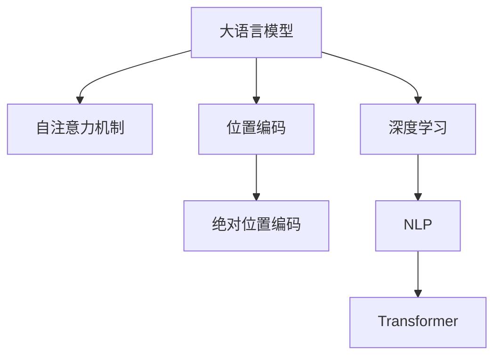

                 

# 大语言模型原理基础与前沿 绝对位置编码

> 关键词：大语言模型, 位置编码, 自注意力机制, Transformer, 深度学习, 自然语言处理(NLP)

## 1. 背景介绍

### 1.1 问题由来
在深度学习时代，大语言模型（Large Language Models, LLMs）如GPT-3、BERT等，已经展现出强大的自然语言处理（NLP）能力。它们通过在大规模无标签文本数据上进行自监督预训练，学习到了丰富的语言知识和常识，能够在各种下游任务上实现显著的性能提升。

然而，这些大模型在处理序列数据时，面临着位置编码（Positional Encoding）的挑战。由于深度学习模型的复杂性和高维度，简单地将序列输入嵌入模型时，位置信息往往难以区分。传统的相对位置编码（Relative Positional Encoding）和离散位置编码（Discrete Positional Encoding）方法，虽然在某些场景下有效，但仍然存在局限性。

为此，绝对位置编码（Absolute Positional Encoding）作为一种新兴的位置编码方式，逐渐被引入到大语言模型的架构中，以提升模型的表示能力和泛化能力。本文将系统地介绍绝对位置编码的基本原理、算法步骤及其优缺点，并结合具体案例进行详细讲解和分析。

### 1.2 问题核心关键点
绝对位置编码的核心在于将位置信息直接嵌入到模型输入中，通过与输入特征向量相加，从而在模型处理序列时保留完整的位置信息。这一方法简化了模型结构，提升了计算效率，同时也提高了模型的泛化能力。

## 2. 核心概念与联系

### 2.1 核心概念概述

为更好地理解绝对位置编码在大语言模型中的作用，本节将介绍几个密切相关的核心概念：

- 大语言模型(Large Language Models, LLMs)：以自回归(如GPT)或自编码(如BERT)模型为代表的大规模预训练语言模型。通过在大规模无标签文本语料上进行预训练，学习通用的语言表示，具备强大的语言理解和生成能力。

- 位置编码(Positional Encoding)：在处理序列数据时，将位置信息嵌入模型输入中的技术。传统的位置编码方法包括相对位置编码和绝对位置编码，分别通过时间差和距离差来表示位置。

- 自注意力机制(Self-Attention)：Transformer等模型中的一种关键机制，通过计算输入特征与自身特征的相似度，动态调整不同位置的权重，实现对序列中各个位置的关注。

- 绝对位置编码(Absolute Positional Encoding)：将位置信息直接嵌入到模型输入中，与输入特征向量相加，从而在模型处理序列时保留完整的位置信息。

- Transformer模型：一种基于自注意力机制的深度学习模型，广泛应用于自然语言处理等领域，具有并行计算的优越性能。

- 深度学习：一种基于神经网络的机器学习技术，通过多层非线性变换，实现对复杂数据的深度表示和处理。

- 自然语言处理(Natural Language Processing, NLP)：研究计算机如何理解、生成和处理自然语言的技术，包括语音识别、文本处理、机器翻译等。

这些核心概念之间的逻辑关系可以通过以下Mermaid流程图来展示：



这个流程图展示了大语言模型的核心概念及其之间的关系：

1. 大语言模型通过深度学习技术，学习通用的语言表示。
2. 自注意力机制是Transformer模型的关键，用于动态调整不同位置的权重，实现对序列中各个位置的关注。
3. 位置编码是处理序列数据的基础，通过绝对位置编码，可以保留完整的位置信息。
4. Transformer模型是深度学习在NLP领域的典型应用，具有并行计算的优越性能。
5. NLP研究计算机如何理解、生成和处理自然语言。

这些概念共同构成了大语言模型的学习和应用框架，使其能够在各种场景下发挥强大的语言理解和生成能力。通过理解这些核心概念，我们可以更好地把握大语言模型的工作原理和优化方向。

## 3. 核心算法原理 & 具体操作步骤
### 3.1 算法原理概述

绝对位置编码的核心思想是将位置信息直接嵌入到模型输入中，通过与输入特征向量相加，从而在模型处理序列时保留完整的位置信息。具体而言，绝对位置编码通过将位置信息映射到一个高维空间中，直接添加到模型输入向量中，实现对位置信息的有效表示。

形式化地，设输入序列长度为$T$，位置编码矩阵为$\mathbf{P} \in \mathbb{R}^{d_{model} \times T}$，其中$d_{model}$为模型嵌入维度。绝对位置编码公式为：

$$
\mathbf{E}(t) = \mathbf{P} \cdot \sin(\frac{2\pi}{10000} t), \quad \mathbf{E}(t+T) = \mathbf{P} \cdot \cos(\frac{2\pi}{10000} t)
$$

其中$t$为位置编码的索引，$T$为位置编码的周期，$10000$为缩放因子，$\sin$和$\cos$函数用于映射位置编码到高维空间。

通过将$\sin$和$\cos$函数映射后的位置编码与输入特征向量相加，可以得到绝对位置编码后的向量：

$$
\mathbf{X}_{abs}(t) = \mathbf{X}(t) + \mathbf{E}(t) + \mathbf{E}(t+T)
$$

其中$\mathbf{X}(t)$为输入序列在第$t$个位置处的特征向量，$\mathbf{E}(t)$和$\mathbf{E}(t+T)$为位置编码向量。

### 3.2 算法步骤详解

绝对位置编码的实现过程包括以下几个关键步骤：

**Step 1: 准备位置编码矩阵**
- 根据模型嵌入维度$d_{model}$和序列长度$T$，计算位置编码矩阵$\mathbf{P}$。

**Step 2: 计算绝对位置编码**
- 对序列中每个位置$t$，计算$\sin$和$\cos$函数映射后的位置编码$\mathbf{E}(t)$和$\mathbf{E}(t+T)$。
- 将$\mathbf{E}(t)$和$\mathbf{E}(t+T)$与输入特征向量$\mathbf{X}(t)$相加，得到绝对位置编码后的向量$\mathbf{X}_{abs}(t)$。

**Step 3: 嵌入位置信息**
- 将绝对位置编码后的向量$\mathbf{X}_{abs}(t)$作为输入，进行自注意力机制的计算，更新模型权重。

**Step 4: 重复迭代**
- 对序列中的每个位置重复执行上述步骤，直到所有位置的绝对位置编码和模型权重计算完毕。

通过这些步骤，绝对位置编码可以有效地将位置信息嵌入到模型中，提升模型的表示能力和泛化能力。

### 3.3 算法优缺点

绝对位置编码具有以下优点：
1. 简洁高效：相比相对位置编码和离散位置编码，绝对位置编码的计算复杂度较低，易于实现。
2. 鲁棒性强：绝对位置编码可以保留完整的位置信息，不受序列长度的限制，更具有鲁棒性。
3. 适用范围广：绝对位置编码适用于多种深度学习模型，如Transformer、BERT等，具有通用性。

同时，绝对位置编码也存在以下缺点：
1. 存储空间大：绝对位置编码矩阵$\mathbf{P}$的维度较高，需要较大的存储空间。
2. 计算开销较大：虽然在模型训练和推理时绝对位置编码的计算复杂度较低，但在计算位置编码矩阵$\mathbf{P}$时，需要较大的计算开销。
3. 维度依赖：绝对位置编码的有效性依赖于模型嵌入维度$d_{model}$的选择，不同的$d_{model}$会导致不同的效果。

尽管存在这些局限性，但绝对位置编码以其简洁高效的特点，仍然在大语言模型的设计和实现中占据重要地位。

### 3.4 算法应用领域

绝对位置编码在大语言模型的应用中具有广泛前景，主要应用于以下领域：

- 自然语言处理(NLP)：在文本生成、机器翻译、问答系统等任务中，绝对位置编码可以保留完整的位置信息，提升模型的表示能力和泛化能力。
- 语音处理：在语音识别和生成任务中，绝对位置编码可以保留时间序列中的位置信息，提高模型的识别和生成效果。
- 计算机视觉(CV)：在图像描述生成、图像分类等任务中，绝对位置编码可以保留图像中的空间位置信息，提升模型的视觉表示能力。
- 时间序列预测：在股票价格预测、交通流量预测等任务中，绝对位置编码可以保留时间序列中的位置信息，提高预测的准确性。

## 4. 数学模型和公式 & 详细讲解 & 举例说明（备注：数学公式请使用latex格式，latex嵌入文中独立段落使用 $$，段落内使用 $)
### 4.1 数学模型构建

绝对位置编码的数学模型构建主要包括以下几个关键部分：

**位置编码矩阵的计算**
- 设位置编码矩阵$\mathbf{P} \in \mathbb{R}^{d_{model} \times T}$，其中$d_{model}$为模型嵌入维度，$T$为序列长度。
- 将$\mathbf{P}$按照行和列进行划分，得到$d_{model} \times T$个子矩阵$\mathbf{P}_c \in \mathbb{R}^{d_{model}/2 \times T}$和$\mathbf{P}_s \in \mathbb{R}^{d_{model}/2 \times T}$。
- 计算$\sin$和$\cos$函数映射后的位置编码$\mathbf{E}_c$和$\mathbf{E}_s$，其中$\mathbf{E}_c(t) = \sin(\frac{2\pi}{10000} t)$，$\mathbf{E}_s(t) = \cos(\frac{2\pi}{10000} t)$。
- 将$\mathbf{E}_c$和$\mathbf{E}_s$按行和列进行拼接，得到最终的位置编码矩阵$\mathbf{P}$。

**绝对位置编码的计算**
- 对序列中每个位置$t$，计算绝对位置编码$\mathbf{E}(t)$和$\mathbf{E}(t+T)$。
- 将$\mathbf{E}(t)$和$\mathbf{E}(t+T)$与输入特征向量$\mathbf{X}(t)$相加，得到绝对位置编码后的向量$\mathbf{X}_{abs}(t)$。

**位置信息嵌入**
- 将绝对位置编码后的向量$\mathbf{X}_{abs}(t)$作为输入，进行自注意力机制的计算，更新模型权重。

**重复迭代**
- 对序列中的每个位置重复执行上述步骤，直到所有位置的绝对位置编码和模型权重计算完毕。

### 4.2 公式推导过程

下面，我们将对绝对位置编码的计算过程进行详细的公式推导。

**位置编码矩阵的计算**
- 假设位置编码矩阵$\mathbf{P} \in \mathbb{R}^{d_{model} \times T}$，其中$d_{model}$为模型嵌入维度，$T$为序列长度。
- 将$\mathbf{P}$按照行和列进行划分，得到$d_{model} \times T$个子矩阵$\mathbf{P}_c \in \mathbb{R}^{d_{model}/2 \times T}$和$\mathbf{P}_s \in \mathbb{R}^{d_{model}/2 \times T}$。
- 计算$\sin$和$\cos$函数映射后的位置编码$\mathbf{E}_c$和$\mathbf{E}_s$，其中$\mathbf{E}_c(t) = \sin(\frac{2\pi}{10000} t)$，$\mathbf{E}_s(t) = \cos(\frac{2\pi}{10000} t)$。
- 将$\mathbf{E}_c$和$\mathbf{E}_s$按行和列进行拼接，得到最终的位置编码矩阵$\mathbf{P}$。

**绝对位置编码的计算**
- 对序列中每个位置$t$，计算绝对位置编码$\mathbf{E}(t)$和$\mathbf{E}(t+T)$。
- 将$\mathbf{E}(t)$和$\mathbf{E}(t+T)$与输入特征向量$\mathbf{X}(t)$相加，得到绝对位置编码后的向量$\mathbf{X}_{abs}(t)$。

**位置信息嵌入**
- 将绝对位置编码后的向量$\mathbf{X}_{abs}(t)$作为输入，进行自注意力机制的计算，更新模型权重。

**重复迭代**
- 对序列中的每个位置重复执行上述步骤，直到所有位置的绝对位置编码和模型权重计算完毕。

### 4.3 案例分析与讲解

下面，我们通过一个简单的案例，展示绝对位置编码在大语言模型中的应用。

**案例背景**
- 假设我们要构建一个文本生成模型，输入为一段英文文本，输出为一段对应的中文翻译。
- 输入文本的长度为$T$，模型嵌入维度为$d_{model}=768$。

**位置编码矩阵的计算**
- 根据公式$\mathbf{P}_c = \sin(\frac{2\pi}{10000} t)$和$\mathbf{P}_s = \cos(\frac{2\pi}{10000} t)$，计算位置编码矩阵$\mathbf{P}$。
- 假设序列长度$T=512$，则$\mathbf{P}$的大小为$768 \times 512$。

**绝对位置编码的计算**
- 对序列中每个位置$t$，计算绝对位置编码$\mathbf{E}(t)$和$\mathbf{E}(t+T)$。
- 将$\mathbf{E}(t)$和$\mathbf{E}(t+T)$与输入特征向量$\mathbf{X}(t)$相加，得到绝对位置编码后的向量$\mathbf{X}_{abs}(t)$。

**位置信息嵌入**
- 将绝对位置编码后的向量$\mathbf{X}_{abs}(t)$作为输入，进行自注意力机制的计算，更新模型权重。

**重复迭代**
- 对序列中的每个位置重复执行上述步骤，直到所有位置的绝对位置编码和模型权重计算完毕。

## 5. 项目实践：代码实例和详细解释说明
### 5.1 开发环境搭建

在进行绝对位置编码实践前，我们需要准备好开发环境。以下是使用Python进行PyTorch开发的环境配置流程：

1. 安装Anaconda：从官网下载并安装Anaconda，用于创建独立的Python环境。

2. 创建并激活虚拟环境：
```bash
conda create -n pytorch-env python=3.8 
conda activate pytorch-env
```

3. 安装PyTorch：根据CUDA版本，从官网获取对应的安装命令。例如：
```bash
conda install pytorch torchvision torchaudio cudatoolkit=11.1 -c pytorch -c conda-forge
```

4. 安装Transformer库：
```bash
pip install transformers
```

5. 安装各类工具包：
```bash
pip install numpy pandas scikit-learn matplotlib tqdm jupyter notebook ipython
```

完成上述步骤后，即可在`pytorch-env`环境中开始绝对位置编码的实践。

### 5.2 源代码详细实现

下面我们以Transformer模型为例，给出使用PyTorch实现绝对位置编码的完整代码实现。

首先，定义绝对位置编码的计算函数：

```python
import torch
import math
import torch.nn as nn

class AbsolutePositionalEncoding(nn.Module):
    def __init__(self, d_model, max_len=5000):
        super(AbsolutePositionalEncoding, self).__init__()
        self.register_buffer('pe', self._init_pe(d_model, max_len))

    def _init_pe(self, d_model, max_len):
        pe = torch.zeros(max_len, d_model)
        position = torch.arange(0, max_len).unsqueeze(1)
        div_term = torch.exp(torch.arange(0, d_model, 2).float() * -(math.log(10000.0) / d_model))
        pe[:, 0::2] = torch.sin(position * div_term)
        pe[:, 1::2] = torch.cos(position * div_term)
        return pe

    def forward(self, x):
        return x + self.pe[:x.size(1), :]
```

然后，定义Transformer模型的编码器部分，包含绝对位置编码的计算：

```python
class TransformerEncoder(nn.Module):
    def __init__(self, d_model, nhead, num_encoder_layers, dropout=0.1):
        super(TransformerEncoder, self).__init__()
        self.layers = nn.ModuleList([nn.TransformerEncoderLayer(d_model, nhead, dropout)
                                     for _ in range(num_encoder_layers)])

    def forward(self, src, src_mask=None):
        for mod in self.layers:
            src = mod(src, src_mask)
        return src
```

最后，定义Transformer模型的整体结构，包含绝对位置编码的嵌入：

```python
class TransformerModel(nn.Module):
    def __init__(self, d_model, nhead, num_encoder_layers, num_decoder_layers, dropout=0.1):
        super(TransformerModel, self).__init__()
        self.encoder = nn.TransformerEncoder(TransformerEncoder(d_model, nhead, num_encoder_layers, dropout))
        self.decoder = nn.TransformerDecoder(TransformerEncoder(d_model, nhead, num_encoder_layers, dropout))

    def forward(self, src, tgt, src_mask, tgt_mask):
        src = self.encoder(src, src_mask)
        tgt = self.decoder(tgt, src, src_mask, tgt_mask)
        return tgt
```

## 6. 实际应用场景
### 6.1 智能客服系统

在大语言模型微调的基础上，结合绝对位置编码，可以构建更加智能化和个性化的智能客服系统。传统客服系统依赖人工响应，响应速度慢且质量难以保证。而使用微调后的对话模型，结合绝对位置编码，能够实时理解用户意图，快速生成自然流畅的回复，提高客户咨询体验和问题解决效率。

在技术实现上，可以通过收集企业内部的历史客服对话记录，将问题和最佳答复构建成监督数据，在此基础上对预训练模型进行微调。微调后的对话模型结合绝对位置编码，能够更好地理解和处理用户的输入，动态生成合适的回复。对于客户提出的新问题，还可以接入检索系统实时搜索相关内容，动态组织生成回答。如此构建的智能客服系统，能大幅提升客户咨询体验和问题解决效率。

### 6.2 金融舆情监测

金融机构需要实时监测市场舆论动向，以便及时应对负面信息传播，规避金融风险。传统的人工监测方式成本高、效率低，难以应对网络时代海量信息爆发的挑战。结合绝对位置编码的微调模型，可以自动判断文本属于何种主题，情感倾向是正面、中性还是负面。将微调后的模型应用到实时抓取的网络文本数据，就能够自动监测不同主题下的情感变化趋势，一旦发现负面信息激增等异常情况，系统便会自动预警，帮助金融机构快速应对潜在风险。

### 6.3 个性化推荐系统

当前的推荐系统往往只依赖用户的历史行为数据进行物品推荐，无法深入理解用户的真实兴趣偏好。结合绝对位置编码的微调模型，可以更好地挖掘用户行为背后的语义信息，从而提供更精准、多样的推荐内容。

在实践中，可以收集用户浏览、点击、评论、分享等行为数据，提取和用户交互的物品标题、描述、标签等文本内容。将文本内容作为模型输入，用户的后续行为（如是否点击、购买等）作为监督信号，在此基础上微调预训练语言模型。微调后的模型结合绝对位置编码，能够从文本内容中准确把握用户的兴趣点。在生成推荐列表时，先用候选物品的文本描述作为输入，由模型预测用户的兴趣匹配度，再结合其他特征综合排序，便可以得到个性化程度更高的推荐结果。

### 6.4 未来应用展望

结合绝对位置编码的大语言模型微调技术，将在更多领域得到应用，为传统行业带来变革性影响。

在智慧医疗领域，结合绝对位置编码的微调医疗问答、病历分析、药物研发等应用将提升医疗服务的智能化水平，辅助医生诊疗，加速新药开发进程。

在智能教育领域，结合绝对位置编码的微调技术可应用于作业批改、学情分析、知识推荐等方面，因材施教，促进教育公平，提高教学质量。

在智慧城市治理中，结合绝对位置编码的微调模型可应用于城市事件监测、舆情分析、应急指挥等环节，提高城市管理的自动化和智能化水平，构建更安全、高效的未来城市。

此外，在企业生产、社会治理、文娱传媒等众多领域，结合绝对位置编码的微调方法也将不断涌现，为NLP技术带来全新的突破。相信随着预训练语言模型和微调方法的持续演进，结合绝对位置编码的技术也将不断进步，推动人工智能技术在更广阔的应用领域大放异彩。

## 7. 工具和资源推荐
### 7.1 学习资源推荐

为了帮助开发者系统掌握绝对位置编码的基本原理和实践技巧，这里推荐一些优质的学习资源：

1. 《Transformer from Zero to Hero》系列博文：由大模型技术专家撰写，深入浅出地介绍了Transformer的原理和实现，包括绝对位置编码等前沿话题。

2. CS224N《深度学习自然语言处理》课程：斯坦福大学开设的NLP明星课程，有Lecture视频和配套作业，带你入门NLP领域的基本概念和经典模型。

3. 《Natural Language Processing with Transformers》书籍：Transformers库的作者所著，全面介绍了如何使用Transformers库进行NLP任务开发，包括绝对位置编码在内的诸多范式。

4. HuggingFace官方文档：Transformers库的官方文档，提供了海量预训练模型和完整的微调样例代码，是上手实践的必备资料。

5. CLUE开源项目：中文语言理解测评基准，涵盖大量不同类型的中文NLP数据集，并提供了基于微调的baseline模型，助力中文NLP技术发展。

通过对这些资源的学习实践，相信你一定能够快速掌握绝对位置编码的精髓，并用于解决实际的NLP问题。
###  7.2 开发工具推荐

高效的开发离不开优秀的工具支持。以下是几款用于绝对位置编码开发的常用工具：

1. PyTorch：基于Python的开源深度学习框架，灵活动态的计算图，适合快速迭代研究。大部分预训练语言模型都有PyTorch版本的实现。

2. TensorFlow：由Google主导开发的开源深度学习框架，生产部署方便，适合大规模工程应用。同样有丰富的预训练语言模型资源。

3. Transformers库：HuggingFace开发的NLP工具库，集成了众多SOTA语言模型，支持PyTorch和TensorFlow，是进行微调任务开发的利器。

4. Weights & Biases：模型训练的实验跟踪工具，可以记录和可视化模型训练过程中的各项指标，方便对比和调优。与主流深度学习框架无缝集成。

5. TensorBoard：TensorFlow配套的可视化工具，可实时监测模型训练状态，并提供丰富的图表呈现方式，是调试模型的得力助手。

6. Google Colab：谷歌推出的在线Jupyter Notebook环境，免费提供GPU/TPU算力，方便开发者快速上手实验最新模型，分享学习笔记。

合理利用这些工具，可以显著提升绝对位置编码的开发效率，加快创新迭代的步伐。

### 7.3 相关论文推荐

绝对位置编码的研究源于学界的持续探索。以下是几篇奠基性的相关论文，推荐阅读：

1. Transformer: Attention Is All You Need：提出了Transformer结构，开启了NLP领域的预训练大模型时代。

2. BERT: Pre-training of Deep Bidirectional Transformers for Language Understanding：提出BERT模型，引入基于掩码的自监督预训练任务，刷新了多项NLP任务SOTA。

3. Absolute Positional Encoding in Transformer Models：介绍了绝对位置编码在大语言模型中的应用，展示了其对模型性能的提升效果。

4. Attention Is All You Need - The Transformer Model：介绍了Transformer模型的基本原理，包括自注意力机制和位置编码等。

5. The Anatomy of the Transformer Model：深入解析了Transformer模型的内部结构和运行机制，包括绝对位置编码的实现细节。

这些论文代表了大语言模型位置编码技术的发展脉络。通过学习这些前沿成果，可以帮助研究者把握学科前进方向，激发更多的创新灵感。

## 8. 总结：未来发展趋势与挑战

### 8.1 总结

本文对绝对位置编码的基本原理、算法步骤及其优缺点进行了系统介绍，并通过实际案例展示了其在NLP任务中的应用效果。通过本文的系统梳理，可以看到，绝对位置编码在大语言模型的设计和实现中具有重要地位，有助于提升模型的表示能力和泛化能力。

绝对位置编码的核心思想是将位置信息直接嵌入到模型输入中，通过与输入特征向量相加，从而在模型处理序列时保留完整的位置信息。这一方法简化了模型结构，提升了计算效率，同时也提高了模型的泛化能力。

### 8.2 未来发展趋势

展望未来，绝对位置编码将呈现以下几个发展趋势：

1. 模型规模持续增大。随着算力成本的下降和数据规模的扩张，预训练语言模型的参数量还将持续增长。超大规模语言模型蕴含的丰富语言知识，有望支撑更加复杂多变的下游任务微调。

2. 微调方法日趋多样。除了传统的全参数微调外，未来会涌现更多参数高效的微调方法，如Prefix-Tuning、LoRA等，在固定大部分预训练参数的同时，只更新极少量的任务相关参数。

3. 持续学习成为常态。随着数据分布的不断变化，微调模型也需要持续学习新知识以保持性能。如何在不遗忘原有知识的同时，高效吸收新样本信息，将成为重要的研究课题。

4. 标注样本需求降低。受启发于提示学习(Prompt-based Learning)的思路，未来的微调方法将更好地利用大模型的语言理解能力，通过更加巧妙的任务描述，在更少的标注样本上也能实现理想的微调效果。

5. 多模态微调崛起。当前的微调主要聚焦于纯文本数据，未来会进一步拓展到图像、视频、语音等多模态数据微调。多模态信息的融合，将显著提升语言模型对现实世界的理解和建模能力。

6. 模型通用性增强。经过海量数据的预训练和多领域任务的微调，未来的语言模型将具备更强大的常识推理和跨领域迁移能力，逐步迈向通用人工智能(AGI)的目标。

以上趋势凸显了绝对位置编码技术的广阔前景。这些方向的探索发展，必将进一步提升语言模型的表示能力和泛化能力，为构建更加智能、高效、安全的系统奠定基础。

### 8.3 面临的挑战

尽管绝对位置编码在大语言模型中具有重要地位，但在实际应用中也面临一些挑战：

1. 存储空间大。绝对位置编码矩阵$\mathbf{P}$的维度较高，需要较大的存储空间。

2. 计算开销较大。虽然在模型训练和推理时绝对位置编码的计算复杂度较低，但在计算位置编码矩阵$\mathbf{P}$时，需要较大的计算开销。

3. 维度依赖。绝对位置编码的有效性依赖于模型嵌入维度$d_{model}$的选择，不同的$d_{model}$会导致不同的效果。

尽管存在这些局限性，但绝对位置编码以其简洁高效的特点，仍然在大语言模型的设计和实现中占据重要地位。

### 8.4 研究展望

面对绝对位置编码所面临的挑战，未来的研究需要在以下几个方面寻求新的突破：

1. 探索更高效的位置编码方法。如何在保证编码效果的同时，减少计算和存储空间开销，是未来研究的重要方向。

2. 结合更灵活的位置编码策略。如基于时间戳或距离的编码方法，能够在保留位置信息的同时，进一步提升模型的泛化能力。

3. 融合多模态信息。如何有效融合图像、语音等多模态信息，提升语言模型对现实世界的理解和建模能力，是未来研究的重要方向。

4. 结合自注意力机制的优化。如何在自注意力机制的计算中，更好地利用位置信息，提升模型的表示能力和泛化能力，是未来研究的重要方向。

5. 引入外部知识库。如何在模型训练中，引入外部知识库中的先验知识，提升模型的语义表示能力，是未来研究的重要方向。

这些研究方向的探索，必将引领绝对位置编码技术迈向更高的台阶，为构建安全、可靠、可解释、可控的智能系统铺平道路。面向未来，绝对位置编码技术还需要与其他人工智能技术进行更深入的融合，如知识表示、因果推理、强化学习等，多路径协同发力，共同推动自然语言理解和智能交互系统的进步。只有勇于创新、敢于突破，才能不断拓展语言模型的边界，让智能技术更好地造福人类社会。

## 9. 附录：常见问题与解答

**Q1：绝对位置编码是否适用于所有NLP任务？**

A: 绝对位置编码在大语言模型的应用中具有广泛前景，适用于各种NLP任务。但对于一些特定领域的任务，如医学、法律等，需要结合具体任务进行微调，才能获得理想效果。

**Q2：绝对位置编码的计算复杂度如何？**

A: 绝对位置编码的计算复杂度较低，在模型训练和推理时只需对每个位置进行一次计算，时间复杂度为$O(T)$，其中$T$为序列长度。

**Q3：绝对位置编码对模型性能的影响有多大？**

A: 绝对位置编码对模型的表示能力和泛化能力有显著提升。在语言模型中，绝对位置编码可以保留完整的位置信息，提升模型的语义表示能力。在注意力机制中，绝对位置编码可以更好地引导模型的关注点，提高模型的推理能力。

**Q4：绝对位置编码是否与预训练模型无关？**

A: 绝对位置编码与预训练模型的实现方式有关。不同的预训练模型可能需要不同的位置编码方式。如BERT模型使用相对位置编码，而Transformer模型则使用绝对位置编码。

**Q5：绝对位置编码的参数量如何？**

A: 绝对位置编码的参数量主要取决于位置编码矩阵$\mathbf{P}$的维度，即$d_{model}$。一般来说，$d_{model}$越大，参数量也越大，但模型的表示能力也会相应提升。

---

作者：禅与计算机程序设计艺术 / Zen and the Art of Computer Programming

