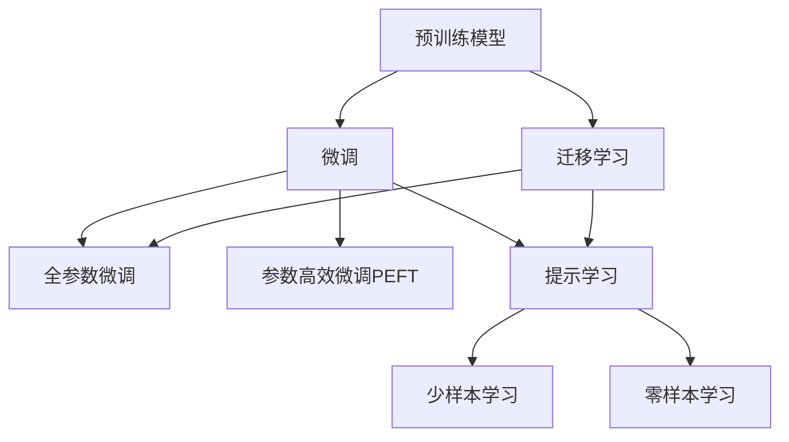

                 

## 1. 背景介绍

### 1.1 问题由来

近年来，大规模语言模型（LLMs）在大规模无标签文本数据上进行预训练，已广泛应用于自然语言处理（NLP）领域，并取得了显著的成效。然而，由于预训练数据和下游任务的分布可能存在较大差异，通用大模型在特定任务上的效果通常不尽如人意。因此，微调（Fine-Tuning）技术应运而生，旨在通过少量的有标签数据对预训练模型进行微调，以适应特定任务，显著提升模型性能。

微调方法主要包括三类：基于监督学习的微调、基于迁移学习的微调和基于提示学习的微调。每种方法各有其优势和适用场景，本文将逐一详细介绍这三种微调方法的原理、步骤、优缺点及应用领域。

### 1.2 问题核心关键点

1. **监督学习微调**：使用标注数据，通过有监督学习优化模型参数，适用于标注数据充足的任务。
2. **迁移学习微调**：利用预训练模型在不同任务之间的迁移能力，减少微调数据需求。
3. **提示学习微调**：通过精心设计的输入格式，引导模型进行特定任务推理，无需更新模型参数。

### 1.3 问题研究意义

微调技术不仅降低了任务开发成本，提升了模型性能，还加速了NLP技术的产业化进程。它还推动了NLP技术在更广泛领域的实际应用，如智能客服、金融舆情监测、个性化推荐等，提升了各行各业的智能化水平。

## 2. 核心概念与联系

### 2.1 核心概念概述

1. **预训练模型（Pre-trained Models）**：通过在大规模无标签数据上自监督学习任务训练得到的通用语言模型。
2. **微调（Fine-Tuning）**：使用少量标注数据优化模型参数，使其适应特定任务。
3. **迁移学习（Transfer Learning）**：利用预训练模型在不同任务之间的迁移能力。
4. **参数高效微调（Parameter-Efficient Fine-Tuning, PEFT）**：在微调过程中仅更新少量模型参数。
5. **提示学习（Prompt Learning）**：通过设计输入格式，引导模型进行特定任务推理。
6. **少样本学习（Few-shot Learning）**：在少数标注数据上进行有效学习。
7. **零样本学习（Zero-shot Learning）**：在没有任何标注数据的情况下，模型仅通过任务描述即可执行新任务。

这些概念之间的联系可以通过以下Mermaid流程图来展示：



这个流程图展示了预训练模型、微调和提示学习之间的联系及其与迁移学习的关系。

## 3. 核心算法原理 & 具体操作步骤

### 3.1 算法原理概述

基于监督学习的微调主要通过使用标注数据对预训练模型进行有监督优化，使其能够执行特定任务。其核心思想是：将预训练模型视为强大的"特征提取器"，通过任务适配层对模型进行微调，使其输出与任务标签相匹配。

### 3.2 算法步骤详解

#### 3.2.1 预训练模型和数据集准备

1. **选择合适的预训练模型**：如BERT、GPT等。
2. **准备下游任务的标注数据集**：划分为训练集、验证集和测试集。

#### 3.2.2 添加任务适配层

1. **设计输出层和损失函数**：
   - 分类任务：使用线性分类器与交叉熵损失。
   - 生成任务：使用语言模型解码器与负对数似然损失。

#### 3.2.3 设置微调超参数

1. **选择优化算法及其参数**：如AdamW、SGD等。
2. **设置正则化技术**：L2正则、Dropout等。
3. **确定参数冻结策略**：仅微调顶层或全参数微调。

#### 3.2.4 执行梯度训练

1. **分批次输入数据，计算损失**。
2. **反向传播计算梯度，更新模型参数**。
3. **周期性在验证集上评估模型性能**。
4. **重复迭代直至满足停止条件**。

#### 3.2.5 测试和部署

1. **在测试集上评估微调后模型**。
2. **使用微调后的模型进行推理预测**。

### 3.3 算法优缺点

**监督学习微调的优点**：
- 简单高效：快速适应少量标注数据。
- 通用适用：适用于各种NLP任务。
- 参数高效：利用参数高效微调技术，避免过拟合。
- 效果显著：提升模型在特定任务上的性能。

**监督学习微调的缺点**：
- 依赖标注数据：标注数据质量与数量直接影响模型效果。
- 迁移能力有限：预训练模型与特定任务之间分布差异大时，性能提升有限。
- 负面效果传递：预训练模型中的偏见和有害信息可能传递到下游任务。
- 可解释性不足：微调模型的决策过程缺乏可解释性。

### 3.4 算法应用领域

监督学习微调在NLP领域的应用非常广泛，包括文本分类、命名实体识别、关系抽取、问答系统、机器翻译、文本摘要、对话系统等。其还适用于医疗问答、金融舆情监测、个性化推荐等多个行业领域。

## 4. 数学模型和公式 & 详细讲解 & 举例说明

### 4.1 数学模型构建

假设预训练模型为 $M_{\theta}$，下游任务为分类任务，训练集为 $D=\{(x_i, y_i)\}_{i=1}^N$，其中 $x_i$ 为输入，$y_i$ 为标签。

经验风险定义为：

$$
\mathcal{L}(\theta) = \frac{1}{N} \sum_{i=1}^N \ell(M_{\theta}(x_i), y_i)
$$

损失函数 $\ell$ 为交叉熵损失，模型输出为 $M_{\theta}(x_i)$。

### 4.2 公式推导过程

以二分类任务为例，输出为 $y_i$ 的概率估计为：

$$
\hat{y}_i = M_{\theta}(x_i)
$$

交叉熵损失函数为：

$$
\ell(\hat{y}_i, y_i) = -[y_i\log \hat{y}_i + (1-y_i)\log (1-\hat{y}_i)]
$$

经验风险为：

$$
\mathcal{L}(\theta) = -\frac{1}{N} \sum_{i=1}^N [y_i\log \hat{y}_i + (1-y_i)\log (1-\hat{y}_i)]
$$

通过反向传播计算梯度，更新模型参数：

$$
\theta \leftarrow \theta - \eta \nabla_{\theta}\mathcal{L}(\theta)
$$

其中 $\eta$ 为学习率。

### 4.3 案例分析与讲解

假设有一个文本分类任务，输入为新闻标题，输出为分类标签。使用BERT模型进行微调，步骤如下：

1. 加载预训练模型和数据集。
2. 添加输出层和损失函数。
3. 设置超参数和优化器。
4. 执行梯度训练和验证集评估。
5. 测试集评估和模型部署。

## 5. 项目实践：代码实例和详细解释说明

### 5.1 开发环境搭建

1. 安装Anaconda。
2. 创建并激活虚拟环境。
3. 安装PyTorch、Transformers等库。

### 5.2 源代码详细实现

以下是一个使用PyTorch和Transformers库对BERT模型进行文本分类微调的代码示例：

```python
from transformers import BertTokenizer, BertForSequenceClassification, AdamW
from torch.utils.data import Dataset, DataLoader
from torch import nn

# 定义数据集
class TextClassificationDataset(Dataset):
    def __init__(self, texts, labels, tokenizer, max_len=128):
        self.tokenizer = tokenizer
        self.max_len = max_len
        self.texts = texts
        self.labels = labels
    
    def __len__(self):
        return len(self.texts)
    
    def __getitem__(self, item):
        text = self.texts[item]
        label = self.labels[item]
        encoding = self.tokenizer(text, truncation=True, padding='max_length', max_length=self.max_len, return_tensors='pt')
        input_ids = encoding['input_ids']
        attention_mask = encoding['attention_mask']
        return {'input_ids': input_ids, 'attention_mask': attention_mask, 'labels': label}

# 加载预训练模型和分词器
tokenizer = BertTokenizer.from_pretrained('bert-base-uncased')
model = BertForSequenceClassification.from_pretrained('bert-base-uncased', num_labels=2)

# 加载数据集
train_dataset = TextClassificationDataset(train_texts, train_labels, tokenizer, max_len=128)
val_dataset = TextClassificationDataset(val_texts, val_labels, tokenizer, max_len=128)
test_dataset = TextClassificationDataset(test_texts, test_labels, tokenizer, max_len=128)

# 设置超参数和优化器
optimizer = AdamW(model.parameters(), lr=2e-5)
device = 'cuda' if torch.cuda.is_available() else 'cpu'
model.to(device)

# 定义训练和评估函数
def train_epoch(model, dataset, optimizer, batch_size):
    model.train()
    dataloader = DataLoader(dataset, batch_size=batch_size, shuffle=True)
    epoch_loss = 0
    for batch in dataloader:
        input_ids = batch['input_ids'].to(device)
        attention_mask = batch['attention_mask'].to(device)
        labels = batch['labels'].to(device)
        optimizer.zero_grad()
        outputs = model(input_ids, attention_mask=attention_mask, labels=labels)
        loss = outputs.loss
        epoch_loss += loss.item()
        loss.backward()
        optimizer.step()
    return epoch_loss / len(dataloader)

def evaluate(model, dataset, batch_size):
    model.eval()
    dataloader = DataLoader(dataset, batch_size=batch_size)
    preds, labels = [], []
    with torch.no_grad():
        for batch in dataloader:
            input_ids = batch['input_ids'].to(device)
            attention_mask = batch['attention_mask'].to(device)
            labels = batch['labels'].to(device)
            outputs = model(input_ids, attention_mask=attention_mask)
            preds.append(outputs.logits.argmax(dim=1))
            labels.append(labels)
        print(classification_report(labels, preds))

# 训练和评估
epochs = 5
batch_size = 16

for epoch in range(epochs):
    train_loss = train_epoch(model, train_dataset, optimizer, batch_size)
    print(f"Epoch {epoch+1}, train loss: {train_loss:.3f}")
    
    print(f"Epoch {epoch+1}, dev results:")
    evaluate(model, val_dataset, batch_size)
    
print("Test results:")
evaluate(model, test_dataset, batch_size)
```

### 5.3 代码解读与分析

- **数据集定义**：定义一个文本分类数据集，将文本和标签进行分词和编码。
- **模型加载**：加载预训练BERT模型，并添加输出层和损失函数。
- **超参数设置**：定义学习率和优化器。
- **训练函数**：定义一个训练函数，在训练集上进行迭代训练。
- **评估函数**：定义一个评估函数，在验证集和测试集上进行性能评估。
- **训练循环**：循环进行训练和验证，在测试集上输出最终结果。

## 6. 实际应用场景

### 6.1 智能客服系统

微调技术可以应用于智能客服系统，使机器人能够理解客户查询，自动生成回复。收集历史客服对话记录，微调大模型，使其能够根据上下文理解客户意图，生成自然流畅的响应。

### 6.2 金融舆情监测

在金融领域，微调技术可以用于实时监控市场舆情，识别负面信息，及时预警。利用金融领域的相关文本数据，微调模型，使其能够自动识别舆情变化，快速响应潜在风险。

### 6.3 个性化推荐系统

个性化推荐系统可以通过微调技术，学习用户兴趣和行为，提供更加精准的推荐。收集用户浏览、点击等数据，微调模型，使其能够预测用户对不同内容的偏好。

### 6.4 未来应用展望

随着微调技术的不断进步，未来将在更多领域得到应用，如智慧医疗、教育、智慧城市等。微调技术将帮助这些行业提升智能化水平，提供更加高效、可靠的服务。

## 7. 工具和资源推荐

### 7.1 学习资源推荐

- 《Transformer从原理到实践》：介绍Transformer原理、BERT模型、微调技术。
- 《深度学习自然语言处理》课程：斯坦福大学NLP课程，涵盖NLP基本概念和经典模型。
- 《Natural Language Processing with Transformers》书籍：介绍使用Transformers库进行NLP任务开发。
- HuggingFace官方文档：提供丰富的预训练模型和微调样例代码。

### 7.2 开发工具推荐

- PyTorch：灵活的深度学习框架，适合快速迭代研究。
- TensorFlow：生产部署方便，适合大规模工程应用。
- Transformers库：提供丰富的预训练模型，支持微调。
- Weights & Biases：模型训练实验跟踪工具。
- TensorBoard：可视化工具，监测模型训练状态。

### 7.3 相关论文推荐

- Attention is All You Need：提出Transformer结构。
- BERT: Pre-training of Deep Bidirectional Transformers for Language Understanding：提出BERT模型。
- Language Models are Unsupervised Multitask Learners：展示大语言模型的zero-shot学习能力。
- Parameter-Efficient Transfer Learning for NLP：提出Adapter等参数高效微调方法。
- Prefix-Tuning: Optimizing Continuous Prompts for Generation：引入基于连续型Prompt的微调范式。
- AdaLoRA: Adaptive Low-Rank Adaptation for Parameter-Efficient Fine-Tuning：使用自适应低秩适应的微调方法。

## 8. 总结：未来发展趋势与挑战

### 8.1 总结

本文系统介绍了基于监督学习的微调方法，涵盖原理、步骤、优缺点及应用领域。监督学习微调在大规模语言模型上取得了显著效果，适用于标注数据充足的任务。

### 8.2 未来发展趋势

1. **模型规模增大**：预训练语言模型规模不断扩大，为微调提供更丰富的知识。
2. **微调方法多样化**：参数高效微调、融合因果和对比学习等方法不断涌现。
3. **持续学习**：微调模型需要不断学习新数据，保持性能。
4. **标注数据需求降低**：提示学习等方法减少对标注数据的依赖。
5. **多模态微调**：融合视觉、语音等多模态数据，提升语言模型能力。
6. **通用性增强**：模型具备更强的跨领域迁移能力，逐步迈向通用人工智能。

### 8.3 面临的挑战

1. **标注成本瓶颈**：微调依赖高质量标注数据，获取成本高。
2. **模型鲁棒性不足**：面对域外数据，泛化性能较差。
3. **推理效率低**：大模型推理速度慢，资源消耗大。
4. **可解释性不足**：微调模型输出缺乏解释。
5. **安全性问题**：预训练模型可能包含有害信息。
6. **知识整合能力不足**：模型难以利用外部知识。

### 8.4 研究展望

未来研究应集中在降低微调对标注数据的依赖，提高模型鲁棒性，提升推理效率和可解释性，确保模型安全性等方面。

## 9. 附录：常见问题与解答

**Q1：监督学习微调是否适用于所有NLP任务？**

A: 监督学习微调适用于标注数据充足的任务，但对于特定领域或数据量较少的问题，效果可能不理想。

**Q2：如何选择合适的学习率？**

A: 监督学习微调的学习率一般要比预训练时小1-2个数量级，初始学习率可以从1e-5开始调整，逐步减小。

**Q3：微调过程中如何避免过拟合？**

A: 数据增强、正则化、对抗训练等方法可以缓解过拟合问题。

**Q4：微调模型在部署时需要注意哪些问题？**

A: 模型裁剪、量化加速、服务化封装、弹性伸缩、监控告警等措施是必要的。

**Q5：如何提高微调模型的鲁棒性？**

A: 引入因果推断、对比学习等方法，增强模型泛化能力。

---

作者：禅与计算机程序设计艺术 / Zen and the Art of Computer Programming

