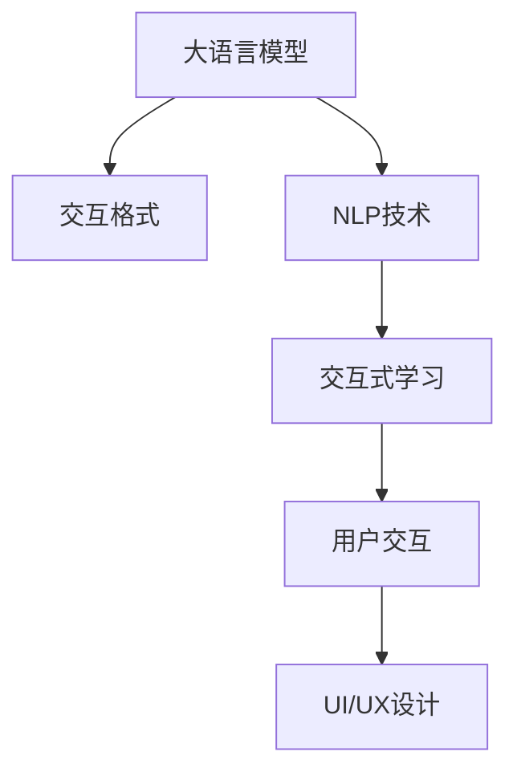

                 

# 大语言模型应用指南：交互格式

> 关键词：大语言模型, 交互界面设计, 自然语言处理(NLP), 用户交互, 交互式学习, 交互格式, 交互设计

## 1. 背景介绍

### 1.1 问题由来

随着人工智能技术的迅猛发展，大语言模型（Large Language Model, LLM）在自然语言处理（Natural Language Processing, NLP）领域取得了突破性的进展。LLM通过大规模无标签文本数据进行预训练，能够生成高度逼真的自然语言文本。然而，虽然LLM在预训练阶段掌握了丰富的语言知识，但在实际应用中，用户如何与大语言模型进行交互，并从中获取有用的信息，成为了一个需要解决的关键问题。

交互格式设计是大语言模型应用中的重要一环。好的交互格式设计可以提高用户的交互体验，降低交互难度，更好地满足用户需求。然而，当前多数大语言模型应用还局限于命令行界面或者简单的网页输入框，缺乏更丰富的交互方式，用户体验有待提升。因此，本文将系统地探讨交互格式在大语言模型中的应用，旨在为开发人员提供详细的指导，以期构建出更加友好、高效的大语言模型应用。

### 1.2 问题核心关键点

交互格式设计涉及多个核心关键点：
- **用户友好性**：如何设计交互界面，使用户能够更自然地与模型进行交互。
- **交互复杂性**：如何平衡交互的复杂性与功能的多样性，避免给用户带来过高的学习成本。
- **实时反馈**：如何在交互过程中提供即时反馈，帮助用户快速理解模型的输出和错误。
- **多样化的交互方式**：除了传统的文本输入，是否还应该支持语音、图像、视频等多模态的交互方式。
- **隐私与安全**：如何保证交互过程中的数据安全，避免用户隐私泄露。

解决好这些关键点，能够有效提升大语言模型应用的用户体验和功能性，促进其在大规模落地场景中的应用。

## 2. 核心概念与联系

### 2.1 核心概念概述

为了更好地理解交互格式在大语言模型中的应用，本节将介绍几个核心概念：

- **大语言模型（Large Language Model, LLM）**：通过大规模无标签文本数据进行预训练，能够生成高质量自然语言文本的模型。如GPT-3、BERT等。
- **交互格式（Interaction Format）**：用户与大语言模型交互的界面设计，包括文本、语音、图像等多种形式。
- **自然语言处理（Natural Language Processing, NLP）**：使用计算机科学、人工智能等技术处理和理解人类语言。
- **用户交互（User Interaction）**：用户与系统之间的互动过程，包括输入、输出等环节。
- **交互式学习（Interactive Learning）**：用户通过与系统交互，逐渐掌握知识和技能的过程。
- **交互界面设计（UI/UX Design）**：优化交互界面，提升用户体验，提高交互效率。

这些概念之间的逻辑关系可以通过以下Mermaid流程图来展示：



这个流程图展示了大语言模型的核心概念及其之间的关系：

1. 大语言模型通过NLP技术处理用户输入，生成输出。
2. 用户通过交互界面与模型进行互动。
3. 交互式学习通过优化用户交互过程，提升学习效果。
4. UI/UX设计影响交互体验和效率。

这些概念共同构成了大语言模型应用的基础，对于构建用户友好、高效的应用至关重要。

## 3. 核心算法原理 & 具体操作步骤
### 3.1 算法原理概述

交互格式在大语言模型中的应用，本质上是一种将用户输入转化为模型输出的过程。其核心思想是通过友好的交互界面，使用户能够方便地输入查询，并接收模型的反馈。交互格式设计的目标是最大化信息传输效率，同时保证用户交互的流畅性和自然性。

形式化地，假设用户输入的查询为 $q$，大语言模型的输出为 $a$。交互格式设计的问题可以描述为：如何设计一个合适的用户界面，使得用户能够方便地输入 $q$，并从模型接收到 $a$ 作为回答。

### 3.2 算法步骤详解

交互格式设计主要包括以下几个关键步骤：

**Step 1: 确定交互目标**

首先需要明确用户希望通过大语言模型实现的目标。目标可以是获取信息、回答问题、生成文本等。明确目标有助于设计符合用户需求的交互界面。

**Step 2: 设计交互界面**

根据用户目标，设计友好的交互界面。界面设计应考虑以下因素：
- 输入方式：文本、语音、图像、视频等。
- 界面布局：包括标题、输入框、按钮等组件的合理布局。
- 反馈机制：即时反馈、动画效果、交互提示等。

**Step 3: 实现交互逻辑**

将交互界面与大语言模型对接，实现用户输入与模型输出的映射。需要考虑：
- 数据预处理：对用户输入进行分词、标准化等预处理。
- 模型调用：将处理后的数据输入模型，获取输出结果。
- 结果展示：将模型输出以友好的形式展示给用户。

**Step 4: 用户交互测试**

完成交互界面开发后，需要进行用户测试。测试内容包括：
- 用户友好性：用户是否能够轻松地理解和使用界面。
- 交互效率：用户完成操作的时间是否合理。
- 准确性：模型输出的准确性是否满足用户需求。

### 3.3 算法优缺点

交互格式在大语言模型中的应用具有以下优点：
1. 提升用户体验：友好的交互界面设计能够降低用户的学习成本，提升用户体验。
2. 提高交互效率：合理的交互逻辑设计能够优化信息传输过程，减少用户等待时间。
3. 增强模型适用性：多样化的交互方式支持用户以多种方式与模型互动，提高模型的适用性。
4. 促进用户学习：通过交互式学习，用户能够更快地掌握知识和技能。

同时，交互格式设计也存在一些局限性：
1. 设计复杂度高：设计友好的交互界面需要耗费大量时间和精力。
2. 交互方式有限：虽然可以支持多模态交互，但现有的技术尚未完全支持。
3. 数据隐私问题：交互过程中涉及大量用户数据，数据隐私和安全问题需要特别关注。

尽管如此，交互格式设计仍是大语言模型应用中不可或缺的一环，是提升用户体验和应用效果的关键。

### 3.4 算法应用领域

交互格式设计在大语言模型中的应用领域非常广泛，涵盖了NLP的多个子领域：

- **问答系统**：如智能客服、搜索引擎等，用户通过输入问题，获取模型的回答。
- **文本生成**：如机器翻译、文本摘要等，用户通过输入文本，获取模型的生成结果。
- **对话系统**：如聊天机器人、虚拟助手等，用户通过与模型对话，获取互动反馈。
- **信息检索**：如文档搜索、知识图谱等，用户通过输入关键词，获取相关的信息。
- **情感分析**：如情感识别、舆情分析等，用户通过输入文本，获取情感分析结果。

此外，交互格式设计还应用于更多的实际场景中，如智能家居、医疗咨询、教育辅导等，为各行各业带来智能化升级。

## 4. 数学模型和公式 & 详细讲解 & 举例说明

### 4.1 数学模型构建

交互格式设计的数学模型可以从以下几个方面进行构建：

1. **输入处理**：将用户输入 $q$ 转化为模型可处理的形式，如分词、标准化等。
2. **模型调用**：通过调用大语言模型，将输入转化为输出。
3. **输出展示**：将模型输出 $a$ 以友好的形式展示给用户。

### 4.2 公式推导过程

设用户输入为 $q$，模型输出为 $a$。交互格式设计的过程可以表示为：

$$
q \rightarrow \text{处理} \rightarrow \text{调用} \rightarrow a \rightarrow \text{展示}
$$

其中，“处理”和“展示”可以进一步细化为具体的算法步骤。例如，“处理”可以包括分词、标准化等预处理操作，“展示”可以包括格式化输出、语音合成等展示方式。

### 4.3 案例分析与讲解

以智能客服系统为例，分析交互格式设计的具体过程：

1. **确定交互目标**：智能客服系统的目标是回答用户的问题，提供自动化的客户服务。
2. **设计交互界面**：设计友好的网页界面，包含输入框、聊天记录框、提示信息等组件。
3. **实现交互逻辑**：将用户输入的问题，通过分词、标准化等处理后，输入大语言模型进行回答。将模型的输出格式化为自然语言，展示给用户。
4. **用户交互测试**：对智能客服系统进行用户测试，评估系统的友好性、交互效率和准确性。

通过这样的设计，智能客服系统能够提供高效、自然的用户交互体验，显著提升用户体验。

## 5. 项目实践：代码实例和详细解释说明

### 5.1 开发环境搭建

在进行交互格式设计实践前，我们需要准备好开发环境。以下是使用Python进行交互格式设计的开发环境配置流程：

1. 安装Anaconda：从官网下载并安装Anaconda，用于创建独立的Python环境。

2. 创建并激活虚拟环境：
```bash
conda create -n interaction-format python=3.8 
conda activate interaction-format
```

3. 安装必要的Python库：
```bash
pip install flask numpy pandas scikit-learn NLTK
```

4. 安装交互格式设计的相关工具：
```bash
pip install spacy sentencepiece wget pycld2
```

完成上述步骤后，即可在`interaction-format`环境中开始交互格式设计的实践。

### 5.2 源代码详细实现

这里我们以问答系统为例，给出使用Flask框架对大语言模型进行交互格式设计的PyTorch代码实现。

首先，定义问答系统中的交互界面组件：

```python
from flask import Flask, render_template, request, jsonify

app = Flask(__name__)

@app.route('/')
def index():
    return render_template('index.html')

@app.route('/answer', methods=['POST'])
def answer():
    query = request.form.get('query')
    # 调用大语言模型进行回答
    # ...
    # 格式化输出，展示给用户
    return jsonify({'answer': model_answer})
```

接下来，定义大语言模型回答问题的函数：

```python
from transformers import pipeline

# 加载预训练模型
model = pipeline('text-generation', model='gpt-3')

@app.route('/answer', methods=['POST'])
def answer():
    query = request.form.get('query')
    # 调用大语言模型进行回答
    model_answer = model(query)
    # 格式化输出，展示给用户
    return jsonify({'answer': model_answer})
```

最后，定义交互界面展示逻辑：

```python
@app.route('/')
def index():
    return render_template('index.html')
```

完整代码如下：

```python
from flask import Flask, render_template, request, jsonify
from transformers import pipeline

app = Flask(__name__)

@app.route('/')
def index():
    return render_template('index.html')

@app.route('/answer', methods=['POST'])
def answer():
    query = request.form.get('query')
    # 调用大语言模型进行回答
    model = pipeline('text-generation', model='gpt-3')
    model_answer = model(query)
    # 格式化输出，展示给用户
    return jsonify({'answer': model_answer})
```

### 5.3 代码解读与分析

让我们再详细解读一下关键代码的实现细节：

**Flask框架**：
- 使用Flask框架搭建Web服务，提供交互界面和接口调用。
- 定义`/`路由，返回交互界面模板。
- 定义`/answer`路由，接收用户输入，调用大语言模型进行回答，并返回JSON格式的输出。

**交互界面模板**：
- 在模板文件中，使用HTML标签定义交互界面组件，如输入框、聊天记录框、提示信息等。
- 添加事件处理函数，监听用户输入并调用`/answer`路由。

**大语言模型调用**：
- 使用Transformers库提供的预训练模型进行文本生成。
- 将用户输入作为模型输入，获取模型的生成结果。

**JSON输出**：
- 将模型的生成结果以JSON格式返回，方便前端页面展示。

这个代码实现展示了大语言模型与交互格式设计的结合过程，通过简单的Flask服务，实现了友好的交互界面和高效的模型调用。

### 5.4 运行结果展示

运行上述代码后，可以通过访问`http://localhost:5000`查看交互界面，输入问题后，模型将自动生成回答并展示在界面上。

## 6. 实际应用场景

### 6.1 智能客服系统

基于大语言模型的问答系统可以广泛应用于智能客服场景中。传统客服依赖人工处理，高峰期响应缓慢，且难以保证一致性和专业性。而基于大语言模型的问答系统，能够7x24小时不间断服务，快速响应客户咨询，以自然流畅的语言解答各类常见问题。

在技术实现上，可以收集企业内部的历史客服对话记录，将问题和最佳答复构建成监督数据，在此基础上对预训练大语言模型进行微调。微调后的模型能够自动理解用户意图，匹配最合适的答案模板进行回复。对于用户提出的新问题，还可以接入检索系统实时搜索相关内容，动态组织生成回答。如此构建的智能客服系统，能大幅提升客户咨询体验和问题解决效率。

### 6.2 金融舆情监测

金融机构需要实时监测市场舆论动向，以便及时应对负面信息传播，规避金融风险。传统的人工监测方式成本高、效率低，难以应对网络时代海量信息爆发的挑战。基于大语言模型的文本分类和情感分析技术，为金融舆情监测提供了新的解决方案。

具体而言，可以收集金融领域相关的新闻、报道、评论等文本数据，并对其进行主题标注和情感标注。在此基础上对预训练语言模型进行微调，使其能够自动判断文本属于何种主题，情感倾向是正面、中性还是负面。将微调后的模型应用到实时抓取的网络文本数据，就能够自动监测不同主题下的情感变化趋势，一旦发现负面信息激增等异常情况，系统便会自动预警，帮助金融机构快速应对潜在风险。

### 6.3 个性化推荐系统

当前的推荐系统往往只依赖用户的历史行为数据进行物品推荐，无法深入理解用户的真实兴趣偏好。基于大语言模型微调技术，个性化推荐系统可以更好地挖掘用户行为背后的语义信息，从而提供更精准、多样的推荐内容。

在实践中，可以收集用户浏览、点击、评论、分享等行为数据，提取和用户交互的物品标题、描述、标签等文本内容。将文本内容作为模型输入，用户的后续行为（如是否点击、购买等）作为监督信号，在此基础上微调预训练语言模型。微调后的模型能够从文本内容中准确把握用户的兴趣点。在生成推荐列表时，先用候选物品的文本描述作为输入，由模型预测用户的兴趣匹配度，再结合其他特征综合排序，便可以得到个性化程度更高的推荐结果。

### 6.4 未来应用展望

随着大语言模型和交互格式设计的不断发展，基于大语言模型的交互式应用将呈现以下几个发展趋势：

1. **多模态交互**：除了文本交互，还将支持语音、图像、视频等多种模态的交互方式，进一步丰富用户体验。
2. **自然语言生成（NLG）**：结合大语言模型的生成能力，自动生成自然语言回复，提升用户对话体验。
3. **语义理解与生成（Semantic Understanding & Generation）**：通过语义分析，理解用户意图，生成更加符合语境的回答。
4. **知识图谱融合**：将知识图谱与大语言模型结合，增强模型的语义推理和知识整合能力。
5. **智能对话（Smart Dialogue）**：通过上下文理解与记忆，提升对话系统的一致性和连贯性。
6. **跨领域应用**：将大语言模型应用于医疗、法律、教育等多个领域，提升各行业的智能化水平。

这些趋势展示了交互格式设计在大语言模型应用中的广阔前景，为构建智能化、高效化的人机交互系统提供了新的思路。相信随着技术的发展，交互格式设计将在大语言模型应用中发挥更加重要的作用，推动人工智能技术在更多场景中的落地应用。

## 7. 工具和资源推荐
### 7.1 学习资源推荐

为了帮助开发者掌握交互格式设计的方法和技巧，这里推荐一些优质的学习资源：

1. **《交互设计基础》（Interaction Design Foundation）**：系统介绍交互设计的基本原则和方法，涵盖用户研究、界面设计、交互流程等多个方面。
2. **《交互设计模式》（Interaction Design Patterns）**：总结了多种常见的交互设计模式，提供丰富的案例和实践指导。
3. **《UX设计之美》（Interaction Design in the Age of AI）**：探讨了人工智能时代下的交互设计方法，强调用户体验和数据驱动的设计思路。
4. **《设计心理学》（The Psychology of Interaction Design）**：分析了用户心理对交互设计的影响，提供设计心理学的相关理论。
5. **《交互设计中的最佳实践》（Best Practices in Interaction Design）**：总结了交互设计中的常见最佳实践，帮助开发者提升设计水平。

通过对这些资源的学习实践，相信你一定能够系统掌握交互格式设计的方法，并将其应用于大语言模型应用的开发中。

### 7.2 开发工具推荐

高效的开发离不开优秀的工具支持。以下是几款用于交互格式设计的常用工具：

1. **Flask**：轻量级的Web框架，易于上手，适用于快速原型设计和部署。
2. **Django**：全功能的Web框架，适合大型项目开发，支持多种数据模型和用户认证。
3. **React**：用于构建交互式Web应用的JavaScript库，支持丰富的组件和状态管理。
4. **Vue.js**：轻量级的JavaScript框架，支持组件化开发和双向数据绑定。
5. **TensorBoard**：TensorFlow配套的可视化工具，可用于交互格式设计的可视化和调试。

合理利用这些工具，可以显著提升交互格式设计的开发效率，加快创新迭代的步伐。

### 7.3 相关论文推荐

交互格式设计在大语言模型中的应用，是一个跨学科的研究领域，涉及人机交互、自然语言处理等多个学科。以下是几篇奠基性的相关论文，推荐阅读：

1. **《交互界面设计原理》（Interaction Design Principles）**：总结了交互设计的基本原则和方法。
2. **《多模态交互设计》（Multimodal Interaction Design）**：探讨了多模态交互设计的原理和实践方法。
3. **《交互式学习》（Interactive Learning）**：研究了交互式学习的过程和效果。
4. **《交互界面的认知模型》（Cognitive Models of Interaction Design）**：分析了用户认知对交互界面设计的影响。
5. **《自然语言生成》（Natural Language Generation）**：研究了自然语言生成技术在交互格式设计中的应用。

这些论文代表了大语言模型和交互格式设计的发展脉络，通过学习这些前沿成果，可以帮助研究者把握学科前进方向，激发更多的创新灵感。

## 8. 总结：未来发展趋势与挑战

### 8.1 总结

本文对交互格式在大语言模型中的应用进行了全面系统的介绍。首先阐述了交互格式设计的背景和意义，明确了交互格式设计在大语言模型应用中的重要价值。其次，从原理到实践，详细讲解了交互格式设计的数学模型和操作步骤，给出了交互格式设计任务开发的完整代码实例。同时，本文还广泛探讨了交互格式设计在智能客服、金融舆情、个性化推荐等多个行业领域的应用前景，展示了交互格式设计的巨大潜力。最后，本文精选了交互格式设计的各类学习资源，力求为读者提供全方位的技术指引。

通过本文的系统梳理，可以看到，交互格式设计是大语言模型应用的重要组成部分，是提升用户体验和应用效果的关键。通过精心设计交互界面和交互逻辑，能够显著提升用户与大语言模型的互动体验，推动大语言模型应用的广泛落地。

### 8.2 未来发展趋势

展望未来，交互格式设计将呈现以下几个发展趋势：

1. **更加自然化的交互方式**：随着自然语言处理技术的发展，交互界面将更加自然化，用户无需繁琐的操作即可完成复杂任务。
2. **多模态融合**：结合语音、图像、视频等多种模态，为用户提供更加丰富的交互体验。
3. **智能对话**：结合知识图谱和语义理解技术，提升对话系统的智能性和连贯性。
4. **个性化推荐**：结合用户行为数据和个性化需求，提供更加精准的推荐服务。
5. **跨平台一致性**：通过统一设计规范，提升不同平台间的交互一致性，减少用户的学习成本。

这些趋势展示了交互格式设计在大语言模型应用中的广阔前景，为构建智能化、高效化的人机交互系统提供了新的思路。相信随着技术的发展，交互格式设计将在大语言模型应用中发挥更加重要的作用，推动人工智能技术在更多场景中的落地应用。

### 8.3 面临的挑战

尽管交互格式设计已经取得了显著进展，但在迈向更加智能化、普适化应用的过程中，它仍面临着诸多挑战：

1. **设计复杂度高**：设计友好的交互界面需要耗费大量时间和精力。
2. **技术成熟度不足**：多模态交互、自然语言生成等技术仍处于发展初期，尚未完全成熟。
3. **数据隐私问题**：交互过程中涉及大量用户数据，数据隐私和安全问题需要特别关注。
4. **交互一致性**：不同平台间的交互设计需要保持一致，避免用户混淆。
5. **交互效率**：需要优化交互逻辑，提高信息传输效率，减少用户等待时间。

尽管如此，交互格式设计仍是大语言模型应用中不可或缺的一环，是提升用户体验和应用效果的关键。相信随着技术的不断进步，交互格式设计的复杂度将逐步降低，技术成熟度将不断提高，数据隐私问题也将得到更好的解决。

### 8.4 研究展望

未来的交互格式设计研究需要在以下几个方面寻求新的突破：

1. **自动化设计工具**：开发交互格式设计的自动化工具，降低设计复杂度，提高设计效率。
2. **多模态交互技术**：研发多模态交互技术，支持语音、图像、视频等多种模态的交互方式。
3. **自然语言生成技术**：提升自然语言生成的准确性和自然性，实现更加自然化的交互体验。
4. **交互一致性设计**：制定交互一致性的设计规范，提升不同平台间的交互一致性。
5. **交互效率优化**：优化交互逻辑，提高信息传输效率，减少用户等待时间。

这些研究方向的探索，必将引领交互格式设计技术的进一步发展，为构建更加智能化、高效化的人机交互系统提供新的思路。面向未来，交互格式设计需要与其他人工智能技术进行更深入的融合，如知识表示、因果推理、强化学习等，多路径协同发力，共同推动自然语言理解和智能交互系统的进步。只有勇于创新、敢于突破，才能不断拓展语言模型的边界，让智能技术更好地造福人类社会。

## 9. 附录：常见问题与解答

**Q1：交互格式设计是否适用于所有NLP任务？**

A: 交互格式设计在大语言模型应用中具有广泛适用性，尤其适用于需要用户输入的问答、对话、推荐等任务。但对于无需用户输入的任务，如文本分类、情感分析等，交互格式设计并不是必需的。

**Q2：如何设计友好的交互界面？**

A: 设计友好的交互界面需要考虑以下几点：
1. 简洁明了：界面设计应尽量简洁，避免复杂的操作和冗余的信息。
2. 直观易用：用户能够直观地理解界面操作和反馈机制。
3. 反馈及时：系统应即时反馈用户的操作结果，帮助用户快速了解反馈。
4. 个性化定制：根据用户需求提供个性化定制的选项。

**Q3：交互格式设计是否会影响模型性能？**

A: 交互格式设计并不直接影响模型的性能，但会影响用户的体验和操作的便捷性。良好的交互格式设计可以显著提升用户的使用体验，从而间接地提升模型的应用效果。

**Q4：交互格式设计是否需要考虑隐私问题？**

A: 是的，交互格式设计中涉及大量的用户数据，隐私保护是不可忽视的重要问题。应确保用户数据的安全和匿名化处理，避免数据泄露和滥用。

**Q5：交互格式设计是否可以应用于多模态交互？**

A: 是的，交互格式设计可以应用于多模态交互，结合语音、图像、视频等多种模态，提升用户的交互体验。但当前的技术实现还存在一定限制，需要进一步优化和完善。

通过对这些常见问题的解答，相信你能够更好地理解交互格式设计在大语言模型应用中的重要性和具体实现方法。希望本文能够为你提供有价值的参考，帮助你在大语言模型应用的设计和开发中取得更好的成果。

---

作者：禅与计算机程序设计艺术 / Zen and the Art of Computer Programming

