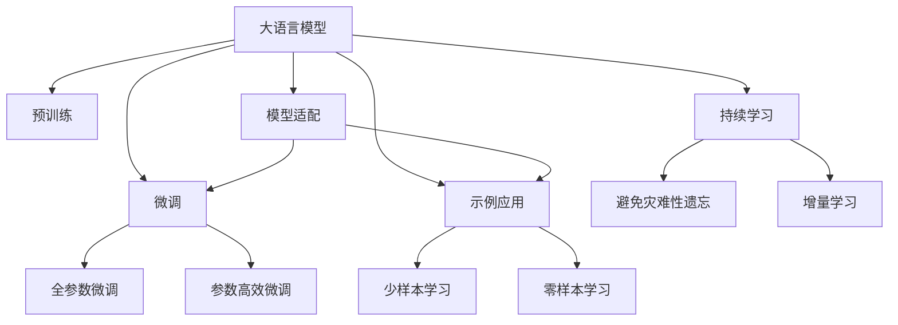

                 

# 大语言模型应用指南：尽量使用示例

> 关键词：大语言模型,示例应用,自然语言处理(NLP),机器学习,深度学习,Python,代码实现

## 1. 背景介绍

### 1.1 问题由来
大语言模型（Large Language Models, LLMs）是近年来自然语言处理（NLP）领域的一大突破，其基于深度学习算法，通过大规模无标签文本数据的预训练，获得了强大的语言理解和生成能力。这些模型通常拥有上亿参数，如BERT、GPT-3、T5等，在各种NLP任务中取得了显著的性能。

但面对纷繁复杂的实际应用场景，如何将大语言模型应用于具体任务，是一个需要深思熟虑的问题。一方面，现有的大模型往往过于庞大，不便于快速部署和优化；另一方面，特定领域的数据集和任务需求差异较大，通用模型难以完全满足特定需求。

因此，如何在保持大语言模型性能的同时，尽可能使用示例，以便快速开发、调试和部署，成为当前大模型应用的一个重要课题。

### 1.2 问题核心关键点
基于大语言模型的示例应用，关键在于以下两点：

1. **示例使用**：通过精心设计的示例输入和输出，引导模型理解并生成特定任务的正确结果，降低微调难度和成本。
2. **模型适配**：在大语言模型的基础上，针对特定任务进行微调，调整顶层输出层或解码器，以适应任务的输入输出格式。

这些关键点决定了示例应用不仅能够快速构建模型，而且能够根据实际任务需求进行高效微调，提升模型性能。

## 2. 核心概念与联系

### 2.1 核心概念概述

为更好地理解大语言模型在示例应用中的使用，本节将介绍几个密切相关的核心概念：

- **大语言模型（Large Language Models, LLMs）**：以BERT、GPT等深度学习模型为代表，通过大规模无标签文本数据预训练获得语言理解能力的模型。

- **预训练（Pre-training）**：指在大规模无标签文本数据上，通过自监督学习任务训练通用语言模型的过程。常见的预训练任务包括语言建模、掩码语言模型等。

- **微调（Fine-tuning）**：指在大语言模型的基础上，通过有监督学习优化模型在特定任务上的性能。通常只调整顶层输出层或解码器，以适配任务的输入输出格式。

- **示例应用（Prompt Engineering）**：通过设计合理的输入格式（即提示模板），引导大语言模型进行特定任务的推理和生成。

- **模型适配（Model Adaptation）**：在大语言模型的基础上，针对特定任务进行微调，调整模型参数以适应任务的特定需求。

这些核心概念之间的逻辑关系可以通过以下Mermaid流程图来展示：



这个流程图展示了从大语言模型到实际应用场景的基本流程：

1. 大语言模型通过预训练获得基础能力。
2. 微调是对预训练模型进行任务特定的优化，可以分为全参数微调和参数高效微调。
3. 示例应用是一种不更新模型参数的方法，通过输入格式设计引导模型执行特定任务。
4. 模型适配在大语言模型的基础上，针对特定任务进行微调，调整顶层输出层或解码器。
5. 持续学习使得模型能够不断学习新知识，同时保持已学习的知识。

这些概念共同构成了大语言模型的应用框架，使其能够在各种场景下发挥强大的语言理解和生成能力。通过理解这些核心概念，我们可以更好地把握大语言模型的应用方向。

## 3. 核心算法原理 & 具体操作步骤
### 3.1 算法原理概述

基于大语言模型的示例应用，本质上是利用模型在不同输入格式下的表现，进行特定任务的推理和生成。其核心思想是：通过精心设计的输入格式，将通用大语言模型转化为适应特定任务的工具。

形式化地，假设预训练模型为 $M_{\theta}$，其中 $\theta$ 为预训练得到的模型参数。给定下游任务 $T$ 的少量标注数据 $D=\{(x_i, y_i)\}_{i=1}^N$，示例应用的目标是找到最优的输入格式 $\mathcal{P}$，使得模型在特定格式下的表现 $M_{\theta}(\mathcal{P}(x_i))$ 逼近真实标签 $y_i$。

在实践中，我们通常使用基于梯度的优化算法（如Adam、SGD等）来近似求解上述最优化问题。设 $\eta$ 为学习率，$\lambda$ 为正则化系数，则参数的更新公式为：

$$
\theta \leftarrow \theta - \eta \nabla_{\theta}\mathcal{L}(\theta) - \eta\lambda\theta
$$

其中 $\nabla_{\theta}\mathcal{L}(\theta)$ 为损失函数对参数 $\theta$ 的梯度，可通过反向传播算法高效计算。

### 3.2 算法步骤详解

基于大语言模型的示例应用一般包括以下几个关键步骤：

**Step 1: 准备预训练模型和数据集**
- 选择合适的预训练语言模型 $M_{\theta}$ 作为初始化参数，如 BERT、GPT 等。
- 准备下游任务 $T$ 的少量标注数据集 $D$，划分为训练集、验证集和测试集。一般要求标注数据与预训练数据的分布不要差异过大。

**Step 2: 设计示例输入格式**
- 根据任务类型，设计合适的输入格式（即提示模板），以引导模型执行特定任务。提示模板通常包括任务描述、示例数据等。

**Step 3: 训练示例模型**
- 将训练集数据分批次输入模型，前向传播计算损失函数。
- 反向传播计算参数梯度，根据设定的优化算法和学习率更新模型参数。
- 周期性在验证集上评估模型性能，根据性能指标决定是否触发 Early Stopping。
- 重复上述步骤直到满足预设的迭代轮数或 Early Stopping 条件。

**Step 4: 测试和部署**
- 在测试集上评估示例模型 $M_{\theta}(\mathcal{P}(x))$ 的性能，对比示例前后的精度提升。
- 使用示例模型对新样本进行推理预测，集成到实际的应用系统中。

以上是基于大语言模型的示例应用的一般流程。在实际应用中，还需要针对具体任务的特点，对示例过程的各个环节进行优化设计，如改进输入格式设计，引入更多的正则化技术，搜索最优的超参数组合等，以进一步提升模型性能。

### 3.3 算法优缺点

基于大语言模型的示例应用方法具有以下优点：
1. 简单高效。只需准备少量标注数据，即可对预训练模型进行快速适配，获得较大的性能提升。
2. 通用适用。适用于各种NLP下游任务，包括分类、匹配、生成等，设计简单的示例格式即可实现示例应用。
3. 参数高效。利用示例格式设计，在固定大部分预训练参数的情况下，仍可取得不错的提升。
4. 效果显著。在学术界和工业界的诸多任务上，基于示例应用的模型已经刷新了最先进的性能指标。

同时，该方法也存在一定的局限性：
1. 示例设计难度高。示例格式的设计需要充分理解任务要求，有时需要多次迭代和调整。
2. 示例应用受输入格式限制。不同的任务可能需要设计不同的输入格式，模型适配性有限。
3. 示例应用依赖预训练模型。示例模板设计需要基于预训练模型的理解能力，对预训练模型的泛化能力有较高要求。

尽管存在这些局限性，但就目前而言，基于示例应用的模型仍然是NLP应用的主流范式。未来相关研究的重点在于如何进一步降低示例设计难度，提高模型的少样本学习和跨领域迁移能力，同时兼顾可解释性和伦理安全性等因素。

### 3.4 算法应用领域

基于大语言模型的示例应用方法在NLP领域已经得到了广泛的应用，覆盖了几乎所有常见任务，例如：

- 文本分类：如情感分析、主题分类、意图识别等。通过设计任务描述和示例数据，引导模型学习文本-标签映射。
- 命名实体识别：识别文本中的人名、地名、机构名等特定实体。通过示例输入格式，使模型掌握实体边界和类型。
- 关系抽取：从文本中抽取实体之间的语义关系。通过示例输入格式，使模型学习实体-关系三元组。
- 问答系统：对自然语言问题给出答案。通过示例输入格式，使模型理解问题-答案对，并生成相应答案。
- 机器翻译：将源语言文本翻译成目标语言。通过示例输入格式，使模型学习语言-语言映射。
- 文本摘要：将长文本压缩成简短摘要。通过示例输入格式，使模型学习抓取文本要点。
- 对话系统：使机器能够与人自然对话。通过示例输入格式，使模型理解对话历史，生成回复。

除了上述这些经典任务外，示例应用还被创新性地应用到更多场景中，如可控文本生成、常识推理、代码生成、数据增强等，为NLP技术带来了全新的突破。随着预训练模型和示例应用方法的不断进步，相信NLP技术将在更广阔的应用领域大放异彩。

## 4. 数学模型和公式 & 详细讲解  
### 4.1 数学模型构建

本节将使用数学语言对基于大语言模型的示例应用过程进行更加严格的刻画。

记预训练语言模型为 $M_{\theta}$，其中 $\theta$ 为预训练得到的模型参数。假设示例应用任务的训练集为 $D=\{(\mathcal{P}(x_i),y_i)\}_{i=1}^N$，其中 $\mathcal{P}$ 表示示例输入格式，$y_i$ 为真实标签。

定义模型 $M_{\theta}$ 在示例输入 $\mathcal{P}(x)$ 上的损失函数为 $\ell(M_{\theta}(\mathcal{P}(x)),y)$，则在数据集 $D$ 上的经验风险为：

$$
\mathcal{L}(\theta) = \frac{1}{N}\sum_{i=1}^N \ell(M_{\theta}(\mathcal{P}(x_i)),y_i)
$$

在实践中，我们通常使用基于梯度的优化算法（如Adam、SGD等）来近似求解上述最优化问题。设 $\eta$ 为学习率，$\lambda$ 为正则化系数，则参数的更新公式为：

$$
\theta \leftarrow \theta - \eta \nabla_{\theta}\mathcal{L}(\theta) - \eta\lambda\theta
$$

其中 $\nabla_{\theta}\mathcal{L}(\theta)$ 为损失函数对参数 $\theta$ 的梯度，可通过反向传播算法高效计算。

### 4.2 公式推导过程

以下我们以二分类任务为例，推导交叉熵损失函数及其梯度的计算公式。

假设模型 $M_{\theta}$ 在示例输入 $\mathcal{P}(x)$ 上的输出为 $\hat{y}=M_{\theta}(\mathcal{P}(x)) \in [0,1]$，表示样本属于正类的概率。真实标签 $y \in \{0,1\}$。则二分类交叉熵损失函数定义为：

$$
\ell(M_{\theta}(\mathcal{P}(x)),y) = -[y\log \hat{y} + (1-y)\log (1-\hat{y})]
$$

将其代入经验风险公式，得：

$$
\mathcal{L}(\theta) = -\frac{1}{N}\sum_{i=1}^N [y_i\log M_{\theta}(\mathcal{P}(x_i))+ (1-y_i)\log(1-M_{\theta}(\mathcal{P}(x_i)])
$$

根据链式法则，损失函数对参数 $\theta_k$ 的梯度为：

$$
\frac{\partial \mathcal{L}(\theta)}{\partial \theta_k} = -\frac{1}{N}\sum_{i=1}^N \frac{y_i}{M_{\theta}(\mathcal{P}(x_i))}-\frac{1-y_i}{1-M_{\theta}(\mathcal{P}(x_i))} \frac{\partial M_{\theta}(\mathcal{P}(x_i))}{\partial \theta_k}
$$

其中 $\frac{\partial M_{\theta}(\mathcal{P}(x_i))}{\partial \theta_k}$ 可进一步递归展开，利用自动微分技术完成计算。

在得到损失函数的梯度后，即可带入参数更新公式，完成模型的迭代优化。重复上述过程直至收敛，最终得到适应示例应用任务的最优模型参数 $\theta^*$。

## 5. 项目实践：代码实例和详细解释说明
### 5.1 开发环境搭建

在进行示例应用实践前，我们需要准备好开发环境。以下是使用Python进行PyTorch开发的环境配置流程：

1. 安装Anaconda：从官网下载并安装Anaconda，用于创建独立的Python环境。

2. 创建并激活虚拟环境：
```bash
conda create -n pytorch-env python=3.8 
conda activate pytorch-env
```

3. 安装PyTorch：根据CUDA版本，从官网获取对应的安装命令。例如：
```bash
conda install pytorch torchvision torchaudio cudatoolkit=11.1 -c pytorch -c conda-forge
```

4. 安装Transformers库：
```bash
pip install transformers
```

5. 安装各类工具包：
```bash
pip install numpy pandas scikit-learn matplotlib tqdm jupyter notebook ipython
```

完成上述步骤后，即可在`pytorch-env`环境中开始示例应用实践。

### 5.2 源代码详细实现

下面我们以命名实体识别(NER)任务为例，给出使用Transformers库对BERT模型进行示例应用（Prompt Engineering）的PyTorch代码实现。

首先，定义NER任务的数据处理函数：

```python
from transformers import BertTokenizer
from torch.utils.data import Dataset
import torch

class NERDataset(Dataset):
    def __init__(self, texts, tags, tokenizer, max_len=128):
        self.texts = texts
        self.tags = tags
        self.tokenizer = tokenizer
        self.max_len = max_len
        
    def __len__(self):
        return len(self.texts)
    
    def __getitem__(self, item):
        text = self.texts[item]
        tags = self.tags[item]
        
        encoding = self.tokenizer(text, return_tensors='pt', max_length=self.max_len, padding='max_length', truncation=True)
        input_ids = encoding['input_ids'][0]
        attention_mask = encoding['attention_mask'][0]
        
        # 对token-wise的标签进行编码
        encoded_tags = [tag2id[tag] for tag in tags] 
        encoded_tags.extend([tag2id['O']] * (self.max_len - len(encoded_tags)))
        labels = torch.tensor(encoded_tags, dtype=torch.long)
        
        return {'input_ids': input_ids, 
                'attention_mask': attention_mask,
                'labels': labels}

# 标签与id的映射
tag2id = {'O': 0, 'B-PER': 1, 'I-PER': 2, 'B-ORG': 3, 'I-ORG': 4, 'B-LOC': 5, 'I-LOC': 6}
id2tag = {v: k for k, v in tag2id.items()}

# 创建dataset
tokenizer = BertTokenizer.from_pretrained('bert-base-cased')

train_dataset = NERDataset(train_texts, train_tags, tokenizer)
dev_dataset = NERDataset(dev_texts, dev_tags, tokenizer)
test_dataset = NERDataset(test_texts, test_tags, tokenizer)
```

然后，定义模型和优化器：

```python
from transformers import BertForTokenClassification, AdamW

model = BertForTokenClassification.from_pretrained('bert-base-cased', num_labels=len(tag2id))

optimizer = AdamW(model.parameters(), lr=2e-5)
```

接着，定义训练和评估函数：

```python
from torch.utils.data import DataLoader
from tqdm import tqdm
from sklearn.metrics import classification_report

device = torch.device('cuda') if torch.cuda.is_available() else torch.device('cpu')
model.to(device)

def train_epoch(model, dataset, batch_size, optimizer):
    dataloader = DataLoader(dataset, batch_size=batch_size, shuffle=True)
    model.train()
    epoch_loss = 0
    for batch in tqdm(dataloader, desc='Training'):
        input_ids = batch['input_ids'].to(device)
        attention_mask = batch['attention_mask'].to(device)
        labels = batch['labels'].to(device)
        model.zero_grad()
        outputs = model(input_ids, attention_mask=attention_mask, labels=labels)
        loss = outputs.loss
        epoch_loss += loss.item()
        loss.backward()
        optimizer.step()
    return epoch_loss / len(dataloader)

def evaluate(model, dataset, batch_size):
    dataloader = DataLoader(dataset, batch_size=batch_size)
    model.eval()
    preds, labels = [], []
    with torch.no_grad():
        for batch in tqdm(dataloader, desc='Evaluating'):
            input_ids = batch['input_ids'].to(device)
            attention_mask = batch['attention_mask'].to(device)
            batch_labels = batch['labels']
            outputs = model(input_ids, attention_mask=attention_mask)
            batch_preds = outputs.logits.argmax(dim=2).to('cpu').tolist()
            batch_labels = batch_labels.to('cpu').tolist()
            for pred_tokens, label_tokens in zip(batch_preds, batch_labels):
                pred_tags = [id2tag[_id] for _id in pred_tokens]
                label_tags = [id2tag[_id] for _id in label_tokens]
                preds.append(pred_tags[:len(label_tags)])
                labels.append(label_tags)
                
    print(classification_report(labels, preds))
```

最后，启动训练流程并在测试集上评估：

```python
epochs = 5
batch_size = 16

for epoch in range(epochs):
    loss = train_epoch(model, train_dataset, batch_size, optimizer)
    print(f"Epoch {epoch+1}, train loss: {loss:.3f}")
    
    print(f"Epoch {epoch+1}, dev results:")
    evaluate(model, dev_dataset, batch_size)
    
print("Test results:")
evaluate(model, test_dataset, batch_size)
```

以上就是使用PyTorch对BERT进行命名实体识别任务示例应用的完整代码实现。可以看到，得益于Transformers库的强大封装，我们可以用相对简洁的代码完成BERT模型的加载和示例应用。

### 5.3 代码解读与分析

让我们再详细解读一下关键代码的实现细节：

**NERDataset类**：
- `__init__`方法：初始化文本、标签、分词器等关键组件。
- `__len__`方法：返回数据集的样本数量。
- `__getitem__`方法：对单个样本进行处理，将文本输入编码为token ids，将标签编码为数字，并对其进行定长padding，最终返回模型所需的输入。

**tag2id和id2tag字典**：
- 定义了标签与数字id之间的映射关系，用于将token-wise的预测结果解码回真实的标签。

**训练和评估函数**：
- 使用PyTorch的DataLoader对数据集进行批次化加载，供模型训练和推理使用。
- 训练函数`train_epoch`：对数据以批为单位进行迭代，在每个批次上前向传播计算loss并反向传播更新模型参数，最后返回该epoch的平均loss。
- 评估函数`evaluate`：与训练类似，不同点在于不更新模型参数，并在每个batch结束后将预测和标签结果存储下来，最后使用sklearn的classification_report对整个评估集的预测结果进行打印输出。

**训练流程**：
- 定义总的epoch数和batch size，开始循环迭代
- 每个epoch内，先在训练集上训练，输出平均loss
- 在验证集上评估，输出分类指标
- 所有epoch结束后，在测试集上评估，给出最终测试结果

可以看到，PyTorch配合Transformers库使得BERT示例应用的代码实现变得简洁高效。开发者可以将更多精力放在数据处理、模型改进等高层逻辑上，而不必过多关注底层的实现细节。

当然，工业级的系统实现还需考虑更多因素，如模型的保存和部署、超参数的自动搜索、更灵活的任务适配层等。但核心的示例应用范式基本与此类似。

## 6. 实际应用场景
### 6.1 智能客服系统

基于大语言模型的示例应用技术，可以广泛应用于智能客服系统的构建。传统客服往往需要配备大量人力，高峰期响应缓慢，且一致性和专业性难以保证。而使用示例应用的对话模型，可以7x24小时不间断服务，快速响应客户咨询，用自然流畅的语言解答各类常见问题。

在技术实现上，可以收集企业内部的历史客服对话记录，将问题和最佳答复构建成监督数据，在此基础上对预训练对话模型进行示例应用。示例应用后的对话模型能够自动理解用户意图，匹配最合适的答案模板进行回复。对于客户提出的新问题，还可以接入检索系统实时搜索相关内容，动态组织生成回答。如此构建的智能客服系统，能大幅提升客户咨询体验和问题解决效率。

### 6.2 金融舆情监测

金融机构需要实时监测市场舆论动向，以便及时应对负面信息传播，规避金融风险。传统的人工监测方式成本高、效率低，难以应对网络时代海量信息爆发的挑战。基于大语言模型的文本分类和情感分析技术，为金融舆情监测提供了新的解决方案。

具体而言，可以收集金融领域相关的新闻、报道、评论等文本数据，并对其进行主题标注和情感标注。在此基础上对预训练语言模型进行示例应用，使其能够自动判断文本属于何种主题，情感倾向是正面、中性还是负面。将示例应用后的模型应用到实时抓取的网络文本数据，就能够自动监测不同主题下的情感变化趋势，一旦发现负面信息激增等异常情况，系统便会自动预警，帮助金融机构快速应对潜在风险。

### 6.3 个性化推荐系统

当前的推荐系统往往只依赖用户的历史行为数据进行物品推荐，无法深入理解用户的真实兴趣偏好。基于大语言模型示例应用的个性化推荐系统，可以更好地挖掘用户行为背后的语义信息，从而提供更精准、多样的推荐内容。

在实践中，可以收集用户浏览、点击、评论、分享等行为数据，提取和用户交互的物品标题、描述、标签等文本内容。将文本内容作为模型输入，用户的后续行为（如是否点击、购买等）作为监督信号，在此基础上进行示例应用。示例应用后的模型能够从文本内容中准确把握用户的兴趣点。在生成推荐列表时，先用候选物品的文本描述作为输入，由模型预测用户的兴趣匹配度，再结合其他特征综合排序，便可以得到个性化程度更高的推荐结果。

### 6.4 未来应用展望

随着大语言模型示例应用技术的发展，基于示例应用的大模型将在更多领域得到应用，为传统行业带来变革性影响。

在智慧医疗领域，基于示例应用的医疗问答、病历分析、药物研发等应用将提升医疗服务的智能化水平，辅助医生诊疗，加速新药开发进程。

在智能教育领域，示例应用可用于作业批改、学情分析、知识推荐等方面，因材施教，促进教育公平，提高教学质量。

在智慧城市治理中，示例应用可用于城市事件监测、舆情分析、应急指挥等环节，提高城市管理的自动化和智能化水平，构建更安全、高效的未来城市。

此外，在企业生产、社会治理、文娱传媒等众多领域，基于示例应用的AI应用也将不断涌现，为经济社会发展注入新的动力。相信随着技术的日益成熟，示例应用方法将成为AI落地应用的重要范式，推动AI技术在各个垂直行业的规模化落地。

## 7. 工具和资源推荐
### 7.1 学习资源推荐

为了帮助开发者系统掌握大语言模型示例应用的理论基础和实践技巧，这里推荐一些优质的学习资源：

1. 《Transformer从原理到实践》系列博文：由大模型技术专家撰写，深入浅出地介绍了Transformer原理、BERT模型、示例应用技术等前沿话题。

2. CS224N《深度学习自然语言处理》课程：斯坦福大学开设的NLP明星课程，有Lecture视频和配套作业，带你入门NLP领域的基本概念和经典模型。

3. 《Natural Language Processing with Transformers》书籍：Transformers库的作者所著，全面介绍了如何使用Transformers库进行NLP任务开发，包括示例应用在内的诸多范式。

4. HuggingFace官方文档：Transformers库的官方文档，提供了海量预训练模型和完整的示例应用样例代码，是上手实践的必备资料。

5. CLUE开源项目：中文语言理解测评基准，涵盖大量不同类型的中文NLP数据集，并提供了基于示例应用的baseline模型，助力中文NLP技术发展。

通过对这些资源的学习实践，相信你一定能够快速掌握大语言模型示例应用的精髓，并用于解决实际的NLP问题。
###  7.2 开发工具推荐

高效的开发离不开优秀的工具支持。以下是几款用于大语言模型示例应用开发的常用工具：

1. PyTorch：基于Python的开源深度学习框架，灵活动态的计算图，适合快速迭代研究。大部分预训练语言模型都有PyTorch版本的实现。

2. TensorFlow：由Google主导开发的开源深度学习框架，生产部署方便，适合大规模工程应用。同样有丰富的预训练语言模型资源。

3. Transformers库：HuggingFace开发的NLP工具库，集成了众多SOTA语言模型，支持PyTorch和TensorFlow，是进行示例应用开发的利器。

4. Weights & Biases：模型训练的实验跟踪工具，可以记录和可视化模型训练过程中的各项指标，方便对比和调优。与主流深度学习框架无缝集成。

5. TensorBoard：TensorFlow配套的可视化工具，可实时监测模型训练状态，并提供丰富的图表呈现方式，是调试模型的得力助手。

6. Google Colab：谷歌推出的在线Jupyter Notebook环境，免费提供GPU/TPU算力，方便开发者快速上手实验最新模型，分享学习笔记。

合理利用这些工具，可以显著提升大语言模型示例应用的开发效率，加快创新迭代的步伐。

### 7.3 相关论文推荐

大语言模型示例应用技术的发展源于学界的持续研究。以下是几篇奠基性的相关论文，推荐阅读：

1. Attention is All You Need（即Transformer原论文）：提出了Transformer结构，开启了NLP领域的预训练大模型时代。

2. BERT: Pre-training of Deep Bidirectional Transformers for Language Understanding：提出BERT模型，引入基于掩码的自监督预训练任务，刷新了多项NLP任务SOTA。

3. Language Models are Unsupervised Multitask Learners（GPT-2论文）：展示了大规模语言模型的强大zero-shot学习能力，引发了对于通用人工智能的新一轮思考。

4. Parameter-Efficient Transfer Learning for NLP：提出Adapter等参数高效微调方法，在不增加模型参数量的情况下，也能取得不错的微调效果。

5. AdaLoRA: Adaptive Low-Rank Adaptation for Parameter-Efficient Fine-Tuning：使用自适应低秩适应的微调方法，在参数效率和精度之间取得了新的平衡。

6. Prefix-Tuning: Optimizing Continuous Prompts for Generation：引入基于连续型Prompt的示例应用范式，为如何充分利用预训练知识提供了新的思路。

这些论文代表了大语言模型示例应用技术的发展脉络。通过学习这些前沿成果，可以帮助研究者把握学科前进方向，激发更多的创新灵感。

## 8. 总结：未来发展趋势与挑战
### 8.1 总结

本文对基于大语言模型的示例应用方法进行了全面系统的介绍。首先阐述了示例应用在NLP领域的研究背景和意义，明确了示例应用在降低微调难度、提升模型性能方面的独特价值。其次，从原理到实践，详细讲解了示例应用的数学原理和关键步骤，给出了示例应用任务开发的完整代码实例。同时，本文还广泛探讨了示例应用方法在智能客服、金融舆情、个性化推荐等多个行业领域的应用前景，展示了示例应用范式的巨大潜力。此外，本文精选了示例应用的各类学习资源，力求为读者提供全方位的技术指引。

通过本文的系统梳理，可以看到，基于大语言模型的示例应用方法正在成为NLP领域的重要范式，极大地拓展了预训练语言模型的应用边界，催生了更多的落地场景。得益于示例应用的快速开发、调试和部署特性，预训练语言模型在实际应用中的效果得到了显著提升，为NLP技术的产业化进程注入了新的动力。未来，伴随示例应用技术的持续演进，NLP技术必将在更广阔的应用领域大放异彩，深刻影响人类的生产生活方式。

### 8.2 未来发展趋势

展望未来，大语言模型示例应用技术将呈现以下几个发展趋势：

1. 示例格式设计更加多样化。随着任务需求的不断丰富，示例格式的设计将更加灵活多样，能够适应更多复杂的任务场景。
2. 示例应用与模型微调结合更紧密。示例应用将与微调技术结合，通过逐步优化示例格式和模型参数，进一步提升模型性能。
3. 示例应用向零样本、少样本学习扩展。通过更巧妙的示例格式设计，使模型能够在不依赖标注数据的情况下，通过输入格式学习特定任务。
4. 示例应用与知识图谱、规则库结合。通过引入外部知识，增强示例应用模型的泛化能力和鲁棒性。
5. 示例应用技术与其他AI技术的融合。如与生成模型、强化学习等技术结合，实现更加复杂多变的任务应用。

以上趋势凸显了示例应用技术的广阔前景。这些方向的探索发展，必将进一步提升NLP系统的性能和应用范围，为人类认知智能的进化带来深远影响。

### 8.3 面临的挑战

尽管示例应用技术已经取得了显著成果，但在迈向更加智能化、普适化应用的过程中，仍面临诸多挑战：

1. 示例格式设计难度高。示例格式的设计需要充分理解任务要求，有时需要多次迭代和调整。
2. 示例应用依赖预训练模型。示例模板设计需要基于预训练模型的理解能力，对预训练模型的泛化能力有较高要求。
3. 示例应用效果受输入格式限制。不同的任务可能需要设计不同的输入格式，模型适配性有限。
4. 示例应用技术与其他AI技术结合的难度大。如与生成模型、强化学习等技术结合时，可能需要设计新的训练和评估指标。

尽管存在这些挑战，但就目前而言，基于示例应用的模型仍然是NLP应用的主流范式。未来相关研究的重点在于如何进一步降低示例设计难度，提高模型的少样本学习和跨领域迁移能力，同时兼顾可解释性和伦理安全性等因素。

### 8.4 研究展望

面对示例应用所面临的种种挑战，未来的研究需要在以下几个方面寻求新的突破：

1. 探索无监督和半监督示例应用方法。摆脱对大规模标注数据的依赖，利用自监督学习、主动学习等无监督和半监督范式，最大限度利用非结构化数据，实现更加灵活高效的示例应用。
2. 研究参数高效和计算高效的示例应用范式。开发更加参数高效的示例应用方法，在固定大部分预训练参数的同时，只更新极少量的任务相关参数。同时优化示例应用的计算图，减少前向传播和反向传播的资源消耗，实现更加轻量级、实时性的部署。
3. 引入更多先验知识。将符号化的先验知识，如知识图谱、逻辑规则等，与神经网络模型进行巧妙融合，引导示例应用过程学习更准确、合理的语言模型。同时加强不同模态数据的整合，实现视觉、语音等多模态信息与文本信息的协同建模。
4. 结合因果分析和博弈论工具。将因果分析方法引入示例应用模型，识别出模型决策的关键特征，增强输出解释的因果性和逻辑性。借助博弈论工具刻画人机交互过程，主动探索并规避模型的脆弱点，提高系统稳定性。
5. 纳入伦理道德约束。在示例应用目标中引入伦理导向的评估指标，过滤和惩罚有偏见、有害的输出倾向。同时加强人工干预和审核，建立模型行为的监管机制，确保输出符合人类价值观和伦理道德。

这些研究方向的探索，必将引领示例应用技术迈向更高的台阶，为构建安全、可靠、可解释、可控的智能系统铺平道路。面向未来，示例应用技术还需要与其他人工智能技术进行更深入的融合，如知识表示、因果推理、强化学习等，多路径协同发力，共同推动自然语言理解和智能交互系统的进步。只有勇于创新、敢于突破，才能不断拓展示例应用的边界，让智能技术更好地造福人类社会。

## 9. 附录：常见问题与解答

**Q1：大语言模型示例应用是否适用于所有NLP任务？**

A: 示例应用在大多数NLP任务上都能取得不错的效果，特别是对于数据量较小的任务。但对于一些特定领域的任务，如医学、法律等，仅仅依靠通用语料预训练的模型可能难以很好地适应。此时需要在特定领域语料上进一步预训练，再进行示例应用，才能获得理想效果。此外，对于一些需要时效性、个性化很强的任务，如对话、推荐等，示例应用方法也需要针对性的改进优化。

**Q2：示例应用过程中如何选择合适的输入格式？**

A: 示例应用过程中，输入格式的设计至关重要。通常需要结合任务需求和预训练模型的理解能力，设计符合实际场景的输入模板。设计示例格式时，可以遵循以下几个原则：
1. 简洁明了：示例格式应简洁明了，避免过于复杂，影响模型理解。
2. 任务相关：示例格式应紧密贴合任务需求，避免冗余信息。
3. 逐步优化：示例格式应逐步优化，根据模型表现进行调整，不断提升示例效果。

示例应用过程中，可以通过A/B测试等方法，对比不同输入格式的性能，选择最优格式。同时，可以结合模型的预测结果，手动调整示例格式，使其更符合实际需求。

**Q3：示例应用过程中如何降低模型过拟合风险？**

A: 模型过拟合是示例应用中常见的问题。为了避免过拟合，可以采取以下措施：
1. 数据增强：通过改写、近义替换等方式扩充训练集，增加模型泛化能力。
2. 正则化：使用L2正则、Dropout等方法，防止模型过度适应训练集。
3. 早停策略：在验证集上监测模型性能，一旦性能不再提升，立即停止训练，避免过拟合。
4. 参数共享：在示例应用过程中，可以采用共享部分预训练参数的方法，减小模型微调参数量，提高泛化能力。

通过上述措施，可以显著降低示例应用的过拟合风险，提升模型性能。

**Q4：示例应用过程中如何提高模型的可解释性？**

A: 提高模型的可解释性，有助于理解和调试模型的输出，增强系统透明度。以下是一些常用的方法：
1. 输出解释：通过模型输出与真实标签的对比，生成详细的解释报告，说明模型的决策过程。
2. 可视化工具：使用可视化工具（如TensorBoard、TorchViz等），展示模型的中间状态和推理路径。
3. 特征重要性分析：通过特征重要性分析（如SHAP、LIME等），理解模型对不同特征的依赖程度，提升模型的可解释性。
4. 模型架构设计：在示例应用过程中，可以考虑设计更为简洁的模型架构，减小模型复杂度，提高可解释性。

通过这些方法，可以显著提升示例应用模型的可解释性，增强系统的透明度和可控性。

**Q5：示例应用过程中如何保障模型的安全性？**

A: 在示例应用过程中，保障模型的安全性至关重要，特别是在医疗、金融等高风险领域。以下是一些常用的方法：
1. 数据隐私保护：对输入数据进行脱敏处理，保护用户隐私。
2. 模型审查：定期对模型进行审查，检测和修复潜在的安全漏洞。
3. 异常检测：对模型的输出进行异常检测，及时发现和应对异常行为。
4. 审计机制：建立完善的审计机制，记录和审查模型的行为，确保其合规性和安全性。

通过这些措施，可以显著提升示例应用模型的安全性，保障系统的可靠性和合规性。

---

作者：禅与计算机程序设计艺术 / Zen and the Art of Computer Programming

