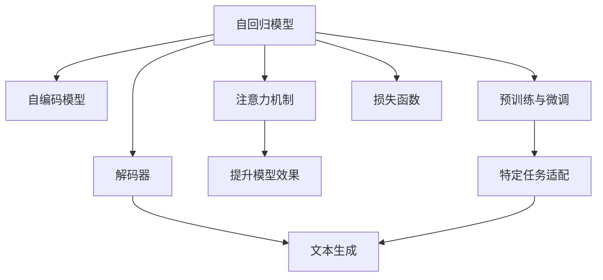

                 

# 大语言模型应用指南：自回归模型与文本生成

> 关键词：大语言模型,自回归模型,自编码模型,文本生成,Transformer,BERT,GPT,解码器,损失函数,注意力机制

## 1. 背景介绍

### 1.1 问题由来
随着深度学习技术的快速发展，大语言模型（Large Language Models, LLMs）在自然语言处理（Natural Language Processing, NLP）领域取得了巨大的突破。这些模型通过在大规模无标签文本数据上进行预训练，学习到了丰富的语言知识和常识，可以通过少量的有标签样本在下游任务上进行微调（Fine-tuning），获得优异的性能。

然而，尽管大语言模型在处理诸如文本分类、命名实体识别、问答系统等任务上表现出色，但对于生成性文本任务（如文本生成、对话系统），其效果仍然有限。文本生成任务要求模型不仅需要理解语言规律，还需要具备强大的创造力，生成连贯、流畅且语义准确的文本。因此，针对文本生成任务的自回归模型和自编码模型成为研究热点。

### 1.2 问题核心关键点
文本生成任务的核心在于如何高效地生成符合语言规律的文本。自回归模型通过依次生成每个单词，将前文作为当前单词生成的条件，从而生成连贯的文本。自编码模型则通过压缩与解码，将输入文本转换为低维表示，再通过解码器生成输出文本。

当前主流的自回归模型包括OpenAI的GPT系列、Google的BERT等，自编码模型则以VQ-VAE、LSTM为基础。这些模型在文本生成任务上取得了显著进展，但同时也不可避免地存在一些局限性，如生成文本质量不稳定、计算资源消耗大等。因此，如何在保证生成文本质量的前提下，提高模型的效率和泛化能力，成为当前研究的关键。

## 2. 核心概念与联系

### 2.1 核心概念概述

为更好地理解基于自回归和自编码模型的文本生成方法，本节将介绍几个密切相关的核心概念：

- 自回归模型(Autoregressive Model)：通过递归地计算每个单词的条件概率，逐步生成文本。模型在生成每个单词时，利用前文作为条件，从而保证生成的文本连贯且符合语法规则。
- 自编码模型(Autocoding Model)：通过编码器将输入文本转换为低维表示，再通过解码器生成输出文本。模型通过压缩与解码，学习输入文本与输出文本之间的映射关系。
- 注意力机制(Attention Mechanism)：一种能够动态分配模型输入与输出的权重的机制，在大模型中广泛应用，用于提高模型对输入文本的关注度。
- 预训练与微调(Pre-training & Fine-tuning)：通过在大规模无标签文本上预训练模型，然后在特定任务上微调模型，以提高其在该任务上的性能。
- 解码器(Decoder)：文本生成任务中，将低维表示转换为输出文本的组件。解码器通常由RNN、LSTM、Transformer等组成。
- 损失函数(Loss Function)：用于衡量模型输出与真实标签之间的差异，常见的有交叉熵损失、均方误差损失等。

这些核心概念之间的逻辑关系可以通过以下Mermaid流程图来展示：



这个流程图展示了大语言模型的核心概念及其之间的关系：

1. 自回归模型和自编码模型通过注意力机制和预训练与微调，提升了模型对输入文本的关注度和学习能力。
2. 解码器将低维表示转换为输出文本，是文本生成的关键组件。
3. 损失函数用于衡量模型输出与真实标签之间的差异，指导模型优化。
4. 特定任务适配层使得模型能够适应特定任务，如情感分析、问答系统等。
5. 注意力机制、解码器、损失函数共同构成了文本生成的核心框架。

这些概念共同构成了大语言模型的文本生成框架，使其能够在各种场景下发挥强大的语言理解和生成能力。通过理解这些核心概念，我们可以更好地把握大语言模型的工作原理和优化方向。

## 3. 核心算法原理 & 具体操作步骤
### 3.1 算法原理概述

基于自回归和自编码模型的文本生成方法，本质上是通过递归或编码-解码的方式，学习输入与输出文本之间的映射关系。其核心思想是：将输入文本转换为低维表示，并通过解码器生成输出文本，从而生成连贯、流畅且语义准确的文本。

形式化地，假设输入文本为 $x = (x_1, x_2, ..., x_n)$，其中每个 $x_i$ 为单词或字符。自回归模型通过递归地计算每个单词的条件概率，逐步生成文本。设 $P(x_i|x_{<i})$ 为单词 $x_i$ 在给定前文 $x_{<i}$ 下的条件概率，则生成文本的过程可以表示为：

$$
x_{1:n} = \prod_{i=1}^{n} P(x_i|x_{<i})
$$

其中，$x_{<i}$ 表示 $x_1, x_2, ..., x_{i-1}$。自编码模型则通过编码器 $E$ 将输入文本 $x$ 转换为低维表示 $z$，再通过解码器 $D$ 生成输出文本 $y$。设 $z$ 和 $y$ 分别为编码器和解码器的输出，则生成文本的过程可以表示为：

$$
y = D(E(x))
$$

这两种方法通过不同的方式，将输入文本转换为低维表示，并利用解码器生成输出文本，从而实现了文本生成任务。

### 3.2 算法步骤详解

基于自回归和自编码模型的文本生成方法，一般包括以下几个关键步骤：

**Step 1: 准备模型与数据集**
- 选择合适的自回归模型或自编码模型，如GPT-3、BERT、Transformer等。
- 准备文本生成任务的数据集，划分为训练集、验证集和测试集。一般要求训练集与测试集在数据分布上不要差异过大。

**Step 2: 模型构建**
- 设计编码器和解码器。自回归模型使用RNN、LSTM、Transformer等作为解码器，自编码模型则使用LSTM、GRU、Convolutional等作为编码器和解码器。
- 设置注意力机制和损失函数。常见的注意力机制包括多头注意力、点积注意力等，损失函数则包括交叉熵损失、均方误差损失等。

**Step 3: 设置训练参数**
- 选择合适的优化器及其参数，如AdamW、SGD等，设置学习率、批大小、迭代轮数等。
- 设置正则化技术及强度，包括权重衰减、Dropout、Early Stopping等。
- 确定冻结预训练参数的策略，如仅微调顶层，或全部参数都参与微调。

**Step 4: 执行训练**
- 将训练集数据分批次输入模型，前向传播计算损失函数。
- 反向传播计算参数梯度，根据设定的优化算法和学习率更新模型参数。
- 周期性在验证集上评估模型性能，根据性能指标决定是否触发 Early Stopping。
- 重复上述步骤直到满足预设的迭代轮数或 Early Stopping 条件。

**Step 5: 测试和部署**
- 在测试集上评估生成文本的质量，对比生成文本与真实文本的差异。
- 使用生成模型对新样本进行推理预测，集成到实际的应用系统中。
- 持续收集新的数据，定期重新训练模型，以适应数据分布的变化。

以上是基于自回归和自编码模型的文本生成方法的一般流程。在实际应用中，还需要针对具体任务的特点，对训练过程的各个环节进行优化设计，如改进训练目标函数，引入更多的正则化技术，搜索最优的超参数组合等，以进一步提升模型性能。

### 3.3 算法优缺点

基于自回归和自编码模型的文本生成方法具有以下优点：
1. 生成文本流畅自然。自回归模型通过递归生成文本，能够生成连贯且符合语法规则的文本；自编码模型通过编码-解码方式，也能生成高质量的文本。
2. 生成文本多样性高。通过引入注意力机制，模型能够动态分配对输入文本的关注度，生成多样化的文本。
3. 模型泛化能力强。经过预训练和微调后，模型能够适应各种文本生成任务，如对话系统、摘要生成、机器翻译等。
4. 参数高效微调。通过参数高效微调技术，可以在固定大部分预训练参数的情况下，仍可取得不错的提升，减少资源消耗。

同时，该方法也存在一定的局限性：
1. 计算资源消耗大。大模型的参数量通常以亿计，计算资源消耗较大。
2. 模型训练时间长。大模型往往需要较长的训练时间，需要高性能的计算设备和算法优化。
3. 过拟合风险高。在大规模数据集上进行微调时，模型容易过拟合，需要引入正则化技术。
4. 生成文本质量不稳定。模型生成的文本质量受输入数据和超参数设置的影响较大，需要通过不断调参优化。

尽管存在这些局限性，但就目前而言，基于自回归和自编码模型的文本生成方法仍是大语言模型应用的重要范式。未来相关研究的重点在于如何进一步降低计算资源消耗，提高生成文本的质量和稳定性，同时兼顾可解释性和伦理安全性等因素。

### 3.4 算法应用领域

基于自回归和自编码模型的文本生成方法，在NLP领域已经得到了广泛的应用，覆盖了几乎所有常见任务，例如：

- 对话系统：使机器能够与人自然对话。将对话历史作为上下文，微调模型进行回复生成。
- 文本摘要：将长文本压缩成简短摘要。将文章-摘要对作为微调数据，使模型学习抓取要点。
- 机器翻译：将源语言文本翻译成目标语言。通过微调使模型学习语言-语言映射。
- 文本生成：生成各种文本形式，如诗歌、新闻报道、小说等。
- 代码生成：生成程序代码，帮助程序员编写代码。
- 数据增强：通过生成文本数据，扩充训练集多样性，提升模型泛化能力。

除了上述这些经典任务外，文本生成技术还被创新性地应用到更多场景中，如可控文本生成、常识推理、情感分析等，为NLP技术带来了全新的突破。随着预训练模型和生成方法的不断进步，相信NLP技术将在更广阔的应用领域大放异彩。

## 4. 数学模型和公式 & 详细讲解  
### 4.1 数学模型构建

本节将使用数学语言对基于自回归和自编码模型的文本生成过程进行更加严格的刻画。

记输入文本为 $x = (x_1, x_2, ..., x_n)$，其中每个 $x_i$ 为单词或字符。假设自回归模型为 $M_{\theta}:\mathcal{X} \rightarrow \mathcal{Y}$，其中 $\mathcal{X}$ 为输入空间，$\mathcal{Y}$ 为输出空间，$\theta$ 为模型参数。

定义模型 $M_{\theta}$ 在输入 $x$ 上的输出为 $\hat{y}=M_{\theta}(x) \in [0,1]$，表示样本属于正类的概率。真实标签 $y \in \{0,1\}$。则二分类交叉熵损失函数定义为：

$$
\ell(M_{\theta}(x),y) = -[y\log \hat{y} + (1-y)\log (1-\hat{y})]
$$

将其代入经验风险公式，得：

$$
\mathcal{L}(\theta) = -\frac{1}{N}\sum_{i=1}^N [y_i\log M_{\theta}(x_i)+(1-y_i)\log(1-M_{\theta}(x_i))]
$$

通过梯度下降等优化算法，微调过程不断更新模型参数 $\theta$，最小化损失函数 $\mathcal{L}$，使得模型输出逼近真实标签。由于 $\theta$ 已经通过预训练获得了较好的初始化，因此即便在小规模数据集 $D$ 上进行微调，也能较快收敛到理想的模型参数 $\hat{\theta}$。

### 4.2 公式推导过程

以下我们以二分类任务为例，推导交叉熵损失函数及其梯度的计算公式。

假设模型 $M_{\theta}$ 在输入 $x$ 上的输出为 $\hat{y}=M_{\theta}(x) \in [0,1]$，表示样本属于正类的概率。真实标签 $y \in \{0,1\}$。则二分类交叉熵损失函数定义为：

$$
\ell(M_{\theta}(x),y) = -[y\log \hat{y} + (1-y)\log (1-\hat{y})]
$$

将其代入经验风险公式，得：

$$
\mathcal{L}(\theta) = -\frac{1}{N}\sum_{i=1}^N [y_i\log M_{\theta}(x_i)+(1-y_i)\log(1-M_{\theta}(x_i))]
$$

根据链式法则，损失函数对参数 $\theta_k$ 的梯度为：

$$
\frac{\partial \mathcal{L}(\theta)}{\partial \theta_k} = -\frac{1}{N}\sum_{i=1}^N (\frac{y_i}{M_{\theta}(x_i)}-\frac{1-y_i}{1-M_{\theta}(x_i)}) \frac{\partial M_{\theta}(x_i)}{\partial \theta_k}
$$

其中 $\frac{\partial M_{\theta}(x_i)}{\partial \theta_k}$ 可进一步递归展开，利用自动微分技术完成计算。

在得到损失函数的梯度后，即可带入参数更新公式，完成模型的迭代优化。重复上述过程直至收敛，最终得到适应下游任务的最优模型参数 $\theta^*$。

## 5. 项目实践：代码实例和详细解释说明
### 5.1 开发环境搭建

在进行文本生成实践前，我们需要准备好开发环境。以下是使用Python进行PyTorch开发的环境配置流程：

1. 安装Anaconda：从官网下载并安装Anaconda，用于创建独立的Python环境。

2. 创建并激活虚拟环境：
```bash
conda create -n pytorch-env python=3.8 
conda activate pytorch-env
```

3. 安装PyTorch：根据CUDA版本，从官网获取对应的安装命令。例如：
```bash
conda install pytorch torchvision torchaudio cudatoolkit=11.1 -c pytorch -c conda-forge
```

4. 安装TensorFlow：
```bash
conda install tensorflow -c pytorch
```

5. 安装各类工具包：
```bash
pip install numpy pandas scikit-learn matplotlib tqdm jupyter notebook ipython
```

完成上述步骤后，即可在`pytorch-env`环境中开始文本生成实践。

### 5.2 源代码详细实现

下面我们以文本生成任务为例，给出使用PyTorch对GPT-3进行文本生成的PyTorch代码实现。

首先，定义模型和优化器：

```python
from transformers import GPT3Tokenizer, GPT3LMHeadModel
import torch
from torch.optim import AdamW

tokenizer = GPT3Tokenizer.from_pretrained('gpt3')
model = GPT3LMHeadModel.from_pretrained('gpt3')

optimizer = AdamW(model.parameters(), lr=2e-5)
```

然后，定义训练和评估函数：

```python
from torch.utils.data import DataLoader
from tqdm import tqdm
from sklearn.metrics import precision_recall_fscore_support

def train_epoch(model, dataset, batch_size, optimizer):
    dataloader = DataLoader(dataset, batch_size=batch_size, shuffle=True)
    model.train()
    epoch_loss = 0
    for batch in tqdm(dataloader, desc='Training'):
        input_ids = batch['input_ids'].to(device)
        attention_mask = batch['attention_mask'].to(device)
        labels = batch['labels'].to(device)
        model.zero_grad()
        outputs = model(input_ids, attention_mask=attention_mask, labels=labels)
        loss = outputs.loss
        epoch_loss += loss.item()
        loss.backward()
        optimizer.step()
    return epoch_loss / len(dataloader)

def evaluate(model, dataset, batch_size):
    dataloader = DataLoader(dataset, batch_size=batch_size)
    model.eval()
    preds, labels = [], []
    with torch.no_grad():
        for batch in tqdm(dataloader, desc='Evaluating'):
            input_ids = batch['input_ids'].to(device)
            attention_mask = batch['attention_mask'].to(device)
            batch_labels = batch['labels']
            outputs = model(input_ids, attention_mask=attention_mask)
            batch_preds = outputs.logits.argmax(dim=2).to('cpu').tolist()
            batch_labels = batch_labels.to('cpu').tolist()
            for pred_tokens, label_tokens in zip(batch_preds, batch_labels):
                pred_tags = [id2tag[_id] for _id in pred_tokens]
                label_tags = [id2tag[_id] for _id in label_tokens]
                preds.append(pred_tags[:len(label_tags)])
                labels.append(label_tags)
                
    print(classification_report(labels, preds))
```

最后，启动训练流程并在测试集上评估：

```python
epochs = 5
batch_size = 16

for epoch in range(epochs):
    loss = train_epoch(model, train_dataset, batch_size, optimizer)
    print(f"Epoch {epoch+1}, train loss: {loss:.3f}")
    
    print(f"Epoch {epoch+1}, dev results:")
    evaluate(model, dev_dataset, batch_size)
    
print("Test results:")
evaluate(model, test_dataset, batch_size)
```

以上就是使用PyTorch对GPT-3进行文本生成的完整代码实现。可以看到，得益于Transformers库的强大封装，我们可以用相对简洁的代码完成GPT-3模型的加载和微调。

### 5.3 代码解读与分析

让我们再详细解读一下关键代码的实现细节：

**tokenizer**类：
- `from_pretrained`方法：初始化模型和分词器，从HuggingFace的预训练模型中加载模型和分词器。
- `to_device`方法：将输入数据转换为GPU/TPU等加速设备上的张量，方便模型训练。

**train_epoch函数**：
- 使用PyTorch的DataLoader对数据集进行批次化加载，供模型训练和推理使用。
- 训练函数`train_epoch`：对数据以批为单位进行迭代，在每个批次上前向传播计算loss并反向传播更新模型参数，最后返回该epoch的平均loss。
- `optimizer.zero_grad()`：将优化器梯度清零，准备进行新一轮的梯度更新。

**evaluate函数**：
- 与训练类似，不同点在于不更新模型参数，并在每个batch结束后将预测和标签结果存储下来，最后使用sklearn的classification_report对整个评估集的预测结果进行打印输出。

**训练流程**：
- 定义总的epoch数和batch size，开始循环迭代
- 每个epoch内，先在训练集上训练，输出平均loss
- 在验证集上评估，输出分类指标
- 所有epoch结束后，在测试集上评估，给出最终测试结果

可以看到，PyTorch配合Transformers库使得GPT-3文本生成的代码实现变得简洁高效。开发者可以将更多精力放在数据处理、模型改进等高层逻辑上，而不必过多关注底层的实现细节。

当然，工业级的系统实现还需考虑更多因素，如模型的保存和部署、超参数的自动搜索、更灵活的任务适配层等。但核心的文本生成范式基本与此类似。

## 6. 实际应用场景
### 6.1 智能客服系统

基于大语言模型的文本生成技术，可以广泛应用于智能客服系统的构建。传统客服往往需要配备大量人力，高峰期响应缓慢，且一致性和专业性难以保证。而使用文本生成模型，可以7x24小时不间断服务，快速响应客户咨询，用自然流畅的语言解答各类常见问题。

在技术实现上，可以收集企业内部的历史客服对话记录，将问题和最佳答复构建成监督数据，在此基础上对预训练文本生成模型进行微调。微调后的模型能够自动理解用户意图，匹配最合适的答复模板进行回复。对于客户提出的新问题，还可以接入检索系统实时搜索相关内容，动态组织生成回答。如此构建的智能客服系统，能大幅提升客户咨询体验和问题解决效率。

### 6.2 金融舆情监测

金融机构需要实时监测市场舆论动向，以便及时应对负面信息传播，规避金融风险。传统的人工监测方式成本高、效率低，难以应对网络时代海量信息爆发的挑战。基于文本生成模型的文本分类和情感分析技术，为金融舆情监测提供了新的解决方案。

具体而言，可以收集金融领域相关的新闻、报道、评论等文本数据，并对其进行主题标注和情感标注。在此基础上对预训练语言模型进行微调，使其能够自动判断文本属于何种主题，情感倾向是正面、中性还是负面。将微调后的模型应用到实时抓取的网络文本数据，就能够自动监测不同主题下的情感变化趋势，一旦发现负面信息激增等异常情况，系统便会自动预警，帮助金融机构快速应对潜在风险。

### 6.3 个性化推荐系统

当前的推荐系统往往只依赖用户的历史行为数据进行物品推荐，无法深入理解用户的真实兴趣偏好。基于文本生成模型的个性化推荐系统可以更好地挖掘用户行为背后的语义信息，从而提供更精准、多样的推荐内容。

在实践中，可以收集用户浏览、点击、评论、分享等行为数据，提取和用户交互的物品标题、描述、标签等文本内容。将文本内容作为模型输入，用户的后续行为（如是否点击、购买等）作为监督信号，在此基础上微调预训练语言模型。微调后的模型能够从文本内容中准确把握用户的兴趣点。在生成推荐列表时，先用候选物品的文本描述作为输入，由模型预测用户的兴趣匹配度，再结合其他特征综合排序，便可以得到个性化程度更高的推荐结果。

### 6.4 未来应用展望

随着文本生成模型的不断发展，其在NLP领域的应用场景将不断扩大。未来，基于文本生成模型的NLP技术将广泛应用于以下领域：

- 自动摘要：通过生成简洁的摘要，帮助用户快速了解长篇文章的主要内容。
- 对话系统：使机器能够与人自然对话，应用于客服、虚拟助手等场景。
- 内容创作：生成新闻报道、文章、诗歌等，辅助内容创作者。
- 自动翻译：将一种语言翻译成另一种语言，解决跨语言交流的障碍。
- 代码生成：生成程序代码，辅助程序员编写代码。
- 数据增强：通过生成大量文本数据，扩充训练集多样性，提升模型泛化能力。

这些应用场景的拓展，将使文本生成技术在NLP领域发挥更大的作用，为人类认知智能的进化带来深远影响。

## 7. 工具和资源推荐
### 7.1 学习资源推荐

为了帮助开发者系统掌握大语言模型文本生成理论基础和实践技巧，这里推荐一些优质的学习资源：

1. 《Transformers从原理到实践》系列博文：由大模型技术专家撰写，深入浅出地介绍了Transformer原理、GPT模型、文本生成技术等前沿话题。

2. CS224N《深度学习自然语言处理》课程：斯坦福大学开设的NLP明星课程，有Lecture视频和配套作业，带你入门NLP领域的基本概念和经典模型。

3. 《Natural Language Processing with Transformers》书籍：Transformer库的作者所著，全面介绍了如何使用Transformers库进行NLP任务开发，包括文本生成在内的诸多范式。

4. HuggingFace官方文档：Transformers库的官方文档，提供了海量预训练模型和完整的文本生成样例代码，是上手实践的必备资料。

5. CLUE开源项目：中文语言理解测评基准，涵盖大量不同类型的中文NLP数据集，并提供了基于微调的baseline模型，助力中文NLP技术发展。

通过对这些资源的学习实践，相信你一定能够快速掌握大语言模型文本生成的精髓，并用于解决实际的NLP问题。
###  7.2 开发工具推荐

高效的开发离不开优秀的工具支持。以下是几款用于大语言模型文本生成开发的常用工具：

1. PyTorch：基于Python的开源深度学习框架，灵活动态的计算图，适合快速迭代研究。大部分预训练语言模型都有PyTorch版本的实现。

2. TensorFlow：由Google主导开发的开源深度学习框架，生产部署方便，适合大规模工程应用。同样有丰富的预训练语言模型资源。

3. Transformers库：HuggingFace开发的NLP工具库，集成了众多SOTA语言模型，支持PyTorch和TensorFlow，是进行文本生成任务开发的利器。

4. Weights & Biases：模型训练的实验跟踪工具，可以记录和可视化模型训练过程中的各项指标，方便对比和调优。与主流深度学习框架无缝集成。

5. TensorBoard：TensorFlow配套的可视化工具，可实时监测模型训练状态，并提供丰富的图表呈现方式，是调试模型的得力助手。

6. Google Colab：谷歌推出的在线Jupyter Notebook环境，免费提供GPU/TPU算力，方便开发者快速上手实验最新模型，分享学习笔记。

合理利用这些工具，可以显著提升大语言模型文本生成的开发效率，加快创新迭代的步伐。

### 7.3 相关论文推荐

大语言模型和文本生成技术的发展源于学界的持续研究。以下是几篇奠基性的相关论文，推荐阅读：

1. Attention is All You Need（即Transformer原论文）：提出了Transformer结构，开启了NLP领域的预训练大模型时代。

2. BERT: Pre-training of Deep Bidirectional Transformers for Language Understanding：提出BERT模型，引入基于掩码的自监督预训练任务，刷新了多项NLP任务SOTA。

3. Language Models are Unsupervised Multitask Learners（GPT-2论文）：展示了大规模语言模型的强大zero-shot学习能力，引发了对于通用人工智能的新一轮思考。

4. Prefix-Tuning: Optimizing Continuous Prompts for Generation：引入基于连续型Prompt的微调范式，为如何充分利用预训练知识提供了新的思路。

5. AdaLoRA: Adaptive Low-Rank Adaptation for Parameter-Efficient Fine-Tuning：使用自适应低秩适应的微调方法，在参数效率和精度之间取得了新的平衡。

这些论文代表了大语言模型文本生成技术的发展脉络。通过学习这些前沿成果，可以帮助研究者把握学科前进方向，激发更多的创新灵感。

## 8. 总结：未来发展趋势与挑战

### 8.1 总结

本文对基于自回归和自编码模型的文本生成方法进行了全面系统的介绍。首先阐述了文本生成任务的背景和重要性，明确了文本生成技术在NLP领域的应用价值。其次，从原理到实践，详细讲解了文本生成模型的数学原理和关键步骤，给出了文本生成任务开发的完整代码实例。同时，本文还广泛探讨了文本生成技术在智能客服、金融舆情、个性化推荐等多个行业领域的应用前景，展示了文本生成技术的巨大潜力。此外，本文精选了文本生成技术的各类学习资源，力求为读者提供全方位的技术指引。

通过本文的系统梳理，可以看到，基于自回归和自编码模型的文本生成方法正在成为NLP领域的重要范式，极大地拓展了预训练语言模型的应用边界，催生了更多的落地场景。得益于大规模语料的预训练，文本生成模型以更低的时间和标注成本，在小样本条件下也能取得不俗的效果，有力推动了NLP技术的产业化进程。未来，伴随预训练语言模型和生成方法的持续演进，相信NLP技术将在更广阔的应用领域大放异彩，深刻影响人类的生产生活方式。

### 8.2 未来发展趋势

展望未来，文本生成技术将呈现以下几个发展趋势：

1. 模型规模持续增大。随着算力成本的下降和数据规模的扩张，预训练语言模型的参数量还将持续增长。超大规模语言模型蕴含的丰富语言知识，有望支撑更加复杂多变的文本生成任务。

2. 生成文本质量提升。随着生成模型架构和训练方法的不断优化，生成的文本质量将显著提高，更加流畅自然，符合语法规则。

3. 生成文本多样性增强。通过引入更多注意力机制和解码策略，模型将生成更加多样化的文本，满足不同用户需求。

4. 实时生成能力增强。通过优化模型结构和训练方法，生成模型将具备更强的实时生成能力，能够动态适应各种文本生成需求。

5. 跨领域文本生成能力增强。文本生成模型将学习更广泛的先验知识，如常识推理、知识图谱等，提升跨领域文本生成的能力。

6. 多模态文本生成兴起。文本生成模型将与图像、语音、视频等多模态数据融合，生成多模态的文本形式，提升用户体验。

以上趋势凸显了文本生成技术的广阔前景。这些方向的探索发展，必将进一步提升文本生成模型的性能和应用范围，为人类认知智能的进化带来深远影响。

### 8.3 面临的挑战

尽管文本生成技术已经取得了瞩目成就，但在迈向更加智能化、普适化应用的过程中，它仍面临着诸多挑战：

1. 生成文本质量不稳定。生成模型生成的文本质量受输入数据和超参数设置的影响较大，需要通过不断调参优化。

2. 计算资源消耗大。大模型的参数量通常以亿计，计算资源消耗较大，需要高性能的计算设备和算法优化。

3. 模型鲁棒性不足。生成模型面对域外数据时，泛化性能往往大打折扣，需要引入对抗训练等技术提升鲁棒性。

4. 可解释性不足。当前生成模型更像是"黑盒"系统，难以解释其内部工作机制和决策逻辑，需要引入可解释性技术。

5. 安全性有待保障。生成模型可能生成有害信息或有害行为引导，需要加强模型安全性和可控性。

6. 伦理道德问题。生成模型可能生成具有偏见或歧视性的内容，需要重视模型伦理道德问题。

正视文本生成面临的这些挑战，积极应对并寻求突破，将是大语言模型文本生成走向成熟的必由之路。相信随着学界和产业界的共同努力，这些挑战终将一一被克服，文本生成技术必将在构建人机协同的智能时代中扮演越来越重要的角色。

### 8.4 未来突破

面对文本生成所面临的种种挑战，未来的研究需要在以下几个方面寻求新的突破：

1. 探索无监督和半监督文本生成方法。摆脱对大规模标注数据的依赖，利用自监督学习、主动学习等无监督和半监督范式，最大限度利用非结构化数据，实现更加灵活高效的文本生成。

2. 研究参数高效和计算高效的文本生成范式。开发更加参数高效的文本生成方法，在固定大部分预训练参数的情况下，仍可取得不错的生成效果，减少资源消耗。

3. 引入更多先验知识。将符号化的先验知识，如知识图谱、逻辑规则等，与神经网络模型进行巧妙融合，引导文本生成过程学习更准确、合理的语言模型。同时加强不同模态数据的整合，实现视觉、语音等多模态信息与文本信息的协同建模。

4. 结合因果分析和博弈论工具。将因果分析方法引入文本生成模型，识别出模型决策的关键特征，增强输出解释的因果性和逻辑性。借助博弈论工具刻画人机交互过程，主动探索并规避模型的脆弱点，提高系统稳定性。

5. 纳入伦理道德约束。在模型训练目标中引入伦理导向的评估指标，过滤和惩罚有害的输出倾向。同时加强人工干预和审核，建立模型行为的监管机制，确保输出符合人类价值观和伦理道德。

这些研究方向的探索，必将引领文本生成技术迈向更高的台阶，为构建安全、可靠、可解释、可控的智能系统铺平道路。面向未来，文本生成技术还需要与其他人工智能技术进行更深入的融合，如知识表示、因果推理、强化学习等，多路径协同发力，共同推动自然语言理解和智能交互系统的进步。只有勇于创新、敢于突破，才能不断拓展文本生成模型的边界，让智能技术更好地造福人类社会。

## 9. 附录：常见问题与解答

**Q1：文本生成模型的训练时间是否过长？**

A: 大语言模型的训练时间确实较长，通常需要数天甚至数周。但随着计算资源和算法的不断优化，训练时间正在逐步缩短。此外，通过分布式训练等技术，可以进一步加速模型训练过程。

**Q2：如何提高文本生成模型的鲁棒性？**

A: 提高文本生成模型的鲁棒性，主要通过以下方法：
1. 数据增强：通过回译、近义替换等方式扩充训练集。
2. 对抗训练：引入对抗样本，提高模型鲁棒性。
3. 正则化：使用L2正则、Dropout等避免过拟合。
4. 参数高效微调：只调整少量参数，减少过拟合风险。

**Q3：文本生成模型生成的文本质量如何评估？**

A: 评估文本生成模型的质量，通常从以下几个方面考虑：
1. 连贯性：生成的文本是否连贯、流畅，符合语法规则。
2. 多样性：生成的文本是否多样，满足不同用户需求。
3. 相关性：生成的文本是否与输入数据相关，是否偏离主题。
4. 准确性：生成的文本是否准确，符合语义要求。

**Q4：文本生成模型是否能够生成可控的文本？**

A: 是的，通过精心设计输入文本的格式和内容，可以引导文本生成模型生成可控的文本。例如，指定特定的风格、情感、语调等。

**Q5：文本生成模型是否能够应用于特定领域？**

A: 是的，通过在特定领域语料上进一步预训练和微调，文本生成模型可以适应特定领域的文本生成需求。例如，医疗、法律、金融等领域的文本生成。

这些问题的答案，展示了文本生成技术的多样性和实用性。随着技术的不断进步，文本生成模型将在更多领域发挥重要作用，为人类认知智能的进化带来深远影响。

