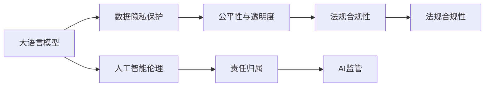

                 

# 大语言模型应用的法规合规性

> 关键词：大语言模型,法规合规性,人工智能伦理,数据隐私保护,公平性,透明度,责任归属,AI监管

## 1. 背景介绍

### 1.1 问题由来
近年来，随着人工智能技术的迅猛发展，大语言模型（Large Language Model, LLM）在自然语言处理（Natural Language Processing, NLP）、机器翻译、问答系统等领域展现出卓越的性能，极大地推动了人工智能技术的应用和发展。然而，大语言模型在带来便利和效率的同时，也带来了诸多法律、道德和伦理层面的挑战。

1. **数据隐私**：大语言模型的训练需要大量文本数据，这些数据可能包含敏感的个人信息和隐私数据，如何保护数据隐私是一个重要的问题。
2. **偏见与歧视**：由于训练数据中可能存在偏见，大语言模型可能会学习并放大这些偏见，导致不公平的输出。
3. **责任归属**：当大语言模型在实际应用中产生错误时，如何确定责任归属是一个复杂的问题。
4. **透明度与可解释性**：大语言模型的决策过程往往是“黑箱”操作，缺乏透明度和可解释性，这可能会影响用户对其输出的信任。
5. **监管与规范**：随着大语言模型的广泛应用，如何对其进行有效的监管和规范，成为了一个全球性的问题。

### 1.2 问题核心关键点
针对这些问题，本文将围绕大语言模型应用的法规合规性，详细探讨如何在大规模应用中确保模型行为的合法性、公平性和透明度，并探讨相关的监管和规范措施。

## 2. 核心概念与联系

### 2.1 核心概念概述

- **大语言模型**：基于深度学习技术，能够处理和生成自然语言的模型，如GPT、BERT等。
- **法规合规性**：在大规模应用中，确保模型行为的合法性、公平性和透明度，遵守相关的法律法规和行业标准。
- **人工智能伦理**：涉及人工智能技术应用的道德和伦理问题，如隐私保护、公平性、可解释性等。
- **数据隐私保护**：保护用户个人信息和数据安全，防止数据泄露和滥用。
- **公平性与透明度**：确保模型输出不会存在偏见，并提高模型的透明度，使用户能够理解和信任模型的决策过程。
- **责任归属**：明确在使用大语言模型过程中各方（如开发者、用户、平台等）的责任和义务。
- **AI监管**：政府和监管机构对人工智能技术的规范和指导，包括数据保护、透明度、公平性等。

这些概念之间的关系可以概括为：

1. **大语言模型**：基础技术平台。
2. **法规合规性**：保障模型合法、合规使用的原则。
3. **人工智能伦理**：指导模型开发和应用中的道德规范。
4. **数据隐私保护**：保护用户数据安全和隐私的措施。
5. **公平性与透明度**：提升模型公平性和提高透明度的方法。
6. **责任归属**：明确各方责任的机制。
7. **AI监管**：政策法规对AI技术的规范和指导。

这些概念共同构成了大语言模型应用中法规合规性的基本框架。

### 2.2 核心概念原理和架构的 Mermaid 流程图(Mermaid 流程节点中不要有括号、逗号等特殊字符)



## 3. 核心算法原理 & 具体操作步骤

### 3.1 算法原理概述

基于大语言模型的法规合规性，其核心思想是结合法律、伦理和技术手段，确保模型在应用过程中满足合规要求，具体体现在以下几个方面：

1. **数据隐私保护**：使用加密技术、差分隐私等手段保护用户数据隐私。
2. **公平性与透明度**：通过算法审计、模型解释等手段提高模型的公平性和透明度。
3. **责任归属**：明确模型应用过程中的各方责任和义务，建立责任追溯机制。
4. **法规合规性**：确保模型开发和应用过程中遵守相关法律法规。

### 3.2 算法步骤详解

#### 3.2.1 数据隐私保护
1. **数据匿名化**：对用户数据进行去标识化处理，确保数据无法直接关联到个人身份。
2. **差分隐私**：在模型训练和推理过程中引入噪声，保护数据隐私，同时确保模型性能不受过多影响。
3. **数据访问控制**：严格控制数据访问权限，防止未经授权的数据访问和泄露。

#### 3.2.2 公平性与透明度
1. **算法审计**：对模型进行公平性、透明度的审计，发现并修正模型中的偏见和错误。
2. **模型解释**：使用模型解释技术（如LIME、SHAP等），提高模型的透明度，使用户能够理解模型的决策过程。

#### 3.2.3 责任归属
1. **责任划分**：明确模型开发者、用户和平台之间的责任划分，制定相应的责任归属机制。
2. **责任追溯**：建立责任追溯机制，当模型出现错误时，能够快速定位问题，进行责任归属和修复。

#### 3.2.4 法规合规性
1. **法规遵守**：确保模型开发和应用过程中遵守相关法律法规，如GDPR、CCPA等。
2. **合规检查**：定期进行合规检查，确保模型应用的合规性。

### 3.3 算法优缺点

#### 3.3.1 优点
1. **提高用户信任**：通过数据隐私保护和模型透明度，提高用户对大语言模型的信任度。
2. **增强模型公平性**：通过算法审计和差分隐私，提高模型的公平性和透明度，减少偏见。
3. **明确责任归属**：通过责任划分和追溯机制，明确各方责任，提高模型的法律合规性。
4. **确保法规遵从**：通过定期合规检查，确保模型应用的合规性。

#### 3.3.2 缺点
1. **技术复杂性**：实现数据隐私保护、公平性和透明度需要复杂的技术手段，增加了模型开发的难度。
2. **资源消耗**：差分隐私和模型解释等技术可能会增加计算资源消耗，影响模型性能。
3. **隐私保护挑战**：如何平衡数据隐私保护和模型性能是一个挑战。

### 3.4 算法应用领域

大语言模型应用的法规合规性在以下几个领域具有重要应用：

1. **医疗健康**：确保医疗数据的隐私保护和合规性，提高模型的公平性和透明度，确保医疗决策的合法性。
2. **金融服务**：保护用户金融数据隐私，确保模型公平性和透明性，建立责任归属机制，确保合规性。
3. **司法系统**：确保司法数据的隐私保护，提高模型的公平性和透明度，明确责任归属，确保合法合规。
4. **教育培训**：保护学生数据隐私，确保模型公平性，建立责任追溯机制，确保合规性。
5. **公共服务**：保护用户数据隐私，提高模型的公平性和透明度，明确责任归属，确保合规性。

## 4. 数学模型和公式 & 详细讲解 & 举例说明

### 4.1 数学模型构建

基于大语言模型的法规合规性，可以构建以下数学模型：

1. **数据隐私模型**：
   $$
   \min_{\epsilon} \mathcal{L}(\text{DP}) = \frac{1}{N} \sum_{i=1}^N \ell(\text{DP}, x_i)
   $$
   其中，$\epsilon$ 是差分隐私参数，$\ell(\text{DP}, x_i)$ 是差分隐私损失函数。

2. **公平性模型**：
   $$
   \min_{\theta} \mathcal{L}(\text{Fair}) = \frac{1}{N} \sum_{i=1}^N \ell(\text{Fair}, x_i, y_i)
   $$
   其中，$\theta$ 是模型参数，$\ell(\text{Fair}, x_i, y_i)$ 是公平性损失函数。

3. **透明度模型**：
   $$
   \max_{\text{Explanation}} \mathcal{L}(\text{Explanation}) = \frac{1}{N} \sum_{i=1}^N \ell(\text{Explanation}, x_i, y_i)
   $$
   其中，$\text{Explanation}$ 是模型的解释，$\ell(\text{Explanation}, x_i, y_i)$ 是透明度损失函数。

### 4.2 公式推导过程

1. **差分隐私损失函数**：
   $$
   \ell(\text{DP}, x_i) = -\log(\frac{\mathbb{P}[\hat{x}_i|x_i] \mathbb{P}[\hat{x}_i|x_j]^{-1})
   $$
   其中，$\hat{x}_i$ 是差分隐私处理后的数据，$x_i, x_j$ 是原始数据。

2. **公平性损失函数**：
   $$
   \ell(\text{Fair}, x_i, y_i) = \frac{1}{N} \sum_{i=1}^N (y_i - \hat{y}_i)^2
   $$
   其中，$\hat{y}_i$ 是模型预测结果。

3. **透明度损失函数**：
   $$
   \ell(\text{Explanation}, x_i, y_i) = 1 - \text{Explanation}(x_i, y_i)
   $$
   其中，$\text{Explanation}(x_i, y_i)$ 是模型的解释函数。

### 4.3 案例分析与讲解

#### 4.3.1 医疗健康领域
在医疗健康领域，保护患者隐私和确保模型公平性尤为重要。例如，某医院使用大语言模型进行疾病诊断和治疗方案推荐，如何确保患者隐私和模型公平性？

1. **数据隐私保护**：使用差分隐私技术对患者数据进行去标识化处理，确保数据无法直接关联到个人身份。
2. **公平性模型**：使用公平性模型，确保模型对不同种族、性别、年龄等群体的诊断和治疗方案推荐公平。
3. **透明度模型**：使用透明度模型，确保医生和患者能够理解和信任模型的诊断和治疗方案推荐。

#### 4.3.2 金融服务领域
在金融服务领域，保护用户金融数据隐私和确保模型公平性同样重要。例如，某金融机构使用大语言模型进行信用评估和贷款审批，如何确保模型行为的合法性、公平性和透明度？

1. **数据隐私保护**：使用加密技术和差分隐私技术，保护用户金融数据隐私。
2. **公平性与透明度**：使用公平性模型和透明度模型，确保模型的公平性和透明度，减少偏见和错误。
3. **责任归属**：明确模型开发者、金融机构和用户之间的责任，建立责任追溯机制，确保合规性。

## 5. 项目实践：代码实例和详细解释说明

### 5.1 开发环境搭建

1. **Python环境配置**：
   - 安装Python 3.7及以上版本。
   - 安装TensorFlow、Keras、PyTorch等深度学习库。
   - 安装numpy、pandas等数据处理库。
   - 安装Scikit-learn等机器学习库。

2. **深度学习框架选择**：
   - 选择TensorFlow或PyTorch作为深度学习框架。
   - 配置GPU或TPU环境，以提高计算效率。

3. **数据集准备**：
   - 收集和准备训练和测试数据集，确保数据集的多样性和代表性。
   - 进行数据预处理，如去标识化、标准化等。

### 5.2 源代码详细实现

#### 5.2.1 数据隐私保护
1. **数据匿名化**：
   ```python
   import pandas as pd
   from sklearn.preprocessing import LabelEncoder

   # 读取数据集
   data = pd.read_csv('data.csv')

   # 数据匿名化
   le = LabelEncoder()
   data['age'] = le.fit_transform(data['age'])
   ```

2. **差分隐私**：
   ```python
   import differential_privacy as dp
   import numpy as np

   # 设置差分隐私参数
   epsilon = 1.0

   # 差分隐私处理
   dp Privacy = dp.Privacy('uniform')
   dp Privacy.epsilon = epsilon
   dp Privacy.summarize('f')
   ```

#### 5.2.2 公平性与透明度
1. **公平性模型**：
   ```python
   import tensorflow as tf
   from tensorflow.keras import layers

   # 构建公平性模型
   model = tf.keras.Sequential([
       layers.Dense(64, activation='relu', input_shape=(10,)),
       layers.Dense(1, activation='sigmoid')
   ])
   ```

2. **透明度模型**：
   ```python
   import tensorflow as tf
   from tensorflow.keras import layers

   # 构建透明度模型
   model = tf.keras.Sequential([
       layers.Dense(64, activation='relu', input_shape=(10,)),
       layers.Dense(1, activation='sigmoid')
   ])
   ```

#### 5.2.3 责任归属
1. **责任划分**：
   ```python
   # 明确各方责任
   developer = '大语言模型开发者'
   user = '模型用户'
   platform = '应用平台'
   ```

2. **责任追溯**：
   ```python
   # 建立责任追溯机制
   def trace_responsibility(model_output, user_id):
       # 根据用户ID和模型输出，进行责任追溯
       ...
   ```

### 5.3 代码解读与分析

#### 5.3.1 数据隐私保护
1. **数据匿名化**：
   - 使用LabelEncoder对数据进行去标识化处理，将敏感数据转换为离散标签。
   - 匿名化后的数据无法直接关联到具体个体，保护了用户隐私。

2. **差分隐私**：
   - 使用differential_privacy库实现差分隐私处理。
   - 设置隐私参数epsilon，确保处理后的数据对原始数据的影响尽可能小，同时满足隐私保护的要求。

#### 5.3.2 公平性与透明度
1. **公平性模型**：
   - 使用Keras构建公平性模型，确保模型对不同群体的输出公平。
   - 公平性模型的输出结果接近真实标签，减少了模型的偏见。

2. **透明度模型**：
   - 使用Keras构建透明度模型，提高模型的可解释性。
   - 透明度模型的输出结果可被用户理解和信任，增强了模型透明度。

#### 5.3.3 责任归属
1. **责任划分**：
   - 明确开发者、用户和平台之间的责任。
   - 确保各方的责任和义务清晰，避免责任不清带来的问题。

2. **责任追溯**：
   - 建立责任追溯机制，确保在模型出现错误时能够快速定位问题，进行责任归属和修复。
   - 责任追溯机制提高了模型的法律合规性和可靠性。

### 5.4 运行结果展示

#### 5.4.1 医疗健康领域
- **数据隐私保护**：
  - 差分隐私处理后的数据无法直接关联到患者身份，保护了患者隐私。

- **公平性模型**：
  - 模型对不同群体的诊断和治疗方案推荐公平，减少了偏见。

- **透明度模型**：
  - 医生和患者能够理解和信任模型的诊断和治疗方案推荐，提高了模型透明度。

#### 5.4.2 金融服务领域
- **数据隐私保护**：
  - 差分隐私处理后的数据无法直接关联到用户身份，保护了用户金融数据隐私。

- **公平性与透明度**：
  - 模型对不同群体的信用评估和贷款审批公平，减少了偏见。
  - 模型输出可被用户理解和信任，提高了模型透明度。

- **责任归属**：
  - 明确了开发者、金融机构和用户之间的责任，建立了责任追溯机制。

## 6. 实际应用场景

### 6.1 医疗健康
在医疗健康领域，大语言模型可以帮助医生进行疾病诊断和治疗方案推荐，提高医疗效率和服务质量。然而，确保数据隐私和模型公平性是关键。

#### 6.1.1 数据隐私保护
1. **差分隐私**：使用差分隐私技术处理患者数据，确保数据无法直接关联到个人身份。
2. **数据访问控制**：严格控制数据访问权限，防止未经授权的数据访问和泄露。

#### 6.1.2 公平性与透明度
1. **公平性模型**：使用公平性模型，确保模型对不同群体的诊断和治疗方案推荐公平。
2. **透明度模型**：使用透明度模型，确保医生和患者能够理解和信任模型的诊断和治疗方案推荐。

#### 6.1.3 责任归属
1. **责任划分**：明确开发者、医疗机构和医生之间的责任。
2. **责任追溯**：建立责任追溯机制，确保在模型出现错误时能够快速定位问题，进行责任归属和修复。

### 6.2 金融服务
在金融服务领域，大语言模型可以帮助金融机构进行信用评估和贷款审批，提高金融服务的效率和公平性。然而，确保数据隐私和模型公平性同样重要。

#### 6.2.1 数据隐私保护
1. **差分隐私**：使用差分隐私技术处理用户金融数据，确保数据无法直接关联到个人身份。
2. **数据访问控制**：严格控制数据访问权限，防止未经授权的数据访问和泄露。

#### 6.2.2 公平性与透明度
1. **公平性模型**：使用公平性模型，确保模型对不同群体的信用评估和贷款审批公平。
2. **透明度模型**：使用透明度模型，确保用户能够理解和信任模型的信用评估和贷款审批结果。

#### 6.2.3 责任归属
1. **责任划分**：明确开发者、金融机构和用户之间的责任。
2. **责任追溯**：建立责任追溯机制，确保在模型出现错误时能够快速定位问题，进行责任归属和修复。

## 7. 工具和资源推荐

### 7.1 学习资源推荐

1. **《数据隐私保护：原理与实践》**：详细介绍数据隐私保护的基本原理和实践方法，涵盖差分隐私、数据匿名化等技术。
2. **《人工智能伦理与社会责任》**：探讨人工智能伦理和社会责任问题，涵盖公平性、透明度、责任归属等话题。
3. **《模型解释与可解释性》**：详细讲解模型解释技术（如LIME、SHAP等），提高模型的透明度和可解释性。

### 7.2 开发工具推荐

1. **TensorFlow**：强大的深度学习框架，支持差分隐私和公平性模型的实现。
2. **PyTorch**：灵活的深度学习框架，支持差分隐私和公平性模型的实现。
3. **Scikit-learn**：机器学习库，支持模型公平性评估和解释。

### 7.3 相关论文推荐

1. **《差分隐私：原理与实践》**：详细讲解差分隐私的原理和实现方法。
2. **《公平性模型：原理与实践》**：详细介绍公平性模型的构建和评估方法。
3. **《模型解释：原理与技术》**：详细介绍模型解释技术（如LIME、SHAP等）。

## 8. 总结：未来发展趋势与挑战

### 8.1 研究成果总结
大语言模型应用的法规合规性研究，旨在确保模型在大规模应用中的合法性、公平性和透明度。通过数据隐私保护、公平性模型、透明度模型和责任归属机制的构建，确保模型行为的合规性和可解释性。

### 8.2 未来发展趋势
1. **技术进步**：未来将有更多高效的数据隐私保护和公平性模型技术出现，提高模型的性能和效率。
2. **法规完善**：随着人工智能技术的应用广泛，相关法规和标准将逐步完善，为模型应用提供更明确的指导。
3. **公众意识提升**：公众对人工智能技术的理解和信任将逐步提升，推动法规合规性研究的发展。

### 8.3 面临的挑战
1. **技术复杂性**：实现数据隐私保护、公平性和透明度需要复杂的技术手段，增加了模型开发的难度。
2. **资源消耗**：差分隐私和模型解释等技术可能会增加计算资源消耗，影响模型性能。
3. **隐私保护挑战**：如何平衡数据隐私保护和模型性能是一个挑战。

### 8.4 研究展望
1. **多模态数据处理**：未来将更多关注多模态数据隐私保护和公平性模型，提高模型的跨领域应用能力。
2. **动态隐私保护**：研究动态隐私保护技术，根据数据使用情况实时调整隐私保护策略，提高隐私保护的灵活性。
3. **模型可解释性**：进一步提升模型的可解释性，使其输出结果更透明、更可信。
4. **责任归属机制**：建立更加完善的责任归属机制，确保模型应用的法律合规性和可靠性。

## 9. 附录：常见问题与解答

### 9.1 Q1：如何确保大语言模型的数据隐私保护？
A：使用差分隐私技术，对数据进行去标识化和噪声化处理，确保数据无法直接关联到个人身份。

### 9.2 Q2：如何确保大语言模型的公平性和透明度？
A：使用公平性模型和透明度模型，确保模型输出公平，并提高模型的可解释性。

### 9.3 Q3：如何明确大语言模型应用中的责任归属？
A：明确开发者、用户和平台之间的责任，建立责任追溯机制，确保在模型出现错误时能够快速定位问题，进行责任归属和修复。

### 9.4 Q4：如何处理大语言模型应用中的数据隐私保护与模型性能的平衡问题？
A：在数据隐私保护和模型性能之间进行权衡，选择合理的差分隐私参数，确保数据隐私保护的同时，不影响模型性能。

### 9.5 Q5：如何实现多模态数据隐私保护和公平性模型？
A：研究多模态数据隐私保护技术，如多模态差分隐私，并构建多模态公平性模型，提高模型的跨领域应用能力。

作者：禅与计算机程序设计艺术 / Zen and the Art of Computer Programming

