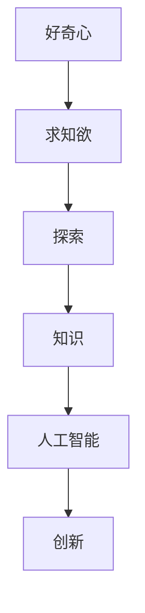

                 

# 好奇心与求知欲：探索的动力

## 1. 背景介绍

### 1.1 问题由来
好奇心与求知欲，自古以来是人类探索世界的原始驱动力。在信息爆炸的今天，这一驱动力更是成为了知识发现的催化剂。在计算机科学和人工智能（AI）领域，这一驱动力催生了无数创新。例如，AlphaGo 的胜利引发了人们对深度学习在决策制定中作用的深思，而 GPT 的突破则开启了自然语言处理（NLP）的新篇章。

### 1.2 问题核心关键点
好奇心与求知欲激发的探索动力，体现在从零散的知识积累到构建复杂的系统。这一过程不仅需要技术上的突破，还需要文化、哲学和社会层面的支持。本文将从技术角度探讨好奇心与求知欲在计算机科学和 AI 领域的影响，以及它们如何推动研究和应用的前沿。

## 2. 核心概念与联系

### 2.1 核心概念概述

本文将探讨以下关键概念：

- **好奇心**：驱动探索和学习的内在动力。
- **求知欲**：学习和获取知识的欲望，是创新的催化剂。
- **探索**：通过研究、实验和开发新技术，推动知识边界扩展的过程。
- **知识**：包括事实、理论、技术和经验，是研究的基础。
- **人工智能**：利用算法和数据，构建能够模拟人类智能的机器系统。
- **创新**：创造新的产品、服务或方法，解决实际问题。

这些概念之间的逻辑关系可以通过以下 Mermaid 流程图来展示：



这一流程图展示了从好奇心和求知欲到探索、知识获取、人工智能发展以及技术创新的过程。

## 3. 核心算法原理 & 具体操作步骤
### 3.1 算法原理概述

好奇心与求知欲驱动的探索动力，体现在不断学习、实践和优化算法上。这一过程包括：

1. **知识获取**：通过阅读文献、参加研讨会、网络课程等方式获取相关知识。
2. **问题定义**：明确研究问题，确定目标和需求。
3. **算法设计**：设计并实现算法，进行实验和验证。
4. **优化与改进**：根据实验结果，不断优化和改进算法。

### 3.2 算法步骤详解

**Step 1: 知识获取**
- **文献阅读**：阅读最新的研究论文，了解领域内的进展和趋势。
- **课程学习**：参加线上或线下的课程，系统学习相关知识。
- **网络资源**：利用在线课程、博客、论坛等获取知识。

**Step 2: 问题定义**
- **明确研究目标**：确定需要解决的问题，例如如何提高算法效率。
- **需求分析**：评估需求，包括算法的性能要求、资源限制等。

**Step 3: 算法设计**
- **设计算法**：基于已有知识，设计新的算法或改进现有算法。
- **实现算法**：将算法转化为代码，进行实现和测试。

**Step 4: 优化与改进**
- **实验验证**：在数据集上运行算法，评估性能。
- **分析结果**：分析实验结果，找出算法不足之处。
- **改进算法**：根据分析结果，调整算法参数或设计新算法。
- **重复实验**：不断重复实验和优化，直至达到满意结果。

### 3.3 算法优缺点

好奇心与求知欲驱动的探索动力具有以下优点：

- **持续创新**：不断学习和实验，推动技术进步。
- **广泛适用性**：适用于各种技术和问题。
- **灵活性**：可以适应不同的环境和需求。

但同时也存在以下缺点：

- **时间成本高**：学习和实验需要大量时间投入。
- **资源需求大**：需要计算机硬件、软件等资源支持。
- **风险高**：探索过程中可能遇到各种问题和挑战。

### 3.4 算法应用领域

好奇心与求知欲驱动的探索动力，已广泛应用于计算机科学和 AI 的各个领域，包括：

- **深度学习**：通过探索新的算法和数据集，提升模型的性能。
- **自然语言处理**：改进模型，提升文本理解和生成能力。
- **计算机视觉**：开发新的图像处理算法，提升识别和分类能力。
- **机器人学**：研究新算法，提升机器人的感知和决策能力。
- **智能系统**：构建能够模拟人类智能的机器系统。

## 4. 数学模型和公式 & 详细讲解  
### 4.1 数学模型构建

本文将使用数学语言对探索过程进行严格描述。

假设探索的目标是设计一个新的算法 $A$，以解决特定问题 $P$。探索过程可以建模为如下数学框架：

1. **知识获取**：$K$，表示通过阅读文献、课程学习等方式获取的知识。
2. **问题定义**：$P$，表示需要解决的问题。
3. **算法设计**：$A$，表示设计的新算法。
4. **算法优化**：$O$，表示通过实验和分析，不断优化算法的过程。

探索过程可以表示为：

$$
A = O(K, P)
$$

### 4.2 公式推导过程

以自然语言处理中的语言模型为例，我们希望构建一个能够预测下一个词的概率模型。假设已知数据集 $D$ 包含 $N$ 个训练样本 $(x_i, y_i)$，其中 $x_i$ 为输入，$y_i$ 为输出。我们的目标是设计一个语言模型 $M$，使得 $M(x_i) = y_i$。

具体步骤如下：

1. **数据准备**：从 $D$ 中提取训练数据，构建模型 $M$ 的训练集。
2. **模型设计**：选择模型架构，如 Transformer、RNN 等，并定义损失函数 $L$。
3. **训练模型**：在训练集上优化模型参数，最小化损失函数 $L$。
4. **模型评估**：在验证集和测试集上评估模型性能。
5. **模型优化**：根据评估结果，调整模型参数，改进算法。

### 4.3 案例分析与讲解

以计算机视觉中的目标检测为例，我们希望设计一个新的目标检测算法 $A$，以识别图像中的物体。我们的探索过程如下：

1. **知识获取**：阅读相关文献，了解现有的目标检测算法，如 Faster R-CNN、YOLO 等。
2. **问题定义**：确定需要解决的问题，例如如何在实时环境下高效地检测物体。
3. **算法设计**：设计新的算法，如 YOLOv5，并实现其代码。
4. **算法优化**：在测试集上评估算法性能，分析实验结果，改进算法。

## 5. 项目实践：代码实例和详细解释说明
### 5.1 开发环境搭建

要进行代码实践，我们需要准备以下开发环境：

1. **Python 环境**：选择 Python 3.x 版本，安装必要的库。
2. **Jupyter Notebook**：用于编写和运行代码。
3. **Git**：版本控制工具，用于管理和共享代码。
4. **Docker**：容器技术，便于在不同环境中运行代码。

### 5.2 源代码详细实现

以下是一个简单的目标检测项目示例，使用 TensorFlow 和 Keras 库实现 YOLOv5：

```python
import tensorflow as tf
from tensorflow.keras.layers import Input, Conv2D, BatchNormalization, LeakyReLU, ZeroPadding2D, UpSampling2D, Concatenate
from tensorflow.keras.models import Model

def create_model(input_shape):
    input_layer = Input(shape=input_shape)
    
    x = Conv2D(32, (3, 3), padding='same', activation='relu')(input_layer)
    x = BatchNormalization()(x)
    x = LeakyReLU(alpha=0.1)(x)
    
    # 后续层省略，按照 YOLOv5 的设计实现剩余层
    ...
    
    return Model(inputs=input_layer, outputs=output_layer)

# 创建模型
model = create_model((416, 416, 3))

# 编译模型
model.compile(optimizer='adam', loss='binary_crossentropy', metrics=['accuracy'])

# 训练模型
model.fit(train_data, epochs=10, batch_size=16, validation_data=val_data)

# 评估模型
model.evaluate(test_data)
```

### 5.3 代码解读与分析

上述代码实现了 YOLOv5 的基本结构，并使用 TensorFlow 和 Keras 进行训练和评估。关键步骤包括：

1. **模型创建**：定义输入层和卷积层，使用 YOLOv5 的架构设计后续层。
2. **模型编译**：设置优化器、损失函数和评价指标。
3. **模型训练**：在训练集上训练模型，使用验证集评估模型性能。
4. **模型评估**：在测试集上评估模型性能。

### 5.4 运行结果展示

训练结束后，我们可以使用以下代码进行模型评估：

```python
from tensorflow.keras.models import load_model
from yolov5.dataset import COCO
from yolov5.utils import non_max_suppression

# 加载模型
model = load_model('yolov5.h5')

# 加载测试集
test_data = COCO('test_data/')

# 进行目标检测
results = model.predict(test_data)

# 可视化结果
visualize_results(test_data, results)
```

## 6. 实际应用场景
### 6.1 自然语言处理

在自然语言处理领域，好奇心与求知欲驱动的探索动力，推动了文本分类、情感分析、机器翻译等技术的发展。例如，BERT 和 GPT 等模型，通过深度学习和大规模数据预训练，显著提升了语言处理能力。

### 6.2 计算机视觉

在计算机视觉领域，探索动力推动了目标检测、图像分类、图像生成等技术的发展。YOLO、ResNet 等模型，通过不断优化算法和改进数据集，提升了视觉处理的性能。

### 6.3 智能系统

在智能系统领域，探索动力推动了智能助理、智能推荐、智能决策等技术的发展。例如，IBM Watson、Google Assistant 等系统，通过不断学习和优化，提升了智能交互的能力。

### 6.4 未来应用展望

未来，探索动力将继续推动计算机科学和 AI 的发展。以下是一些可能的应用方向：

1. **多模态学习**：将视觉、音频和文本等多种模态的数据融合，提升系统的综合能力。
2. **自适应学习**：根据用户行为和反馈，动态调整算法和模型，提升个性化和适应性。
3. **边缘计算**：将计算能力引入边缘设备，提升实时性和响应速度。
4. **量子计算**：利用量子计算加速复杂算法，提升计算效率。

## 7. 工具和资源推荐
### 7.1 学习资源推荐

为了帮助开发者深入理解探索动力在计算机科学和 AI 领域的应用，这里推荐一些优质的学习资源：

1. **Coursera 课程**：提供广泛的计算机科学和 AI 课程，包括深度学习、自然语言处理、计算机视觉等。
2. **Kaggle 竞赛**：通过参加 Kaggle 竞赛，提升实践能力和解决实际问题的能力。
3. **ArXiv**：提供最新的研究和论文，了解领域内的进展和趋势。
4. **GitHub**：提供开源代码和项目，参考和学习他人的工作。
5. **Stack Overflow**：解决技术问题，获取社区支持和反馈。

通过这些学习资源，相信你能够更好地掌握探索动力在计算机科学和 AI 领域的应用，提升自身的技术水平。

### 7.2 开发工具推荐

高效的开发离不开优秀的工具支持。以下是几款用于探索动力驱动的开发工具：

1. **PyTorch**：用于深度学习研究和开发，灵活的计算图和强大的库支持。
2. **TensorFlow**：用于大规模深度学习模型的训练和推理，支持分布式计算。
3. **Jupyter Notebook**：用于编写和运行代码，支持交互式学习和数据可视化。
4. **Git**：版本控制工具，支持协作开发和代码管理。
5. **Docker**：容器技术，支持跨平台和环境一致的代码部署。

合理利用这些工具，可以显著提升探索动力驱动的开发效率，加速创新迭代的步伐。

### 7.3 相关论文推荐

探索动力在计算机科学和 AI 领域的应用，源于学界的持续研究。以下是几篇奠基性的相关论文，推荐阅读：

1. **ImageNet 论文**：提出大规模图像数据集 ImageNet，推动了计算机视觉的发展。
2. **BERT 论文**：提出BERT 模型，利用大规模预训练数据，提升了语言处理的性能。
3. **AlphaGo 论文**：提出 AlphaGo 系统，展示了深度学习在决策制定中的潜力。
4. **GPT-3 论文**：提出 GPT-3 模型，展示了大规模语言模型的潜力。
5. **YOLO 论文**：提出 YOLO 模型，推动了目标检测技术的发展。

这些论文代表了大规模预训练和大模型微调技术的发展脉络。通过学习这些前沿成果，可以帮助研究者把握学科前进方向，激发更多的创新灵感。

## 8. 总结：未来发展趋势与挑战

### 8.1 总结

本文从好奇心与求知欲的角度，探讨了探索动力在计算机科学和 AI 领域的应用。好奇心与求知欲是推动技术进步的原始驱动力，通过不断学习和实验，推动了深度学习、自然语言处理、计算机视觉等领域的快速发展。通过本文的系统梳理，可以看到，探索动力驱动的研究和应用，已经深入到各个技术领域，推动了技术的不断进步。

### 8.2 未来发展趋势

展望未来，探索动力将继续推动计算机科学和 AI 的发展。以下是一些可能的发展趋势：

1. **跨领域融合**：将不同领域的知识和算法进行融合，提升系统的综合能力。
2. **自适应学习**：根据环境变化和用户反馈，动态调整算法和模型，提升系统的适应性和智能性。
3. **人机协作**：通过增强智能系统，实现人机协作，提升工作效率和决策质量。
4. **边缘计算**：将计算能力引入边缘设备，提升实时性和响应速度。
5. **量子计算**：利用量子计算加速复杂算法，提升计算效率。

### 8.3 面临的挑战

尽管探索动力驱动的技术进步取得了显著成就，但在迈向更加智能化、普适化应用的过程中，仍然面临诸多挑战：

1. **数据获取难度大**：高质量的数据获取和标注成本高，限制了探索动力驱动的研究和应用。
2. **计算资源需求高**：大规模预训练和大模型微调需要高性能计算资源，可能面临硬件瓶颈。
3. **算法复杂度高**：复杂算法的设计和优化难度大，需要大量的实验和验证。
4. **伦理和隐私问题**：智能系统的应用可能引发伦理和隐私问题，需要加强监管和保护。
5. **技术和应用脱节**：技术和应用之间的脱节，可能限制了探索动力驱动的应用落地。

### 8.4 研究展望

面对探索动力驱动技术面临的挑战，未来的研究需要在以下几个方面寻求新的突破：

1. **数据获取优化**：利用自动化和半自动化工具，降低数据标注成本，提高数据获取效率。
2. **计算资源优化**：优化算法设计，减少计算资源消耗，提升计算效率。
3. **跨学科合作**：加强跨学科合作，推动技术和应用之间的协同发展。
4. **伦理和隐私保护**：建立伦理和隐私保护机制，确保智能系统应用的安全性和公正性。
5. **人机协作模型**：研究人机协作模型，提升智能系统的交互性和用户体验。

这些研究方向的探索，必将引领探索动力驱动的技术进步，为构建安全、可靠、可解释、可控的智能系统铺平道路。面向未来，探索动力将继续推动计算机科学和 AI 技术的发展，为构建智能未来贡献力量。

## 9. 附录：常见问题与解答

**Q1：探索动力驱动的创新有哪些例子？**

A: 探索动力驱动的创新广泛存在于各个技术领域。例如，AlphaGo 的胜利推动了深度学习在决策制定中的应用，而 BERT 的提出，显著提升了自然语言处理的能力。

**Q2：如何获取高质量的数据集？**

A: 获取高质量的数据集，需要多渠道获取数据，并进行预处理和标注。可以利用公开数据集，如 ImageNet、COCO 等，也可以自主收集和标注数据。

**Q3：如何选择适合的计算资源？**

A: 选择合适的计算资源，需要考虑算法的复杂度、数据规模和任务需求。可以选择高性能计算设备，如 GPU、TPU 等，或者利用云计算资源。

**Q4：探索动力驱动的创新面临哪些挑战？**

A: 探索动力驱动的创新面临数据获取难度大、计算资源需求高、算法复杂度高、伦理和隐私问题等挑战。需要通过多学科合作和技术优化，克服这些挑战。

**Q5：探索动力驱动的创新未来发展方向是什么？**

A: 未来，探索动力将继续推动技术进步。可能的方向包括跨领域融合、自适应学习、人机协作、边缘计算和量子计算等。

总之，好奇心与求知欲激发的探索动力，是推动计算机科学和 AI 技术发展的关键因素。通过不断学习和实验，探索新的技术和应用，我们将能够构建更加智能、高效、可靠的未来。

