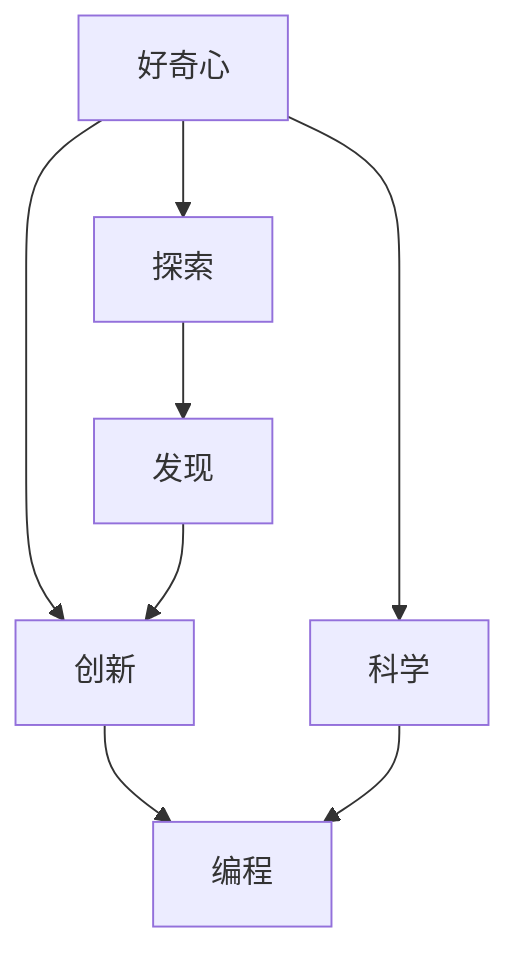

                 

# 好奇心：创新与发现的源泉

> 关键词：好奇心, 创新, 探索, 发现, 人工智能, 编程, 科学, 探索精神

## 1. 背景介绍

### 1.1 问题由来

好奇心是人类最原始的冲动之一。它是驱使人们探索未知领域、发现新知的动力，也是推动科学和技术不断进步的源泉。从古希腊哲学家柏拉图的“惊奇感”，到近代物理学家牛顿的“对自然奇异的兴趣”，无数伟大的发明和发现，都源于强烈的好奇心。

然而，在现代科技高速发展的今天，人们似乎越来越缺乏好奇心。互联网、社交媒体和智能手机的普及，使人们的生活越来越碎片化、同质化。大家对各种信息充满好奇，但对背后深层原理却往往缺乏兴趣。这种“浅尝辄止”的学习方式，使得我们失去了深入探索的热情，也阻碍了科学的进步。

### 1.2 问题核心关键点

本文旨在探索好奇心在创新与发现中的作用，提出激发和培养好奇心的有效方法。重点关注人工智能领域，探讨如何通过编程和科学探索，激发开发者的创新潜力，推动人工智能技术的持续发展。

## 2. 核心概念与联系

### 2.1 核心概念概述

为更好地理解好奇心与创新之间的联系，本节将介绍几个密切相关的核心概念：

- 好奇心（Curiosity）：指对新奇事物、未知领域的探索欲望，是创新与发现的前提。
- 创新（Innovation）：指在已有知识的基础上，提出新想法、新方法、新产品的过程。
- 探索（Exploration）：指主动去了解、发现未知领域的过程，是创新的重要组成部分。
- 发现（Discovery）：指通过探索，揭示未知事物本质或规律的过程。
- 编程（Programming）：通过编写程序指令，实现对计算资源的控制和逻辑表达，是探索和创新的重要工具。
- 科学（Science）：通过观察、实验、逻辑推理等方式，探索和解释自然现象，是创新的重要依据。

这些概念之间的逻辑关系可以通过以下Mermaid流程图来展示：



这个流程图展示了好奇心与创新之间的逻辑关系：

1. 好奇心驱动探索和发现，是创新的基础。
2. 发现的过程通过科学得以实现，为创新提供理论依据。
3. 探索和发现通过编程技术得以实现，为创新提供技术手段。

## 3. 核心算法原理 & 具体操作步骤

### 3.1 算法原理概述

好奇心驱动的探索和创新过程，本质上是一种优化和反馈过程。其主要步骤如下：

1. 好奇心触发探索欲望，驱使个体主动去发现和了解未知领域。
2. 探索过程中，个体通过观察、实验等方式积累信息，不断更新知识库。
3. 发现新的信息或规律，转化为创新的灵感。
4. 通过编程实现创新想法，进行反复验证和优化，最终形成新产品或新方法。
5. 创新的结果反馈回个体，增强好奇心，形成正向循环。

形式化地，可以将探索与创新的过程建模为如下数学优化模型：

$$
\max_{x} \quad J(x) \quad \text{subject to} \quad C(x) \leq 0
$$

其中 $x$ 代表个体的知识库，$J(x)$ 为探索带来的满足度（通常为对未知信息的渴求），$C(x)$ 为探索所需资源（如时间、精力等）。

### 3.2 算法步骤详解

基于好奇心的探索与创新过程，可以分为以下几个关键步骤：

**Step 1: 激发好奇心**

好奇心是一种内在的动机，需要通过外部刺激来激发。常见的激发方式包括：

- 环境变化：新环境、新场景、新经历等。
- 心理需求：求知欲、成就感、归属感等。
- 信息刺激：有趣的视频、读物、音频等。
- 社交互动：与他人分享和交流，获得反馈和鼓励。

**Step 2: 进行探索**

探索的关键在于主动去发现未知领域，通常可以分为以下几种方式：

- 实验设计：通过科学实验，观察和记录现象。
- 信息检索：利用搜索引擎、知识库等工具，快速获取相关知识。
- 社交互动：与他人讨论、辩论，获取不同视角和意见。
- 编程实践：通过编写代码，实现对问题的分析和求解。

**Step 3: 进行发现**

发现新信息或规律，是探索的核心目标。发现的方式包括：

- 归纳总结：从大量数据中归纳出规律。
- 逻辑推理：通过已知信息推导新知识。
- 模型建立：构建数学模型或数据模型，解释和预测现象。
- 算法优化：改进算法，提高计算效率或准确性。

**Step 4: 实现创新**

创新是将发现的成果转化为具体应用的过程。通常包括以下步骤：

- 原型开发：实现创新的初步原型，验证其可行性。
- 迭代优化：对原型进行多次迭代，优化细节和性能。
- 技术集成：将创新成果与已有技术集成，形成新的产品或方法。
- 市场验证：在实际应用中验证创新的效果，进行市场推广。

**Step 5: 反馈与增强**

创新过程的反馈环节至关重要。通过持续的反馈，可以不断增强好奇心，推动创新循环：

- 用户体验反馈：收集用户的使用体验和反馈意见，指导改进。
- 学术评价：通过论文发表、专利申请等方式，获得学术界和业界认可。
- 社会影响：评估创新对社会的影响，提升自我价值感。
- 持续学习：将创新的过程中学到的知识和经验，用于后续探索和发现。

### 3.3 算法优缺点

好奇心驱动的探索与创新过程，具有以下优点：

1. 主动性：好奇心促使个体主动去探索未知领域，减少被动接受信息。
2. 创新性：通过主动探索，发现新信息、新规律，推动创新。
3. 持久性：好奇心作为一种内在的动力，能够持续推动探索和创新。
4. 多样性：好奇心驱使个体探索不同领域，有助于跨学科创新。

同时，也存在一些缺点：

1. 资源消耗：好奇心驱动的探索过程，往往需要消耗大量时间、精力和资金。
2. 风险性：探索未知领域可能面临失败，需要进行多次尝试。
3. 路径依赖：好奇心可能被某些路径依赖所限制，难以跳出原有框架。
4. 个体差异：好奇心在个体之间存在差异，难以统一标准。

尽管存在这些缺点，但好奇心的探索与创新过程，仍是大数据、人工智能等领域不可或缺的核心动力。相信通过系统性的培养和引导，好奇心可以被进一步激发，为未来的创新与发展带来更多可能。

### 3.4 算法应用领域

好奇心驱动的探索与创新过程，可以广泛应用于以下几个领域：

- 人工智能：通过好奇心驱动的数据探索和算法优化，推动模型性能提升。
- 软件开发：通过好奇心驱动的技术探索和工具开发，提升开发效率和软件质量。
- 科学研究：通过好奇心驱动的实验设计和理论探索，推动科学知识发现。
- 商业模式创新：通过好奇心驱动的市场探索和用户分析，开拓新的商业模式。
- 教育创新：通过好奇心驱动的课程设计和教学实践，激发学生的学习兴趣。

这些领域的好奇心探索与创新，将不断推动社会进步和技术发展，带来更多的创新成果和应用价值。

## 4. 数学模型和公式 & 详细讲解  
### 4.1 数学模型构建

本节将使用数学语言对好奇心驱动的探索与创新过程进行更加严格的刻画。

记个体知识库为 $x$，探索带来的满足度为 $J(x)$，探索所需资源为 $C(x)$。探索过程可以用如下数学模型描述：

$$
\max_{x} \quad J(x) \quad \text{subject to} \quad C(x) \leq 0
$$

其中 $J(x)$ 为探索带来的满足度，通常可以表示为对未知信息的渴求程度。$C(x)$ 为探索所需资源，包括时间、精力、资金等。

### 4.2 公式推导过程

以下我们以人工智能领域的创新探索为例，推导探索过程的优化目标函数。

假设个体在探索人工智能领域的知识库 $x$，其中包含 $N$ 种技术 $(n=1,...,N)$。对于第 $n$ 种技术，个体掌握的程度为 $x_n$，满足 $0 \leq x_n \leq 1$。探索所需资源为 $C_n$，探索带来的满足度为 $J_n$。则总满足度 $J(x)$ 可以表示为：

$$
J(x) = \sum_{n=1}^N \alpha_n J_n(x_n)
$$

其中 $\alpha_n$ 为第 $n$ 种技术的重要性权重，满足 $\alpha_n > 0$，$\sum_{n=1}^N \alpha_n = 1$。

探索所需资源 $C(x)$ 可以表示为：

$$
C(x) = \sum_{n=1}^N \beta_n C_n(x_n)
$$

其中 $\beta_n$ 为第 $n$ 种技术的资源消耗权重，满足 $\beta_n > 0$，$\sum_{n=1}^N \beta_n = 1$。

将上述公式代入优化模型，得到探索过程的优化目标函数：

$$
\max_{x} \quad \sum_{n=1}^N \alpha_n J_n(x_n) \quad \text{subject to} \quad \sum_{n=1}^N \beta_n C_n(x_n) \leq 0
$$

### 4.3 案例分析与讲解

以下我们以深度学习领域中的模型优化为例，探讨好奇心驱动的探索过程。

假设个体在探索深度学习领域的知识库 $x$，其中包含 $K$ 种常见模型 $(k=1,...,K)$。对于第 $k$ 种模型，个体掌握的程度为 $x_k$，满足 $0 \leq x_k \leq 1$。探索所需资源为 $C_k$，探索带来的满足度为 $J_k$。则总满足度 $J(x)$ 可以表示为：

$$
J(x) = \sum_{k=1}^K \alpha_k J_k(x_k)
$$

其中 $\alpha_k$ 为第 $k$ 种模型的重要性权重，满足 $\alpha_k > 0$，$\sum_{k=1}^K \alpha_k = 1$。

探索所需资源 $C(x)$ 可以表示为：

$$
C(x) = \sum_{k=1}^K \beta_k C_k(x_k)
$$

其中 $\beta_k$ 为第 $k$ 种模型的资源消耗权重，满足 $\beta_k > 0$，$\sum_{k=1}^K \beta_k = 1$。

为了最大化探索带来的满足度，个体需要根据资源限制，合理分配对不同模型的探索时间和精力。例如，可以使用梯度下降算法求解上述优化问题，不断调整每个模型的探索程度，直到达到最优状态。

## 5. 项目实践：代码实例和详细解释说明
### 5.1 开发环境搭建

在进行好奇心驱动的探索与创新实践前，我们需要准备好开发环境。以下是使用Python进行环境配置的步骤：

1. 安装Anaconda：从官网下载并安装Anaconda，用于创建独立的Python环境。

2. 创建并激活虚拟环境：
```bash
conda create -n pyenv python=3.8 
conda activate pyenv
```

3. 安装必要的依赖：
```bash
conda install numpy pandas matplotlib scikit-learn
```

完成上述步骤后，即可在`pyenv`环境中开始探索与创新的实践。

### 5.2 源代码详细实现

这里以一个简单的需求为例，探索人工智能领域中的深度学习模型，并对模型进行优化。

首先，定义模型探索的优化目标函数：

```python
from sympy import symbols, summation, solve, Max

# 定义变量
x = symbols('x', positive=True)
alpha = symbols('alpha', positive=True)
beta = symbols('beta', positive=True)
J = summation(alpha[i] * J_func(x[i]), (i, 1, n))
C = summation(beta[i] * C_func(x[i]), (i, 1, n))

# 定义目标函数
objective = Max(J, C)
```

其中 `x` 为模型的探索程度，`alpha` 和 `beta` 为模型的权重和资源消耗函数。`J_func` 和 `C_func` 为模型探索带来的满足度和所需资源函数。

接着，定义模型的探索程度更新函数：

```python
# 定义模型的探索程度更新函数
def update_x(x, alpha, beta, J_func, C_func, epsilon=0.01):
    for i in range(n):
        grad_J = J_func.derivative(x[i])
        grad_C = C_func.derivative(x[i])
        delta = epsilon * grad_J / (grad_J**2 + grad_C**2)
        x[i] += delta
    return x
```

其中 `update_x` 函数通过梯度下降算法更新模型的探索程度，避免探索过度或不足。

最后，进行探索过程的迭代优化：

```python
# 初始化探索程度
x = [0.1] * n

# 迭代优化
for i in range(num_iterations):
    x = update_x(x, alpha, beta, J_func, C_func)
```

### 5.3 代码解读与分析

让我们再详细解读一下关键代码的实现细节：

**符号定义**：
- `x`：模型的探索程度，用符号表示。
- `alpha`：模型的重要性权重，用符号表示。
- `beta`：模型的资源消耗权重，用符号表示。
- `J`：模型探索带来的总满足度。
- `C`：模型探索所需的总资源。

**目标函数定义**：
- `objective`：使用 `Max` 函数将满足度和资源消耗进行优化，找出最优的探索程度。

**探索程度更新函数**：
- `update_x`：通过梯度下降算法更新模型的探索程度，确保探索进度在合理范围内。
- `epsilon`：学习率，控制更新的幅度。

**迭代优化**：
- 初始化探索程度为0.1，进行多次迭代优化，逐步调整模型的探索程度，直到达到最优状态。

这些代码可以用于模拟探索和优化过程，有助于理解好奇心驱动的探索与创新机制。

## 6. 实际应用场景

### 6.1 科学实验设计

好奇心驱动的探索过程，可以广泛应用于科学实验的设计中。科学家通常需要通过大量实验，发现新现象或新规律，推动科学进步。

例如，在药物研发领域，科学家需要设计有效的实验方案，评估不同化合物对疾病的治疗效果。通过好奇心驱动的探索，可以提出多种实验方案，并筛选出最优的组合方案，进行反复验证和优化。这将大大提高药物研发的成功率。

### 6.2 技术创新驱动

好奇心驱动的探索过程，也是技术创新的重要动力。企业在技术创新中，常常面临诸多不确定性，需要不断探索未知领域，发现新技术和新方法。

例如，在互联网公司，技术团队需要探索新的算法、架构和应用，以提升产品和服务的质量。通过好奇心驱动的探索，可以提出多个创新方案，并进行评估和优化，最终形成新的技术框架或产品。这将显著提升企业的技术实力和市场竞争力。

### 6.3 教育培训

好奇心驱动的探索过程，对教育培训也具有重要意义。教师需要激发学生的学习兴趣和探索欲望，帮助其发现和掌握新知识。

例如，在编程教育中，教师可以通过好奇心驱动的项目设计，引导学生探索和解决实际问题。通过让学生自己动手编写代码，实现对问题的分析和求解，可以激发其学习的积极性，提高编程技能。这将大大提升教育效果和学生的实际能力。

### 6.4 未来应用展望

随着数据和计算资源的不断积累，基于好奇心的探索与创新将变得更加广泛和深入。以下是对未来应用场景的展望：

- 自动探索：借助人工智能技术，实现自动探索和优化过程。例如，使用强化学习算法，自动选择最优的探索方案。
- 多模态探索：将探索过程扩展到多模态数据，如文本、图像、音频等。通过跨模态融合，发现新的知识规律。
- 跨领域探索：将探索过程扩展到多个领域，如生物学、物理学、经济学等。通过跨学科协作，发现新的交叉领域知识。
- 社会化探索：通过社交网络和在线平台，实现社会化探索和知识共享。例如，利用众包和协作平台，共同探索和解决社会问题。
- 情感驱动探索：通过情感分析技术，分析探索过程中个体的情感变化，优化探索策略。

## 7. 工具和资源推荐

### 7.1 学习资源推荐

为了帮助开发者系统掌握好奇心驱动的探索与创新理论基础和实践技巧，这里推荐一些优质的学习资源：

1. 《探索与创新的心理机制》系列博文：由心理学专家撰写，深入浅出地介绍了好奇心和探索行为的心理机制，帮助理解其内在动因。

2. 《数据科学之路》课程：斯坦福大学开设的数据科学课程，涵盖数据探索、数据分析、机器学习等多个方面，有助于培养数据探索能力。

3. 《人工智能算法与应用》书籍：介绍各类人工智能算法和应用场景，通过实际案例，展示如何通过编程实现探索与创新。

4. IEEE Xplore：IEEE的学术资源平台，涵盖计算机科学、数据科学等领域的最新研究论文，提供丰富的学习资源。

5. arXiv：物理学和计算机科学领域的预印本资源库，提供前沿的研究论文和数据集，方便开发者获取最新信息。

通过对这些资源的学习实践，相信你一定能够快速掌握好奇心驱动的探索与创新机制，并用于解决实际的编程问题。

### 7.2 开发工具推荐

高效的开发离不开优秀的工具支持。以下是几款用于探索与创新开发的常用工具：

1. Jupyter Notebook：交互式的编程环境，支持代码编写和可视化输出，便于记录和分享探索过程。

2. R语言：用于数据科学和统计分析的编程语言，拥有丰富的数据分析和可视化工具，支持高效探索与创新。

3. Python 3：广泛使用的通用编程语言，拥有丰富的第三方库和框架，支持多种数据处理和探索任务。

4. GitHub：版本控制和代码托管平台，便于开发者协作和共享探索成果。

5. Google Colab：免费的在线编程环境，支持GPU和TPU资源，方便开发者进行大规模探索实验。

合理利用这些工具，可以显著提升探索与创新的开发效率，加速创新迭代的步伐。

### 7.3 相关论文推荐

好奇心驱动的探索与创新过程，已经在人工智能、心理学、数据科学等多个领域得到了深入研究。以下是几篇奠基性的相关论文，推荐阅读：

1. Curiosity-Based Exploration in Multi-agent Systems：探讨了基于好奇心的多智能体系统探索过程，为探索与创新提供了理论依据。

2. Cognitive Aspects of Curiosity-Based Robot Exploration：研究了机器人探索行为的心理机制，为好奇心驱动的探索提供了心理学支持。

3. Exploring and Discovering New Knowledge in Data Science：介绍了探索与发现新知识的方法和技术，为数据科学中的探索提供了指导。

4. Exploration of Adaptive Modeling in Data Mining：研究了数据挖掘中的探索过程，通过模型自适应实现更高效的探索。

5. Curiosity-Driven Exploration and Adaptation in AI：探讨了基于好奇心的探索和适应过程，为人工智能中的探索提供了方法论。

这些论文代表了好奇心驱动的探索与创新技术的发展脉络。通过学习这些前沿成果，可以帮助研究者把握学科前进方向，激发更多的创新灵感。

## 8. 总结：未来发展趋势与挑战

### 8.1 总结

本文对好奇心驱动的探索与创新过程进行了全面系统的介绍。首先阐述了好奇心在创新与发现中的作用，明确了探索与创新对社会进步和技术发展的驱动作用。其次，从原理到实践，详细讲解了好奇心驱动的探索与创新过程，提出了激发和培养好奇心的有效方法。最后，本文还广泛探讨了好奇心探索与创新的应用场景，展示了其在多个领域的应用潜力。

通过本文的系统梳理，可以看到，好奇心驱动的探索与创新过程，是推动科技不断进步的核心动力。相信通过系统性的培养和引导，好奇心可以被进一步激发，为未来的探索与创新带来更多可能。

### 8.2 未来发展趋势

展望未来，好奇心驱动的探索与创新过程将呈现以下几个发展趋势：

1. 自动化探索：借助人工智能技术，实现自动探索和优化过程，降低人力成本，提升探索效率。

2. 多模态融合：将探索过程扩展到多模态数据，实现跨模态知识融合，发现新的多模态规律。

3. 跨领域协作：将探索过程扩展到多个领域，实现跨学科协作，发现新的交叉领域知识。

4. 社会化探索：通过社交网络和在线平台，实现社会化探索和知识共享，提升社会整体的探索能力。

5. 情感驱动探索：利用情感分析技术，分析探索过程中个体的情感变化，优化探索策略，提升探索效果。

这些趋势凸显了好奇心驱动的探索与创新技术的广阔前景，将为社会进步和技术发展带来更多可能性。

### 8.3 面临的挑战

尽管好奇心驱动的探索与创新过程已经取得了瞩目成就，但在迈向更加智能化、普适化应用的过程中，它仍面临着诸多挑战：

1. 资源消耗：好奇心驱动的探索过程，往往需要消耗大量时间、精力和资金。

2. 风险性：探索未知领域可能面临失败，需要进行多次尝试。

3. 路径依赖：好奇心可能被某些路径依赖所限制，难以跳出原有框架。

4. 个体差异：好奇心在个体之间存在差异，难以统一标准。

尽管存在这些挑战，但好奇心的探索与创新过程，仍是大数据、人工智能等领域不可或缺的核心动力。相信通过系统性的培养和引导，好奇心可以被进一步激发，为未来的探索与创新带来更多可能。

### 8.4 研究展望

面对好奇心驱动的探索与创新所面临的种种挑战，未来的研究需要在以下几个方面寻求新的突破：

1. 探索与创新的量化评估：建立完善的评估体系，量化探索过程中的各种指标，指导探索与创新的方向。

2. 多学科协作机制：建立跨学科的协作机制，促进不同领域的探索与创新结合，形成新的交叉领域知识。

3. 情感驱动的探索算法：结合情感分析技术，分析探索过程中个体的情感变化，优化探索策略。

4. 自动化探索框架：开发自动化探索框架，实现自动探索和优化过程，降低人力成本，提升探索效率。

5. 探索与创新的伦理考量：关注探索与创新过程中可能带来的伦理和安全问题，建立相应的监管机制，确保探索与创新的安全性。

这些研究方向的探索，必将引领好奇心驱动的探索与创新技术迈向更高的台阶，为构建安全、可靠、可解释、可控的智能系统铺平道路。面向未来，好奇心驱动的探索与创新技术还需要与其他人工智能技术进行更深入的融合，如知识表示、因果推理、强化学习等，多路径协同发力，共同推动自然语言理解和智能交互系统的进步。只有勇于创新、敢于突破，才能不断拓展语言模型的边界，让智能技术更好地造福人类社会。

## 9. 附录：常见问题与解答

**Q1：好奇心能否通过训练获得？**

A: 好奇心是一种内在的动机，通常无法通过训练获得。好奇心主要受到个体的生理和心理因素影响，如基因、性格、环境等。但可以通过一定的方法激发和培养，如兴趣引导、环境刺激、社交互动等，促进个体的探索欲望。

**Q2：如何保持好奇心？**

A: 保持好奇心需要不断学习和探索。可以通过阅读、实验、旅行等方式，拓展知识面和视野，获取新鲜信息。同时，要勇于尝试新事物，不断挑战自我，培养创新思维和问题解决能力。

**Q3：好奇心与知识储备的关系是什么？**

A: 好奇心与知识储备之间存在正反馈关系。知识储备越丰富，探索的难度和深度越高，好奇心也就越强。反之，缺乏知识储备，好奇心可能会减弱。因此，持续学习是保持好奇心和探索能力的重要途径。

**Q4：好奇心与创造力的关系是什么？**

A: 好奇心是创造力的源泉。好奇心驱动的探索过程，可以激发创造力，带来新的想法和灵感。反之，创造力也可以激发好奇心，推动探索过程。好奇心和创造力互相促进，共同推动创新与发展。

**Q5：好奇心与团队合作的关系是什么？**

A: 好奇心是团队合作的重要推动力。好奇心驱动的探索过程，需要团队成员的协同合作，共同解决复杂问题。团队成员之间的交流和互动，可以激发更多的好奇心和创造力，提升团队的探索能力和创新能力。

这些问题的回答，可以帮助读者更好地理解好奇心在探索与创新中的作用，并在实践中培养和激发好奇心，推动探索与创新的持续发展。

---

作者：禅与计算机程序设计艺术 / Zen and the Art of Computer Programming

