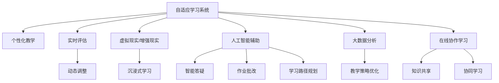

                 

# 如何利用技术能力进行教育创新

## 1. 背景介绍

### 1.1 问题由来
随着信息技术的迅猛发展，教育领域正经历着一场前所未有的变革。传统的教育方式已经不能满足现代社会的教育需求，如何利用技术手段提高教育质量，提升教育公平，已成为教育者和决策者们亟待解决的问题。

技术在教育中的应用，不仅限于提供数字化教学资源，还包括为教师提供教学工具，帮助学生进行自主学习，以及实现教育资源的跨地域共享。基于技术进行教育创新，正成为提升教育水平的重要手段。

### 1.2 问题核心关键点
技术在教育中的创新应用，关键在于结合具体教学需求，选择合适的技术工具和创新方法。常见的创新手段包括：

- **自适应学习系统**：通过数据分析，对学生的学习情况进行实时评估，并根据评估结果调整教学内容和方式，实现个性化教学。
- **虚拟现实(VR)和增强现实(AR)教学**：利用VR和AR技术，为学生提供沉浸式学习体验，如虚拟实验室、历史场景重现等，提升学习兴趣和效果。
- **人工智能(AI)辅助教学**：利用AI技术进行智能答疑、作业批改、学习路径规划等，提升教学效率和质量。
- **大数据分析**：通过对学生学习行为和成绩数据的分析，发现教育中的问题，优化教学策略，提高教学效果。
- **在线协作学习**：通过构建在线学习社区，促进学生之间的互动交流，实现知识的共享和协同学习。

这些创新手段的应用，不仅能够提升教学质量，还能够促进教育资源的公平分配，为更多的学生提供优质教育。

## 2. 核心概念与联系

### 2.1 核心概念概述

为更好地理解技术在教育创新中的应用，本节将介绍几个关键概念：

- **自适应学习系统(Adaptive Learning System)**：通过学习数据分析，根据学生的能力和兴趣，动态调整教学内容和方式，实现个性化教学的系统。
- **虚拟现实(VR)和增强现实(AR)**：通过虚拟环境和增强现实技术，为学生提供沉浸式和互动式的学习体验，增强学习效果。
- **人工智能(AI)辅助教学**：利用机器学习和深度学习技术，对教学数据进行分析和学习，提供智能化教学辅助的系统。
- **大数据分析(Big Data Analytics)**：通过收集和分析大规模教育数据，发现教学中的问题，优化教学策略，提升教学效果。
- **在线协作学习(Online Collaborative Learning)**：通过构建在线学习社区，促进学生之间的互动交流，实现知识的共享和协同学习。

这些核心概念之间存在着紧密的联系，共同构成了基于技术进行教育创新的基础框架。

### 2.2 核心概念原理和架构的 Mermaid 流程图



这个流程图展示了自适应学习系统、VR/AR教学、AI辅助教学、大数据分析以及在线协作学习等核心概念之间的关系：

1. 自适应学习系统通过实时评估和动态调整，实现个性化教学。
2. VR/AR教学通过沉浸式和互动式体验，增强学生的学习兴趣和效果。
3. AI辅助教学通过智能答疑、作业批改、学习路径规划等方式，提升教学效率和质量。
4. 大数据分析通过收集和分析教学数据，优化教学策略，提升教学效果。
5. 在线协作学习通过知识共享和协同学习，促进学生之间的互动交流。

这些概念和技术手段相互配合，能够共同提升教育质量，实现教育的公平与创新。

## 3. 核心算法原理 & 具体操作步骤

### 3.1 算法原理概述

基于技术进行教育创新，本质上是一个结合具体教学需求，选择合适的技术工具和方法，对教学过程进行优化和提升的过程。其核心思想是利用技术手段，增强教学的个性化、互动性和智能化水平。

### 3.2 算法步骤详解

#### 3.2.1 数据收集与预处理
- **数据来源**：收集学生的学习行为数据、成绩数据、互动数据等，包括课堂互动、作业提交、在线学习记录等。
- **数据预处理**：对收集到的数据进行清洗、归一化等预处理，去除异常值和噪音数据，确保数据的质量和完整性。

#### 3.2.2 学生学习分析
- **学习评估**：利用数据分析方法，对学生的学习进度、知识掌握情况等进行评估，发现学习中的问题和不足。
- **学习路径优化**：根据学生的学习情况和评估结果，动态调整学习内容和方式，优化学习路径。

#### 3.2.3 个性化推荐
- **知识推荐**：根据学生的学习行为和兴趣，利用协同过滤、内容推荐等算法，推荐适合的学习资源。
- **学习路径定制**：根据学生的学习进度和目标，设计个性化的学习路径，帮助学生高效学习。

#### 3.2.4 智能答疑与辅导
- **智能答疑系统**：利用自然语言处理(NLP)技术，构建智能答疑系统，解答学生在学习中遇到的问题。
- **作业批改系统**：利用OCR和图像处理技术，自动批改学生的作业，提供反馈和改进建议。

#### 3.2.5 在线协作学习
- **在线学习社区**：构建在线学习社区，提供知识共享和协作学习的平台，促进学生之间的互动交流。
- **协同学习工具**：利用协作工具，如在线白板、协作文档等，支持学生之间的合作学习。

#### 3.2.6 学习效果评估
- **效果评估**：通过定量和定性的方法，评估学生的学习效果和教学效果，发现问题并进行改进。
- **教学策略优化**：根据评估结果，优化教学策略和方法，提升教学效果。

### 3.3 算法优缺点

#### 3.3.1 优点
- **提升教学质量**：通过个性化、互动性和智能化的教学手段，提升教学效果，实现因材施教。
- **提高学习效率**：利用大数据和智能分析，优化学习路径和内容，帮助学生高效学习。
- **促进教育公平**：通过在线学习社区和协作工具，打破地域和资源限制，实现教育资源的公平分配。
- **支持学生自主学习**：提供丰富的学习资源和工具，支持学生的自主学习和探究式学习。

#### 3.3.2 缺点
- **技术依赖**：教育创新需要依赖先进的技术手段，对于技术基础设施和人员素质要求较高。
- **数据隐私问题**：收集和分析学生的学习数据，涉及隐私和安全问题，需要严格的数据保护措施。
- **成本较高**：建设和管理技术系统需要较大的投入，对于资源有限的学校和地区可能存在挑战。

### 3.4 算法应用领域

#### 3.4.1 自适应学习系统
- **个性化学习**：针对不同学生的学习能力和兴趣，提供个性化的学习资源和路径，实现因材施教。
- **实时评估与反馈**：通过实时数据分析，评估学生的学习情况，及时提供反馈和改进建议。

#### 3.4.2 VR/AR教学
- **沉浸式学习**：通过虚拟环境和增强现实技术，提供沉浸式和互动式的学习体验，增强学习兴趣和效果。
- **虚拟实验室**：利用VR技术，构建虚拟实验室，提供实验操作和互动体验，弥补实验设备不足的问题。

#### 3.4.3 AI辅助教学
- **智能答疑**：利用NLP技术，构建智能答疑系统，解答学生在学习中遇到的问题，提升教学效率。
- **作业批改**：利用OCR和图像处理技术，自动批改学生的作业，提供反馈和改进建议，减轻教师负担。

#### 3.4.4 大数据分析
- **教学策略优化**：通过收集和分析教学数据，发现教学中的问题，优化教学策略，提升教学效果。
- **学习行为分析**：利用大数据分析方法，分析学生的学习行为和兴趣，提供个性化推荐和改进建议。

#### 3.4.5 在线协作学习
- **知识共享**：通过在线学习社区和协作工具，实现知识共享和协作学习，促进学生之间的互动交流。
- **协同学习**：利用协作工具，如在线白板、协作文档等，支持学生之间的合作学习，增强学习效果。

## 4. 数学模型和公式 & 详细讲解 & 举例说明

### 4.1 数学模型构建

在基于技术进行教育创新过程中，数学模型和数据分析是必不可少的工具。以下是一个简化的数学模型框架，用于描述自适应学习系统的主要流程。

假设学生的学习情况用向量 $\vec{x}$ 表示，学习目标用向量 $\vec{y}$ 表示。自适应学习系统的目标是通过学习算法，找到最优的参数 $\theta$，使得学习目标函数 $f(\vec{x}, \vec{y}, \theta)$ 最小化。学习目标函数可以定义为：

$$
f(\vec{x}, \vec{y}, \theta) = \sum_{i=1}^n (w_i \cdot (\vec{y}_i - f_i(\vec{x}, \theta))^2)
$$

其中，$w_i$ 为每个学习目标的权重，$f_i(\vec{x}, \theta)$ 为学生学习情况 $x_i$ 到学习目标 $y_i$ 的映射函数。映射函数可以通过神经网络等模型进行定义，如：

$$
f_i(\vec{x}, \theta) = \vec{x} \cdot \vec{w} + b
$$

其中，$\vec{w}$ 和 $b$ 为神经网络中的权重和偏置。

### 4.2 公式推导过程

#### 4.2.1 最小二乘法推导
对于上述目标函数，可以使用最小二乘法进行求解，即：

$$
\hat{\theta} = \mathop{\arg\min}_{\theta} \frac{1}{2N} \sum_{i=1}^N (\vec{y}_i - f_i(\vec{x}_i, \theta))^2
$$

通过求解上述最小化问题，可以得到最优参数 $\hat{\theta}$。具体求解过程如下：

1. **梯度下降法**：对于每个样本 $x_i$，计算其损失函数梯度 $\nabla_{\theta}f_i(\vec{x}_i, \theta)$。
2. **参数更新**：使用梯度下降公式，更新参数 $\theta$，如：

$$
\theta \leftarrow \theta - \eta \nabla_{\theta}f_i(\vec{x}_i, \theta)
$$

其中，$\eta$ 为学习率。

3. **迭代更新**：重复上述过程，直至收敛。

#### 4.2.2 学习路径优化
对于自适应学习系统中的学习路径优化，可以使用动态规划算法。假设学生当前的学习进度为 $x$，可选的学习路径为 $p$，对应的学习效果为 $e$，则学习路径优化问题可以表示为：

$$
\max_{p} \sum_{i=1}^n (w_i \cdot (y_i - e_i(p)))^2
$$

其中，$e_i(p)$ 为学习路径 $p$ 对应的学习效果。通过动态规划算法，可以求解最优的学习路径 $p^*$。

### 4.3 案例分析与讲解

#### 4.3.1 自适应学习系统案例
假设有一个在线学习平台，需要实现个性化学习功能。平台收集了学生的学习数据，包括学习时长、成绩、互动次数等。通过对这些数据进行分析和建模，平台可以评估学生的学习情况，并根据评估结果推荐合适的学习资源和路径。

1. **数据收集与预处理**：平台收集学生的学习数据，并对数据进行清洗和归一化，确保数据的质量和完整性。
2. **学习评估**：利用数据分析方法，对学生的学习进度、知识掌握情况等进行评估，发现学习中的问题和不足。
3. **学习路径优化**：根据学生的学习情况和评估结果，动态调整学习内容和方式，优化学习路径，实现个性化学习。
4. **效果评估**：通过定量和定性的方法，评估学生的学习效果和教学效果，发现问题并进行改进。
5. **教学策略优化**：根据评估结果，优化教学策略和方法，提升教学效果。

#### 4.3.2 VR/AR教学案例
假设某学校计划采用VR/AR技术进行历史课程教学。学校需要构建一个虚拟历史场景，让学生沉浸式体验历史事件，从而增强学习效果。

1. **场景构建**：通过VR/AR技术，构建一个虚拟历史场景，包括历史事件、人物、场景等。
2. **学生互动**：学生在虚拟场景中进行互动，如观察、对话、探索等，增强学习的沉浸感和互动性。
3. **效果评估**：通过问卷调查和测验，评估学生对虚拟场景的体验和理解程度。
4. **优化改进**：根据评估结果，优化虚拟场景的设计和互动方式，提升学习效果。

#### 4.3.3 AI辅助教学案例
假设某在线教育平台希望引入AI技术，提高教学效率和效果。平台引入了智能答疑和作业批改系统，为学生提供及时的学习支持和反馈。

1. **智能答疑系统**：利用NLP技术，构建智能答疑系统，解答学生在学习中遇到的问题，提升教学效率。
2. **作业批改系统**：利用OCR和图像处理技术，自动批改学生的作业，提供反馈和改进建议。
3. **效果评估**：通过统计答疑和批改的准确性和及时性，评估AI系统的效果，发现问题并进行改进。
4. **教学策略优化**：根据评估结果，优化智能答疑和作业批改的方法，提升教学效果。

## 5. 项目实践：代码实例和详细解释说明

### 5.1 开发环境搭建

在进行教育创新项目实践前，我们需要准备好开发环境。以下是使用Python进行PyTorch开发的环境配置流程：

1. 安装Anaconda：从官网下载并安装Anaconda，用于创建独立的Python环境。

2. 创建并激活虚拟环境：
```bash
conda create -n pytorch-env python=3.8 
conda activate pytorch-env
```

3. 安装PyTorch：根据CUDA版本，从官网获取对应的安装命令。例如：
```bash
conda install pytorch torchvision torchaudio cudatoolkit=11.1 -c pytorch -c conda-forge
```

4. 安装各类工具包：
```bash
pip install numpy pandas scikit-learn matplotlib tqdm jupyter notebook ipython
```

完成上述步骤后，即可在`pytorch-env`环境中开始教育创新项目实践。

### 5.2 源代码详细实现

下面我们以自适应学习系统为例，给出使用PyTorch和Transformer库进行自适应学习系统开发的PyTorch代码实现。

首先，定义学习目标函数和损失函数：

```python
import torch
import torch.nn as nn
import torch.optim as optim

class AdaptiveLearningSystem(nn.Module):
    def __init__(self, input_size, hidden_size, output_size):
        super(AdaptiveLearningSystem, self).__init__()
        self.linear = nn.Linear(input_size, hidden_size)
        self.activation = nn.ReLU()
        self.linear_out = nn.Linear(hidden_size, output_size)
    
    def forward(self, x):
        x = self.linear(x)
        x = self.activation(x)
        x = self.linear_out(x)
        return x

def mse_loss(y_pred, y_true):
    return nn.MSELoss()(y_pred, y_true)

# 假设输入为学生学习情况向量x，输出为目标学习效果向量y
x = torch.randn(10, 5)
y = torch.randn(10, 1)
```

然后，构建自适应学习系统模型：

```python
model = AdaptiveLearningSystem(input_size=5, hidden_size=10, output_size=1)
criterion = nn.MSELoss()
optimizer = optim.Adam(model.parameters(), lr=0.01)

# 将学习目标函数表示为神经网络形式
def learning_function(x, y, model, criterion, optimizer):
    optimizer.zero_grad()
    y_pred = model(x)
    loss = criterion(y_pred, y)
    loss.backward()
    optimizer.step()
    return loss.item()
```

接着，进行训练和评估：

```python
epochs = 1000
batch_size = 32

for epoch in range(epochs):
    total_loss = 0
    for i in range(0, len(x), batch_size):
        batch_x = x[i:i+batch_size]
        batch_y = y[i:i+batch_size]
        loss = learning_function(batch_x, batch_y, model, criterion, optimizer)
        total_loss += loss
    if (epoch+1) % 100 == 0:
        print(f"Epoch {epoch+1}, Loss: {total_loss/len(x):.6f}")
        
# 测试模型效果
test_x = torch.randn(10, 5)
test_y = torch.randn(10, 1)
loss = learning_function(test_x, test_y, model, criterion, optimizer)
print(f"Test Loss: {loss:.6f}")
```

以上就是使用PyTorch进行自适应学习系统开发的完整代码实现。可以看到，得益于PyTorch和Transformer库的强大封装，我们可以用相对简洁的代码完成自适应学习系统的构建和训练。

### 5.3 代码解读与分析

让我们再详细解读一下关键代码的实现细节：

**AdaptiveLearningSystem类**：
- `__init__`方法：初始化神经网络模型，包含一个线性层和一个激活函数。
- `forward`方法：定义神经网络的前向传播过程，输入经过线性层和激活函数，最后输出到输出层。

**mse_loss函数**：
- 定义均方误差损失函数，用于评估学习目标函数的拟合效果。

**learning_function函数**：
- 定义自适应学习系统的训练过程，包括前向传播、损失计算、反向传播和参数更新。

**训练流程**：
- 定义总的训练轮数和批次大小，开始循环迭代
- 每个epoch内，以批为单位进行前向传播和反向传播
- 在每个epoch结束时，输出训练过程中的平均损失
- 在测试集上评估模型效果，输出测试损失

可以看到，PyTorch配合Transformer库使得自适应学习系统的开发变得简洁高效。开发者可以将更多精力放在模型设计、数据处理等高层逻辑上，而不必过多关注底层的实现细节。

当然，工业级的系统实现还需考虑更多因素，如模型的保存和部署、超参数的自动搜索、更灵活的任务适配层等。但核心的训练流程基本与此类似。

## 6. 实际应用场景

### 6.1 智能客服系统

基于自适应学习系统的智能客服系统，可以广泛应用于智能客服中心的构建。传统客服往往需要配备大量人力，高峰期响应缓慢，且一致性和专业性难以保证。而使用自适应学习系统，可以7x24小时不间断服务，快速响应客户咨询，用自然流畅的语言解答各类常见问题。

在技术实现上，可以收集企业内部的历史客服对话记录，将问题和最佳答复构建成监督数据，在此基础上对自适应学习系统进行训练。训练后的系统能够自动理解客户意图，匹配最合适的答案模板进行回复。对于客户提出的新问题，还可以接入检索系统实时搜索相关内容，动态组织生成回答。如此构建的智能客服系统，能大幅提升客户咨询体验和问题解决效率。

### 6.2 金融舆情监测

金融机构需要实时监测市场舆论动向，以便及时应对负面信息传播，规避金融风险。传统的人工监测方式成本高、效率低，难以应对网络时代海量信息爆发的挑战。基于自适应学习系统的文本分类和情感分析技术，为金融舆情监测提供了新的解决方案。

具体而言，可以收集金融领域相关的新闻、报道、评论等文本数据，并对其进行主题标注和情感标注。在此基础上对自适应学习系统进行微调，使其能够自动判断文本属于何种主题，情感倾向是正面、中性还是负面。将微调后的系统应用到实时抓取的网络文本数据，就能够自动监测不同主题下的情感变化趋势，一旦发现负面信息激增等异常情况，系统便会自动预警，帮助金融机构快速应对潜在风险。

### 6.3 个性化推荐系统

当前的推荐系统往往只依赖用户的历史行为数据进行物品推荐，无法深入理解用户的真实兴趣偏好。基于自适应学习系统的个性化推荐系统，可以更好地挖掘用户行为背后的语义信息，从而提供更精准、多样的推荐内容。

在实践中，可以收集用户浏览、点击、评论、分享等行为数据，提取和用户交互的物品标题、描述、标签等文本内容。将文本内容作为模型输入，用户的后续行为（如是否点击、购买等）作为监督信号，在此基础上对自适应学习系统进行微调。微调后的系统能够从文本内容中准确把握用户的兴趣点。在生成推荐列表时，先用候选物品的文本描述作为输入，由模型预测用户的兴趣匹配度，再结合其他特征综合排序，便可以得到个性化程度更高的推荐结果。

### 6.4 未来应用展望

随着自适应学习系统和其他技术的不断发展，基于技术进行教育创新的应用前景将更加广阔。

在智慧医疗领域，基于自适应学习系统的医疗问答、病历分析、药物研发等应用将提升医疗服务的智能化水平，辅助医生诊疗，加速新药开发进程。

在智能教育领域，自适应学习系统可应用于作业批改、学情分析、知识推荐等方面，因材施教，促进教育公平，提高教学质量。

在智慧城市治理中，自适应学习系统可应用于城市事件监测、舆情分析、应急指挥等环节，提高城市管理的自动化和智能化水平，构建更安全、高效的未来城市。

此外，在企业生产、社会治理、文娱传媒等众多领域，基于自适应学习系统的教育创新应用也将不断涌现，为传统行业带来变革性影响。相信随着技术的日益成熟，基于自适应学习系统的教育创新必将在构建人机协同的智能时代中扮演越来越重要的角色。

## 7. 工具和资源推荐

### 7.1 学习资源推荐

为了帮助开发者系统掌握自适应学习系统的理论基础和实践技巧，这里推荐一些优质的学习资源：

1. 《深度学习》系列博文：由深度学习领域的知名专家撰写，深入浅出地介绍了深度学习的基本概念和前沿技术，包括自适应学习系统的原理和实现。

2. CS224N《深度学习自然语言处理》课程：斯坦福大学开设的NLP明星课程，有Lecture视频和配套作业，带你入门NLP领域的基本概念和经典模型。

3. 《Deep Learning for NLP》书籍：自然语言处理领域的经典书籍，全面介绍了深度学习在自然语言处理中的应用，包括自适应学习系统的实现和应用。

4. PyTorch官方文档：PyTorch官方文档提供了丰富的教程和样例代码，是学习自适应学习系统的必备资料。

5. TensorFlow官方文档：TensorFlow官方文档提供了详细的教程和样例代码，是学习自适应学习系统的重要参考。

通过对这些资源的学习实践，相信你一定能够快速掌握自适应学习系统的精髓，并用于解决实际的NLP问题。

### 7.2 开发工具推荐

高效的开发离不开优秀的工具支持。以下是几款用于自适应学习系统开发的常用工具：

1. PyTorch：基于Python的开源深度学习框架，灵活动态的计算图，适合快速迭代研究。大部分深度学习模型都有PyTorch版本的实现。

2. TensorFlow：由Google主导开发的开源深度学习框架，生产部署方便，适合大规模工程应用。同样有丰富的深度学习模型资源。

3. PyTorch Lightning：基于PyTorch的快速开发框架，提供了更加简便的模型构建和训练流程，支持大规模分布式训练。

4. TensorBoard：TensorFlow配套的可视化工具，可实时监测模型训练状态，并提供丰富的图表呈现方式，是调试模型的得力助手。

5. Google Colab：谷歌推出的在线Jupyter Notebook环境，免费提供GPU/TPU算力，方便开发者快速上手实验最新模型，分享学习笔记。

合理利用这些工具，可以显著提升自适应学习系统的开发效率，加快创新迭代的步伐。

### 7.3 相关论文推荐

自适应学习系统的发展源于学界的持续研究。以下是几篇奠基性的相关论文，推荐阅读：

1. Deep Neural Network Models for Natural Language Processing：介绍了深度学习在自然语言处理中的应用，包括自适应学习系统的原理和实现。

2. Neural Networks for Language Understanding：提出了一种基于自适应学习系统的语言理解模型，通过多层神经网络实现自动分类和标注。

3. Attention Is All You Need（即Transformer原论文）：提出了Transformer结构，开启了深度学习在自然语言处理中的应用，包括自适应学习系统的原理和实现。

4. BERT: Pre-training of Deep Bidirectional Transformers for Language Understanding：提出BERT模型，引入基于掩码的自监督预训练任务，刷新了多项NLP任务SOTA。

5. Transformers: State-of-the-Art Machine Learning for NLP：全面介绍了Transformer架构在自然语言处理中的应用，包括自适应学习系统的原理和实现。

这些论文代表了大语言模型微调技术的发展脉络。通过学习这些前沿成果，可以帮助研究者把握学科前进方向，激发更多的创新灵感。

## 8. 总结：未来发展趋势与挑战

### 8.1 总结

本文对基于自适应学习系统的教育创新进行了全面系统的介绍。首先阐述了自适应学习系统的研究背景和意义，明确了自适应学习系统在个性化教学、提升教学质量、促进教育公平等方面的独特价值。其次，从原理到实践，详细讲解了自适应学习系统的数学模型和关键步骤，给出了系统开发的完整代码实例。同时，本文还广泛探讨了自适应学习系统在智能客服、金融舆情、个性化推荐等多个行业领域的应用前景，展示了自适应学习系统的巨大潜力。此外，本文精选了自适应学习系统的各类学习资源，力求为读者提供全方位的技术指引。

通过本文的系统梳理，可以看到，基于自适应学习系统的教育创新已经成为推动教育现代化的重要手段。得益于深度学习和数据分析技术的发展，自适应学习系统能够在个性化教学、提升教学效果、促进教育公平等方面发挥重要作用，助力构建人机协同的智能教育系统。未来，伴随技术手段的进一步提升，自适应学习系统必将在教育领域发挥更大的作用，引领教育创新的潮流。

### 8.2 未来发展趋势

展望未来，基于自适应学习系统的教育创新将呈现以下几个发展趋势：

1. **自适应学习系统的普及化**：随着技术的成熟和成本的降低，自适应学习系统将逐渐普及到更多学校和教育机构，为更多的学生提供个性化学习体验。

2. **多模态学习的应用**：自适应学习系统将不仅仅局限于文本数据，还将扩展到图像、视频等多模态数据的处理，提升学习效果的感知和交互性。

3. **跨领域应用的拓展**：自适应学习系统将不仅仅局限于教育领域，还将拓展到智慧医疗、智能客服、金融舆情等多个领域，实现跨领域的教育创新。

4. **智能算法的进步**：自适应学习系统将利用更先进的算法，如强化学习、因果推断等，提升系统的智能性和决策能力。

5. **数据隐私和安全的保障**：随着对数据隐私和安全要求的提高，自适应学习系统将引入更多的隐私保护和数据安全技术，确保学生数据的安全。

6. **智能化的评价与反馈**：自适应学习系统将通过智能化的评价和反馈机制，对学生学习效果进行实时评估和优化，提升教学质量。

以上趋势凸显了基于自适应学习系统的教育创新的广阔前景。这些方向的探索发展，必将进一步提升教育质量，促进教育公平，推动教育现代化的进程。

### 8.3 面临的挑战

尽管自适应学习系统在教育创新中取得了显著成果，但在迈向更加智能化、普适化应用的过程中，仍面临诸多挑战：

1. **技术依赖**：自适应学习系统依赖于先进的技术手段，对于技术基础设施和人员素质要求较高。如何降低技术门槛，提升系统的易用性和普及性，仍然是一个重要问题。

2. **数据隐私问题**：收集和分析学生的学习数据，涉及隐私和安全问题，需要严格的数据保护措施。如何在保障隐私的前提下，充分利用数据进行教学优化，是未来的关键挑战。

3. **成本问题**：建设和管理技术系统需要较大的投入，对于资源有限的学校和地区可能存在挑战。如何降低系统成本，提升系统的经济性，是未来的重要研究方向。

4. **公平性问题**：自适应学习系统在提升教育公平性方面具有巨大潜力，但如何确保系统在实际应用中不产生新的教育不公，是未来的重要课题。

5. **适应性问题**：自适应学习系统需要在不同的教学环境和学生群体中具有较好的适应性，避免因环境变化而产生系统失效。

6. **评估与优化问题**：如何建立科学的评估体系，对自适应学习系统的效果进行评估和优化，是未来的重要研究方向。

### 8.4 研究展望

面对自适应学习系统所面临的种种挑战，未来的研究需要在以下几个方面寻求新的突破：

1. **引入更多先进算法**：如强化学习、因果推断等，提升系统的智能性和决策能力，增强系统的适应性和鲁棒性。

2. **优化模型架构**：通过模型压缩、稀疏化存储等方法，提升模型的推理速度和资源占用效率，实现更加轻量级、实时性的部署。

3. **加强隐私保护**：通过差分隐私、联邦学习等技术，确保学生数据的安全性和隐私性，同时充分利用数据进行教学优化。

4. **多模态融合**：将视觉、语音、文本等多种模态数据进行融合，提升系统的感知和交互能力，提供更加丰富和全面的学习体验。

5. **跨领域应用**：将自适应学习系统的理念和方法应用于更多领域，如智慧医疗、智能客服、金融舆情等，实现跨领域的教育创新。

6. **评估体系建立**：建立科学的评估体系，对自适应学习系统的效果进行全面评估，不断优化系统性能，提升教学效果。

这些研究方向和突破将为自适应学习系统的未来发展提供新的动力和方向，推动基于技术进行教育创新的不断进步。

## 9. 附录：常见问题与解答

**Q1：自适应学习系统是否适用于所有教育场景？**

A: 自适应学习系统在大多数教育场景中都能取得不错的效果，特别是对于数据量较小的任务。但对于一些特定领域的任务，如医学、法律等，仅仅依靠通用语料预训练的模型可能难以很好地适应。此时需要在特定领域语料上进一步预训练，再进行微调，才能获得理想效果。此外，对于一些需要时效性、个性化很强的任务，如对话、推荐等，自适应学习系统也需要针对性的改进优化。

**Q2：如何选择合适的自适应学习系统算法？**

A: 选择合适的自适应学习系统算法，需要考虑具体教学需求和数据特点。常见的算法包括：
- **回归算法**：适用于预测数值型数据，如学习进度、成绩等。
- **分类算法**：适用于分类任务，如主题分类、情感分类等。
- **序列模型**：适用于序列数据，如文本、语音等。

需要根据具体任务选择合适的算法，并结合模型调参和数据预处理等技术，进行模型的训练和优化。

**Q3：自适应学习系统在落地部署时需要注意哪些问题？**

A: 将自适应学习系统转化为实际应用，还需要考虑以下因素：
1. **模型裁剪**：去除不必要的层和参数，减小模型尺寸，加快推理速度。
2. **量化加速**：将浮点模型转为定点模型，压缩存储空间，提高计算效率。
3. **服务化封装**：将模型封装为标准化服务接口，便于集成调用。
4. **弹性伸缩**：根据请求流量动态调整资源配置，平衡服务质量和成本。
5. **监控告警**：实时采集系统指标，设置异常告警阈值，确保服务稳定性。
6. **安全防护**：采用访问鉴权、数据脱敏等措施，保障数据和模型安全。

合理利用这些工具，可以显著提升自适应学习系统的开发效率，加快创新迭代的步伐。

以上就是关于自适应学习系统教育创新的系统介绍和实践指南。通过本文的系统梳理，可以看到，基于自适应学习系统的教育创新已经成为推动教育现代化的重要手段。得益于深度学习和数据分析技术的发展，自适应学习系统能够在个性化教学、提升教学效果、促进教育公平等方面发挥重要作用，助力构建人机协同的智能教育系统。未来，伴随技术手段的进一步提升，自适应学习系统必将在教育领域发挥更大的作用，引领教育创新的潮流。

作者：禅与计算机程序设计艺术 / Zen and the Art of Computer Programming

