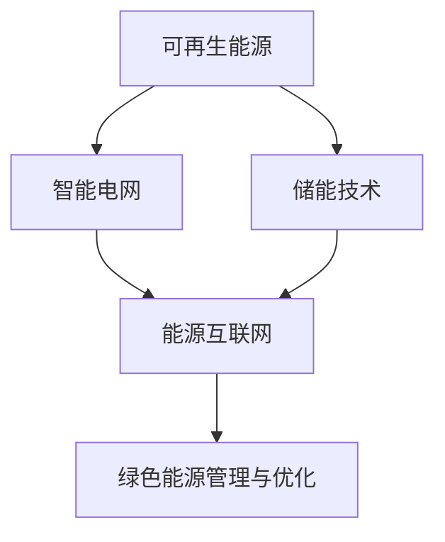

                 

# 如何利用技术能力进行清洁能源领域创新

## 1. 背景介绍

### 1.1 问题由来

清洁能源是实现全球气候目标、实现可持续发展的重要途径。传统的化石燃料资源消耗量巨大，并带来严重的空气污染和环境问题。因此，寻找清洁、高效、可持续的能源替代方案是当前全球共同面临的挑战。

在清洁能源领域，技术创新是实现能源转型的核心推动力。通过科技创新，可以提升清洁能源的效率，降低其成本，扩大其应用规模，从而加速清洁能源的普及和应用。

### 1.2 问题核心关键点

清洁能源领域的技术创新主要涉及以下几个方面：

- **可再生能源技术**：包括太阳能、风能、水能、地热能等，需要技术进步以提高其效率和可靠性。
- **智能电网技术**：通过大数据、物联网、区块链等技术，实现能源的智能管理和调度。
- **储能技术**：需要研发高效、低成本的储能方案，如电池、氢储能等，解决间歇性能源供应的不稳定性。
- **能源互联网**：通过互联网技术实现能源的高效分配和利用，实现“互联网+能源”的新模式。
- **绿色能源管理与优化**：运用人工智能、大数据等技术进行能源消耗的预测和优化，提升能源使用效率。

这些技术领域都需要以科学数据、计算算法和模型为支撑，以期达到清洁能源技术的突破性进展。

### 1.3 问题研究意义

进行清洁能源领域的技术创新，对于推动全球可持续发展、减少碳排放、保障能源安全具有重大意义。清洁能源的广泛应用将改变现有的能源消费模式，促进经济社会的绿色转型，保护生态环境。

## 2. 核心概念与联系

### 2.1 核心概念概述

为了更好地理解如何利用技术能力进行清洁能源创新，我们需要了解几个核心概念：

- **可再生能源**：指自然界中可以持续获得的能源，如太阳能、风能、水能等。
- **智能电网**：通过数字化和智能化技术实现能源的智能化管理和调度。
- **储能技术**：用于储存可再生能源，以备未来使用。
- **能源互联网**：通过互联网技术实现能源的分布式生产与消费，促进能源的高效利用。
- **绿色能源管理与优化**：运用数据科学和算法对能源消耗进行预测和管理。

这些概念之间的联系和相互作用可以通过以下Mermaid流程图来展示：



该流程图展示了可再生能源、智能电网、储能技术、能源互联网和绿色能源管理与优化之间的相互关系：

- 可再生能源为智能电网提供能源供应，储能技术则通过储存间歇性可再生能源，保证电网的稳定性。
- 智能电网和能源互联网通过数字化和互联网技术实现能源的高效管理与分配。
- 绿色能源管理与优化则运用数据科学和算法对能源消耗进行预测和管理，优化能源使用效率。

## 3. 核心算法原理 & 具体操作步骤
### 3.1 算法原理概述

清洁能源领域的技术创新涉及多种学科，包括物理、化学、计算机科学、工程学等。这些领域的算法原理和技术流程可以通过以下几种方式进行：

- **大数据分析**：通过收集和分析大量的能源数据，实现能源的预测和优化。
- **机器学习与深度学习**：构建模型对能源数据进行建模，预测能源供需情况，提升能源使用效率。
- **计算机模拟**：通过计算模型模拟可再生能源技术的性能，进行技术改进和优化。
- **算法优化**：使用优化算法解决储能技术、智能电网等领域中的问题。
- **物联网技术**：通过传感器和通信技术实现设备互联，实时监控和控制能源设备。

### 3.2 算法步骤详解

以下是清洁能源领域技术创新的典型算法步骤：

**Step 1: 数据收集与预处理**
- 收集不同类型的数据源，包括气象数据、能源消耗数据、设备运行数据等。
- 清洗和预处理数据，去除异常值，归一化数据，确保数据质量。

**Step 2: 模型构建与训练**
- 根据具体问题选择合适的模型，如回归模型、分类模型、时序模型等。
- 收集标注数据，构建训练集和验证集，训练模型。
- 使用交叉验证等方法优化模型参数，提升模型性能。

**Step 3: 模型部署与应用**
- 将训练好的模型部署到实际场景中，进行实时预测和优化。
- 集成物联网设备，实现设备的实时监控和控制。
- 运用大数据技术进行能源的实时调度和管理。

**Step 4: 结果评估与优化**
- 定期评估模型性能，如准确率、召回率、均方误差等。
- 根据评估结果，调整模型参数或更换模型，提升模型效果。
- 持续优化算法和数据处理流程，改进模型性能。

### 3.3 算法优缺点

清洁能源领域的技术创新算法具有以下优点：

- **高效率**：通过自动化和大数据分析，可以实现能源的精准管理和优化。
- **广泛适用**：适用于各种类型的清洁能源技术和应用场景，如太阳能、风能、智能电网等。
- **持续改进**：通过不断的数据收集和模型训练，可以持续提升模型性能。

但这些算法也存在以下局限性：

- **数据依赖**：模型的性能很大程度上取决于数据的质量和完整性。
- **计算成本高**：大数据分析和复杂模型训练需要大量的计算资源。
- **模型泛化性**：模型可能对特定数据分布过度拟合，泛化能力不足。
- **实时性要求高**：算法需要快速响应实时数据，对系统稳定性要求高。

### 3.4 算法应用领域

清洁能源领域的技术创新算法主要应用于以下几个方面：

- **太阳能发电预测与优化**：通过预测太阳辐射强度，优化太阳能电池板的运行。
- **风能发电预测与控制**：预测风速，优化风电场的发电效率。
- **智能电网调度与管理**：通过实时数据，优化电网运行，提高能源利用率。
- **储能系统控制与调度**：预测储能系统需求，实现储能系统的智能控制。
- **能源消耗分析与优化**：分析建筑、工业等领域的能源消耗，提出节能优化方案。

## 4. 数学模型和公式 & 详细讲解 & 举例说明

### 4.1 数学模型构建

以下是几个常见的清洁能源领域数学模型：

- **太阳能发电模型**：
  $$
  P_{\text{solar}} = A \times (1 - e^{-\alpha I}) \times (1 - e^{-\beta T})
  $$
  其中 $P_{\text{solar}}$ 为太阳能发电量，$A$ 为光伏面积，$I$ 为太阳辐射强度，$T$ 为温度。

- **风能发电模型**：
  $$
  P_{\text{wind}} = C \times \rho \times A \times \frac{v^3}{3}
  $$
  其中 $P_{\text{wind}}$ 为风能发电量，$C$ 为风力系数，$\rho$ 为空气密度，$A$ 为风力发电机的叶片面积，$v$ 为风速。

- **储能系统模型**：
  $$
  S_{\text{store}} = \int_{0}^{T} P_{\text{in}}(t) dt - \int_{0}^{T} P_{\text{out}}(t) dt
  $$
  其中 $S_{\text{store}}$ 为储能系统存储的能量，$P_{\text{in}}(t)$ 为储能系统在时间 $t$ 的输入功率，$P_{\text{out}}(t)$ 为储能系统在时间 $t$ 的输出功率。

### 4.2 公式推导过程

以太阳能发电模型为例，推导其基本公式：

设 $A$ 为太阳能电池板面积，$I$ 为太阳辐射强度，$T$ 为温度。由太阳辐射模型可知，太阳辐射强度 $I$ 与太阳高度角 $h$、纬度角 $l$ 等参数相关。设 $S_{\text{total}}$ 为太阳辐射总强度，则有：
$$
I = S_{\text{total}} \times \cos(\phi)
$$
其中 $\phi$ 为太阳能电池板与太阳光方向的夹角。

由于太阳能电池板的温度 $T$ 对发电效率有显著影响，引入温度修正系数 $\alpha$ 和 $\beta$，则有：
$$
\eta(T) = 1 - e^{-\alpha I} \times (1 - e^{-\beta T})
$$
其中 $\eta(T)$ 为发电效率。

最终，太阳能发电量 $P_{\text{solar}}$ 为：
$$
P_{\text{solar}} = A \times \eta(T)
$$

### 4.3 案例分析与讲解

**案例1: 太阳能发电预测与优化**

一个太阳能发电站希望通过预测太阳能发电量的变化，优化其输出功率。具体步骤如下：

1. **数据收集**：收集历史太阳能辐射强度和发电数据。
2. **模型训练**：使用时间序列模型（如ARIMA）或深度学习模型（如LSTM）预测未来太阳能辐射强度。
3. **优化策略**：根据预测结果，调整光伏板的运行参数，如倾斜角度、跟踪角度等，以最大化发电效率。

**案例2: 风能发电预测与控制**

一个风电场希望通过预测风速变化，优化风电场的发电效率。具体步骤如下：

1. **数据收集**：收集历史风速数据和风电场发电数据。
2. **模型训练**：使用回归模型（如线性回归）或时序模型（如LSTM）预测未来风速。
3. **控制策略**：根据预测结果，调整风力发电机的叶片角度，以最大化发电效率。

## 5. 项目实践：代码实例和详细解释说明
### 5.1 开发环境搭建

在进行清洁能源领域的技术创新项目实践前，我们需要准备好开发环境。以下是使用Python进行数据分析和模型开发的典型环境配置流程：

1. 安装Anaconda：从官网下载并安装Anaconda，用于创建独立的Python环境。

2. 创建并激活虚拟环境：
```bash
conda create -n cleantechno-env python=3.8 
conda activate cleantechno-env
```

3. 安装相关库：
```bash
conda install pandas numpy scikit-learn matplotlib seaborn
```

4. 安装机器学习库：
```bash
conda install scikit-learn-xgboost lightgbm catboost
```

5. 安装深度学习库：
```bash
conda install tensorflow-gpu pytorch
```

6. 安装大数据处理库：
```bash
conda install dask distributed
```

完成上述步骤后，即可在`cleantechno-env`环境中开始项目开发。

### 5.2 源代码详细实现

下面是使用Python进行太阳能发电预测与优化的代码实现。

```python
import pandas as pd
import numpy as np
from sklearn.model_selection import train_test_split
from sklearn.metrics import mean_squared_error
from sklearn.linear_model import LinearRegression

# 加载数据
data = pd.read_csv('solar_data.csv')

# 数据预处理
X = data[['I', 'T']]
y = data['P_solar']
X_train, X_test, y_train, y_test = train_test_split(X, y, test_size=0.2)

# 模型训练
model = LinearRegression()
model.fit(X_train, y_train)

# 模型评估
y_pred = model.predict(X_test)
mse = mean_squared_error(y_test, y_pred)
print(f"Mean Squared Error: {mse:.2f}")

# 优化策略
# 根据预测结果，调整光伏板运行参数
```

### 5.3 代码解读与分析

让我们再详细解读一下关键代码的实现细节：

**数据预处理**

```python
# 加载数据
data = pd.read_csv('solar_data.csv')

# 数据预处理
X = data[['I', 'T']]
y = data['P_solar']
```

加载并预处理数据。其中 `data` 是包含太阳能辐射强度、温度和发电量的数据集。我们选择了太阳辐射强度和温度作为输入特征，发电量作为输出标签。

**模型训练**

```python
from sklearn.model_selection import train_test_split
from sklearn.metrics import mean_squared_error
from sklearn.linear_model import LinearRegression

# 模型训练
model = LinearRegression()
model.fit(X_train, y_train)
```

使用线性回归模型训练数据，并进行交叉验证。通过 `train_test_split` 将数据集划分为训练集和测试集，然后训练模型并进行评估。

**模型评估**

```python
# 模型评估
y_pred = model.predict(X_test)
mse = mean_squared_error(y_test, y_pred)
```

评估模型性能，使用均方误差评估模型的预测结果和真实值之间的差异。

**优化策略**

```python
# 优化策略
# 根据预测结果，调整光伏板运行参数
```

根据模型的预测结果，调整光伏板的运行参数，如倾斜角度、跟踪角度等，以优化发电效率。

## 6. 实际应用场景

### 6.1 智能电网调度与管理

智能电网调度与管理是清洁能源领域的重要应用场景之一。通过大数据、物联网和区块链技术，可以实现能源的智能化管理和调度，提高能源利用效率。

**应用场景描述**

智能电网调度与管理的核心目标是实现能源的高效管理和优化。通过实时监控和控制电网设备，可以实现能源的智能调度，提高能源利用率，降低能源损耗。

**关键技术**

1. **大数据分析**：通过大数据技术，收集和分析电网设备的数据，实时监控电网运行状态。
2. **物联网技术**：通过传感器和通信技术实现设备的互联和数据传输，实现设备的实时监控和控制。
3. **区块链技术**：通过区块链技术，实现数据的安全存储和传输，确保数据的安全性和可靠性。

**技术实现**

1. **数据采集与处理**：通过物联网技术采集设备的运行数据，如电压、电流、温度等。
2. **实时调度与控制**：使用优化算法对数据进行分析，实时调整电网设备的工作状态，实现能源的高效调度。
3. **安全与隐私保护**：通过区块链技术，实现数据的加密和隐私保护，确保数据的安全性和可靠性。

**实际案例**

一个智能电网调度项目，通过部署传感器和通信设备，实时监控电网设备的运行状态，利用大数据技术进行实时分析和调度，成功提高了能源利用效率，降低了能源损耗。

### 6.2 储能系统控制与调度

储能系统是清洁能源领域的重要组成部分，通过储能技术，可以实现间歇性可再生能源的储存和释放，保证能源的稳定供应。

**应用场景描述**

储能系统控制与调度的目标是实现储能系统的智能控制，保证能源的稳定供应，提高能源利用率。

**关键技术**

1. **能量存储技术**：开发高效、低成本的储能方案，如电池、氢储能等。
2. **智能控制算法**：开发智能控制算法，实现储能系统的优化控制。
3. **能量管理系统**：开发能量管理系统，实现储能系统的智能管理。

**技术实现**

1. **储能系统部署**：在能源需求较高的地区部署储能系统。
2. **智能控制算法**：根据实时能源需求，智能控制储能系统的充放电过程，实现能量的高效存储和释放。
3. **能量管理系统**：通过能量管理系统，实时监控储能系统的运行状态，优化储能系统的控制策略。

**实际案例**

一个储能系统控制项目，通过部署高效的电池储能系统，并使用智能控制算法优化充放电过程，成功提高了储能系统的效率，实现了能量的高效储存和释放。

### 6.3 能源消耗分析与优化

能源消耗分析与优化是清洁能源领域的重要应用场景之一，通过数据分析和算法优化，可以实现能源消耗的预测和优化，提升能源利用效率。

**应用场景描述**

能源消耗分析与优化的目标是实现能源消耗的预测和优化，提升能源利用效率，降低能源消耗。

**关键技术**

1. **大数据分析**：通过大数据技术，收集和分析能源消耗数据，实现能源消耗的预测。
2. **机器学习与深度学习**：构建模型对能源消耗数据进行建模，实现能源消耗的优化。
3. **能源管理系统**：开发能源管理系统，实现能源的智能管理和优化。

**技术实现**

1. **数据采集与处理**：通过传感器和通信技术采集能源消耗数据。
2. **能源消耗预测**：使用回归模型或时序模型预测能源消耗。
3. **能源消耗优化**：根据预测结果，优化能源使用策略，降低能源消耗。

**实际案例**

一个能源消耗优化项目，通过部署传感器和通信设备，实时采集能源消耗数据，使用机器学习模型预测能源消耗，并优化能源使用策略，成功降低了能源消耗。

### 6.4 未来应用展望

随着技术的不断进步，清洁能源领域的技术创新将呈现以下几个趋势：

1. **可再生能源技术的突破**：通过科技创新，进一步提升太阳能、风能等可再生能源的效率和可靠性。
2. **智能电网技术的普及**：通过大数据、物联网和区块链技术，实现能源的智能化管理和调度。
3. **储能技术的提升**：开发高效、低成本的储能方案，实现能源的高效储存和释放。
4. **能源互联网的发展**：通过互联网技术实现能源的分布式生产与消费，促进能源的高效利用。
5. **绿色能源管理与优化**：运用人工智能、大数据等技术，实现能源消耗的预测和优化，提升能源使用效率。

## 7. 工具和资源推荐

### 7.1 学习资源推荐

为了帮助开发者系统掌握清洁能源领域的技术创新，这里推荐一些优质的学习资源：

1. **《清洁能源技术创新》课程**：由国际能源署(IEA)等机构提供的在线课程，涵盖清洁能源技术的基本原理和最新进展。
2. **《能源数据分析与优化》课程**：由IEA和清华大学联合开设的在线课程，涵盖能源数据分析和优化的基本方法和实践经验。
3. **《智能电网技术》书籍**：详细介绍了智能电网技术的基本原理和应用场景，适合行业从业人员阅读。
4. **《储能技术》书籍**：详细介绍了储能技术的基本原理和最新进展，适合行业从业人员阅读。
5. **《清洁能源技术创新论文集》**：收录了近年来清洁能源技术创新的最新研究成果，适合研究人员和行业从业人员阅读。

### 7.2 开发工具推荐

高效的软件工具是技术创新的关键。以下是几款用于清洁能源领域技术创新的常用工具：

1. **Jupyter Notebook**：用于数据分析和模型开发，支持代码编写、数据可视化、结果展示等功能。
2. **Python**：常用的编程语言，支持数据处理、机器学习、深度学习等功能。
3. **TensorFlow**：开源机器学习框架，支持深度学习模型的开发和训练。
4. **PyTorch**：开源深度学习框架，支持高效的模型训练和推理。
5. **OpenEnergy**：用于能源数据分析和优化的开源平台，提供丰富的数据分析工具和算法库。

### 7.3 相关论文推荐

清洁能源领域的技术创新需要大量的研究和实践支持。以下是几篇奠基性的相关论文，推荐阅读：

1. **《智能电网技术进展》**：介绍了智能电网技术的基本原理和最新进展。
2. **《储能系统优化控制研究》**：介绍了储能系统控制与优化的基本方法和实际案例。
3. **《能源数据分析与优化方法》**：介绍了能源数据分析和优化的基本方法和最新进展。
4. **《清洁能源技术创新》**：综述了清洁能源技术的基本原理和最新进展。
5. **《绿色能源管理与优化》**：介绍了绿色能源管理与优化的方法和实际案例。

## 8. 总结：未来发展趋势与挑战

### 8.1 总结

本文对如何利用技术能力进行清洁能源领域创新进行了全面系统的介绍。首先阐述了清洁能源领域的技术创新背景和意义，明确了技术创新在推动全球可持续发展、减少碳排放、保障能源安全方面的重要作用。其次，从原理到实践，详细讲解了清洁能源领域技术创新的数学模型和关键步骤，给出了技术创新的代码实例。同时，本文还广泛探讨了技术创新在智能电网、储能系统、能源消耗分析与优化等多个领域的应用前景，展示了技术创新的巨大潜力。

通过本文的系统梳理，可以看到，清洁能源领域的技术创新离不开科学数据、计算算法和模型，需要跨学科的协同合作，才能实现能源的智能化和可持续发展。未来，随着技术的不断进步和应用场景的不断扩展，清洁能源领域的创新将更加多样化和智能化，为全球的能源转型和可持续发展注入新的动力。

### 8.2 未来发展趋势

展望未来，清洁能源领域的技术创新将呈现以下几个趋势：

1. **可再生能源技术的突破**：通过科技创新，进一步提升太阳能、风能等可再生能源的效率和可靠性，实现能源的广泛应用。
2. **智能电网技术的普及**：通过大数据、物联网和区块链技术，实现能源的智能化管理和调度，提高能源利用率。
3. **储能技术的提升**：开发高效、低成本的储能方案，实现能源的高效储存和释放，解决间歇性能源供应的不稳定性。
4. **能源互联网的发展**：通过互联网技术实现能源的分布式生产与消费，促进能源的高效利用，推动能源的新型经济模式。
5. **绿色能源管理与优化**：运用人工智能、大数据等技术，实现能源消耗的预测和优化，提升能源使用效率。

以上趋势凸显了清洁能源领域的技术创新将为全球能源转型和可持续发展带来深远影响。这些方向的探索发展，必将进一步提升清洁能源技术的性能和应用范围，为实现全球气候目标、保障能源安全提供坚实的技术支撑。

### 8.3 面临的挑战

尽管清洁能源领域的技术创新已经取得了瞩目成就，但在迈向更加智能化、普适化应用的过程中，仍然面临诸多挑战：

1. **技术复杂性高**：清洁能源技术涉及多个学科领域，技术复杂性高，需要跨学科的协同合作。
2. **数据质量要求高**：技术创新依赖于高质量的数据，数据收集、处理和分析需要大量的时间和精力。
3. **成本高**：清洁能源技术的研发和部署需要大量资金投入，短期内难以大规模推广。
4. **政策环境复杂**：清洁能源技术的发展受政策环境影响较大，需要政府和企业的共同支持。
5. **安全性问题**：清洁能源技术在实际应用中，需要考虑系统的安全性和可靠性，避免安全隐患。

### 8.4 研究展望

面对清洁能源领域技术创新所面临的挑战，未来的研究需要在以下几个方面寻求新的突破：

1. **多学科协同合作**：通过跨学科的协同合作，解决清洁能源技术中的关键问题，提升技术的创新能力和应用效果。
2. **大数据与算法的结合**：结合大数据和先进算法，提升清洁能源技术的预测能力和优化能力，实现技术的高效应用。
3. **政策与技术的结合**：将清洁能源技术的发展与政策环境相结合，推动政府和企业的共同支持，加速技术的应用和推广。
4. **技术的安全性和可靠性**：提升清洁能源技术的安全性和可靠性，确保技术的稳定应用，避免安全隐患。

总之，清洁能源领域的技术创新是一个多学科、多领域、多层次的综合系统工程，需要多方共同努力，才能实现清洁能源技术的突破和可持续发展。面向未来，清洁能源领域的技术创新将为全球能源转型和可持续发展注入新的动力，为实现全球气候目标提供坚实的技术支撑。

## 9. 附录：常见问题与解答

**Q1：清洁能源领域的技术创新主要涉及哪些方面？**

A: 清洁能源领域的技术创新主要涉及以下几个方面：
1. 可再生能源技术：包括太阳能、风能、水能、地热能等。
2. 智能电网技术：通过大数据、物联网、区块链等技术实现能源的智能化管理和调度。
3. 储能技术：开发高效、低成本的储能方案，如电池、氢储能等。
4. 能源互联网：通过互联网技术实现能源的分布式生产与消费，促进能源的高效利用。
5. 绿色能源管理与优化：运用数据科学和算法对能源消耗进行预测和管理。

**Q2：如何提高清洁能源技术的效率和可靠性？**

A: 提高清洁能源技术的效率和可靠性，主要从以下几个方面入手：
1. 技术创新：通过科技创新，提升太阳能、风能等可再生能源的效率和可靠性。
2. 系统优化：通过优化算法和数据处理流程，提升能源设备的运行效率和稳定性。
3. 政策支持：通过政府的政策支持和资金投入，推动清洁能源技术的研发和推广。
4. 技术标准化：通过技术标准化，提高清洁能源技术的通用性和兼容性。
5. 监测与维护：通过实时监测和定期维护，保证清洁能源设备的运行状态，避免故障和损坏。

**Q3：清洁能源技术的未来发展趋势有哪些？**

A: 清洁能源技术的未来发展趋势主要包括以下几个方面：
1. 可再生能源技术的突破：进一步提升太阳能、风能等可再生能源的效率和可靠性，实现能源的广泛应用。
2. 智能电网技术的普及：通过大数据、物联网和区块链技术，实现能源的智能化管理和调度，提高能源利用率。
3. 储能技术的提升：开发高效、低成本的储能方案，实现能源的高效储存和释放，解决间歇性能源供应的不稳定性。
4. 能源互联网的发展：通过互联网技术实现能源的分布式生产与消费，促进能源的高效利用，推动能源的新型经济模式。
5. 绿色能源管理与优化：运用人工智能、大数据等技术，实现能源消耗的预测和优化，提升能源使用效率。

总之，清洁能源技术的未来发展将更加多样化、智能化，为全球的能源转型和可持续发展注入新的动力。

---

作者：禅与计算机程序设计艺术 / Zen and the Art of Computer Programming

