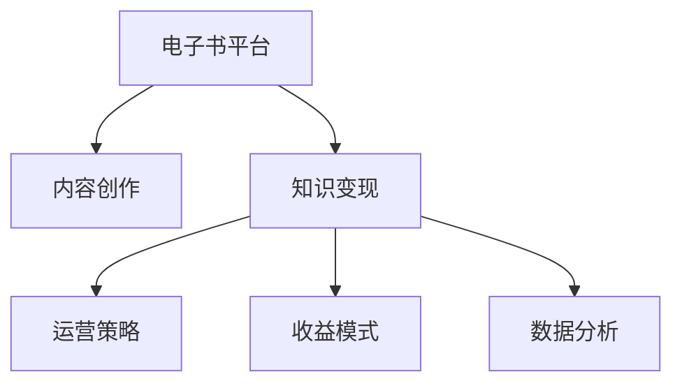

                 

# 如何利用电子书平台实现知识变现

在当今知识经济的时代，电子书平台已成为知识变现的重要渠道。无论是专家学者还是作家，都能够通过在电子书平台上发布内容，向读者提供专业知识和见解，从而实现商业化运作。本文将深入探讨如何利用电子书平台实现知识变现，包括核心概念、算法原理、操作步骤、实际应用场景以及未来展望。

## 1. 背景介绍

### 1.1 问题由来
随着互联网和数字化技术的快速发展，电子书平台逐渐成为知识传播和商业化的主要渠道。电子书平台不仅为读者提供了方便快捷的阅读方式，也为内容创作者提供了广阔的市场和机遇。然而，面对海量内容和激烈的市场竞争，如何高效利用电子书平台，实现知识变现，成为内容创作者和平台运营商共同关注的焦点。

### 1.2 问题核心关键点
电子书平台的知识变现依赖于以下几个关键点：
- 内容质量：高质量、有价值的内容是吸引读者的基础。
- 市场定位：明确平台和内容的目标受众，精准营销。
- 运营策略：通过有效的运营策略提升平台流量和用户粘性。
- 收益模式：合理设计收益模式，实现平台和创作者的共赢。
- 数据分析：通过数据分析优化内容推送和个性化推荐，提高用户体验。

## 2. 核心概念与联系

### 2.1 核心概念概述

为更好地理解如何利用电子书平台实现知识变现，本节将介绍几个密切相关的核心概念：

- **电子书平台(E-book Platform)**：一个提供在线电子书阅读、购买和下载的平台，如Kindle Store、Apple Books等。
- **内容创作(Content Creation)**：创作者通过撰写文章、制作视频等方式，创作有价值的内容。
- **知识变现(Knowledge Monetization)**：将知识内容通过电子书平台转化为经济收益的过程。
- **运营策略(Operational Strategy)**：包括市场定位、推广策略、用户体验优化等，是平台成功的关键。
- **收益模式(Revenue Model)**：如订阅制、按需付费、广告分成等，是实现知识变现的核心手段。
- **数据分析(Analytics)**：通过用户行为数据分析，优化内容和运营策略，提升用户留存和转化率。

这些核心概念之间的逻辑关系可以通过以下Mermaid流程图来展示：



这个流程图展示了几者之间的关系：

1. 电子书平台通过提供内容创作工具和渠道，支持内容创作者上传作品。
2. 内容创作者利用平台提供的资源和用户基础，创作出高质量的内容。
3. 知识变现依赖于平台提供的内容，创作者通过收益模式获得收益。
4. 运营策略和数据分析是优化平台运营和提升用户满意度的关键。

## 3. 核心算法原理 & 具体操作步骤

### 3.1 算法原理概述

电子书平台的知识变现过程，本质上是通过高质量的内容吸引用户，通过有效的运营策略和收益模式，将内容转化为经济收益。其核心思想是：

- 高质量内容：平台通过审核和推荐算法，确保内容的高质量，吸引更多用户订阅或购买。
- 用户基础：平台不断扩大用户群体，提升品牌影响力和用户粘性。
- 收益模式：平台通过合理的收益模式，确保内容创作者和平台本身的收益平衡。
- 数据分析：平台通过数据分析，优化内容和运营策略，提升用户体验和转化率。

### 3.2 算法步骤详解

电子书平台的知识变现一般包括以下几个关键步骤：

**Step 1: 内容创作与上传**
- 选择适合电子书平台的内容类型（如文学作品、技术教程、科普读物等）。
- 撰写或录制内容，并符合平台的格式要求。
- 上传内容到平台，通过审核后发布。

**Step 2: 用户获取与流量提升**
- 通过多渠道推广（如社交媒体、搜索引擎优化、合作推广等）吸引用户。
- 利用数据分析，优化推广策略，提升流量和转化率。
- 与知名创作者合作，借助其影响力吸引更多用户。

**Step 3: 运营策略与用户体验优化**
- 设计符合平台特色的运营策略，如促销活动、专题内容等。
- 定期更新内容，保持用户新鲜感，提升平台活跃度。
- 优化用户界面和功能，提高用户体验和留存率。

**Step 4: 收益模式设计与实施**
- 选择合适的收益模式，如订阅制、按需付费、广告分成等。
- 根据内容价值和用户需求，设置合理的定价策略。
- 实施收益模式，收集用户反馈，不断优化。

**Step 5: 数据分析与优化**
- 收集用户行为数据，包括阅读时长、购买行为、评论反馈等。
- 利用数据分析工具，如Google Analytics、Mixpanel等，进行用户行为分析。
- 根据分析结果，优化内容和运营策略，提升用户转化率和满意度。

### 3.3 算法优缺点

电子书平台的知识变现方法具有以下优点：
1. 低成本：相比传统出版，电子书平台的发行和运营成本较低。
2. 全球市场：电子书平台覆盖全球用户，有利于跨国内容创作和市场扩展。
3. 快速迭代：内容可以快速更新和迭代，保持新鲜度和竞争力。
4. 灵活收益：有多种收益模式可供选择，可以根据平台和创作者需求灵活设计。

同时，该方法也存在一定的局限性：
1. 内容竞争激烈：电子书平台上的内容量巨大，创作者需具备较强的市场竞争能力。
2. 用户需求多样化：不同用户对内容的需求不同，创作者需深入了解目标受众。
3. 平台规则限制：不同平台有不同的内容和运营规则，创作者需遵守相关规则。
4. 收益不均衡：收益模式设计不当可能导致创作者和平台收益不均衡，影响内容质量。
5. 盗版问题：电子书平台需面对盗版和侵权问题，影响收益和用户体验。

尽管存在这些局限性，但就目前而言，电子书平台的知识变现方法仍然是大规模内容创作和商业化的重要手段。未来相关研究的重点在于如何进一步优化收益模式，提升内容质量和用户满意度，同时兼顾创作者和平台的利益。

### 3.4 算法应用领域

电子书平台的知识变现方法在多个领域得到了广泛应用，例如：

- **教育培训**：如在线教育平台上的课程和教材，通过订阅制、按需付费等方式实现知识变现。
- **技术文档**：如GitHub上的开源项目文档，通过广告分成等方式获取收益。
- **科普读物**：如科学普及类图书，通过电子书平台传播和销售。
- **健康医疗**：如医学教材和科普读物，通过专业知识和见解提供精准健康指导。
- **娱乐内容**：如小说、漫画等娱乐读物，通过吸引用户订阅和付费阅读实现商业化运作。

除了上述这些经典应用外，电子书平台的知识变现方法也被创新性地应用到更多场景中，如企业培训、技术支持、个人品牌塑造等，为各行各业的知识传播和商业化提供了新的途径。

## 4. 数学模型和公式 & 详细讲解 & 举例说明

### 4.1 数学模型构建

电子书平台的知识变现过程，可以通过数学模型进行量化分析。假设平台上有$N$个创作者，每个创作者有$M$个内容作品，平台的用户数为$U$，每个用户每次阅读时间为$T$，用户购买内容的概率为$P$，每个内容的定价为$P$。则平台的总收入$I$可以表示为：

$$
I = N \times M \times T \times P \times U
$$

平台的总成本$C$可以表示为：
- 内容创作的成本$C_{content}$，包括创作时间和资源投入。
- 平台的运营成本$C_{platform}$，包括技术维护、营销推广等费用。
- 平台的收益分配成本$C_{distribution}$，包括平台抽成和分成等费用。

则平台的总收入可以表示为：

$$
I = N \times M \times T \times P \times U - C_{content} - C_{platform} - C_{distribution}
$$

通过上述模型，可以计算平台和创作者的收益分配比例，以及不同收益模式对总收入的影响。

### 4.2 公式推导过程

接下来，我们将推导不同收益模式对平台收入的影响。

**订阅制模型**：用户每月支付固定费用$S$，平台按比例分配收入。平台总收入为：

$$
I_{subscription} = U \times S \times (1 - C_{platform}) \times (1 - C_{distribution})
$$

**按需付费模型**：用户每次购买内容时支付费用$C$，平台按比例分配收入。平台总收入为：

$$
I_{pay-per-read} = N \times M \times T \times C \times U \times (1 - C_{platform}) \times (1 - C_{distribution})
$$

**广告分成模型**：平台向用户展示广告，每展示一次广告获得收入$A$，平台按比例分配收入。平台总收入为：

$$
I_{ads} = U \times T \times A \times (1 - C_{platform}) \times (1 - C_{distribution})
$$

通过上述公式，可以计算不同收益模式下的平台收入，并比较其优劣。

### 4.3 案例分析与讲解

**案例一：付费订阅模型**
- **平台运营**：如Kindle Store，用户每月支付固定费用，享受无限内容阅读。
- **内容创作者**：如杰出的作家和科普专家，通过订阅收入获得收益。
- **收益分析**：平台通过按比例分成，确保创作者和平台共享收益。

**案例二：按需付费模型**
- **平台运营**：如Adobe Creative Cloud，用户每次购买设计软件时支付费用。
- **内容创作者**：如专业的设计师，通过内容销售获得收益。
- **收益分析**：平台通过按比例分成，确保创作者和平台共享收益。

**案例三：广告分成模型**
- **平台运营**：如Google Play Books，向用户展示广告，平台获得广告收入。
- **内容创作者**：如自由撰稿人和科普爱好者，通过内容阅读量获得收益。
- **收益分析**：平台通过广告收入分配，确保创作者和平台共享收益。

通过案例分析，可以看出不同收益模式对平台和创作者的收益分配有显著影响。平台需根据自身定位和创作者需求，选择合适的收益模式。

## 5. 项目实践：代码实例和详细解释说明

### 5.1 开发环境搭建

在进行电子书平台知识变现的实践前，我们需要准备好开发环境。以下是使用Python进行项目开发的环境配置流程：

1. 安装Anaconda：从官网下载并安装Anaconda，用于创建独立的Python环境。

2. 创建并激活虚拟环境：
```bash
conda create -n e-book-dev python=3.8 
conda activate e-book-dev
```

3. 安装开发工具：
```bash
pip install pandas numpy scikit-learn matplotlib statsmodels
```

4. 安装电子书平台SDK：
```bash
pip install e-book-platform-sdk
```

完成上述步骤后，即可在`e-book-dev`环境中开始电子书平台知识变现的实践开发。

### 5.2 源代码详细实现

以下是一个简单的电子书平台知识变现项目实现，包括内容上传、用户获取、收益分配和数据分析等模块。

**内容上传模块**：
```python
from e-book_platform import Content

def upload_content(content_name, content_path, author_name, price):
    content = Content(content_name, content_path, author_name, price)
    content.upload_to_platform()
```

**用户获取模块**：
```python
from e-book_platform import User

def get_users():
    users = []
    for user_id in user_id_list:
        user = User(user_id)
        users.append(user)
    return users
```

**收益分配模块**：
```python
from e-book_platform import Platform

def allocate_revenue(content_id, user_id, revenue_type):
    platform = Platform()
    platform.allocate_revenue(content_id, user_id, revenue_type)
```

**数据分析模块**：
```python
from e-book_platform import Analytics

def analyze_user_behavior(user_id):
    analytics = Analytics(user_id)
    return analytics.analyze()
```

### 5.3 代码解读与分析

让我们再详细解读一下关键代码的实现细节：

**Content类**：
- 实现内容上传和发布功能，包括内容名称、路径、作者和价格等属性。

**User类**：
- 实现用户获取和管理功能，包括用户ID和相关行为数据。

**Platform类**：
- 实现收益分配和平台运营功能，包括收益类型、用户ID等。

**Analytics类**：
- 实现用户行为分析和数据统计功能，包括用户ID和行为数据。

**upload_content函数**：
- 创建一个Content对象，并调用其upload_to_platform方法将内容上传至平台。

**get_users函数**：
- 遍历用户ID列表，创建User对象，并返回用户列表。

**allocate_revenue函数**：
- 调用Platform类的allocate_revenue方法，根据内容ID、用户ID和收益类型，进行收益分配。

**analyze_user_behavior函数**：
- 调用Analytics类的analyze方法，对指定用户ID的行为数据进行分析。

## 6. 实际应用场景

### 6.1 在线教育平台

在线教育平台通过电子书发布优质课程内容，帮助学生提升知识和技能。平台通过订阅制或按需付费模型实现知识变现，创作者通过内容销售获得收益。平台通过数据分析优化课程推荐和广告投放，提升用户满意度和转化率。

### 6.2 技术支持文档

技术支持文档通过电子书平台发布，提供专业的技术指导和支持。平台通过广告分成模型实现知识变现，创作者通过广告收入获得收益。平台通过数据分析优化文档推送和广告效果，提升用户粘性和收益。

### 6.3 科普读物

科普读物通过电子书平台发布，传播科学知识和理念。平台通过按需付费模型实现知识变现，创作者通过内容销售获得收益。平台通过数据分析优化内容推荐和广告投放，提升用户阅读量和收益。

### 6.4 未来应用展望

随着电子书平台和知识变现技术的发展，未来将呈现以下几个趋势：

1. **个性化推荐**：平台通过大数据分析和机器学习，实现用户内容的个性化推荐，提升用户体验和留存率。
2. **区块链技术**：利用区块链技术，确保内容版权和收益分配的透明性和安全性。
3. **元宇宙应用**：电子书平台与元宇宙结合，提供沉浸式阅读体验，提升用户粘性和互动性。
4. **交互式内容**：平台支持交互式内容，如在线课程、互动问答等，提升用户参与度和学习效果。
5. **跨平台协作**：电子书平台与其他社交平台和内容平台合作，实现内容共享和收益分配，扩大市场影响力。

## 7. 工具和资源推荐

### 7.1 学习资源推荐

为了帮助开发者系统掌握电子书平台的知识变现理论基础和实践技巧，这里推荐一些优质的学习资源：

1. **《电子书平台技术指南》**：由电子书平台技术专家撰写，深入浅出地介绍了电子书平台的开发和运营。
2. **《内容变现之路》**：一本专门讲解内容变现策略和运营技巧的书籍，涵盖了平台运营、内容创作、收益模式等多个方面。
3. **《电子书数据分析与优化》**：一本讲解电子书平台数据分析和优化的书籍，帮助读者深入理解用户行为和平台运营。
4. **在线课程平台**：如Udacity、Coursera等，提供电子书平台开发和运营的在线课程，帮助开发者系统学习相关知识。
5. **博客和社区**：如Medium、Stack Overflow等，汇聚了大量电子书平台开发和运营的技术文章和讨论，帮助开发者交流和分享经验。

通过对这些资源的学习实践，相信你一定能够快速掌握电子书平台的知识变现技巧，并用于解决实际的电子书平台问题。

### 7.2 开发工具推荐

高效的开发离不开优秀的工具支持。以下是几款用于电子书平台知识变现开发的常用工具：

1. **Python**：Python作为电子书平台开发的主要编程语言，具有丰富的第三方库和框架，支持高效的数据分析和处理。
2. **Flask/Django**：Web开发框架，支持快速搭建和部署电子书平台网站。
3. **GitHub/GitLab**：代码版本控制系统，支持代码管理、协作和发布。
4. **Jupyter Notebook**：交互式编程环境，支持数据探索和可视化。
5. **AWS/GCP/Google Cloud**：云计算平台，提供高性能的计算和存储资源，支持电子书平台的快速部署和扩展。

合理利用这些工具，可以显著提升电子书平台知识变现任务的开发效率，加快创新迭代的步伐。

### 7.3 相关论文推荐

电子书平台和知识变现技术的发展源于学界的持续研究。以下是几篇奠基性的相关论文，推荐阅读：

1. **《电子书平台用户行为分析与推荐系统》**：研究电子书平台用户行为数据建模和推荐系统，提升用户满意度和转化率。
2. **《内容变现模式与运营策略》**：探讨不同内容变现模式的优势和劣势，指导平台选择合适的收益模式。
3. **《区块链技术在电子书平台中的应用》**：利用区块链技术解决电子书平台的内容版权和收益分配问题，提高平台透明度和安全性。
4. **《交互式电子书平台设计》**：研究交互式电子书平台的设计和实现，提升用户参与度和学习效果。

这些论文代表了大电子书平台知识变现技术的发展脉络。通过学习这些前沿成果，可以帮助研究者把握学科前进方向，激发更多的创新灵感。

## 8. 总结：未来发展趋势与挑战

### 8.1 研究成果总结

本文对电子书平台的知识变现方法进行了全面系统的介绍。首先阐述了电子书平台的背景和意义，明确了知识变现的核心关键点。其次，从原理到实践，详细讲解了电子书平台的数学模型和算法流程，给出了电子书平台知识变现的完整代码实现。同时，本文还广泛探讨了电子书平台在多个行业领域的应用前景，展示了电子书平台知识变现的巨大潜力。

通过本文的系统梳理，可以看到，电子书平台的知识变现方法正在成为内容创作者和平台运营商的重要手段，极大地拓展了内容创作的商业化边界，推动了知识经济的发展。未来，伴随电子书平台和知识变现技术的持续演进，相信内容创作者和平台运营商将有更多的创新和突破，知识变现市场也将迎来更广阔的发展空间。

### 8.2 未来发展趋势

展望未来，电子书平台的知识变现技术将呈现以下几个发展趋势：

1. **大数据与AI的融合**：通过大数据和AI技术，实现更精准的用户行为分析和内容推荐，提升用户体验和留存率。
2. **跨平台协作**：电子书平台与其他社交平台和内容平台合作，实现内容共享和收益分配，扩大市场影响力。
3. **区块链技术的应用**：利用区块链技术，确保内容版权和收益分配的透明性和安全性。
4. **元宇宙技术的应用**：结合元宇宙技术，提供沉浸式阅读体验，提升用户粘性和互动性。
5. **交互式内容的普及**：支持交互式内容，如在线课程、互动问答等，提升用户参与度和学习效果。

以上趋势凸显了电子书平台知识变现技术的广阔前景。这些方向的探索发展，必将进一步提升电子书平台的商业价值和用户体验，为知识经济的发展注入新的动力。

### 8.3 面临的挑战

尽管电子书平台的知识变现方法已经取得了瞩目成就，但在迈向更加智能化、普适化应用的过程中，它仍面临着诸多挑战：

1. **内容质量不稳定**：部分创作者为了快速变现，可能生产低质量内容，影响平台声誉和用户满意度。
2. **收益模式设计不当**：收益模式设计不合理，可能导致创作者和平台收益不均衡，影响内容质量和平台运营。
3. **用户粘性不足**：平台需要通过不断创新和优化运营策略，提升用户粘性和留存率。
4. **数据隐私和安全**：平台需严格保护用户隐私数据，防止数据泄露和滥用。
5. **市场竞争激烈**：面对激烈的市场竞争，平台需不断提升自身竞争力，保持市场份额。

尽管存在这些挑战，但通过持续的技术创新和优化运营，电子书平台的知识变现技术将不断突破，为内容创作者和平台运营商提供更多的机遇和挑战。

### 8.4 研究展望

面对电子书平台知识变现所面临的种种挑战，未来的研究需要在以下几个方面寻求新的突破：

1. **内容质量控制**：引入内容审核机制，提升平台内容质量。
2. **收益模式优化**：研究和设计更合理、公平的收益模式，确保创作者和平台共赢。
3. **用户粘性提升**：通过个性化推荐和交互式内容，提升用户粘性和参与度。
4. **数据隐私保护**：采用先进的加密和隐私保护技术，保障用户数据安全。
5. **市场竞争策略**：研究和应用市场竞争策略，提升平台在市场中的竞争力。

这些研究方向的探索，必将引领电子书平台知识变现技术迈向更高的台阶，为内容创作者和平台运营商提供更多创新的路径和思路。总之，电子书平台的知识变现技术需要从内容创作、收益分配、运营策略等多个维度协同发力，才能真正实现知识变现的市场化和商业化。

## 9. 附录：常见问题与解答

**Q1: 电子书平台如何吸引用户？**

A: 电子书平台吸引用户主要依赖于高质量的内容和合理的运营策略。平台需定期更新优质内容，提升内容吸引力。同时，通过多渠道推广、用户激励和个性化推荐，吸引更多用户下载和使用平台。

**Q2: 电子书平台如何保证内容质量？**

A: 电子书平台通过内容审核机制，对上传内容进行严格的审核和筛选。平台还可引入用户评价和反馈机制，提升内容质量和用户满意度。

**Q3: 电子书平台如何优化收益模式？**

A: 电子书平台需根据自身定位和创作者需求，选择合适的收益模式，如订阅制、按需付费、广告分成等。同时，需不断优化定价策略和收益分配比例，确保创作者和平台共赢。

**Q4: 电子书平台如何提升用户粘性？**

A: 电子书平台需通过个性化推荐、交互式内容和优质服务，提升用户粘性和留存率。平台还需不断优化用户体验，提升用户满意度。

**Q5: 电子书平台如何应对盗版和侵权问题？**

A: 电子书平台需建立完善的内容版权保护机制，采用数字水印、加密等技术，防止盗版和侵权。平台还可通过法律手段打击盗版和侵权行为，保护自身和创作者权益。

通过这些问题和解答，希望能帮助读者更好地理解和应用电子书平台的知识变现技术，推动电子书平台和内容创作行业的健康发展。

---

作者：禅与计算机程序设计艺术 / Zen and the Art of Computer Programming

