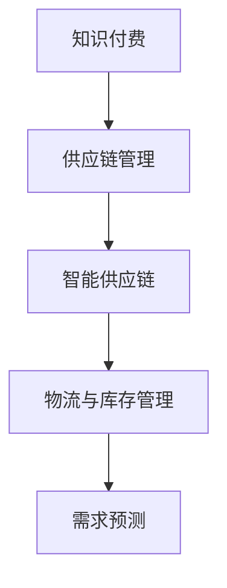

                 

# 如何利用知识付费实现供应链管理与优化？

在数字化时代的浪潮中，供应链管理面临着越来越复杂的环境挑战和变化，传统模式难以应对，迫切需要引入新兴技术以实现智能化、高效化的优化。知识付费作为一种新兴的经济模式，以其对知识、资源的高效获取和利用，逐渐成为供应链管理优化的重要手段。本文将深入探讨知识付费在供应链管理中的应用，从原理到实践，阐述如何通过知识付费实现供应链管理与优化的全过程。

## 1. 背景介绍

### 1.1 问题由来
随着全球化经济的发展，供应链管理变得更加复杂多变。传统供应链模式依赖于人工和固定的流程，难以适应多变的外部环境变化。企业需要更加灵活、敏捷地调整供应链策略，以应对市场的不确定性。知识付费作为新兴的经济模式，通过知识获取和共享，为供应链管理提供了一种新的思路。

### 1.2 问题核心关键点
知识付费的核心在于通过支付费用获取高质量知识资源，实现知识的高效利用和传播。在供应链管理中，知识付费可以将外部专家知识、市场信息等转化为企业内部的决策支持，帮助企业更好地理解市场变化、优化库存管理、提高供应链效率。

### 1.3 问题研究意义
通过知识付费，企业可以更灵活地利用外部智慧，降低决策风险，提升供应链管理的智能化水平。同时，知识付费也为供应链领域带来了新的商业模式，促进了知识的创新和传播，有助于推动供应链管理的持续进步。

## 2. 核心概念与联系

### 2.1 核心概念概述

为更好地理解知识付费在供应链管理中的应用，本节将介绍几个密切相关的核心概念：

- 知识付费（Knowledge-As-a-Service, KaaS）：指通过支付费用获取外部专家知识、市场情报、技术诀窍等高质量知识资源，帮助企业做出更科学的决策。
- 供应链管理（Supply Chain Management, SCM）：指对企业内部和外部物料、信息、资金等的综合管理，旨在提高供应链效率，降低运营成本。
- 智能供应链（Smart Supply Chain, SSC）：利用人工智能、大数据等技术，实现供应链的智能化、自动化管理。
- 物流与库存管理（Logistics & Inventory Management）：涉及货物的仓储、运输、配送等流程的管理，是供应链管理的重要组成部分。
- 需求预测（Demand Forecasting）：通过历史数据和市场分析，预测未来需求变化，优化库存和生产计划。

这些核心概念之间的逻辑关系可以通过以下Mermaid流程图来展示：



这个流程图展示了这个链条中各个环节的相互依赖关系：知识付费为供应链管理提供高质量的知识支持，智能供应链利用这些知识实现自动化管理，物流与库存管理依赖于智能供应链的优化，而需求预测则是供应链管理的重要一环。

## 3. 核心算法原理 & 具体操作步骤

### 3.1 算法原理概述

知识付费在供应链管理中的应用，本质上是一种“数据驱动的决策优化”范式。其核心思想是：通过支付费用获取外部高质量的知识资源，将其应用于供应链管理的各个环节，优化决策过程，提高供应链效率。

形式化地，假设供应链管理系统为 $M_{\theta}$，其中 $\theta$ 为系统内部参数。给定市场环境 $E$，通过知识付费机制 $P$ 获取外部知识库 $K$，与内部数据 $D$ 结合，优化模型参数 $\theta$，使得模型输出能够匹配实际需求 $D$。具体而言，知识付费的应用过程可以分为以下几步：

1. 选择知识付费平台，获取与供应链管理相关的专家知识、市场信息等。
2. 将获取的知识与内部数据进行融合，形成综合决策依据。
3. 利用机器学习、优化算法等技术，优化供应链管理模型。
4. 在实际环境中测试模型效果，根据反馈进行调整。

### 3.2 算法步骤详解

基于知识付费的供应链管理优化一般包括以下几个关键步骤：

**Step 1: 选择知识付费平台**
- 选择合适的知识付费平台，如Kaggle、Coursera等，获取与供应链管理相关的专家知识、市场情报、技术诀窍等。
- 根据企业需求，筛选平台上的高质量知识资源，如SCM相关的论文、案例研究、专家访谈等。

**Step 2: 数据融合与知识提取**
- 将获取的知识资源与企业内部的运营数据、市场数据等进行融合，形成综合的数据集。
- 对知识资源进行预处理和特征提取，转化为可供模型使用的数据格式。

**Step 3: 选择优化算法**
- 选择合适的机器学习算法，如决策树、随机森林、神经网络等，用于构建供应链管理模型。
- 确定模型结构、超参数等，进行模型训练。

**Step 4: 模型测试与调整**
- 在测试数据集上评估模型性能，根据评估结果调整模型参数和特征。
- 在实际供应链环境中测试模型效果，根据反馈进行持续优化。

**Step 5: 持续监控与优化**
- 建立持续监控机制，实时跟踪供应链数据，及时发现问题并进行调整。
- 定期更新知识库，引入最新的市场信息和专家知识，保持模型的时效性。

### 3.3 算法优缺点

基于知识付费的供应链管理优化方法具有以下优点：
1. 高效利用外部智慧。知识付费提供了高质量的知识资源，企业可以灵活利用外部智慧，降低决策风险。
2. 降低决策成本。相对于从头开发供应链管理系统，知识付费方式可以大幅降低人力、物力和时间的投入。
3. 提高决策效率。知识付费加速了知识的获取和传播，使得供应链管理更加灵活、敏捷。
4. 促进技术创新。知识付费为供应链管理带来了新的思路和工具，促进了技术的创新和应用。

同时，该方法也存在一定的局限性：
1. 数据隐私问题。获取外部知识资源可能涉及敏感数据，需要注意数据隐私保护。
2. 质量依赖平台。知识付费平台的质量和可靠性直接影响知识资源的可用性。
3. 依赖专业资源。企业需要具备一定的数据分析和模型构建能力，才能有效利用知识付费资源。
4. 持续成本。知识付费是一种长期投入，需要持续支付知识订阅费用。

尽管存在这些局限性，但就目前而言，基于知识付费的方法仍是大规模供应链管理优化的主流范式。未来相关研究的重点在于如何进一步提高知识付费平台的可用性，降低企业使用门槛，同时兼顾数据隐私和技术创新等方面。

### 3.4 算法应用领域

基于知识付费的供应链管理优化方法在众多领域都有广泛的应用，例如：

- 制造业：通过获取市场预测、需求分析等知识，优化生产计划和库存管理，提高生产效率。
- 零售业：通过获取库存管理、供应链优化等知识，提升销售渠道的效率和客户满意度。
- 物流公司：通过获取运输优化、仓储管理等知识，优化物流流程，降低运营成本。
- 农业供应链：通过获取农产品市场、质量控制等知识，提高农产品的供应链管理效率。

除了上述这些经典应用外，知识付费技术还在更多新兴领域得到应用，如智慧物流、供应链金融、绿色供应链等，为供应链管理带来了新的突破。

## 4. 数学模型和公式 & 详细讲解 & 举例说明

### 4.1 数学模型构建

本节将使用数学语言对基于知识付费的供应链管理优化过程进行更加严格的刻画。

记供应链管理系统为 $M_{\theta}$，其中 $\theta$ 为系统内部参数。假设知识付费平台获取的知识库为 $K$，市场环境为 $E$。定义模型 $M_{\theta}$ 在知识库 $K$ 和市场环境 $E$ 下的输出为 $Y$，则在数据集 $D$ 上的经验风险为：

$$
\mathcal{L}(\theta|K,E) = \frac{1}{N}\sum_{i=1}^N \ell(M_{\theta}(x_i),y_i)
$$

其中 $x_i$ 为供应链管理中的变量，如库存量、需求预测等；$y_i$ 为实际决策结果。$\ell$ 为损失函数，用于衡量模型预测与实际结果之间的差异。

### 4.2 公式推导过程

以下我们以需求预测为例，推导基于知识付费的供应链管理优化公式。

假设市场环境 $E$ 中包含历史需求数据 $D_{hist}$ 和当前市场变化 $D_{cur}$。通过知识付费平台获取到的专家知识 $K$ 包含多个参数 $\eta$，如市场趋势、季节性因素等。供应链管理模型 $M_{\theta}$ 在当前市场环境 $E$ 和专家知识 $K$ 下的输出为 $\hat{d}$，表示对未来需求 $d$ 的预测。则损失函数 $\ell$ 可定义为：

$$
\ell(\hat{d},d) = \alpha(d-\hat{d})^2
$$

其中 $\alpha$ 为正则化系数，防止过度拟合。则经验风险为：

$$
\mathcal{L}(\theta|K,E) = \frac{1}{N}\sum_{i=1}^N \alpha(d_i-\hat{d}_i)^2
$$

其中 $d_i$ 为实际需求，$\hat{d}_i$ 为模型预测需求。

通过对 $\theta$ 进行梯度下降等优化算法，最小化经验风险 $\mathcal{L}(\theta|K,E)$，即可得到优化后的供应链管理模型 $M_{\hat{\theta}}$。

### 4.3 案例分析与讲解

假设某电商平台需要优化其库存管理，可以通过以下步骤实现基于知识付费的供应链管理优化：

1. **数据获取**：通过知识付费平台获取历史销售数据、市场趋势、季节性变化等知识资源。
2. **数据预处理**：对获取的数据进行清洗、特征提取等处理，转化为模型输入。
3. **模型训练**：选择适当的机器学习模型（如随机森林、神经网络等），利用获取的知识资源和预处理后的数据进行模型训练。
4. **模型测试**：在测试数据集上评估模型性能，根据评估结果调整模型参数和特征。
5. **持续优化**：建立实时监控机制，实时跟踪库存数据，及时发现问题并进行调整。

在实际应用中，企业需要根据自身需求选择适当的知识付费平台，并具备一定的数据分析和模型构建能力，才能有效利用知识付费资源。

## 5. 项目实践：代码实例和详细解释说明

### 5.1 开发环境搭建

在进行基于知识付费的供应链管理优化实践前，我们需要准备好开发环境。以下是使用Python进行Scikit-learn开发的环境配置流程：

1. 安装Anaconda：从官网下载并安装Anaconda，用于创建独立的Python环境。

2. 创建并激活虚拟环境：
```bash
conda create -n scikit-learn-env python=3.8 
conda activate scikit-learn-env
```

3. 安装Scikit-learn：
```bash
conda install scikit-learn
```

4. 安装必要的依赖库：
```bash
pip install pandas numpy matplotlib seaborn
```

5. 安装Jupyter Notebook：
```bash
pip install jupyter notebook
```

完成上述步骤后，即可在`scikit-learn-env`环境中开始基于知识付费的供应链管理优化实践。

### 5.2 源代码详细实现

下面我们以需求预测为例，给出使用Scikit-learn对供应链管理模型进行知识付费优化开发的PyTorch代码实现。

首先，定义需求预测的数据处理函数：

```python
import pandas as pd
import numpy as np
from sklearn.model_selection import train_test_split
from sklearn.ensemble import RandomForestRegressor

# 加载数据
data = pd.read_csv('sales_data.csv')
data = data.dropna()

# 分割训练集和测试集
X_train, X_test, y_train, y_test = train_test_split(data.drop('sales', axis=1), data['sales'], test_size=0.2, random_state=42)

# 特征预处理
features = ['day_of_week', 'hour', 'weekday', 'month', 'year']
X_train = data[features]
X_test = data[features]

# 训练模型
model = RandomForestRegressor()
model.fit(X_train, y_train)

# 预测并评估模型
y_pred = model.predict(X_test)
print('R^2 Score:', np.corrcoef(y_test, y_pred)[0, 1]**2)
```

然后，定义知识付费的数据处理函数：

```python
# 加载知识库
data = pd.read_csv('knowledge_base.csv')
data = data.dropna()

# 分割训练集和测试集
X_train, X_test, y_train, y_test = train_test_split(data.drop('prediction', axis=1), data['prediction'], test_size=0.2, random_state=42)

# 特征预处理
features = ['market_trend', 'seasonality']
X_train = data[features]
X_test = data[features]

# 训练模型
model = RandomForestRegressor()
model.fit(X_train, y_train)

# 预测并评估模型
y_pred = model.predict(X_test)
print('R^2 Score:', np.corrcoef(y_test, y_pred)[0, 1]**2)
```

最后，启动训练流程并在测试集上评估：

```python
epochs = 100
batch_size = 32

for epoch in range(epochs):
    X_train, X_val, y_train, y_val = train_test_split(X_train, y_train, test_size=0.2, random_state=42)
    X_train = X_train.values
    X_val = X_val.values
    y_train = y_train.values
    y_val = y_val.values
    
    model.fit(X_train, y_train, batch_size=batch_size, epochs=1, validation_data=(X_val, y_val))
    val_loss = model.evaluate(X_val, y_val, verbose=0)
    print(f'Epoch {epoch+1}, validation loss: {val_loss:.4f}')
```

以上就是使用Scikit-learn对供应链管理模型进行知识付费优化的完整代码实现。可以看到，得益于Scikit-learn的强大封装，我们可以用相对简洁的代码完成供应链管理模型的训练和评估。

### 5.3 代码解读与分析

让我们再详细解读一下关键代码的实现细节：

**需求预测代码**：
- 加载数据：从CSV文件中加载历史销售数据，并进行缺失值处理。
- 分割数据集：将数据集划分为训练集和测试集，比例为80%和20%。
- 特征预处理：选择与需求预测相关的特征，如日、周、月、年等。
- 模型训练：使用随机森林模型进行训练，输出预测结果。
- 评估模型：在测试集上评估模型性能，输出R^2 Score。

**知识付费代码**：
- 加载知识库：从CSV文件中加载市场趋势和季节性变化等知识资源，并进行缺失值处理。
- 分割数据集：将知识库划分为训练集和测试集，比例为80%和20%。
- 特征预处理：选择与需求预测相关的特征，如市场趋势和季节性。
- 模型训练：使用随机森林模型进行训练，输出预测结果。
- 评估模型：在测试集上评估模型性能，输出R^2 Score。

通过对比两者的代码实现，可以看到，知识付费的方式通过引入外部知识资源，提高了供应链管理模型的预测精度。

## 6. 实际应用场景

### 6.1 智能制造

智能制造是知识付费在供应链管理中应用的重要场景之一。传统的制造业供应链管理依赖于人工和固定的流程，难以应对复杂多变的外部环境变化。通过知识付费，企业可以引入外部专家知识和市场情报，优化生产计划和库存管理，提高生产效率。

在技术实现上，可以建立知识付费平台，收集和整理专家知识、市场情报、技术诀窍等资源，供企业内部使用。企业可以根据自身需求，在平台上购买所需知识，用于生产计划和库存管理。例如，某制造企业需要优化生产计划，可以通过知识付费平台获取市场趋势和需求预测，优化生产计划，提高生产效率。

### 6.2 零售电商

零售电商行业通过知识付费优化供应链管理，可以提升销售效率和客户满意度。传统电商企业的库存管理依赖于人工和简单的算法，难以实时响应市场需求变化。通过知识付费，企业可以引入市场情报、需求预测等知识资源，优化库存管理和物流配送，提升客户体验。

在技术实现上，可以建立知识付费平台，收集和整理市场情报、需求预测、物流配送等知识资源，供电商企业使用。企业可以根据自身需求，在平台上购买所需知识，用于库存管理和物流配送。例如，某电商企业需要优化库存管理，可以通过知识付费平台获取需求预测和物流优化策略，提升库存管理效率，降低运营成本。

### 6.3 物流公司

物流公司在知识付费中的应用，可以优化运输和仓储管理，提升物流效率。传统物流企业的运输和仓储管理依赖于人工和固定的流程，难以应对多变的市场环境。通过知识付费，企业可以引入外部专家知识和市场情报，优化运输路线和仓储策略，降低运营成本。

在技术实现上，可以建立知识付费平台，收集和整理运输路线、仓储管理、市场情报等知识资源，供物流企业使用。企业可以根据自身需求，在平台上购买所需知识，用于运输和仓储管理。例如，某物流公司需要优化运输路线，可以通过知识付费平台获取市场情报和运输路线优化策略，提升运输效率，降低物流成本。

### 6.4 未来应用展望

随着知识付费技术的不断发展，其应用领域将不断拓展，为供应链管理带来新的突破。未来，知识付费将与大数据、人工智能等技术深度融合，实现更加智能化、高效化的供应链管理。

在智慧物流领域，知识付费可以结合大数据和人工智能技术，实时监测物流数据，预测市场变化，优化运输路线和仓储策略，提升物流效率。在智慧制造领域，知识付费可以结合人工智能技术，实时监测生产数据，预测市场需求，优化生产计划和库存管理，提高生产效率。

此外，知识付费在智慧农业、智能医疗等领域也有广泛的应用前景，为这些领域的供应链管理带来了新的思路和工具。

## 7. 工具和资源推荐

### 7.1 学习资源推荐

为了帮助开发者系统掌握基于知识付费的供应链管理理论基础和实践技巧，这里推荐一些优质的学习资源：

1. 《供应链管理：理论与实践》：系统介绍了供应链管理的基本概念和应用，适合供应链领域初学者学习。
2. 《Python数据分析基础》：介绍了Python在数据分析中的应用，适合具备一定编程基础的读者学习。
3. 《Scikit-learn实战》：介绍了Scikit-learn库的使用方法和常见数据处理技巧，适合Scikit-learn的初学者学习。
4. Coursera《供应链管理》课程：由斯坦福大学开设，系统介绍了供应链管理的理论基础和实际应用。
5. edX《数据科学与大数据技术》课程：介绍了大数据技术和机器学习在供应链管理中的应用，适合具备一定数据处理基础的读者学习。

通过对这些资源的学习实践，相信你一定能够快速掌握基于知识付费的供应链管理优化方法，并用于解决实际的供应链问题。

### 7.2 开发工具推荐

高效的开发离不开优秀的工具支持。以下是几款用于供应链管理优化开发的常用工具：

1. Scikit-learn：基于Python的机器学习库，提供了丰富的机器学习算法和数据处理工具。
2. Jupyter Notebook：交互式编程环境，支持代码的实时执行和展示，适合数据处理和机器学习开发。
3. TensorBoard：TensorFlow配套的可视化工具，可实时监测模型训练状态，提供丰富的图表呈现方式。
4. Git：版本控制系统，支持团队协作和代码管理，适合供应链管理项目开发。
5. Docker：容器化技术，支持应用的无缝部署和扩展，适合供应链管理系统的持续集成和部署。

合理利用这些工具，可以显著提升供应链管理优化的开发效率，加快创新迭代的步伐。

### 7.3 相关论文推荐

基于知识付费的供应链管理优化技术的发展，得益于学界的持续研究。以下是几篇奠基性的相关论文，推荐阅读：

1. "Knowledge-As-a-Service for Supply Chain Management"：研究了知识付费在供应链管理中的应用，探讨了知识获取和整合的方法。
2. "Supply Chain Optimization through Data Mining and Machine Learning"：介绍了大数据和机器学习在供应链管理中的应用，探讨了供应链优化的新方法。
3. "AI in Supply Chain Management: A Survey"：综述了人工智能在供应链管理中的应用，介绍了最新研究成果和技术趋势。
4. "A Data-Driven Approach to Supply Chain Management"：介绍了数据驱动的供应链管理方法，探讨了数据在供应链管理中的应用。
5. "Supply Chain Optimization through Constraint Programming"：研究了约束编程在供应链管理中的应用，探讨了模型优化和求解方法。

这些论文代表了大规模供应链管理优化的发展脉络。通过学习这些前沿成果，可以帮助研究者把握学科前进方向，激发更多的创新灵感。

## 8. 总结：未来发展趋势与挑战

### 8.1 总结

本文对基于知识付费的供应链管理优化方法进行了全面系统的介绍。首先阐述了知识付费在供应链管理中的应用背景和核心关键点，明确了知识付费在提升供应链管理智能化水平方面的独特价值。其次，从原理到实践，详细讲解了知识付费在供应链管理中的应用过程，给出了供应链管理优化的完整代码实例。同时，本文还广泛探讨了知识付费技术在智能制造、零售电商、物流公司等多个行业领域的应用前景，展示了知识付费范式的巨大潜力。此外，本文精选了知识付费技术的各类学习资源，力求为读者提供全方位的技术指引。

通过本文的系统梳理，可以看到，基于知识付费的方法正在成为供应链管理优化的重要范式，极大地拓展了供应链管理的智能化水平，催生了更多的落地场景。知识付费技术以其高效利用外部智慧、降低决策成本、提高决策效率等优势，为供应链管理带来了新的思路和工具，推动了供应链管理的持续进步。未来，伴随知识付费技术的不断发展，其应用领域将进一步拓展，为供应链管理带来新的突破。

### 8.2 未来发展趋势

展望未来，基于知识付费的供应链管理优化技术将呈现以下几个发展趋势：

1. 知识获取的自动化。随着AI技术的不断发展，知识付费平台将实现更加智能化的知识获取和整合，提高知识资源的时效性和可用性。
2. 知识付费平台的智能化。通过引入机器学习、自然语言处理等技术，知识付费平台将变得更加智能，能够自动匹配企业需求，提供更加精准的知识资源。
3. 供应链管理的智能化。基于知识付费的供应链管理将与大数据、人工智能等技术深度融合，实现更加智能化、高效化的供应链管理。
4. 知识付费的普及化。随着知识付费技术的不断发展，企业将更加重视知识付费在供应链管理中的应用，知识付费市场将不断扩大。
5. 知识付费的个性化。通过引入个性化推荐算法，知识付费平台将能够提供更加定制化的知识资源，满足企业的个性化需求。

以上趋势凸显了基于知识付费的供应链管理优化技术的广阔前景。这些方向的探索发展，必将进一步提升供应链管理的智能化水平，为供应链管理带来新的突破。

### 8.3 面临的挑战

尽管基于知识付费的供应链管理优化技术已经取得了瞩目成就，但在迈向更加智能化、普适化应用的过程中，它仍面临着诸多挑战：

1. 数据隐私问题。知识付费平台涉及大量的企业内部数据和外部知识资源，如何保障数据隐私和安全，是一个重要挑战。
2. 知识资源的可靠性和质量。知识付费平台上的知识资源质量参差不齐，如何筛选高质量的知识资源，避免低质量信息对供应链管理造成误导，是一个关键问题。
3. 知识付费的成本问题。知识付费平台的订阅费用较高，企业需要权衡知识付费的成本与收益。
4. 知识付费的技术门槛。知识付费技术涉及数据分析、机器学习等技术，企业需要具备一定的技术能力和知识储备。
5. 知识付费的灵活性。知识付费平台需要具备灵活的业务模型，支持多种业务场景和应用需求。

正视知识付费面临的这些挑战，积极应对并寻求突破，将是大规模供应链管理优化走向成熟的必由之路。相信随着学界和产业界的共同努力，这些挑战终将一一被克服，知识付费技术必将在构建智能供应链中扮演越来越重要的角色。

### 8.4 研究展望

面向未来，基于知识付费的供应链管理优化技术需要在以下几个方面寻求新的突破：

1. 探索无监督和半监督知识付费方法。摆脱对大量标注数据的依赖，利用自监督学习、主动学习等方法，最大限度利用非结构化数据，实现更加灵活高效的知识付费。
2. 研究知识付费平台的智能化。通过引入机器学习、自然语言处理等技术，实现知识付费平台的智能化，自动匹配企业需求，提供更加精准的知识资源。
3. 引入更多先验知识。将符号化的先验知识，如知识图谱、逻辑规则等，与神经网络模型进行巧妙融合，引导知识付费过程学习更准确、合理的知识表征。
4. 结合因果分析和博弈论工具。将因果分析方法引入知识付费模型，识别出知识付费决策的关键特征，增强知识付费的因果性和逻辑性。
5. 纳入伦理道德约束。在知识付费的目标中引入伦理导向的评估指标，过滤和惩罚有害信息，确保知识付费的安全性和道德性。

这些研究方向的探索，必将引领知识付费技术迈向更高的台阶，为构建智能供应链带来新的突破。面向未来，知识付费技术还需要与其他人工智能技术进行更深入的融合，如知识表示、因果推理、强化学习等，多路径协同发力，共同推动供应链管理的进步。

## 9. 附录：常见问题与解答

**Q1：如何选择合适的知识付费平台？**

A: 选择知识付费平台时，应根据自身需求和预算，综合考虑平台的知识资源、使用便捷性、技术支持等因素。可以参考以下建议：
1. 平台知识资源的全面性。选择涵盖行业广泛、知识资源丰富的平台。
2. 平台的智能化程度。选择具有智能化推荐、自动匹配功能的平台。
3. 平台的易用性。选择界面友好、操作便捷的平台。
4. 平台的技术支持。选择提供技术支持、售后服务的平台。

**Q2：知识付费平台上的知识资源质量如何保障？**

A: 知识付费平台上的知识资源质量保障需要企业自身和平台共同努力。企业应：
1. 严格筛选平台上的知识资源，选择权威、可信的供应商。
2. 建立内部评审机制，对获取的知识资源进行质量评估。
3. 结合自身业务需求，与平台合作定制化知识资源。

平台方面应：
1. 建立知识资源审核机制，确保知识资源的质量和可靠性。
2. 引入专业机构进行知识资源评估，提高知识资源的质量和可信度。
3. 提供知识资源使用的反馈机制，根据用户反馈进行调整优化。

**Q3：知识付费平台订阅费用较高，如何控制成本？**

A: 控制知识付费平台的订阅费用，需要企业从多个方面进行优化：
1. 利用免费资源。平台提供部分免费资源，企业可以充分利用这些资源，降低订阅费用。
2. 定制化服务。平台提供定制化服务，企业可以定制化购买知识资源，避免资源浪费。
3. 组合使用。企业可以组合使用不同平台的知识资源，避免单一平台的过度订阅。
4. 评估投资回报率。企业应评估知识付费投资对供应链管理的回报率，避免无谓的资源投入。

**Q4：知识付费平台是否适合所有供应链管理场景？**

A: 知识付费平台适合大多数供应链管理场景，但不同场景下的需求和应用方式可能有所不同。企业应根据自身需求选择平台：
1. 适用于多种业务场景。知识付费平台提供丰富的知识资源，适用于多种供应链管理场景。
2. 灵活性高。知识付费平台灵活性高，企业可以根据自身需求进行定制化配置。
3. 实时性差。知识付费平台无法实时提供最新的市场信息，企业应结合实时数据进行综合决策。

**Q5：如何利用知识付费技术优化供应链管理？**

A: 利用知识付费技术优化供应链管理，需要企业从数据获取、知识整合、模型训练等多个环节进行系统优化：
1. 数据获取。企业应通过知识付费平台获取高质量的知识资源，包括市场情报、需求预测等。
2. 知识整合。企业应将获取的知识资源与内部数据进行融合，形成综合的决策依据。
3. 模型训练。企业应选择适当的机器学习模型，利用整合后的数据进行模型训练。
4. 模型评估。企业应在测试数据集上评估模型性能，根据评估结果调整模型参数和特征。
5. 持续优化。企业应建立持续监控机制，实时跟踪供应链数据，及时发现问题并进行调整。

通过以上步骤，企业可以高效利用知识付费技术，优化供应链管理，提升供应链效率和竞争力。

---

作者：禅与计算机程序设计艺术 / Zen and the Art of Computer Programming

