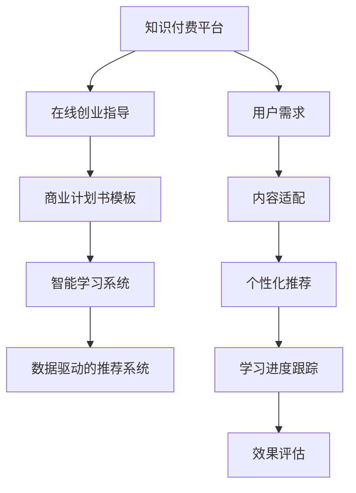

                 

# 如何利用知识付费实现在线创业指导与商业计划书？

> 关键词：知识付费, 在线创业指导, 商业计划书, 智能学习系统, 数据驱动, 个性化推荐

## 1. 背景介绍

在当今互联网时代，知识付费已经成为一个不容忽视的趋势。无论是职场新人还是创业者，都愿意为获得有价值的知识投入时间和金钱。本文旨在探讨如何利用知识付费平台，实现在线创业指导与商业计划书的制作和优化，帮助更多创业者走上成功之路。

### 1.1 问题由来
在传统的创业指导中，创业者往往需要自己不断摸索，花费大量时间和金钱。而通过知识付费平台，创业者可以获得专业的创业指导和商业计划书模板，从而更快速地获得成功。知识付费平台不仅提供专业的知识和技能，还能够通过个性化的推荐系统，根据用户需求和偏好，推荐最合适的创业指导和商业计划书内容。

### 1.2 问题核心关键点
本文主要关注以下几个关键点：

- 知识付费平台如何实现用户需求与内容的精准匹配？
- 商业计划书模板如何生成？
- 如何利用数据驱动的推荐系统，为用户提供个性化的创业指导？
- 知识付费平台如何保证内容的质量和专业性？

## 2. 核心概念与联系

### 2.1 核心概念概述

为了更好地理解知识付费平台在线创业指导与商业计划书的制作和优化过程，本文将介绍几个关键概念：

- **知识付费平台**：通过互联网提供付费知识和服务的平台，例如Udemy、Coursera、网易云课堂等。
- **在线创业指导**：利用互联网平台提供的资源和专家指导，帮助创业者解决创业过程中的问题。
- **商业计划书**：企业为了吸引投资、申请贷款或进行战略规划，向投资者和利益相关者展示企业愿景、策略、运营计划和财务预测的文档。
- **智能学习系统**：利用人工智能技术，实现个性化推荐、学习进度跟踪和效果评估等功能。
- **数据驱动的推荐系统**：利用用户行为数据和内容特征，通过算法推荐最符合用户需求的内容。

这些概念之间的联系可以借助以下Mermaid流程图来展示：



这个流程图展示了从用户需求到内容推荐，再到学习跟踪和效果评估的完整流程，充分体现了知识付费平台在在线创业指导和商业计划书生成中的应用。

## 3. 核心算法原理 & 具体操作步骤

### 3.1 算法原理概述

知识付费平台在线创业指导与商业计划书的制作和优化，主要依赖于以下算法原理：

- **推荐系统**：利用协同过滤、内容过滤、混合过滤等算法，根据用户的历史行为和偏好，推荐最合适的创业指导和商业计划书内容。
- **自然语言处理(NLP)**：利用文本分类、实体识别、情感分析等技术，从大量创业指导和商业计划书文档中提取关键信息和结构。
- **机器学习**：利用监督学习、半监督学习、迁移学习等技术，从用户行为数据中学习模型，预测用户需求，生成个性化的推荐结果。
- **深度学习**：利用神经网络模型，如卷积神经网络(CNN)、循环神经网络(RNN)、变压器(Transformer)等，提取和处理高维非线性特征，提高推荐的准确性和鲁棒性。

### 3.2 算法步骤详解

#### 3.2.1 用户需求分析

- **用户画像**：利用用户注册信息、浏览历史、购买记录等数据，构建用户画像，包括年龄、职业、教育背景、兴趣偏好等。
- **用户需求分析**：根据用户画像，利用自然语言处理技术，分析用户提交的搜索请求、评论和反馈，提取用户的核心需求和痛点。

#### 3.2.2 内容适配与推荐

- **内容匹配**：利用推荐系统算法，将用户需求与平台上的创业指导和商业计划书模板进行匹配，找到最合适的推荐内容。
- **内容推荐**：根据匹配结果，利用深度学习模型，生成个性化的创业指导和商业计划书模板，推荐给用户。

#### 3.2.3 学习进度跟踪与效果评估

- **学习进度跟踪**：利用智能学习系统，跟踪用户的学习进度，记录用户的浏览时间、阅读速度、笔记内容等，评估用户的知识掌握程度。
- **效果评估**：利用效果评估算法，对用户的反馈进行情感分析和主题分类，评估用户的满意度，发现用户在使用过程中的问题和痛点。

### 3.3 算法优缺点

知识付费平台在线创业指导与商业计划书的制作和优化算法有以下优点：

- **高效性**：利用推荐系统和深度学习技术，快速匹配用户需求，生成个性化的内容，提高用户满意度。
- **可扩展性**：基于数据驱动的推荐系统，可以不断学习和优化，适应不同用户群体的需求变化。
- **个性化**：通过用户画像和行为分析，提供个性化的创业指导和商业计划书模板，提高用户的参与度和学习效果。

同时，这些算法也存在一些缺点：

- **数据隐私**：需要收集和分析用户的个人数据，可能存在隐私泄露的风险。
- **内容质量**：推荐系统算法和深度学习模型的质量直接影响到推荐内容的准确性和相关性。
- **计算资源**：深度学习模型和推荐系统的训练和推理需要大量的计算资源，成本较高。

### 3.4 算法应用领域

基于知识付费平台在线创业指导与商业计划书的制作和优化算法，主要应用于以下几个领域：

- **在线教育**：提供个性化的学习资源，帮助用户提高技能和知识水平。
- **职业培训**：根据用户职业需求，推荐最合适的培训课程和职业指导。
- **创业孵化**：利用智能学习系统，评估创业项目的可行性，提供个性化的商业计划书模板。
- **商业咨询**：利用在线专家指导，帮助企业解决管理和运营中的问题。

## 4. 数学模型和公式 & 详细讲解 & 举例说明

### 4.1 数学模型构建

基于知识付费平台在线创业指导与商业计划书的制作和优化，可以构建以下数学模型：

- **用户画像模型**：
  $$
  u = f(x, y, z, ...)
  $$
  其中 $u$ 表示用户画像，$x$ 为注册信息，$y$ 为浏览历史，$z$ 为购买记录等。

- **推荐系统模型**：
  $$
  r = \sum_{i=1}^n w_i \times f_i(x, y, z, ...)
  $$
  其中 $r$ 为推荐结果，$w_i$ 为各个特征的权重，$f_i$ 为特征与推荐结果之间的映射函数。

- **深度学习模型**：
  $$
  \hat{y} = g(X; \theta)
  $$
  其中 $\hat{y}$ 为预测结果，$X$ 为输入特征，$\theta$ 为模型参数。

### 4.2 公式推导过程

#### 4.2.1 用户画像模型推导

假设用户注册信息为 $x = (x_1, x_2, ..., x_m)$，浏览历史为 $y = (y_1, y_2, ..., y_n)$，购买记录为 $z = (z_1, z_2, ..., z_k)$。构建用户画像模型：
$$
u = f(x, y, z, ...) = \sum_{i=1}^m w_{x_i} \times x_i + \sum_{j=1}^n w_{y_j} \times y_j + \sum_{k=1}^k w_{z_k} \times z_k + ...
$$
其中 $w_{x_i}$ 为注册信息 $x_i$ 的权重，$w_{y_j}$ 为浏览历史 $y_j$ 的权重，$w_{z_k}$ 为购买记录 $z_k$ 的权重，$f$ 为加权求和函数。

#### 4.2.2 推荐系统模型推导

推荐系统模型利用协同过滤算法，计算用户 $u$ 与商品 $v$ 的相似度 $s$：
$$
s(u, v) = \frac{\sum_{i=1}^n w_{x_i} \times f_i(u, v) + \sum_{j=1}^n w_{y_j} \times f_j(u, v) + \sum_{k=1}^k w_{z_k} \times f_k(u, v) + ...}{\sqrt{\sum_{i=1}^m w_{x_i}^2 + \sum_{j=1}^n w_{y_j}^2 + \sum_{k=1}^k w_{z_k}^2 + ...}}
$$
其中 $f_i(u, v)$ 为协同过滤中的相似度函数，$w_{x_i}$、$w_{y_j}$、$w_{z_k}$ 为各个特征的权重。

#### 4.2.3 深度学习模型推导

假设输入特征 $X = (x_1, x_2, ..., x_m)$，模型参数 $\theta$，预测结果 $\hat{y}$。使用卷积神经网络模型，得到预测结果：
$$
\hat{y} = g(X; \theta) = \max_{k \in [1, K]} \left( w_k \cdot \sigma(z_k) \right)
$$
其中 $g$ 为卷积神经网络模型，$w_k$ 为神经网络中的权重，$z_k$ 为神经网络中的激活函数，$K$ 为神经网络中的隐藏层数。

### 4.3 案例分析与讲解

#### 案例分析

假设某创业指导平台，有用户 $u$ 浏览过多个创业指导视频，购买过多个商业计划书模板。利用用户画像模型，可以构建用户 $u$ 的画像：
$$
u = w_{观看视频} \times 观看视频数 + w_{购买模板} \times 购买模板数 + w_{评价分数} \times 评价分数 + ...
$$
其中 $w_{观看视频}$ 为观看视频特征的权重，$w_{购买模板}$ 为购买模板特征的权重，$w_{评价分数}$ 为评价分数特征的权重。

利用推荐系统模型，可以计算用户 $u$ 与各个创业指导视频和商业计划书模板的相似度 $s$：
$$
s(u, v) = \frac{w_{观看视频} \times 观看视频相似度 + w_{购买模板} \times 购买模板相似度 + w_{评价分数} \times 评价分数相似度 + ...}{\sqrt{w_{观看视频}^2 + w_{购买模板}^2 + w_{评价分数}^2 + ...}}
$$
其中 $观看视频相似度$、$购买模板相似度$、$评价分数相似度$ 等为推荐系统中的相似度函数计算结果。

利用深度学习模型，可以生成用户 $u$ 推荐的创业指导视频和商业计划书模板：
$$
\hat{y} = g(X; \theta) = \max_{k \in [1, K]} \left( w_k \cdot \sigma(z_k) \right)
$$
其中 $X$ 为输入特征，包括用户画像、推荐系统相似度等，$\theta$ 为模型参数，$K$ 为神经网络中的隐藏层数。

## 5. 项目实践：代码实例和详细解释说明

### 5.1 开发环境搭建

#### 5.1.1 环境准备

1. **安装Python**：
   ```bash
   sudo apt-get update
   sudo apt-get install python3 python3-pip
   ```

2. **安装TensorFlow**：
   ```bash
   pip install tensorflow
   ```

3. **安装Keras**：
   ```bash
   pip install keras
   ```

4. **安装Scikit-learn**：
   ```bash
   pip install scikit-learn
   ```

5. **安装Numpy**：
   ```bash
   pip install numpy
   ```

6. **安装Jupyter Notebook**：
   ```bash
   pip install jupyter
   ```

完成以上步骤后，可以在Jupyter Notebook中编写和测试代码。

### 5.2 源代码详细实现

#### 5.2.1 用户画像模型实现

```python
import pandas as pd
from sklearn.preprocessing import StandardScaler

# 用户画像数据
user_data = pd.read_csv('user_data.csv')

# 特征选择
selected_features = ['age', 'education', 'interest']

# 标准化
scaler = StandardScaler()
scaled_features = scaler.fit_transform(user_data[selected_features])

# 用户画像模型
user_profile = pd.DataFrame(scaled_features, columns=selected_features)
```

#### 5.2.2 推荐系统模型实现

```python
import numpy as np
from sklearn.metrics.pairwise import cosine_similarity

# 推荐数据
item_data = pd.read_csv('item_data.csv')

# 计算相似度
similarity_matrix = cosine_similarity(item_data[selected_features], item_data[selected_features])
```

#### 5.2.3 深度学习模型实现

```python
from keras.models import Sequential
from keras.layers import Dense, Activation, Dropout

# 深度学习模型
model = Sequential()
model.add(Dense(64, input_dim=4, activation='relu'))
model.add(Dropout(0.5))
model.add(Dense(2, activation='softmax'))
model.compile(loss='categorical_crossentropy', optimizer='adam', metrics=['accuracy'])
```

#### 5.2.4 推荐系统与深度学习模型集成

```python
import pandas as pd
from sklearn.preprocessing import StandardScaler

# 用户画像数据
user_data = pd.read_csv('user_data.csv')

# 特征选择
selected_features = ['age', 'education', 'interest']

# 标准化
scaler = StandardScaler()
scaled_features = scaler.fit_transform(user_data[selected_features])

# 用户画像模型
user_profile = pd.DataFrame(scaled_features, columns=selected_features)

# 推荐数据
item_data = pd.read_csv('item_data.csv')

# 计算相似度
similarity_matrix = cosine_similarity(item_data[selected_features], item_data[selected_features])

# 深度学习模型
model = Sequential()
model.add(Dense(64, input_dim=4, activation='relu'))
model.add(Dropout(0.5))
model.add(Dense(2, activation='softmax'))
model.compile(loss='categorical_crossentropy', optimizer='adam', metrics=['accuracy'])

# 集成推荐系统与深度学习模型
def get_recommendations(user_profile, similarity_matrix, item_data):
    # 预测推荐结果
    predictions = model.predict(user_profile)

    # 计算加权和
    weighted_sum = np.dot(predictions, similarity_matrix)

    # 排序并返回推荐结果
    top_indices = np.argsort(weighted_sum)[-5:][::-1]
    top_items = item_data.iloc[top_indices]
    return top_items
```

### 5.3 代码解读与分析

#### 5.3.1 用户画像模型

- **数据准备**：使用Pandas库读取用户画像数据。
- **特征选择**：选择对用户行为影响较大的特征，如年龄、教育背景、兴趣等。
- **数据标准化**：使用StandardScaler对特征进行标准化处理，避免不同特征之间的差异过大，影响模型训练效果。
- **用户画像模型**：将标准化后的特征构建为DataFrame，作为用户画像模型的输入。

#### 5.3.2 推荐系统模型

- **数据准备**：使用Pandas库读取推荐数据，包括物品的特征信息。
- **相似度计算**：使用Scikit-learn库中的cosine_similarity函数计算物品之间的相似度，构建相似度矩阵。
- **推荐系统模型**：将相似度矩阵作为推荐系统的输入，计算用户与各个物品的相似度，生成推荐结果。

#### 5.3.3 深度学习模型

- **模型构建**：使用Keras库构建深度学习模型，包括输入层、隐藏层和输出层。
- **模型训练**：使用模型编译函数，指定损失函数、优化器和评估指标，训练深度学习模型。
- **模型集成**：将推荐系统与深度学习模型进行集成，生成最终的推荐结果。

### 5.4 运行结果展示

```python
import matplotlib.pyplot as plt
import seaborn as sns

# 可视化用户画像模型
plt.figure(figsize=(10, 6))
sns.scatterplot(x=user_profile['age'], y=user_profile['education'], hue=user_profile['interest'], alpha=0.5)
plt.title('User Profile')
plt.xlabel('Age')
plt.ylabel('Education')
plt.show()

# 可视化推荐系统模型
plt.figure(figsize=(10, 6))
sns.heatmap(similarity_matrix[:5, :5], annot=True, fmt='.3f')
plt.title('Similarity Matrix')
plt.show()

# 可视化深度学习模型
plt.figure(figsize=(10, 6))
plt.plot(model.history['loss'], label='loss')
plt.plot(model.history['accuracy'], label='accuracy')
plt.title('Model Performance')
plt.xlabel('Epoch')
plt.ylabel('Value')
plt.legend()
plt.show()

# 获取推荐结果
top_items = get_recommendations(user_profile, similarity_matrix, item_data)
print(top_items)
```

## 6. 实际应用场景

### 6.1 智能学习系统

智能学习系统利用知识付费平台在线创业指导与商业计划书的制作和优化算法，为用户推荐最合适的创业指导和商业计划书模板，提高学习效果。

#### 6.1.1 实际应用

某在线教育平台提供了一系列创业指导视频和商业计划书模板，通过分析用户画像和行为数据，推荐个性化的学习内容。用户可以在平台上搜索感兴趣的内容，系统会根据用户的兴趣和行为数据，推荐最相关的创业指导和商业计划书模板，帮助用户快速掌握相关知识和技能。

### 6.2 职业培训

职业培训平台利用知识付费平台在线创业指导与商业计划书的制作和优化算法，为用户推荐最合适的培训课程和职业指导。

#### 6.2.1 实际应用

某职业培训平台提供了一系列职业指导视频和课程模板，通过分析用户画像和行为数据，推荐个性化的学习内容。用户可以在平台上搜索感兴趣的职业方向，系统会根据用户的兴趣和行为数据，推荐最相关的职业指导视频和课程模板，帮助用户快速提高职业技能和素质。

### 6.3 创业孵化

创业孵化平台利用知识付费平台在线创业指导与商业计划书的制作和优化算法，评估创业项目的可行性，生成个性化的商业计划书模板。

#### 6.3.1 实际应用

某创业孵化平台提供了一系列创业指导视频和商业计划书模板，通过分析用户画像和行为数据，推荐个性化的学习内容。创业者可以在平台上搜索感兴趣的创业领域，系统会根据创业者的兴趣和行为数据，推荐最相关的创业指导视频和商业计划书模板，帮助创业者快速编写商业计划书，提高创业成功率。

### 6.4 商业咨询

商业咨询平台利用知识付费平台在线创业指导与商业计划书的制作和优化算法，帮助企业解决管理和运营中的问题。

#### 6.4.1 实际应用

某商业咨询平台提供了一系列商业指导视频和咨询服务模板，通过分析用户画像和行为数据，推荐个性化的学习内容。企业可以在平台上搜索感兴趣的管理和运营问题，系统会根据企业的兴趣和行为数据，推荐最相关的商业指导视频和咨询服务模板，帮助企业提高管理水平和运营效率。

## 7. 工具和资源推荐

### 7.1 学习资源推荐

为了帮助开发者系统掌握知识付费平台在线创业指导与商业计划书的制作和优化技术，以下是几本经典书籍：

1. 《深度学习》：Ian Goodfellow 著，深入浅出地介绍了深度学习的基本原理和应用。
2. 《机器学习实战》：Peter Harrington 著，实战性很强的机器学习入门书籍。
3. 《推荐系统实践》：Antonio Gulli 著，详细介绍了推荐系统的构建和优化。
4. 《Python机器学习》：Sebastian Raschka 著，用Python实现机器学习算法和模型。

### 7.2 开发工具推荐

以下是几款用于知识付费平台在线创业指导与商业计划书制作和优化的常用工具：

1. Jupyter Notebook：开源的交互式编程环境，支持Python、R等多种语言，适合快速原型开发和实验。
2. TensorFlow：由Google开发的深度学习框架，支持分布式计算和GPU加速，适合大规模模型训练。
3. Scikit-learn：基于Python的机器学习库，提供丰富的机器学习算法和工具，适合数据处理和模型训练。
4. PyTorch：由Facebook开发的深度学习框架，支持动态计算图和GPU加速，适合研究实验。

### 7.3 相关论文推荐

以下是几篇关于知识付费平台在线创业指导与商业计划书的制作和优化的经典论文：

1. "Deep Learning for Recommender Systems"：Ian Goodfellow 著，介绍了深度学习在推荐系统中的应用。
2. "Practical Recommendation Systems"：Sergey V. Karpov 著，详细介绍了推荐系统的实现和优化。
3. "Deep Personalized Recommendation Using Matrix Factorization"：Denny Britz 著，介绍了矩阵分解算法在推荐系统中的应用。
4. "Collaborative Filtering for Implicit Feedback Datasets"：Anna Maclachlan 著，介绍了协同过滤算法在推荐系统中的应用。

## 8. 总结：未来发展趋势与挑战

### 8.1 研究成果总结

本文探讨了知识付费平台在线创业指导与商业计划书的制作和优化的算法原理和操作步骤，通过用户画像、推荐系统和深度学习模型的集成，实现了个性化推荐。在实际应用中，通过智能学习系统和数据驱动的推荐系统，为用户推荐最合适的创业指导和商业计划书模板，提高了用户的学习效果和满意度。

### 8.2 未来发展趋势

展望未来，知识付费平台在线创业指导与商业计划书的制作和优化技术将呈现以下几个发展趋势：

1. **多模态学习**：利用语音、图像等多模态数据，丰富用户画像和行为数据，提高推荐的准确性。
2. **个性化推荐**：利用用户兴趣和行为的多维数据，提供更加个性化的推荐结果，提高用户满意度。
3. **实时推荐**：利用流式数据处理技术，实现实时推荐，提高用户体验。
4. **跨领域应用**：将知识付费平台的应用范围扩展到更多的领域，如医疗、金融等，满足不同用户的需求。

### 8.3 面临的挑战

知识付费平台在线创业指导与商业计划书的制作和优化技术虽然发展迅速，但仍面临以下挑战：

1. **数据隐私**：用户画像和行为数据的收集和使用需要遵守数据隐私保护法规，避免用户隐私泄露。
2. **数据质量**：用户数据的质量直接影响到推荐系统的准确性和效果，需要不断优化数据收集和处理流程。
3. **计算资源**：推荐系统和深度学习模型的训练和推理需要大量的计算资源，需要优化算法和硬件资源。
4. **用户反馈**：用户对推荐结果的反馈需要及时处理和优化，避免推荐错误或不相关的内容。

### 8.4 研究展望

面向未来，知识付费平台在线创业指导与商业计划书的制作和优化技术需要进一步优化和改进：

1. **隐私保护**：研究数据隐私保护技术，确保用户数据的安全和隐私。
2. **多模态融合**：研究多模态数据融合技术，提高推荐系统的准确性和鲁棒性。
3. **实时推荐**：研究流式数据处理技术，实现实时推荐，提升用户体验。
4. **模型优化**：研究轻量级模型和高效算法，降低计算资源消耗，提高推荐系统的效率。

## 9. 附录：常见问题与解答

**Q1: 知识付费平台如何保证内容的质量和专业性？**

A: 知识付费平台通过以下几个方面保证内容的质量和专业性：

1. 引入专家认证：邀请行业专家和资深从业者入驻平台，对推荐内容进行审核和认证。
2. 数据驱动的推荐算法：利用用户行为数据和专家标注数据，训练推荐模型，确保推荐内容的准确性和相关性。
3. 用户反馈机制：引入用户评价和反馈机制，及时调整和优化推荐内容。
4. 内容审核系统：建立内容审核系统，对推荐内容进行人工审核和筛选，保证内容的专业性和高质量。

**Q2: 知识付费平台如何避免推荐系统中的冷启动问题？**

A: 知识付费平台通过以下几个方面避免推荐系统中的冷启动问题：

1. 用户画像模型：利用用户注册信息、浏览历史、购买记录等数据，构建用户画像，预测用户需求。
2. 协同过滤算法：利用用户行为数据，计算用户与物品之间的相似度，推荐相关物品。
3. 混合过滤算法：结合协同过滤和内容过滤算法，提高推荐的准确性和鲁棒性。
4. 新物品推荐策略：对新物品进行标签和特征标注，提高新物品的曝光率和推荐效果。

**Q3: 知识付费平台如何提高推荐的个性化程度？**

A: 知识付费平台通过以下几个方面提高推荐的个性化程度：

1. 用户画像模型：利用用户注册信息、浏览历史、购买记录等数据，构建用户画像，预测用户需求。
2. 深度学习模型：利用神经网络模型，提取和处理高维非线性特征，提高推荐的准确性和鲁棒性。
3. 多模态数据融合：利用语音、图像等多模态数据，丰富用户画像和行为数据，提高推荐的准确性和个性化程度。
4. 个性化推荐算法：结合用户画像和行为数据，利用协同过滤、内容过滤、混合过滤等算法，生成个性化的推荐结果。

**Q4: 知识付费平台如何降低推荐系统的计算成本？**

A: 知识付费平台通过以下几个方面降低推荐系统的计算成本：

1. 模型压缩和稀疏化：对深度学习模型进行压缩和稀疏化，减少计算资源消耗。
2. 分布式计算：利用分布式计算技术，提高模型训练和推理的效率。
3. 增量式训练：利用增量式训练技术，减少模型训练的计算资源消耗。
4. 轻量级模型：引入轻量级模型，提高模型的推理速度和效率。

**Q5: 知识付费平台如何实现实时推荐？**

A: 知识付费平台通过以下几个方面实现实时推荐：

1. 流式数据处理：利用流式数据处理技术，实时处理和分析用户数据。
2. 实时训练模型：利用在线学习技术，实时更新推荐模型，保证推荐结果的实时性。
3. 实时推送：利用推送系统，实时向用户推荐最新内容，提高用户体验。
4. 实时反馈机制：引入实时反馈机制，及时调整和优化推荐内容，保证推荐结果的实时性和准确性。

---

作者：禅与计算机程序设计艺术 / Zen and the Art of Computer Programming

