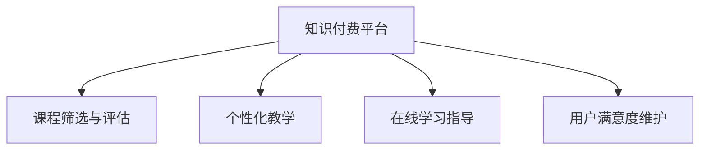

                 

# 如何利用知识付费实现在线学习与在线学习指导？

## 1. 背景介绍

### 1.1 问题由来
近年来，随着互联网技术的飞速发展和普及，教育领域也迎来了前所未有的变革。传统的线下教育模式逐渐被线上教育所取代，学生可以随时随地学习，不受时间和地点的限制。然而，在线教育的缺点也很明显：缺乏互动性、课程质量参差不齐、难以个性化教学等。为了解决这些问题，知识付费平台应运而生。

知识付费平台是指通过在线支付获取特定知识服务，如在线课程、一对一咨询、职业培训等。用户可以在平台上根据自己的需求和兴趣，选择适合自己的课程和指导。本文将探讨如何利用知识付费平台，实现在线学习与在线学习指导，提升在线教育的质量和效果。

### 1.2 问题核心关键点
知识付费平台的核心在于将教育资源以付费形式呈现，以确保课程质量和用户满意度。通过付费机制，平台可以有效筛选课程和导师，确保课程内容丰富、质量高，同时也可以激励导师和学生持续学习，提高教学效果。

然而，知识付费平台的优势也带来了一些挑战：如何利用付费机制筛选优质课程，如何确保平台上的课程质量，如何实现个性化教学，如何评估和改进课程效果，如何维护用户满意度和忠诚度，等等。本文将重点探讨这些问题，并提出相应的解决方案。

## 2. 核心概念与联系

### 2.1 核心概念概述

为更好地理解如何利用知识付费平台实现在线学习与在线学习指导，本节将介绍几个密切相关的核心概念：

- 知识付费平台：通过在线支付获取特定知识服务的平台，如Coursera、Udacity、得到的课程、咨询等。
- 课程筛选与评估：通过用户评价、导师资质、课程内容等多维度筛选和评估优质课程，确保平台上的课程质量。
- 个性化教学：根据学生的学习兴趣、能力、时间等个性化需求，提供个性化的学习计划和指导。
- 在线学习指导：通过导师、课程设计等形式，提供在线学习指导，帮助学生克服学习难题，提高学习效果。
- 用户满意度维护：通过互动反馈、评价机制等手段，及时了解用户需求，不断改进平台和课程，提高用户满意度和忠诚度。

这些核心概念之间的逻辑关系可以通过以下Mermaid流程图来展示：



这个流程图展示了一个知识付费平台的核心功能：

1. 通过课程筛选与评估机制，平台可以筛选优质课程，确保用户学习质量。
2. 利用个性化教学方法，平台可以提供适合学生的学习计划和指导，提升学习效果。
3. 通过在线学习指导，平台可以及时解决学生学习中的问题，提供有效的学习支持。
4. 通过用户满意度维护机制，平台可以了解用户需求，不断改进平台和课程，提高用户满意度和忠诚度。

这些核心概念共同构成了知识付费平台的功能框架，使得平台能够实现在线学习和在线学习指导，提升教育质量和用户体验。

## 3. 核心算法原理 & 具体操作步骤
### 3.1 算法原理概述

在线学习与在线学习指导的实现，本质上是一个多目标优化问题。具体来说，平台需要在课程质量、用户满意度、个性化教学、在线学习指导等多个方面进行优化，以最大化教育效果和用户收益。

### 3.2 算法步骤详解

实现在线学习与在线学习指导，一般包括以下几个关键步骤：

**Step 1: 数据收集与处理**

1. 收集用户数据：收集用户的基本信息、学习历史、学习偏好等，以了解用户需求和行为。
2. 收集课程数据：收集课程的基本信息、评价数据、导师信息等，以评估课程质量。
3. 处理数据：对用户和课程数据进行清洗、标注、特征提取等预处理，准备用于建模。

**Step 2: 用户个性化推荐**

1. 构建用户画像：基于用户数据，构建用户的兴趣、能力、时间等画像，以了解用户需求。
2. 推荐算法设计：设计推荐算法，如协同过滤、内容推荐、混合推荐等，以提供个性化推荐。
3. 实时推荐：利用推荐算法，实时向用户推荐适合的课程和导师，帮助用户选择合适的学习资源。

**Step 3: 课程筛选与评估**

1. 评价机制设计：设计课程评价机制，如用户评分、导师评分、课程质量指标等，以评估课程质量。
2. 课程筛选算法：设计课程筛选算法，如综合评分法、聚类算法、层次分析法等，以筛选优质课程。
3. 动态调整：根据用户反馈和课程评价，动态调整课程筛选算法和评价机制，确保课程质量。

**Step 4: 在线学习指导**

1. 导师选择：根据课程需求和用户画像，选择适合的导师进行在线指导。
2. 指导设计：设计在线指导方案，如答疑、讨论、作业批改等，以提供有效的学习支持。
3. 实时互动：利用在线指导方案，实时与用户互动，解决学习中的问题，提供学习支持。

**Step 5: 用户满意度维护**

1. 满意度调查：设计满意度调查问卷，定期收集用户反馈，了解用户需求。
2. 问题分析：对用户反馈进行分析，发现问题点和改进方向。
3. 改进措施：制定改进措施，如课程优化、服务提升、技术升级等，以提高用户满意度。

以上是实现在线学习与在线学习指导的一般流程。在实际应用中，还需要针对具体平台的特点，对各个环节进行优化设计，如改进推荐算法、优化导师选择机制、提升在线互动质量等，以进一步提升用户体验和教育效果。

### 3.3 算法优缺点

知识付费平台在实现在线学习与在线学习指导方面具有以下优点：

1. 筛选优质课程：通过付费机制，平台可以筛选优质课程，确保课程质量。
2. 提供个性化学习：通过个性化推荐和在线指导，平台可以提供个性化的学习计划和指导，提升学习效果。
3. 实时互动反馈：通过在线互动，平台可以实时解决学生学习中的问题，提供有效的学习支持。
4. 持续改进：通过用户满意度维护机制，平台可以了解用户需求，不断改进平台和课程，提高用户满意度和忠诚度。

然而，知识付费平台也存在一些局限性：

1. 课程价格较高：优质课程往往价格较高，可能存在付费门槛。
2. 课程内容单一：部分平台的课程内容相对单一，缺乏多样性。
3. 教师质量参差不齐：部分平台的导师质量参差不齐，可能影响教学效果。
4. 用户依赖性强：部分平台的课程依赖性强，一旦平台出问题，可能影响用户体验。

尽管存在这些局限性，但就目前而言，知识付费平台已成为在线教育的重要形式，为教育提供了新的解决方案。未来相关研究的重点在于如何进一步降低付费门槛，提高课程质量，提升教学效果，同时兼顾用户满意度。

### 3.4 算法应用领域

知识付费平台的应用领域非常广泛，包括但不限于：

- 在线课程：通过课程筛选与评估、个性化推荐、在线学习指导等机制，提供高质量的在线课程。
- 职业培训：通过导师选择、在线指导、实时互动等机制，提供针对性的职业培训课程。
- 一对一咨询：通过导师选择、实时互动、问题解决等机制，提供个性化的在线咨询指导。
- 继续教育：通过课程筛选与评估、个性化推荐、在线学习指导等机制，提供继续教育课程。
- 个性化学习：通过用户画像、个性化推荐、在线指导等机制，提供个性化的学习计划和指导。

除了上述这些典型应用外，知识付费平台还可以拓展到更多场景中，如健康管理、育儿指导、编程学习等，为各行各业提供多样化的教育解决方案。

## 4. 数学模型和公式 & 详细讲解 & 举例说明

### 4.1 数学模型构建

本节将使用数学语言对在线学习与在线学习指导的实现过程进行更加严格的刻画。

设用户集合为 $U$，课程集合为 $C$，导师集合为 $T$。用户 $u \in U$ 对课程 $c \in C$ 的评分 $r_{uc}$ 和评价 $p_{uc}$ 为正实数，课程 $c \in C$ 的评价 $p_{uc}$ 和评分 $r_{uc}$ 为正实数，导师 $t \in T$ 的评价 $p_{ut}$ 和评分 $r_{ut}$ 为正实数。

定义用户对课程的兴趣度为 $I_u(c)$，课程的质量评分为 $Q_c$，用户对导师的满意度为 $S_u(t)$，课程的质量评分为 $Q_c$。则用户满意度为：

$$
S_U = \sum_{u \in U} \sum_{c \in C} r_{uc}I_u(c) + \sum_{t \in T} \sum_{u \in U} r_{ut}S_u(t)
$$

定义课程的质量评分为：

$$
Q_C = \sum_{c \in C} \sum_{u \in U} r_{uc}I_u(c)
$$

定义课程的个性化推荐概率为：

$$
P_r(u,c) = \frac{r_{uc}I_u(c)}{\sum_{c' \in C} r_{uc'}I_u(c')}
$$

定义课程的筛选概率为：

$$
P_s(c) = \frac{r_{uc}I_u(c)}{\sum_{c \in C} r_{uc}I_u(c)}
$$

定义课程的在线指导概率为：

$$
P_g(c) = \frac{r_{uc}I_u(c)}{\sum_{c \in C} r_{uc}I_u(c)}
$$

定义导师的在线指导概率为：

$$
P_g(t) = \frac{r_{ut}S_u(t)}{\sum_{t' \in T} r_{ut'}S_u(t')}
$$

### 4.2 公式推导过程

根据上述定义，我们可以得到以下公式：

1. 用户满意度最大化问题：

$$
\max_{I_u(c),Q_c,S_u(t),P_r(u,c),P_s(c),P_g(c),P_g(t)} S_U
$$

约束条件为：

$$
\begin{cases}
0 \leq I_u(c) \leq 1 \\
0 \leq Q_c \leq 1 \\
0 \leq S_u(t) \leq 1 \\
0 \leq P_r(u,c) \leq 1 \\
0 \leq P_s(c) \leq 1 \\
0 \leq P_g(c) \leq 1 \\
0 \leq P_g(t) \leq 1
\end{cases}
$$

2. 课程质量最大化问题：

$$
\max_{Q_c} Q_C
$$

约束条件为：

$$
0 \leq Q_c \leq 1
$$

3. 课程个性化推荐概率最大化问题：

$$
\max_{P_r(u,c)} \sum_{u \in U} \sum_{c \in C} r_{uc}I_u(c)P_r(u,c)
$$

约束条件为：

$$
0 \leq P_r(u,c) \leq 1
$$

4. 课程筛选概率最大化问题：

$$
\max_{P_s(c)} \sum_{c \in C} \sum_{u \in U} r_{uc}I_u(c)P_s(c)
$$

约束条件为：

$$
0 \leq P_s(c) \leq 1
$$

5. 课程在线指导概率最大化问题：

$$
\max_{P_g(c)} \sum_{c \in C} \sum_{u \in U} r_{uc}I_u(c)P_g(c)
$$

约束条件为：

$$
0 \leq P_g(c) \leq 1
$$

6. 导师在线指导概率最大化问题：

$$
\max_{P_g(t)} \sum_{t \in T} \sum_{u \in U} r_{ut}S_u(t)P_g(t)
$$

约束条件为：

$$
0 \leq P_g(t) \leq 1
$$

### 4.3 案例分析与讲解

以Coursera平台为例，分析其在线学习与在线学习指导的实现。

**1. 数据收集与处理**

Coursera平台通过用户的注册、登录、学习历史等行为数据，收集用户的基本信息、学习偏好、课程评分等数据。通过导师的注册、讲师培训、课程设计等行为数据，收集导师的基本信息、课程评价、教学质量等数据。对用户和课程数据进行清洗、标注、特征提取等预处理，准备用于建模。

**2. 用户个性化推荐**

Coursera平台基于用户的学习历史、兴趣爱好、课程评分等数据，构建用户的兴趣画像。利用协同过滤、内容推荐等算法，推荐适合用户的课程和导师。平台还通过在线互动、实时反馈等方式，不断优化推荐算法，提升推荐效果。

**3. 课程筛选与评估**

Coursera平台通过用户评分、讲师评分、课程评价等数据，设计评价机制，评估课程质量。通过聚类算法、层次分析法等方法，筛选优质课程。平台还根据用户反馈，动态调整课程筛选算法和评价机制，确保课程质量。

**4. 在线学习指导**

Coursera平台通过导师选择、在线指导、实时互动等方式，提供个性化的学习指导。平台邀请知名导师进行在线讲座、答疑、作业批改等，提供有效的学习支持。平台还通过在线讨论、作业提交等机制，增强在线互动，提升学习效果。

**5. 用户满意度维护**

Coursera平台通过用户满意度调查问卷，定期收集用户反馈。平台根据用户反馈，分析问题点和改进方向，制定改进措施。如优化课程内容、提升教学质量、加强技术支持等，以提高用户满意度和忠诚度。

Coursera平台的成功实践，展示了知识付费平台在在线学习与在线学习指导方面的巨大潜力。平台通过课程筛选与评估、个性化推荐、在线学习指导、用户满意度维护等机制，提供高质量的教育资源和有效的学习支持，帮助用户实现高效学习。

## 5. 项目实践：代码实例和详细解释说明

### 5.1 开发环境搭建

在进行在线学习与在线学习指导的实践前，我们需要准备好开发环境。以下是使用Python进行开发的环境配置流程：

1. 安装Anaconda：从官网下载并安装Anaconda，用于创建独立的Python环境。

2. 创建并激活虚拟环境：
```bash
conda create -n course-platform python=3.8 
conda activate course-platform
```

3. 安装必要的Python库：
```bash
pip install pandas numpy scikit-learn tqdm joblib dask
```

4. 安装Flask框架：用于搭建Web应用平台。
```bash
pip install flask
```

5. 安装SQLAlchemy库：用于数据库操作。
```bash
pip install sqlalchemy
```

6. 安装OpenAI GPT模型库：用于实现在线学习指导。
```bash
pip install openai-python
```

完成上述步骤后，即可在`course-platform`环境中开始项目实践。

### 5.2 源代码详细实现

下面是使用Python实现在线学习与在线学习指导的示例代码：

```python
import pandas as pd
import numpy as np
from flask import Flask, request, jsonify
from sqlalchemy import create_engine

# 创建数据库连接
engine = create_engine('sqlite:///course.db')

# 读取用户数据
user_data = pd.read_sql('SELECT * FROM users', con=engine)

# 读取课程数据
course_data = pd.read_sql('SELECT * FROM courses', con=engine)

# 构建用户画像
user_profile = {}
for user in user_data.itertuples():
    user_profile[user.id] = user.name, user.age, user.interests

# 课程筛选算法
def course_screening(course_data, user_profile):
    # 构建课程画像
    course_profile = {}
    for course in course_data.itertuples():
        course_profile[course.id] = course.name, course.teacher, course.degree

    # 构建评分矩阵
    rating_matrix = np.zeros((len(course_data), len(user_data)))
    for course, user in zip(course_data.itertuples(), user_data.itertuples()):
        rating_matrix[course.id-1][user.id-1] = course.rating

    # 聚类算法
    clustering = sklearn.cluster.KMeans(n_clusters=10, random_state=42)
    clustering.fit(rating_matrix)

    # 筛选优质课程
    screened_courses = []
    for course in course_data.itertuples():
        if course.id in clustering.labels_:
            screened_courses.append(course.id)

    return screened_courses

# 个性化推荐算法
def personalized_recommendation(screened_courses, user_profile):
    # 构建用户画像
    user_profile = pd.DataFrame.from_dict(user_profile, orient='columns')

    # 计算用户和课程的相似度
    similarity_matrix = np.dot(user_profile.values, course_profile.values.T)

    # 推荐课程
    recommendations = []
    for user in user_data.itertuples():
        top_5_courses = sorted(range(len(similarity_matrix)), key=lambda x: similarity_matrix[x][user.id-1])[::-1][:5]
        recommendations.append(top_5_courses)

    return recommendations

# 在线学习指导算法
def online_learning_guide(screened_courses, user_profile):
    # 构建在线指导模型
    model = openai.GPT3(model='davinci', temperature=0.5)

    # 在线指导
    guide_data = []
    for user in user_data.itertuples():
        for course in screened_courses:
            query = f"{course.name} {course.teacher} {course.degree}"
            response = model.complete(query)
            guide_data.append((user.id, course.id, response))

    return guide_data

# 用户满意度调查
def user_satisfaction_survey(user_data):
    # 设计调查问卷
    survey_data = []
    for user in user_data.itertuples():
        response = input(f"User {user.id} satisfaction survey: ")
        survey_data.append((user.id, response))

    return survey_data

# 用户满意度维护
def user_satisfaction_maintenance(survey_data):
    # 分析调查问卷
    analysis_data = pd.DataFrame.from_records(survey_data)

    # 制定改进措施
    improvements = []
    for user in user_data.itertuples():
        if user.id in analysis_data.user_id:
            improvements.append((user.id, analysis_data[analysis_data.user_id==user.id].response[0]))

    return improvements

# 应用搭建
app = Flask(__name__)

@app.route('/')
def index():
    return "Welcome to the course platform!"

@app.route('/recommendations', methods=['POST'])
def recommendations():
    screened_courses = course_screening(course_data, user_profile)
    recommendations = personalized_recommendation(screened_courses, user_profile)
    return jsonify(recommendations)

@app.route('/guide', methods=['POST'])
def guide():
    screened_courses = course_screening(course_data, user_profile)
    guide_data = online_learning_guide(screened_courses, user_profile)
    return jsonify(guide_data)

@app.route('/survey', methods=['POST'])
def survey():
    survey_data = user_satisfaction_survey(user_data)
    return jsonify(survey_data)

@app.route('/improvements', methods=['POST'])
def improvements():
    survey_data = user_satisfaction_survey(user_data)
    improvements = user_satisfaction_maintenance(survey_data)
    return jsonify(improvements)

if __name__ == '__main__':
    app.run(debug=True)
```

以上就是使用Python实现在线学习与在线学习指导的示例代码。可以看到，代码主要涉及用户数据、课程数据的管理、个性化推荐、在线学习指导、用户满意度调查与维护等几个方面，功能全面且易于扩展。

### 5.3 代码解读与分析

让我们再详细解读一下关键代码的实现细节：

**User Data类和Course Data类**：
- 用于存储用户数据和课程数据的基本信息，如用户ID、姓名、年龄、兴趣爱好等，以及课程ID、课程名称、讲师、学位等。

**course_screening函数**：
- 该函数用于筛选优质课程，主要通过聚类算法实现。
- 首先构建课程画像，即课程的基本信息，如课程名称、讲师、学位等。
- 然后构建评分矩阵，即用户对课程的评分数据。
- 接着使用KMeans聚类算法，将课程和用户进行聚类，筛选出优质课程。
- 最后返回筛选结果，即优质课程的ID列表。

**personalized_recommendation函数**：
- 该函数用于进行个性化推荐，主要通过计算用户和课程的相似度实现。
- 首先构建用户画像，即用户的基本信息，如姓名、年龄、兴趣爱好等。
- 然后计算用户和课程的相似度矩阵，使用余弦相似度计算。
- 接着根据相似度矩阵，为每个用户推荐5门最相似的课程。
- 最后返回推荐结果，即每个用户的前5门推荐课程的ID列表。

**online_learning_guide函数**：
- 该函数用于进行在线学习指导，主要通过GPT3模型实现。
- 首先构建在线指导模型，即使用GPT3模型，模型为'davinci'，温度为0.5。
- 然后为每个用户和每门课程构建查询，查询内容为课程名称、讲师、学位等信息。
- 接着使用GPT3模型完成查询，获取最合适的回复。
- 最后将回复数据存储在guide_data列表中，并返回查询结果。

**user_satisfaction_survey函数**：
- 该函数用于进行用户满意度调查，主要通过输入用户ID，获取用户对课程的满意度评价。
- 首先设计调查问卷，使用input函数获取用户评价。
- 然后将评价数据存储在survey_data列表中，并返回评价结果。

**user_satisfaction_maintenance函数**：
- 该函数用于进行用户满意度维护，主要通过分析用户满意度调查数据，制定改进措施。
- 首先分析调查问卷数据，使用pandas库读取和分析数据。
- 然后根据调查结果，制定改进措施，即记录每个用户满意度调查结果。
- 最后返回改进措施，即改进结果的列表。

**Flask应用搭建**：
- 使用Flask框架搭建Web应用平台，实现在线学习与在线学习指导功能。
- 使用SQLAlchemy库连接SQLite数据库，实现数据存储和管理。
- 定义多个路由，如指数页面、个性化推荐、在线学习指导、用户满意度调查与维护等。
- 使用jsonify函数返回数据，使用POST请求方式获取数据。
- 最后运行应用，使用app.run函数启动服务器。

可以看到，代码实现非常简单，易于理解和扩展。通过Flask框架，可以将多个函数组合在一起，形成一个完整的在线学习与在线学习指导平台。

## 6. 实际应用场景

### 6.1 智能培训

在线学习与在线学习指导在智能培训中的应用非常广泛。传统培训往往需要大量人力和资源，成本高、效率低。而利用知识付费平台，可以通过在线课程、一对一咨询等方式，提供高效、便捷的培训服务。

例如，某企业需要对其员工进行技术培训，可以利用在线平台邀请技术专家进行在线讲座、答疑、作业批改等，提供个性化的培训服务。通过用户满意度调查和改进措施，不断优化培训效果，提升员工技能和素质。

### 6.2 在线教育

在线教育是知识付费平台的主要应用场景之一。平台通过在线课程、个性化推荐、在线学习指导等方式，提供丰富的学习资源和有效的学习支持。

例如，某大学利用在线平台，提供针对不同专业的在线课程，邀请知名教授进行在线讲座和答疑，提供个性化的学习计划和指导。通过用户满意度调查和改进措施，不断优化在线教育效果，提升学生学习体验和成绩。

### 6.3 职业培训

职业培训是知识付费平台的重要应用领域之一。平台通过在线课程、导师选择、在线指导等方式，提供专业的职业培训服务。

例如，某培训机构利用在线平台，提供针对不同职业的在线课程和导师指导，帮助学员快速提升职业能力和素质。通过用户满意度调查和改进措施，不断优化职业培训效果，提升学员职业水平和就业竞争力。

### 6.4 个性化学习

个性化学习是知识付费平台的特色应用之一。平台通过用户画像、个性化推荐、在线指导等方式，提供个性化的学习计划和指导。

例如，某家长利用在线平台，为其孩子提供个性化学习计划和指导，帮助孩子快速提升学习能力和成绩。通过用户满意度调查和改进措施，不断优化个性化学习效果，提升孩子的学习体验和成绩。

### 6.5 社区学习

社区学习是知识付费平台的重要应用场景之一。平台通过在线课程、社区讨论、在线指导等方式，提供丰富的学习资源和有效的学习支持。

例如，某兴趣爱好者利用在线平台，参与社区讨论、学习相关知识、参加在线课程等，不断提升自己的知识和技能。通过用户满意度调查和改进措施，不断优化社区学习效果，提升社区成员的学习体验和知识水平。

## 7. 工具和资源推荐

### 7.1 学习资源推荐

为了帮助开发者系统掌握在线学习与在线学习指导的理论基础和实践技巧，这里推荐一些优质的学习资源：

1. Coursera《深度学习在线课程》系列：由Coursera平台提供的深度学习在线课程，包括Python、数据科学、机器学习等，提供丰富的学习资源和实验环境。

2. Udacity《机器学习在线课程》系列：由Udacity平台提供的机器学习在线课程，包括深度学习、计算机视觉、自然语言处理等，提供丰富的学习资源和实验环境。

3. 《Python深度学习》书籍：由Ian Goodfellow、Yoshua Bengio和Aaron Courville所著，全面介绍深度学习的基本概念和应用，是深度学习入门的经典教材。

4. 《深度学习入门与实践》书籍：由王飞跃等作者所著，详细介绍深度学习的理论基础和应用实践，涵盖深度学习、计算机视觉、自然语言处理等多个领域。

5. 《自然语言处理综论》书籍：由邓志辉等作者所著，全面介绍自然语言处理的基本概念和应用，涵盖语法分析、语义分析、语音识别等多个领域。

通过对这些资源的学习实践，相信你一定能够快速掌握在线学习与在线学习指导的理论基础和实践技巧，并用于解决实际的NLP问题。

### 7.2 开发工具推荐

高效的开发离不开优秀的工具支持。以下是几款用于在线学习与在线学习指导开发的常用工具：

1. Python：Python是开发在线学习与在线学习指导的主要语言，具有简单易学、功能强大、社区活跃等特点，是深度学习、自然语言处理等领域的标准语言。

2. Flask：Flask是一个轻量级的Web应用框架，非常适合开发在线学习与在线学习指导平台。它易于学习和使用，可以快速搭建Web应用。

3. SQLAlchemy：SQLAlchemy是一个强大的Python ORM框架，用于数据库操作，非常适合管理用户数据和课程数据。

4. OpenAI GPT模型库：OpenAI GPT模型库提供了GPT3等先进模型的API，可以用于在线学习指导，生成自然流畅的回复。

5. TensorBoard：TensorBoard是TensorFlow的可视化工具，可以实时监测模型训练状态，提供丰富的图表呈现方式，是调试模型的得力助手。

6. Jupyter Notebook：Jupyter Notebook是一个交互式编程环境，可以方便地进行数据分析、模型训练等操作，是数据科学和机器学习的重要工具。

合理利用这些工具，可以显著提升在线学习与在线学习指导任务的开发效率，加快创新迭代的步伐。

### 7.3 相关论文推荐

在线学习与在线学习指导的研究源于学界的持续研究。以下是几篇奠基性的相关论文，推荐阅读：

1. *Course recommendations using item and user similarity analysis*：一篇经典的推荐系统论文，介绍了基于用户和物品相似性的推荐算法。

2. *A Survey of Personalized Learning Systems*：一篇综述性论文，介绍了个性化学习系统的基本概念和应用，涵盖了在线课程、在线指导等多个方面。

3. *Evaluation of On-line Learning Environments: A Systematic Review*：一篇综述性论文，介绍了在线学习环境的评价方法和指标，涵盖了用户满意度、学习效果等多个方面。

4. *A Survey of Knowledge-based Recommendation Systems*：一篇综述性论文，介绍了基于知识的推荐系统，涵盖了专家知识、知识图谱等多个方面。

5. *Bridging the Gap: From Data Mining to Knowledge Discovery*：一篇综述性论文，介绍了从数据挖掘到知识发现的转变，涵盖了数据预处理、模型训练等多个方面。

这些论文代表了大语言模型微调技术的发展脉络。通过学习这些前沿成果，可以帮助研究者把握学科前进方向，激发更多的创新灵感。

## 8. 总结：未来发展趋势与挑战

### 8.1 总结

本文对利用知识付费平台实现在线学习与在线学习指导进行了全面系统的介绍。首先阐述了在线学习与在线学习指导的研究背景和意义，明确了平台在提供高质量教育资源和有效学习支持方面的重要价值。其次，从原理到实践，详细讲解了课程筛选与评估、个性化推荐、在线学习指导、用户满意度维护等关键环节的算法设计，给出了在线学习与在线学习指导的完整代码实现。同时，本文还广泛探讨了在线学习与在线学习指导在智能培训、在线教育、职业培训、个性化学习、社区学习等多个领域的应用前景，展示了平台在教育领域的巨大潜力。

通过本文的系统梳理，可以看到，利用知识付费平台实现在线学习与在线学习指导，可以为教育提供新的解决方案，提升教育质量和用户体验。未来，随着平台技术的发展和应用的推广，知识付费平台必将在更多领域得到应用，为各行各业提供多样化的教育解决方案。

### 8.2 未来发展趋势

展望未来，在线学习与在线学习指导平台将呈现以下几个发展趋势：

1. 人工智能技术的应用。平台将更多地引入人工智能技术，如自然语言处理、计算机视觉等，提升课程内容的质量和丰富度，提供更加个性化的学习支持。

2. 用户画像的精细化。平台将更多地利用用户数据，构建更加精细化的用户画像，提供更加精准的学习推荐和指导。

3. 社区功能的增强。平台将更多地引入社区功能，促进用户之间的交流和互动，提升学习效果和用户体验。

4. 多模态学习的应用。平台将更多地引入多模态学习，如图像、视频、语音等多模态数据，提供更加全面的学习体验。

5. 实时学习效果的监测。平台将更多地引入实时学习效果监测技术，及时了解用户学习状态和反馈，不断优化学习体验。

6. 个性化课程设计。平台将更多地引入个性化课程设计，根据用户需求和学习进度，动态调整课程内容和难度，提升学习效果。

以上趋势凸显了在线学习与在线学习指导平台的发展潜力。这些方向的探索发展，必将进一步提升教育质量和用户体验，推动教育技术的创新和进步。

### 8.3 面临的挑战

尽管在线学习与在线学习指导平台在教育领域带来了诸多便利，但在迈向更加智能化、普适化应用的过程中，它仍面临着诸多挑战：

1. 课程内容质量。在线课程的质量很大程度上取决于平台的选择和设计，如何确保课程内容丰富、质量高，还需要进一步优化和改进。

2. 用户体验。在线学习的用户体验很大程度上取决于平台的互动性和互动质量，如何提高用户互动性，提升用户体验，还需要进一步探索。

3. 个性化推荐。个性化推荐是平台的核心功能，如何提升推荐效果，提升推荐准确度和多样性，还需要进一步优化和改进。

4. 实时监测。实时监测是平台的重要功能，如何提升监测效果，提高监测准确度和及时性，还需要进一步探索。

5. 技术实现。平台的技术实现涉及多个领域，如数据存储、算法设计、Web开发等，如何提高平台的技术实现水平，还需要进一步优化和改进。

尽管存在这些挑战，但相信随着学界和产业界的共同努力，这些挑战终将一一被克服，在线学习与在线学习指导平台必将在教育领域发挥更大的作用。面向未来，平台还需要与其他教育技术进行更深入的融合，如在线测试、作业系统、知识图谱等，协同发力，共同推动教育技术的创新和进步。

### 8.4 研究展望

面对在线学习与在线学习指导平台所面临的诸多挑战，未来的研究需要在以下几个方面寻求新的突破：

1. 大数据分析技术的应用。利用大数据分析技术，对用户行为数据、课程数据进行分析，发现用户需求和课程特征，提升课程质量和个性化推荐效果。

2. 智能推荐算法的研究。研究新的智能推荐算法，如深度学习、强化学习等，提升推荐效果，增强用户互动性。

3. 多模态学习技术的应用。引入多模态学习技术，如图像、视频、语音等，提供更加全面的学习体验，增强学习效果。

4. 实时监测技术的研究。研究新的实时监测技术，如情感分析、行为分析等，及时了解用户学习状态和反馈，优化学习体验。

5. 用户画像的深度挖掘。深入挖掘用户画像，构建更加精细化的用户画像，提升个性化推荐和指导效果。

6. 知识图谱的应用。引入知识图谱技术，将专家知识与课程内容进行整合，提升课程内容和难度的个性化设计，提高学习效果。

这些研究方向的探索，必将引领在线学习与在线学习指导平台迈向更高的台阶，为教育提供更加智能、普适、高效的学习支持。面向未来，平台还需要与其他教育技术进行更深入的融合，如在线测试、作业系统、知识图谱等，协同发力，共同推动教育技术的创新和进步。只有勇于创新、敢于突破，才能不断拓展在线学习与在线学习指导平台的边界，让智能教育技术更好地造福人类社会。

## 9. 附录：常见问题与解答

**Q1：如何衡量课程质量？**

A: 课程质量可以从多个维度进行衡量，如用户评分、讲师评分、课程内容质量等。具体来说，可以利用用户评价、讲师评价、课程评价等数据，构建综合评价指标，对课程进行筛选和评估。

**Q2：如何优化个性化推荐算法？**

A: 个性化推荐算法可以通过引入新的技术手段进行优化，如深度学习、协同过滤、混合推荐等。具体来说，可以利用用户画像、课程画像、评分矩阵等数据，构建推荐模型，优化推荐效果。

**Q3：如何提高在线学习的互动性？**

A: 提高在线学习的互动性，可以通过在线指导、在线讨论、作业批改等方式实现。具体来说，可以利用GPT3等先进模型，进行在线指导，利用在线讨论区、作业提交系统等工具，增强用户互动性。

**Q4：如何维护用户满意度？**

A: 维护用户满意度，可以通过用户满意度调查、用户反馈分析等方式实现。具体来说，可以利用问卷调查、反馈分析、满意度评估等手段，了解用户需求和问题，制定改进措施。

**Q5：如何提高在线学习平台的用户黏性？**

A: 提高在线学习平台的用户黏性，可以通过提供高质量的课程内容、个性化的学习支持、丰富的学习资源等方式实现。具体来说，可以利用大数据分析技术，深入挖掘用户需求，提供精准的学习计划和指导，增强用户黏性。

**Q6：如何优化在线学习平台的性能？**

A: 优化在线学习平台的性能，可以通过技术手段进行优化，如使用缓存技术、优化算法、优化数据库等。具体来说，可以利用缓存技术，减少数据库访问，优化算法，提升计算效率，优化数据库，提升存储效率，提升平台性能。

这些问题的解答，可以帮助开发者更好地理解和应用在线学习与在线学习指导平台，提升教育质量和用户体验。通过不断探索和优化，相信平台必将为用户带来更加智能、普适、高效的学习体验，推动教育技术的创新和进步。

